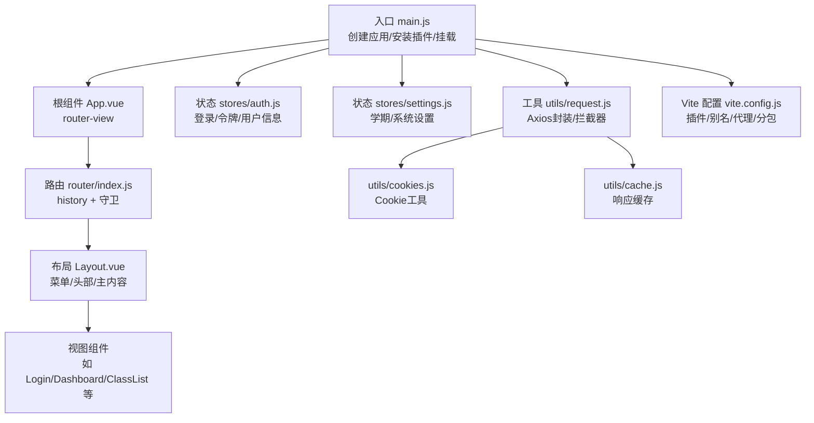
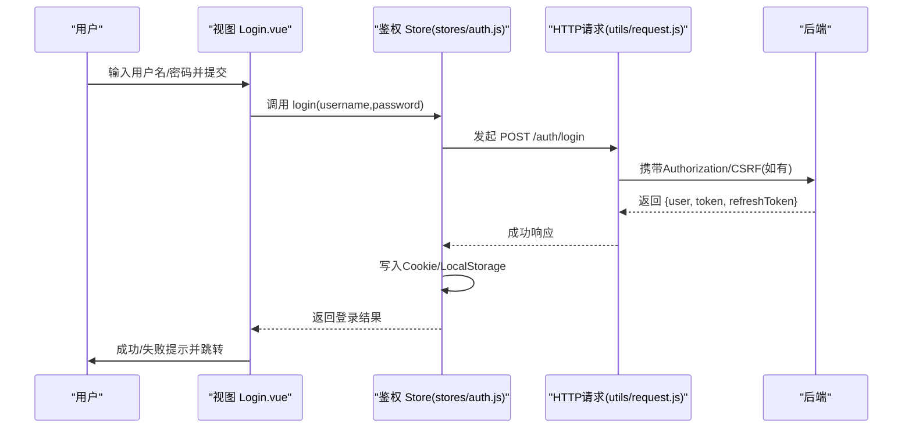
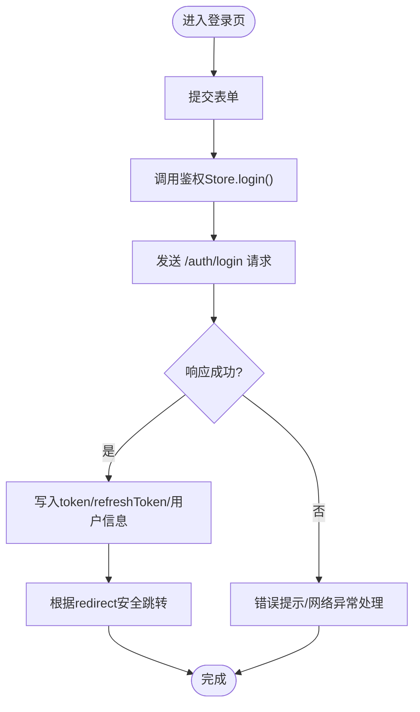
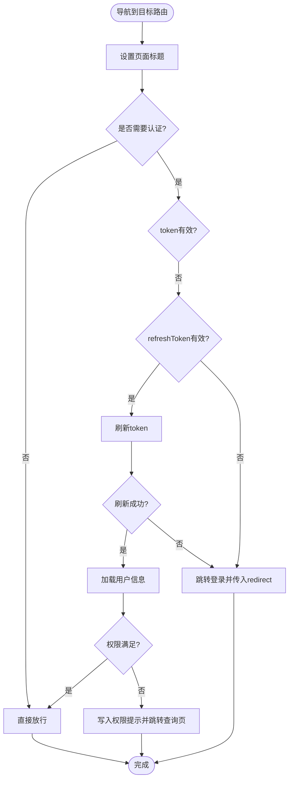
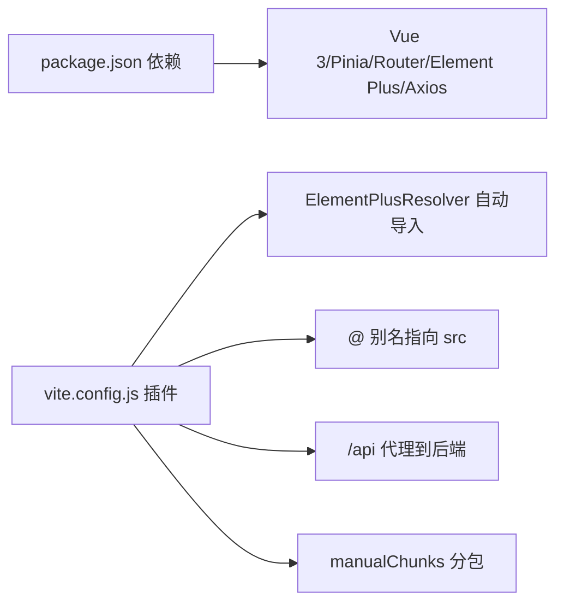

# 前端页面问题

<cite>
**本文引用的文件**
- [package.json](file://client/package.json)
- [vite.config.js](file://client/vite.config.js)
- [main.js](file://client/src/main.js)
- [App.vue](file://client/src/App.vue)
- [router/index.js](file://client/src/router/index.js)
- [stores/auth.js](file://client/src/stores/auth.js)
- [utils/request.js](file://client/src/utils/request.js)
- [components/Layout.vue](file://client/src/components/Layout.vue)
- [views/Login.vue](file://client/src/views/Login.vue)
- [views/NotFound.vue](file://client/src/views/NotFound.vue)
- [styles/global.css](file://client/src/styles/global.css)
- [composables/useCrudList.js](file://client/src/composables/useCrudList.js)
- [views/Dashboard.vue](file://client/src/views/Dashboard.vue)
- [views/class/ClassList.vue](file://client/src/views/class/ClassList.vue)
- [components/ChangePasswordDialog.vue](file://client/src/components/ChangePasswordDialog.vue)
- [stores/settings.js](file://client/src/stores/settings.js)
- [utils/cookies.js](file://client/src/utils/cookies.js)
- [utils/cache.js](file://client/src/utils/cache.js)
</cite>

## 目录
1. [简介](#简介)
2. [项目结构](#项目结构)
3. [核心组件](#核心组件)
4. [架构总览](#架构总览)
5. [详细组件分析](#详细组件分析)
6. [依赖分析](#依赖分析)
7. [性能考虑](#性能考虑)
8. [故障排除指南](#故障排除指南)
9. [结论](#结论)
10. [附录](#附录)

## 简介
本指南聚焦 KECCourse Manager 前端页面常见问题的诊断与修复，覆盖页面加载失败、组件渲染错误、路由跳转异常、状态管理异常、浏览器兼容性、Element Plus 组件样式冲突、以及 Vite 构建问题。文档基于仓库现有实现进行分析，提供可操作的排查步骤与建议。

## 项目结构
客户端采用 Vue 3 + Pinia + Element Plus + Vue Router + Vite 的现代前端栈，路由采用 history 模式，状态集中于 Pinia Store，HTTP 通信通过 Axios 封装并集成鉴权与自动刷新机制。

图表来源
- [main.js:1-115](file://client/src/main.js#L1-L115)
- [App.vue:1-4](file://client/src/App.vue#L1-L4)
- [router/index.js:1-244](file://client/src/router/index.js#L1-L244)
- [components/Layout.vue:1-369](file://client/src/components/Layout.vue#L1-L369)
- [stores/auth.js:1-222](file://client/src/stores/auth.js#L1-L222)
- [stores/settings.js:1-57](file://client/src/stores/settings.js#L1-L57)
- [utils/request.js:1-145](file://client/src/utils/request.js#L1-L145)
- [utils/cookies.js:1-66](file://client/src/utils/cookies.js#L1-L66)
- [utils/cache.js:1-122](file://client/src/utils/cache.js#L1-L122)
- [vite.config.js:1-56](file://client/vite.config.js#L1-L56)

章节来源
- [package.json:1-33](file://client/package.json#L1-L33)
- [vite.config.js:1-56](file://client/vite.config.js#L1-L56)
- [main.js:1-115](file://client/src/main.js#L1-L115)

## 核心组件
- 应用入口与全局配置：在入口中注册 Element Plus、安装路由与 Pinia，配置全局错误/警告处理器，并在鉴权初始化完成后挂载应用。
- 路由与守卫：统一设置页面标题、登录态校验、Token 刷新、权限判定（admin/super_admin/viewer），并处理异常降级。
- 状态管理：鉴权 Store 负责登录、刷新、用户信息持久化；设置 Store 负责学期与系统设置。
- HTTP 与拦截器：自动注入 Authorization 与 CSRF Token，401 自动刷新并重试，统一错误提示。
- 布局与视图：布局组件负责菜单、头部、主内容区与响应式样式；视图组件承载业务逻辑与交互。
- 工具函数：Cookie 工具保障安全标志；缓存工具提供 LRU 缓存与定期清理。

章节来源
- [main.js:1-115](file://client/src/main.js#L1-L115)
- [router/index.js:151-241](file://client/src/router/index.js#L151-L241)
- [stores/auth.js:1-222](file://client/src/stores/auth.js#L1-L222)
- [stores/settings.js:1-57](file://client/src/stores/settings.js#L1-L57)
- [utils/request.js:1-145](file://client/src/utils/request.js#L1-L145)
- [components/Layout.vue:1-369](file://client/src/components/Layout.vue#L1-L369)
- [utils/cookies.js:1-66](file://client/src/utils/cookies.js#L1-L66)
- [utils/cache.js:1-122](file://client/src/utils/cache.js#L1-L122)

## 架构总览
下面的序列图展示登录流程与鉴权刷新的关键调用链，有助于定位登录失败、Token 过期、权限不足等问题。

图表来源
- [views/Login.vue:118-149](file://client/src/views/Login.vue#L118-L149)
- [stores/auth.js:48-89](file://client/src/stores/auth.js#L48-L89)
- [utils/request.js:7-15](file://client/src/utils/request.js#L7-L15)

## 详细组件分析

### 登录与鉴权流程
- 登录成功后写入 Cookie 与 LocalStorage，并根据 redirect 参数安全跳转。
- 401 时自动尝试刷新 Access Token，若失败则清空认证状态并跳转登录。
- 权限不足时给出明确提示，避免白屏。

图表来源
- [views/Login.vue:118-149](file://client/src/views/Login.vue#L118-L149)
- [stores/auth.js:48-89](file://client/src/stores/auth.js#L48-L89)
- [utils/request.js:51-142](file://client/src/utils/request.js#L51-L142)

章节来源
- [views/Login.vue:1-411](file://client/src/views/Login.vue#L1-L411)
- [stores/auth.js:1-222](file://client/src/stores/auth.js#L1-L222)
- [utils/request.js:1-145](file://client/src/utils/request.js#L1-L145)

### 路由守卫与权限控制
- 设置页面标题、登录态校验、Token 刷新、用户信息加载、角色权限判断。
- 异常时安全降级至登录页，避免白屏。

图表来源
- [router/index.js:151-241](file://client/src/router/index.js#L151-L241)
- [stores/auth.js:106-151](file://client/src/stores/auth.js#L106-L151)

章节来源
- [router/index.js:1-244](file://client/src/router/index.js#L1-L244)
- [stores/auth.js:1-222](file://client/src/stores/auth.js#L1-L222)

### 布局与菜单
- 布局组件负责侧边栏折叠、响应式窗口监听、头部标题与用户信息展示、下拉菜单与修改密码弹窗。
- 使用 Element Plus 菜单组件，结合 Pinia 状态动态渲染不同角色菜单。

章节来源
- [components/Layout.vue:1-369](file://client/src/components/Layout.vue#L1-L369)

### 通用 CRUD 列表组合式函数
- 封装列表加载、对话框打开、保存、删除、静默刷新与排序移动。
- 统一错误提示与加载状态管理，便于复用。

章节来源
- [composables/useCrudList.js:1-121](file://client/src/composables/useCrudList.js#L1-L121)

### 仪表盘与班级管理
- 仪表盘根据当前学期加载统计数据并缓存，快捷操作跳转对应页面。
- 班级管理页面整合筛选器、表格、对话框、导入导出与批量操作，使用缓存与关系数据一次性加载策略。

章节来源
- [views/Dashboard.vue:1-680](file://client/src/views/Dashboard.vue#L1-L680)
- [views/class/ClassList.vue:1-610](file://client/src/views/class/ClassList.vue#L1-L610)

### 修改密码对话框
- 表单校验、提交、成功后登出并提示重新登录，保证会话安全。

章节来源
- [components/ChangePasswordDialog.vue:1-138](file://client/src/components/ChangePasswordDialog.vue#L1-L138)

## 依赖分析
- 构建与运行：Vite 插件自动导入 Element Plus 组件与图标，别名 @ 指向 src，开发服务器代理 /api 到后端。
- 运行时依赖：Vue 3、Vue Router、Pinia、Element Plus、Axios。
- 优化策略：Rollup 分包将 vue-vendor、element-plus、axios 等独立打包，提升缓存命中率。

图表来源
- [package.json:13-20](file://client/package.json#L13-L20)
- [vite.config.js:12-42](file://client/vite.config.js#L12-L42)

章节来源
- [package.json:1-33](file://client/package.json#L1-L33)
- [vite.config.js:1-56](file://client/vite.config.js#L1-L56)

## 性能考虑
- 响应式缓存：LRU Map 缓存 API 响应，限制最大条目，定期清理过期缓存，降低重复请求。
- 分包策略：将常用第三方库拆分为独立 chunk，减少首屏体积与重复下载。
- 图标按需注册：仅注册实际使用的图标，避免全量引入带来的体积膨胀。

章节来源
- [utils/cache.js:1-122](file://client/src/utils/cache.js#L1-L122)
- [vite.config.js:26-39](file://client/vite.config.js#L26-L39)
- [main.js:67-108](file://client/src/main.js#L67-L108)

## 故障排除指南

### 页面加载失败
- 症状：空白页、白屏、应用未挂载。
- 排查要点：
  - 检查入口是否在鉴权初始化完成后才挂载应用，避免初始化异常导致挂载失败。
  - 确认开发服务器端口与代理配置正确，确保 /api 能代理到后端。
  - 查看浏览器控制台是否存在模块解析错误或资源 404。
- 相关实现位置：
  - 应用挂载时机与鉴权初始化：[main.js:110-115](file://client/src/main.js#L110-L115)
  - 代理配置：[vite.config.js:46-54](file://client/vite.config.js#L46-L54)

章节来源
- [main.js:110-115](file://client/src/main.js#L110-L115)
- [vite.config.js:46-54](file://client/vite.config.js#L46-L54)

### 组件渲染错误
- 症状：组件不显示、样式错乱、图标不显示。
- 排查要点：
  - 确认 Element Plus 已全局安装并设置语言；图标按需注册。
  - 检查 scoped 样式与深度选择器是否正确作用于 Element Plus 组件。
  - 确认响应式数据在 onMounted 中初始化，避免在挂载前使用未定义数据。
- 相关实现位置：
  - 安装 Element Plus 与图标注册：[main.js:3-108](file://client/src/main.js#L3-L108)
  - 布局样式与深度选择器：[components/Layout.vue:208-368](file://client/src/components/Layout.vue#L208-L368)
  - 全局样式：[styles/global.css:1-204](file://client/src/styles/global.css#L1-L204)

章节来源
- [main.js:3-108](file://client/src/main.js#L3-L108)
- [components/Layout.vue:208-368](file://client/src/components/Layout.vue#L208-L368)
- [styles/global.css:1-204](file://client/src/styles/global.css#L1-L204)

### 路由跳转问题
- 症状：无法跳转、跳转到错误页面、刷新后回到登录页。
- 排查要点：
  - 登录页跳转使用安全校验，仅允许站内相对路径，防止开放重定向。
  - 路由守卫统一处理登录态、Token 刷新、权限判定，异常时降级到登录页。
  - 404 页面根据登录状态返回登录或查询页。
- 相关实现位置：
  - 登录跳转安全校验：[views/Login.vue:134-140](file://client/src/views/Login.vue#L134-L140)
  - 路由守卫：[router/index.js:151-241](file://client/src/router/index.js#L151-L241)
  - 404 视图：[views/NotFound.vue:1-35](file://client/src/views/NotFound.vue#L1-L35)

章节来源
- [views/Login.vue:134-140](file://client/src/views/Login.vue#L134-L140)
- [router/index.js:151-241](file://client/src/router/index.js#L151-L241)
- [views/NotFound.vue:1-35](file://client/src/views/NotFound.vue#L1-L35)

### 状态管理异常
- 症状：登录状态丢失、用户信息不更新、权限判断异常。
- 排查要点：
  - 鉴权 Store 初始化时处理 Token 过期与刷新，失败则清除状态。
  - 用户信息变更后同步更新 LocalStorage，避免跨页读取异常。
  - 设置 Store 对学期格式进行防御性校验，避免 NaN。
- 相关实现位置：
  - 鉴权初始化与刷新：[stores/auth.js:181-200](file://client/src/stores/auth.js#L181-L200)
  - 用户信息持久化：[stores/auth.js:59-66](file://client/src/stores/auth.js#L59-L66)
  - 学期格式校验：[stores/settings.js:28-44](file://client/src/stores/settings.js#L28-L44)

章节来源
- [stores/auth.js:181-200](file://client/src/stores/auth.js#L181-L200)
- [stores/auth.js:59-66](file://client/src/stores/auth.js#L59-L66)
- [stores/settings.js:28-44](file://client/src/stores/settings.js#L28-L44)

### 浏览器兼容性问题
- 症状：语法报错、API 不可用、样式不生效。
- 排查要点：
  - Vite 构建目标为 ES2022，确保目标浏览器支持相应语法。
  - 如需兼容旧版浏览器，可在 Vite 配置中调整 target 或引入必要 Polyfill。
  - 注意 CSS-in-JS 与深度选择器在不同浏览器下的表现差异。
- 相关实现位置：
  - 构建目标与优化：[vite.config.js:26-42](file://client/vite.config.js#L26-L42)

章节来源
- [vite.config.js:26-42](file://client/vite.config.js#L26-L42)

### Element Plus 组件常见问题与样式冲突
- 症状：组件不显示、样式错乱、滚动条样式异常。
- 排查要点：
  - 确保 Element Plus 已安装并正确设置语言。
  - 使用 :deep() 作用域选择器覆盖组件内部样式，注意与全局样式的优先级。
  - 图标需按需注册，避免全量引入导致体积过大。
- 相关实现位置：
  - 安装与语言设置：[main.js:3-6](file://client/src/main.js#L3-L6)
  - 深度选择器与滚动条样式：[components/Layout.vue:244-268](file://client/src/components/Layout.vue#L244-L268)
  - 全局样式规则：[styles/global.css:96-204](file://client/src/styles/global.css#L96-L204)

章节来源
- [main.js:3-6](file://client/src/main.js#L3-L6)
- [components/Layout.vue:244-268](file://client/src/components/Layout.vue#L244-L268)
- [styles/global.css:96-204](file://client/src/styles/global.css#L96-L204)

### Vite 构建问题
- 症状：模块解析错误、资源加载失败、chunk 加载失败。
- 排查要点：
  - 检查 @ 别名是否正确映射到 src。
  - 确认 manualChunks 配置是否合理，避免单个 chunk 过大。
  - 校验 optimizeDeps.include 是否包含运行时依赖。
  - 代理 /api 是否指向正确的后端地址。
- 相关实现位置：
  - 别名与分包：[vite.config.js:21-39](file://client/vite.config.js#L21-L39)
  - 依赖预构建：[vite.config.js:40-42](file://client/vite.config.js#L40-L42)
  - 代理配置：[vite.config.js:46-54](file://client/vite.config.js#L46-L54)

章节来源
- [vite.config.js:21-54](file://client/vite.config.js#L21-L54)

### HTTP 请求与鉴权
- 症状：401 未授权、403 权限不足、请求超时、CSRF 校验失败。
- 排查要点：
  - 请求拦截器自动附加 Authorization 与 CSRF Token。
  - 响应拦截器处理 401 自动刷新并重试，失败则提示并登出。
  - 统一错误提示，区分网络、超时、后端错误。
- 相关实现位置：
  - 请求拦截器：[utils/request.js:17-34](file://client/src/utils/request.js#L17-L34)
  - 响应拦截器与刷新：[utils/request.js:51-142](file://client/src/utils/request.js#L51-L142)
  - Cookie 工具：[utils/cookies.js:1-66](file://client/src/utils/cookies.js#L1-L66)

章节来源
- [utils/request.js:17-142](file://client/src/utils/request.js#L17-L142)
- [utils/cookies.js:1-66](file://client/src/utils/cookies.js#L1-L66)

### 缓存与性能
- 症状：数据不更新、内存占用过高、频繁重复请求。
- 排查要点：
  - 检查缓存键是否唯一、TTL 是否合理。
  - 定期清理过期缓存，避免内存泄漏。
  - 对于列表类数据，避免不必要的重复请求。
- 相关实现位置：
  - 缓存实现与清理：[utils/cache.js:16-122](file://client/src/utils/cache.js#L16-L122)

章节来源
- [utils/cache.js:16-122](file://client/src/utils/cache.js#L16-L122)

## 结论
本指南围绕 KEC 课程管理平台前端的常见问题提供了系统化的诊断思路与修复建议。通过理解应用入口、路由守卫、状态管理、HTTP 拦截器、Element Plus 样式与 Vite 构建等关键环节，可以快速定位并解决页面加载、组件渲染、路由跳转、状态异常、兼容性与构建问题。建议在开发与运维过程中持续关注这些关键点，以维持系统的稳定性与性能。

## 附录
- 术语说明
  - ES2022：JavaScript 语言版本，包含实验性特性与稳定特性。
  - manualChunks：Rollup 输出分包策略，将依赖拆分为独立 chunk。
  - :deep()：Vue scoped 样式深度选择器，用于穿透组件样式。
  - CSRF：跨站请求伪造，通过 X-CSRF-Token 头部进行防护。
- 参考文件
  - [main.js:1-115](file://client/src/main.js#L1-L115)
  - [router/index.js:1-244](file://client/src/router/index.js#L1-L244)
  - [stores/auth.js:1-222](file://client/src/stores/auth.js#L1-L222)
  - [utils/request.js:1-145](file://client/src/utils/request.js#L1-L145)
  - [components/Layout.vue:1-369](file://client/src/components/Layout.vue#L1-L369)
  - [views/Login.vue:1-411](file://client/src/views/Login.vue#L1-L411)
  - [views/NotFound.vue:1-35](file://client/src/views/NotFound.vue#L1-L35)
  - [styles/global.css:1-204](file://client/src/styles/global.css#L1-L204)
  - [composables/useCrudList.js:1-121](file://client/src/composables/useCrudList.js#L1-L121)
  - [views/Dashboard.vue:1-680](file://client/src/views/Dashboard.vue#L1-L680)
  - [views/class/ClassList.vue:1-610](file://client/src/views/class/ClassList.vue#L1-L610)
  - [components/ChangePasswordDialog.vue:1-138](file://client/src/components/ChangePasswordDialog.vue#L1-L138)
  - [stores/settings.js:1-57](file://client/src/stores/settings.js#L1-L57)
  - [utils/cookies.js:1-66](file://client/src/utils/cookies.js#L1-L66)
  - [utils/cache.js:1-122](file://client/src/utils/cache.js#L1-L122)
  - [vite.config.js:1-56](file://client/vite.config.js#L1-L56)
  - [package.json:1-33](file://client/package.json#L1-L33)