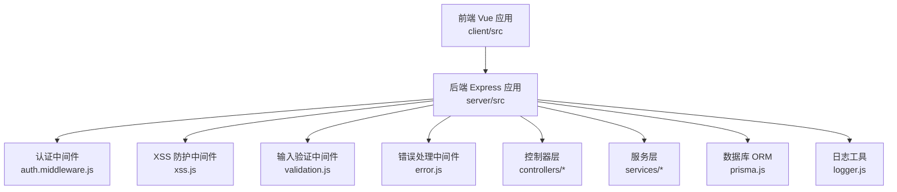
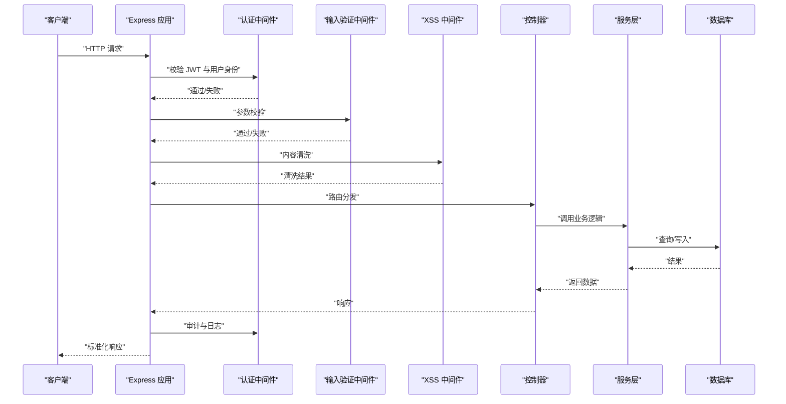
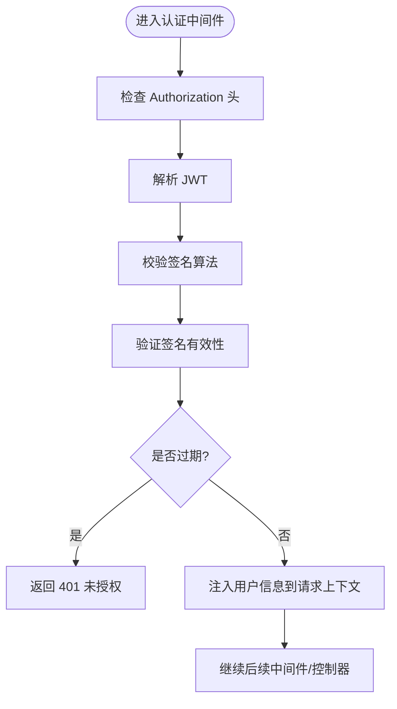
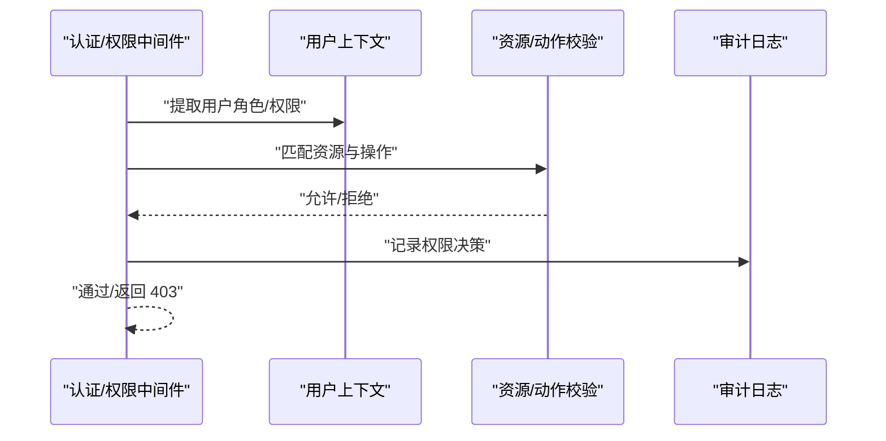
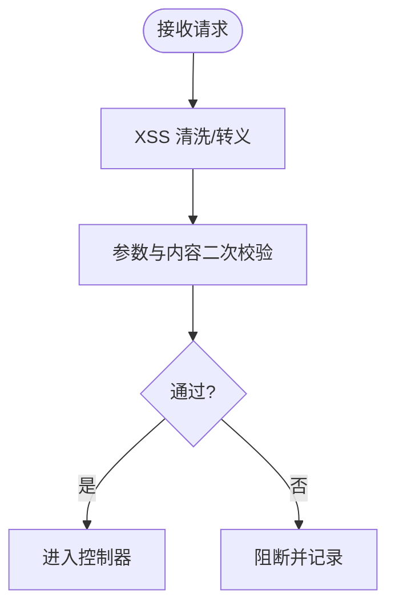
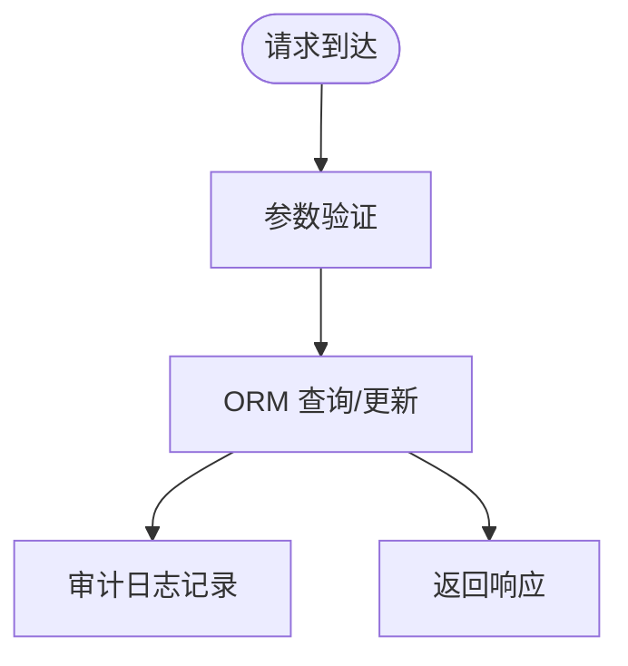
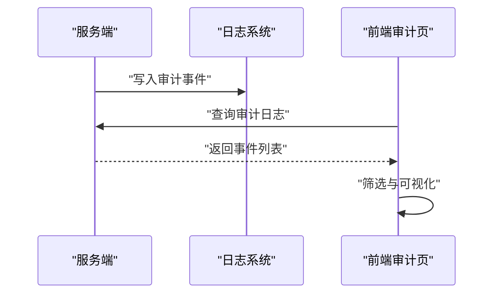
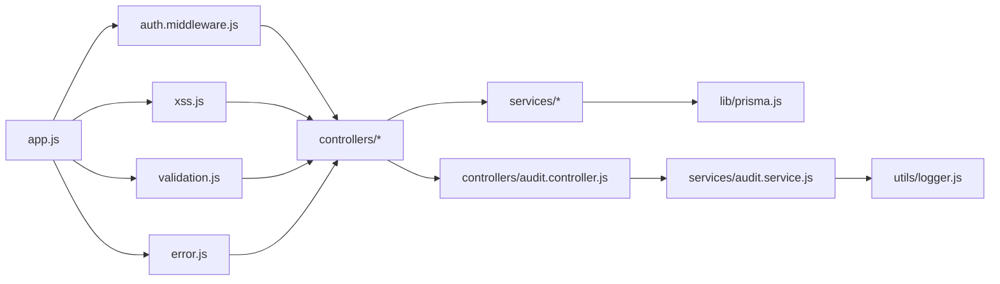

# 安全问题

<cite>
**本文引用的文件**
- [server/src/middleware/auth.middleware.js](file://server/src/middleware/auth.middleware.js)
- [server/src/middleware/xss.js](file://server/src/middleware/xss.js)
- [server/src/middleware/validation.js](file://server/src/middleware/validation.js)
- [server/src/middleware/validation-audit.js](file://server/src/middleware/validation-audit.js)
- [server/src/middleware/error.js](file://server/src/middleware/error.js)
- [server/src/config/auth.config.js](file://server/src/config/auth.config.js)
- [server/src/controllers/audit.controller.js](file://server/src/controllers/audit.controller.js)
- [server/src/services/audit.service.js](file://server/src/services/audit.service.js)
- [server/src/utils/logger.js](file://server/src/utils/logger.js)
- [server/src/routes/auth.routes.js](file://server/src/routes/auth.routes.js)
- [server/src/controllers/class.controller.js](file://server/src/controllers/class.controller.js)
- [server/src/controllers/course.controller.js](file://server/src/controllers/course.controller.js)
- [server/src/controllers/teacher.controller.js](file://server/src/controllers/teacher.controller.js)
- [server/src/controllers/textbook.controller.js](file://server/src/controllers/textbook.controller.js)
- [server/src/controllers/user.controller.js](file://server/src/controllers/user.controller.js)
- [server/src/controllers/settings.controller.js](file://server/src/controllers/settings.controller.js)
- [server/src/controllers/dashboard.controller.js](file://server/src/controllers/dashboard.controller.js)
- [server/src/controllers/teaching-arrange.controller.js](file://server/src/controllers/teaching-arrange.controller.js)
- [server/src/controllers/plan.controller.js](file://server/src/controllers/plan.controller.js)
- [server/src/controllers/query.controller.js](file://server/src/controllers/query.controller.js)
- [server/src/controllers/import.controller.js](file://server/src/controllers/import.controller.js)
- [server/src/controllers/export/data-export.controller.js](file://server/src/controllers/export/data-export.controller.js)
- [server/src/controllers/export/export-template.controller.js](file://server/src/controllers/export/export-template.controller.js)
- [server/src/controllers/export/semester-export.controller.js](file://server/src/controllers/export/semester-export.controller.js)
- [server/src/controllers/import/classes.js](file://server/src/controllers/import/classes.js)
- [server/src/controllers/import/courses.js](file://server/src/controllers/import/courses.js)
- [server/src/controllers/import/teachers.js](file://server/src/controllers/import/teachers.js)
- [server/src/controllers/import/textbooks.js](file://server/src/controllers/import/textbooks.js)
- [server/src/lib/prisma.js](file://server/src/lib/prisma.js)
- [server/src/app.js](file://server/src/app.js)
- [server/src/server.js](file://server/src/server.js)
- [client/src/stores/auth.js](file://client/src/stores/auth.js)
- [client/src/utils/request.js](file://client/src/utils/request.js)
- [client/src/views/Login.vue](file://client/src/views/Login.vue)
- [client/src/views/system/AuditLog.vue](file://client/src/views/system/AuditLog.vue)
- [server/prisma/schema.prisma](file://server/prisma/schema.prisma)
- [server/scripts/init-settings.js](file://server/scripts/init-settings.js)
- [server/scripts/reset-database.js](file://server/scripts/reset-database.js)
- [server/scripts/update-admin-password.js](file://server/scripts/update-admin-password.js)
</cite>

## 目录
1. [简介](#简介)
2. [项目结构](#项目结构)
3. [核心组件](#核心组件)
4. [架构总览](#架构总览)
5. [详细组件分析](#详细组件分析)
6. [依赖关系分析](#依赖关系分析)
7. [性能考虑](#性能考虑)
8. [故障排除指南](#故障排除指南)
9. [结论](#结论)
10. [附录](#附录)

## 简介
本指南聚焦于KEC课程管理平台的安全问题与故障排除，覆盖认证失败、权限拒绝、XSS与CSRF防护、文件上传安全、JWT令牌相关问题（过期、签名验证失败、刷新）、安全中间件配置与调试、输入验证与SQL注入防护、用户权限验证与调试、安全日志分析与异常行为检测，以及安全漏洞的应急响应流程与修复建议。文档以仓库中现有代码为依据，结合前后端交互与服务端中间件、控制器、服务层实现，提供可操作的排查步骤与最佳实践。

## 项目结构
后端采用Express应用，通过中间件进行统一安全处理，控制器负责业务路由，服务层封装数据访问与业务逻辑，Prisma作为ORM连接数据库；前端基于Vue 3，通过请求封装与状态管理与后端交互，并提供审计日志查看界面。

图表来源
- [server/src/app.js](file://server/src/app.js)
- [server/src/middleware/auth.middleware.js](file://server/src/middleware/auth.middleware.js)
- [server/src/middleware/xss.js](file://server/src/middleware/xss.js)
- [server/src/middleware/validation.js](file://server/src/middleware/validation.js)
- [server/src/middleware/error.js](file://server/src/middleware/error.js)
- [server/src/controllers/audit.controller.js](file://server/src/controllers/audit.controller.js)
- [server/src/services/audit.service.js](file://server/src/services/audit.service.js)
- [server/src/lib/prisma.js](file://server/src/lib/prisma.js)
- [server/src/utils/logger.js](file://server/src/utils/logger.js)

章节来源
- [server/src/app.js](file://server/src/app.js)
- [server/src/server.js](file://server/src/server.js)

## 核心组件
- 认证中间件：负责校验JWT、解析用户身份、注入到请求上下文，是权限控制与审计的基础。
- XSS防护中间件：对请求参数与响应内容进行清洗，降低反射型与存储型XSS风险。
- 输入验证中间件：统一校验请求参数类型、长度、格式，减少注入类攻击面。
- 错误处理中间件：标准化错误响应，避免敏感信息泄露。
- 审计日志：记录关键操作与异常事件，支持事后追踪与溯源。
- 文件上传与导入导出：限制文件类型与大小，校验内容合法性，防止恶意文件执行。

章节来源
- [server/src/middleware/auth.middleware.js](file://server/src/middleware/auth.middleware.js)
- [server/src/middleware/xss.js](file://server/src/middleware/xss.js)
- [server/src/middleware/validation.js](file://server/src/middleware/validation.js)
- [server/src/middleware/error.js](file://server/src/middleware/error.js)
- [server/src/controllers/audit.controller.js](file://server/src/controllers/audit.controller.js)
- [server/src/services/audit.service.js](file://server/src/services/audit.service.js)

## 架构总览
下图展示从客户端到服务端的关键安全路径：认证、输入验证、XSS防护、业务处理、审计与错误处理。

图表来源
- [server/src/app.js](file://server/src/app.js)
- [server/src/middleware/auth.middleware.js](file://server/src/middleware/auth.middleware.js)
- [server/src/middleware/validation.js](file://server/src/middleware/validation.js)
- [server/src/middleware/xss.js](file://server/src/middleware/xss.js)
- [server/src/controllers/audit.controller.js](file://server/src/controllers/audit.controller.js)
- [server/src/lib/prisma.js](file://server/src/lib/prisma.js)

## 详细组件分析

### 认证中间件与JWT故障排除
- 常见问题
  - 认证失败：令牌缺失、格式错误、签名无效、被篡改或伪造。
  - 令牌过期：过期时间已到，需刷新或重新登录。
  - 刷新失败：刷新令牌不可用或已被吊销。
- 排查步骤
  - 检查请求头是否携带有效的Authorization头。
  - 校验令牌签名算法与密钥配置一致。
  - 核对令牌有效期与服务器时钟同步。
  - 若使用刷新令牌，确认其未被撤销且在有效期内。
- 调试要点
  - 在认证中间件处打印解码后的载荷与签名状态。
  - 对比服务端配置与客户端生成策略（算法、密钥、过期时间）。
  - 关注控制器入口的日志审计，定位失败阶段。

图表来源
- [server/src/middleware/auth.middleware.js](file://server/src/middleware/auth.middleware.js)
- [server/src/config/auth.config.js](file://server/src/config/auth.config.js)

章节来源
- [server/src/middleware/auth.middleware.js](file://server/src/middleware/auth.middleware.js)
- [server/src/config/auth.config.js](file://server/src/config/auth.config.js)
- [server/src/routes/auth.routes.js](file://server/src/routes/auth.routes.js)
- [client/src/stores/auth.js](file://client/src/stores/auth.js)
- [client/src/utils/request.js](file://client/src/utils/request.js)

### 权限拒绝与用户权限验证
- 实现要点
  - 控制器按资源与动作定义最小权限集。
  - 中间件在进入控制器前完成角色/权限校验。
  - 审计日志记录权限决策与最终结果。
- 故障排除
  - 确认用户角色与目标资源的权限映射。
  - 检查中间件顺序与短路条件。
  - 查看审计日志中的“权限不足”事件，定位具体资源与操作。

图表来源
- [server/src/middleware/auth.middleware.js](file://server/src/middleware/auth.middleware.js)
- [server/src/controllers/audit.controller.js](file://server/src/controllers/audit.controller.js)

章节来源
- [server/src/middleware/auth.middleware.js](file://server/src/middleware/auth.middleware.js)
- [server/src/controllers/audit.controller.js](file://server/src/controllers/audit.controller.js)

### XSS攻击防护
- 防护策略
  - 统一在中间件中对输入与输出进行清洗与转义。
  - 对富文本场景限定白名单标签与属性。
  - 响应头设置Content-Security-Policy（如适用）。
- 故障排除
  - 确认XSS中间件在路由注册前加载。
  - 检查清洗规则是否过于宽松导致功能退化。
  - 回归测试常见XSS向量（脚本、事件处理器、协议逃逸）。

图表来源
- [server/src/middleware/xss.js](file://server/src/middleware/xss.js)
- [server/src/middleware/validation.js](file://server/src/middleware/validation.js)

章节来源
- [server/src/middleware/xss.js](file://server/src/middleware/xss.js)
- [server/src/middleware/validation.js](file://server/src/middleware/validation.js)

### CSRF攻击防护
- 防护策略
  - 启用同源策略与安全Cookie属性（HttpOnly、Secure、SameSite）。
  - 对有状态修改操作要求CSRF Token，且与会话绑定。
  - 严格校验Referer与Origin头部。
- 故障排除
  - 确认Token生成、下发与提交流程一致。
  - 检查跨域场景下的Token传递与校验逻辑。
  - 排查浏览器安全策略与第三方Cookie限制。

章节来源
- [server/src/middleware/auth.middleware.js](file://server/src/middleware/auth.middleware.js)
- [server/src/config/auth.config.js](file://server/src/config/auth.config.js)

### 文件上传安全
- 安全措施
  - 限制文件类型与大小，禁止可执行文件。
  - 存储路径随机化与只读访问控制。
  - 上传后进行病毒扫描与内容二次校验。
- 故障排除
  - 检查上传接口的中间件顺序与参数校验。
  - 确认文件名与路径拼接的安全性，避免目录穿越。
  - 核对Nginx/Docker挂载与权限设置。

章节来源
- [server/src/controllers/import.controller.js](file://server/src/controllers/import.controller.js)
- [server/src/controllers/export/data-export.controller.js](file://server/src/controllers/export/data-export.controller.js)
- [server/src/controllers/export/export-template.controller.js](file://server/src/controllers/export/export-template.controller.js)
- [server/src/controllers/export/semester-export.controller.js](file://server/src/controllers/export/semester-export.controller.js)
- [server/src/controllers/import/classes.js](file://server/src/controllers/import/classes.js)
- [server/src/controllers/import/courses.js](file://server/src/controllers/import/courses.js)
- [server/src/controllers/import/teachers.js](file://server/src/controllers/import/teachers.js)
- [server/src/controllers/import/textbooks.js](file://server/src/controllers/import/textbooks.js)

### 输入验证与SQL注入防护
- 验证策略
  - 使用中间件统一校验请求参数，拒绝非法类型与超长值。
  - 数据库访问通过ORM与参数化查询，避免原生SQL拼接。
  - 审计所有写操作，记录原始参数与最终SQL片段（脱敏）。
- 故障排除
  - 核对验证规则与业务期望是否一致。
  - 检查服务层是否直接拼接SQL字符串。
  - 结合审计日志定位可疑请求与异常参数。

图表来源
- [server/src/middleware/validation.js](file://server/src/middleware/validation.js)
- [server/src/lib/prisma.js](file://server/src/lib/prisma.js)
- [server/src/services/audit.service.js](file://server/src/services/audit.service.js)

章节来源
- [server/src/middleware/validation.js](file://server/src/middleware/validation.js)
- [server/src/lib/prisma.js](file://server/src/lib/prisma.js)
- [server/src/services/audit.service.js](file://server/src/services/audit.service.js)

### 安全日志分析与异常检测
- 日志内容
  - 认证与权限事件：登录、登出、权限不足、令牌刷新。
  - 关键业务操作：新增、修改、删除、导入导出。
  - 异常与错误：参数校验失败、数据库异常、中间件拦截。
- 分析方法
  - 设置阈值检测异常登录IP、频繁权限不足、异常文件类型。
  - 使用审计控制器提供的查询接口筛选高危事件。
  - 结合前端审计日志页面进行可视化核验。

图表来源
- [server/src/controllers/audit.controller.js](file://server/src/controllers/audit.controller.js)
- [server/src/services/audit.service.js](file://server/src/services/audit.service.js)
- [client/src/views/system/AuditLog.vue](file://client/src/views/system/AuditLog.vue)

章节来源
- [server/src/controllers/audit.controller.js](file://server/src/controllers/audit.controller.js)
- [server/src/services/audit.service.js](file://server/src/services/audit.service.js)
- [client/src/views/system/AuditLog.vue](file://client/src/views/system/AuditLog.vue)

### 安全中间件配置与调试
- 配置清单
  - 认证：算法、密钥、过期时间、刷新窗口。
  - XSS：清洗规则、白名单、转义策略。
  - 输入验证：字段规则、范围、格式、必填。
  - 错误处理：错误码、消息脱敏、堆栈控制。
- 调试方法
  - 在中间件入口打印请求摘要与校验结果。
  - 使用单元测试覆盖边界条件与异常分支。
  - 逐步启用/禁用中间件定位问题范围。

章节来源
- [server/src/middleware/auth.middleware.js](file://server/src/middleware/auth.middleware.js)
- [server/src/middleware/xss.js](file://server/src/middleware/xss.js)
- [server/src/middleware/validation.js](file://server/src/middleware/validation.js)
- [server/src/middleware/error.js](file://server/src/middleware/error.js)

## 依赖关系分析
后端应用通过中间件串联安全能力，控制器与服务层承担业务职责，Prisma提供数据访问抽象，日志工具贯穿全链路。

图表来源
- [server/src/app.js](file://server/src/app.js)
- [server/src/middleware/auth.middleware.js](file://server/src/middleware/auth.middleware.js)
- [server/src/middleware/xss.js](file://server/src/middleware/xss.js)
- [server/src/middleware/validation.js](file://server/src/middleware/validation.js)
- [server/src/middleware/error.js](file://server/src/middleware/error.js)
- [server/src/controllers/audit.controller.js](file://server/src/controllers/audit.controller.js)
- [server/src/services/audit.service.js](file://server/src/services/audit.service.js)
- [server/src/lib/prisma.js](file://server/src/lib/prisma.js)
- [server/src/utils/logger.js](file://server/src/utils/logger.js)

章节来源
- [server/src/app.js](file://server/src/app.js)

## 性能考虑
- 中间件链路尽量短小精悍，避免重复校验。
- 审计日志异步写入，必要时落盘或队列缓冲。
- 缓存热点查询结果，但注意缓存键的权限隔离。
- 导入导出任务异步化，限制并发与内存占用。

## 故障排除指南

### 认证失败
- 现象
  - 返回401未授权或提示令牌无效。
- 排查清单
  - 检查请求头Authorization是否正确携带。
  - 核对JWT签名算法与密钥配置。
  - 确认令牌未过期，服务器时间同步。
  - 若使用刷新令牌，确认其可用性与撤销状态。
- 参考实现
  - [server/src/middleware/auth.middleware.js](file://server/src/middleware/auth.middleware.js)
  - [server/src/config/auth.config.js](file://server/src/config/auth.config.js)
  - [server/src/routes/auth.routes.js](file://server/src/routes/auth.routes.js)

章节来源
- [server/src/middleware/auth.middleware.js](file://server/src/middleware/auth.middleware.js)
- [server/src/config/auth.config.js](file://server/src/config/auth.config.js)
- [server/src/routes/auth.routes.js](file://server/src/routes/auth.routes.js)

### 权限拒绝
- 现象
  - 返回403禁止访问。
- 排查清单
  - 确认用户角色与目标资源权限映射。
  - 检查中间件顺序与短路条件。
  - 查看审计日志中的“权限不足”事件。
- 参考实现
  - [server/src/middleware/auth.middleware.js](file://server/src/middleware/auth.middleware.js)
  - [server/src/controllers/audit.controller.js](file://server/src/controllers/audit.controller.js)

章节来源
- [server/src/middleware/auth.middleware.js](file://server/src/middleware/auth.middleware.js)
- [server/src/controllers/audit.controller.js](file://server/src/controllers/audit.controller.js)

### XSS攻击防护
- 现象
  - 页面出现脚本执行或重定向。
- 排查清单
  - 确认XSS中间件在路由前加载。
  - 检查清洗规则与白名单配置。
  - 回归测试常见XSS向量。
- 参考实现
  - [server/src/middleware/xss.js](file://server/src/middleware/xss.js)
  - [server/src/middleware/validation.js](file://server/src/middleware/validation.js)

章节来源
- [server/src/middleware/xss.js](file://server/src/middleware/xss.js)
- [server/src/middleware/validation.js](file://server/src/middleware/validation.js)

### CSRF攻击防护
- 现象
  - 登录/修改操作被拒绝或出现跨站请求。
- 排查清单
  - 确认CSRF Token生成与提交一致。
  - 检查Referer/Origin校验与跨域策略。
  - 核对Cookie安全属性（HttpOnly、Secure、SameSite）。
- 参考实现
  - [server/src/middleware/auth.middleware.js](file://server/src/middleware/auth.middleware.js)
  - [server/src/config/auth.config.js](file://server/src/config/auth.config.js)

章节来源
- [server/src/middleware/auth.middleware.js](file://server/src/middleware/auth.middleware.js)
- [server/src/config/auth.config.js](file://server/src/config/auth.config.js)

### 文件上传安全
- 现象
  - 上传被拒绝、文件类型不符或存在风险。
- 排查清单
  - 检查上传接口的中间件顺序与参数校验。
  - 确认文件名与路径拼接安全性。
  - 核对存储权限与挂载配置。
- 参考实现
  - [server/src/controllers/import.controller.js](file://server/src/controllers/import.controller.js)
  - [server/src/controllers/export/data-export.controller.js](file://server/src/controllers/export/data-export.controller.js)
  - [server/src/controllers/export/export-template.controller.js](file://server/src/controllers/export/export-template.controller.js)
  - [server/src/controllers/export/semester-export.controller.js](file://server/src/controllers/export/semester-export.controller.js)
  - [server/src/controllers/import/classes.js](file://server/src/controllers/import/classes.js)
  - [server/src/controllers/import/courses.js](file://server/src/controllers/import/courses.js)
  - [server/src/controllers/import/teachers.js](file://server/src/controllers/import/teachers.js)
  - [server/src/controllers/import/textbooks.js](file://server/src/controllers/import/textbooks.js)

章节来源
- [server/src/controllers/import.controller.js](file://server/src/controllers/import.controller.js)
- [server/src/controllers/export/data-export.controller.js](file://server/src/controllers/export/data-export.controller.js)
- [server/src/controllers/export/export-template.controller.js](file://server/src/controllers/export/export-template.controller.js)
- [server/src/controllers/export/semester-export.controller.js](file://server/src/controllers/export/semester-export.controller.js)
- [server/src/controllers/import/classes.js](file://server/src/controllers/import/classes.js)
- [server/src/controllers/import/courses.js](file://server/src/controllers/import/courses.js)
- [server/src/controllers/import/teachers.js](file://server/src/controllers/import/teachers.js)
- [server/src/controllers/import/textbooks.js](file://server/src/controllers/import/textbooks.js)

### 输入验证与SQL注入防护
- 现象
  - 参数校验失败、数据库报错或异常行为。
- 排查清单
  - 核对验证规则与业务期望。
  - 检查服务层是否使用ORM与参数化查询。
  - 结合审计日志定位可疑请求。
- 参考实现
  - [server/src/middleware/validation.js](file://server/src/middleware/validation.js)
  - [server/src/lib/prisma.js](file://server/src/lib/prisma.js)
  - [server/src/services/audit.service.js](file://server/src/services/audit.service.js)

章节来源
- [server/src/middleware/validation.js](file://server/src/middleware/validation.js)
- [server/src/lib/prisma.js](file://server/src/lib/prisma.js)
- [server/src/services/audit.service.js](file://server/src/services/audit.service.js)

### 安全日志分析与异常检测
- 现象
  - 无法定位异常事件或缺少审计证据。
- 排查清单
  - 设置阈值检测异常登录IP、频繁权限不足、异常文件类型。
  - 使用审计控制器查询接口筛选高危事件。
  - 在前端审计日志页面进行可视化核验。
- 参考实现
  - [server/src/controllers/audit.controller.js](file://server/src/controllers/audit.controller.js)
  - [server/src/services/audit.service.js](file://server/src/services/audit.service.js)
  - [client/src/views/system/AuditLog.vue](file://client/src/views/system/AuditLog.vue)

章节来源
- [server/src/controllers/audit.controller.js](file://server/src/controllers/audit.controller.js)
- [server/src/services/audit.service.js](file://server/src/services/audit.service.js)
- [client/src/views/system/AuditLog.vue](file://client/src/views/system/AuditLog.vue)

### 应急响应流程与修复建议
- 流程
  - 快速隔离受影响实例，封禁高危IP与异常账号。
  - 全量回滚最近变更，恢复备份。
  - 修复漏洞（升级依赖、修正配置、补丁中间件）。
  - 开启严格审计与告警，持续监控。
  - 发布安全公告与用户通知。
- 建议
  - 引入自动化渗透测试与依赖漏洞扫描。
  - 建立灰度发布与回滚机制。
  - 加强开发与运维人员的安全培训。

## 结论
本指南基于仓库现有实现，提供了从认证、权限、输入验证、XSS/CSRF防护到文件上传与审计日志的完整故障排除路径。建议在生产环境中持续完善中间件配置、强化日志与告警、定期演练应急响应，确保系统安全稳定运行。

## 附录
- 数据库初始化与系统设置脚本
  - [server/scripts/init-settings.js](file://server/scripts/init-settings.js)
  - [server/scripts/reset-database.js](file://server/scripts/reset-database.js)
  - [server/scripts/update-admin-password.js](file://server/scripts/update-admin-password.js)
- Prisma Schema
  - [server/prisma/schema.prisma](file://server/prisma/schema.prisma)