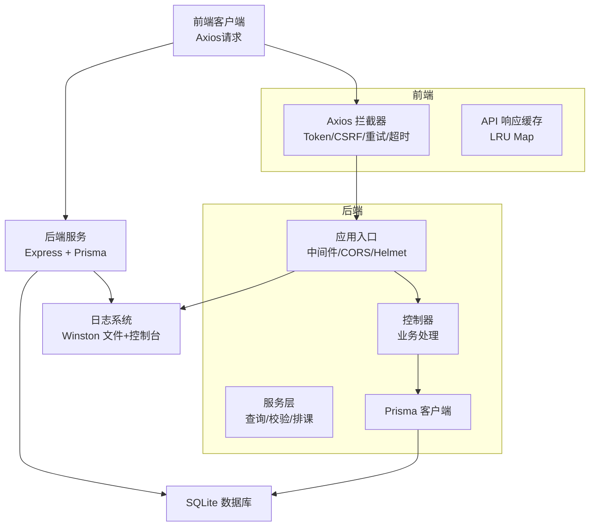
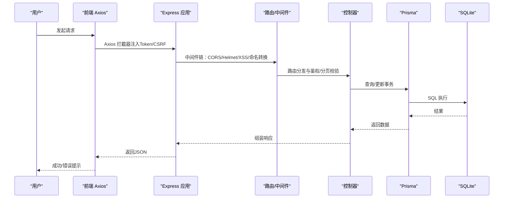
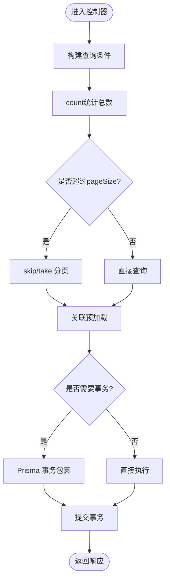
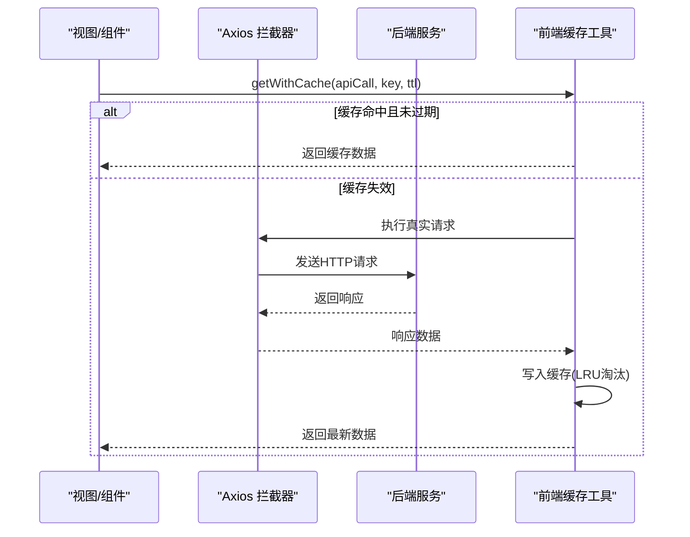
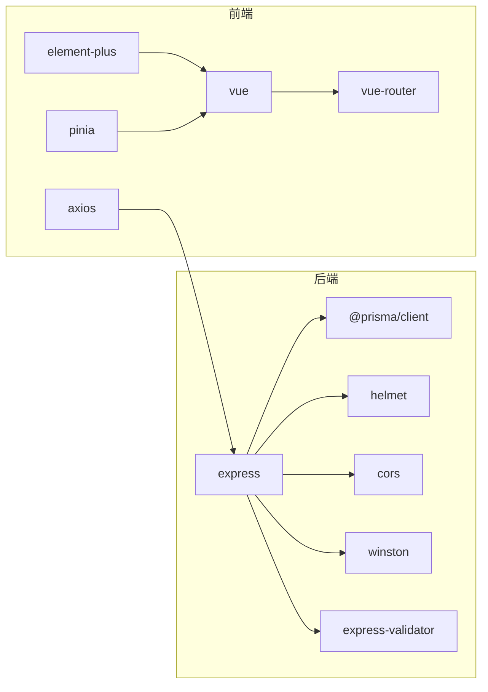

# 性能问题

<cite>
**本文引用的文件**
- [server/src/app.js](file://server/src/app.js)
- [server/src/lib/prisma.js](file://server/src/lib/prisma.js)
- [server/prisma/schema.prisma](file://server/prisma/schema.prisma)
- [server/src/middleware/pagination.js](file://server/src/middleware/pagination.js)
- [server/src/utils/logger.js](file://server/src/utils/logger.js)
- [server/src/controllers/class.controller.js](file://server/src/controllers/class.controller.js)
- [server/src/controllers/course.controller.js](file://server/src/controllers/course.controller.js)
- [server/src/routes/class.routes.js](file://server/src/routes/class.routes.js)
- [server/src/routes/course.routes.js](file://server/src/routes/course.routes.js)
- [client/src/utils/request.js](file://client/src/utils/request.js)
- [client/src/utils/cache.js](file://client/src/utils/cache.js)
- [client/package.json](file://client/package.json)
- [server/package.json](file://server/package.json)
</cite>

## 目录
1. [简介](#简介)
2. [项目结构](#项目结构)
3. [核心组件](#核心组件)
4. [架构总览](#架构总览)
5. [详细组件分析](#详细组件分析)
6. [依赖关系分析](#依赖关系分析)
7. [性能考量](#性能考量)
8. [故障排除指南](#故障排除指南)
9. [结论](#结论)
10. [附录](#附录)

## 简介
本指南聚焦于KEC课程管理平台的性能问题排查与优化，覆盖数据库查询、内存与CPU占用、并发访问、缓存策略、大数据量处理以及高可用部署建议。文档基于仓库中的实际代码与配置，提供可落地的定位步骤、监控手段与优化策略。

## 项目结构
系统采用前后端分离架构：
- 前端（Vue 3 + Element Plus）通过Axios发起API请求，默认指向后端“/api”路径。
- 后端（Express + Prisma）提供REST接口，内置日志、CORS、Helmet、XSS清洗、分页校验等中间件，并对健康检查、审计日志进行统一处理。
- 数据层使用SQLite（Prisma Client），模型定义包含大量索引以支撑查询。

图表来源
- [server/src/app.js:1-158](file://server/src/app.js#L1-L158)
- [client/src/utils/request.js:1-145](file://client/src/utils/request.js#L1-L145)
- [server/src/lib/prisma.js:1-34](file://server/src/lib/prisma.js#L1-L34)

章节来源
- [server/src/app.js:1-158](file://server/src/app.js#L1-L158)
- [client/src/utils/request.js:1-145](file://client/src/utils/request.js#L1-L145)
- [server/src/lib/prisma.js:1-34](file://server/src/lib/prisma.js#L1-L34)

## 核心组件
- 应用入口与中间件链：负责CORS、Helmet、命名转换、XSS清洗、日志、健康检查、路由挂载与错误处理。
- 数据访问层：Prisma Client封装，开发/生产日志级别区分，事件监听。
- 控制器与路由：统一分页校验、鉴权与角色中间件、XSS清洗；业务控制器执行查询、事务与审计日志。
- 前端请求与缓存：Axios拦截器统一注入Token与CSRF，处理401刷新与错误提示；前端提供API响应缓存工具，限制最大缓存条目与TTL。

章节来源
- [server/src/app.js:1-158](file://server/src/app.js#L1-L158)
- [server/src/lib/prisma.js:1-34](file://server/src/lib/prisma.js#L1-L34)
- [server/src/middleware/pagination.js:1-31](file://server/src/middleware/pagination.js#L1-L31)
- [server/src/controllers/class.controller.js:1-464](file://server/src/controllers/class.controller.js#L1-L464)
- [server/src/controllers/course.controller.js:1-142](file://server/src/controllers/course.controller.js#L1-L142)
- [client/src/utils/request.js:1-145](file://client/src/utils/request.js#L1-L145)
- [client/src/utils/cache.js:1-122](file://client/src/utils/cache.js#L1-L122)

## 架构总览
后端通过中间件链统一处理请求生命周期，控制器负责具体业务，Prisma负责数据访问，日志系统记录运行状态与审计信息。前端通过Axios与后端交互，具备基础的缓存与错误处理能力。

图表来源
- [server/src/app.js:1-158](file://server/src/app.js#L1-L158)
- [server/src/routes/class.routes.js:1-34](file://server/src/routes/class.routes.js#L1-L34)
- [server/src/controllers/class.controller.js:1-464](file://server/src/controllers/class.controller.js#L1-L464)
- [server/src/lib/prisma.js:1-34](file://server/src/lib/prisma.js#L1-L34)

## 详细组件分析

### 数据库访问与查询优化
- Prisma配置：开发环境开启错误与警告事件监听，生产环境仅错误事件，便于定位慢查询与异常。
- 模型索引：schema中为多表建立复合与单列索引，有助于过滤、排序与关联查询。
- 控制器示例：班级列表查询使用分页skip/take，count与findMany组合，避免一次性拉取全部数据；同时预加载必要关联字段，减少N+1查询风险。
- 事务与一致性：更新班级时将级联删除排课记录置于同一事务，保证原子性，降低后续查询复杂度。

图表来源
- [server/src/controllers/class.controller.js:45-242](file://server/src/controllers/class.controller.js#L45-L242)
- [server/prisma/schema.prisma:1-308](file://server/prisma/schema.prisma#L1-L308)
- [server/src/lib/prisma.js:1-34](file://server/src/lib/prisma.js#L1-L34)

章节来源
- [server/src/lib/prisma.js:1-34](file://server/src/lib/prisma.js#L1-L34)
- [server/prisma/schema.prisma:1-308](file://server/prisma/schema.prisma#L1-L308)
- [server/src/controllers/class.controller.js:1-464](file://server/src/controllers/class.controller.js#L1-L464)

### 前端请求与缓存
- Axios拦截器：自动注入Authorization与CSRF Token；统一处理401刷新、403权限不足、超时与网络错误，提升用户体验与稳定性。
- 前端缓存工具：提供Map实现的LRU缓存，支持TTL、定期清理、最大容量淘汰，适合轻量API响应复用，缓解后端压力。

图表来源
- [client/src/utils/request.js:1-145](file://client/src/utils/request.js#L1-L145)
- [client/src/utils/cache.js:1-122](file://client/src/utils/cache.js#L1-L122)

章节来源
- [client/src/utils/request.js:1-145](file://client/src/utils/request.js#L1-L145)
- [client/src/utils/cache.js:1-122](file://client/src/utils/cache.js#L1-L122)

### 分页与并发控制
- 分页中间件：统一校验page/pageSize范围，防止过大请求导致内存与CPU压力。
- 路由层：对GET列表接口启用分页校验，结合Prisma skip/take实现可控数据量返回。
- 并发与限流：后端依赖express-rate-limit依赖（见server/package.json），可在部署层增加速率限制策略，避免突发流量冲击。

章节来源
- [server/src/middleware/pagination.js:1-31](file://server/src/middleware/pagination.js#L1-L31)
- [server/src/routes/class.routes.js:1-34](file://server/src/routes/class.routes.js#L1-L34)
- [server/package.json:1-53](file://server/package.json#L1-L53)

### 日志与健康检查
- Winston日志：统一格式化、文件轮转、审计日志通道，生产/开发环境分别输出至文件与控制台。
- 健康检查：/api/health执行简单查询验证数据库连通性，返回标准化状态，便于Kubernetes/负载均衡探活。

章节来源
- [server/src/utils/logger.js:1-96](file://server/src/utils/logger.js#L1-L96)
- [server/src/app.js:94-113](file://server/src/app.js#L94-L113)

## 依赖关系分析
- 前端依赖：axios、element-plus、pinia、vue、vue-router等，Axios作为HTTP客户端。
- 后端依赖：express、@prisma/client、helmet、cors、winston、express-validator、xlsx等，Prisma负责ORM与日志。
- 关键耦合点：控制器依赖Prisma；路由依赖中间件；前端依赖后端API与Axios拦截器。

图表来源
- [client/package.json:1-33](file://client/package.json#L1-L33)
- [server/package.json:1-53](file://server/package.json#L1-L53)

章节来源
- [client/package.json:1-33](file://client/package.json#L1-L33)
- [server/package.json:1-53](file://server/package.json#L1-L53)

## 性能考量
- 数据库查询
  - 使用索引：schema中已为常用过滤/排序字段建立索引，建议结合EXPLAIN/ANALYZE确认执行计划。
  - 分页与投影：控制器中使用count+skip/take，避免一次性拉取全部数据；仅select所需字段，减少序列化开销。
  - 事务与锁：对涉及级联删除/更新的场景使用事务，减少后续查询复杂度与竞态。
- 内存与CPU
  - 前端缓存：LRU Map限制最大容量与TTL，定期清理，避免内存泄漏。
  - 后端日志：生产环境仅错误事件，避免高频日志写盘造成I/O压力。
- 并发访问
  - 分页校验：防止page/pageSize过大导致内存与CPU飙升。
  - 限流：结合express-rate-limit在部署层限制请求频率。
- 缓存策略
  - 前端：API响应缓存（TTL/LRU），适合静态/低频变更数据。
  - 后端：可引入Redis缓存热点数据（如枚举、配置、统计聚合），注意缓存失效策略与双写一致性。
  - CDN/静态资源：前端构建产物交由Nginx/CDN缓存，减少后端带宽压力。
- 大数据量处理
  - 分页查询：列表接口强制分页，避免一次性返回过多数据。
  - 批量操作：后端提供批量导入/排课等接口，前端拆分批次提交，避免单次请求过大。
  - 异步处理：对于耗时任务（报表导出、大规模导入），采用后台任务队列（如Redis+Worker），前端轮询或通知机制反馈进度。

## 故障排除指南

### 1. 数据库查询慢
- 快速定位
  - 查看Prisma错误/警告事件日志，关注慢查询与异常。
  - 在数据库侧执行EXPLAIN/ANALYZE，确认索引使用情况与执行计划。
- 优化建议
  - 确认where条件与orderBy字段是否命中索引；必要时补充复合索引。
  - 将频繁使用的过滤条件加入索引；避免在WHERE中对索引列做函数运算。
  - 控制返回字段数量，使用select投影；避免N+1查询。
  - 对大结果集使用分页，避免一次性拉取全部数据。
- 监控与分析
  - 使用Winston日志定位异常SQL与错误堆栈。
  - 健康检查接口用于快速判断数据库连通性。

章节来源
- [server/src/lib/prisma.js:1-34](file://server/src/lib/prisma.js#L1-L34)
- [server/prisma/schema.prisma:1-308](file://server/prisma/schema.prisma#L1-L308)
- [server/src/utils/logger.js:1-96](file://server/src/utils/logger.js#L1-L96)
- [server/src/app.js:94-113](file://server/src/app.js#L94-L113)

### 2. 内存泄漏
- 前端
  - 使用LRU缓存工具，设置最大容量与TTL，定期清理过期条目。
  - 页面卸载时停止定时器，避免悬挂任务。
- 后端
  - 控制日志级别，生产环境仅错误事件，避免高频日志写盘。
  - 确保中间件与路由正确释放资源，避免闭包持有大对象。

章节来源
- [client/src/utils/cache.js:1-122](file://client/src/utils/cache.js#L1-L122)
- [server/src/lib/prisma.js:1-34](file://server/src/lib/prisma.js#L1-L34)

### 3. CPU占用过高
- 前端
  - 减少不必要的重复请求，利用API响应缓存。
  - 避免在渲染阶段进行昂贵计算，将计算移至后台或缓存结果。
- 后端
  - 限制page/pageSize，防止超大请求。
  - 使用事务合并相关写操作，减少多次往返。
  - 控制日志输出级别，避免高频写盘。

章节来源
- [client/src/utils/cache.js:1-122](file://client/src/utils/cache.js#L1-L122)
- [server/src/middleware/pagination.js:1-31](file://server/src/middleware/pagination.js#L1-L31)
- [server/src/controllers/class.controller.js:366-383](file://server/src/controllers/class.controller.js#L366-L383)

### 4. 并发访问问题
- 限流与熔断
  - 在部署层启用速率限制，避免突发流量导致服务过载。
- 请求处理
  - 前端Axios拦截器统一处理401刷新与错误提示，避免重复请求风暴。
  - 后端路由对敏感接口启用鉴权与角色中间件，减少无效请求。

章节来源
- [server/src/app.js:1-158](file://server/src/app.js#L1-L158)
- [client/src/utils/request.js:1-145](file://client/src/utils/request.js#L1-L145)
- [server/package.json:1-53](file://server/package.json#L1-L53)

### 5. 缓存策略优化
- Redis（建议）
  - 缓存热点数据（如枚举、配置、统计聚合），设置合理TTL与失效策略。
  - 对写操作采用“先删后写”或“写后失效”，保证一致性。
- 浏览器缓存
  - 前端构建产物交由Nginx/CDN缓存，减少后端带宽压力。
- API响应缓存
  - 前端使用LRU Map缓存，设置最大容量与TTL，定期清理过期条目。

章节来源
- [client/src/utils/cache.js:1-122](file://client/src/utils/cache.js#L1-L122)

### 6. 大数据量处理最佳实践
- 分页查询：列表接口强制分页，避免一次性返回过多数据。
- 批量操作：拆分批次提交，避免单次请求过大。
- 异步处理：耗时任务采用后台队列，前端轮询或通知反馈进度。

章节来源
- [server/src/middleware/pagination.js:1-31](file://server/src/middleware/pagination.js#L1-L31)
- [server/src/routes/class.routes.js:21-21](file://server/src/routes/class.routes.js#L21-L21)

### 7. 负载均衡与高可用
- 健康检查：使用/health接口进行探活，确保LB只转发健康实例。
- 静态资源：前端构建产物交由Nginx/CDN缓存，减轻后端压力。
- 会话与CSRF：启用withCredentials与CSRF Token，配合CORS白名单，保障跨域安全。

章节来源
- [server/src/app.js:94-113](file://server/src/app.js#L94-L113)
- [client/src/utils/request.js:1-145](file://client/src/utils/request.js#L1-L145)

## 结论
通过对中间件链、控制器、Prisma配置与前端缓存工具的综合分析，本指南提供了针对数据库慢查询、内存/CPU压力、并发访问与大数据量处理的系统化排查与优化路径。建议在生产环境引入Redis缓存、限流策略与CDN加速，并持续通过日志与健康检查监控系统状态。

## 附录
- 健康检查接口：/api/health，用于快速判断数据库连通性。
- 分页校验：路由层统一校验page/pageSize，结合Prisma skip/take实现可控数据量返回。
- 日志配置：Winston统一格式化、文件轮转与审计通道，生产/开发环境差异化输出。

章节来源
- [server/src/app.js:94-113](file://server/src/app.js#L94-L113)
- [server/src/middleware/pagination.js:1-31](file://server/src/middleware/pagination.js#L1-L31)
- [server/src/utils/logger.js:1-96](file://server/src/utils/logger.js#L1-L96)