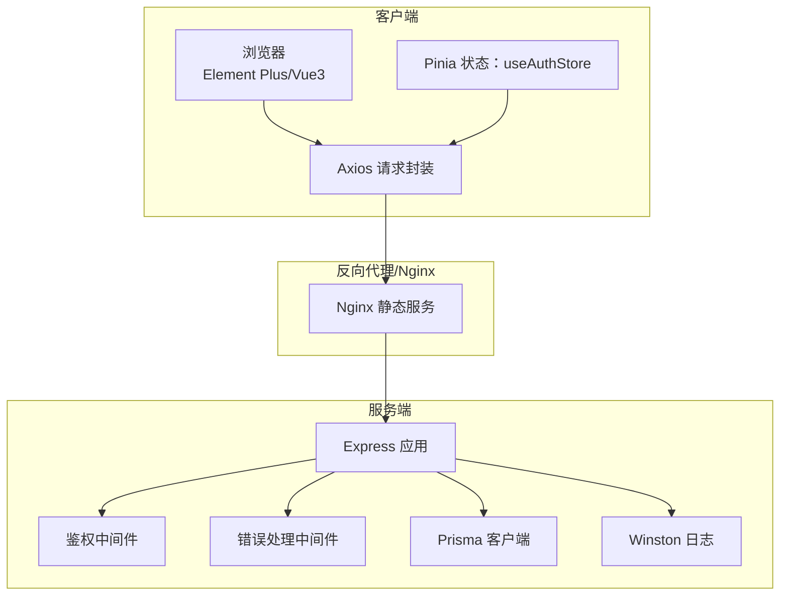
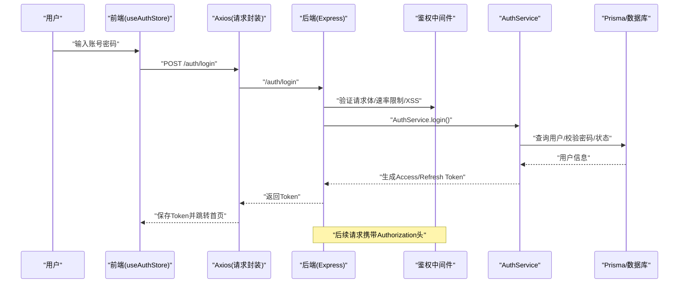
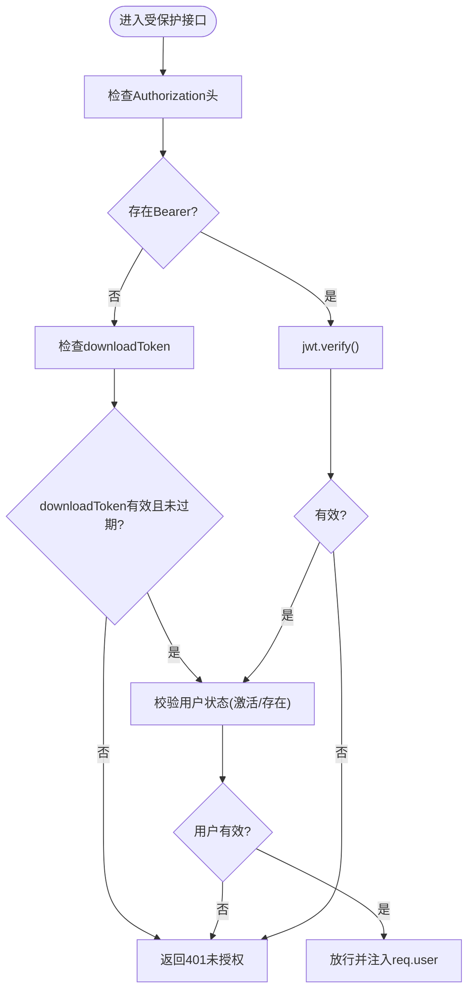
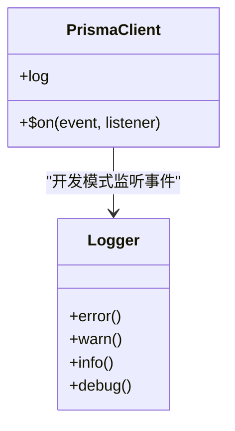
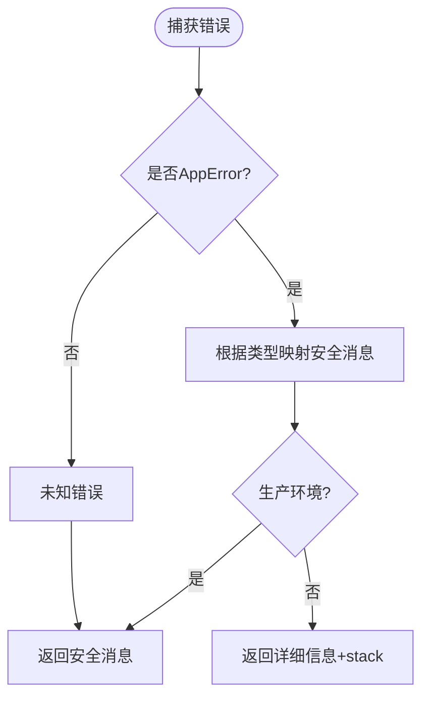
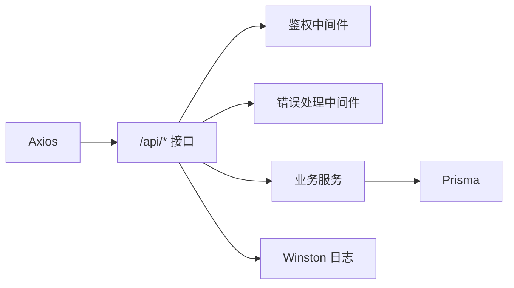

# 故障排除

<cite>
**本文引用的文件**
- [server/src/app.js](file://server/src/app.js)
- [server/src/lib/prisma.js](file://server/src/lib/prisma.js)
- [server/src/middleware/error.js](file://server/src/middleware/error.js)
- [server/src/middleware/auth.middleware.js](file://server/src/middleware/auth.middleware.js)
- [server/src/routers/auth.routes.js](file://server/src/routes/auth.routes.js)
- [server/src/services/auth.service.js](file://server/src/services/auth.service.js)
- [server/src/utils/logger.js](file://server/src/utils/logger.js)
- [server/src/utils/error.js](file://server/src/utils/error.js)
- [server/src/config/auth.config.js](file://server/src/config/auth.config.js)
- [client/src/utils/request.js](file://client/src/utils/request.js)
- [client/src/stores/auth.js](file://client/src/stores/auth.js)
- [server/.env.example](file://server/.env.example)
- [docker-compose.yml](file://docker-compose.yml)
- [package.json](file://package.json)
</cite>

## 目录
1. [简介](#简介)
2. [项目结构](#项目结构)
3. [核心组件](#核心组件)
4. [架构总览](#架构总览)
5. [详细组件分析](#详细组件分析)
6. [依赖关系分析](#依赖关系分析)
7. [性能考虑](#性能考虑)
8. [故障排除指南](#故障排除指南)
9. [结论](#结论)
10. [附录](#附录)

## 简介
本指南面向运维与开发人员，系统化梳理 KECCourse 平台在开发、测试与生产环境中常见的故障类型与处置流程，覆盖环境配置、数据库连接、API 调用、前端页面加载、性能问题、安全风险以及紧急恢复与回滚策略。文档基于仓库现有实现进行归纳总结，提供可操作的诊断步骤与日志分析要点。

## 项目结构
- 后端采用 Express + Prisma，提供 REST API；前端使用 Vite + Vue3 + Element Plus，通过 Axios 发起请求。
- 通过 Docker Compose 提供容器化部署，包含 Nginx 前端静态服务与 Node.js 后端服务。
- 关键运行时要素：CORS、Helmet 安全头、XSS 清洗、命名转换、鉴权中间件、错误处理中间件、健康检查接口、日志系统。

图示来源
- [server/src/app.js:28-157](file://server/src/app.js#L28-L157)
- [client/src/utils/request.js:7-145](file://client/src/utils/request.js#L7-L145)
- [client/src/stores/auth.js:8-222](file://client/src/stores/auth.js#L8-L222)
- [server/src/lib/prisma.js:1-34](file://server/src/lib/prisma.js#L1-L34)
- [server/src/utils/logger.js:34-96](file://server/src/utils/logger.js#L34-L96)

章节来源
- [package.json:7-24](file://package.json#L7-L24)
- [docker-compose.yml:4-73](file://docker-compose.yml#L4-L73)

## 核心组件
- 鉴权与会话
  - 前端：Axios 拦截器自动附加 Bearer Token 与 CSRF Token，401 触发刷新流程，403 提示权限不足。
  - 后端：JWT 验证与角色中间件，下载令牌校验用户状态，速率限制保护登录/刷新/登出/改密接口。
- 数据访问
  - Prisma 客户端按环境配置日志级别，开发模式下监听错误与警告事件。
- 错误处理
  - 自定义 AppError 分层（认证、权限、验证、冲突、通用），错误处理器统一输出安全消息。
- 日志
  - Winston 输出 error/combined/audit 三类文件，支持生产/开发不同格式与控制台输出。
- 健康检查
  - /api/health 直连数据库确认连接可用性，异常时返回 503。

章节来源
- [client/src/utils/request.js:17-142](file://client/src/utils/request.js#L17-L142)
- [client/src/stores/auth.js:48-200](file://client/src/stores/auth.js#L48-L200)
- [server/src/middleware/auth.middleware.js:40-129](file://server/src/middleware/auth.middleware.js#L40-L129)
- [server/src/routes/auth.routes.js:59-181](file://server/src/routes/auth.routes.js#L59-L181)
- [server/src/lib/prisma.js:6-34](file://server/src/lib/prisma.js#L6-L34)
- [server/src/middleware/error.js:35-62](file://server/src/middleware/error.js#L35-L62)
- [server/src/utils/logger.js:34-96](file://server/src/utils/logger.js#L34-L96)
- [server/src/app.js:94-113](file://server/src/app.js#L94-L113)

## 架构总览
以下序列图展示登录与鉴权的关键交互，有助于定位认证失败、权限拒绝、Token 刷新异常等问题。

图示来源
- [client/src/stores/auth.js:48-90](file://client/src/stores/auth.js#L48-L90)
- [client/src/utils/request.js:51-142](file://client/src/utils/request.js#L51-L142)
- [server/src/routes/auth.routes.js:59-72](file://server/src/routes/auth.routes.js#L59-L72)
- [server/src/middleware/auth.middleware.js:40-106](file://server/src/middleware/auth.middleware.js#L40-L106)
- [server/src/services/auth.service.js:9-82](file://server/src/services/auth.service.js#L9-L82)
- [server/src/lib/prisma.js:22-34](file://server/src/lib/prisma.js#L22-L34)

## 详细组件分析

### 鉴权与会话组件
- 前端状态与拦截器
  - useAuthStore 管理 token/refreshToken/userInfo，支持登录、刷新、拉取用户信息、修改密码、退出登录。
  - Axios 拦截器自动注入 Authorization 与 CSRF Token；对 401 触发刷新队列，403 返回权限不足提示。
- 后端鉴权
  - 支持 Bearer 与 downloadToken 两种方式；下载令牌同样校验用户状态；角色中间件按需放行。
  - 速率限制针对登录/刷新/登出/改密接口，降低暴力破解与滥用风险。
- 安全配置
  - Helmet 安全头；CORS 白名单/localhost 放行；XSS 清洗；命名转换（camel/snake）。

图示来源
- [server/src/middleware/auth.middleware.js:40-106](file://server/src/middleware/auth.middleware.js#L40-L106)
- [server/src/routes/auth.routes.js:134-152](file://server/src/routes/auth.routes.js#L134-L152)
- [client/src/stores/auth.js:106-128](file://client/src/stores/auth.js#L106-L128)

章节来源
- [client/src/stores/auth.js:48-200](file://client/src/stores/auth.js#L48-L200)
- [client/src/utils/request.js:17-142](file://client/src/utils/request.js#L17-L142)
- [server/src/middleware/auth.middleware.js:40-129](file://server/src/middleware/auth.middleware.js#L40-L129)
- [server/src/routes/auth.routes.js:59-181](file://server/src/routes/auth.routes.js#L59-L181)

### 数据库与日志组件
- Prisma
  - 开发/测试/生产按需开启日志级别；测试环境可强制切换数据源；开发模式监听 error/warn 事件。
- 日志
  - Winston 输出 error/combined/audit 文件，支持 JSON 结构化日志与控制台输出；生产环境默认 info 级别。

图示来源
- [server/src/lib/prisma.js:6-34](file://server/src/lib/prisma.js#L6-L34)
- [server/src/utils/logger.js:34-96](file://server/src/utils/logger.js#L34-L96)

章节来源
- [server/src/lib/prisma.js:6-34](file://server/src/lib/prisma.js#L6-L34)
- [server/src/utils/logger.js:34-96](file://server/src/utils/logger.js#L34-L96)

### 错误处理与健康检查
- 错误分类
  - AppError 及其子类（认证、权限、验证、冲突、通用）；错误处理器在生产环境输出安全消息，开发环境输出堆栈。
- 健康检查
  - /api/health 执行一次数据库查询，成功返回 200，异常返回 503。

图示来源
- [server/src/middleware/error.js:35-62](file://server/src/middleware/error.js#L35-L62)
- [server/src/utils/error.js:5-58](file://server/src/utils/error.js#L5-L58)
- [server/src/app.js:94-113](file://server/src/app.js#L94-L113)

章节来源
- [server/src/middleware/error.js:35-62](file://server/src/middleware/error.js#L35-L62)
- [server/src/utils/error.js:5-58](file://server/src/utils/error.js#L5-L58)
- [server/src/app.js:94-113](file://server/src/app.js#L94-L113)

## 依赖关系分析
- 前端依赖
  - Axios 作为 HTTP 客户端；Element Plus 提示；Pinia 管理认证状态；Vue Router 导航。
- 后端依赖
  - Express + CORS + Helmet；Prisma；Winston；JWT；bcrypt；速率限制；XSS 清洗；命名转换。
- 部署依赖
  - Docker Compose；Nginx；SQLite（开发/测试）；生产环境建议 PostgreSQL/MySQL。

图示来源
- [client/src/utils/request.js:7-145](file://client/src/utils/request.js#L7-L145)
- [server/src/app.js:22-26](file://server/src/app.js#L22-L26)
- [server/src/lib/prisma.js:1-34](file://server/src/lib/prisma.js#L1-L34)
- [server/src/utils/logger.js:34-96](file://server/src/utils/logger.js#L34-L96)

章节来源
- [package.json:21-23](file://package.json#L21-L23)
- [docker-compose.yml:4-73](file://docker-compose.yml#L4-L73)

## 性能考虑
- 数据库查询优化
  - 已内置多处复合索引迁移脚本，建议结合 EXPLAIN 分析慢查询；关注外键/唯一约束冲突导致的回滚与重试。
- 缓存与中间件
  - 鉴权中间件对用户状态做短期缓存（TTL 30s），减少重复查询；注意缓存失效策略。
- 并发与速率限制
  - 登录/刷新/登出/改密接口均有限流，避免高并发攻击与误用。
- 前端性能
  - Axios 超时与重试策略需结合业务场景调整；大文件导入/导出建议分片与进度反馈。

章节来源
- [server/src/middleware/auth.middleware.js:5-20](file://server/src/middleware/auth.middleware.js#L5-L20)
- [server/src/routes/auth.routes.js:14-57](file://server/src/routes/auth.routes.js#L14-L57)

## 故障排除指南

### 一、环境配置问题
- 症状
  - 启动时报错“JWT_SECRET 未配置”或“密钥未独立配置”。
- 诊断
  - 检查 .env 文件是否存在且包含 JWT_SECRET/JWT_REFRESH_SECRET/JWT_DOWNLOAD_SECRET。
  - 生产环境必须设置独立密钥，否则会记录安全警告/错误。
- 处置
  - 在 .env 中设置独立密钥；重启服务；确认日志不再出现安全警告。

章节来源
- [server/src/config/auth.config.js:9-16](file://server/src/config/auth.config.js#L9-L16)
- [server/src/config/auth.config.js:27-37](file://server/src/config/auth.config.js#L27-L37)
- [server/.env.example:10-13](file://server/.env.example#L10-L13)

### 二、数据库连接异常
- 症状
  - /api/health 返回 503；Prisma 报错；应用启动卡住。
- 诊断
  - 查看 Winston error.log/combined.log；确认 DATABASE_URL 正确（开发使用 SQLite 文件路径）。
  - 开发模式下 Prisma 会监听 error/warn 事件，关注日志输出。
- 处置
  - 修正 DATABASE_URL；确保数据文件可写；必要时重建数据库或迁移；查看 Prisma 日志定位具体 SQL。

章节来源
- [server/src/app.js:94-113](file://server/src/app.js#L94-L113)
- [server/src/lib/prisma.js:6-34](file://server/src/lib/prisma.js#L6-L34)
- [server/src/utils/logger.js:39-58](file://server/src/utils/logger.js#L39-L58)

### 三、API 调用错误
- 常见错误与定位
  - 400 参数错误：检查请求体与命名转换（camel/snake）；查看验证中间件与 Xss 清洗。
  - 401 未授权/403 权限不足：检查 Authorization 头、Token 是否过期、角色是否匹配。
  - 500 服务器内部错误：查看 combined.log/stack；确认错误处理器是否抛出 AppError。
- 处置
  - 前端 Axios 已处理 401 刷新与 403 提示；后端错误处理器统一输出安全消息。

章节来源
- [client/src/utils/request.js:51-142](file://client/src/utils/request.js#L51-L142)
- [server/src/middleware/error.js:35-62](file://server/src/middleware/error.js#L35-L62)
- [server/src/middleware/auth.middleware.js:40-129](file://server/src/middleware/auth.middleware.js#L40-L129)

### 四、前端页面加载失败
- 症状
  - 页面空白、静态资源 404、CORS 拦截。
- 诊断
  - 检查 Nginx 配置与静态文件目录；确认 /api 前缀代理到后端；核对 CORS 白名单。
- 处置
  - 确认 docker-compose 中 client 服务依赖 server 健康；调整 CORS_ORIGINS；重启容器。

章节来源
- [server/src/app.js:41-76](file://server/src/app.js#L41-L76)
- [docker-compose.yml:44-67](file://docker-compose.yml#L44-L67)

### 五、性能问题排查
- 数据库查询慢
  - 使用 EXPLAIN 分析慢查询；确认索引是否命中；避免 N+1 查询；Prisma 日志辅助定位。
- 内存泄漏
  - 关注定时器与缓存清理（鉴权中间件的 Map 清理任务）；避免大对象常驻内存。
- 并发访问问题
  - 检查速率限制是否触发；适当放宽或分流；观察日志中的限流提示。

章节来源
- [server/src/middleware/auth.middleware.js:10-15](file://server/src/middleware/auth.middleware.js#L10-L15)
- [server/src/routes/auth.routes.js:14-57](file://server/src/routes/auth.routes.js#L14-L57)

### 六、安全相关问题
- 认证失败
  - 用户名/密码错误、账号被禁用、Token 过期或无效；后端审计日志记录失败原因。
- 权限拒绝
  - 角色不满足；后端记录权限不足日志。
- 文件上传错误
  - 未设置 withCredentials 或 CSRF Token 不匹配；检查 Axios 配置与 Cookie 设置。

章节来源
- [server/src/services/auth.service.js:14-51](file://server/src/services/auth.service.js#L14-L51)
- [server/src/middleware/auth.middleware.js:108-129](file://server/src/middleware/auth.middleware.js#L108-L129)
- [client/src/utils/request.js:17-34](file://client/src/utils/request.js#L17-L34)

### 七、紧急恢复与回滚策略
- 快速自愈
  - 使用 docker-compose 的健康检查；后端 /api/health 可快速判断数据库连通性。
- 回滚步骤
  - 回退镜像版本；恢复上次备份的 SQLite 数据库文件；回滚 Prisma 迁移（如需）。
- 审计与取证
  - 检查 audit.log 获取关键操作记录；结合 error.log/combined.log 定位根因。

章节来源
- [docker-compose.yml:28-33](file://docker-compose.yml#L28-L33)
- [server/src/app.js:94-113](file://server/src/app.js#L94-L113)
- [server/src/utils/logger.js:52-58](file://server/src/utils/logger.js#L52-L58)

## 结论
本指南基于代码实现总结了 KECCourse 平台的常见故障类型与处置流程。建议在生产环境严格配置密钥与 CORS，启用健康检查与审计日志，结合速率限制与安全中间件，形成“可观测—可诊断—可恢复”的闭环。

## 附录

### A. 常用诊断清单
- 环境变量
  - NODE_ENV、PORT、DATABASE_URL、JWT_*、CORS_ORIGINS、LOG_LEVEL、MAX_FILE_SIZE、BCRYPT_ROUNDS
- 服务状态
  - docker-compose ps；容器健康检查；/api/health
- 日志位置
  - server/logs 下 error.log/combined.log/audit.log
- 前端调试
  - 控制台 Network 面板；检查 Authorization 与 CSRF；观察 Axios 拦截器行为

章节来源
- [server/.env.example:2-33](file://server/.env.example#L2-L33)
- [docker-compose.yml:4-73](file://docker-compose.yml#L4-L73)
- [server/src/utils/logger.js:39-58](file://server/src/utils/logger.js#L39-L58)