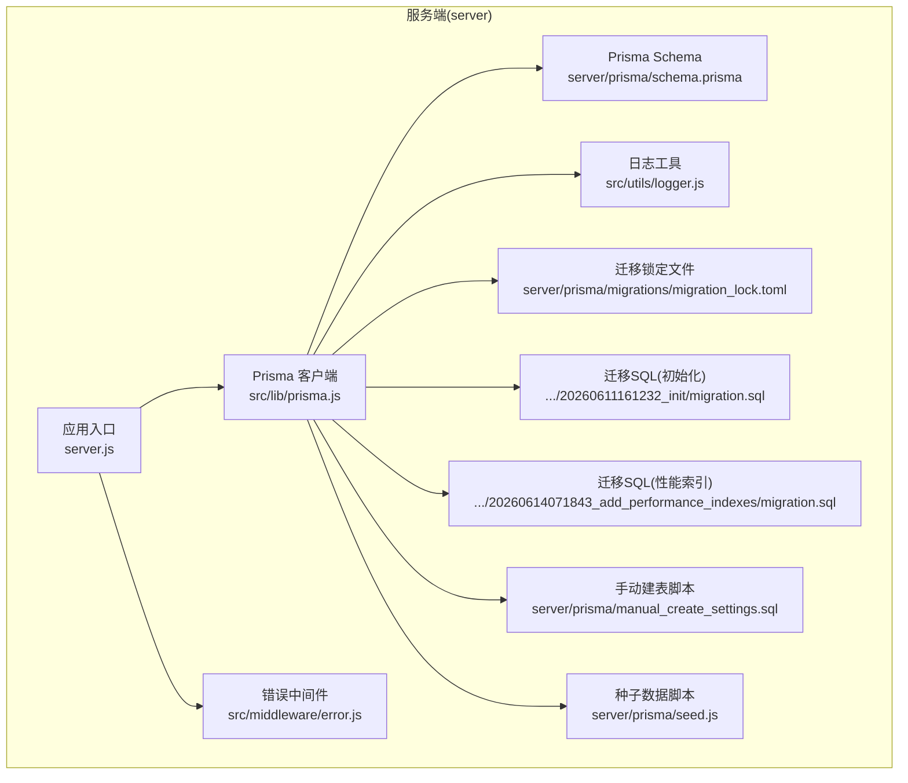
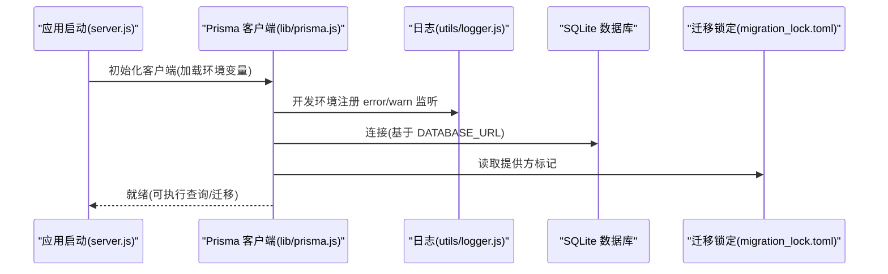
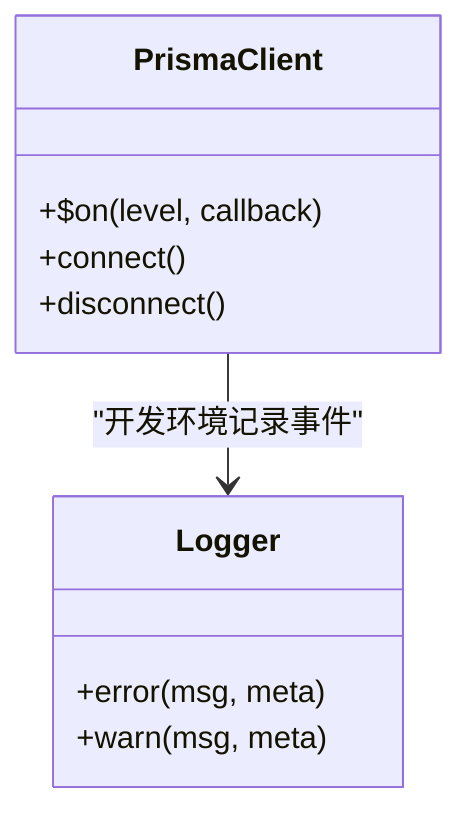
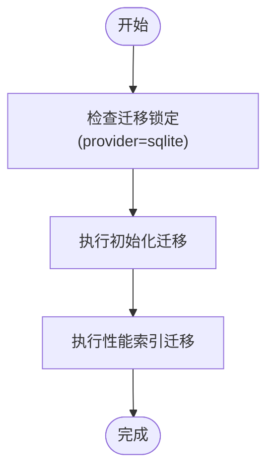
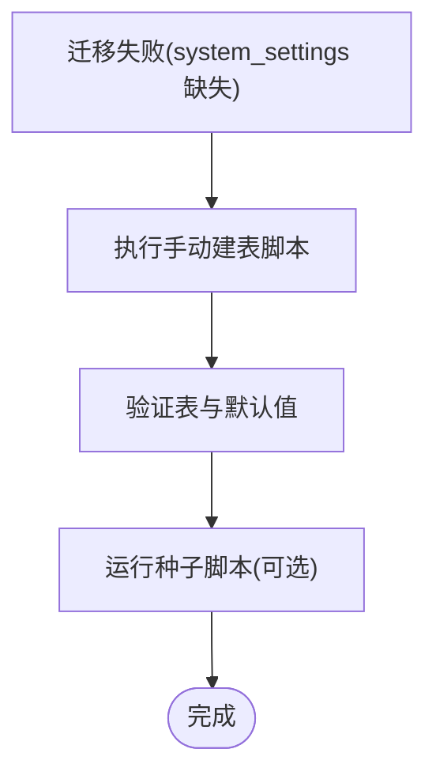
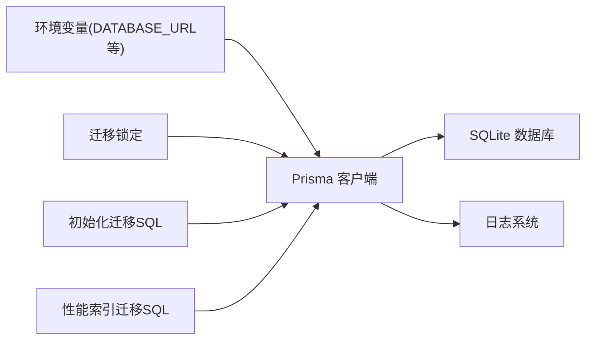

# 数据库问题

<cite>
**本文引用的文件**
- [schema.prisma](file://server/prisma/schema.prisma)
- [prisma.js](file://server/src/lib/prisma.js)
- [migration_lock.toml](file://server/prisma/migrations/migration_lock.toml)
- [20260611161232_init/migration.sql](file://server/prisma/migrations/20260611161232_init/migration.sql)
- [20260614071843_add_performance_indexes/migration.sql](file://server/prisma/migrations/20260614071843_add_performance_indexes/migration.sql)
- [manual_create_settings.sql](file://server/prisma/manual_create_settings.sql)
- [seed.js](file://server/prisma/seed.js)
- [logger.js](file://server/src/utils/logger.js)
- [error.middleware.js](file://server/src/middleware/error.js)
- [server.js](file://server/src/server.js)
- [auth.config.js](file://server/src/config/auth.config.js)
- [index.js](file://server/src/constants/index.js)
</cite>

## 目录
1. [简介](#简介)
2. [项目结构](#项目结构)
3. [核心组件](#核心组件)
4. [架构总览](#架构总览)
5. [详细组件分析](#详细组件分析)
6. [依赖关系分析](#依赖关系分析)
7. [性能考量](#性能考量)
8. [故障排除指南](#故障排除指南)
9. [结论](#结论)
10. [附录](#附录)

## 简介
本指南聚焦于 KECCourse Manager 平台的数据库问题与排障流程，覆盖以下主题：
- 数据库连接失败：连接字符串校验、权限检查、网络连通性测试
- 迁移执行错误：回滚策略、手动修复方法
- 表结构不一致：Prisma 模型与 SQLite 元数据一致性核对
- 索引性能问题：索引缺失、冗余与查询优化建议
- Prisma ORM 错误处理：模型定义问题、查询性能优化
- 备份与恢复：SQLite 文件级备份与恢复操作步骤

## 项目结构
后端采用 Prisma ORM + SQLite 的组合，数据库配置通过环境变量注入，迁移脚本位于 prisma/migrations 目录，开发/测试环境的日志与错误处理在 lib/prisma.js 与 middleware/error.js 中实现。

图示来源
- [server.js:1-20](file://server/src/server.js#L1-L20)
- [prisma.js:1-34](file://server/src/lib/prisma.js#L1-L34)
- [logger.js:1-80](file://server/src/utils/logger.js#L1-L80)
- [error.middleware.js:1-60](file://server/src/middleware/error.js#L1-L60)
- [schema.prisma:1-308](file://server/prisma/schema.prisma#L1-L308)
- [migration_lock.toml:1-4](file://server/prisma/migrations/migration_lock.toml#L1-L4)
- [20260611161232_init/migration.sql:1-248](file://server/prisma/migrations/20260611161232_init/migration.sql#L1-L248)
- [20260614071843_add_performance_indexes/migration.sql:1-24](file://server/prisma/migrations/20260614071843_add_performance_indexes/migration.sql#L1-L24)
- [manual_create_settings.sql:1-29](file://server/prisma/manual_create_settings.sql#L1-L29)
- [seed.js:1-120](file://server/prisma/seed.js#L1-L120)

章节来源
- [server.js:1-20](file://server/src/server.js#L1-L20)
- [prisma.js:1-34](file://server/src/lib/prisma.js#L1-L34)
- [schema.prisma:1-308](file://server/prisma/schema.prisma#L1-L308)

## 核心组件
- 数据库提供方与连接
  - 数据源提供方为 sqlite，连接地址由环境变量 DATABASE_URL 注入。
  - 开发/测试环境下，Prisma 客户端会监听 error/warn 事件并通过日志输出。
- 迁移与锁定
  - 迁移锁定文件标记了当前迁移提供方为 sqlite，避免跨提供方误用。
  - 初始化迁移脚本定义了完整的表结构与索引；后续迁移脚本补充性能相关索引。
- 手动修复与回退
  - 当迁移失败导致 system_settings 缺失时，可使用手动建表脚本进行修复。
  - 种子脚本支持强制重置与开发模式开关，便于快速回退到初始状态。
- 错误处理与日志
  - 应用启动时读取环境变量控制日志级别与错误中间件行为。
  - Prisma 在开发环境记录 error/warn 事件，有助于定位问题。

章节来源
- [schema.prisma:5-8](file://server/prisma/schema.prisma#L5-L8)
- [prisma.js:1-34](file://server/src/lib/prisma.js#L1-L34)
- [migration_lock.toml:1-4](file://server/prisma/migrations/migration_lock.toml#L1-L4)
- [20260611161232_init/migration.sql:1-248](file://server/prisma/migrations/20260611161232_init/migration.sql#L1-L248)
- [20260614071843_add_performance_indexes/migration.sql:1-24](file://server/prisma/migrations/20260614071843_add_performance_indexes/migration.sql#L1-L24)
- [manual_create_settings.sql:1-29](file://server/prisma/manual_create_settings.sql#L1-L29)
- [seed.js:1-120](file://server/prisma/seed.js#L1-L120)
- [logger.js:1-80](file://server/src/utils/logger.js#L1-L80)
- [error.middleware.js:1-60](file://server/src/middleware/error.js#L1-L60)

## 架构总览
下图展示了从应用启动到数据库访问的关键路径，以及迁移与日志在其中的作用。

图示来源
- [server.js:1-20](file://server/src/server.js#L1-L20)
- [prisma.js:1-34](file://server/src/lib/prisma.js#L1-L34)
- [logger.js:1-80](file://server/src/utils/logger.js#L1-L80)
- [migration_lock.toml:1-4](file://server/prisma/migrations/migration_lock.toml#L1-L4)

## 详细组件分析

### 组件A：Prisma 客户端与日志集成
- 设计要点
  - 根据 NODE_ENV 动态调整 Prisma 日志级别，并在测试环境允许覆盖数据源 URL。
  - 开发环境下订阅 error/warn 事件，统一写入日志系统，便于快速定位数据库层问题。
- 关键路径
  - 客户端初始化与日志事件绑定：[prisma.js:1-34](file://server/src/lib/prisma.js#L1-L34)
  - 日志级别与运行环境：[logger.js:1-80](file://server/src/utils/logger.js#L1-L80)

图示来源
- [prisma.js:1-34](file://server/src/lib/prisma.js#L1-L34)
- [logger.js:1-80](file://server/src/utils/logger.js#L1-L80)

章节来源
- [prisma.js:1-34](file://server/src/lib/prisma.js#L1-L34)
- [logger.js:1-80](file://server/src/utils/logger.js#L1-L80)

### 组件B：迁移与索引维护
- 设计要点
  - 初始迁移定义完整表结构与基础索引；后续迁移专注于性能相关索引补充。
  - 迁移锁定文件确保提供方一致性，避免误用其他数据库驱动。
- 关键路径
  - 初始化迁移 SQL：[20260611161232_init/migration.sql:1-248](file://server/prisma/migrations/20260611161232_init/migration.sql#L1-L248)
  - 性能索引迁移 SQL：[20260614071843_add_performance_indexes/migration.sql:1-24](file://server/prisma/migrations/20260614071843_add_performance_indexes/migration.sql#L1-L24)
  - 迁移锁定：[migration_lock.toml:1-4](file://server/prisma/migrations/migration_lock.toml#L1-L4)

图示来源
- [20260611161232_init/migration.sql:1-248](file://server/prisma/migrations/20260611161232_init/migration.sql#L1-L248)
- [20260614071843_add_performance_indexes/migration.sql:1-24](file://server/prisma/migrations/20260614071843_add_performance_indexes/migration.sql#L1-L24)
- [migration_lock.toml:1-4](file://server/prisma/migrations/migration_lock.toml#L1-L4)

章节来源
- [20260611161232_init/migration.sql:1-248](file://server/prisma/migrations/20260611161232_init/migration.sql#L1-L248)
- [20260614071843_add_performance_indexes/migration.sql:1-24](file://server/prisma/migrations/20260614071843_add_performance_indexes/migration.sql#L1-L24)
- [migration_lock.toml:1-4](file://server/prisma/migrations/migration_lock.toml#L1-L4)

### 组件C：手动修复与回退
- 设计要点
  - 当迁移失败导致 system_settings 表缺失时，可通过手动建表脚本快速修复。
  - 种子脚本支持强制重置与开发模式开关，便于快速回退到初始状态。
- 关键路径
  - 手动建表脚本：[manual_create_settings.sql:1-29](file://server/prisma/manual_create_settings.sql#L1-L29)
  - 种子脚本参数：[seed.js:1-120](file://server/prisma/seed.js#L1-L120)

图示来源
- [manual_create_settings.sql:1-29](file://server/prisma/manual_create_settings.sql#L1-L29)
- [seed.js:1-120](file://server/prisma/seed.js#L1-L120)

章节来源
- [manual_create_settings.sql:1-29](file://server/prisma/manual_create_settings.sql#L1-L29)
- [seed.js:1-120](file://server/prisma/seed.js#L1-L120)

## 依赖关系分析
- 组件耦合
  - 应用启动依赖 Prisma 客户端；Prisma 依赖环境变量 DATABASE_URL；开发环境依赖日志模块。
  - 迁移锁定文件与迁移 SQL 共同保证迁移一致性。
- 外部依赖
  - SQLite 提供方固定为 sqlite，迁移锁定文件与 schema.prisma 的 provider 必须保持一致。

图示来源
- [schema.prisma:5-8](file://server/prisma/schema.prisma#L5-L8)
- [prisma.js:1-34](file://server/src/lib/prisma.js#L1-L34)
- [logger.js:1-80](file://server/src/utils/logger.js#L1-L80)
- [migration_lock.toml:1-4](file://server/prisma/migrations/migration_lock.toml#L1-L4)
- [20260611161232_init/migration.sql:1-248](file://server/prisma/migrations/20260611161232_init/migration.sql#L1-L248)
- [20260614071843_add_performance_indexes/migration.sql:1-24](file://server/prisma/migrations/20260614071843_add_performance_indexes/migration.sql#L1-L24)

章节来源
- [schema.prisma:5-8](file://server/prisma/schema.prisma#L5-L8)
- [prisma.js:1-34](file://server/src/lib/prisma.js#L1-L34)
- [migration_lock.toml:1-4](file://server/prisma/migrations/migration_lock.toml#L1-L4)

## 性能考量
- 索引设计
  - 初始迁移已建立常用字段索引；性能迁移进一步补充复合索引与高频查询字段索引。
  - 建议定期评估查询计划，结合业务热点字段补充索引。
- 查询优化
  - 对涉及多表关联与范围查询的场景，优先使用复合索引与合适的过滤条件。
  - 避免在索引列上使用函数或表达式，防止索引失效。
- 日志与监控
  - 开发环境启用 Prisma error/warn 事件日志，有助于发现潜在性能问题。

章节来源
- [20260611161232_init/migration.sql:177-248](file://server/prisma/migrations/20260611161232_init/migration.sql#L177-L248)
- [20260614071843_add_performance_indexes/migration.sql:1-24](file://server/prisma/migrations/20260614071843_add_performance_indexes/migration.sql#L1-L24)
- [prisma.js:24-33](file://server/src/lib/prisma.js#L24-L33)

## 故障排除指南

### 一、数据库连接失败
- 诊断步骤
  - 连接字符串验证
    - 确认环境变量 DATABASE_URL 指向正确的 SQLite 文件路径，且文件存在且可读写。
    - 参考路径：[schema.prisma:5-8](file://server/prisma/schema.prisma#L5-L8)
  - 权限检查
    - 确保运行用户对数据库文件及所在目录具有读写权限。
  - 网络连通性测试
    - 若使用远程数据库，需确认网络可达；当前项目使用本地 SQLite，无需网络连通性测试。
- 常见原因
  - DATABASE_URL 未设置或路径错误
  - 数据库文件被占用或权限不足
  - 开发环境日志未显示错误事件，需检查 Prisma 客户端初始化与日志配置
    - 参考：[prisma.js:1-34](file://server/src/lib/prisma.js#L1-L34)，[logger.js:1-80](file://server/src/utils/logger.js#L1-L80)

章节来源
- [schema.prisma:5-8](file://server/prisma/schema.prisma#L5-L8)
- [prisma.js:1-34](file://server/src/lib/prisma.js#L1-L34)
- [logger.js:1-80](file://server/src/utils/logger.js#L1-L80)

### 二、迁移执行错误
- 现象
  - 迁移过程中出现约束冲突、重复索引或表结构不一致。
- 解决方案
  - 回滚策略
    - 使用 Prisma CLI 回滚至上一个成功版本，再根据需要修复后再重新迁移。
    - 迁移锁定文件确保提供方一致性，参考：[migration_lock.toml:1-4](file://server/prisma/migrations/migration_lock.toml#L1-L4)
  - 手动修复
    - 若 system_settings 表缺失，使用手动建表脚本修复：
      - 步骤：以 sqlite3 执行 [manual_create_settings.sql:1-29](file://server/prisma/manual_create_settings.sql#L1-L29)
      - 验证：脚本末尾包含验证查询，确认表与默认值存在
    - 如需快速回退到初始状态，可运行种子脚本并开启强制重置：
      - 参考：[seed.js:1-120](file://server/prisma/seed.js#L1-L120)
- 预防措施
  - 在开发环境启用 Prisma error/warn 事件日志，提前发现迁移异常：
    - 参考：[prisma.js:24-33](file://server/src/lib/prisma.js#L24-L33)

章节来源
- [migration_lock.toml:1-4](file://server/prisma/migrations/migration_lock.toml#L1-L4)
- [manual_create_settings.sql:1-29](file://server/prisma/manual_create_settings.sql#L1-L29)
- [seed.js:1-120](file://server/prisma/seed.js#L1-L120)
- [prisma.js:24-33](file://server/src/lib/prisma.js#L24-L33)

### 三、表结构不一致
- 症状
  - Prisma 模型与 SQLite 元数据不匹配，导致查询报错或迁移失败。
- 排查步骤
  - 对照 Prisma 模型与迁移 SQL，确认字段类型、唯一性、外键约束是否一致：
    - 模型定义：[schema.prisma:1-308](file://server/prisma/schema.prisma#L1-L308)
    - 初始化迁移：[20260611161232_init/migration.sql:1-248](file://server/prisma/migrations/20260611161232_init/migration.sql#L1-L248)
- 修复建议
  - 若是新增字段或索引，编写新迁移并执行；若为历史遗留问题，先通过手动脚本补齐，再统一迁移。

章节来源
- [schema.prisma:1-308](file://server/prisma/schema.prisma#L1-L308)
- [20260611161232_init/migration.sql:1-248](file://server/prisma/migrations/20260611161232_init/migration.sql#L1-L248)

### 四、索引性能问题
- 症状
  - 查询慢、锁等待、频繁全表扫描。
- 排查步骤
  - 对比现有索引与查询条件，确认是否命中索引：
    - 初始索引：[20260611161232_init/migration.sql:177-248](file://server/prisma/migrations/20260611161232_init/migration.sql#L177-L248)
    - 性能索引：[20260614071843_add_performance_indexes/migration.sql:1-24](file://server/prisma/migrations/20260614071843_add_performance_indexes/migration.sql#L1-L24)
- 优化建议
  - 为高频过滤与排序字段增加合适索引；避免在索引列使用函数或表达式。
  - 结合业务热点，定期评估并调整索引策略。

章节来源
- [20260611161232_init/migration.sql:177-248](file://server/prisma/migrations/20260611161232_init/migration.sql#L177-L248)
- [20260614071843_add_performance_indexes/migration.sql:1-24](file://server/prisma/migrations/20260614071843_add_performance_indexes/migration.sql#L1-L24)

### 五、Prisma ORM 相关错误处理
- 模型定义问题
  - 字段类型不匹配、唯一约束冲突、外键关系错误等。
  - 建议：对照 [schema.prisma:1-308](file://server/prisma/schema.prisma#L1-L308) 逐项核对迁移 SQL。
- 查询性能优化
  - 启用开发环境日志，观察 Prisma 报错与警告事件，定位慢查询与异常：
    - 参考：[prisma.js:24-33](file://server/src/lib/prisma.js#L24-L33)
  - 结合业务查询，补充复合索引与过滤条件优化。
- 环境变量与默认值
  - JWT 密钥、日志级别、默认学期等均来自环境变量，需确保部署时正确配置：
    - JWT 相关：[auth.config.js:1-60](file://server/src/config/auth.config.js#L1-L60)
    - 日志级别：[logger.js:1-80](file://server/src/utils/logger.js#L1-L80)
    - 默认学期：[index.js:30-35](file://server/src/constants/index.js#L30-L35)

章节来源
- [schema.prisma:1-308](file://server/prisma/schema.prisma#L1-L308)
- [prisma.js:24-33](file://server/src/lib/prisma.js#L24-L33)
- [auth.config.js:1-60](file://server/src/config/auth.config.js#L1-L60)
- [logger.js:1-80](file://server/src/utils/logger.js#L1-L80)
- [index.js:30-35](file://server/src/constants/index.js#L30-L35)

### 六、数据库备份与恢复
- 备份
  - SQLite 为单文件数据库，直接复制 .db 文件即可完成备份。
- 恢复
  - 将备份的 .db 文件替换到原位置，确保运行用户具备读写权限。
- 注意事项
  - 恢复前停止服务，避免文件被占用。
  - 恢复后验证关键表是否存在与数据完整性。

章节来源
- [manual_create_settings.sql:1-29](file://server/prisma/manual_create_settings.sql#L1-L29)

## 结论
本指南围绕 KECCourse Manager 的数据库问题提供了系统化的诊断与修复流程。通过严格遵循连接验证、迁移回滚与手动修复、索引优化与 Prisma 错误处理的最佳实践，可有效降低数据库故障对系统的影响。同时，完善的日志与环境变量配置是保障运维效率的关键。

## 附录
- 关键文件清单
  - 数据库配置与模型：[schema.prisma:1-308](file://server/prisma/schema.prisma#L1-L308)
  - Prisma 客户端与日志：[prisma.js:1-34](file://server/src/lib/prisma.js#L1-L34)，[logger.js:1-80](file://server/src/utils/logger.js#L1-L80)
  - 迁移与锁定：[migration_lock.toml:1-4](file://server/prisma/migrations/migration_lock.toml#L1-L4)，[20260611161232_init/migration.sql:1-248](file://server/prisma/migrations/20260611161232_init/migration.sql#L1-L248)，[20260614071843_add_performance_indexes/migration.sql:1-24](file://server/prisma/migrations/20260614071843_add_performance_indexes/migration.sql#L1-L24)
  - 手动修复与回退：[manual_create_settings.sql:1-29](file://server/prisma/manual_create_settings.sql#L1-L29)，[seed.js:1-120](file://server/prisma/seed.js#L1-L120)
  - 环境变量与默认值：[auth.config.js:1-60](file://server/src/config/auth.config.js#L1-L60)，[index.js:30-35](file://server/src/constants/index.js#L30-L35)