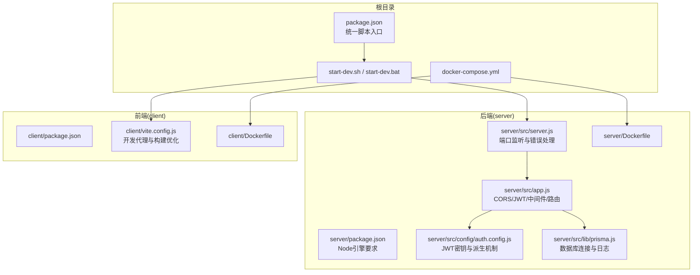
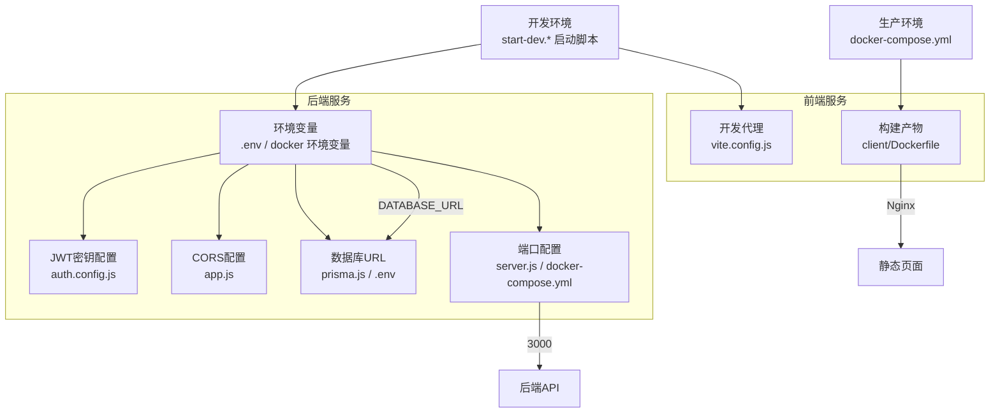
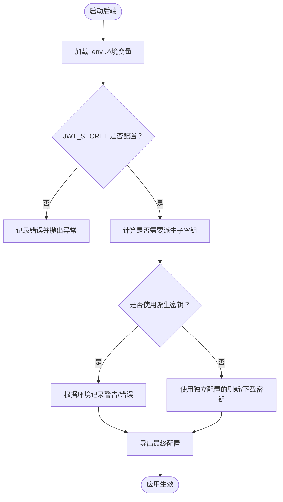
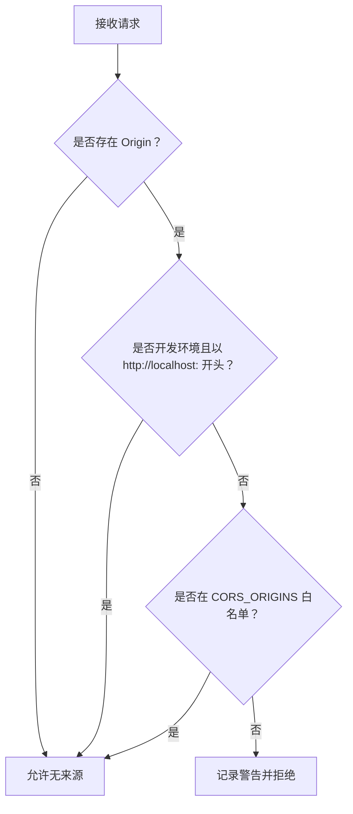
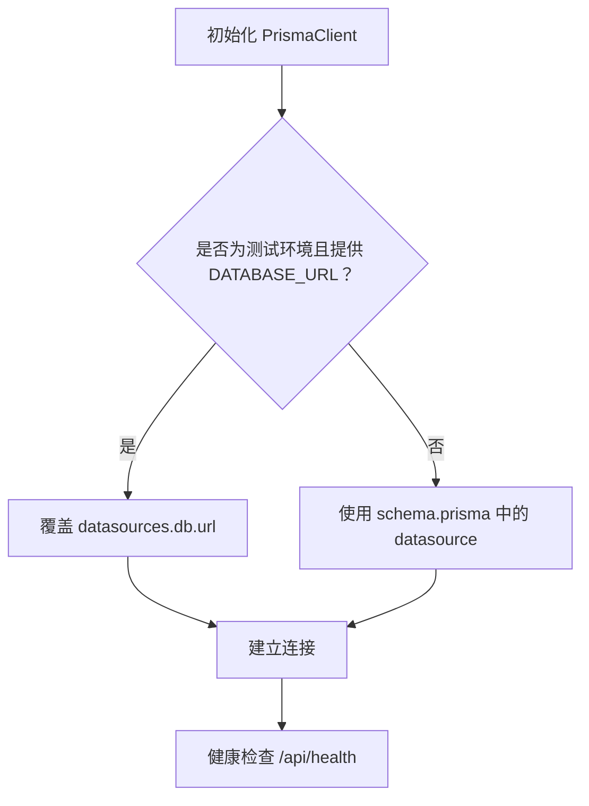
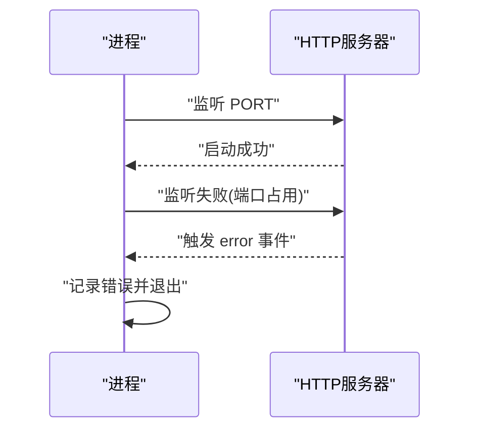
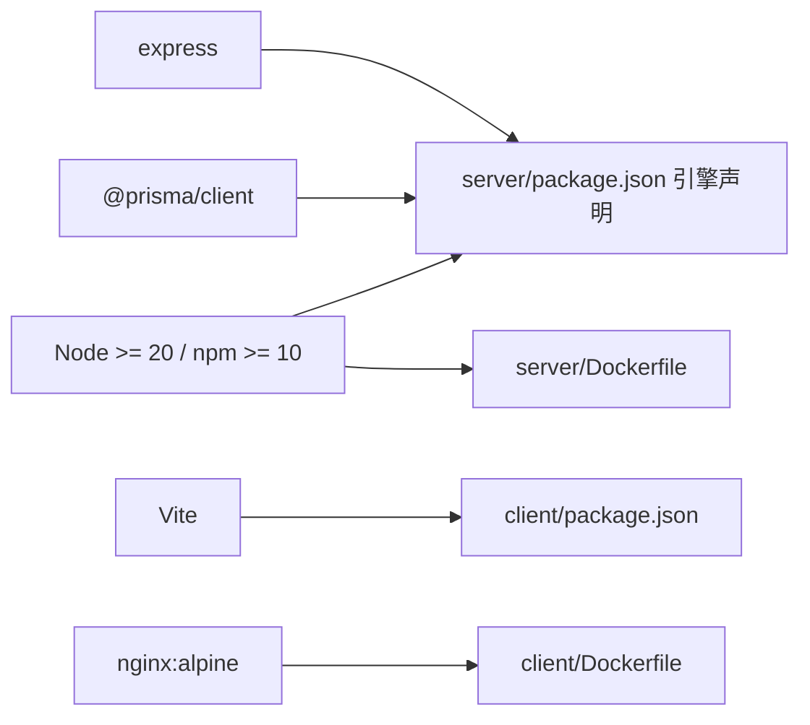

# 环境配置问题

<cite>
**本文引用的文件**
- [package.json](file://package.json)
- [server/package.json](file://server/package.json)
- [client/package.json](file://client/package.json)
- [start-dev.sh](file://start-dev.sh)
- [start-dev.bat](file://start-dev.bat)
- [docker-compose.yml](file://docker-compose.yml)
- [server/src/config/auth.config.js](file://server/src/config/auth.config.js)
- [server/src/app.js](file://server/src/app.js)
- [server/src/server.js](file://server/src/server.js)
- [server/src/lib/prisma.js](file://server/src/lib/prisma.js)
- [server/Dockerfile](file://server/Dockerfile)
- [client/Dockerfile](file://client/Dockerfile)
- [client/vite.config.js](file://client/vite.config.js)
- [docs/CONFIG_UPDATE_GUIDE.md](file://docs/CONFIG_UPDATE_GUIDE.md)
- [docs/PRODUCTION_DEPLOYMENT.md](file://docs/PRODUCTION_DEPLOYMENT.md)
- [deploy.sh](file://deploy.sh)
- [deploy_ssh.sh](file://deploy_ssh.sh)
- [server/scripts/reset-database.js](file://server/scripts/reset-database.js)
- [server/vitest.setup.js](file://server/vitest.setup.js)
</cite>

## 目录
1. [简介](#简介)
2. [项目结构](#项目结构)
3. [核心组件](#核心组件)
4. [架构总览](#架构总览)
5. [详细组件分析](#详细组件分析)
6. [依赖关系分析](#依赖关系分析)
7. [性能考虑](#性能考虑)
8. [故障排除指南](#故障排除指南)
9. [结论](#结论)
10. [附录](#附录)

## 简介
本指南聚焦于KEC课程管理平台在开发与生产环境中常见的“环境配置问题”，围绕以下主题提供系统化的排查与修复方法：
- Node.js版本不兼容
- 环境变量配置错误（JWT密钥、CORS、数据库URL、端口等）
- 端口占用问题
- 数据库连接字符串错误
- 依赖版本与网络连通性验证
- 开发与生产环境差异注意事项

目标是帮助运维与开发者快速定位问题、验证配置，并给出可操作的修复步骤。

## 项目结构
该仓库采用前后端分离的多包结构，根目录通过脚本统一启动前后端；后端使用Express + Prisma，前端使用Vite + Vue3；同时提供Docker与部署脚本，便于本地与生产环境快速搭建。

图表来源
- [package.json:1-25](file://package.json#L1-L25)
- [start-dev.sh:1-55](file://start-dev.sh#L1-L55)
- [start-dev.bat:1-51](file://start-dev.bat#L1-L51)
- [docker-compose.yml:1-73](file://docker-compose.yml#L1-L73)
- [server/src/server.js:1-66](file://server/src/server.js#L1-L66)
- [server/src/app.js:1-158](file://server/src/app.js#L1-L158)
- [server/src/config/auth.config.js:1-58](file://server/src/config/auth.config.js#L1-L58)
- [server/src/lib/prisma.js:1-34](file://server/src/lib/prisma.js#L1-L34)
- [server/Dockerfile:1-46](file://server/Dockerfile#L1-L46)
- [client/vite.config.js:1-56](file://client/vite.config.js#L1-L56)
- [client/Dockerfile:1-30](file://client/Dockerfile#L1-L30)

章节来源
- [package.json:1-25](file://package.json#L1-L25)
- [server/package.json:1-53](file://server/package.json#L1-L53)
- [client/package.json:1-33](file://client/package.json#L1-L33)
- [start-dev.sh:1-55](file://start-dev.sh#L1-L55)
- [start-dev.bat:1-51](file://start-dev.bat#L1-L51)
- [docker-compose.yml:1-73](file://docker-compose.yml#L1-L73)

## 核心组件
- Node.js与包管理器版本约束：后端明确要求Node >= 20、npm >= 10，确保与Prisma、Vitest等工具链兼容。
- Express应用：集中配置CORS、Helmet安全头、XSS清洗、命名转换、健康检查等。
- JWT配置：支持独立的Access/Refresh/Download密钥，生产环境必须配置独立密钥，否则使用HKDF派生并在日志中告警。
- 数据库连接：通过PrismaClient读取DATABASE_URL，开发/测试/生产环境日志策略不同。
- 前端开发代理：默认将/api代理至后端端口（开发脚手架中为3002，实际运行端口由环境变量控制）。
- Docker编排：后端使用SQLite文件路径，生产环境通过卷挂载实现数据持久化；前端使用Nginx提供静态文件。

章节来源
- [server/package.json:7-10](file://server/package.json#L7-L10)
- [server/src/app.js:41-76](file://server/src/app.js#L41-L76)
- [server/src/config/auth.config.js:1-58](file://server/src/config/auth.config.js#L1-L58)
- [server/src/lib/prisma.js:1-34](file://server/src/lib/prisma.js#L1-L34)
- [client/vite.config.js:46-54](file://client/vite.config.js#L46-L54)
- [docker-compose.yml:14-26](file://docker-compose.yml#L14-L26)

## 架构总览
下图展示开发与生产环境的关键配置点及交互流程，帮助理解常见问题的定位方向。

图表来源
- [start-dev.sh:14-54](file://start-dev.sh#L14-L54)
- [start-dev.bat:10-50](file://start-dev.bat#L10-L50)
- [server/src/config/auth.config.js:1-58](file://server/src/config/auth.config.js#L1-L58)
- [server/src/app.js:41-76](file://server/src/app.js#L41-L76)
- [server/src/lib/prisma.js:16-20](file://server/src/lib/prisma.js#L16-L20)
- [server/src/server.js:8](file://server/src/server.js#L8)
- [docker-compose.yml:14-26](file://docker-compose.yml#L14-L26)
- [client/vite.config.js:46-54](file://client/vite.config.js#L46-L54)
- [client/Dockerfile:16-29](file://client/Dockerfile#L16-L29)

## 详细组件分析

### JWT密钥配置与派生机制
- 必填项：JWT_SECRET必须配置；若未配置JWT_REFRESH_SECRET或JWT_DOWNLOAD_SECRET，系统会使用HKDF从主密钥派生子密钥，并在生产环境记录严重告警。
- 建议：生产环境务必设置独立的JWT_REFRESH_SECRET与JWT_DOWNLOAD_SECRET，避免密钥复用带来的风险。
- 配置位置与日志：后端通过dotenv加载，auth.config.js进行校验与派生；日志中包含生成随机密钥的示例命令。

图表来源
- [server/src/config/auth.config.js:1-58](file://server/src/config/auth.config.js#L1-L58)

章节来源
- [server/src/config/auth.config.js:1-58](file://server/src/config/auth.config.js#L1-L58)
- [docs/CONFIG_UPDATE_GUIDE.md:47-93](file://docs/CONFIG_UPDATE_GUIDE.md#L47-L93)

### CORS跨域配置
- 动态来源：CORS_ORIGINS来自环境变量，多个来源以逗号分隔；开发环境允许所有http://localhost:*。
- 安全策略：非开发环境对不在白名单的来源直接拒绝，并记录警告日志。
- 建议：生产环境务必设置为实际域名白名单，避免宽泛放行。

图表来源
- [server/src/app.js:41-76](file://server/src/app.js#L41-L76)

章节来源
- [server/src/app.js:41-76](file://server/src/app.js#L41-L76)
- [docs/CONFIG_UPDATE_GUIDE.md:56-57](file://docs/CONFIG_UPDATE_GUIDE.md#L56-L57)

### 数据库URL与连接
- URL来源：DATABASE_URL来自环境变量，开发/测试/生产环境分别采用不同策略（测试环境可覆盖datasource）。
- SQLite文件：生产容器默认使用file:/app/data/kec.db，需确保卷挂载与权限正确。
- 健康检查：/api/health通过一次查询验证数据库连通性。

图表来源
- [server/src/lib/prisma.js:16-20](file://server/src/lib/prisma.js#L16-L20)
- [server/src/app.js:94-113](file://server/src/app.js#L94-L113)
- [docker-compose.yml:16](file://docker-compose.yml#L16)

章节来源
- [server/src/lib/prisma.js:1-34](file://server/src/lib/prisma.js#L1-L34)
- [server/src/app.js:94-113](file://server/src/app.js#L94-L113)
- [docker-compose.yml:14-26](file://docker-compose.yml#L14-L26)

### 端口占用与监听
- 端口来源：PORT来自环境变量，默认3000；Docker映射为3000:3000。
- 错误处理：当端口被占用时记录错误并退出进程，避免静默失败。
- 建议：开发时如需多实例，修改PORT或使用不同端口；生产环境确保防火墙放行。

图表来源
- [server/src/server.js:28-40](file://server/src/server.js#L28-L40)
- [docker-compose.yml:12-13](file://docker-compose.yml#L12-L13)

章节来源
- [server/src/server.js:1-66](file://server/src/server.js#L1-L66)
- [docker-compose.yml:12-13](file://docker-compose.yml#L12-L13)

### 前端开发代理与构建
- 开发代理：vite.config.js将/api代理至http://localhost:3002（开发脚手架默认端口），实际运行端口以环境变量为准。
- 构建优化：按依赖拆分chunk，提升缓存命中率；生产构建关闭source map。
- Docker：前端使用Nginx提供静态文件服务，暴露80端口。

章节来源
- [client/vite.config.js:46-54](file://client/vite.config.js#L46-L54)
- [client/Dockerfile:16-29](file://client/Dockerfile#L16-L29)

## 依赖关系分析
- Node引擎：后端要求Node >= 20、npm >= 10，确保Prisma与测试工具链稳定。
- 前端：Vite、Vue3、Element Plus等依赖，开发与生产构建策略不同。
- Docker：后端基于node:20-alpine，安装SQLite运行时；前端基于nginx:alpine提供静态服务。

图表来源
- [server/package.json:7-10](file://server/package.json#L7-L10)
- [client/package.json:13-31](file://client/package.json#L13-L31)
- [server/Dockerfile:18-23](file://server/Dockerfile#L18-L23)
- [client/Dockerfile:17-23](file://client/Dockerfile#L17-L23)

章节来源
- [server/package.json:1-53](file://server/package.json#L1-L53)
- [client/package.json:1-33](file://client/package.json#L1-L33)
- [server/Dockerfile:1-46](file://server/Dockerfile#L1-L46)
- [client/Dockerfile:1-30](file://client/Dockerfile#L1-L30)

## 性能考虑
- 服务器超时：keepAliveTimeout与headersTimeout调优，减少空闲连接导致的内存压力。
- 健康检查：/api/health返回数据库连通性，便于容器编排与负载均衡探测。
- 前端构建：按依赖拆分chunk，开启压缩与缓存策略，降低首屏加载时间。

章节来源
- [server/src/server.js:42-44](file://server/src/server.js#L42-L44)
- [server/src/app.js:94-113](file://server/src/app.js#L94-L113)
- [client/vite.config.js:26-39](file://client/vite.config.js#L26-L39)

## 故障排除指南

### 1. Node.js版本不兼容
- 症状：安装依赖报错、Prisma命令失败、测试框架无法运行。
- 排查要点：
  - 检查后端引擎要求：Node >= 20、npm >= 10。
  - 若使用nvm，请切换到满足要求的版本。
- 修复建议：
  - 升级Node.js与npm至符合要求的版本。
  - 清理缓存后重新安装依赖。

章节来源
- [server/package.json:7-10](file://server/package.json#L7-L10)
- [deploy_ssh.sh:225-239](file://deploy_ssh.sh#L225-L239)

### 2. 环境变量配置错误
- JWT密钥未配置或不安全：
  - 现象：启动时报错并终止，日志提示未配置JWT_SECRET。
  - 修复：生成独立的JWT_SECRET、JWT_REFRESH_SECRET、JWT_DOWNLOAD_SECRET，写入.server/.env。
- CORS跨域拒绝：
  - 现象：浏览器跨域失败，后端记录“Not allowed by CORS”。
  - 修复：设置CORS_ORIGINS为实际域名白名单，生产环境禁止localhost放行。
- 数据库URL错误：
  - 现象：健康检查返回503，数据库连接失败。
  - 修复：确认DATABASE_URL格式正确（SQLite使用file:前缀），生产环境使用绝对路径与卷挂载。
- 端口占用：
  - 现象：启动失败并提示端口已被占用。
  - 修复：修改PORT或释放占用端口。

章节来源
- [server/src/config/auth.config.js:9-16](file://server/src/config/auth.config.js#L9-L16)
- [server/src/app.js:41-76](file://server/src/app.js#L41-L76)
- [server/src/lib/prisma.js:16-20](file://server/src/lib/prisma.js#L16-L20)
- [server/src/server.js:33-40](file://server/src/server.js#L33-L40)
- [docker-compose.yml:16](file://docker-compose.yml#L16)

### 3. 端口占用问题
- 现象：服务启动时报错“Address already in use”。
- 排查：确认端口3000是否被其他进程占用。
- 修复：修改PORT或释放占用进程；生产环境确保防火墙放行。

章节来源
- [server/src/server.js:33-40](file://server/src/server.js#L33-L40)
- [docker-compose.yml:12-13](file://docker-compose.yml#L12-L13)

### 4. 数据库连接字符串错误
- 现象：/api/health返回503，数据库断开。
- 排查：
  - 检查DATABASE_URL格式（SQLite使用file:前缀）。
  - 生产环境使用绝对路径与卷挂载。
- 修复：修正DATABASE_URL，确保文件存在且具备读写权限。

章节来源
- [server/src/lib/prisma.js:16-20](file://server/src/lib/prisma.js#L16-L20)
- [server/src/app.js:94-113](file://server/src/app.js#L94-L113)
- [docker-compose.yml:16](file://docker-compose.yml#L16)

### 5. 依赖版本验证与网络连通性测试
- 依赖版本验证：
  - 后端：Node >= 20、npm >= 10。
  - 前端：Vite、Vue3、Element Plus等。
- 网络连通性测试：
  - 健康检查：curl http://localhost:3000/api/health，期望返回200。
  - Settings接口：curl http://localhost:3000/api/settings，期望返回200。
- 权限检查：
  - 生产环境：确保data与uploads目录具备写权限，卷挂载正确。

章节来源
- [server/package.json:7-10](file://server/package.json#L7-L10)
- [client/package.json:13-31](file://client/package.json#L13-L31)
- [deploy.sh:224-238](file://deploy.sh#L224-L238)
- [docs/PRODUCTION_DEPLOYMENT.md:13-30](file://docs/PRODUCTION_DEPLOYMENT.md#L13-L30)

### 6. 开发与生产环境配置差异
- 开发环境：
  - 使用start-dev.*脚本一键启动前后端。
  - 前端开发代理默认指向3002端口，实际运行端口以环境变量为准。
  - CORS允许所有http://localhost:*。
- 生产环境：
  - 使用docker-compose编排，后端端口3000映射至宿主机，前端Nginx提供静态服务。
  - 必须配置独立JWT密钥、CORS白名单、数据库绝对路径与卷挂载。
  - 建议配置Nginx反向代理与HTTPS证书。

章节来源
- [start-dev.sh:38-54](file://start-dev.sh#L38-L54)
- [start-dev.bat:34-50](file://start-dev.bat#L34-L50)
- [client/vite.config.js:46-54](file://client/vite.config.js#L46-L54)
- [server/src/app.js:41-76](file://server/src/app.js#L41-L76)
- [docker-compose.yml:12-26](file://docker-compose.yml#L12-L26)
- [docs/PRODUCTION_DEPLOYMENT.md:135-189](file://docs/PRODUCTION_DEPLOYMENT.md#L135-L189)

### 7. 环境检查清单与验证方法
- 检查清单（摘自部署文档与脚本）：
  - Node.js与npm版本满足要求
  - 生成并配置JWT密钥（独立刷新与下载密钥）
  - 设置CORS_ORIGINS为实际域名
  - 配置DATABASE_URL（生产使用绝对路径）
  - 端口3000与Nginx端口放行
  - 数据目录权限与卷挂载
- 验证方法：
  - 健康检查：curl http://localhost:3000/api/health
  - Settings接口：curl http://localhost:3000/api/settings
  - 登录默认账号并修改密码

章节来源
- [docs/CONFIG_UPDATE_GUIDE.md:47-82](file://docs/CONFIG_UPDATE_GUIDE.md#L47-L82)
- [docs/PRODUCTION_DEPLOYMENT.md:32-47](file://docs/PRODUCTION_DEPLOYMENT.md#L32-L47)
- [deploy.sh:224-238](file://deploy.sh#L224-L238)
- [docs/LOGIN_GUIDE.md:15-25](file://docs/LOGIN_GUIDE.md#L15-L25)

### 8. 数据库重置与初始化
- 场景：首次部署或需要重建初始数据。
- 方法：执行数据库重置脚本，会创建admin账号与默认系统设置。
- 注意：生产环境建议备份后再重置。

章节来源
- [server/scripts/reset-database.js:108-124](file://server/scripts/reset-database.js#L108-L124)
- [docs/LOGIN_GUIDE.md:21-25](file://docs/LOGIN_GUIDE.md#L21-L25)

## 结论
- 环境配置问题的核心在于“约定优于配置”的落地：严格的Node版本、独立JWT密钥、精确的CORS白名单、正确的数据库URL与端口、以及开发/生产差异化的部署策略。
- 建议在变更配置后，优先执行健康检查与关键接口验证，结合日志定位问题根因。
- 生产环境务必遵循最小暴露面原则，严格限制CORS来源，使用独立密钥与HTTPS。

## 附录

### A. 关键配置项速查
- JWT相关：JWT_SECRET、JWT_REFRESH_SECRET、JWT_DOWNLOAD_SECRET、JWT_EXPIRES_IN、JWT_REFRESH_EXPIRES_IN
- CORS：CORS_ORIGINS
- 数据库：DATABASE_URL（生产使用绝对路径）
- 服务器：PORT（默认3000）
- 日志：LOG_LEVEL（可选）

章节来源
- [server/src/config/auth.config.js:49-57](file://server/src/config/auth.config.js#L49-L57)
- [server/src/app.js:41-51](file://server/src/app.js#L41-L51)
- [server/src/lib/prisma.js:16-20](file://server/src/lib/prisma.js#L16-L20)
- [server/src/server.js:8](file://server/src/server.js#L8)
- [docs/CONFIG_UPDATE_GUIDE.md:47-82](file://docs/CONFIG_UPDATE_GUIDE.md#L47-L82)