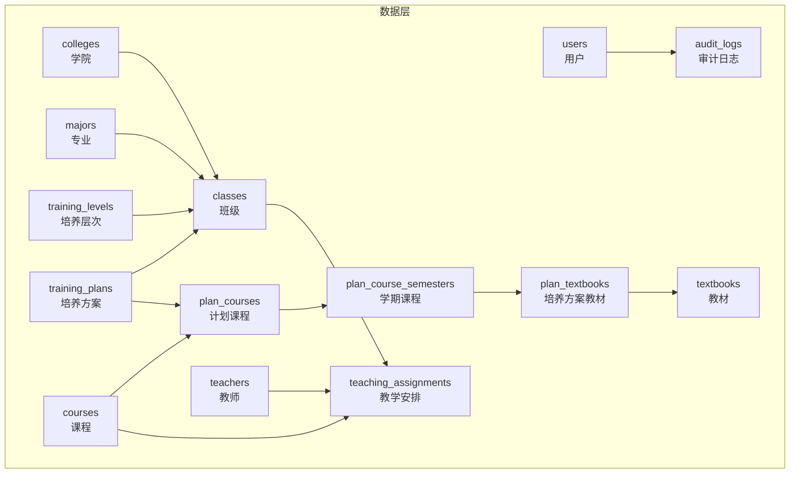
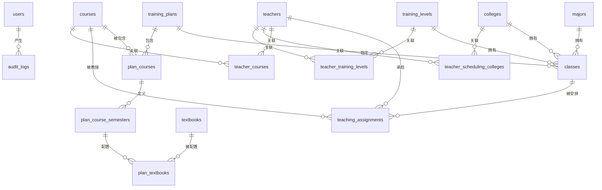
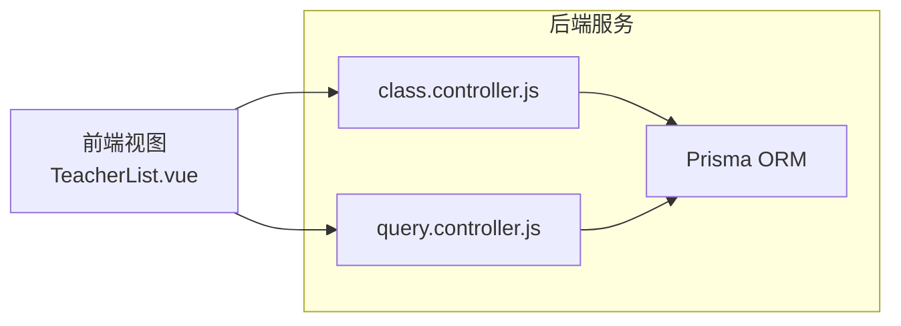

# 实体关系设计

<cite>
**本文档引用的文件**
- [schema.prisma](file://server/prisma/schema.prisma)
- [20260611161232_init/migration.sql](file://server/prisma/migrations/20260611161232_init/migration.sql)
- [class.controller.js](file://server/src/controllers/class.controller.js)
- [query.controller.js](file://server/src/controllers/query.controller.js)
- [TeacherList.vue](file://client/src/views/teaching/TeacherList.vue)
</cite>

## 目录
1. [引言](#引言)
2. [项目结构](#项目结构)
3. [核心组件](#核心组件)
4. [架构总览](#架构总览)
5. [详细组件分析](#详细组件分析)
6. [依赖分析](#依赖分析)
7. [性能考虑](#性能考虑)
8. [故障排除指南](#故障排除指南)
9. [结论](#结论)
10. [附录](#附录)

## 引言
本文件面向KEC课程管理平台的数据建模与实体关系设计，基于Prisma Schema与数据库迁移脚本，系统梳理各数据模型之间的关系类型（一对一、一对多、多对多）与关联方式，重点解释以下核心业务关系：
- 培养方案与专业的关联
- 班级与专业的关联
- 课程与培养方案的关系
- 教师与课程的关联
- 教学安排与教师、班级、课程的关系

同时提供ER图与实体关系图，说明外键约束与引用关系，并阐述关系设计背后的业务逻辑与数据一致性保障机制。

## 项目结构
后端采用Prisma作为ORM，数据库使用SQLite；前端通过API与后端交互。数据库层面的核心模型包括：审计日志、用户、学院、专业、培养层次、培养方案、课程、计划课程、学期课程、教材、教学安排、教师及其多对多关联表等。

图表来源
- [schema.prisma](file://server/prisma/schema.prisma)
- [20260611161232_init/migration.sql](file://server/prisma/migrations/20260611161232_init/migration.sql)

章节来源
- [schema.prisma](file://server/prisma/schema.prisma)
- [20260611161232_init/migration.sql](file://server/prisma/migrations/20260611161232_init/migration.sql)

## 核心组件
本节从关系角度拆解核心实体及它们之间的约束与索引策略，帮助理解业务规则与数据一致性。

- 用户与审计日志
  - 关系：一对多（一个用户可产生多条审计日志）
  - 外键：audit_logs.operator_id → users.id（删除设为空）
  - 索引：按时间、操作者、模块、动作建立索引
  - 业务意义：记录操作轨迹，支持审计与追踪

- 学院、专业、培养层次与班级
  - 关系：多对一（班级属于学院/专业/层次）
  - 外键：classes.college_id → colleges.id；classes.major_id → majors.id；classes.training_level_id → training_levels.id；classes.custom_plan_id → training_plans.id（均删除设为空）
  - 索引：按状态、入学年份、专业+状态、层次、学院、自定义培养方案建立复合或单列索引
  - 业务意义：支撑“按学院/专业/层次/年份”筛选与统计

- 培养方案与课程（计划课程）
  - 关系：多对一（计划课程属于培养方案）
  - 外键：plan_courses.plan_id → training_plans.id（级联删除）；plan_courses.course_id → courses.id
  - 唯一键：plan_id + course_id，避免重复绑定
  - 索引：按培养方案、课程建立索引
  - 业务意义：将课程纳入具体培养方案，支持排课与教学计划

- 学期课程与计划课程
  - 关系：一对一（计划课程的每个学期对应一条学期课程）
  - 外键：plan_course_semesters.plan_course_id → plan_courses.id（级联删除）
  - 唯一键：plan_course_id + semester，确保每学期唯一
  - 索引：按学期建立索引
  - 业务意义：承载每学期周学时、周数等学期维度参数

- 教材与学期课程
  - 关系：多对一（学期课程可配置多本教材）
  - 外键：plan_textbooks.semester_id → plan_course_semesters.id（级联删除）；plan_textbooks.textbook_id → textbooks.id
  - 索引：按学期、教材建立索引
  - 业务意义：支持课程教材配置与查询

- 教师与课程（多对多）
  - 关系：多对多（通过中间表teacher_courses实现）
  - 外键：teacher_courses.teacher_id → teachers.id（级联删除）；teacher_courses.course_id → courses.id（级联删除）
  - 唯一键：teacher_id + course_id
  - 业务意义：限定教师可授课程范围

- 教师与学院/层次（多对多）
  - 关系：多对多（通过teacher_scheduling_colleges、teacher_training_levels实现）
  - 外键：分别指向teachers、colleges、training_levels，均级联删除
  - 唯一键：(teacher_id, college_id)、(teacher_id, training_level_id)
  - 业务意义：控制教师在不同学院与培养层次的教学权限

- 教学安排与教师/班级/课程
  - 关系：多对一（教学安排引用三者）
  - 外键：teaching_assignments.teacher_id → teachers.id（限制删除）；class_id → classes.id（限制删除）；course_id → courses.id（限制删除）
  - 唯一键：(class_id, course_id, semester)，防止重复安排
  - 索引：按教师、学期、课程+学期、班级+学期、教师+学期建立索引
  - 业务意义：确保教学安排唯一性与可查询性

章节来源
- [schema.prisma](file://server/prisma/schema.prisma)
- [20260611161232_init/migration.sql](file://server/prisma/migrations/20260611161232_init/migration.sql)

## 架构总览
下图展示平台核心实体间的关系与外键约束，体现业务主干链路：培养方案驱动课程，课程进入教学安排，教师与班级参与其中，形成闭环。

图表来源
- [schema.prisma](file://server/prisma/schema.prisma)
- [20260611161232_init/migration.sql](file://server/prisma/migrations/20260611161232_init/migration.sql)

## 详细组件分析

### 培养方案与专业的关联
- 关系类型：多对一（培养方案可关联到专业，也可不关联）
- 外键：training_plans.major_id → majors.id（删除设为空）
- 业务逻辑：
  - 当培养方案仅关联专业时，表示该方案仅适用于该专业；
  - 若同时关联层次，则可能形成“专业+层次”的交叉匹配，需在业务层进行校验与提示。
- 数据一致性：
  - classes.custom_plan_id → training_plans.id（删除设为空），确保班级可无方案但不会破坏引用完整性。

章节来源
- [schema.prisma](file://server/prisma/schema.prisma)
- [class.controller.js](file://server/src/controllers/class.controller.js)
- [query.controller.js](file://server/src/controllers/query.controller.js)

### 班级与专业的关联
- 关系类型：多对一（班级属于某个专业）
- 外键：classes.major_id → majors.id（删除设为空）
- 业务逻辑：
  - 班级在创建时可选择专业，用于后续培养方案匹配与统计；
  - 查询控制器会构建“学院-专业-层次-入学年份-培养方案”等多维映射，辅助前端筛选与联动。
- 数据一致性：
  - 班级状态动态计算与多维索引配合，提升查询效率与准确性。

章节来源
- [schema.prisma](file://server/prisma/schema.prisma)
- [class.controller.js](file://server/src/controllers/class.controller.js)
- [query.controller.js](file://server/src/controllers/query.controller.js)

### 课程与培养方案的关系
- 关系类型：多对一（计划课程属于培养方案）
- 外键：plan_courses.plan_id → training_plans.id（级联删除）；plan_courses.course_id → courses.id
- 唯一键：(plan_id, course_id)
- 业务逻辑：
  - 将课程纳入具体培养方案，支持按学期分配周学时、周数等；
  - 支持课程在不同培养方案中的差异化设置。
- 数据一致性：
  - 唯一键避免重复绑定；
  - 级联删除保证方案删除时清理其课程绑定。

章节来源
- [schema.prisma](file://server/prisma/schema.prisma)

### 教师与课程的关联
- 关系类型：多对多（通过teacher_courses中间表）
- 外键：teacher_courses.teacher_id → teachers.id（级联删除）；teacher_courses.course_id → courses.id（级联删除）
- 唯一键：(teacher_id, course_id)
- 业务逻辑：
  - 控制教师可授课程范围；
  - 前端教师列表支持按课程筛选，便于教学任务分配。
- 数据一致性：
  - 唯一键确保不重复授权；
  - 级联删除保证教师或课程删除时自动清理关联。

章节来源
- [schema.prisma](file://server/prisma/schema.prisma)
- [TeacherList.vue](file://client/src/views/teaching/TeacherList.vue)

### 教学安排与教师、班级、课程的关系
- 关系类型：多对一（教学安排引用三者）
- 外键：teacher_id → teachers.id（限制删除）；class_id → classes.id（限制删除）；course_id → courses.id（限制删除）
- 唯一键：(class_id, course_id, semester)
- 业务逻辑：
  - 以“班级-课程-学期”唯一确定一次教学安排；
  - 支持周学时、是否自动生成等字段控制排课行为。
- 数据一致性：
  - 唯一键避免重复安排；
  - 限制删除策略防止误删导致引用失效。

章节来源
- [schema.prisma](file://server/prisma/schema.prisma)

### 教师与学院/层次的关联
- 关系类型：多对多（通过teacher_scheduling_colleges、teacher_training_levels中间表）
- 外键：分别指向teachers、colleges、training_levels，均级联删除
- 唯一键：(teacher_id, college_id)、(teacher_id, training_level_id)
- 业务逻辑：
  - 控制教师在不同学院与培养层次的教学权限；
  - 前端教师筛选支持“意向学院 ↔ 意向层次”的联动过滤。
- 数据一致性：
  - 唯一键确保不重复授权；
  - 级联删除保证删除教师或组织层级时自动清理关联。

章节来源
- [schema.prisma](file://server/prisma/schema.prisma)
- [TeacherList.vue](file://client/src/views/teaching/TeacherList.vue)

## 依赖分析
- 组件耦合与内聚
  - classes与training_plans之间存在“可选关联”，降低强耦合度，允许灵活匹配；
  - plan_courses与plan_course_semesters形成“计划-学期”两级结构，增强可扩展性；
  - 教学安排围绕“教师-班级-课程-学期”四元组，形成稳定的业务闭环。
- 外部依赖与集成点
  - Prisma ORM负责模型映射与查询；
  - SQLite提供轻量存储，适合开发与演示环境；
  - 前端通过API与后端交互，控制器负责数据聚合与关系映射。
- 可能的循环依赖
  - 中间表（teacher_courses、teacher_scheduling_colleges、teacher_training_levels）与主表之间为单向外键，不存在循环依赖风险。
- 接口契约
  - 控制器返回的“关系映射”（如学院-专业、专业-层次、培养方案-学院等）用于前端联动筛选，契约稳定且明确。

图表来源
- [class.controller.js](file://server/src/controllers/class.controller.js)
- [query.controller.js](file://server/src/controllers/query.controller.js)
- [TeacherList.vue](file://client/src/views/teaching/TeacherList.vue)

章节来源
- [class.controller.js](file://server/src/controllers/class.controller.js)
- [query.controller.js](file://server/src/controllers/query.controller.js)
- [TeacherList.vue](file://client/src/views/teaching/TeacherList.vue)

## 性能考虑
- 索引策略
  - classes：按状态、入学年份、(major_id, status)、training_level_id、college_id、custom_plan_id建立索引，支撑高频筛选与分页；
  - plan_courses：按plan_id、course_id建立索引，加速培养方案与课程查询；
  - plan_course_semesters：按semester建立索引，优化按学期查询；
  - plan_textbooks：按semester_id、textbook_id建立索引，提升教材配置查询效率；
  - teaching_assignments：按teacher_id、semester、(course_id, semester)、(class_id, semester)、(teacher_id, semester)建立复合索引，保障教学安排查询与去重。
- 删除策略
  - 计划类关系采用“级联删除”，避免孤儿数据；
  - 教学安排采用“限制删除”，防止误删破坏引用完整性；
  - 组织与人员关系采用“删除设空”，保留历史痕迹但避免硬约束。
- 查询优化
  - 控制器一次性拉取多维映射，减少多次往返；
  - 使用include嵌套加载，避免N+1查询问题。

## 故障排除指南
- 常见错误与定位
  - “重复教学安排”：检查teaching_assignments唯一键冲突，确认是否重复提交相同(班级,课程,学期)组合；
  - “无法删除教师/课程”：若出现限制删除报错，检查是否存在teaching_assignments或teacher_courses引用；
  - “培养方案匹配异常”：检查classes.custom_plan_id与training_plans.major_id/level_id的交叉匹配，必要时调整方案或班级归属。
- 数据一致性验证
  - 使用控制器返回的关系映射（如planCollegeRelation、planMajorRelation、planLevelRelation）核对前后端筛选逻辑；
  - 对关键索引（如唯一键、复合索引）进行查询验证，确保查询路径正确。
- 日志与审计
  - 通过audit_logs模块回溯操作人、模块、动作与结果，辅助定位问题根因。

章节来源
- [schema.prisma](file://server/prisma/schema.prisma)
- [class.controller.js](file://server/src/controllers/class.controller.js)
- [query.controller.js](file://server/src/controllers/query.controller.js)

## 结论
本设计以“培养方案-课程-教学安排-教师-班级-组织”为主线，通过清晰的一对多与多对多关系、严格的外键约束与索引策略，实现了业务闭环与数据一致性保障。核心创新点包括：
- 培养方案与专业的可选关联，支持“专业专属”与“层次通用”两种模式；
- 计划课程-学期课程的两级结构，满足学期化教学参数管理；
- 教学安排的唯一键约束，杜绝重复排课；
- 多维索引与控制器聚合查询，兼顾灵活性与性能。

## 附录
- 外键与约束一览（摘自迁移脚本）
  - classes.custom_plan_id → training_plans.id（删除设空）
  - classes.training_level_id → training_levels.id（删除设空）
  - classes.college_id → colleges.id（删除设空）
  - classes.major_id → majors.id（删除设空）
  - plan_courses.plan_id → training_plans.id（级联删除）
  - plan_courses.course_id → courses.id（限制删除）
  - plan_course_semesters.plan_course_id → plan_courses.id（级联删除）
  - plan_textbooks.semester_id → plan_course_semesters.id（级联删除）
  - plan_textbooks.textbook_id → textbooks.id（限制删除）
  - teaching_assignments.teacher_id → teachers.id（限制删除）
  - teaching_assignments.class_id → classes.id（限制删除）
  - teaching_assignments.course_id → courses.id（限制删除）

章节来源
- [20260611161232_init/migration.sql](file://server/prisma/migrations/20260611161232_init/migration.sql)