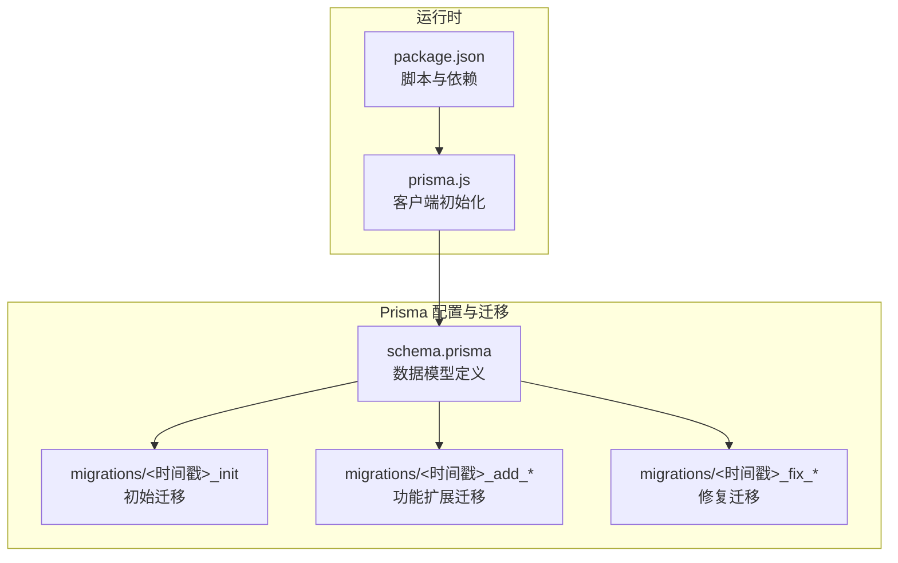
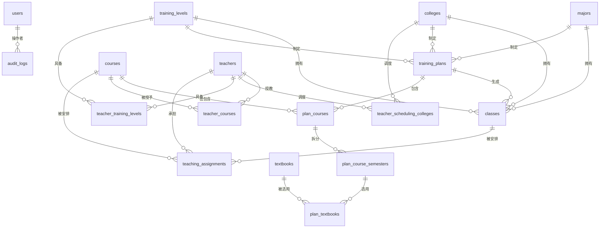
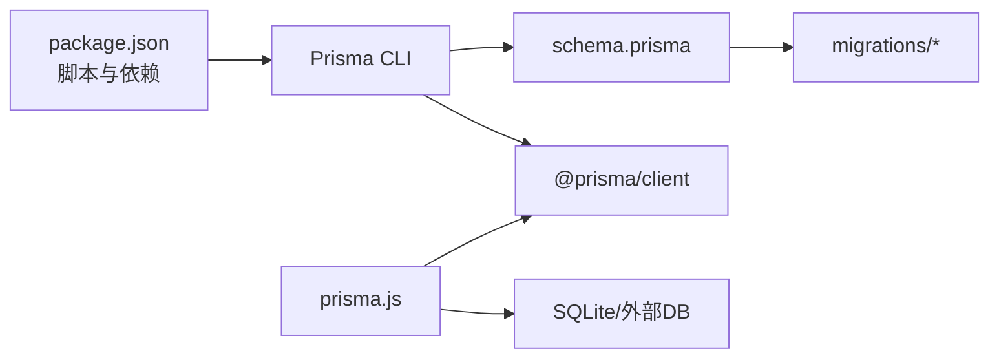

# 数据库设计

<cite>
**本文引用的文件**
- [schema.prisma](file://server/prisma/schema.prisma)
- [20260611161232_init/migration.sql](file://server/prisma/migrations/20260611161232_init/migration.sql)
- [20260614071843_add_performance_indexes/migration.sql](file://server/prisma/migrations/20260614071843_add_performance_indexes/migration.sql)
- [20260616131500_add_unique_to_majors_name/migration.sql](file://server/prisma/migrations/20260616131500_add_unique_to_majors_name/migration.sql)
- [20260618011823_add_teaching_module/migration.sql](file://server/prisma/migrations/20260618011823_add_teaching_module/migration.sql)
- [20260618053233_add_teacher_training_levels/migration.sql](file://server/prisma/migrations/20260618053233_add_teacher_training_levels/migration.sql)
- [20260618055117_add_affiliated_college_to_teachers/migration.sql](file://server/prisma/migrations/20260618055117_add_affiliated_college_to_teachers/migration.sql)
- [20260618092338_add_status_to_teachers/migration.sql](file://server/prisma/migrations/20260618092338_add_status_to_teachers/migration.sql)
- [20260623160000_add_composite_indexes/migration.sql](file://server/prisma/migrations/20260623160000_add_composite_indexes/migration.sql)
- [20260623170000_fix_ondelete_cascade_to_restrict/migration.sql](file://server/prisma/migrations/20260623170000_fix_ondelete_cascade_to_restrict/migration.sql)
- [prisma.js](file://server/src/lib/prisma.js)
- [package.json](file://server/package.json)
</cite>

## 目录
1. 引言
2. 项目结构
3. 核心组件
4. 架构总览
5. 详细组件分析
6. 依赖分析
7. 性能考量
8. 故障排查指南
9. 结论
10. 附录

## 引言
本文件面向KEC课程管理平台的数据库与ORM设计，基于Prisma数据模型与迁移脚本，系统化梳理用户、学院、专业、培养层次、班级、课程、教材、培养方案、教师、排课记录等核心实体的主键、外键、索引与完整性规则；并结合迁移历史展示版本演进与修复过程，最后给出SQLite与MySQL兼容性与切换建议。

## 项目结构
后端使用Prisma作为ORM，数据源默认为SQLite，通过环境变量配置。数据库迁移采用Prisma官方迁移机制，按时间戳命名的目录记录每次变更，包含初始建模与后续性能优化、唯一性增强、教学模块扩展、外键一致性修复等。

图表来源
- [schema.prisma](file://server/prisma/schema.prisma)
- [20260611161232_init/migration.sql](file://server/prisma/migrations/20260611161232_init/migration.sql)
- [20260618011823_add_teaching_module/migration.sql](file://server/prisma/migrations/20260618011823_add_teaching_module/migration.sql)
- [20260623170000_fix_ondelete_cascade_to_restrict/migration.sql](file://server/prisma/migrations/20260623170000_fix_ondelete_cascade_to_restrict/migration.sql)
- [prisma.js](file://server/src/lib/prisma.js)
- [package.json](file://server/package.json)

章节来源
- [schema.prisma](file://server/prisma/schema.prisma)
- [package.json](file://server/package.json)

## 核心组件
本节从数据模型角度概述各实体及约束要点，便于快速建立整体认知。

- 用户 users
  - 主键：自增整型
  - 唯一约束：用户名
  - 索引：角色、用户名（在早期迁移中存在，后续被移除）
  - 完整性：审计日志可空关联操作者

- 审计日志 audit_logs
  - 主键：自增整型
  - 外键：操作者关联用户（删除设为空）
  - 索引：创建时间降序、操作者、模块、动作

- 学院 colleges
  - 主键：自增整型
  - 唯一约束：名称
  - 关系：可被多个班级、培养方案、教师调度关联

- 专业 majors
  - 主键：自增整型
  - 唯一约束：名称
  - 关系：可被多个班级、培养方案关联

- 培养层次 training_levels
  - 主键：自增整型
  - 唯一约束：名称
  - 关系：可被多个班级、培养方案、教师调度关联

- 培养方案 training_plans
  - 主键：自增整型
  - 外键：专业、学院、培养层次（删除设为空）
  - 索引：专业、学院、培养层次

- 班级 classes
  - 主键：自增整型
  - 外键：专业、学院、培养层次、自定义培养方案（删除设为空）
  - 索引：状态、入学年份、专业+状态、培养层次、学院、自定义方案

- 课程 courses
  - 主键：自增整型
  - 索引：类型、编号

- 教材 textbooks
  - 主键：自增整型
  - 索引：是否启用、分类、ISBN

- 培养方案课程 plan_courses
  - 主键：自增整型
  - 唯一约束：方案+课程
  - 外键：方案（级联删除）、课程（限制删除）
  - 索引：方案、课程

- 学期课程 plan_course_semesters
  - 主键：自增整型
  - 唯一约束：方案课程+学期
  - 外键：方案课程（级联删除）
  - 索引：学期

- 教材选用 plan_textbooks
  - 主键：自增整型
  - 外键：学期课程（级联删除）、教材（限制删除）
  - 索引：学期、教材

- 教师 teachers
  - 主键：自增整型
  - 可选外键：所属学院（删除设为空）
  - 索引：人员类型、状态
  - 扩展：人员类型、学历类型、默认周学时、排序、状态字段逐步引入

- 教师-课程 teacher_courses
  - 主键：自增整型
  - 唯一约束：教师+课程
  - 外键：教师、课程（均级联删除）

- 教师-学院 teacher_scheduling_colleges
  - 主键：自增整型
  - 唯一约束：教师+学院
  - 外键：教师、学院（均级联删除）

- 教师-培养层次 teacher_training_levels
  - 主键：自增整型
  - 唯一约束：教师+培养层次
  - 外键：教师、培养层次（均级联删除）

- 排课记录 teaching_assignments
  - 主键：自增整型
  - 唯一约束：班级+课程+学期
  - 外键：教师、班级、课程（原为级联删除，已修复为限制删除）
  - 索引：教师、学期、课程+学期、班级+学期、教师+学期

章节来源
- [schema.prisma](file://server/prisma/schema.prisma)
- [20260611161232_init/migration.sql](file://server/prisma/migrations/20260611161232_init/migration.sql)
- [20260618011823_add_teaching_module/migration.sql](file://server/prisma/migrations/20260618011823_add_teaching_module/migration.sql)
- [20260623170000_fix_ondelete_cascade_to_restrict/migration.sql](file://server/prisma/migrations/20260623170000_fix_ondelete_cascade_to_restrict/migration.sql)

## 架构总览
下图展示核心实体间的ER关系，标注主键、外键与典型基数。

图表来源
- [schema.prisma](file://server/prisma/schema.prisma)
- [20260611161232_init/migration.sql](file://server/prisma/migrations/20260611161232_init/migration.sql)
- [20260618011823_add_teaching_module/migration.sql](file://server/prisma/migrations/20260618011823_add_teaching_module/migration.sql)

## 详细组件分析

### 用户与审计日志
- 设计要点
  - 用户表提供身份认证与权限基础，审计日志记录操作轨迹，支持按模块、动作、时间检索。
  - 操作者字段允许为空，以兼容匿名或系统级操作。
- 索引策略
  - 审计日志按创建时间倒序索引，利于分页查询最新记录。
  - 操作者、模块、动作建立独立索引，满足多维过滤。
- 迁移影响
  - 初次迁移未包含用户名唯一索引，后续版本中添加了唯一索引，提升查询稳定性与一致性。

章节来源
- [schema.prisma](file://server/prisma/schema.prisma)
- [20260611161232_init/migration.sql](file://server/prisma/migrations/20260611161232_init/migration.sql)

### 培养方案与课程体系
- 设计要点
  - 培养方案作为顶层计划，绑定专业、学院、培养层次。
  - 方案-课程映射控制开课范围与学时分布，学期维度进一步细化周学时与周数。
  - 教材选用通过学期课程粒度进行绑定，支持必修标记。
- 约束与索引
  - 方案+课程唯一，避免重复开课。
  - 学期课程按(方案课程, 学期)唯一，确保每学期每门课唯一条目。
  - 教材选用按学期+教材索引，便于统计与报表。
- 迁移影响
  - 初始迁移定义了完整结构；后续迁移补充了复合索引与唯一性约束，提升查询效率与数据一致性。

章节来源
- [schema.prisma](file://server/prisma/schema.prisma)
- [20260611161232_init/migration.sql](file://server/prisma/migrations/20260611161232_init/migration.sql)
- [20260614071843_add_performance_indexes/migration.sql](file://server/prisma/migrations/20260614071843_add_performance_indexes/migration.sql)

### 教师与排课
- 设计要点
  - 教师可具备多学科与多培养层次的教学资格，并可按学院进行调度。
  - 排课记录以“班级+课程+学期”唯一，确保同一学期同班同课不重复。
  - 教师、班级、课程三者均为强约束，删除策略在修复迁移中由级联改为限制，避免误删导致数据链断裂。
- 索引策略
  - 教师、学期、课程+学期、班级+学期、教师+学期等复合索引，覆盖常见查询模式。
- 迁移影响
  - 教学模块迁移引入教师相关表与排课表；后续修复迁移统一外键删除策略，提升数据安全。

章节来源
- [schema.prisma](file://server/prisma/schema.prisma)
- [20260618011823_add_teaching_module/migration.sql](file://server/prisma/migrations/20260618011823_add_teaching_module/migration.sql)
- [20260623170000_fix_ondelete_cascade_to_restrict/migration.sql](file://server/prisma/migrations/20260623170000_fix_ondelete_cascade_to_restrict/migration.sql)

### 班级与培养方案
- 设计要点
  - 班级可绑定专业、学院、培养层次与自定义培养方案；状态、入学年份等字段用于筛选与统计。
  - 自定义培养方案可为空，表示沿用标准方案。
- 索引策略
  - 状态、入学年份、专业+状态、培养层次、学院、自定义方案等索引，支撑多维筛选与排序。

章节来源
- [schema.prisma](file://server/prisma/schema.prisma)
- [20260611161232_init/migration.sql](file://server/prisma/migrations/20260611161232_init/migration.sql)

### 专业与培养层次
- 设计要点
  - 专业与培养层次均要求名称唯一，避免歧义。
  - 二者均可作为培养方案的限定条件，形成稳定的组织维度。
- 索引策略
  - 唯一索引保障名称唯一性；相关表通过外键与索引支撑高效查询。

章节来源
- [schema.prisma](file://server/prisma/schema.prisma)
- [20260616131500_add_unique_to_majors_name/migration.sql](file://server/prisma/migrations/20260616131500_add_unique_to_majors_name/migration.sql)

### 教师属性演进
- 设计要点
  - 教师表逐步引入人员类型、学历类型、默认周学时、排序、状态、所属学院等字段，满足教学调度与统计需求。
- 迁移影响
  - 所有字段调整均通过重定义表实现，保留历史数据并重建必要索引。

章节来源
- [20260618055117_add_affiliated_college_to_teachers/migration.sql](file://server/prisma/migrations/20260618055117_add_affiliated_college_to_teachers/migration.sql)
- [20260618092338_add_status_to_teachers/migration.sql](file://server/prisma/migrations/20260618092338_add_status_to_teachers/migration.sql)

## 依赖分析
- ORM与数据源
  - Prisma客户端与SQLite数据源在schema中声明；运行时通过prisma.js加载配置，支持通过环境变量覆盖数据库URL。
- 迁移与版本
  - 迁移按时间戳顺序执行，先初始化，再逐步扩展与修复；修复迁移统一了外键删除策略，确保数据一致性。
- 脚本与工具
  - package.json提供数据库相关脚本，包括迁移、生成客户端、初始化设置、种子数据等。

图表来源
- [package.json](file://server/package.json)
- [schema.prisma](file://server/prisma/schema.prisma)
- [prisma.js](file://server/src/lib/prisma.js)

章节来源
- [package.json](file://server/package.json)
- [prisma.js](file://server/src/lib/prisma.js)

## 性能考量
- 索引策略
  - 审计日志：按创建时间倒序索引，模块、动作、操作者独立索引，满足高频查询。
  - 班级：状态、入学年份、专业+状态、培养层次、学院、自定义方案索引，支撑多维筛选。
  - 培养方案与课程：方案+课程唯一，方案、课程索引；学期课程按学期索引；教材选用按学期与教材索引。
  - 教师与排课：人员类型、状态索引；排课按教师、学期、课程+学期、班级+学期、教师+学期复合索引。
- 查询模式
  - 建议优先使用复合索引覆盖常见过滤条件（如学期+课程、班级+学期、教师+学期）。
- 数据类型
  - 浮点型用于周学时与价格等小数场景，SQLite的REAL足以满足业务精度。

章节来源
- [20260611161232_init/migration.sql](file://server/prisma/migrations/20260611161232_init/migration.sql)
- [20260614071843_add_performance_indexes/migration.sql](file://server/prisma/migrations/20260614071843_add_performance_indexes/migration.sql)
- [20260623160000_add_composite_indexes/migration.sql](file://server/prisma/migrations/20260623160000_add_composite_indexes/migration.sql)

## 故障排查指南
- 外键删除策略不一致
  - 现象：删除教师/班级/课程可能引发级联删除，导致数据异常。
  - 处理：修复迁移将排课记录的外键删除策略从CASCADE改为RESTRICT，需先清理或迁移相关记录再删除。
- 唯一性冲突
  - 现象：插入重复的用户名、专业名、唯一索引字段。
  - 处理：检查唯一索引约束，修正重复数据或更新逻辑。
- 查询性能差
  - 现象：按学期、课程、班级等条件查询慢。
  - 处理：确认对应索引是否存在；必要时使用复合索引优化查询路径。
- 运行时连接问题
  - 现象：测试或开发环境无法连接数据库。
  - 处理：检查DATABASE_URL环境变量；确保SQLite文件路径正确或外部数据库可达。

章节来源
- [20260623170000_fix_ondelete_cascade_to_restrict/migration.sql](file://server/prisma/migrations/20260623170000_fix_ondelete_cascade_to_restrict/migration.sql)
- [prisma.js](file://server/src/lib/prisma.js)

## 结论
本设计以Prisma为核心，围绕培养方案与排课两大主线构建数据模型，辅以外键约束与索引策略保障数据完整性与查询效率。迁移历史体现了从初始建模到功能扩展再到一致性修复的演进路径。若未来需要切换至MySQL，需关注数据类型差异、索引语法与外键行为的适配，并在迁移前做好数据校验与回滚预案。

## 附录

### 迁移历史与版本演进
- 初始建模（20260611161232_init）
  - 完成用户、审计、学院、专业、培养层次、培养方案、班级、课程、教材、培养方案课程、学期课程、教材选用等核心表与索引。
- 性能优化（20260614071843_add_performance_indexes）
  - 新增班级自定义方案、学期课程学期、教材选用相关索引；移除用户名冗余索引。
- 唯一性增强（20260616131500_add_unique_to_majors_name）
  - 为专业名称增加唯一索引。
- 教学模块扩展（20260618011823_add_teaching_module）
  - 新增教师、教师-课程、教师-学院、排课记录表与索引。
- 教师属性完善（20260618053233_add_teacher_training_levels、20260618055117_add_affiliated_college_to_teachers、20260618092338_add_status_to_teachers）
  - 逐步引入教师-培养层次关联、所属学院与状态字段。
- 复合索引补充（20260623160000_add_composite_indexes）
  - 为排课记录新增复合索引，覆盖常用查询组合。
- 外键策略修复（20260623170000_fix_ondelete_cascade_to_restrict）
  - 将排课记录外键删除策略从CASCADE改为RESTRICT，统一与Prisma声明一致。

章节来源
- [20260611161232_init/migration.sql](file://server/prisma/migrations/20260611161232_init/migration.sql)
- [20260614071843_add_performance_indexes/migration.sql](file://server/prisma/migrations/20260614071843_add_performance_indexes/migration.sql)
- [20260616131500_add_unique_to_majors_name/migration.sql](file://server/prisma/migrations/20260616131500_add_unique_to_majors_name/migration.sql)
- [20260618011823_add_teaching_module/migration.sql](file://server/prisma/migrations/20260618011823_add_teaching_module/migration.sql)
- [20260618053233_add_teacher_training_levels/migration.sql](file://server/prisma/migrations/20260618053233_add_teacher_training_levels/migration.sql)
- [20260618055117_add_affiliated_college_to_teachers/migration.sql](file://server/prisma/migrations/20260618055117_add_affiliated_college_to_teachers/migration.sql)
- [20260618092338_add_status_to_teachers/migration.sql](file://server/prisma/migrations/20260618092338_add_status_to_teachers/migration.sql)
- [20260623160000_add_composite_indexes/migration.sql](file://server/prisma/migrations/20260623160000_add_composite_indexes/migration.sql)
- [20260623170000_fix_ondelete_cascade_to_restrict/migration.sql](file://server/prisma/migrations/20260623170000_fix_ondelete_cascade_to_restrict/migration.sql)

### SQLite 与 MySQL 兼容性与切换方案
- 兼容性考虑
  - 数据类型：REAL用于浮点数，DECIMAL在MySQL中更精确，需评估是否转换。
  - 索引语法：MySQL对部分索引语法与SQLite略有差异，需逐条核对。
  - 外键行为：MySQL默认严格外键检查，需在导入数据前关闭外键检查或按顺序导入。
  - 时间函数：CURRENT_TIMESTAMP在两者差异较小，但需统一时区处理。
- 切换步骤建议
  - 使用Prisma导出SQL或迁移脚本，逐条比对差异并修正。
  - 先在测试库验证索引、约束与查询性能，再迁移生产数据。
  - 导入前关闭外键检查，按依赖顺序导入，最后开启并校验约束。
  - 更新运行时配置与环境变量，确保连接字符串与驱动匹配目标数据库。

章节来源
- [schema.prisma](file://server/prisma/schema.prisma)
- [package.json](file://server/package.json)