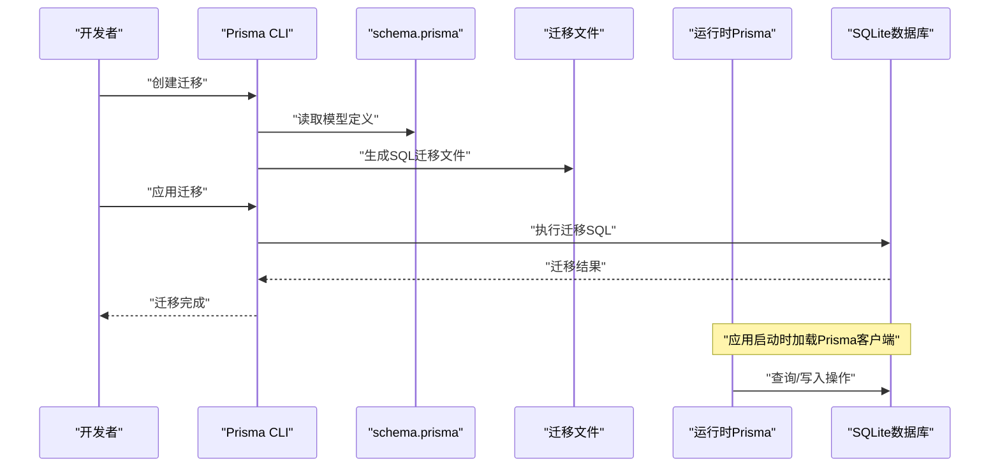
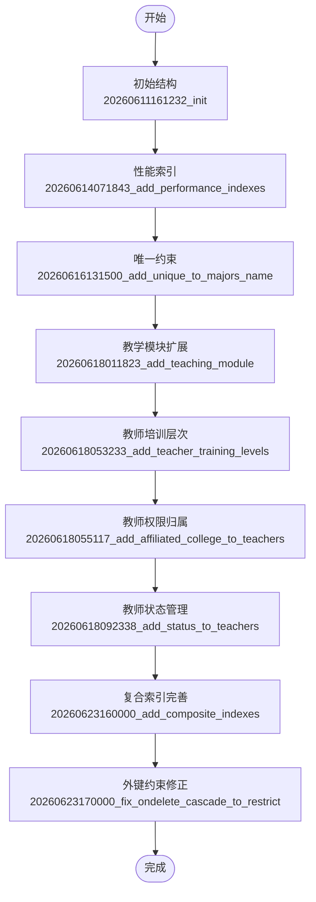

# 数据库迁移管理

<cite>
**本文档引用的文件**
- [schema.prisma](file://server/prisma/schema.prisma)
- [20260611161232_init/migration.sql](file://server/prisma/migrations/20260611161232_init/migration.sql)
- [20260614071843_add_performance_indexes/migration.sql](file://server/prisma/migrations/20260614071843_add_performance_indexes/migration.sql)
- [20260616131500_add_unique_to_majors_name/migration.sql](file://server/prisma/migrations/20260616131500_add_unique_to_majors_name/migration.sql)
- [20260618011823_add_teaching_module/migration.sql](file://server/prisma/migrations/20260618011823_add_teaching_module/migration.sql)
- [20260618053233_add_teacher_training_levels/migration.sql](file://server/prisma/migrations/20260618053233_add_teacher_training_levels/migration.sql)
- [20260618055117_add_affiliated_college_to_teachers/migration.sql](file://server/prisma/migrations/20260618055117_add_affiliated_college_to_teachers/migration.sql)
- [20260618092338_add_status_to_teachers/migration.sql](file://server/prisma/migrations/20260618092338_add_status_to_teachers/migration.sql)
- [20260623160000_add_composite_indexes/migration.sql](file://server/prisma/migrations/20260623160000_add_composite_indexes/migration.sql)
- [20260623170000_fix_ondelete_cascade_to_restrict/migration.sql](file://server/prisma/migrations/20260623170000_fix_ondelete_cascade_to_restrict/migration.sql)
- [reset-database.js](file://server/scripts/reset-database.js)
- [init-settings.js](file://server/scripts/init-settings.js)
- [manual_create_settings.sql](file://server/prisma/manual_create_settings.sql)
- [prisma.js](file://server/src/lib/prisma.js)
- [package.json](file://package.json)
- [package.json](file://server/package.json)
- [deploy.sh](file://deploy.sh)
- [deploy_ssh.sh](file://deploy_ssh.sh)
- [seed.js](file://server/prisma/seed.js)
</cite>

## 目录
1. [简介](#简介)
2. [项目结构](#项目结构)
3. [核心组件](#核心组件)
4. [架构概览](#架构概览)
5. [详细组件分析](#详细组件分析)
6. [依赖关系分析](#依赖关系分析)
7. [性能考虑](#性能考虑)
8. [故障排除指南](#故障排除指南)
9. [结论](#结论)
10. [附录](#附录)

## 简介
本文件面向KEC课程管理平台的数据库迁移管理，系统性阐述基于Prisma的迁移体系使用方法与最佳实践。内容涵盖迁移文件生成、执行与回滚策略，数据库版本演进历史（初始结构、性能索引、唯一约束、外键约束调整等关键节点），以及数据库初始化与重置脚本的使用说明。同时提供生产环境迁移注意事项、数据备份策略与迁移最佳实践，帮助开发与运维团队安全高效地管理数据库变更。

## 项目结构
KEC平台采用SQLite作为开发/测试数据库，Prisma负责模型定义与迁移管理。迁移文件位于server/prisma/migrations目录下，每个迁移以时间戳命名，包含对应的SQL实现；数据库模式定义于server/prisma/schema.prisma；运行时通过server/src/lib/prisma.js统一注入Prisma客户端实例。

```mermaid
graph TB
subgraph "开发工具链"
PRISMA[Prisma CLI]
SCHEMA[schema.prisma]
end
subgraph "迁移文件"
MIG_INIT[20260611161232_init]
MIG_PERF[20260614071843_add_performance_indexes]
MIG_UNIQUE[20260616131500_add_unique_to_majors_name]
MIG_TEACH[20260618011823_add_teaching_module]
MIG_TRAIN[20260618053233_add_teacher_training_levels]
MIG_COLLEGE[20260618055117_add_affiliated_college_to_teachers]
MIG_STATUS[20260618092338_add_status_to_teachers]
MIG_COMP[20260623160000_add_composite_indexes]
MIG_FIX[20260623170000_fix_ondelete_cascade_to_restrict]
end
subgraph "运行时"
LIB_PRISMA[src/lib/prisma.js]
SCRIPT_RESET[scripts/reset-database.js]
SCRIPT_INIT[scripts/init-settings.js]
SEED[prisma/seed.js]
end
PRISMA --> SCHEMA
SCHEMA --> MIG_INIT
SCHEMA --> MIG_PERF
SCHEMA --> MIG_UNIQUE
SCHEMA --> MIG_TEACH
SCHEMA --> MIG_TRAIN
SCHEMA --> MIG_COLLEGE
SCHEMA --> MIG_STATUS
SCHEMA --> MIG_COMP
SCHEMA --> MIG_FIX
LIB_PRISMA --> SCHEMA
SCRIPT_RESET --> SCHEMA
SCRIPT_INIT --> SCHEMA
SEED --> SCHEMA
```

**图表来源**
- [schema.prisma:1-308](file://server/prisma/schema.prisma#L1-L308)
- [20260611161232_init/migration.sql:1-248](file://server/prisma/migrations/20260611161232_init/migration.sql#L1-L248)
- [prisma.js:1-34](file://server/src/lib/prisma.js#L1-L34)
- [reset-database.js:1-131](file://server/scripts/reset-database.js#L1-L131)
- [init-settings.js:1-99](file://server/scripts/init-settings.js#L1-L99)
- [seed.js:1-42](file://server/prisma/seed.js#L1-L42)

**章节来源**
- [schema.prisma:1-308](file://server/prisma/schema.prisma#L1-L308)
- [package.json:1-25](file://package.json#L1-L25)
- [package.json:1-25](file://server/package.json#L1-L25)

## 核心组件
- Prisma Schema：定义数据模型、关系、索引与约束，是迁移的唯一真相来源。
- 迁移文件：按时间戳命名的SQL脚本，记录数据库结构演进的历史。
- 运行时Prisma客户端：通过src/lib/prisma.js集中管理日志、测试数据库切换与连接事件监听。
- 初始化与重置脚本：提供一键重置数据库结构与种子数据的能力。
- 生产部署脚本：自动化执行迁移、生成客户端与校验数据库完整性。

**章节来源**
- [schema.prisma:1-308](file://server/prisma/schema.prisma#L1-L308)
- [prisma.js:1-34](file://server/src/lib/prisma.js#L1-L34)
- [reset-database.js:1-131](file://server/scripts/reset-database.js#L1-L131)
- [init-settings.js:1-99](file://server/scripts/init-settings.js#L1-L99)
- [deploy.sh:111-181](file://deploy.sh#L111-L181)
- [deploy_ssh.sh:251-276](file://deploy_ssh.sh#L251-L276)

## 架构概览
下图展示了从Schema到迁移文件再到运行时的完整流程，以及生产部署中的迁移执行顺序。

**图表来源**
- [schema.prisma:1-308](file://server/prisma/schema.prisma#L1-L308)
- [20260611161232_init/migration.sql:1-248](file://server/prisma/migrations/20260611161232_init/migration.sql#L1-L248)
- [prisma.js:1-34](file://server/src/lib/prisma.js#L1-L34)

## 详细组件分析

### 迁移系统使用方法
- 生成迁移：基于schema.prisma的变更，使用Prisma CLI生成对应SQL迁移文件，文件名以时间戳前缀区分先后顺序。
- 应用迁移：在目标环境中执行迁移，确保数据库结构与Schema一致。
- 回滚策略：对于可逆变更，可在迁移文件中包含反向SQL；对于不可逆变更，应谨慎评估风险并在生产环境使用备份恢复方案。

**章节来源**
- [schema.prisma:1-308](file://server/prisma/schema.prisma#L1-L308)
- [package.json:1-25](file://server/package.json#L1-L25)

### 数据库版本演进历史
以下为关键迁移节点的演进历程，按时间顺序梳理：

- 初始数据库结构（20260611161232_init）
  - 定义了审计日志、班级、学院、课程、专业、培养计划、教师、教学安排、教材、系统设置等核心表。
  - 建立了基础索引与唯一约束，确保常用查询性能与数据一致性。
  - 外键关系明确，体现业务实体间的关联。

- 性能索引增强（20260614071843_add_performance_indexes）
  - 为classes、plan_course_semesters、plan_textbooks、training_plans等表新增索引，优化查询性能。
  - 对users表的索引进行了调整，平衡查询与写入性能。

- 唯一约束强化（20260616131500_add_unique_to_majors_name）
  - 为专业表的name字段添加唯一索引，避免重复专业名称导致的数据歧义。

- 教学模块扩展（20260618011823_add_teaching_module）
  - 引入教师-课程、教师-学院、教师-培养层次等多对多关系表，完善教学组织能力。
  - 为teaching_assignments表建立复合索引，支持按学期、教师、班级、课程维度的高效查询。

- 教师培训层次（20260618053233_add_teacher_training_levels）
  - 新增教师培训层次关联，支持按不同培养层次分配教学任务。

- 教师权限归属（20260618055117_add_affiliated_college_to_teachers）
  - 为教师增加所属学院字段，便于权限与排课范围控制。

- 教师状态管理（20260618092338_add_status_to_teachers）
  - 引入教师状态字段，支持在职/离职等状态管理。

- 复合索引完善（20260623160000_add_composite_indexes）
  - 为多个表的联合查询场景建立复合索引，进一步提升复杂查询性能。

- 外键约束修正（20260623170000_fix_ondelete_cascade_to_restrict）
  - 将teaching_assignments的外键删除行为从CASCADE调整为RESTRICT，防止误删教学安排影响数据完整性。
  - 通过重建表的方式确保约束与Schema声明一致。

**图表来源**
- [20260611161232_init/migration.sql:1-248](file://server/prisma/migrations/20260611161232_init/migration.sql#L1-L248)
- [20260614071843_add_performance_indexes/migration.sql:1-24](file://server/prisma/migrations/20260614071843_add_performance_indexes/migration.sql#L1-L24)
- [20260616131500_add_unique_to_majors_name/migration.sql:1-3](file://server/prisma/migrations/20260616131500_add_unique_to_majors_name/migration.sql#L1-L3)
- [20260618011823_add_teaching_module/migration.sql:1-248](file://server/prisma/migrations/20260618011823_add_teaching_module/migration.sql#L1-L248)
- [20260618053233_add_teacher_training_levels/migration.sql:1-248](file://server/prisma/migrations/20260618053233_add_teacher_training_levels/migration.sql#L1-L248)
- [20260618055117_add_affiliated_college_to_teachers/migration.sql:1-248](file://server/prisma/migrations/20260618055117_add_affiliated_college_to_teachers/migration.sql#L1-L248)
- [20260618092338_add_status_to_teachers/migration.sql:1-248](file://server/prisma/migrations/20260618092338_add_status_to_teachers/migration.sql#L1-L248)
- [20260623160000_add_composite_indexes/migration.sql:1-248](file://server/prisma/migrations/20260623160000_add_composite_indexes/migration.sql#L1-L248)
- [20260623170000_fix_ondelete_cascade_to_restrict/migration.sql:1-36](file://server/prisma/migrations/20260623170000_fix_ondelete_cascade_to_restrict/migration.sql#L1-L36)

**章节来源**
- [20260611161232_init/migration.sql:1-248](file://server/prisma/migrations/20260611161232_init/migration.sql#L1-L248)
- [20260614071843_add_performance_indexes/migration.sql:1-24](file://server/prisma/migrations/20260614071843_add_performance_indexes/migration.sql#L1-L24)
- [20260616131500_add_unique_to_majors_name/migration.sql:1-3](file://server/prisma/migrations/20260616131500_add_unique_to_majors_name/migration.sql#L1-L3)
- [20260618011823_add_teaching_module/migration.sql:1-248](file://server/prisma/migrations/20260618011823_add_teaching_module/migration.sql#L1-L248)
- [20260618053233_add_teacher_training_levels/migration.sql:1-248](file://server/prisma/migrations/20260618053233_add_teacher_training_levels/migration.sql#L1-L248)
- [20260618055117_add_affiliated_college_to_teachers/migration.sql:1-248](file://server/prisma/migrations/20260618055117_add_affiliated_college_to_teachers/migration.sql#L1-L248)
- [20260618092338_add_status_to_teachers/migration.sql:1-248](file://server/prisma/migrations/20260618092338_add_status_to_teachers/migration.sql#L1-L248)
- [20260623160000_add_composite_indexes/migration.sql:1-248](file://server/prisma/migrations/20260623160000_add_composite_indexes/migration.sql#L1-L248)
- [20260623170000_fix_ondelete_cascade_to_restrict/migration.sql:1-36](file://server/prisma/migrations/20260623170000_fix_ondelete_cascade_to_restrict/migration.sql#L1-L36)

### 数据库初始化与重置脚本
- 初始化系统设置脚本
  - 功能：向system_settings表插入默认配置项，若键已存在则跳过。
  - 适用场景：首次部署或需要恢复默认设置时使用。
  - 注意事项：执行前需确保Prisma已生成客户端且数据库连接正常。

- 数据库重置脚本
  - 功能：清空所有业务表数据，重新生成表结构，创建默认管理员账户与系统设置。
  - 适用场景：开发环境快速重置、测试数据清理或修复数据库异常。
  - 注意事项：该过程会丢失所有业务数据，生产环境慎用。

- 手动创建系统设置脚本
  - 功能：在Prisma迁移失败或无法生成客户端时，直接通过SQL创建system_settings表并插入默认值。
  - 适用场景：紧急恢复或迁移中断后的补救措施。

**章节来源**
- [init-settings.js:1-99](file://server/scripts/init-settings.js#L1-L99)
- [reset-database.js:1-131](file://server/scripts/reset-database.js#L1-L131)
- [manual_create_settings.sql:1-29](file://server/prisma/manual_create_settings.sql#L1-L29)

### 生产环境迁移注意事项
- 迁移策略
  - 使用npx prisma migrate deploy安全应用已有迁移，避免清空数据。
  - 在部署脚本中先执行迁移，再生成Prisma客户端，最后初始化种子数据。
  - 若迁移失败，部署脚本会尝试重置数据库并重新部署，确保系统可用性。

- 数据备份
  - 在执行重大迁移前，备份SQLite数据库文件。
  - 对于涉及外键约束调整的迁移，建议先在测试环境验证后再推广至生产。

- 监控与验证
  - 部署完成后验证关键表与数据是否存在，确保系统功能正常。
  - 关注Prisma客户端的日志输出，及时发现潜在问题。

**章节来源**
- [deploy.sh:111-181](file://deploy.sh#L111-L181)
- [deploy_ssh.sh:251-276](file://deploy_ssh.sh#L251-L276)

## 依赖关系分析
下图展示Prisma Schema与各迁移文件之间的依赖关系，以及运行时组件对Schema的依赖。

```mermaid
graph TB
SCHEMA[schema.prisma]
INIT[20260611161232_init]
PERF[20260614071843_add_performance_indexes]
UNIQUE[20260616131500_add_unique_to_majors_name]
TEACH[20260618011823_add_teaching_module]
TRAIN[20260618053233_add_teacher_training_levels]
COLLEGE[20260618055117_add_affiliated_college_to_teachers]
STATUS[20260618092338_add_status_to_teachers]
COMP[20260623160000_add_composite_indexes]
FIX[20260623170000_fix_ondelete_cascade_to_restrict]
SCHEMA --> INIT
SCHEMA --> PERF
SCHEMA --> UNIQUE
SCHEMA --> TEACH
SCHEMA --> TRAIN
SCHEMA --> COLLEGE
SCHEMA --> STATUS
SCHEMA --> COMP
SCHEMA --> FIX
PRISMA_LIB[src/lib/prisma.js] --> SCHEMA
RESET_SCRIPT[scripts/reset-database.js] --> SCHEMA
INIT_SCRIPT[scripts/init-settings.js] --> SCHEMA
SEED_SCRIPT[prisma/seed.js] --> SCHEMA
```

**图表来源**
- [schema.prisma:1-308](file://server/prisma/schema.prisma#L1-L308)
- [20260611161232_init/migration.sql:1-248](file://server/prisma/migrations/20260611161232_init/migration.sql#L1-L248)
- [20260614071843_add_performance_indexes/migration.sql:1-24](file://server/prisma/migrations/20260614071843_add_performance_indexes/migration.sql#L1-L24)
- [20260616131500_add_unique_to_majors_name/migration.sql:1-3](file://server/prisma/migrations/20260616131500_add_unique_to_majors_name/migration.sql#L1-L3)
- [20260618011823_add_teaching_module/migration.sql:1-248](file://server/prisma/migrations/20260618011823_add_teaching_module/migration.sql#L1-L248)
- [20260618053233_add_teacher_training_levels/migration.sql:1-248](file://server/prisma/migrations/20260618053233_add_teacher_training_levels/migration.sql#L1-L248)
- [20260618055117_add_affiliated_college_to_teachers/migration.sql:1-248](file://server/prisma/migrations/20260618055117_add_affiliated_college_to_teachers/migration.sql#L1-L248)
- [20260618092338_add_status_to_teachers/migration.sql:1-248](file://server/prisma/migrations/20260618092338_add_status_to_teachers/migration.sql#L1-L248)
- [20260623160000_add_composite_indexes/migration.sql:1-248](file://server/prisma/migrations/20260623160000_add_composite_indexes/migration.sql#L1-L248)
- [20260623170000_fix_ondelete_cascade_to_restrict/migration.sql:1-36](file://server/prisma/migrations/20260623170000_fix_ondelete_cascade_to_restrict/migration.sql#L1-L36)
- [prisma.js:1-34](file://server/src/lib/prisma.js#L1-L34)
- [reset-database.js:1-131](file://server/scripts/reset-database.js#L1-L131)
- [init-settings.js:1-99](file://server/scripts/init-settings.js#L1-L99)
- [seed.js:1-42](file://server/prisma/seed.js#L1-L42)

**章节来源**
- [schema.prisma:1-308](file://server/prisma/schema.prisma#L1-L308)
- [prisma.js:1-34](file://server/src/lib/prisma.js#L1-L34)
- [reset-database.js:1-131](file://server/scripts/reset-database.js#L1-L131)
- [init-settings.js:1-99](file://server/scripts/init-settings.js#L1-L99)
- [seed.js:1-42](file://server/prisma/seed.js#L1-L42)

## 性能考虑
- 索引设计
  - 为高频查询字段建立单列与复合索引，减少全表扫描。
  - 合理选择索引字段组合，避免过度索引导致写入性能下降。
- 外键约束
  - 在保证数据一致性的前提下，尽量使用RESTRICT而非CASCADE，避免误删引发连锁反应。
- 查询优化
  - 结合业务查询模式，定期审查索引使用情况，必要时调整索引策略。
- 缓存与批量操作
  - 对热点数据可引入应用层缓存，减少数据库压力。
  - 批量写入时使用事务，提高吞吐量并保证原子性。

## 故障排除指南
- 迁移失败
  - 检查Prisma客户端是否已生成，确认数据库连接字符串正确。
  - 查看迁移文件中的SQL语法与外键约束是否与Schema一致。
  - 在部署脚本中若迁移失败，可尝试重置数据库后重新部署。
- 数据丢失
  - 在执行重置脚本前务必备份数据库文件。
  - 对于关键生产数据，优先采用增量迁移而非重置。
- 索引失效
  - 若发现查询变慢，检查相关索引是否被正确创建。
  - 对于复合索引，确认查询条件与索引列顺序匹配。
- 外键冲突
  - 在调整外键约束时，先清理或迁移相关数据，再执行迁移。
  - 对于RESTRICT约束，确保业务逻辑在删除前进行解绑处理。

**章节来源**
- [deploy.sh:111-181](file://deploy.sh#L111-L181)
- [deploy_ssh.sh:251-276](file://deploy_ssh.sh#L251-L276)
- [reset-database.js:1-131](file://server/scripts/reset-database.js#L1-L131)

## 结论
KEC课程管理平台的数据库迁移管理以Prisma为核心，通过结构化的迁移文件与完善的脚本工具，实现了从开发到生产的无缝衔接。遵循本文档的最佳实践与注意事项，可以在保障数据安全的前提下高效推进数据库演进，确保系统稳定可靠地服务于教学管理工作。

## 附录
- 迁移命令参考
  - 生成迁移：npx prisma migrate dev
  - 应用迁移：npx prisma migrate deploy
  - 生成客户端：npx prisma generate
  - 重置迁移：npx prisma migrate reset --force
- 常用脚本
  - 初始化系统设置：npm run init:settings
  - 重置数据库：node scripts/reset-database.js
  - 种子数据：npm run db:seed

**章节来源**
- [package.json:1-25](file://server/package.json#L1-L25)
- [deploy.sh:111-181](file://deploy.sh#L111-L181)
- [deploy_ssh.sh:251-276](file://deploy_ssh.sh#L251-L276)
- [seed.js:1-42](file://server/prisma/seed.js#L1-L42)