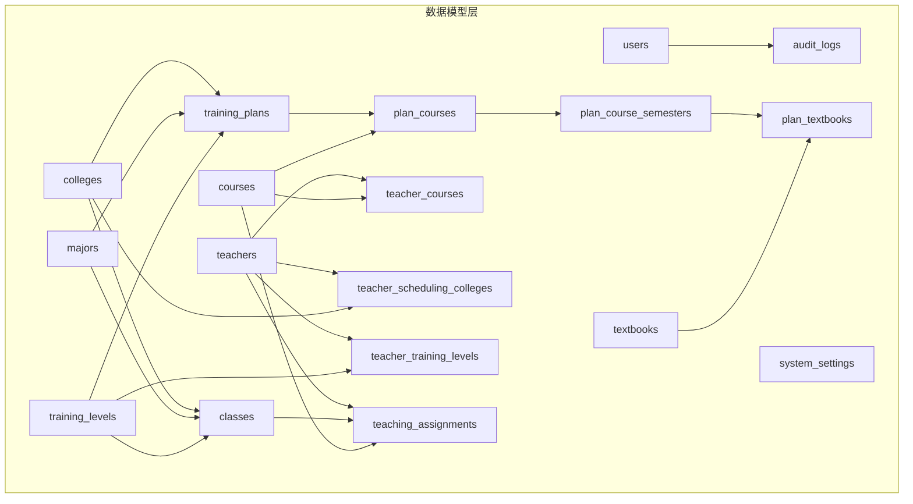
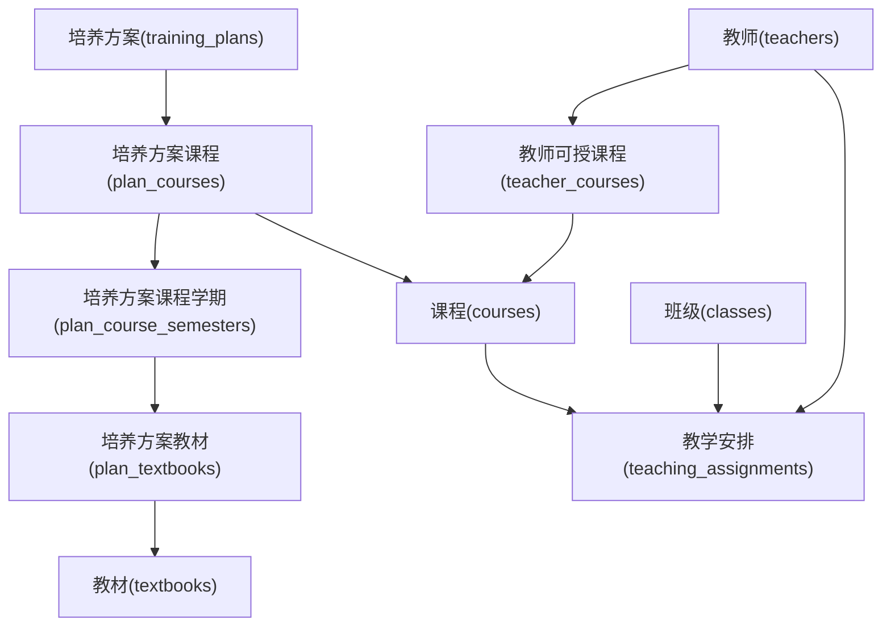
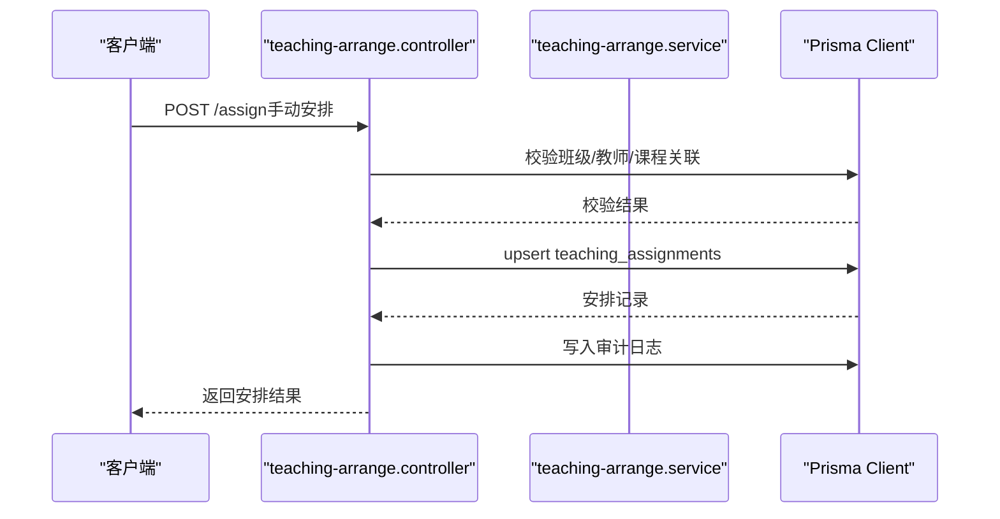
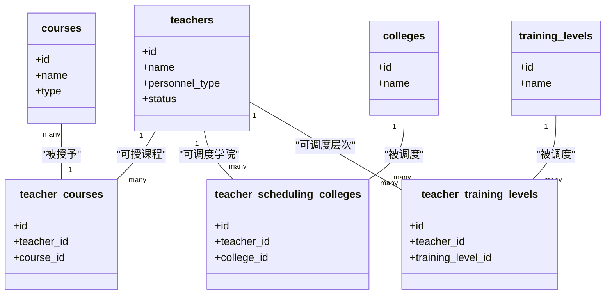
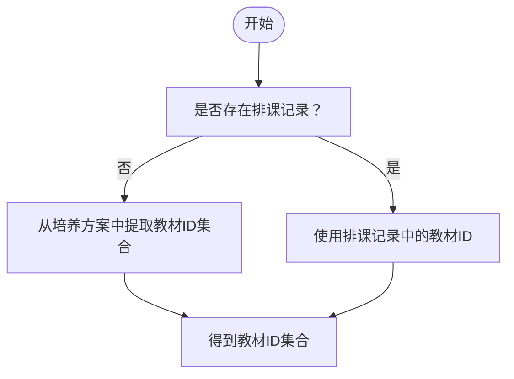

# 数据模型定义

<cite>
**本文档引用的文件**
- [schema.prisma](file://server/prisma/schema.prisma)
- [20260611161232_init/migration.sql](file://server/prisma/migrations/202606111611161232_init/migration.sql)
- [20260618011823_add_teaching_module/migration.sql](file://server/prisma/migrations/20260618011823_add_teaching_module/migration.sql)
- [20260618053233_add_teacher_training_levels/migration.sql](file://server/prisma/migrations/20260618053233_add_teacher_training_levels/migration.sql)
- [20260623170000_fix_ondelete_cascade_to_restrict/migration.sql](file://server/prisma/migrations/20260623170000_fix_ondelete_cascade_to_restrict/migration.sql)
- [manual_create_settings.sql](file://server/prisma/manual_create_settings.sql)
- [seed.js](file://server/prisma/seed.js)
- [user.controller.js](file://server/src/controllers/user.controller.js)
- [teaching-arrange.controller.js](file://server/src/controllers/teaching-arrange.controller.js)
- [queries.js](file://server/src/services/arrange/queries.js)
</cite>

## 目录
1. [简介](#简介)
2. [项目结构](#项目结构)
3. [核心组件](#核心组件)
4. [架构概览](#架构概览)
5. [详细组件分析](#详细组件分析)
6. [依赖分析](#依赖分析)
7. [性能考虑](#性能考虑)
8. [故障排除指南](#故障排除指南)
9. [结论](#结论)

## 简介
本文件面向KEC课程管理平台的Prisma ORM数据模型，系统性梳理所有核心实体的字段定义、数据类型、约束条件与默认值，并解释各模型的设计目的与业务含义。同时，明确主键、外键关系与级联操作策略，给出模型间的关联关系与引用路径，帮助开发者与运维人员准确理解数据结构与业务规则。

## 项目结构
数据模型由Prisma Schema定义，配合多版本迁移脚本记录演进过程。系统采用SQLite作为数据库，通过Prisma Client进行类型安全访问。种子脚本负责初始化超级管理员与系统设置，教学安排模块通过控制器与服务层调用数据模型实现业务逻辑。

图表来源
- [schema.prisma:10-308](file://server/prisma/schema.prisma#L10-L308)

章节来源
- [schema.prisma:1-308](file://server/prisma/schema.prisma#L1-L308)

## 核心组件

本节按模型维度逐一说明字段、类型、约束与默认值，并解释设计目的与业务含义。

- users（用户）
  - 字段与类型：id（整型，主键，自增）、username（字符串，唯一）、password（字符串）、role（字符串，默认"viewer"）、real_name（字符串）、email（字符串）、is_active（布尔，默认true）、last_login_at（时间戳）、created_at/updated_at（时间戳，默认now）
  - 约束与默认值：username唯一；role默认"viewer"；is_active默认true；时间戳默认now
  - 设计目的：系统用户身份与权限管理，审计日志的关联方
  - 关联关系：audit_logs.operator_id → users.id（外键，删除设空）

- audit_logs（审计日志）
  - 字段与类型：id（整型，主键，自增）、action（字符串）、module（字符串）、operator_id（整型，可空）、ip（字符串）、details（字符串）、result（字符串）、message（字符串）、created_at（时间戳，默认now）
  - 约束与默认值：created_at默认now；索引：按created_at降序、operator_id、module、action
  - 设计目的：记录用户操作轨迹，便于审计与追踪
  - 关联关系：users.id（外键，删除设空）

- colleges（二级学院）
  - 字段与类型：id（整型，主键，自增）、name（字符串，唯一）、code（字符串）、description（字符串）、sort_order（整型，默认0）、created_at/updated_at（时间戳）
  - 约束与默认值：name唯一；sort_order默认0
  - 设计目的：组织机构维度，承载班级、培养计划与教师调度
  - 关联关系：classes.college_id、training_plans.college_id、teacher_scheduling_colleges.college_id、teachers.affiliated_college_id

- majors（专业）
  - 字段与类型：id（整型，主键，自增）、name（字符串，唯一）、code（字符串）、description（字符串）、sort_order（整型，默认0）、created_at/updated_at（时间戳）
  - 约束与默认值：name唯一；sort_order默认0
  - 设计目的：专业维度，承载班级与培养计划
  - 关联关系：classes.major_id、training_plans.major_id

- training_levels（培养层次）
  - 字段与类型：id（整型，主键，自增）、name（字符串，唯一）、code（字符串）、description（字符串）、sort_order（整型，默认0）、created_at/updated_at（时间戳）
  - 约束与默认值：name唯一；sort_order默认0
  - 设计目的：培养层次维度，支撑课程与教材在不同层次的安排
  - 关联关系：classes.training_level_id、training_plans.training_level_id、teacher_training_levels.training_level_id

- training_plans（培养方案）
  - 字段与类型：id（整型，主键，自增）、name（字符串）、major_id（整型，可空）、college_id（整型，可空）、training_level_id（整型，可空）、version（字符串）、description（字符串）、sort_order（整型，默认0）、created_at/updated_at（时间戳）
  - 约束与默认值：sort_order默认0；索引：major_id、college_id、training_level_id
  - 设计目的：课程与教材在不同专业、学院、层次上的组织框架
  - 关联关系：classes.custom_plan_id、majors.training_plans、colleges.training_plans、training_levels.training_plans

- classes（班级）
  - 字段与类型：id（整型，主键，自增）、name（字符串）、enrollment_year（整型）、duration_years（整型）、major_id（整型，可空）、college_id（整型，可空）、training_level_id（整型，可空）、student_count（整型）、custom_plan_id（整型，可空）、status（字符串，默认"active"）、is_left_school（布尔，默认false）、created_at/updated_at（时间戳）
  - 约束与默认值：status默认"active"；is_left_school默认false；索引：status、enrollment_year、major_id+status、training_level_id、college_id、custom_plan_id
  - 设计目的：教学组织单元，承载培养方案与教学安排
  - 关联关系：majors.classes、colleges.classes、training_levels.classes、training_plans.classes、teaching_assignments.class_id

- courses（课程）
  - 字段与类型：id（整型，主键，自增）、name（字符串）、code（字符串）、type（字符串，默认"public"）、description（字符串）、sort_order（整型，默认0）、created_at/updated_at（时间戳）
  - 约束与默认值：type默认"public"；sort_order默认0；索引：type、code
  - 设计目的：课程元数据，支撑培养方案与教学安排
  - 关联关系：plan_courses.course_id、teacher_courses.course_id、teaching_assignments.course_id

- textbooks（教材）
  - 字段与类型：id（整型，主键，自增）、title（字符串）、isbn（字符串）、publisher（字符串）、author（字符串）、edition（字符串）、publish_date（字符串）、price（十进制）、category（字符串）、description（字符串）、is_active（布尔，默认true）、sort_order（整型，默认0）、created_at/updated_at（时间戳）
  - 约束与默认值：is_active默认true；sort_order默认0；索引：is_active、category、isbn
  - 设计目的：教材信息管理
  - 关联关系：plan_textbooks.textbook_id

- plan_courses（培养方案课程）
  - 字段与类型：id（整型，主键，自增）、plan_id（整型）、course_id（整型）、start_semester（整型）、end_semester（整型）、weekly_hours（浮点）、weeks_per_semester（整型，默认18）、sort_order（整型，默认0）、created_at/updated_at（时间戳）
  - 约束与默认值：weeks_per_semester默认18；sort_order默认0；索引：plan_id、course_id；唯一索引：plan_id+course_id
  - 设计目的：定义培养方案内课程的开课学期、周学时与学周数
  - 关联关系：training_plans.plan_courses、courses.plan_courses、plan_course_semesters.plan_courses

- plan_course_semesters（培养方案课程学期）
  - 字段与类型：id（整型，主键，自增）、plan_course_id（整型）、semester（整型）、weekly_hours（浮点）、weeks_count（整型，默认18）、created_at/updated_at（时间戳）
  - 约束与默认值：weeks_count默认18；唯一索引：plan_course_id+semester；索引：semester
  - 设计目的：细化到具体学期的周学时与学周数
  - 关联关系：plan_courses.plan_course_semesters、plan_textbooks.semester_id

- plan_textbooks（培养方案教材）
  - 字段与类型：id（整型，主键，自增）、semester_id（整型）、textbook_id（整型）、is_required（布尔，默认true）、created_at（时间戳）
  - 约束与默认值：is_required默认true；索引：semester_id、textbook_id
  - 设计目的：定义每学期课程所需教材清单
  - 关联关系：plan_course_semesters.plan_textbooks、textbooks.plan_textbooks

- teachers（教师）
  - 字段与类型：id（整型，主键，自增）、name（字符串）、gender（字符串）、birth_date（字符串）、personnel_type（字符串，默认"full_time"）、qualification_type（字符串）、default_weekly_hours（浮点）、status（字符串，默认"active"）、sort_order（整型，默认0）、created_at/updated_at（时间戳）、affiliated_college_id（整型，可空）
  - 约束与默认值：personnel_type默认"full_time"；status默认"active"；sort_order默认0；索引：personnel_type、status
  - 设计目的：教师基本信息与调度能力
  - 关联关系：teacher_courses.teacher_id、teaching_assignments.teacher_id、teacher_scheduling_colleges.teacher_id、teacher_training_levels.teacher_id、colleges.teacher_affiliated_college

- teacher_courses（教师可授课程）
  - 字段与类型：id（整型，主键，自增）、teacher_id（整型）、course_id（整型）
  - 约束与默认值：唯一索引：teacher_id+course_id
  - 设计目的：限制教师可教授的课程范围
  - 关联关系：teachers.teacher_courses、courses.teacher_courses

- teacher_scheduling_colleges（教师可调度学院）
  - 字段与类型：id（整型，主键，自增）、teacher_id（整型）、college_id（整型）
  - 约束与默认值：唯一索引：teacher_id+college_id
  - 设计目的：限定教师可承担的教学组织范围
  - 关联关系：teachers.scheduling_colleges、colleges.scheduling_colleges

- teacher_training_levels（教师可调度层次）
  - 字段与类型：id（整型，主键，自增）、teacher_id（整型）、training_level_id（整型）
  - 约束与默认值：唯一索引：teacher_id+training_level_id
  - 设计目的：限定教师可承担的培养层次
  - 关联关系：teachers.scheduling_levels、training_levels.scheduling_teachers

- teaching_assignments（教学安排）
  - 字段与类型：id（整型，主键，自增）、teacher_id（整型）、class_id（整型）、course_id（整型）、semester（字符串）、weekly_hours（浮点，默认0）、is_auto（布尔，默认true）、created_at/updated_at（时间戳）
  - 约束与默认值：weekly_hours默认0；is_auto默认true；唯一索引：class_id+course_id+semester；索引：teacher_id、semester、course_id+semester、class_id+semester、teacher_id+semester
  - 设计目的：记录具体学期的教师-班级-课程排课信息
  - 关联关系：teachers.assignments、classes.teaching_assignments、courses.teaching_assignments

- system_settings（系统设置）
  - 字段与类型：id（整型，主键，自增）、key（字符串，唯一）、value（字符串）、description（字符串）
  - 约束与默认值：key唯一
  - 设计目的：存储全局或按课程定制的运行参数（如学期、课时设置等）
  - 关联关系：教学安排模块通过该表读取/写入运行参数

章节来源
- [schema.prisma:10-308](file://server/prisma/schema.prisma#L10-L308)

## 架构概览
下图展示数据模型在业务层面的交互关系，重点体现“培养方案→课程→学期→教材”与“教师→课程→教学安排”的主干链路。

图表来源
- [schema.prisma:115-307](file://server/prisma/schema.prisma#L115-L307)

## 详细组件分析

### 用户与审计
- users与audit_logs：用户操作通过审计日志记录，operator_id可空，便于匿名或系统级操作追踪。
- 控制器中对用户CRUD操作均产生审计日志，确保可追溯性。

章节来源
- [schema.prisma:10-26](file://server/prisma/schema.prisma#L10-L26)
- [user.controller.js:78-86](file://server/src/controllers/user.controller.js#L78-L86)

### 教学安排流程
- 教学安排涉及多个模型：classes、courses、teachers、teaching_assignments、plan_courses、plan_course_semesters、plan_textbooks。
- 教学安排控制器提供手动安排、自动排课、批量排课、统计汇总等功能，均通过Prisma查询与事务控制实现。

图表来源
- [teaching-arrange.controller.js:106-231](file://server/src/controllers/teaching-arrange.controller.js#L106-L231)

章节来源
- [teaching-arrange.controller.js:106-231](file://server/src/controllers/teaching-arrange.controller.js#L106-L231)
- [queries.js:63-184](file://server/src/services/arrange/queries.js#L63-L184)

### 教师可授课程与调度范围
- 教师可授课程通过teacher_courses限制，教师可调度的学院与层次分别通过teacher_scheduling_colleges与teacher_training_levels约束。
- 教学安排时，系统会综合考虑教师的可授课程、可调度学院与层次，以及培养方案中的周课时与教材要求。

图表来源
- [schema.prisma:229-284](file://server/prisma/schema.prisma#L229-L284)

章节来源
- [schema.prisma:229-284](file://server/prisma/schema.prisma#L229-L284)

### 培养方案与教材
- plan_courses定义课程在培养方案中的开课范围与总体周课时；plan_course_semesters细化到具体学期的周课时与学周数；plan_textbooks定义每学期所需教材。
- 教学安排时，系统优先使用实际排课推导教材ID，若无排课记录则回退到培养方案推导。

图表来源
- [queries.js:39-48](file://server/src/services/arrange/queries.js#L39-L48)

章节来源
- [queries.js:39-48](file://server/src/services/arrange/queries.js#L39-L48)

## 依赖分析
- 外键与级联策略
  - classes：major_id、college_id、training_level_id、custom_plan_id外键删除策略为SetNull（软解绑）
  - training_plans：major_id、college_id、training_level_id外键删除策略为SetNull
  - plan_courses：plan_id、course_id外键删除策略为Cascade（方案删除时同步删除其课程）
  - plan_course_semesters：plan_course_id外键删除策略为Cascade（课程删除时同步删除其学期记录）
  - plan_textbooks：semester_id、textbook_id外键删除策略为Restrict/Cascade（学期或教材删除时需先清理关联）
  - teaching_assignments：teacher_id、class_id、course_id外键删除策略为Restrict（禁止删除仍有排课的实体）
  - users → audit_logs：operator_id外键删除策略为SetNull（用户删除不影响历史审计记录）
  - teacher_courses、teacher_scheduling_colleges、teacher_training_levels：外键删除策略为Cascade（主实体删除时同步删除关联）
- 索引与性能
  - 多处建立复合索引与单列索引，覆盖常用查询条件（如状态、学期、课程类型、用户名等）
  - 20260623170000迁移将teaching_assignments的外键删除策略从CASCADE修正为RESTRICT，提升数据完整性

章节来源
- [20260611161232_init/migration.sql:1-248](file://server/prisma/migrations/20260611161232_init/migration.sql#L1-L248)
- [20260618011823_add_teaching_module/migration.sql:1-69](file://server/prisma/migrations/20260618011823_add_teaching_module/migration.sql#L1-L69)
- [20260618053233_add_teacher_training_levels/migration.sql:1-12](file://server/prisma/migrations/20260618053233_add_teacher_training_levels/migration.sql#L1-L12)
- [20260623170000_fix_ondelete_cascade_to_restrict/migration.sql:1-36](file://server/prisma/migrations/20260623170000_fix_ondelete_cascade_to_restrict/migration.sql#L1-L36)
- [schema.prisma:10-308](file://server/prisma/schema.prisma#L10-L308)

## 性能考虑
- 索引优化：针对高频查询字段建立索引，如classes.status、classes.enrollment_year、courses.type、users.username等，减少全表扫描
- 复合索引：如plan_course_semesters(plan_course_id, semester)、teaching_assignments(class_id, course_id, semester)等，提升复杂查询效率
- 数据类型选择：周课时使用浮点型（REAL），满足0.5倍数场景且SQLite精度足够
- 事务与批量操作：批量排课与导入导出采用事务封装，避免中间态数据

## 故障排除指南
- 教学安排删除失败
  - 现象：尝试删除教学安排记录时报外键约束错误
  - 原因：teaching_assignments的外键删除策略为RESTRICT，删除前需确认无相关记录
  - 处理：先删除或变更相关安排，再执行删除操作
- 教师/班级/课程删除失败
  - 现象：删除教师、班级或课程时报外键约束错误
  - 原因：相关联的teaching_assignments记录未清理
  - 处理：清理或转移相关安排后再删除
- 系统设置初始化
  - 若迁移失败，可使用manual_create_settings.sql手动创建system_settings表并插入默认值（如当前学期、单位名称）
- 种子数据
  - seed.js会在开发/测试环境中创建超级管理员账号与系统设置，生产环境默认保护现有账号不被覆盖

章节来源
- [20260623170000_fix_ondelete_cascade_to_restrict/migration.sql:1-36](file://server/prisma/migrations/20260623170000_fix_ondelete_cascade_to_restrict/migration.sql#L1-L36)
- [manual_create_settings.sql:1-29](file://server/prisma/manual_create_settings.sql#L1-L29)
- [seed.js:14-51](file://server/prisma/seed.js#L14-L51)

## 结论
本数据模型围绕“培养方案—课程—学期—教材—教师—班级—教学安排—审计日志—系统设置”构建，既满足教学管理的业务需求，又通过严格的外键与索引策略保障数据一致性与查询性能。建议在新增字段或调整约束时，遵循现有索引与级联策略，确保迁移与升级的平滑过渡。