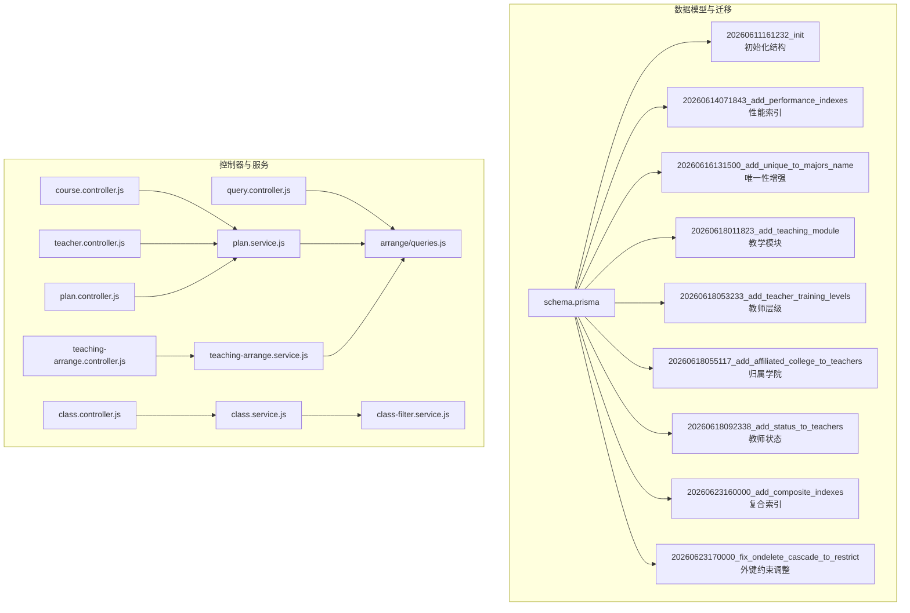
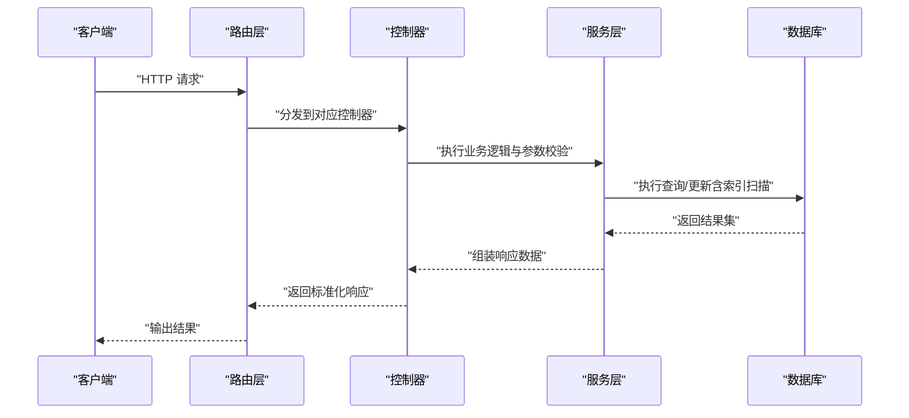
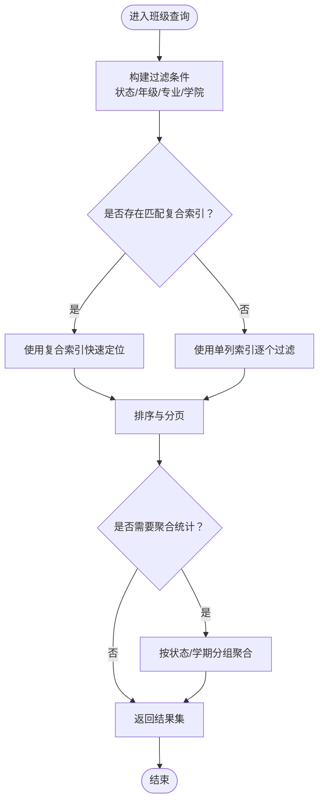
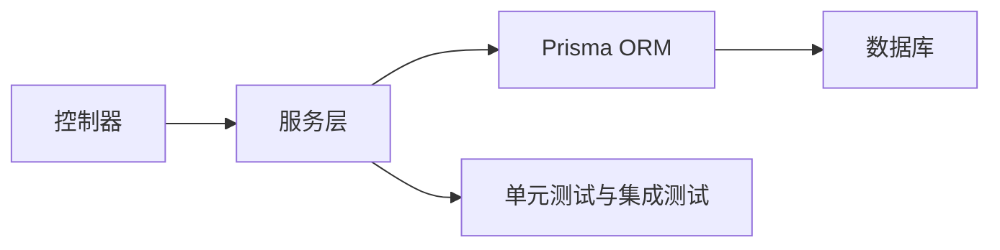

# 索引策略设计

<cite>
**本文引用的文件**
- [schema.prisma](file://server/prisma/schema.prisma)
- [20260611161232_init/migration.sql](file://server/prisma/migrations/20260611161232_init/migration.sql)
- [20260614071843_add_performance_indexes/migration.sql](file://server/prisma/migrations/20260614071843_add_performance_indexes/migration.sql)
- [20260616131500_add_unique_to_majors_name/migration.sql](file://server/prisma/migrations/20260616131500_add_unique_to_majors_name/migration.sql)
- [20260618011823_add_teaching_module/migration.sql](file://server/prisma/migrations/20260618011823_add_teaching_module/migration.sql)
- [20260618053233_add_teacher_training_levels/migration.sql](file://server/prisma/migrations/20260618053233_add_teacher_training_levels/migration.sql)
- [20260618055117_add_affiliated_college_to_teachers/migration.sql](file://server/prisma/migrations/20260618055117_add_affiliated_college_to_teachers/migration.sql)
- [20260618092338_add_status_to_teachers/migration.sql](file://server/prisma/migrations/20260618092338_add_status_to_teachers/migration.sql)
- [20260623160000_add_composite_indexes/migration.sql](file://server/prisma/migrations/20260623160000_add_composite_indexes/migration.sql)
- [20260623170000_fix_ondelete_cascade_to_restrict/migration.sql](file://server/prisma/migrations/20260623170000_fix_ondelete_cascade_to_restrict/migration.sql)
- [class.controller.js](file://server/src/controllers/class.controller.js)
- [course.controller.js](file://server/src/controllers/course.controller.js)
- [teacher.controller.js](file://server/src/controllers/teacher.controller.js)
- [plan.controller.js](file://server/src/controllers/plan.controller.js)
- [query.controller.js](file://server/src/controllers/query.controller.js)
- [teaching-arrange.controller.js](file://server/src/controllers/teaching-arrange.controller.js)
- [class.service.js](file://server/src/services/class.service.js)
- [class-filter.service.js](file://server/src/services/class-filter.service.js)
- [plan.service.js](file://server/src/services/plan.service.js)
- [teaching-arrange.service.js](file://server/src/services/teaching-arrange.service.js)
- [queries.js](file://server/src/services/arrange/queries.js)
- [queries-eligibility.test.js](file://server/src/services/arrange/__tests__/queries-eligibility.test.js)
- [queries.test.js](file://server/src/services/arrange/__tests__/queries.test.js)
- [auto-arrange.js](file://server/src/services/arrange/auto-arrange.js)
- [diagnose-and-validate.test.js](file://server/src/services/arrange/__tests__/diagnose-and-validate.test.js)
- [arrange/routes](file://server/src/routes/teaching-arrange.routes.js)
- [routes/class.routes.js](file://server/src/routes/class.routes.js)
- [routes/course.routes.js](file://server/src/routes/course.routes.js)
- [routes/teacher.routes.js](file://server/src/routes/teacher.routes.js)
- [routes/plan.routes.js](file://server/src/routes/plan.routes.js)
- [routes/query.routes.js](file://server/src/routes/query.routes.js)
- [routes/teaching-arrange.routes.js](file://server/src/routes/teaching-arrange.routes.js)
</cite>

## 目录
1. [简介](#简介)
2. [项目结构](#项目结构)
3. [核心组件](#核心组件)
4. [架构总览](#架构总览)
5. [详细组件分析](#详细组件分析)
6. [依赖分析](#依赖分析)
7. [性能考虑](#性能考虑)
8. [故障排查指南](#故障排查指南)
9. [结论](#结论)
10. [附录](#附录)

## 简介
本文件面向KEC课程管理平台的数据层索引策略进行系统化设计与说明。基于Prisma Schema与多版本迁移脚本，梳理各实体表的主键、唯一约束与索引现状，并结合控制器与服务层的查询模式，提出单列索引、复合索引与唯一索引的设计建议与业务依据，覆盖用户角色索引、班级状态索引、课程类型索引、学期查询索引、教师工号索引等关键场景。同时给出索引维护策略与性能监控方法，帮助在高并发与复杂查询场景下保持稳定与高效。

## 项目结构
后端采用Prisma ORM驱动，数据模型定义于Schema中，索引与约束通过迁移脚本逐步演进。查询逻辑主要集中在控制器与服务层，围绕“班级、课程、教师、培养方案、教学安排”等模块展开。

图示来源
- [schema.prisma](file://server/prisma/schema.prisma)
- [20260614071843_add_performance_indexes/migration.sql](file://server/prisma/migrations/20260614071843_add_performance_indexes/migration.sql)
- [20260623160000_add_composite_indexes/migration.sql](file://server/prisma/migrations/20260623160000_add_composite_indexes/migration.sql)

章节来源
- [schema.prisma](file://server/prisma/schema.prisma)
- [20260611161232_init/migration.sql](file://server/prisma/migrations/20260611161232_init/migration.sql)

## 核心组件
- 数据模型与索引现状：通过Prisma Schema与多版本迁移脚本，可定位各实体的主键、唯一约束与索引分布，为后续策略设计提供依据。
- 控制器与服务层：控制器负责请求入口与参数校验，服务层封装具体业务与查询逻辑，是分析查询模式与索引需求的关键入口。
- 教学安排相关：包含自动排课、资格查询、诊断验证等模块，对索引的复合度与选择性有较高要求。

章节来源
- [class.controller.js](file://server/src/controllers/class.controller.js)
- [course.controller.js](file://server/src/controllers/course.controller.js)
- [teacher.controller.js](file://server/src/controllers/teacher.controller.js)
- [plan.controller.js](file://server/src/controllers/plan.controller.js)
- [query.controller.js](file://server/src/controllers/query.controller.js)
- [teaching-arrange.controller.js](file://server/src/controllers/teaching-arrange.controller.js)
- [class.service.js](file://server/src/services/class.service.js)
- [class-filter.service.js](file://server/src/services/class-filter.service.js)
- [plan.service.js](file://server/src/services/plan.service.js)
- [teaching-arrange.service.js](file://server/src/services/teaching-arrange.service.js)
- [queries.js](file://server/src/services/arrange/queries.js)

## 架构总览
下图展示从控制器到服务再到数据库的调用链路，以及与索引策略相关的查询热点：

图示来源
- [routes/class.routes.js](file://server/src/routes/class.routes.js)
- [routes/course.routes.js](file://server/src/routes/course.routes.js)
- [routes/teacher.routes.js](file://server/src/routes/teacher.routes.js)
- [routes/plan.routes.js](file://server/src/routes/plan.routes.js)
- [routes/query.routes.js](file://server/src/routes/query.routes.js)
- [routes/teaching-arrange.routes.js](file://server/src/routes/teaching-arrange.routes.js)

## 详细组件分析

### 数据模型与索引现状概览
- 初始化结构：奠定基础实体与主键约束，为后续索引扩展提供基础。
- 性能索引：针对高频查询字段增加单列索引，提升检索效率。
- 唯一性增强：对关键业务字段（如专业名称）建立唯一约束，保障数据一致性。
- 教学模块与关联：新增教学相关实体与字段，影响查询路径与索引组合。
- 复合索引：引入多列组合索引以覆盖常见过滤与排序组合，降低回表成本。
- 外键约束调整：将级联删除改为限制，避免误删风险，需配合索引策略确保查询稳定性。

章节来源
- [20260611161232_init/migration.sql](file://server/prisma/migrations/20260611161232_init/migration.sql)
- [20260614071843_add_performance_indexes/migration.sql](file://server/prisma/migrations/20260614071843_add_performance_indexes/migration.sql)
- [20260616131500_add_unique_to_majors_name/migration.sql](file://server/prisma/migrations/20260616131500_add_unique_to_majors_name/migration.sql)
- [20260618011823_add_teaching_module/migration.sql](file://server/prisma/migrations/20260618011823_add_teaching_module/migration.sql)
- [20260618053233_add_teacher_training_levels/migration.sql](file://server/prisma/migrations/20260618053233_add_teacher_training_levels/migration.sql)
- [20260618055117_add_affiliated_college_to_teachers/migration.sql](file://server/prisma/migrations/20260618055117_add_affiliated_college_to_teachers/migration.sql)
- [20260618092338_add_status_to_teachers/migration.sql](file://server/prisma/migrations/20260618092338_add_status_to_teachers/migration.sql)
- [20260623160000_add_composite_indexes/migration.sql](file://server/prisma/migrations/20260623160000_add_composite_indexes/migration.sql)
- [20260623170000_fix_ondelete_cascade_to_restrict/migration.sql](file://server/prisma/migrations/20260623170000_fix_ondelete_cascade_to_restrict/migration.sql)

### 班级模块索引策略
- 查询模式与访问路径
  - 列表与筛选：按状态、年级、所属专业、所属学院等条件过滤；支持分页与排序。
  - 统计与报表：按状态聚合统计，或按学期维度汇总。
- 索引设计建议
  - 单列索引：状态、年级、专业ID、学院ID等高选择性字段。
  - 复合索引：(状态, 创建时间)、(专业ID, 状态)、(学院ID, 年级, 状态)等，覆盖常用过滤与排序组合。
  - 唯一索引：若存在唯一标识（如班级编号），应建立唯一索引。
- 业务依据与技术考量
  - 高频过滤字段优先建单列索引，减少全表扫描。
  - 复合索引用于固定组合查询，避免回表与排序开销。
  - 聚合统计常伴随WHERE与GROUP BY，需综合考虑过滤与分组字段的组合。

图示来源
- [class.controller.js](file://server/src/controllers/class.controller.js)
- [class.service.js](file://server/src/services/class.service.js)
- [class-filter.service.js](file://server/src/services/class-filter.service.js)

章节来源
- [class.controller.js](file://server/src/controllers/class.controller.js)
- [class.service.js](file://server/src/services/class.service.js)
- [class-filter.service.js](file://server/src/services/class-filter.service.js)

### 课程模块索引策略
- 查询模式与访问路径
  - 列表与筛选：按课程类型、开课学期、开课单位、培养方案等过滤。
  - 排课与冲突检测：涉及跨表连接与范围查询。
- 索引设计建议
  - 单列索引：课程类型、开课学期ID、开课单位ID等。
  - 复合索引：(课程类型, 开课学期ID)、(开课单位ID, 开课学期ID)、(培养方案ID, 课程类型)等。
  - 唯一索引：课程唯一标识（如课程代码+学期）。
- 业务依据与技术考量
  - 学期查询频繁且对性能敏感，优先保证(开课学期ID, ...)类组合的索引命中。
  - 课程类型与单位组合查询常见，复合索引可显著降低连接成本。

章节来源
- [course.controller.js](file://server/src/controllers/course.controller.js)
- [plan.controller.js](file://server/src/controllers/plan.controller.js)
- [plan.service.js](file://server/src/services/plan.service.js)

### 教师模块索引策略
- 查询模式与访问路径
  - 列表与筛选：按工号、姓名、所属学院、状态、培训层级等过滤。
  - 排课与分配：按工号与时间段进行可用性查询。
- 索引设计建议
  - 单列索引：工号、状态、所属学院ID、培训层级ID等。
  - 复合索引：(工号, 状态)、(所属学院ID, 状态)、(工号, 培训层级ID)等。
  - 唯一索引：工号唯一性约束。
- 业务依据与技术考量
  - 工号是高频主查询键，需确保唯一且有索引。
  - 状态与组织架构字段常用于权限与可见性控制，适合复合索引优化。

章节来源
- [teacher.controller.js](file://server/src/controllers/teacher.controller.js)
- [20260618055117_add_affiliated_college_to_teachers/migration.sql](file://server/prisma/migrations/20260618055117_add_affiliated_college_to_teachers/migration.sql)
- [20260618092338_add_status_to_teachers/migration.sql](file://server/prisma/migrations/20260618092338_add_status_to_teachers/migration.sql)
- [20260618053233_add_teacher_training_levels/migration.sql](file://server/prisma/migrations/20260618053233_add_teacher_training_levels/migration.sql)

### 培养方案与教学安排索引策略
- 查询模式与访问路径
  - 方案查询：按专业、层次、学年等维度检索。
  - 安排查询：按教师、教室、时间、课程等多维过滤与排序。
  - 自动排课：涉及大规模冲突检测与回溯，对索引的选择性与覆盖度要求更高。
- 索引设计建议
  - 单列索引：专业ID、层次、学年、课程ID、教师ID、教室ID等。
  - 复合索引：(专业ID, 层次, 学年)、(课程ID, 时间段)、(教师ID, 时间段)、(教室ID, 时间段)等。
  - 唯一索引：排课唯一性约束（如同一时间、地点、教师不重复）。
- 业务依据与技术考量
  - 时间段与资源占用是排课瓶颈，需重点优化(教师ID/教室ID, 时间段)类索引。
  - 自动排课测试覆盖了资格查询与冲突检测，需确保相关索引满足低延迟要求。

章节来源
- [plan.controller.js](file://server/src/controllers/plan.controller.js)
- [teaching-arrange.controller.js](file://server/src/controllers/teaching-arrange.controller.js)
- [teaching-arrange.service.js](file://server/src/services/teaching-arrange.service.js)
- [queries.js](file://server/src/services/arrange/queries.js)
- [queries-eligibility.test.js](file://server/src/services/arrange/__tests__/queries-eligibility.test.js)
- [queries.test.js](file://server/src/services/arrange/__tests__/queries.test.js)
- [auto-arrange.js](file://server/src/services/arrange/auto-arrange.js)

### 查询模块索引策略
- 查询模式与访问路径
  - 统一查询：支持课程、班级、教师、教材等多维度联合查询。
  - 条件组合：AND/OR组合、范围查询、模糊匹配等。
- 索引设计建议
  - 单列索引：各实体的高选择性字段。
  - 复合索引：根据最常用的查询谓词组合建立，如(类型, 状态)、(学期, 类型)等。
  - 唯一索引：对唯一标识字段建立唯一约束。
- 业务依据与技术考量
  - 统一查询强调灵活性，需通过复合索引覆盖常见组合，避免全表扫描。

章节来源
- [query.controller.js](file://server/src/controllers/query.controller.js)
- [queries.js](file://server/src/services/arrange/queries.js)

## 依赖分析
- 控制器到服务：控制器负责参数解析与校验，服务封装业务逻辑与数据访问，形成清晰的职责边界。
- 服务到数据库：服务层通过Prisma ORM执行查询，索引命中直接影响响应时延与吞吐。
- 教学安排模块：自动排课与资格查询对索引质量尤为敏感，需在迁移阶段同步完善索引。

图示来源
- [class.controller.js](file://server/src/controllers/class.controller.js)
- [class.service.js](file://server/src/services/class.service.js)
- [teaching-arrange.controller.js](file://server/src/controllers/teaching-arrange.controller.js)
- [teaching-arrange.service.js](file://server/src/services/teaching-arrange.service.js)
- [queries.js](file://server/src/services/arrange/queries.js)

章节来源
- [class.controller.js](file://server/src/controllers/class.controller.js)
- [class.service.js](file://server/src/services/class.service.js)
- [teaching-arrange.controller.js](file://server/src/controllers/teaching-arrange.controller.js)
- [teaching-arrange.service.js](file://server/src/services/teaching-arrange.service.js)
- [queries.js](file://server/src/services/arrange/queries.js)

## 性能考虑
- 选择性与区分度：优先为高选择性字段建立索引，减少扫描行数。
- 复合索引顺序：将选择性高的列放在前面，覆盖最常见过滤组合。
- 回表与覆盖索引：尽量通过覆盖索引返回所需字段，避免回表。
- 更新频率与维护成本：频繁写入的表需平衡索引数量，避免写放大。
- 统计信息与查询计划：定期分析查询计划，识别未命中索引的语句并补充索引。
- 监控指标：关注慢查询日志、索引命中率、锁等待与死锁情况，及时调整。

## 故障排查指南
- 慢查询定位：启用慢查询日志，提取执行时间长的SQL，结合EXPLAIN分析索引使用情况。
- 索引缺失：若出现全表扫描或回表过多，检查是否缺少必要的单列或复合索引。
- 写入性能下降：评估索引数量与写入开销，必要时合并或删除冗余索引。
- 测试验证：利用现有测试用例（如自动排课、资格查询、冲突检测）回归验证索引变更效果。
- 迁移回滚：若索引变更导致生产问题，可参考历史迁移脚本进行回滚或修正。

章节来源
- [queries-eligibility.test.js](file://server/src/services/arrange/__tests__/queries-eligibility.test.js)
- [queries.test.js](file://server/src/services/arrange/__tests__/queries.test.js)
- [diagnose-and-validate.test.js](file://server/src/services/arrange/__tests__/diagnose-and-validate.test.js)

## 结论
通过对Prisma Schema与迁移脚本的梳理，结合控制器与服务层的查询模式，本索引策略设计围绕高频过滤字段、复合查询组合与唯一性约束展开，兼顾查询性能与维护成本。建议在后续迭代中持续监控查询计划与性能指标，动态优化索引组合，确保系统在高并发与复杂业务场景下的稳定性与可扩展性。

## 附录
- 关键索引清单（建议）
  - 班级：状态、年级、专业ID、学院ID、(状态, 创建时间)、(专业ID, 状态)、(学院ID, 年级, 状态)
  - 课程：课程类型、开课学期ID、开课单位ID、(课程类型, 开课学期ID)、(开课单位ID, 开课学期ID)
  - 教师：工号、状态、所属学院ID、培训层级ID、(工号, 状态)、(所属学院ID, 状态)
  - 培养方案：专业ID、层次、学年、(专业ID, 层次, 学年)
  - 教学安排：课程ID、教师ID、教室ID、时间段、(课程ID, 时间段)、(教师ID, 时间段)、(教室ID, 时间段)
- 维护策略
  - 版本化索引变更：通过迁移脚本记录索引演进，确保环境一致。
  - 渐进式上线：先在预生产验证，再灰度发布，最后全量生效。
  - 回滚预案：保留历史迁移脚本，快速回退至稳定状态。
- 监控方法
  - 指标采集：慢查询次数、索引命中率、平均响应时延、P95/P99时延。
  - 报警阈值：设定异常波动阈值，触发人工干预。
  - 定期复盘：结合业务高峰与变更窗口，评估索引有效性并迭代优化。