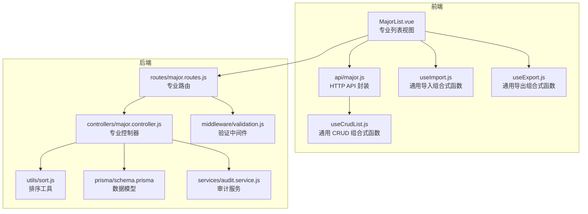
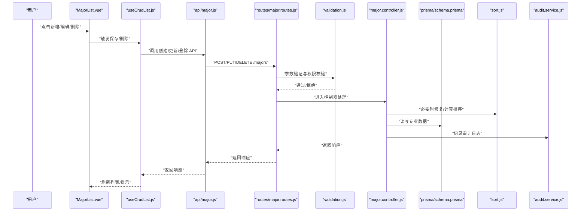
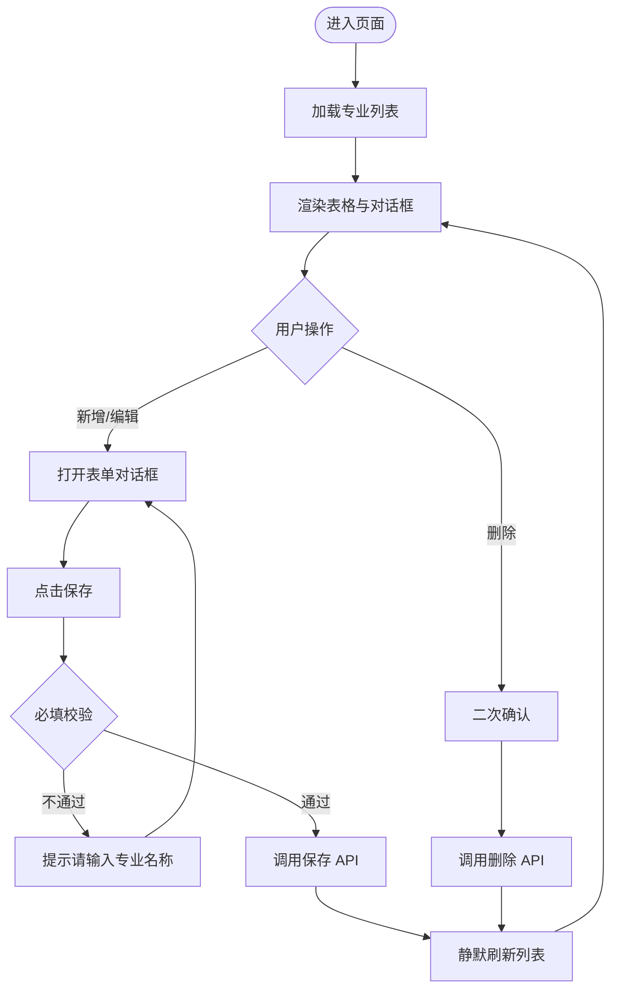
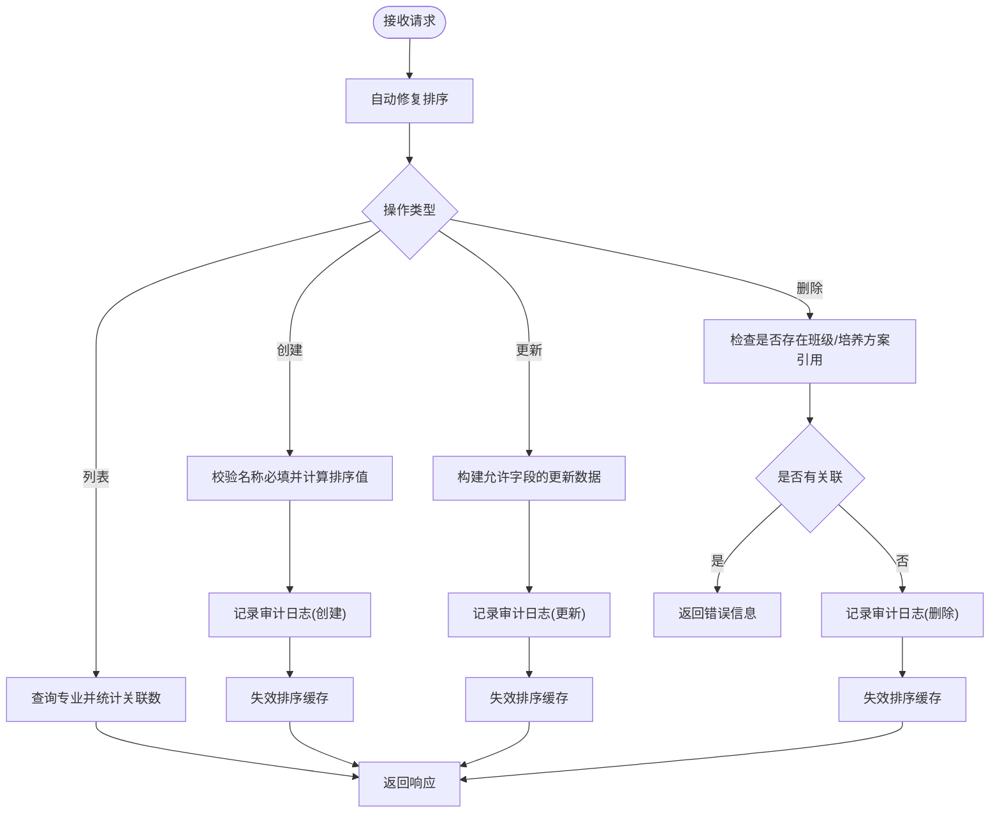
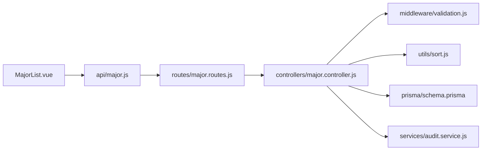

# 专业管理

<cite>
**本文引用的文件**
- [client\src\views\major\MajorList.vue](file://client/src/views/major/MajorList.vue)
- [client\src\api\major.js](file://client/src/api/major.js)
- [client\src\composables\useCrudList.js](file://client/src/composables/useCrudList.js)
- [client\src\composables\useImport.js](file://client/src/composables/useImport.js)
- [client\src\composables\useExport.js](file://client/src/composables/useExport.js)
- [server\src\controllers\major.controller.js](file://server/src/controllers/major.controller.js)
- [server\src\routes\major.routes.js](file://server/src/routes/major.routes.js)
- [server\prisma\schema.prisma](file://server/prisma/schema.prisma)
- [server\src\middleware\validation.js](file://server/src/middleware/validation.js)
- [server\src\middleware\pagination.js](file://server/src/middleware/pagination.js)
- [server\src\utils\sort.js](file://server/src/utils/sort.js)
- [server\src\services\audit.service.js](file://server/src/services/audit.service.js)
</cite>

## 目录
1. [简介](#简介)
2. [项目结构](#项目结构)
3. [核心组件](#核心组件)
4. [架构总览](#架构总览)
5. [详细组件分析](#详细组件分析)
6. [依赖分析](#依赖分析)
7. [性能考虑](#性能考虑)
8. [故障排查指南](#故障排查指南)
9. [结论](#结论)
10. [附录](#附录)

## 简介
本文件系统化梳理“专业管理”模块的设计与实现，覆盖专业数据的增删改查、排序、与培养方案的关联关系、数据验证与业务约束、导入导出与批量处理、与其他模块的数据同步机制，以及搜索过滤、分页展示与数据验证的实现细节。目标是帮助开发者与产品/运营人员全面理解专业管理的业务边界与技术实现。

## 项目结构
专业管理模块由前端视图与通用 CRUD 组合式函数、后端控制器与路由、Prisma 数据模型、验证中间件与排序工具组成，形成清晰的分层架构。



图表来源
- [client\src\views\major\MajorList.vue:1-110](file://client/src/views/major/MajorList.vue#L1-L110)
- [client\src\api\major.js:1-7](file://client/src/api/major.js#L1-L7)
- [client\src\composables\useCrudList.js:1-121](file://client/src/composables/useCrudList.js#L1-L121)
- [client\src\composables\useImport.js:1-92](file://client/src/composables/useImport.js#L1-L92)
- [client\src\composables\useExport.js:1-76](file://client/src/composables/useExport.js#L1-L76)
- [server\src\routes\major.routes.js:1-36](file://server/src/routes/major.routes.js#L1-L36)
- [server\src\controllers\major.controller.js:1-169](file://server/src/controllers/major.controller.js#L1-L169)
- [server\src\middleware\validation.js:1-590](file://server/src/middleware/validation.js#L1-L590)
- [server\src\utils\sort.js:1-104](file://server/src/utils/sort.js#L1-L104)
- [server\prisma\schema.prisma:87-97](file://server/prisma/schema.prisma#L87-L97)
- [server\src\services\audit.service.js:1-94](file://server/src/services/audit.service.js#L1-L94)

章节来源
- [client\src\views\major\MajorList.vue:1-110](file://client/src/views/major/MajorList.vue#L1-L110)
- [server\src\routes\major.routes.js:1-36](file://server/src/routes/major.routes.js#L1-L36)

## 核心组件
- 前端视图组件：负责渲染表格、对话框、按钮与交互事件绑定；调用通用 CRUD 组合式函数进行数据加载与持久化。
- 通用 CRUD 组合式函数：封装列表加载、表单打开、保存、删除、排序移动等通用逻辑，支持可配置的字段名与默认表单值。
- API 封装：对后端专业接口进行统一封装，便于视图组件调用。
- 后端控制器：实现专业列表、创建、更新、删除的业务逻辑，包含排序修复、审计日志与异常处理。
- 路由与验证：定义专业相关路由，应用权限与参数验证中间件。
- 数据模型：Prisma 定义专业实体及其与班级、培养方案的关联。
- 排序工具：提供排序值计算、标准化、自动修复与缓存失效。
- 审计服务：记录专业模块的关键操作，便于追溯。

章节来源
- [client\src\views\major\MajorList.vue:88-110](file://client/src/views/major/MajorList.vue#L88-L110)
- [client\src\composables\useCrudList.js:18-121](file://client/src/composables/useCrudList.js#L18-L121)
- [client\src\api\major.js:1-7](file://client/src/api/major.js#L1-L7)
- [server\src\controllers\major.controller.js:14-169](file://server/src/controllers/major.controller.js#L14-L169)
- [server\prisma\schema.prisma:87-97](file://server/prisma/schema.prisma#L87-L97)
- [server\src\utils\sort.js:12-104](file://server/src/utils/sort.js#L12-L104)
- [server\src\services\audit.service.js:15-49](file://server/src/services/audit.service.js#L15-L49)

## 架构总览
专业管理遵循前后端分离与分层设计：
- 前端通过 HTTP API 与后端交互，使用 Element Plus 组件库与组合式函数提升复用性。
- 后端采用 Express 路由+控制器+中间件+Prisma 的经典分层，配合审计与排序工具保证数据一致性与可追溯性。
- 专业实体与班级、培养方案存在多对多/一对多关联，删除前需解除这些关联。



图表来源
- [client\src\views\major\MajorList.vue:91-108](file://client/src/views/major/MajorList.vue#L91-L108)
- [client\src\composables\useCrudList.js:59-100](file://client/src/composables/useCrudList.js#L59-L100)
- [client\src\api\major.js:3-6](file://client/src/api/major.js#L3-L6)
- [server\src\routes\major.routes.js:14-33](file://server/src/routes/major.routes.js#L14-L33)
- [server\src\middleware\validation.js:138-146](file://server/src/middleware/validation.js#L138-L146)
- [server\src\controllers\major.controller.js:36-168](file://server/src/controllers/major.controller.js#L36-L168)
- [server\prisma\schema.prisma:87-97](file://server/prisma/schema.prisma#L87-L97)
- [server\src\utils\sort.js:62-103](file://server/src/utils/sort.js#L62-L103)
- [server\src\services\audit.service.js:15-49](file://server/src/services/audit.service.js#L15-L49)

## 详细组件分析

### 前端：专业列表与 CRUD 行为
- 列表展示：表格列包含专业名称、编码、描述、班级数、排序按钮与操作列。
- 对话框表单：支持新增与编辑，表单字段包括名称、编码、描述。
- 通用 CRUD：封装加载、保存、删除、排序移动、错误提示与成功提示。
- 业务约束提示：保存时对必填字段进行校验，给出明确提示。



图表来源
- [client\src\views\major\MajorList.vue:14-108](file://client/src/views/major/MajorList.vue#L14-L108)
- [client\src\composables\useCrudList.js:33-100](file://client/src/composables/useCrudList.js#L33-L100)

章节来源
- [client\src\views\major\MajorList.vue:1-110](file://client/src/views/major/MajorList.vue#L1-L110)
- [client\src\composables\useCrudList.js:18-121](file://client/src/composables/useCrudList.js#L18-L121)

### 后端：专业控制器与业务规则
- 列表：自动修复排序，按排序升序返回；附加班级数与培养方案数统计。
- 创建：校验名称必填，计算排序值，创建成功后记录审计日志并失效排序缓存。
- 更新：构建允许字段的更新数据，记录审计日志并失效排序缓存。
- 删除：禁止删除存在班级或仍被培养方案引用的专业，记录审计日志并失效排序缓存。



图表来源
- [server\src\controllers\major.controller.js:14-169](file://server/src/controllers/major.controller.js#L14-L169)
- [server\src\utils\sort.js:62-103](file://server/src/utils/sort.js#L62-L103)
- [server\src\services\audit.service.js:15-49](file://server/src/services/audit.service.js#L15-L49)

章节来源
- [server\src\controllers\major.controller.js:14-169](file://server/src/controllers/major.controller.js#L14-L169)
- [server\src\utils\sort.js:12-104](file://server/src/utils/sort.js#L12-L104)
- [server\src\services\audit.service.js:15-49](file://server/src/services/audit.service.js#L15-L49)

### 数据模型与关联关系
- 专业实体：包含名称唯一约束、排序值、描述等字段。
- 与班级：一对多关系，删除专业时需确保无班级关联。
- 与培养方案：一对多关系，删除专业时需确保无培养方案关联。
- 与学院：通过班级间接关联，培养方案直接关联专业。

```mermaid
erDiagram
MAJORS {
int id PK
string name UK
string code
string description
int sort_order
datetime created_at
datetime updated_at
}
CLASSES {
int id PK
string name
int enrollment_year
int duration_years
int? major_id FK
int? college_id FK
int? training_level_id FK
int student_count
int? custom_plan_id FK
string status
boolean is_left_school
datetime created_at
datetime updated_at
}
TRAINING_PLANS {
int id PK
string name
int? major_id FK
int? college_id FK
int? training_level_id FK
string version
string description
int sort_order
datetime created_at
datetime updated_at
}
MAJORS ||--o{ CLASSES : "拥有"
MAJORS ||--o{ TRAINING_PLANS : "拥有"
CLASSES }o--|| TRAINING_PLANS : "可使用(自定义方案)"
```

图表来源
- [server\prisma\schema.prisma:87-97](file://server/prisma/schema.prisma#L87-L97)
- [server\prisma\schema.prisma:28-54](file://server/prisma/schema.prisma#L28-L54)
- [server\prisma\schema.prisma:191-211](file://server/prisma/schema.prisma#L191-L211)

章节来源
- [server\prisma\schema.prisma:87-97](file://server/prisma/schema.prisma#L87-L97)
- [server\prisma\schema.prisma:28-54](file://server/prisma/schema.prisma#L28-L54)
- [server\prisma\schema.prisma:191-211](file://server/prisma/schema.prisma#L191-L211)

### 验证规则与业务约束
- 参数验证：专业名称长度限制、编码长度限制；ID 参数必须为正整数；排序值非负整数。
- 业务约束：删除前检查是否存在班级与培养方案引用；创建/更新时对允许字段进行白名单构建。
- XSS 清洗：请求体统一清洗，降低注入风险。

章节来源
- [server\src\middleware\validation.js:138-146](file://server/src/middleware/validation.js#L138-L146)
- [server\src\middleware\validation.js:385-392](file://server/src/middleware/validation.js#L385-L392)
- [server\src\middleware\validation.js:130-133](file://server/src/middleware/validation.js#L130-L133)
- [server\src\middleware\validation.js:377-380](file://server/src/middleware/validation.js#L377-L380)
- [server\src\routes\major.routes.js:4-4](file://server/src/routes/major.routes.js#L4-L4)

### 排序与缓存
- 排序值计算：基于现有最大值+1生成下一个排序值。
- 排序修复：检测重复或异常排序值，批量事务修复为连续序列。
- 缓存失效：每次创建/更新/删除后失效对应模型的排序缓存，避免脏读。

章节来源
- [server\src\utils\sort.js:26-31](file://server/src/utils/sort.js#L26-L31)
- [server\src\utils\sort.js:62-98](file://server/src/utils/sort.js#L62-L98)
- [server\src\utils\sort.js:12-18](file://server/src/utils/sort.js#L12-L18)

### 审计与日志
- 专业模块关键操作均记录审计日志，包含操作类型、模块、操作人、IP、详情与结果。
- 审计日志表结构包含详情字段的最大长度限制，防止膨胀。

章节来源
- [server\src\services\audit.service.js:15-49](file://server/src/services/audit.service.js#L15-L49)
- [server\prisma\schema.prisma:10-26](file://server/prisma/schema.prisma#L10-L26)

### 导入导出与批量处理
- 导入：通用导入组合式函数封装文件类型校验、确认弹窗、上传与结果反馈；支持错误明细展示。
- 导出：通用导出组合式函数支持自定义导出 URL 与模板 URL，下载 Excel 并带时间戳文件名。
- 批量处理：通过事务与批量修复保障一致性；导入时对重复项进行覆盖策略控制。

章节来源
- [client\src\composables\useImport.js:14-92](file://client/src/composables/useImport.js#L14-L92)
- [client\src\composables\useExport.js:14-76](file://client/src/composables/useExport.js#L14-L76)
- [server\src\controllers\major.controller.js:36-72](file://server/src/controllers/major.controller.js#L36-L72)

### 与其他模块的数据同步机制
- 专业与培养方案：删除前需解除培养方案引用，避免外键约束导致的静默破坏。
- 专业与班级：删除前需清空班级，防止外键约束失败。
- 专业与学院：通过班级间接关联，培养方案直接关联专业，变更时需同步维护。

章节来源
- [server\src\controllers\major.controller.js:120-135](file://server/src/controllers/major.controller.js#L120-L135)
- [server\prisma\schema.prisma:28-54](file://server/prisma/schema.prisma#L28-L54)
- [server\prisma\schema.prisma:191-211](file://server/prisma/schema.prisma#L191-L211)

## 依赖分析
- 前端依赖：Element Plus UI、Vue 组合式函数、通用 CRUD/导入/导出组合式函数。
- 后端依赖：Express 路由、Prisma ORM、验证中间件、排序工具、审计服务。
- 数据依赖：专业实体与班级、培养方案的关联关系决定删除与更新的前置检查。



图表来源
- [client\src\views\major\MajorList.vue:91-108](file://client/src/views/major/MajorList.vue#L91-L108)
- [client\src\api\major.js:3-6](file://client/src/api/major.js#L3-L6)
- [server\src\routes\major.routes.js:14-33](file://server/src/routes/major.routes.js#L14-L33)
- [server\src\controllers\major.controller.js:36-168](file://server/src/controllers/major.controller.js#L36-L168)
- [server\src\middleware\validation.js:138-146](file://server/src/middleware/validation.js#L138-L146)
- [server\src\utils\sort.js:62-103](file://server/src/utils/sort.js#L62-L103)
- [server\prisma\schema.prisma:87-97](file://server/prisma/schema.prisma#L87-L97)
- [server\src\services\audit.service.js:15-49](file://server/src/services/audit.service.js#L15-L49)

章节来源
- [server\src\routes\major.routes.js:1-36](file://server/src/routes/major.routes.js#L1-L36)
- [server\src\controllers\major.controller.js:1-169](file://server/src/controllers/major.controller.js#L1-L169)

## 性能考虑
- 排序修复的批量事务：在高并发场景下，聚合+1的排序值生成非原子，建议采用事务内查询最大值+插入或数据库序列，以减少重复排序值的概率。
- 排序缓存：使用 Map 缓存排序修复结果，结合 TTL 控制刷新频率，避免频繁扫描与修复。
- 审计日志：详情字段截断与异步记录，避免阻塞主业务流程。

章节来源
- [server\src\utils\sort.js:20-31](file://server/src/utils/sort.js#L20-L31)
- [server\src\utils\sort.js:62-103](file://server/src/utils/sort.js#L62-L103)
- [server\src\services\audit.service.js:17-48](file://server/src/services/audit.service.js#L17-L48)

## 故障排查指南
- 删除失败：若提示存在班级或培养方案引用，请先清理关联后再尝试删除。
- 参数验证失败：检查请求体中的专业名称、编码、ID、排序值是否符合长度与范围要求。
- 排序异常：触发自动修复后重试；若仍异常，检查是否存在并发创建导致的重复排序值。
- 审计日志缺失：关注审计服务的错误日志，确保不影响主流程的同时进行监控告警。

章节来源
- [server\src\controllers\major.controller.js:120-135](file://server/src/controllers/major.controller.js#L120-L135)
- [server\src\middleware\validation.js:138-146](file://server/src/middleware/validation.js#L138-L146)
- [server\src\utils\sort.js:62-103](file://server/src/utils/sort.js#L62-L103)
- [server\src\services\audit.service.js:37-48](file://server/src/services/audit.service.js#L37-L48)

## 结论
专业管理模块通过清晰的前后端分层、严格的参数与业务验证、完善的审计与排序机制，实现了稳定可靠的增删改查能力。删除前的关联检查与自动修复排序进一步提升了系统的健壮性。未来可在高并发场景下优化排序值生成策略，并持续完善导入导出模板与批量处理的事务保护。

## 附录

### 专业数据验证规则清单
- 专业名称：必填，长度限制，唯一约束。
- 专业编码：可选，长度限制。
- 排序值：可选，非负整数。
- ID 参数：正整数。

章节来源
- [server\src\middleware\validation.js:138-146](file://server/src/middleware/validation.js#L138-L146)
- [server\src\middleware\validation.js:385-392](file://server/src/middleware/validation.js#L385-L392)
- [server\src\middleware\validation.js:130-133](file://server/src/middleware/validation.js#L130-L133)
- [server\src\middleware\validation.js:377-380](file://server/src/middleware/validation.js#L377-L380)
- [server\prisma\schema.prisma](file://server/prisma/schema.prisma#L89)

### 专业与培养方案关联关系
- 专业与培养方案：一对多；删除专业前需解除所有关联。
- 专业与班级：一对多；删除专业前需清空班级。

章节来源
- [server\src\controllers\major.controller.js:120-135](file://server/src/controllers/major.controller.js#L120-L135)
- [server\prisma\schema.prisma:87-97](file://server/prisma/schema.prisma#L87-L97)
- [server\prisma\schema.prisma:28-54](file://server/prisma/schema.prisma#L28-L54)
- [server\prisma\schema.prisma:191-211](file://server/prisma/schema.prisma#L191-L211)