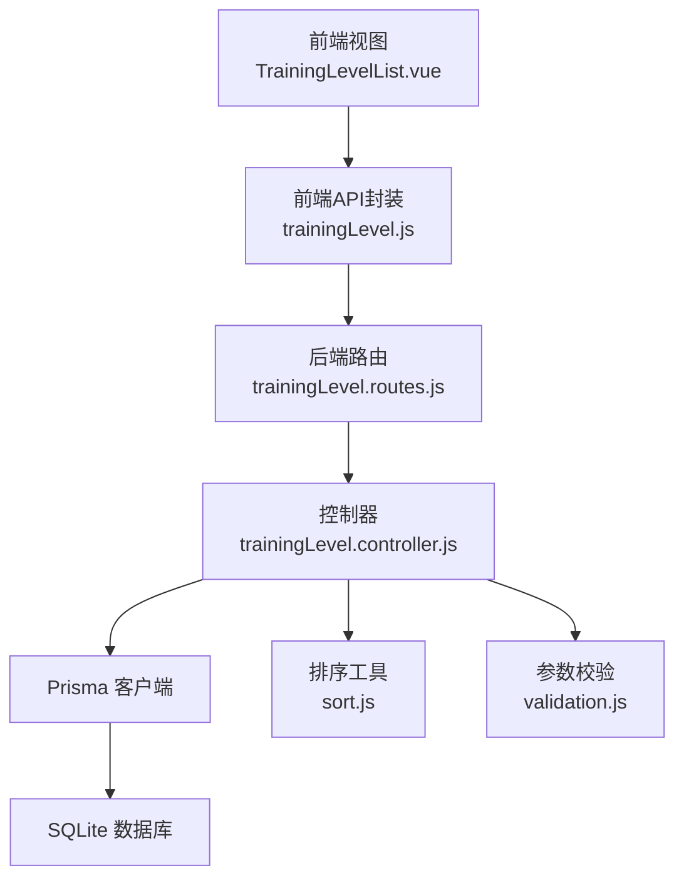
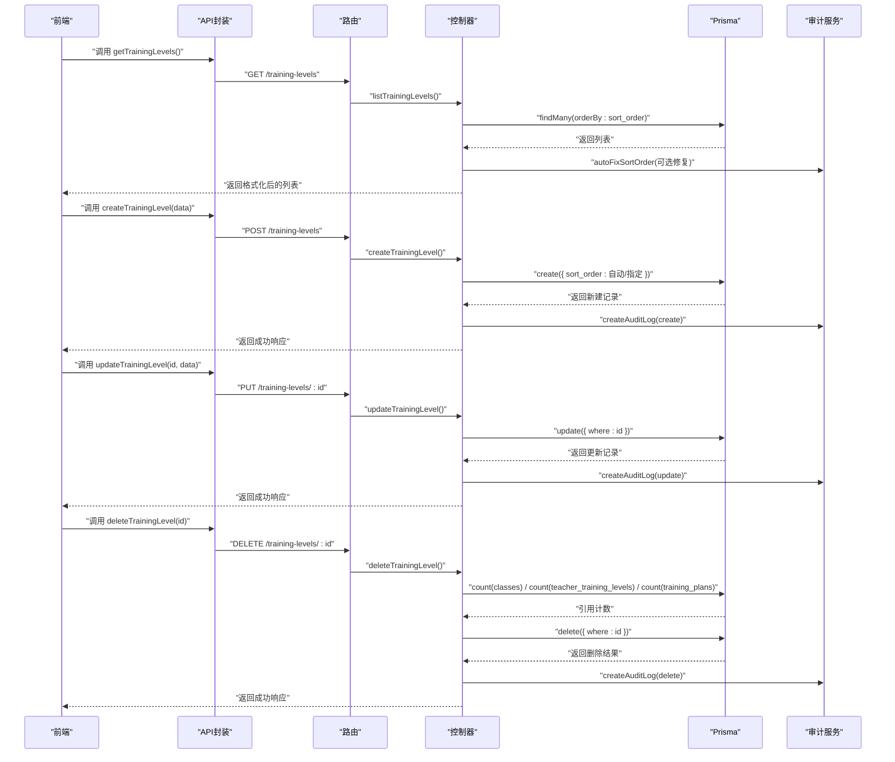
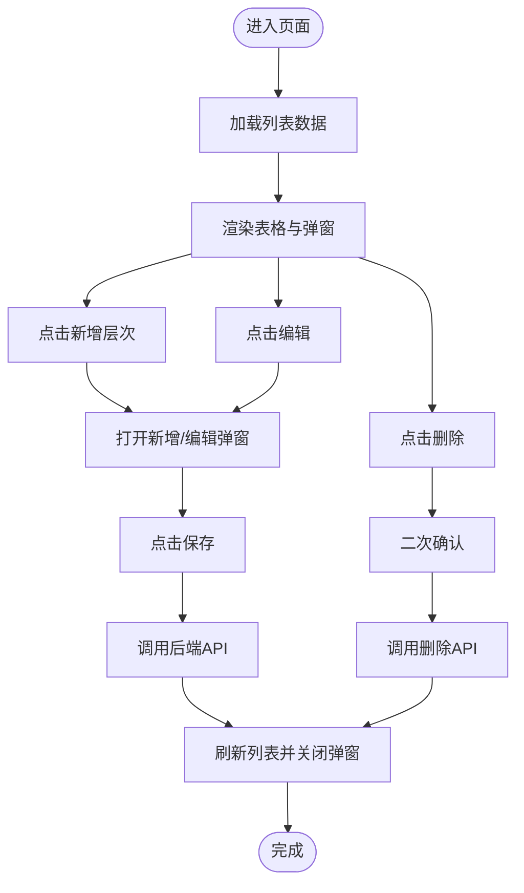
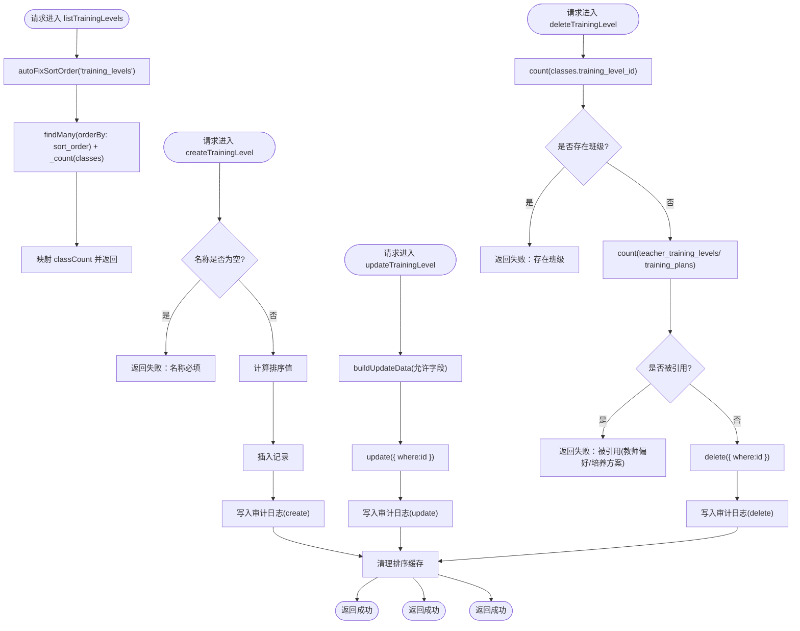
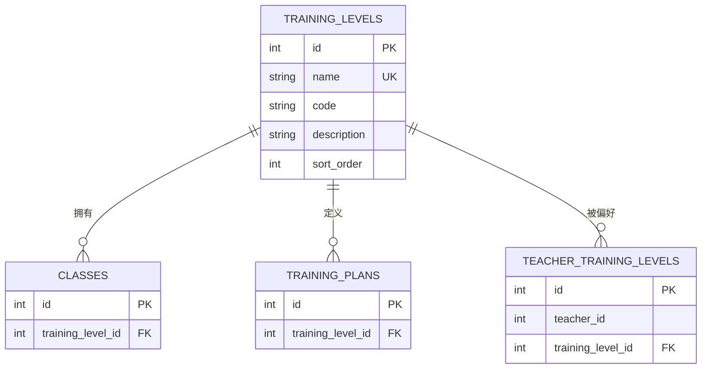
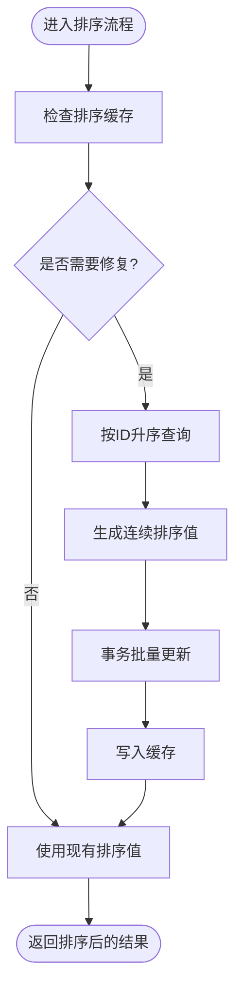
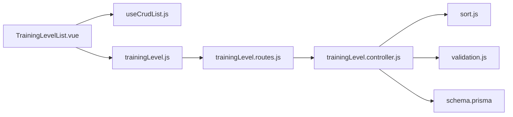

# 培养层次管理

<cite>
**本文档引用的文件**
- [TrainingLevelList.vue](file://client/src/views/trainingLevel/TrainingLevelList.vue)
- [trainingLevel.js](file://client/src/api/trainingLevel.js)
- [trainingLevel.controller.js](file://server/src/controllers/trainingLevel.controller.js)
- [trainingLevel.routes.js](file://server/src/routes/trainingLevel.routes.js)
- [schema.prisma](file://server/prisma/schema.prisma)
- [validation.js](file://server/src/middleware/validation.js)
- [sort.js](file://server/src/utils/sort.js)
- [useCrudList.js](file://client/src/composables/useCrudList.js)
</cite>

## 目录
1. [简介](#简介)
2. [项目结构](#项目结构)
3. [核心组件](#核心组件)
4. [架构总览](#架构总览)
5. [详细组件分析](#详细组件分析)
6. [依赖分析](#依赖分析)
7. [性能考虑](#性能考虑)
8. [故障排查指南](#故障排查指南)
9. [结论](#结论)
10. [附录](#附录)

## 简介
本模块负责“培养层次”的全生命周期管理，包括增删改查、排序、唯一性校验、与专业/课程/班级/培养方案/教师偏好等实体的关联关系维护，以及前端展示、搜索与批量操作能力。系统通过严格的后端验证与审计日志保障数据一致性与可追溯性。

## 项目结构
- 前端采用 Vue 3 + Element Plus，使用通用 CRUD 组合式函数统一处理列表加载、对话框、保存与删除等流程。
- 后端采用 Express + Prisma，路由层进行权限与参数校验，控制器层处理业务逻辑与审计记录，工具层提供排序修复与缓存失效机制。
- 数据模型层面，培养层次与班级、培养方案、教师偏好存在外键关联，保证引用完整性。

图表来源
- [TrainingLevelList.vue:1-120](file://client/src/views/trainingLevel/TrainingLevelList.vue#L1-L120)
- [trainingLevel.js:1-7](file://client/src/api/trainingLevel.js#L1-L7)
- [trainingLevel.routes.js:1-40](file://server/src/routes/trainingLevel.routes.js#L1-L40)
- [trainingLevel.controller.js:1-151](file://server/src/controllers/trainingLevel.controller.js#L1-L151)
- [sort.js:1-104](file://server/src/utils/sort.js#L1-L104)
- [validation.js:266-277](file://server/src/middleware/validation.js#L266-L277)

章节来源
- [TrainingLevelList.vue:1-120](file://client/src/views/trainingLevel/TrainingLevelList.vue#L1-L120)
- [trainingLevel.js:1-7](file://client/src/api/trainingLevel.js#L1-L7)
- [trainingLevel.routes.js:1-40](file://server/src/routes/trainingLevel.routes.js#L1-L40)
- [trainingLevel.controller.js:1-151](file://server/src/controllers/trainingLevel.controller.js#L1-L151)
- [schema.prisma:178-189](file://server/prisma/schema.prisma#L178-L189)

## 核心组件
- 前端视图组件：提供表格展示、新增/编辑弹窗、排序按钮、删除确认、空状态提示。
- 前端API封装：定义 GET/POST/PUT/DELETE 请求路径，统一调用后端接口。
- 控制器：实现列表查询、创建、更新、删除；内置排序修复与缓存失效；生成审计日志。
- 路由：定义访问控制（管理员及以上）、参数清洗与校验链路。
- 数据模型：定义培养层次的唯一约束、排序字段及关联关系。
- 排序工具：提供排序值计算、标准化、自动修复与缓存失效。
- 参数校验：对名称、编码、描述等字段进行长度与格式校验，支持排序值校验。

章节来源
- [TrainingLevelList.vue:14-57](file://client/src/views/trainingLevel/TrainingLevelList.vue#L14-L57)
- [trainingLevel.js:3-6](file://client/src/api/trainingLevel.js#L3-L6)
- [trainingLevel.controller.js:11-27](file://server/src/controllers/trainingLevel.controller.js#L11-L27)
- [trainingLevel.routes.js:18-37](file://server/src/routes/trainingLevel.routes.js#L18-L37)
- [schema.prisma:178-189](file://server/prisma/schema.prisma#L178-L189)
- [sort.js:20-31](file://server/src/utils/sort.js#L20-L31)
- [validation.js:424-434](file://server/src/middleware/validation.js#L424-L434)

## 架构总览
从前端到后端的数据流如下：
- 列表加载：前端调用 GET /training-levels → 路由 → 控制器 → Prisma 查询 → 返回排序后的培养层次列表（包含班级计数）。
- 新增层次：前端调用 POST /training-levels（需管理员） → 路由校验 → 控制器创建 → 自动生成排序值 → 写入审计日志 → 清理排序缓存。
- 更新层次：前端调用 PUT /training-levels/:id（需管理员） → 路由校验 → 控制器更新 → 写入审计日志 → 清理排序缓存。
- 删除层次：前端调用 DELETE /training-levels/:id（需管理员） → 路由校验 → 控制器检查引用 → 若无引用则删除 → 写入审计日志 → 清理排序缓存。

图表来源
- [trainingLevel.js:3-6](file://client/src/api/trainingLevel.js#L3-L6)
- [trainingLevel.routes.js:18-37](file://server/src/routes/trainingLevel.routes.js#L18-L37)
- [trainingLevel.controller.js:11-151](file://server/src/controllers/trainingLevel.controller.js#L11-L151)
- [sort.js:62-103](file://server/src/utils/sort.js#L62-L103)

## 详细组件分析

### 前端组件：培养层次列表
- 功能点
  - 表格列：序号、层次名称、编码、描述、班级数、排序按钮、操作列（编辑、删除）。
  - 新增/编辑弹窗：层次名称必填，编码/描述可选。
  - 排序交互：上移/下移按钮，禁用态根据当前索引控制。
  - 删除保护：二次确认，避免误删。
  - 加载状态：表格加载指示器。
- 关键实现
  - 使用通用 CRUD 组合式函数 useCrudList，统一处理列表加载、表单弹窗、保存与删除。
  - 通过 API 封装调用后端接口，实现增删改查。

图表来源
- [TrainingLevelList.vue:14-57](file://client/src/views/trainingLevel/TrainingLevelList.vue#L14-L57)
- [TrainingLevelList.vue:60-84](file://client/src/views/trainingLevel/TrainingLevelList.vue#L60-L84)
- [useCrudList.js:18-43](file://client/src/composables/useCrudList.js#L18-L43)

章节来源
- [TrainingLevelList.vue:14-57](file://client/src/views/trainingLevel/TrainingLevelList.vue#L14-L57)
- [TrainingLevelList.vue:60-84](file://client/src/views/trainingLevel/TrainingLevelList.vue#L60-L84)
- [useCrudList.js:18-43](file://client/src/composables/useCrudList.js#L18-L43)

### 后端控制器：培养层次管理
- 列表查询
  - 先执行排序自动修复，再按 sort_order 升序返回。
  - 返回数据包含每个层次的班级数量统计。
- 创建层次
  - 必填校验：名称必填。
  - 排序策略：若请求未提供 sort_order，则计算最大值+1；否则使用请求值。
  - 成功后写入审计日志并清理排序缓存。
- 更新层次
  - 仅允许更新 name/code/description/sort_order 字段。
  - 成功后写入审计日志并清理排序缓存。
- 删除层次
  - 引用检查：若该层次下存在班级、教师排课偏好或培养方案，则拒绝删除并提示具体引用数量。
  - 成功删除后写入审计日志并清理排序缓存。

图表来源
- [trainingLevel.controller.js:11-27](file://server/src/controllers/trainingLevel.controller.js#L11-L27)
- [trainingLevel.controller.js:29-63](file://server/src/controllers/trainingLevel.controller.js#L29-L63)
- [trainingLevel.controller.js:65-99](file://server/src/controllers/trainingLevel.controller.js#L65-L99)
- [trainingLevel.controller.js:101-150](file://server/src/controllers/trainingLevel.controller.js#L101-L150)

章节来源
- [trainingLevel.controller.js:11-27](file://server/src/controllers/trainingLevel.controller.js#L11-L27)
- [trainingLevel.controller.js:29-63](file://server/src/controllers/trainingLevel.controller.js#L29-L63)
- [trainingLevel.controller.js:65-99](file://server/src/controllers/trainingLevel.controller.js#L65-L99)
- [trainingLevel.controller.js:101-150](file://server/src/controllers/trainingLevel.controller.js#L101-L150)

### 路由与权限控制
- GET /training-levels：所有登录用户可访问，用于列表展示。
- POST /training-levels：需要 admin 或 super_admin 权限，配合创建校验与 XSS 清洗。
- PUT /training-levels/:id：需要 admin 或 super_admin 权限，配合 ID 校验、更新校验与 XSS 清洗。
- DELETE /training-levels/:id：需要 admin 或 super_admin 权限，配合 ID 校验。

章节来源
- [trainingLevel.routes.js:18-37](file://server/src/routes/trainingLevel.routes.js#L18-L37)

### 数据模型与关联关系
- 培养层次模型
  - 唯一约束：name 唯一。
  - 排序字段：sort_order，默认 0。
  - 关联实体：classes、training_plans、teacher_training_levels。
- 关联影响
  - 班级 classes.training_level_id 外键，删除层次前需确保无班级引用。
  - 教师偏好 teacher_training_levels 外键，删除层次前需确保无教师偏好引用。
  - 培养方案 training_plans.training_level_id 外键，删除层次前需确保无培养方案引用。

图表来源
- [schema.prisma:178-189](file://server/prisma/schema.prisma#L178-L189)
- [schema.prisma:275-284](file://server/prisma/schema.prisma#L275-L284)
- [schema.prisma:191-211](file://server/prisma/schema.prisma#L191-L211)
- [schema.prisma:28-46](file://server/prisma/schema.prisma#L28-L46)

章节来源
- [schema.prisma:178-189](file://server/prisma/schema.prisma#L178-L189)
- [schema.prisma:275-284](file://server/prisma/schema.prisma#L275-L284)
- [schema.prisma:191-211](file://server/prisma/schema.prisma#L191-L211)
- [schema.prisma:28-46](file://server/prisma/schema.prisma#L28-L46)

### 排序规则与优先级
- 排序字段：sort_order（整数，非负）。
- 自动修复：当检测到重复或大量相同排序值时，按 ID 升序重新生成连续排序值。
- 缓存策略：排序缓存 TTL 5 分钟，写入后主动失效。
- 前端交互：上移/下移按钮通过通用排序组合式函数触发更新，后端按最新顺序持久化。

图表来源
- [sort.js:62-103](file://server/src/utils/sort.js#L62-L103)
- [sort.js:12-18](file://server/src/utils/sort.js#L12-L18)
- [trainingLevel.controller.js:13-16](file://server/src/controllers/trainingLevel.controller.js#L13-L16)

章节来源
- [sort.js:62-103](file://server/src/utils/sort.js#L62-L103)
- [sort.js:12-18](file://server/src/utils/sort.js#L12-L18)
- [trainingLevel.controller.js:13-16](file://server/src/controllers/trainingLevel.controller.js#L13-L16)

### 数据验证、唯一性与业务规则
- 前端：Element Plus 表单校验（名称必填、可选编码/描述）。
- 后端：创建/更新校验规则（名称长度、编码长度、描述长度、排序值非负）。
- 唯一性：name 字段数据库唯一约束，重复创建/更新会触发唯一约束冲突。
- 业务规则：
  - 删除保护：存在班级、教师偏好或培养方案引用时禁止删除。
  - 排序修复：自动修复重复/异常排序值，保证显示顺序稳定。

章节来源
- [validation.js:424-434](file://server/src/middleware/validation.js#L424-L434)
- [validation.js:266-277](file://server/src/middleware/validation.js#L266-L277)
- [trainingLevel.controller.js:30-62](file://server/src/controllers/trainingLevel.controller.js#L30-L62)
- [trainingLevel.controller.js:101-150](file://server/src/controllers/trainingLevel.controller.js#L101-L150)
- [schema.prisma:180](file://server/prisma/schema.prisma#L180)

### 展示方式、搜索与批量操作
- 展示方式
  - 表格列：序号、层次名称、编码、描述、班级数、排序按钮、操作列。
  - 空状态：无数据时提示“暂无培养层次数据，请点击右上角新增”。
- 搜索功能
  - 当前实现：列表为全量拉取并前端展示，未见专门的筛选/搜索接口。
- 批量操作
  - 上移/下移：通过排序按钮触发，后端按最新顺序更新并持久化。
  - 新增/编辑/删除：标准 CRUD 操作，批量删除需逐条处理。

章节来源
- [TrainingLevelList.vue:14-57](file://client/src/views/trainingLevel/TrainingLevelList.vue#L14-L57)
- [TrainingLevelList.vue:15-16](file://client/src/views/trainingLevel/TrainingLevelList.vue#L15-L16)
- [useCrudList.js:31](file://client/src/composables/useCrudList.js#L31)

## 依赖分析
- 前端
  - TrainingLevelList.vue 依赖 useCrudList 与 trainingLevel API。
  - useCrudList 依赖 Element Plus 与 useSortable。
- 后端
  - trainingLevel.routes.js 依赖权限中间件、XSS 清洗与参数校验。
  - trainingLevel.controller.js 依赖 Prisma、sort 工具与审计服务。
  - schema.prisma 定义模型与外键约束。

图表来源
- [TrainingLevelList.vue:96-118](file://client/src/views/trainingLevel/TrainingLevelList.vue#L96-L118)
- [useCrudList.js:18-43](file://client/src/composables/useCrudList.js#L18-L43)
- [trainingLevel.js:3-6](file://client/src/api/trainingLevel.js#L3-L6)
- [trainingLevel.routes.js:18-37](file://server/src/routes/trainingLevel.routes.js#L18-L37)
- [trainingLevel.controller.js:11-151](file://server/src/controllers/trainingLevel.controller.js#L11-L151)
- [sort.js:1-104](file://server/src/utils/sort.js#L1-104)
- [validation.js:266-277](file://server/src/middleware/validation.js#L266-L277)
- [schema.prisma:178-189](file://server/prisma/schema.prisma#L178-L189)

章节来源
- [TrainingLevelList.vue:96-118](file://client/src/views/trainingLevel/TrainingLevelList.vue#L96-L118)
- [trainingLevel.routes.js:18-37](file://server/src/routes/trainingLevel.routes.js#L18-L37)
- [trainingLevel.controller.js:11-151](file://server/src/controllers/trainingLevel.controller.js#L11-L151)
- [schema.prisma:178-189](file://server/prisma/schema.prisma#L178-L189)

## 性能考虑
- 排序修复与缓存
  - autoFixSortOrder 对重复排序值进行批量修复，减少前端渲染抖动。
  - 排序缓存 TTL 5 分钟，降低重复扫描成本。
- 数据库索引
  - 培养层次模型未显式声明索引，但 Prisma 生成的客户端默认对主键高效访问。
- 并发风险
  - 下一个排序值计算为聚合 + 1 的非原子操作，高并发下可能产生重复排序值，系统通过自动修复兜底。
- 前端渲染
  - 列表一次性加载，适合中小规模数据；若数据量大，建议引入分页与搜索过滤。

## 故障排查指南
- 创建失败：名称已存在
  - 现象：返回唯一约束冲突。
  - 处理：更换唯一名称后重试。
- 更新失败：层次不存在
  - 现象：返回 404。
  - 处理：确认 ID 存在且有效。
- 删除失败：仍被引用
  - 现象：返回“该层次仍被引用（X位教师排课偏好、Y个培养方案），请先解除关联”。
  - 处理：先删除/解除关联后再尝试删除。
- 排序异常
  - 现象：显示顺序错乱。
  - 处理：触发排序修复流程，系统将自动修复并写入缓存。

章节来源
- [trainingLevel.controller.js:30-62](file://server/src/controllers/trainingLevel.controller.js#L30-L62)
- [trainingLevel.controller.js:65-99](file://server/src/controllers/trainingLevel.controller.js#L65-L99)
- [trainingLevel.controller.js:101-150](file://server/src/controllers/trainingLevel.controller.js#L101-L150)
- [sort.js:62-103](file://server/src/utils/sort.js#L62-L103)

## 结论
培养层次管理模块通过前后端协同实现了完整的 CRUD 流程与排序治理，结合唯一性约束与引用检查，确保数据一致性与业务合规。前端以通用 CRUD 组件提升复用性，后端以排序修复与审计日志增强稳定性与可追溯性。后续可在搜索与分页方面进一步优化大规模数据体验。

## 附录
- API 定义
  - GET /training-levels：获取全部培养层次（按 sort_order 升序），返回字段包含 classCount。
  - POST /training-levels：创建培养层次（管理员及以上），请求体字段 name、code、description、sort_order（可选）。
  - PUT /training-levels/:id：更新培养层次（管理员及以上），支持部分更新。
  - DELETE /training-levels/:id：删除培养层次（管理员及以上），存在引用时拒绝删除。
- 参数校验要点
  - 名称长度 1-100，编码长度 ≤50，描述长度 ≤500，排序值 ≥0。
- 关键模型字段
  - training_levels.name 唯一，sort_order 非负整数。

章节来源
- [trainingLevel.js:3-6](file://client/src/api/trainingLevel.js#L3-L6)
- [trainingLevel.routes.js:18-37](file://server/src/routes/trainingLevel.routes.js#L18-L37)
- [validation.js:424-434](file://server/src/middleware/validation.js#L424-L434)
- [schema.prisma:178-189](file://server/prisma/schema.prisma#L178-L189)