# 基础数据管理模块

<cite>
**本文档引用的文件**
- [server/src/controllers/college.controller.js](file://server/src/controllers/college.controller.js)
- [server/src/controllers/major.controller.js](file://server/src/controllers/major.controller.js)
- [server/src/controllers/trainingLevel.controller.js](file://server/src/controllers/trainingLevel.controller.js)
- [server/src/controllers/teacher.controller.js](file://server/src/controllers/teacher.controller.js)
- [server/src/controllers/course.controller.js](file://server/src/controllers/course.controller.js)
- [server/src/controllers/textbook.controller.js](file://server/src/controllers/textbook.controller.js)
- [server/prisma/schema.prisma](file://server/prisma/schema.prisma)
- [server/src/controllers/export/data-export.controller.js](file://server/src/controllers/export/data-export.controller.js)
- [server/src/utils/excel.js](file://server/src/utils/excel.js)
- [server/src/controllers/import/teachers.js](file://server/src/controllers/import/teachers.js)
- [server/src/controllers/import/courses.js](file://server/src/controllers/import/courses.js)
- [server/src/controllers/import/textbooks.js](file://server/src/controllers/import/textbooks.js)
- [server/src/controllers/import/classes.js](file://server/src/controllers/import/classes.js)
- [client/src/composables/useImport.js](file://client/src/composables/useImport.js)
- [client/src/composables/useExport.js](file://client/src/composables/useExport.js)
</cite>

## 目录
1. [简介](#简介)
2. [项目结构](#项目结构)
3. [核心组件](#核心组件)
4. [架构概览](#架构概览)
5. [详细组件分析](#详细组件分析)
6. [依赖分析](#依赖分析)
7. [性能考虑](#性能考虑)
8. [故障排除指南](#故障排除指南)
9. [结论](#结论)
10. [附录](#附录)

## 简介
本文件为"基础数据管理模块"的综合技术文档，涵盖学院管理、专业管理、培养层次管理、教师信息管理、课程信息管理和教材信息管理等核心数据实体的业务逻辑。文档详细解释各实体之间的关联关系与约束规则（包括外键关系、唯一性约束、数据完整性保证），提供CRUD操作的实现细节、数据验证规则与业务规则约束，并说明数据导入导出功能、批量操作处理与数据同步机制。

## 项目结构
基础数据管理模块位于服务端的控制器层与Prisma ORM模型层，配合客户端的导入导出组合式函数，形成完整的前后端协作体系。核心目录与文件如下：
- 控制器层：各实体对应的控制器文件，负责HTTP请求处理、业务逻辑编排与审计日志记录
- Prisma模型层：schema.prisma定义了数据库模型、索引与外键约束
- 导入导出层：服务端提供Excel读写与批量导入/导出接口；客户端提供通用导入/导出组合式函数封装
- 审计与工具：审计日志服务、Excel工具函数、排序工具等

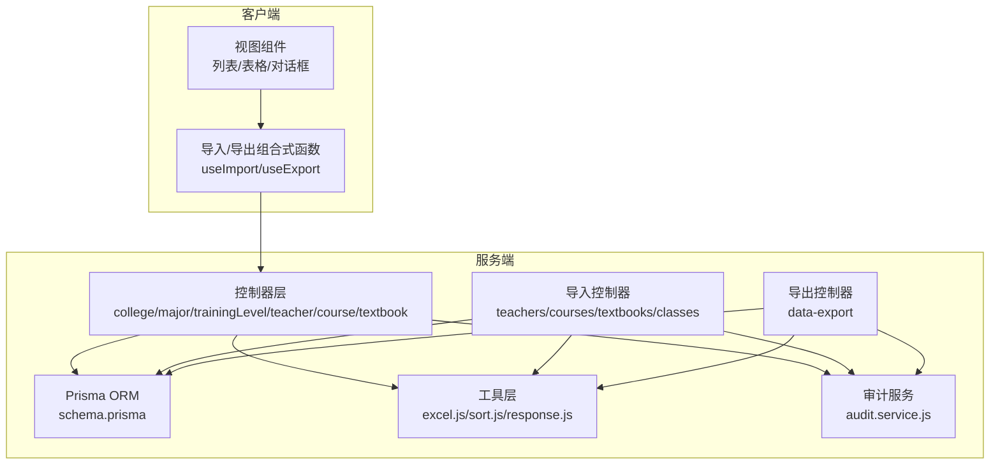

**图表来源**
- [server/src/controllers/college.controller.js:1-200](file://server/src/controllers/college.controller.js#L1-L200)
- [server/prisma/schema.prisma:1-308](file://server/prisma/schema.prisma#L1-L308)
- [server/src/utils/excel.js:1-171](file://server/src/utils/excel.js#L1-L171)
- [client/src/composables/useImport.js:1-92](file://client/src/composables/useImport.js#L1-L92)
- [client/src/composables/useExport.js:1-76](file://client/src/composables/useExport.js#L1-L76)

**章节来源**
- [server/src/controllers/college.controller.js:1-200](file://server/src/controllers/college.controller.js#L1-L200)
- [server/src/controllers/major.controller.js:1-169](file://server/src/controllers/major.controller.js#L1-L169)
- [server/src/controllers/trainingLevel.controller.js:1-151](file://server/src/controllers/trainingLevel.controller.js#L1-L151)
- [server/src/controllers/teacher.controller.js:1-395](file://server/src/controllers/teacher.controller.js#L1-L395)
- [server/src/controllers/course.controller.js:1-142](file://server/src/controllers/course.controller.js#L1-L142)
- [server/src/controllers/textbook.controller.js:1-224](file://server/src/controllers/textbook.controller.js#L1-L224)
- [server/prisma/schema.prisma:1-308](file://server/prisma/schema.prisma#L1-L308)
- [server/src/utils/excel.js:1-171](file://server/src/utils/excel.js#L1-L171)
- [client/src/composables/useImport.js:1-92](file://client/src/composables/useImport.js#L1-L92)
- [client/src/composables/useExport.js:1-76](file://client/src/composables/useExport.js#L1-L76)

## 核心组件
本模块围绕六大核心实体展开：学院、专业、培养层次、教师、课程、教材。每个实体均提供标准的CRUD接口，并在删除前进行严格的引用检查，确保数据完整性。同时，所有增删改操作均记录审计日志，支持可追溯性。

- 学院管理：维护学院的基本信息与排序，提供学院-培养层次映射查询，删除时检查是否存在班级、教师排课偏好、培养方案及教师归属等引用
- 专业管理：维护专业的基本信息与排序，删除时检查是否存在班级与培养方案引用
- 培养层次管理：维护层次信息与排序，删除时检查是否存在教师排课偏好与培养方案引用
- 教师管理：维护教师基本信息、状态、默认周课时，以及与课程、学院、层次的多对多关联；支持批量修改默认周课时与切换状态
- 课程管理：维护课程信息与排序，删除时检查是否存在培养方案、排课记录与教师关联
- 教材管理：维护教材信息与状态，删除时检查是否存在培养方案引用

**章节来源**
- [server/src/controllers/college.controller.js:1-200](file://server/src/controllers/college.controller.js#L1-L200)
- [server/src/controllers/major.controller.js:1-169](file://server/src/controllers/major.controller.js#L1-L169)
- [server/src/controllers/trainingLevel.controller.js:1-151](file://server/src/controllers/trainingLevel.controller.js#L1-L151)
- [server/src/controllers/teacher.controller.js:1-395](file://server/src/controllers/teacher.controller.js#L1-L395)
- [server/src/controllers/course.controller.js:1-142](file://server/src/controllers/course.controller.js#L1-L142)
- [server/src/controllers/textbook.controller.js:1-224](file://server/src/controllers/textbook.controller.js#L1-L224)

## 架构概览
系统采用分层架构：表现层（Vue组件）、组合式函数（导入/导出）、控制器层（业务编排）、ORM层（Prisma）、工具层（Excel/排序/响应）与审计层（审计日志）。导入导出通过Excel中间介质实现，支持模板下载与批量数据处理。

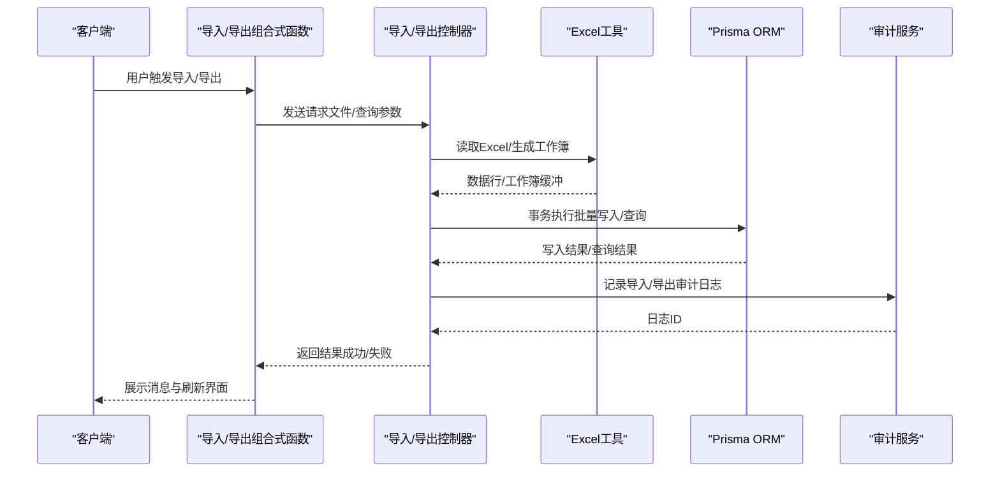

**图表来源**
- [client/src/composables/useImport.js:1-92](file://client/src/composables/useImport.js#L1-L92)
- [client/src/composables/useExport.js:1-76](file://client/src/composables/useExport.js#L1-L76)
- [server/src/utils/excel.js:1-171](file://server/src/utils/excel.js#L1-L171)
- [server/src/controllers/import/teachers.js:1-486](file://server/src/controllers/import/teachers.js#L1-L486)
- [server/src/controllers/export/data-export.controller.js:1-822](file://server/src/controllers/export/data-export.controller.js#L1-L822)

## 详细组件分析

### 数据模型与关系
以下ER图展示了基础数据模型的核心关系，包括唯一性约束、外键关系与索引设计：

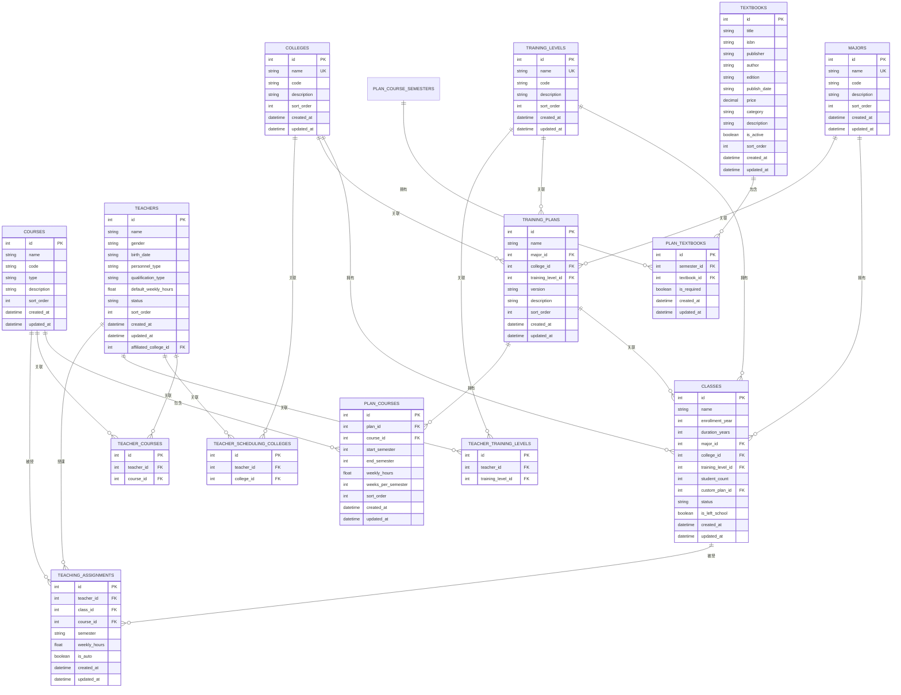

**图表来源**
- [server/prisma/schema.prisma:1-308](file://server/prisma/schema.prisma#L1-L308)

**章节来源**
- [server/prisma/schema.prisma:1-308](file://server/prisma/schema.prisma#L1-L308)

### 学院管理
- CRUD实现：提供列表、创建、更新、删除接口，支持排序字段自动修复与缓存失效
- 关联检查：删除前检查是否存在班级、教师排课偏好、培养方案及教师归属引用
- 审计日志：所有操作均记录审计日志，包含操作人IP、详情与结果
- 学院-层次映射：提供跨班级表的学院-层次映射查询，便于业务决策

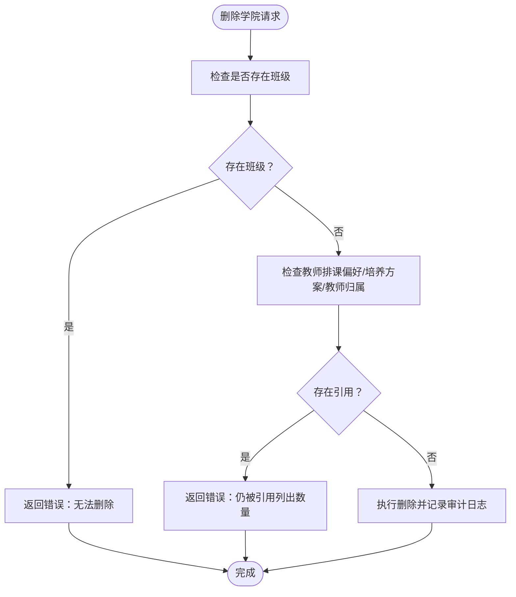

**图表来源**
- [server/src/controllers/college.controller.js:144-199](file://server/src/controllers/college.controller.js#L144-L199)

**章节来源**
- [server/src/controllers/college.controller.js:1-200](file://server/src/controllers/college.controller.js#L1-L200)

### 专业管理
- CRUD实现：提供列表、创建、更新、删除接口，支持排序字段自动修复与缓存失效
- 关联检查：删除前检查是否存在班级与培养方案引用
- 审计日志：所有操作均记录审计日志

**图表来源**
- [server/src/controllers/major.controller.js:122-168](file://server/src/controllers/major.controller.js#L122-L168)

**章节来源**
- [server/src/controllers/major.controller.js:1-169](file://server/src/controllers/major.controller.js#L1-L169)

### 培养层次管理
- CRUD实现：提供列表、创建、更新、删除接口，支持排序字段自动修复与缓存失效
- 关联检查：删除前检查是否存在教师排课偏好与培养方案引用
- 审计日志：所有操作均记录审计日志

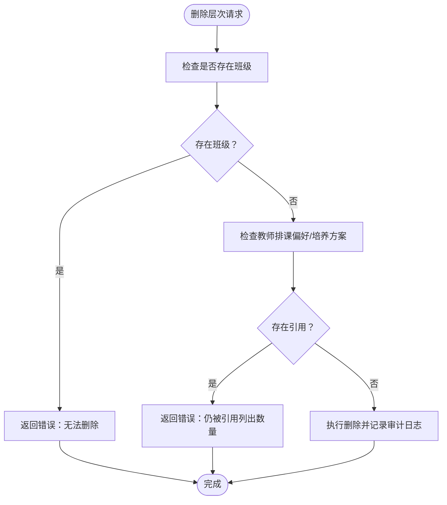

**图表来源**
- [server/src/controllers/trainingLevel.controller.js:101-150](file://server/src/controllers/trainingLevel.controller.js#L101-L150)

**章节来源**
- [server/src/controllers/trainingLevel.controller.js:1-151](file://server/src/controllers/trainingLevel.controller.js#L1-L151)

### 教师信息管理
- CRUD实现：提供列表、创建、更新、删除接口，支持排序字段自动修复与缓存失效
- 关联管理：支持与课程、学院、层次的多对多关联，更新时在事务中重建关联，避免部分失败导致关联丢失
- 批量操作：支持批量修改默认周课时与切换状态
- 审计日志：所有操作均记录审计日志

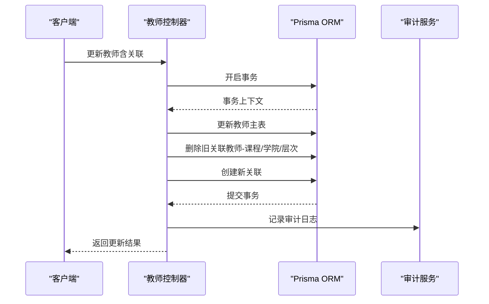

**图表来源**
- [server/src/controllers/teacher.controller.js:177-232](file://server/src/controllers/teacher.controller.js#L177-L232)

**章节来源**
- [server/src/controllers/teacher.controller.js:1-395](file://server/src/controllers/teacher.controller.js#L1-L395)

### 课程信息管理
- CRUD实现：提供列表、创建、更新、删除接口，支持按类型筛选与排序字段自动修复
- 关联检查：删除前检查是否存在培养方案、排课记录与教师关联
- 审计日志：所有操作均记录审计日志

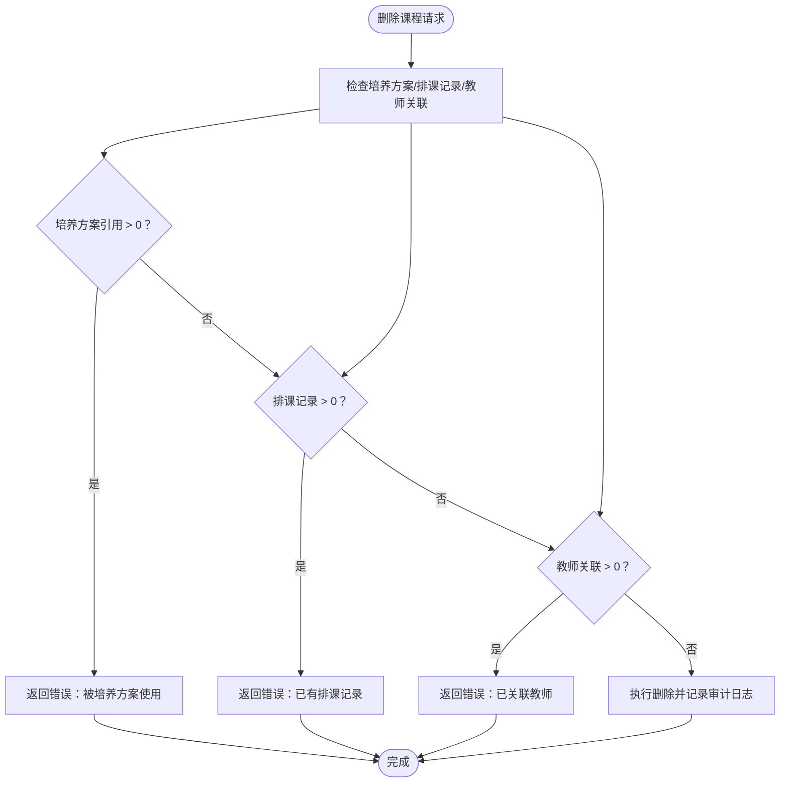

**图表来源**
- [server/src/controllers/course.controller.js:96-141](file://server/src/controllers/course.controller.js#L96-L141)

**章节来源**
- [server/src/controllers/course.controller.js:1-142](file://server/src/controllers/course.controller.js#L1-L142)

### 教材信息管理
- CRUD实现：提供列表、创建、更新、删除接口，支持状态切换（启用/停用）
- 关联检查：删除前检查是否存在培养方案引用
- 审计日志：所有操作均记录审计日志

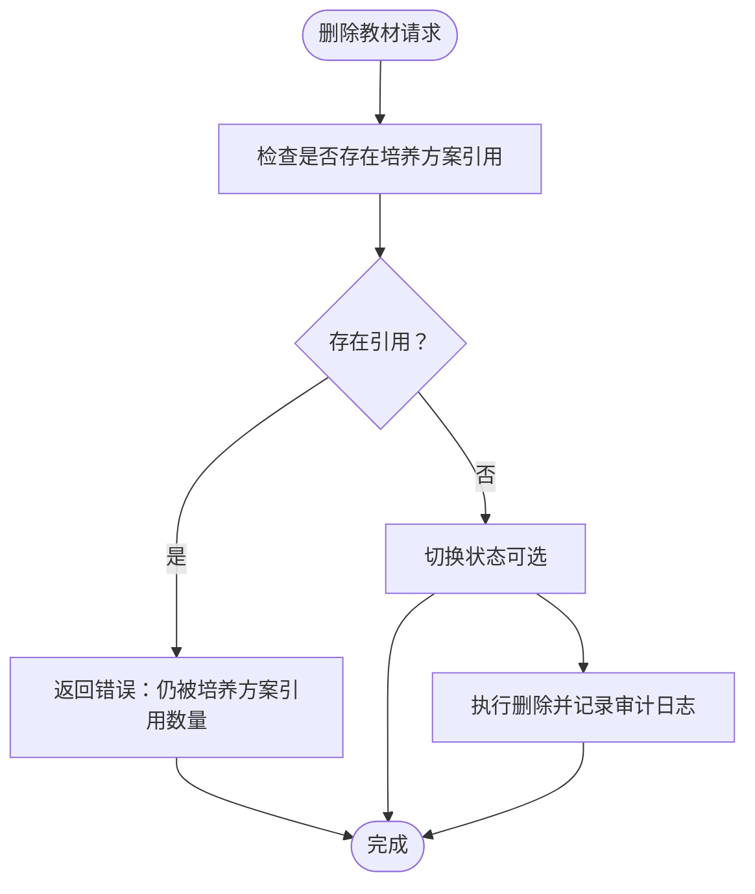

**图表来源**
- [server/src/controllers/textbook.controller.js:139-176](file://server/src/controllers/textbook.controller.js#L139-L176)

**章节来源**
- [server/src/controllers/textbook.controller.js:1-224](file://server/src/controllers/textbook.controller.js#L1-L224)

### 数据导入与导出

#### 导入功能
- 通用流程：文件校验 → 确认弹窗 → 上传 → 事务执行 → 结果反馈
- Excel读取：标准化单元格值、限制最大行数、去除模板必填标记
- 事务一致性：导入过程包裹在事务中，失败自动回滚，确保数据一致性
- 自动创建：导入过程中可自动创建缺失的基础数据（课程、学院、层次）

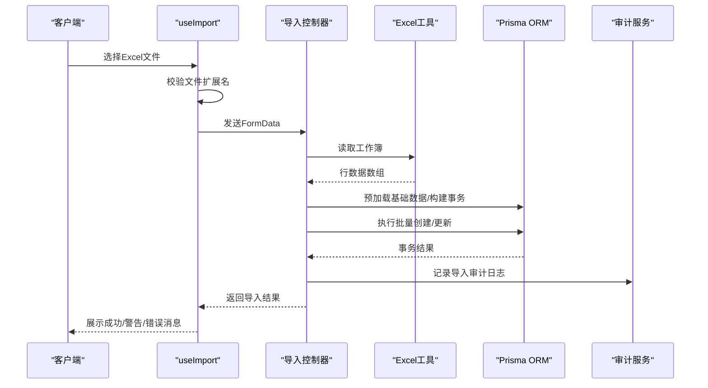

**图表来源**
- [client/src/composables/useImport.js:1-92](file://client/src/composables/useImport.js#L1-L92)
- [server/src/utils/excel.js:1-171](file://server/src/utils/excel.js#L1-L171)
- [server/src/controllers/import/teachers.js:1-486](file://server/src/controllers/import/teachers.js#L1-L486)
- [server/src/controllers/import/courses.js:1-145](file://server/src/controllers/import/courses.js#L1-L145)
- [server/src/controllers/import/textbooks.js:1-147](file://server/src/controllers/import/textbooks.js#L1-L147)
- [server/src/controllers/import/classes.js:1-345](file://server/src/controllers/import/classes.js#L1-L345)

**章节来源**
- [client/src/composables/useImport.js:1-92](file://client/src/composables/useImport.js#L1-L92)
- [server/src/utils/excel.js:1-171](file://server/src/utils/excel.js#L1-L171)
- [server/src/controllers/import/teachers.js:1-486](file://server/src/controllers/import/teachers.js#L1-L486)
- [server/src/controllers/import/courses.js:1-145](file://server/src/controllers/import/courses.js#L1-L145)
- [server/src/controllers/import/textbooks.js:1-147](file://server/src/controllers/import/textbooks.js#L1-L147)
- [server/src/controllers/import/classes.js:1-345](file://server/src/controllers/import/classes.js#L1-L345)

#### 导出功能
- 通用流程：客户端发起请求 → 服务端生成工作簿 → 下载Blob文件
- Excel安全：对单元格值进行公式注入防护，统一标题样式与列宽
- 多实体导出：课程、教材、教师、班级、教材使用情况、课时统计、教学安排等
- 模板下载：提供各实体的导入模板下载

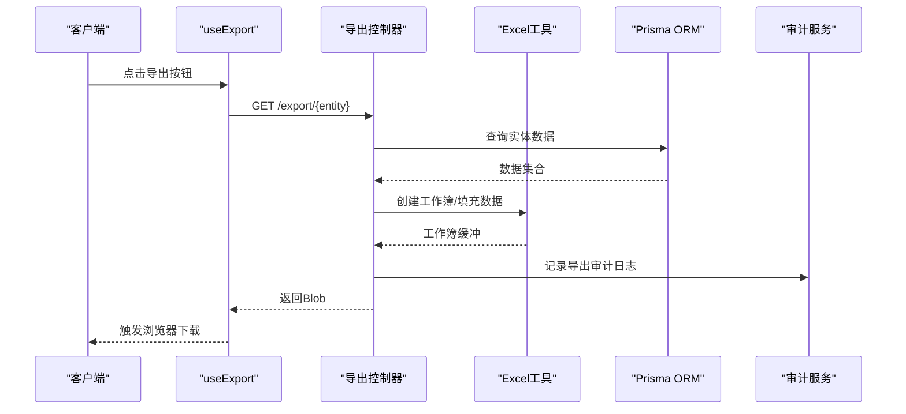

**图表来源**
- [client/src/composables/useExport.js:1-76](file://client/src/composables/useExport.js#L1-L76)
- [server/src/utils/excel.js:1-171](file://server/src/utils/excel.js#L1-L171)
- [server/src/controllers/export/data-export.controller.js:1-822](file://server/src/controllers/export/data-export.controller.js#L1-L822)

**章节来源**
- [client/src/composables/useExport.js:1-76](file://client/src/composables/useExport.js#L1-L76)
- [server/src/utils/excel.js:1-171](file://server/src/utils/excel.js#L1-L171)
- [server/src/controllers/export/data-export.controller.js:1-822](file://server/src/controllers/export/data-export.controller.js#L1-L822)

## 依赖分析
- 控制器层依赖Prisma ORM进行数据访问，依赖工具层进行Excel处理与响应封装，依赖审计服务记录操作日志
- 导入控制器依赖Excel工具进行文件读取与数据标准化，依赖Prisma事务保证一致性
- 导出控制器依赖Excel工具生成工作簿，依赖Prisma查询数据，依赖审计服务记录导出行为
- 客户端组合式函数封装请求与下载逻辑，统一封装导入/导出的用户交互

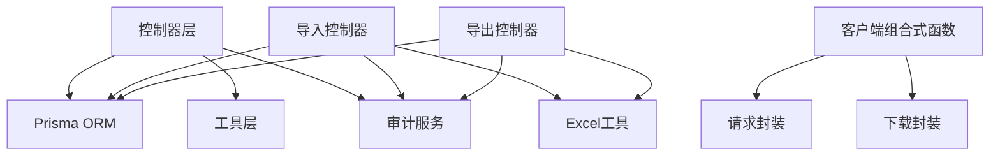

**图表来源**
- [server/src/controllers/college.controller.js:1-200](file://server/src/controllers/college.controller.js#L1-L200)
- [server/src/utils/excel.js:1-171](file://server/src/utils/excel.js#L1-L171)
- [client/src/composables/useImport.js:1-92](file://client/src/composables/useImport.js#L1-L92)
- [client/src/composables/useExport.js:1-76](file://client/src/composables/useExport.js#L1-L76)

**章节来源**
- [server/src/controllers/college.controller.js:1-200](file://server/src/controllers/college.controller.js#L1-L200)
- [server/src/utils/excel.js:1-171](file://server/src/utils/excel.js#L1-L171)
- [client/src/composables/useImport.js:1-92](file://client/src/composables/useImport.js#L1-L92)
- [client/src/composables/useExport.js:1-76](file://client/src/composables/useExport.js#L1-L76)

## 性能考虑
- 排序与缓存：各实体均支持排序字段的自动修复与缓存失效，减少重复排序计算
- 索引优化：Prisma模型定义了大量复合索引与唯一约束，提升查询与去重效率
- 批量操作：导入导出采用事务批量处理，避免多次往返数据库
- Excel处理：读取时限制最大行数，避免超大数据集导致内存压力
- N+1查询：导入控制器预加载基础数据，减少循环内的数据库查询次数

## 故障排除指南
- 导入失败：检查Excel文件格式、模板是否正确、必填字段是否缺失；查看控制台错误与审计日志
- 删除受限：根据错误提示解除相关引用（班级、培养方案、排课记录、教师关联等）
- 导出异常：确认当前学期设置、查询参数是否正确；检查网络连接与浏览器下载权限
- 权限问题：确保登录用户具备相应角色权限，查看审计日志确认操作人信息

**章节来源**
- [server/src/controllers/college.controller.js:144-199](file://server/src/controllers/college.controller.js#L144-L199)
- [server/src/controllers/major.controller.js:122-168](file://server/src/controllers/major.controller.js#L122-L168)
- [server/src/controllers/trainingLevel.controller.js:101-150](file://server/src/controllers/trainingLevel.controller.js#L101-L150)
- [server/src/controllers/course.controller.js:96-141](file://server/src/controllers/course.controller.js#L96-L141)
- [server/src/controllers/textbook.controller.js:139-176](file://server/src/controllers/textbook.controller.js#L139-L176)
- [server/src/controllers/teacher.controller.js:278-320](file://server/src/controllers/teacher.controller.js#L278-L320)

## 结论
基础数据管理模块通过清晰的分层架构、完善的实体关系与严格的数据约束，确保了核心业务数据的完整性与一致性。导入导出功能提供了高效的数据治理能力，结合审计日志实现了全流程可追溯。建议在生产环境中持续关注索引与事务性能，定期审查数据质量与引用关系，以维持系统的长期稳定运行。

## 附录
- 数据模型与约束：参见Prisma Schema定义
- 导入模板：通过导出模板接口下载各实体的Excel模板
- 审计日志：所有增删改操作均记录审计日志，支持查询与追踪