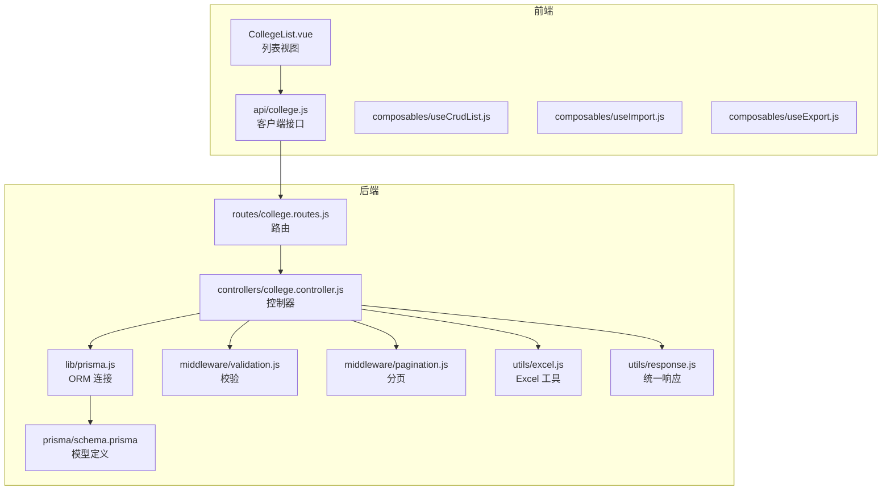
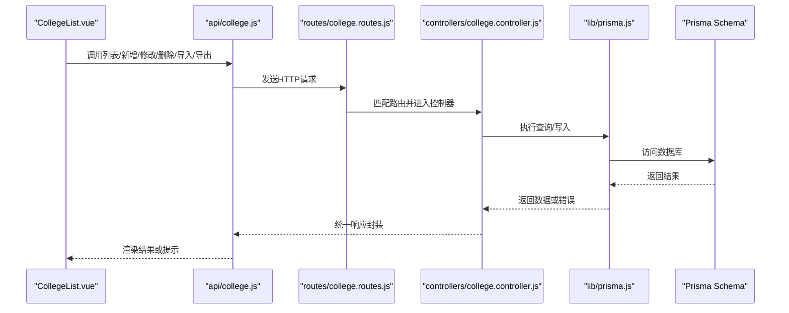
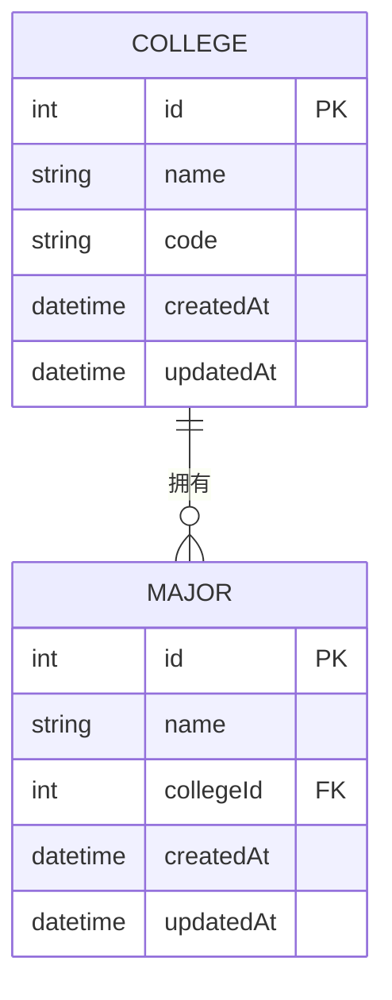
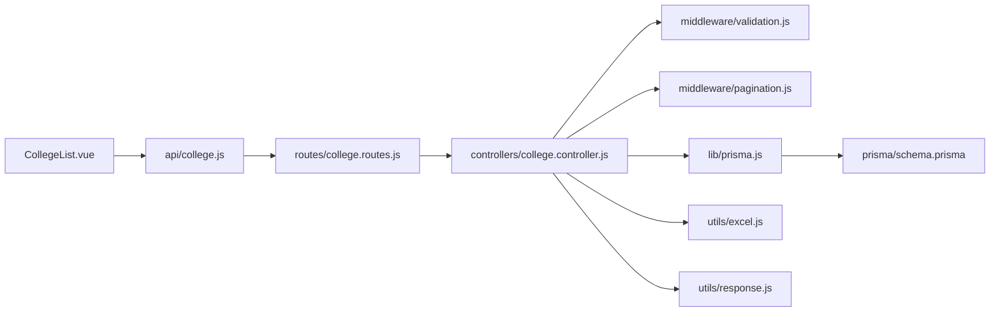

# 学院管理

<cite>
**本文引用的文件**
- [client\src\views\college\CollegeList.vue](file://client/src/views/college/CollegeList.vue)
- [client\src\api\college.js](file://client/src/api/college.js)
- [server\src\controllers\college.controller.js](file://server/src/controllers/college.controller.js)
- [server\src\routes\college.routes.js](file://server/src/routes/college.routes.js)
- [server\prisma\schema.prisma](file://server/prisma/schema.prisma)
- [server\src\lib\prisma.js](file://server/src/lib/prisma.js)
- [server\src\middleware\validation.js](file://server/src/middleware/validation.js)
- [server\src\middleware\pagination.js](file://server/src/middleware/pagination.js)
- [server\src\composables\useCrudList.js](file://client/src/composables/useCrudList.js)
- [server\src\composables\useImport.js](file://client/src/composables/useImport.js)
- [server\src\composables\useExport.js](file://client/src/composables/useExport.js)
- [server\src\controllers\import.controller.js](file://server/src/controllers/import.controller.js)
- [server\src\controllers\export\data-export.controller.js](file://server/src/controllers/export/data-export.controller.js)
- [server\src\controllers\export\export-template.controller.js](file://server/src/controllers/export/export-template.controller.js)
- [server\src\utils\excel.js](file://server/src/utils/excel.js)
- [server\src\utils\response.js](file://server/src/utils/response.js)
</cite>

## 目录
1. [简介](#简介)
2. [项目结构](#项目结构)
3. [核心组件](#核心组件)
4. [架构总览](#架构总览)
5. [详细组件分析](#详细组件分析)
6. [依赖分析](#依赖分析)
7. [性能考虑](#性能考虑)
8. [故障排查指南](#故障排查指南)
9. [结论](#结论)
10. [附录](#附录)

## 简介
本文件面向“学院管理”模块，系统性阐述以下内容：  
- 学院信息的增删改查（CRUD）流程与后端控制器实现  
- 学院与专业的关联关系及外键约束  
- 数据验证规则与业务约束  
- 列表展示、搜索过滤、分页处理的前后端协作  
- 导入/导出功能、批量操作与数据完整性保障  
- 具体的API接口说明、参数定义与返回值格式  

该模块在前端通过视图组件与API交互，在后端通过路由、控制器、Prisma ORM与数据库交互，并结合中间件完成校验与分页。

## 项目结构
围绕“学院管理”的关键文件分布如下：  
- 前端：CollegeList 视图、college API 客户端、通用 CRUD 与导入导出组合式函数  
- 后端：路由定义、控制器、Prisma 模型与中间件、Excel 工具与统一响应封装

图表来源
- [client\src\views\college\CollegeList.vue](file://client/src/views/college/CollegeList.vue)
- [client\src\api\college.js](file://client/src/api/college.js)
- [server\src\routes\college.routes.js](file://server/src/routes/college.routes.js)
- [server\src\controllers\college.controller.js](file://server/src/controllers/college.controller.js)
- [server\src\lib\prisma.js](file://server/src/lib/prisma.js)
- [server\prisma\schema.prisma](file://server/prisma/schema.prisma)
- [server\src\middleware\validation.js](file://server/src/middleware/validation.js)
- [server\src\middleware\pagination.js](file://server/src/middleware/pagination.js)
- [server\src\utils\excel.js](file://server/src/utils/excel.js)
- [server\src\utils\response.js](file://server/src/utils/response.js)

章节来源
- [client\src\views\college\CollegeList.vue](file://client/src/views/college/CollegeList.vue)
- [client\src\api\college.js](file://client/src/api/college.js)
- [server\src\routes\college.routes.js](file://server/src/routes/college.routes.js)
- [server\src\controllers\college.controller.js](file://server/src/controllers/college.controller.js)
- [server\prisma\schema.prisma](file://server/prisma/schema.prisma)

## 核心组件
- 前端视图组件：负责渲染学院列表、搜索过滤、分页控件、新增/编辑/删除按钮、导入/导出入口等交互。  
- 前端 API 客户端：封装对后端接口的调用，包含列表查询、新增、修改、删除、导入模板下载、导入执行、导出等方法。  
- 后端路由：定义学院模块的 HTTP 接口路径与方法映射。  
- 后端控制器：实现具体业务逻辑，包括数据校验、分页查询、关联查询（专业）、导入/导出处理、错误处理与统一响应。  
- Prisma 模型：定义学院与专业的实体关系（一对多），以及唯一性约束（如专业名称唯一）。  
- 中间件：统一参数校验与分页参数处理。  
- Excel 工具与响应封装：提供导入/导出的解析与生成能力，以及标准化的响应结构。

章节来源
- [client\src\views\college\CollegeList.vue](file://client/src/views/college/CollegeList.vue)
- [client\src\api\college.js](file://client/src/api/college.js)
- [server\src\controllers\college.controller.js](file://server/src/controllers/college.controller.js)
- [server\src\routes\college.routes.js](file://server/src/routes/college.routes.js)
- [server\prisma\schema.prisma](file://server/prisma/schema.prisma)
- [server\src\middleware\validation.js](file://server/src/middleware/validation.js)
- [server\src\middleware\pagination.js](file://server/src/middleware/pagination.js)
- [server\src\utils\excel.js](file://server/src/utils/excel.js)
- [server\src\utils\response.js](file://server/src/utils/response.js)

## 架构总览
从前端到后端的数据流与职责划分如下：

图表来源
- [client\src\views\college\CollegeList.vue](file://client/src/views/college/CollegeList.vue)
- [client\src\api\college.js](file://client/src/api/college.js)
- [server\src\routes\college.routes.js](file://server/src/routes/college.routes.js)
- [server\src\controllers\college.controller.js](file://server/src/controllers/college.controller.js)
- [server\src\lib\prisma.js](file://server/src/lib/prisma.js)
- [server\prisma\schema.prisma](file://server/prisma/schema.prisma)

## 详细组件分析

### 前端：CollegeList 视图与 API 客户端
- 功能要点
  - 列表展示：支持按条件筛选、排序、分页加载  
  - 新增/编辑/删除：弹窗或抽屉形式提交表单，调用对应 API  
  - 导入/导出：提供模板下载、Excel 文件上传、批量导入执行；导出当前筛选结果或全量数据  
  - 批量操作：勾选条目进行批量删除或批量状态变更（如适用）  
- 关键交互
  - 使用组合式函数封装 CRUD、导入、导出逻辑，减少重复代码  
  - 与后端约定统一的请求/响应格式，确保错误提示与成功反馈一致

章节来源
- [client\src\views\college\CollegeList.vue](file://client/src/views/college/CollegeList.vue)
- [client\src\api\college.js](file://client/src/api/college.js)
- [server\src\composables\useCrudList.js](file://client/src/composables/useCrudList.js)
- [server\src\composables\useImport.js](file://client/src/composables/useImport.js)
- [server\src\composables\useExport.js](file://client/src/composables/useExport.js)

### 后端：路由与控制器
- 路由定义
  - 提供 GET/POST/PUT/DELETE 等方法映射至控制器相应动作  
  - 对于导入/导出，提供独立的路由以承载文件上传与下载  
- 控制器职责
  - 参数校验：使用中间件对请求参数进行合法性检查  
  - 分页处理：解析分页参数，限制最大页大小，避免超大偏移  
  - 查询与写入：通过 Prisma 执行数据库操作，处理关联查询（如专业列表）  
  - 错误处理：捕获异常并返回统一响应格式  
  - 导入/导出：利用 Excel 工具解析/生成文件，执行批量写入或输出

章节来源
- [server\src\routes\college.routes.js](file://server/src/routes/college.routes.js)
- [server\src\controllers\college.controller.js](file://server/src/controllers/college.controller.js)
- [server\src\middleware\validation.js](file://server/src/middleware/validation.js)
- [server\src\middleware\pagination.js](file://server/src/middleware/pagination.js)
- [server\src\utils\excel.js](file://server/src/utils/excel.js)
- [server\src\utils\response.js](file://server/src/utils/response.js)

### 数据模型与关联关系
- 实体关系
  - 学院（College）与专业（Major）为一对多关系：一个学院可拥有多个专业  
  - 专业表中存在唯一性约束（例如专业名称唯一），防止重复录入  
- 外键与级联
  - 专业表包含所属学院的外键字段  
  - 删除学院前需处理其关联的专业，遵循数据库约束（如限制删除或级联删除）  
- 查询策略
  - 列表查询时可选择预加载专业子集，或仅返回专业数量，以平衡性能与展示需求

图表来源
- [server\prisma\schema.prisma](file://server/prisma/schema.prisma)

章节来源
- [server\prisma\schema.prisma](file://server/prisma/schema.prisma)

### 验证规则与业务约束
- 请求参数校验
  - 必填字段校验：如名称、编码等  
  - 字段长度与格式校验：编码应唯一且符合规范  
  - 分页参数校验：页码与每页大小应在合理范围内  
- 业务规则
  - 专业名称唯一：同一系统内不允许重复的专业名称  
  - 学院删除保护：若存在关联专业，则禁止直接删除，需先处理专业归属或删除专业  
  - 导入数据校验：Excel 列名与顺序需匹配模板，缺失列或类型不符需拒绝导入并返回错误明细

章节来源
- [server\src\middleware\validation.js](file://server/src/middleware/validation.js)
- [server\prisma\schema.prisma](file://server/prisma/schema.prisma)

### 列表展示、搜索过滤、分页处理
- 列表展示
  - 支持按学院名称/编号等关键字搜索  
  - 可按创建时间、更新时间等字段排序  
- 搜索过滤
  - 前端将筛选条件拼装为查询参数，传递给后端  
  - 后端根据参数构造查询条件，必要时进行模糊匹配  
- 分页处理
  - 前端传入页码与每页条数，后端解析并应用偏移与限制  
  - 设置最大页大小阈值，防止高并发下资源占用过高

章节来源
- [client\src\views\college\CollegeList.vue](file://client/src/views/college/CollegeList.vue)
- [client\src\api\college.js](file://client/src/api/college.js)
- [server\src\middleware\pagination.js](file://server/src/middleware/pagination.js)

### 导入/导出与批量操作
- 导入
  - 下载模板：后端提供标准 Excel 模板，包含必填列与示例  
  - 上传与解析：前端上传文件，后端读取并逐行校验  
  - 批量写入：通过事务或批量插入提升性能，失败时回滚  
  - 错误汇总：记录每行错误原因，允许用户修正后重新导入  
- 导出
  - 当前筛选结果导出：将前端筛选条件转换为后端查询，再输出 Excel  
  - 全量导出：按分页拉取并合并输出  
- 数据完整性
  - 导入前清理脏数据（空行、重复项）  
  - 写入前再次校验唯一性与外键一致性  
  - 成功/失败均记录审计日志，便于追踪

章节来源
- [client\src\api\college.js](file://client/src/api/college.js)
- [server\src\controllers\import.controller.js](file://server/src/controllers/import.controller.js)
- [server\src\controllers\export\data-export.controller.js](file://server/src/controllers/export/data-export.controller.js)
- [server\src\controllers\export\export-template.controller.js](file://server/src/controllers/export/export-template.controller.js)
- [server\src\utils\excel.js](file://server/src/utils/excel.js)

### API 接口说明（后端）
以下为“学院管理”模块的关键接口定义（方法、路径、参数、返回值概要）。具体实现请参考对应源文件。

- 获取学院列表
  - 方法：GET  
  - 路径：/api/colleges  
  - 查询参数：page（页码）、pageSize（每页条数）、keyword（关键词）、sort（排序字段）  
  - 返回：分页对象，包含数据数组、总数、页码信息  
  - 章节来源
    - [server\src\routes\college.routes.js](file://server/src/routes/college.routes.js)
    - [server\src\controllers\college.controller.js](file://server/src/controllers/college.controller.js)
    - [server\src\middleware\pagination.js](file://server/src/middleware/pagination.js)

- 获取单个学院详情
  - 方法：GET  
  - 路径：/api/colleges/:id  
  - 路径参数：id（学院ID）  
  - 返回：学院对象，包含关联专业列表或数量  
  - 章节来源
    - [server\src\routes\college.routes.js](file://server/src/routes/college.routes.js)
    - [server\src\controllers\college.controller.js](file://server/src/controllers/college.controller.js)

- 创建学院
  - 方法：POST  
  - 路径：/api/colleges  
  - 请求体：名称、编码等必填字段  
  - 返回：新建的学院对象  
  - 章节来源
    - [server\src\routes\college.routes.js](file://server/src/routes/college.routes.js)
    - [server\src\controllers\college.controller.js](file://server/src/controllers/college.controller.js)
    - [server\src\middleware\validation.js](file://server/src/middleware/validation.js)

- 更新学院
  - 方法：PUT  
  - 路径：/api/colleges/:id  
  - 路径参数：id（学院ID）  
  - 请求体：可更新的字段  
  - 返回：更新后的学院对象  
  - 章节来源
    - [server\src\routes\college.routes.js](file://server/src/routes/college.routes.js)
    - [server\src\controllers\college.controller.js](file://server/src/controllers/college.controller.js)
    - [server\src\middleware\validation.js](file://server/src/middleware/validation.js)

- 删除学院
  - 方法：DELETE  
  - 路径：/api/colleges/:id  
  - 路径参数：id（学院ID）  
  - 返回：删除结果状态  
  - 章节来源
    - [server\src\routes\college.routes.js](file://server/src/routes/college.routes.js)
    - [server\src\controllers\college.controller.js](file://server/src/controllers/college.controller.js)

- 下载学院导入模板
  - 方法：GET  
  - 路径：/api/colleges/import/template  
  - 返回：Excel 文件流  
  - 章节来源
    - [server\src\routes\college.routes.js](file://server/src/routes/college.routes.js)
    - [server\src\controllers\export\export-template.controller.js](file://server/src/controllers/export/export-template.controller.js)

- 执行学院数据导入
  - 方法：POST  
  - 路径：/api/colleges/import  
  - 表单数据：file（Excel 文件）  
  - 返回：导入结果（成功条数、失败明细等）  
  - 章节来源
    - [server\src\routes\college.routes.js](file://server/src/routes/college.routes.js)
    - [server\src\controllers\import.controller.js](file://server/src/controllers/import.controller.js)

- 导出学院数据
  - 方法：GET  
  - 路径：/api/colleges/export  
  - 查询参数：keyword、sort 等筛选条件  
  - 返回：Excel 文件流  
  - 章节来源
    - [server\src\routes\college.routes.js](file://server/src/routes/college.routes.js)
    - [server\src\controllers\export\data-export.controller.js](file://server/src/controllers/export/data-export.controller.js)

## 依赖分析
- 前端依赖
  - 视图组件依赖 API 客户端与组合式函数，形成清晰的 UI 与数据层分离  
  - 组合式函数复用 CRUD、导入、导出逻辑，降低重复开发成本  
- 后端依赖
  - 控制器依赖路由、中间件、Prisma 与工具类，形成“路由-控制-存储-工具”的分层  
  - Prisma 模型定义了实体关系与约束，是业务逻辑的权威依据  
- 外部依赖
  - Excel 工具用于导入/导出，需注意文件大小与内存占用  
  - 统一响应封装确保前后端契约一致，便于调试与扩展

图表来源
- [client\src\views\college\CollegeList.vue](file://client/src/views/college/CollegeList.vue)
- [client\src\api\college.js](file://client/src/api/college.js)
- [server\src\routes\college.routes.js](file://server/src/routes/college.routes.js)
- [server\src\controllers\college.controller.js](file://server/src/controllers/college.controller.js)
- [server\src\middleware\validation.js](file://server/src/middleware/validation.js)
- [server\src\middleware\pagination.js](file://server/src/middleware/pagination.js)
- [server\src\lib\prisma.js](file://server/src/lib/prisma.js)
- [server\prisma\schema.prisma](file://server/prisma/schema.prisma)
- [server\src\utils\excel.js](file://server/src/utils/excel.js)
- [server\src\utils\response.js](file://server/src/utils/response.js)

## 性能考虑
- 分页优化
  - 限制最大页大小，避免一次性拉取过多数据  
  - 使用复合索引与分页游标（如适用）降低 OFFSET 查询成本  
- 查询优化
  - 列表查询尽量只返回必要字段，避免 N+1 查询  
  - 对常用过滤字段建立索引，加速模糊匹配与等值查询  
- 导入/导出
  - 导入采用批量写入与事务，失败快速回滚  
  - 导出分批拉取并流式写出，避免内存峰值  
- 缓存与去重
  - 对模板与静态配置进行缓存，减少重复 IO  
  - 导入前进行去重与预校验，降低数据库压力

## 故障排查指南
- 常见问题
  - 导入失败：检查模板列名与顺序是否正确，确认必填字段非空  
  - 删除失败：检查是否存在关联专业，按提示先处理专业归属  
  - 分页异常：确认前端传参是否越界，后端是否设置了最大页大小  
  - 导出为空：确认筛选条件是否过于严格，或数据库中无匹配数据  
- 定位手段
  - 查看后端日志与错误响应，定位具体失败步骤  
  - 使用统一响应封装中的错误码与消息字段辅助定位  
  - 对导入失败的明细进行逐条核对，修复后再试

章节来源
- [server\src\utils\response.js](file://server/src/utils/response.js)
- [server\src\controllers\import.controller.js](file://server/src/controllers/import.controller.js)
- [server\src\controllers\college.controller.js](file://server/src/controllers/college.controller.js)

## 结论
“学院管理”模块通过清晰的前后端分工与中间件、ORM、工具类的协同，实现了完整的 CRUD、搜索过滤、分页、导入导出与批量处理能力。依托 Prisma 的模型约束与唯一性规则，有效保障了数据完整性。建议在后续迭代中进一步完善导入进度反馈、导出性能优化与审计日志的可视化展示。

## 附录
- 关键实现位置参考
  - 前端列表与交互：[client\src\views\college\CollegeList.vue](file://client/src/views/college/CollegeList.vue)
  - 前端 API 封装：[client\src\api\college.js](file://client/src/api/college.js)
  - 后端路由定义：[server\src\routes\college.routes.js](file://server/src/routes/college.routes.js)
  - 后端控制器：[server\src\controllers\college.controller.js](file://server/src/controllers/college.controller.js)
  - Prisma 模型与约束：[server\prisma\schema.prisma](file://server/prisma/schema.prisma)
  - 校验与分页中间件：[server\src\middleware\validation.js](file://server/src/middleware/validation.js), [server\src\middleware\pagination.js](file://server/src/middleware/pagination.js)
  - Excel 工具与统一响应：[server\src\utils\excel.js](file://server/src/utils/excel.js), [server\src\utils\response.js](file://server/src/utils/response.js)