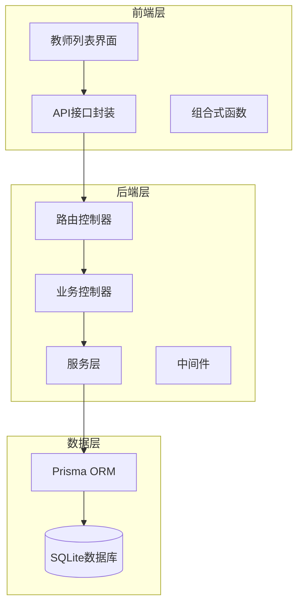
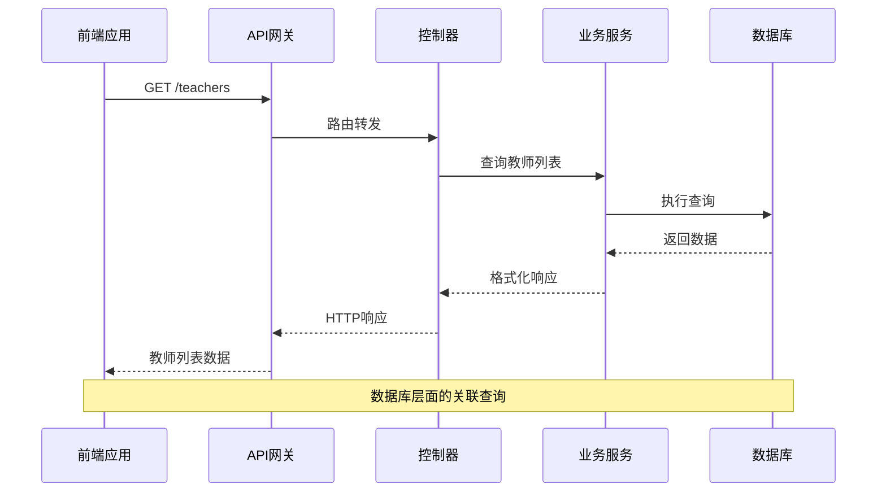
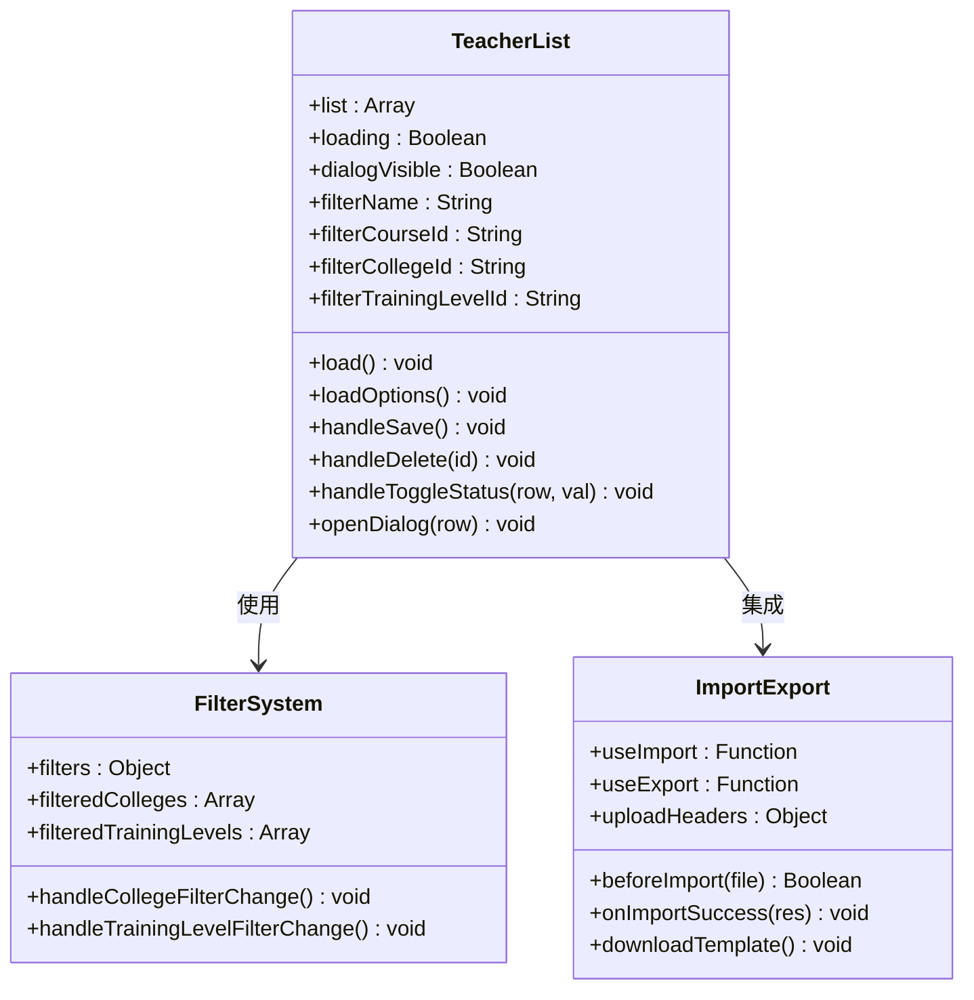
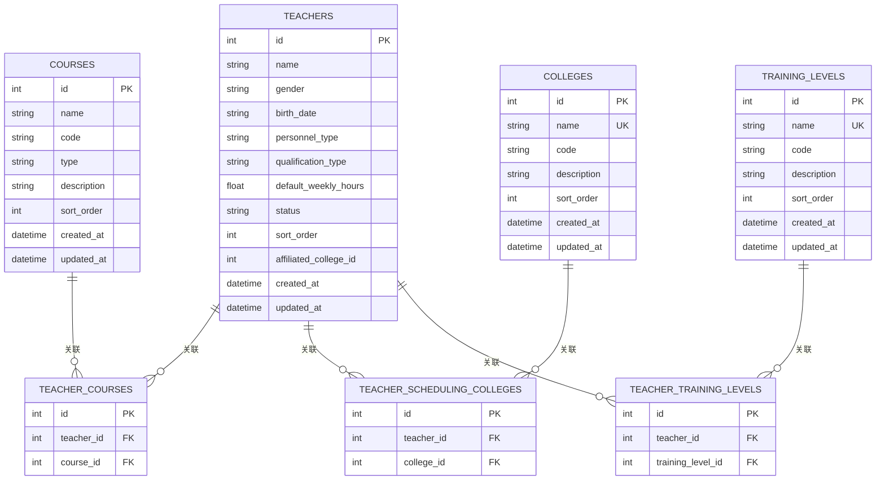
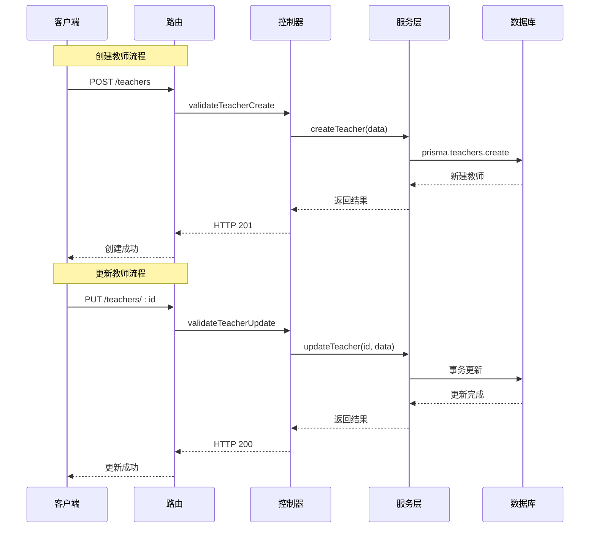
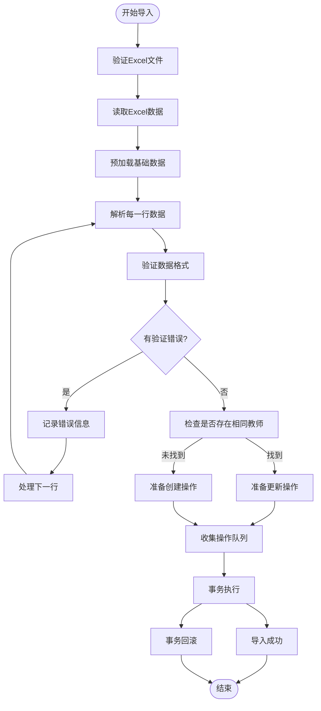
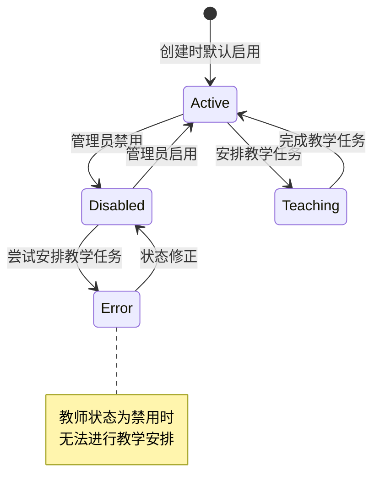
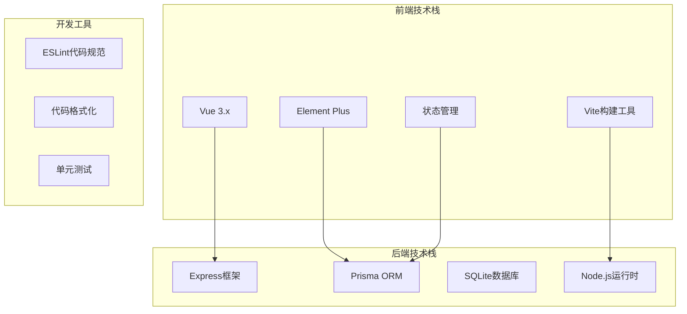
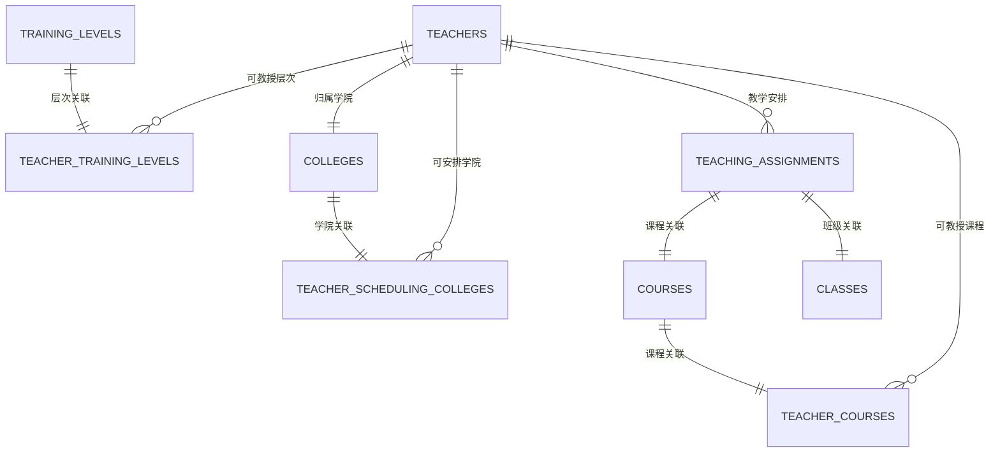

# 教师信息管理

<cite>
**本文档引用的文件**
- [client/src/views/teaching/TeacherList.vue](file://client/src/views/teaching/TeacherList.vue)
- [client/src/api/teacher.js](file://client/src/api/teacher.js)
- [client/src/composables/useImport.js](file://client/src/composables/useImport.js)
- [client/src/composables/useExport.js](file://client/src/composables/useExport.js)
- [server/src/controllers/teacher.controller.js](file://server/src/controllers/teacher.controller.js)
- [server/src/routes/teacher.routes.js](file://server/src/routes/teacher.routes.js)
- [server/src/middleware/validation.js](file://server/src/middleware/validation.js)
- [server/src/controllers/import/teachers.js](file://server/src/controllers/import/teachers.js)
- [server/src/controllers/export/data-export.controller.js](file://server/src/controllers/export/data-export.controller.js)
- [server/prisma/schema.prisma](file://server/prisma/schema.prisma)
- [server/src/controllers/teaching-arrange.controller.js](file://server/src/controllers/teaching-arrange.controller.js)
</cite>

## 目录
1. [简介](#简介)
2. [项目结构](#项目结构)
3. [核心组件](#核心组件)
4. [架构概览](#架构概览)
5. [详细组件分析](#详细组件分析)
6. [依赖关系分析](#依赖关系分析)
7. [性能考虑](#性能考虑)
8. [故障排除指南](#故障排除指南)
9. [结论](#结论)

## 简介

教师信息管理模块是高校教务管理系统中的核心功能模块，负责教师基本信息的全生命周期管理。该模块实现了完整的增删改查操作，支持教师与学院的关联管理、教师培训层次的维护、教师状态控制以及工号唯一性约束。系统还提供了强大的导入导出功能，支持批量操作处理，并与教学安排系统深度集成。

## 项目结构

教师信息管理模块采用前后端分离的架构设计，主要分为以下层次：

**图表来源**
- [client/src/views/teaching/TeacherList.vue:1-650](file://client/src/views/teaching/TeacherList.vue#L1-L650)
- [server/src/controllers/teacher.controller.js:1-395](file://server/src/controllers/teacher.controller.js#L1-L395)

**章节来源**
- [client/src/views/teaching/TeacherList.vue:1-650](file://client/src/views/teaching/TeacherList.vue#L1-L650)
- [server/src/controllers/teacher.controller.js:1-395](file://server/src/controllers/teacher.controller.js#L1-L395)

## 核心组件

### 教师信息管理核心功能

系统提供完整的教师信息管理功能，包括：

1. **基本信息管理**
   - 姓名、性别、出生年月、人员类别
   - 教师资格类型、特定周课时
   - 归属学院、状态控制

2. **关联关系管理**
   - 学科关联（多对多）
   - 任课学院关联（多对多）
   - 培养层次关联（多对多）

3. **搜索过滤功能**
   - 姓名模糊搜索
   - 人员类别筛选
   - 学科、学院、层次筛选
   - 状态筛选

4. **批量操作支持**
   - Excel导入导出
   - 批量修改特定周课时
   - 数据同步机制

**章节来源**
- [client/src/views/teaching/TeacherList.vue:421-451](file://client/src/views/teaching/TeacherList.vue#L421-L451)
- [server/src/controllers/teacher.controller.js:55-137](file://server/src/controllers/teacher.controller.js#L55-L137)

## 架构概览

教师信息管理模块采用RESTful API设计，前后端通过HTTP协议通信：

**图表来源**
- [server/src/controllers/teacher.controller.js:14-50](file://server/src/controllers/teacher.controller.js#L14-L50)
- [server/src/routes/teacher.routes.js:21-22](file://server/src/routes/teacher.routes.js#L21-L22)

## 详细组件分析

### 前端组件分析

#### 教师列表组件

教师列表组件提供了完整的教师信息展示和管理功能：

**图表来源**
- [client/src/views/teaching/TeacherList.vue:323-618](file://client/src/views/teaching/TeacherList.vue#L323-L618)
- [client/src/composables/useImport.js:14-91](file://client/src/composables/useImport.js#L14-L91)
- [client/src/composables/useExport.js:14-75](file://client/src/composables/useExport.js#L14-L75)

#### 数据模型定义

教师信息的数据模型设计如下：

**图表来源**
- [server/prisma/schema.prisma:229-284](file://server/prisma/schema.prisma#L229-L284)

**章节来源**
- [client/src/views/teaching/TeacherList.vue:1-650](file://client/src/views/teaching/TeacherList.vue#L1-L650)
- [server/prisma/schema.prisma:229-284](file://server/prisma/schema.prisma#L229-L284)

### 后端控制器分析

#### 教师管理API

后端控制器实现了完整的教师管理API：

**图表来源**
- [server/src/controllers/teacher.controller.js:55-137](file://server/src/controllers/teacher.controller.js#L55-L137)
- [server/src/routes/teacher.routes.js:24-59](file://server/src/routes/teacher.routes.js#L24-L59)

#### 验证规则实现

系统实现了严格的输入验证规则：

| 字段 | 验证规则 | 说明 |
|------|----------|------|
| 姓名 | 必填，1-50字符 | 教师姓名不能为空 |
| 性别 | male/female | 仅允许两种性别值 |
| 出生年月 | YYYY-MM格式 | 支持多种输入格式 |
| 人员类别 | full_time/part_time/external | 三种人员类型 |
| 特定周课时 | 0-40浮点数 | 课时范围限制 |
| 状态 | active/disabled | 启用/禁用状态 |

**章节来源**
- [server/src/middleware/validation.js:458-517](file://server/src/middleware/validation.js#L458-L517)
- [server/src/controllers/teacher.controller.js:55-137](file://server/src/controllers/teacher.controller.js#L55-L137)

### 导入导出功能分析

#### Excel导入流程

导入功能支持批量数据处理，具有完善的错误处理机制：

**图表来源**
- [server/src/controllers/import/teachers.js:14-486](file://server/src/controllers/import/teachers.js#L14-L486)

#### 导出功能实现

导出功能支持多种数据格式，满足不同使用场景：

| 功能 | 输出格式 | 用途 |
|------|----------|------|
| 教师数据导出 | Excel (.xlsx) | 数据备份和分享 |
| 导入模板下载 | Excel (.xlsx) | 提供标准格式模板 |
| 课时统计导出 | Excel (.xlsx) | 教学工作量统计 |
| 教学安排导出 | Excel (.xlsx) | 教学计划执行情况 |

**章节来源**
- [server/src/controllers/export/data-export.controller.js:427-505](file://server/src/controllers/export/data-export.controller.js#L427-L505)
- [client/src/composables/useExport.js:14-75](file://client/src/composables/useExport.js#L14-L75)

### 与教学安排系统的集成

#### 教师状态与教学安排

教师状态直接影响教学安排的可行性：

**图表来源**
- [server/src/controllers/teaching-arrange.controller.js:117-128](file://server/src/controllers/teaching-arrange.controller.js#L117-L128)

#### 教师能力匹配

系统通过多维度匹配确保教师具备相应教学能力：

| 匹配维度 | 实现方式 | 作用 |
|----------|----------|------|
| 学科匹配 | teacher_courses关联表 | 确保教师教授相应课程 |
| 学院匹配 | scheduling_colleges关联表 | 限制教师可安排的学院范围 |
| 层次匹配 | scheduling_levels关联表 | 控制教师可教授的培养层次 |
| 状态检查 | 教师状态字段 | 防止禁用教师参与教学安排 |

**章节来源**
- [server/src/controllers/teaching-arrange.controller.js:117-128](file://server/src/controllers/teaching-arrange.controller.js#L117-L128)
- [server/prisma/schema.prisma:253-284](file://server/prisma/schema.prisma#L253-L284)

## 依赖关系分析

### 技术栈依赖

### 数据依赖关系

系统中的数据依赖关系体现了清晰的业务逻辑：

**图表来源**
- [server/prisma/schema.prisma:229-307](file://server/prisma/schema.prisma#L229-L307)

**章节来源**
- [server/prisma/schema.prisma:229-307](file://server/prisma/schema.prisma#L229-L307)

## 性能考虑

### 查询优化策略

1. **索引优化**
   - 教师状态字段建立索引，支持快速筛选
   - 人员类别字段建立索引，提升分类查询效率
   - 关联表使用复合索引，优化多表连接查询

2. **N+1查询问题解决**
   - 使用include预加载关联数据
   - 批量预加载基础数据（课程、学院、层次）
   - 避免循环内的数据库查询

3. **缓存策略**
   - 排序字段缓存机制
   - 常用查询结果缓存
   - 文件上传临时目录清理

### 批量操作优化

1. **事务处理**
   - 导入操作使用数据库事务保证一致性
   - 批量更新操作原子性执行
   - 错误时自动回滚，确保数据完整性

2. **内存管理**
   - 流式处理大文件导入
   - 及时清理临时文件
   - 限制单次导入记录数量

## 故障排除指南

### 常见问题及解决方案

#### 导入失败问题

| 问题类型 | 症状 | 解决方案 |
|----------|------|----------|
| Excel格式错误 | 导入报错，提示文件格式不支持 | 检查Excel文件格式，确保为.xlsx或.xls |
| 数据验证失败 | 部分记录导入失败 | 检查必填字段和数据格式，参考错误详情 |
| 同名教师冲突 | 存在多个同名教师时导入失败 | 区分同名教师或先合并数据 |
| 外键约束错误 | 关联数据不存在 | 确保关联的基础数据已存在 |

#### API调用异常

| 异常类型 | 症状 | 解决方案 |
|----------|------|----------|
| 权限不足 | 返回403状态码 | 确认用户角色为管理员或超级管理员 |
| 参数验证失败 | 返回422状态码 | 检查请求参数格式和范围 |
| 数据库连接失败 | 请求超时或连接错误 | 检查数据库服务状态和连接配置 |
| 服务器内部错误 | 返回500状态码 | 查看服务器日志，重启服务 |

#### 前端显示问题

| 问题类型 | 症状 | 解决方案 |
|----------|------|----------|
| 数据加载缓慢 | 页面长时间显示加载状态 | 检查网络连接和服务器性能 |
| 过滤功能失效 | 筛选条件不生效 | 清除浏览器缓存，重新登录系统 |
| 导入进度不显示 | 导入完成后无反馈 | 检查浏览器JavaScript是否启用 |

**章节来源**
- [server/src/controllers/import/teachers.js:282-306](file://server/src/controllers/import/teachers.js#L282-L306)
- [client/src/composables/useImport.js:77-82](file://client/src/composables/useImport.js#L77-L82)

## 结论

教师信息管理模块是一个功能完整、架构清晰的教务管理系统核心组件。系统通过前后端分离的设计，实现了高效的数据管理和用户交互体验。模块具备以下特点：

1. **功能完整性**：涵盖教师信息管理的全生命周期，包括增删改查、导入导出、批量操作等功能

2. **数据一致性**：通过数据库事务和严格的验证规则，确保数据的准确性和完整性

3. **扩展性强**：模块化设计便于功能扩展和维护，支持与其他系统的集成

4. **用户体验好**：提供直观的操作界面和丰富的筛选功能，支持批量操作处理

5. **安全性高**：实现权限控制和数据验证，防止非法操作和数据泄露

该模块为高校教务管理提供了坚实的技术基础，能够有效支撑教学管理工作的需求。通过持续的优化和完善，可以进一步提升系统的性能和稳定性，为用户提供更好的服务体验。