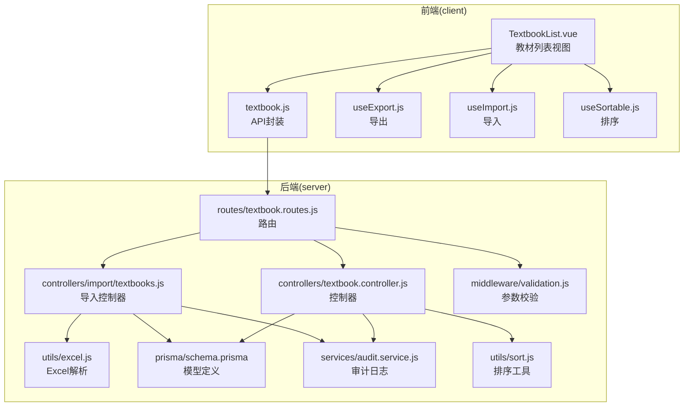
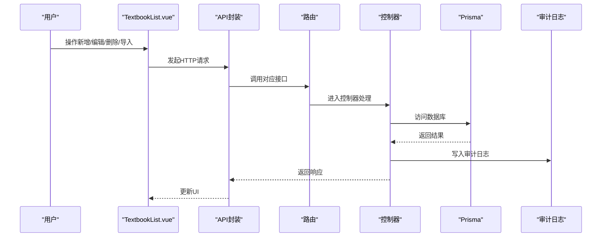
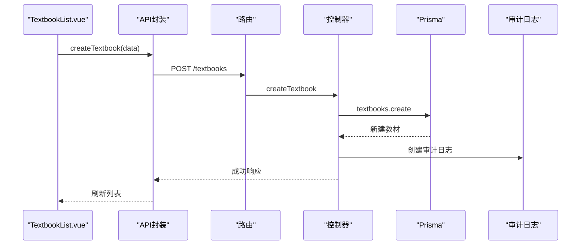
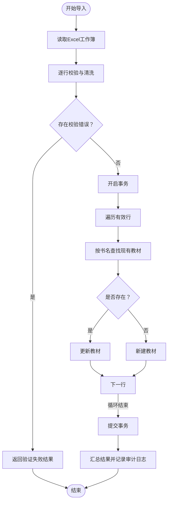
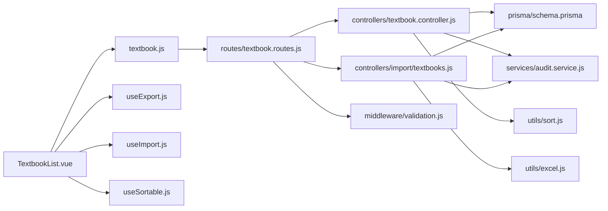

# 教材信息管理

<cite>
**本文档引用的文件**
- [client/src/views/textbook/TextbookList.vue](file://client/src/views/textbook/TextbookList.vue)
- [client/src/api/textbook.js](file://client/src/api/textbook.js)
- [client/src/composables/useExport.js](file://client/src/composables/useExport.js)
- [client/src/composables/useImport.js](file://client/src/composables/useImport.js)
- [client/src/composables/useSortable.js](file://client/src/composables/useSortable.js)
- [server/src/controllers/textbook.controller.js](file://server/src/controllers/textbook.controller.js)
- [server/src/routes/textbook.routes.js](file://server/src/routes/textbook.routes.js)
- [server/src/controllers/import/textbooks.js](file://server/src/controllers/import/textbooks.js)
- [server/src/middleware/validation.js](file://server/src/middleware/validation.js)
- [server/src/utils/excel.js](file://server/src/utils/excel.js)
- [server/src/constants/index.js](file://server/src/constants/index.js)
- [server/src/services/audit.service.js](file://server/src/services/audit.service.js)
- [server/src/utils/sort.js](file://server/src/utils/sort.js)
- [server/prisma/schema.prisma](file://server/prisma/schema.prisma)
</cite>

## 目录
1. [简介](#简介)
2. [项目结构](#项目结构)
3. [核心组件](#核心组件)
4. [架构总览](#架构总览)
5. [详细组件分析](#详细组件分析)
6. [依赖关系分析](#依赖关系分析)
7. [性能考虑](#性能考虑)
8. [故障排查指南](#故障排查指南)
9. [结论](#结论)
10. [附录](#附录)

## 简介
本模块负责教材信息的全生命周期管理，包括增删改查、状态切换、排序调整、导入导出、批量操作以及与课程培养方案的数据一致性保障。系统通过前后端分离架构实现：前端提供可视化界面与交互能力，后端提供REST接口与业务逻辑，数据库采用Prisma ORM进行数据持久化。

## 项目结构
教材信息管理模块在前后端的组织方式如下：
- 前端
  - 视图组件：教材列表页面，包含搜索、筛选、表格、对话框、批量操作等
  - API封装：统一的教材HTTP请求方法
  - 可组合工具：导出、导入、排序等通用能力
- 后端
  - 路由层：定义教材相关接口及鉴权、参数校验中间件
  - 控制器层：实现教材增删改查、状态切换、排序修复等业务逻辑
  - 导入控制器：Excel批量导入，支持事务与审计日志
  - 中间件：参数校验、XSS清理、角色鉴权
  - 工具与服务：Excel解析、排序工具、审计日志、Prisma访问

图表来源
- [client/src/views/textbook/TextbookList.vue:1-532](file://client/src/views/textbook/TextbookList.vue#L1-L532)
- [client/src/api/textbook.js:1-8](file://client/src/api/textbook.js#L1-L8)
- [client/src/composables/useExport.js](file://client/src/composables/useExport.js)
- [client/src/composables/useImport.js](file://client/src/composables/useImport.js)
- [client/src/composables/useSortable.js](file://client/src/composables/useSortable.js)
- [server/src/routes/textbook.routes.js:1-50](file://server/src/routes/textbook.routes.js#L1-L50)
- [server/src/controllers/textbook.controller.js:1-224](file://server/src/controllers/textbook.controller.js#L1-L224)
- [server/src/controllers/import/textbooks.js:1-147](file://server/src/controllers/import/textbooks.js#L1-L147)
- [server/src/middleware/validation.js](file://server/src/middleware/validation.js)
- [server/src/utils/excel.js](file://server/src/utils/excel.js)
- [server/prisma/schema.prisma](file://server/prisma/schema.prisma)

章节来源
- [client/src/views/textbook/TextbookList.vue:1-532](file://client/src/views/textbook/TextbookList.vue#L1-L532)
- [server/src/routes/textbook.routes.js:1-50](file://server/src/routes/textbook.routes.js#L1-L50)

## 核心组件
- 前端视图组件：教材列表页面，提供搜索、筛选、表格展示、对话框编辑、批量操作、导入导出等功能
- API封装：统一的HTTP请求方法，供视图组件调用
- 可组合工具：导出、导入、排序等通用能力，提升复用性
- 后端路由：定义教材相关接口，绑定鉴权与参数校验中间件
- 控制器：实现教材增删改查、状态切换、排序修复等业务逻辑
- 导入控制器：Excel批量导入，支持事务与审计日志
- 中间件：参数校验、XSS清理、角色鉴权
- 数据模型：Prisma模型定义教材实体及其字段

章节来源
- [client/src/views/textbook/TextbookList.vue:1-532](file://client/src/views/textbook/TextbookList.vue#L1-L532)
- [client/src/api/textbook.js:1-8](file://client/src/api/textbook.js#L1-L8)
- [server/src/controllers/textbook.controller.js:1-224](file://server/src/controllers/textbook.controller.js#L1-L224)
- [server/src/controllers/import/textbooks.js:1-147](file://server/src/controllers/import/textbooks.js#L1-L147)
- [server/prisma/schema.prisma](file://server/prisma/schema.prisma)

## 架构总览
教材信息管理采用典型的MVC+中间件架构：
- 前端通过API封装调用后端接口
- 路由层负责鉴权与参数校验
- 控制器层处理业务逻辑并访问数据库
- 导入控制器独立处理Excel批量导入
- 审计服务记录关键操作
- 排序工具保证列表顺序一致性

图表来源
- [client/src/views/textbook/TextbookList.vue:1-532](file://client/src/views/textbook/TextbookList.vue#L1-L532)
- [client/src/api/textbook.js:1-8](file://client/src/api/textbook.js#L1-L8)
- [server/src/routes/textbook.routes.js:1-50](file://server/src/routes/textbook.routes.js#L1-L50)
- [server/src/controllers/textbook.controller.js:1-224](file://server/src/controllers/textbook.controller.js#L1-L224)
- [server/src/services/audit.service.js](file://server/src/services/audit.service.js)

## 详细组件分析

### 教材实体与字段定义
教材实体包含以下字段（来源于Prisma模型与控制器处理）：
- 标识与基础信息：id、title（书名）、isbn（书号）、description（备注）
- 出版信息：publisher（出版社）、author（作者）、edition（版次）、publish_date（出版日期）
- 价格与分类：price（定价）、category（类别）
- 状态与排序：is_active（启用/停用）、sort_order（排序）
- 审计字段：createdAt、updatedAt

字段约束与默认值：
- 必填项：title
- 可空项：isbn、publisher、author、edition、publish_date、price、category、description
- 默认值：is_active默认true；sort_order由排序工具生成或显式指定
- 类别默认值：当Excel导入未提供类别时使用系统常量默认类别

章节来源
- [server/prisma/schema.prisma](file://server/prisma/schema.prisma)
- [server/src/controllers/textbook.controller.js:21-79](file://server/src/controllers/textbook.controller.js#L21-L79)
- [server/src/constants/index.js](file://server/src/constants/index.js)

### 增删改查流程
- 列表查询：自动修复排序后按sort_order升序返回
- 新增教材：校验必填字段，计算排序，写入数据库并记录审计日志
- 更新教材：构建更新数据，特殊处理数值字段，记录审计日志
- 删除教材：检查是否被培养方案引用，若未引用则删除并记录审计日志
- 状态切换：接收目标状态参数，更新后记录审计日志

图表来源
- [client/src/api/textbook.js:4](file://client/src/api/textbook.js#L4)
- [server/src/routes/textbook.routes.js:24-30](file://server/src/routes/textbook.routes.js#L24-L30)
- [server/src/controllers/textbook.controller.js:21-79](file://server/src/controllers/textbook.controller.js#L21-L79)

章节来源
- [server/src/controllers/textbook.controller.js:11-176](file://server/src/controllers/textbook.controller.js#L11-L176)
- [server/src/routes/textbook.routes.js:20-47](file://server/src/routes/textbook.routes.js#L20-L47)

### 教材与课程的关联关系
- 关联点：培养方案与教材存在多对多关系（通过中间表plan_textbooks）
- 删除保护：若教材被培养方案引用，则禁止删除
- 影响评估：删除前统计引用次数，避免破坏课程安排数据完整性

章节来源
- [server/src/controllers/textbook.controller.js:142-143](file://server/src/controllers/textbook.controller.js#L142-L143)
- [server/prisma/schema.prisma](file://server/prisma/schema.prisma)

### 教材版本管理与出版社/作者维护
- 版本管理：通过edition（版次）字段标识版本信息
- 出版社与作者：publisher（出版社）、author（作者）字段用于维护相关信息
- 分类策略：category字段区分“技工”“非技工”，便于后续筛选与统计

章节来源
- [server/src/controllers/textbook.controller.js:21-79](file://server/src/controllers/textbook.controller.js#L21-L79)
- [client/src/views/textbook/TextbookList.vue:202-239](file://client/src/views/textbook/TextbookList.vue#L202-L239)

### 导入导出与批量操作
- Excel导入
  - 读取工作簿，逐行校验与清洗
  - 校验规则：必须包含书名；价格需为有效数字；类别为空时使用默认值
  - 事务处理：按书名匹配，存在则更新，否则新建
  - 审计日志：记录导入结果与错误明细
- Excel导出
  - 使用导出工具生成标准模板与数据文件
- 批量操作
  - 支持批量设置出版社、作者、类别
  - 支持批量删除
  - 批量更新通过并发请求实现高效处理

图表来源
- [server/src/controllers/import/textbooks.js:13-147](file://server/src/controllers/import/textbooks.js#L13-L147)
- [server/src/utils/excel.js](file://server/src/utils/excel.js)
- [server/src/constants/index.js](file://server/src/constants/index.js)

章节来源
- [client/src/views/textbook/TextbookList.vue:36-47](file://client/src/views/textbook/TextbookList.vue#L36-L47)
- [client/src/composables/useExport.js](file://client/src/composables/useExport.js)
- [client/src/composables/useImport.js](file://client/src/composables/useImport.js)
- [server/src/controllers/import/textbooks.js:13-147](file://server/src/controllers/import/textbooks.js#L13-L147)

### 搜索过滤与分页展示
- 搜索与过滤
  - 前端：基于书名、类别、出版社三类条件进行本地过滤
  - 后端：当前接口返回全量数据，排序由后端自动修复并按sort_order升序
- 分页
  - 当前实现未提供分页参数；如需大数据量场景建议扩展分页参数与索引

章节来源
- [client/src/views/textbook/TextbookList.vue:322-335](file://client/src/views/textbook/TextbookList.vue#L322-L335)
- [server/src/controllers/textbook.controller.js:11-19](file://server/src/controllers/textbook.controller.js#L11-L19)

### 数据一致性与排序机制
- 排序修复
  - 首次查询时自动修复缺失或异常的sort_order，确保列表顺序稳定
- 排序缓存
  - 每次变更后失效排序缓存，避免脏读
- 并发安全
  - 导入使用事务，保证批量操作的一致性
- 审计日志
  - 对创建、更新、删除、导入、状态切换等关键操作记录审计日志，便于追踪与回溯

章节来源
- [server/src/controllers/textbook.controller.js:13-13](file://server/src/controllers/textbook.controller.js#L13-L13)
- [server/src/utils/sort.js](file://server/src/utils/sort.js)
- [server/src/services/audit.service.js](file://server/src/services/audit.service.js)

### 参数校验与安全
- 参数校验
  - 路由层对ID参数、教材对象、状态切换请求进行校验
  - XSS清理防止恶意输入
- 权限控制
  - 新增、修改、删除、状态切换需要管理员或超级管理员权限

章节来源
- [server/src/routes/textbook.routes.js:5-9](file://server/src/routes/textbook.routes.js#L5-L9)
- [server/src/middleware/validation.js](file://server/src/middleware/validation.js)

## 依赖关系分析
- 前端依赖
  - 视图组件依赖API封装与可组合工具
  - 可组合工具依赖通用导出/导入/排序能力
- 后端依赖
  - 控制器依赖Prisma访问数据库
  - 导入控制器依赖Excel解析与审计日志
  - 路由层依赖中间件进行鉴权与校验

图表来源
- [client/src/views/textbook/TextbookList.vue:1-532](file://client/src/views/textbook/TextbookList.vue#L1-L532)
- [client/src/api/textbook.js:1-8](file://client/src/api/textbook.js#L1-L8)
- [client/src/composables/useExport.js](file://client/src/composables/useExport.js)
- [client/src/composables/useImport.js](file://client/src/composables/useImport.js)
- [client/src/composables/useSortable.js](file://client/src/composables/useSortable.js)
- [server/src/routes/textbook.routes.js:1-50](file://server/src/routes/textbook.routes.js#L1-L50)
- [server/src/controllers/textbook.controller.js:1-224](file://server/src/controllers/textbook.controller.js#L1-L224)
- [server/src/controllers/import/textbooks.js:1-147](file://server/src/controllers/import/textbooks.js#L1-L147)
- [server/src/middleware/validation.js](file://server/src/middleware/validation.js)
- [server/src/utils/excel.js](file://server/src/utils/excel.js)
- [server/src/services/audit.service.js](file://server/src/services/audit.service.js)
- [server/src/utils/sort.js](file://server/src/utils/sort.js)
- [server/prisma/schema.prisma](file://server/prisma/schema.prisma)

## 性能考虑
- 查询优化
  - 建议为sort_order建立索引，提升排序查询性能
  - 大数据量场景建议引入分页参数与复合索引
- 导入性能
  - Excel导入使用事务批处理，减少多次往返
  - 建议限制单次导入行数并增加进度反馈
- 排序性能
  - 自动修复排序仅在查询时触发，避免频繁写入
  - 批量更新时尽量合并请求，减少数据库压力

## 故障排查指南
- 常见错误与处理
  - 教材不存在：更新/删除/状态切换时可能返回404，检查ID有效性
  - 被引用不可删除：若教材被培养方案引用，删除会被拒绝，需先解除引用
  - Excel导入失败：检查文件格式、必填字段与价格格式，查看审计日志中的错误明细
  - 参数校验失败：确认请求体字段命名与类型符合后端要求
- 审计日志
  - 所有关键操作均记录审计日志，可用于问题定位与责任追溯

章节来源
- [server/src/controllers/textbook.controller.js:131-133](file://server/src/controllers/textbook.controller.js#L131-L133)
- [server/src/controllers/textbook.controller.js:142-143](file://server/src/controllers/textbook.controller.js#L142-L143)
- [server/src/controllers/import/textbooks.js:63-82](file://server/src/controllers/import/textbooks.js#L63-L82)
- [server/src/services/audit.service.js](file://server/src/services/audit.service.js)

## 结论
教材信息管理模块通过清晰的前后端分工与完善的中间件体系，实现了从数据录入到导入导出、从单条操作到批量处理的全链路功能。系统在数据一致性、安全性与可审计性方面具备良好设计，建议在未来进一步增强分页与索引策略以支撑更大规模数据。

## 附录
- 接口一览（后端）
  - GET /textbooks：获取全部教材（自动修复排序并按sort_order升序）
  - POST /textbooks：新增教材（管理员/超级管理员）
  - PUT /textbooks/:id：更新教材（管理员/超级管理员）
  - DELETE /textbooks/:id：删除教材（管理员/超级管理员）
  - POST /textbooks/:id/toggle-status：切换状态（管理员/超级管理员）
  - POST /import/textbooks：Excel批量导入（管理员/超级管理员）

章节来源
- [server/src/routes/textbook.routes.js:20-47](file://server/src/routes/textbook.routes.js#L20-L47)
- [server/src/controllers/textbook.controller.js:11-224](file://server/src/controllers/textbook.controller.js#L11-L224)
- [server/src/controllers/import/textbooks.js:13-147](file://server/src/controllers/import/textbooks.js#L13-L147)