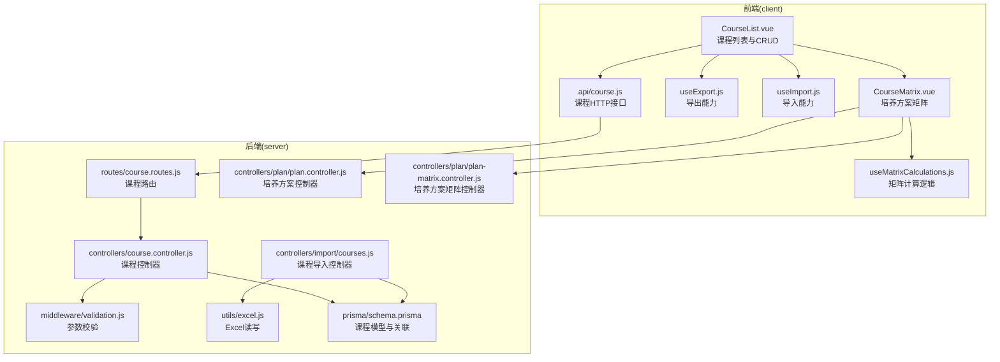
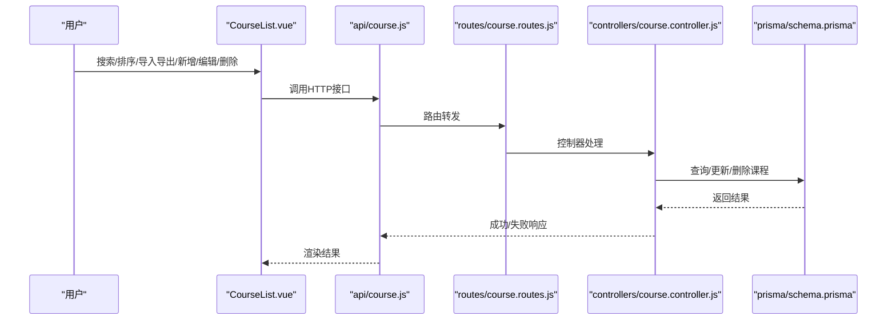
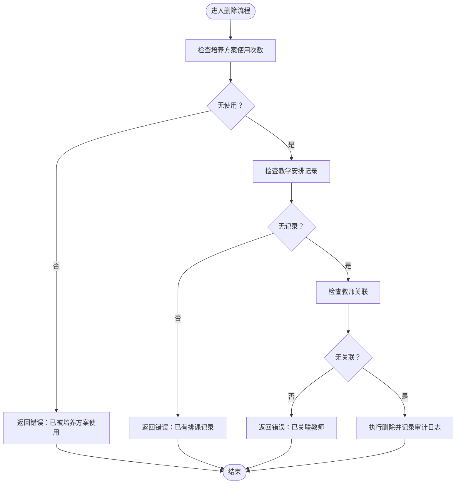
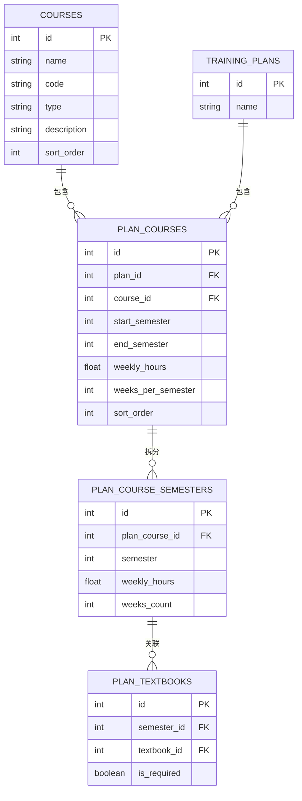
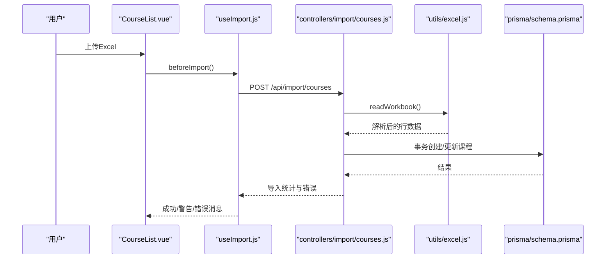
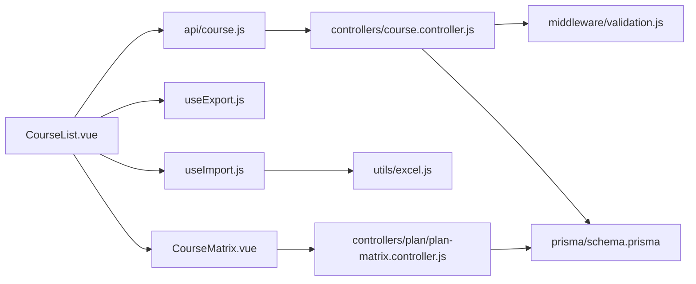

# 课程信息管理

<cite>
**本文引用的文件**
- [client/src/views/course/CourseList.vue](file://client/src/views/course/CourseList.vue)
- [client/src/api/course.js](file://client/src/api/course.js)
- [client/src/composables/useExport.js](file://client/src/composables/useExport.js)
- [client/src/composables/useImport.js](file://client/src/composables/useImport.js)
- [client/src/components/CourseMatrix.vue](file://client/src/components/CourseMatrix.vue)
- [client/src/composables/useMatrixCalculations.js](file://client/src/composables/useMatrixCalculations.js)
- [server/src/controllers/course.controller.js](file://server/src/controllers/course.controller.js)
- [server/src/routers/course.routes.js](file://server/src/routers/course.routes.js)
- [server/src/middleware/validation.js](file://server/src/middleware/validation.js)
- [server/src/controllers/import/courses.js](file://server/src/controllers/import/courses.js)
- [server/src/utils/excel.js](file://server/src/utils/excel.js)
- [server/prisma/schema.prisma](file://server/prisma/schema.prisma)
- [server/src/controllers/plan/plan.controller.js](file://server/src/controllers/plan/plan.controller.js)
- [server/src/controllers/plan/plan-matrix.controller.js](file://server/src/controllers/plan/plan-matrix.controller.js)
</cite>

## 目录
1. [简介](#简介)
2. [项目结构](#项目结构)
3. [核心组件](#核心组件)
4. [架构概览](#架构概览)
5. [详细组件分析](#详细组件分析)
6. [依赖分析](#依赖分析)
7. [性能考虑](#性能考虑)
8. [故障排查指南](#故障排查指南)
9. [结论](#结论)
10. [附录](#附录)

## 简介
本文件面向“课程信息管理”模块，系统性阐述课程的增删改查、字段与验证规则、课程与培养方案的关联关系、学分与学时计算规则、课程类型分类管理、导入导出与批量处理、与培养方案系统的数据同步、以及课程列表的搜索过滤与分页展示策略。文档同时提供可视化图示与最佳实践建议，帮助开发者与运营人员高效理解与维护该模块。

## 项目结构
课程信息管理由前后端协同实现：
- 前端负责课程列表展示、搜索过滤、排序、新增/编辑/删除、导入导出、与培养方案矩阵的交互。
- 后端负责课程数据的持久化、校验、审计日志、与培养方案的关联约束、以及导入导出的业务逻辑。

图表来源
- [client/src/views/course/CourseList.vue:1-238](file://client/src/views/course/CourseList.vue#L1-L238)
- [client/src/api/course.js:1-7](file://client/src/api/course.js#L1-L7)
- [client/src/composables/useExport.js:1-76](file://client/src/composables/useExport.js#L1-L76)
- [client/src/composables/useImport.js:1-92](file://client/src/composables/useImport.js#L1-L92)
- [client/src/components/CourseMatrix.vue:1-391](file://client/src/components/CourseMatrix.vue#L1-L391)
- [client/src/composables/useMatrixCalculations.js:1-91](file://client/src/composables/useMatrixCalculations.js#L1-L91)
- [server/src/controllers/course.controller.js:1-142](file://server/src/controllers/course.controller.js#L1-L142)
- [server/src/routers/course.routes.js:1-36](file://server/src/routers/course.routes.js#L1-L36)
- [server/src/middleware/validation.js:1-590](file://server/src/middleware/validation.js#L1-L590)
- [server/src/controllers/import/courses.js:1-145](file://server/src/controllers/import/courses.js#L1-L145)
- [server/src/utils/excel.js:1-171](file://server/src/utils/excel.js#L1-L171)
- [server/prisma/schema.prisma:70-85](file://server/prisma/schema.prisma#L70-L85)
- [server/src/controllers/plan/plan.controller.js:1-346](file://server/src/controllers/plan/plan.controller.js#L1-L346)
- [server/src/controllers/plan/plan-matrix.controller.js:1-598](file://server/src/controllers/plan/plan-matrix.controller.js#L1-L598)

章节来源
- [client/src/views/course/CourseList.vue:1-238](file://client/src/views/course/CourseList.vue#L1-L238)
- [server/src/controllers/course.controller.js:1-142](file://server/src/controllers/course.controller.js#L1-L142)
- [server/src/routers/course.routes.js:1-36](file://server/src/routers/course.routes.js#L1-L36)
- [server/prisma/schema.prisma:70-85](file://server/prisma/schema.prisma#L70-L85)

## 核心组件
- 课程列表视图：提供课程搜索、排序、导入导出、新增/编辑/删除入口。
- 课程API封装：统一的HTTP接口调用，便于复用与测试。
- 导入/导出组合式函数：封装Excel导入导出流程与错误反馈。
- 培养方案矩阵：展示课程在各学期的周课时与教材分配，并支持批量更新。
- 矩阵计算组合式函数：抽取分组、范围判断、总课时计算等共性逻辑。
- 课程控制器与路由：实现课程CRUD、参数校验、审计日志与关联检查。
- Excel工具：提供安全写入、模板生成、行解析与标准化。
- Prisma模型：定义课程实体、类型、索引与关联关系。

章节来源
- [client/src/views/course/CourseList.vue:121-226](file://client/src/views/course/CourseList.vue#L121-L226)
- [client/src/api/course.js:1-7](file://client/src/api/course.js#L1-L7)
- [client/src/composables/useExport.js:14-75](file://client/src/composables/useExport.js#L14-L75)
- [client/src/composables/useImport.js:14-91](file://client/src/composables/useImport.js#L14-L91)
- [client/src/components/CourseMatrix.vue:44-367](file://client/src/components/CourseMatrix.vue#L44-L367)
- [client/src/composables/useMatrixCalculations.js:7-90](file://client/src/composables/useMatrixCalculations.js#L7-L90)
- [server/src/controllers/course.controller.js:11-141](file://server/src/controllers/course.controller.js#L11-L141)
- [server/src/controllers/import/courses.js:12-144](file://server/src/controllers/import/courses.js#L12-L144)
- [server/src/utils/excel.js:90-134](file://server/src/utils/excel.js#L90-L134)
- [server/prisma/schema.prisma:70-85](file://server/prisma/schema.prisma#L70-L85)

## 架构概览
课程信息管理遵循“前端视图 + 组合式函数 + 后端控制器 + 数据模型”的分层架构。前端通过API与后端交互，后端通过Prisma访问数据库，路由层负责鉴权与参数校验，控制器负责业务逻辑与审计日志。

图表来源
- [client/src/views/course/CourseList.vue:121-226](file://client/src/views/course/CourseList.vue#L121-L226)
- [client/src/api/course.js:1-7](file://client/src/api/course.js#L1-L7)
- [server/src/routers/course.routes.js:14-33](file://server/src/routers/course.routes.js#L14-L33)
- [server/src/controllers/course.controller.js:11-141](file://server/src/controllers/course.controller.js#L11-L141)
- [server/prisma/schema.prisma:70-85](file://server/prisma/schema.prisma#L70-L85)

## 详细组件分析

### 课程基本信息与字段定义
- 字段清单与默认值
  - 名称：必填，长度限制，用于唯一性匹配与排序。
  - 编码：可选，唯一性索引，便于外部系统映射。
  - 类型：枚举值（公共基础课/专业课/选修），默认公共基础课。
  - 描述：可选文本。
  - 排序序号：整数，默认0，用于界面展示顺序。
  - 时间戳：创建与更新时间。
- 关系与索引
  - 课程与培养方案：多对多（通过 plan_courses 关联）。
  - 课程与教师：多对多（通过 teacher_courses 关联）。
  - 课程与教学安排：一对多（通过 teaching_assignments 关联）。
  - 索引：类型、编码等字段建立索引，提升查询效率。

章节来源
- [server/prisma/schema.prisma:70-85](file://server/prisma/schema.prisma#L70-L85)
- [server/prisma/schema.prisma:115-134](file://server/prisma/schema.prisma#L115-L134)
- [server/prisma/schema.prisma:253-262](file://server/prisma/schema.prisma#L253-L262)
- [server/prisma/schema.prisma:286-307](file://server/prisma/schema.prisma#L286-L307)

### 课程类型分类管理
- 类型枚举：公共基础课、专业课、选修。
- 前端展示：使用标签区分类型，便于识别。
- 后端校验：严格限制类型值，避免非法输入。
- 培养方案矩阵：按类型分组展示课程，支持分别计算与排序。

章节来源
- [client/src/views/course/CourseList.vue:44-49](file://client/src/views/course/CourseList.vue#L44-L49)
- [server/src/middleware/validation.js:151-163](file://server/src/middleware/validation.js#L151-L163)
- [client/src/composables/useMatrixCalculations.js:8-31](file://client/src/composables/useMatrixCalculations.js#L8-L31)

### 课程增删改查与验证规则
- 列表查询
  - 支持按类型过滤；自动修复排序序号；按排序序号升序返回。
- 新增课程
  - 校验名称必填与长度；自动分配排序序号；默认类型为公共基础课；记录审计日志。
- 更新课程
  - 支持部分字段更新；构建更新数据；记录审计日志；异常处理与审计记录。
- 删除课程
  - 关联检查：培养方案使用次数、教学安排记录、教师关联；均无关联方可删除；记录审计日志。

图表来源
- [server/src/controllers/course.controller.js:96-141](file://server/src/controllers/course.controller.js#L96-L141)

章节来源
- [server/src/controllers/course.controller.js:11-141](file://server/src/controllers/course.controller.js#L11-L141)
- [server/src/middleware/validation.js:410-421](file://server/src/middleware/validation.js#L410-L421)

### 课程列表搜索过滤与排序
- 搜索过滤
  - 前端使用防抖输入，关键词匹配课程名称（忽略大小写）。
- 排序
  - 支持拖拽排序，使用轻量端点仅更新排序序号，避免重建学期记录导致教材关联丢失。
  - 后端自动修复排序序号，保证唯一递增。

章节来源
- [client/src/views/course/CourseList.vue:135-167](file://client/src/views/course/CourseList.vue#L135-L167)
- [client/src/components/CourseMatrix.vue:287-337](file://client/src/components/CourseMatrix.vue#L287-L337)
- [server/src/controllers/course.controller.js:11-21](file://server/src/controllers/course.controller.js#L11-L21)

### 课程与培养方案的关联关系
- 关联模型
  - plan_courses：连接培养方案与课程，包含开课学期范围、周课时、每学期周数、排序序号等。
  - plan_course_semesters：按学期拆分的课程安排，包含周课时与周数。
  - plan_textbooks：学期与教材的多对多关联。
- 矩阵展示
  - 按类型分组展示课程；支持设置开课学期范围；自动创建/更新学期记录；支持批量应用周数。
- 学分与学时计算
  - 总学时 = Σ(周课时 × 每学期周数)，支持学期级覆盖与全局周数回退。
  - 培养方案层面汇总公共基础课与专业课两类的总学时。

图表来源
- [server/prisma/schema.prisma:70-85](file://server/prisma/schema.prisma#L70-L85)
- [server/prisma/schema.prisma:115-134](file://server/prisma/schema.prisma#L115-L134)
- [server/prisma/schema.prisma:99-113](file://server/prisma/schema.prisma#L99-L113)
- [server/prisma/schema.prisma:136-147](file://server/prisma/schema.prisma#L136-L147)

章节来源
- [client/src/components/CourseMatrix.vue:88-117](file://client/src/components/CourseMatrix.vue#L88-L117)
- [client/src/composables/useMatrixCalculations.js:44-69](file://client/src/composables/useMatrixCalculations.js#L44-L69)
- [server/src/controllers/plan/plan-matrix.controller.js:8-35](file://server/src/controllers/plan/plan-matrix.controller.js#L8-L35)

### 课程学分、学时的计算规则
- 单课程总学时
  - 若学期记录存在：周课时 × 每学期周数；若不存在：课程默认周课时 × 课程默认周数。
- 分组小计与方案总计
  - 分组内课程总和；方案内两类课程总和。
- 全局周数回退
  - 当学期记录未设置周数时，回退到全局周数或课程默认周数。

章节来源
- [client/src/composables/useMatrixCalculations.js:44-69](file://client/src/composables/useMatrixCalculations.js#L44-L69)
- [client/src/components/CourseMatrix.vue:201-236](file://client/src/components/CourseMatrix.vue#L201-L236)

### 课程信息的导入导出与批量处理
- 导入
  - Excel读取：限制最大行数，标准化单元格值，去除公式注入风险。
  - 校验：课程名称必填；类型支持“专业课/专业课”与“professional/public”映射；显式类型才更新类型字段。
  - 事务：新建/覆盖在同一事务中执行，失败回滚；记录审计日志。
- 导出
  - 通用导出：支持自定义URL与参数，下载Excel文件。
  - 模板下载：生成带必填标识的模板，便于用户填写。

图表来源
- [client/src/views/course/CourseList.vue:147-152](file://client/src/views/course/CourseList.vue#L147-L152)
- [client/src/composables/useImport.js:22-55](file://client/src/composables/useImport.js#L22-L55)
- [server/src/controllers/import/courses.js:12-144](file://server/src/controllers/import/courses.js#L12-L144)
- [server/src/utils/excel.js:90-134](file://server/src/utils/excel.js#L90-L134)
- [server/prisma/schema.prisma:70-85](file://server/prisma/schema.prisma#L70-L85)

章节来源
- [client/src/composables/useExport.js:14-75](file://client/src/composables/useExport.js#L14-L75)
- [client/src/composables/useImport.js:14-91](file://client/src/composables/useImport.js#L14-L91)
- [server/src/controllers/import/courses.js:12-144](file://server/src/controllers/import/courses.js#L12-L144)
- [server/src/utils/excel.js:15-42](file://server/src/utils/excel.js#L15-L42)

### 与培养方案系统的数据同步
- 新增/更新课程
  - 课程变更后，培养方案中的课程默认周课时与周数保持不变，学期记录按需创建或更新。
- 删除课程
  - 删除前强制检查培养方案、教学安排、教师关联，避免破坏性删除。
- 排序同步
  - 课程排序通过轻量端点更新，不触发生学期记录重建，避免教材关联丢失。

章节来源
- [server/src/controllers/course.controller.js:96-141](file://server/src/controllers/course.controller.js#L96-L141)
- [client/src/components/CourseMatrix.vue:287-337](file://client/src/components/CourseMatrix.vue#L287-L337)
- [server/src/controllers/plan/plan-matrix.controller.js:119-243](file://server/src/controllers/plan/plan-matrix.controller.js#L119-L243)

## 依赖分析
- 前端依赖
  - 视图组件依赖API封装与组合式函数；组合式函数抽取共性逻辑，降低耦合。
- 后端依赖
  - 控制器依赖Prisma模型与校验中间件；导入控制器依赖Excel工具；路由层统一鉴权与参数校验。
- 外部依赖
  - ExcelJS用于读写Excel；Prisma用于ORM与索引优化。

图表来源
- [client/src/views/course/CourseList.vue:121-226](file://client/src/views/course/CourseList.vue#L121-L226)
- [client/src/composables/useExport.js:14-75](file://client/src/composables/useExport.js#L14-L75)
- [client/src/composables/useImport.js:14-91](file://client/src/composables/useImport.js#L14-L91)
- [client/src/components/CourseMatrix.vue:44-367](file://client/src/components/CourseMatrix.vue#L44-L367)
- [server/src/controllers/course.controller.js:11-141](file://server/src/controllers/course.controller.js#L11-L141)
- [server/src/middleware/validation.js:151-163](file://server/src/middleware/validation.js#L151-L163)
- [server/src/utils/excel.js:90-134](file://server/src/utils/excel.js#L90-L134)
- [server/src/controllers/plan/plan-matrix.controller.js:8-35](file://server/src/controllers/plan/plan-matrix.controller.js#L8-L35)

章节来源
- [server/src/routers/course.routes.js:14-33](file://server/src/routers/course.routes.js#L14-L33)
- [server/src/controllers/course.controller.js:11-141](file://server/src/controllers/course.controller.js#L11-L141)

## 性能考虑
- 前端
  - 搜索防抖：减少频繁计算与渲染。
  - 并行加载：课程列表与学期周数并行获取，缩短首屏等待。
  - 批量更新：矩阵中批量应用周数采用并发请求，失败单独反馈。
- 后端
  - 自动修复排序：避免重复值与并发写锁冲突。
  - 事务导入：保证一致性与原子性。
  - 索引优化：类型、编码等字段建立索引，提升查询效率。

## 故障排查指南
- 参数校验失败
  - 检查请求体字段是否符合长度与取值范围；查看日志中的脱敏请求体与错误明细。
- 导入失败
  - 确认Excel文件格式与模板字段；查看失败行号与具体错误；关注事务回滚日志。
- 删除失败
  - 检查是否存在培养方案使用、教学安排或教师关联；根据提示先清理关联再删除。
- 排序异常
  - 使用轻量端点更新排序序号；避免重建学期记录导致教材关联丢失。

章节来源
- [server/src/middleware/validation.js:7-35](file://server/src/middleware/validation.js#L7-L35)
- [server/src/controllers/import/courses.js:55-75](file://server/src/controllers/import/courses.js#L55-L75)
- [server/src/controllers/course.controller.js:96-141](file://server/src/controllers/course.controller.js#L96-L141)
- [client/src/components/CourseMatrix.vue:287-337](file://client/src/components/CourseMatrix.vue#L287-L337)

## 结论
课程信息管理模块通过清晰的前后端职责划分、严格的参数校验与审计日志、完善的导入导出与批量处理能力，以及与培养方案系统的紧密协作，实现了课程数据的高可靠与高可用。遵循本文档的最佳实践与排错指引，可有效保障课程数据的完整性与一致性。

## 附录
- 前端常用路径
  - 课程列表：[client/src/views/course/CourseList.vue](file://client/src/views/course/CourseList.vue)
  - 课程API：[client/src/api/course.js](file://client/src/api/course.js)
  - 导出：[client/src/composables/useExport.js](file://client/src/composables/useExport.js)
  - 导入：[client/src/composables/useImport.js](file://client/src/composables/useImport.js)
  - 培养方案矩阵：[client/src/components/CourseMatrix.vue](file://client/src/components/CourseMatrix.vue)
  - 矩阵计算：[client/src/composables/useMatrixCalculations.js](file://client/src/composables/useMatrixCalculations.js)
- 后端常用路径
  - 课程控制器：[server/src/controllers/course.controller.js](file://server/src/controllers/course.controller.js)
  - 课程路由：[server/src/routers/course.routes.js](file://server/src/routers/course.routes.js)
  - 参数校验：[server/src/middleware/validation.js](file://server/src/middleware/validation.js)
  - 课程导入：[server/src/controllers/import/courses.js](file://server/src/controllers/import/courses.js)
  - Excel工具：[server/src/utils/excel.js](file://server/src/utils/excel.js)
  - 数据模型：[server/prisma/schema.prisma](file://server/prisma/schema.prisma)
  - 培养方案控制器：[server/src/controllers/plan/plan.controller.js](file://server/src/controllers/plan/plan.controller.js)
  - 培养方案矩阵控制器：[server/src/controllers/plan/plan-matrix.controller.js](file://server/src/controllers/plan/plan-matrix.controller.js)