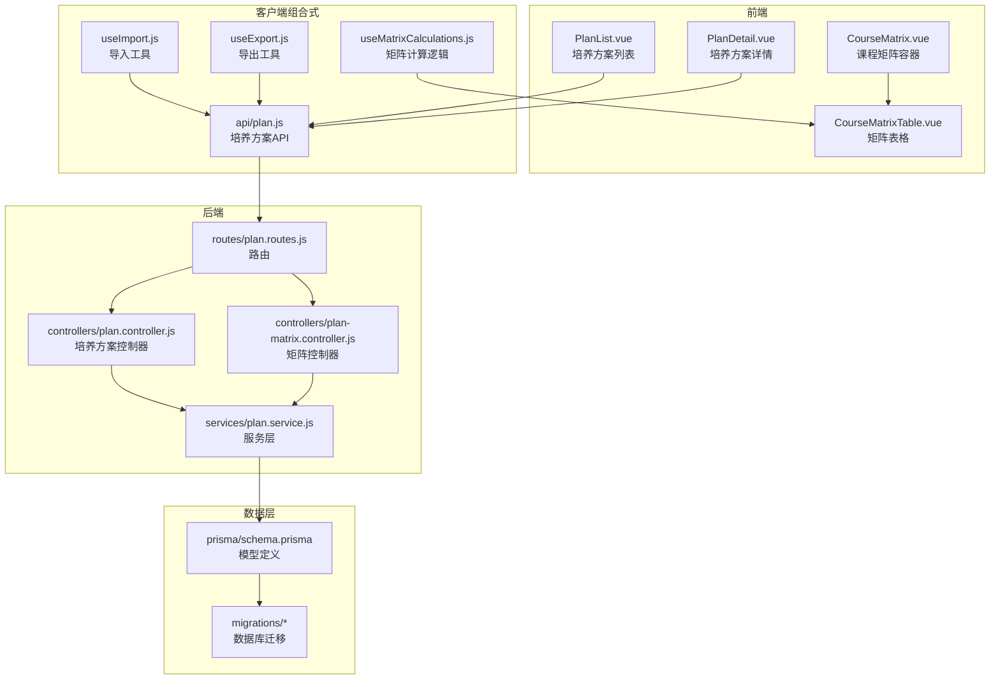
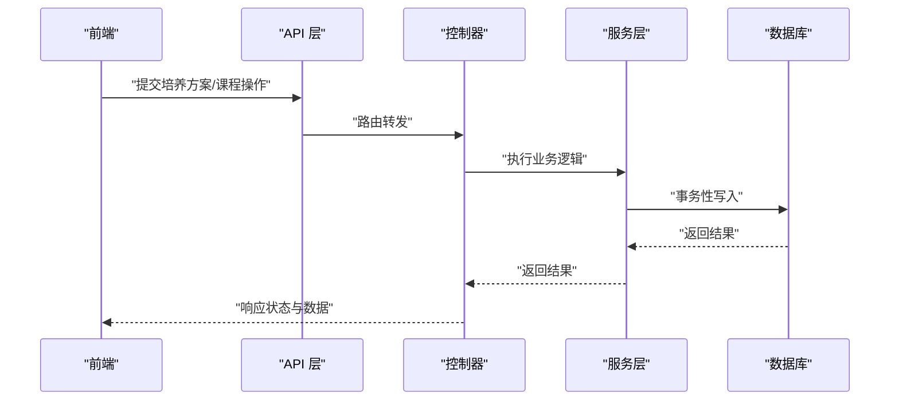
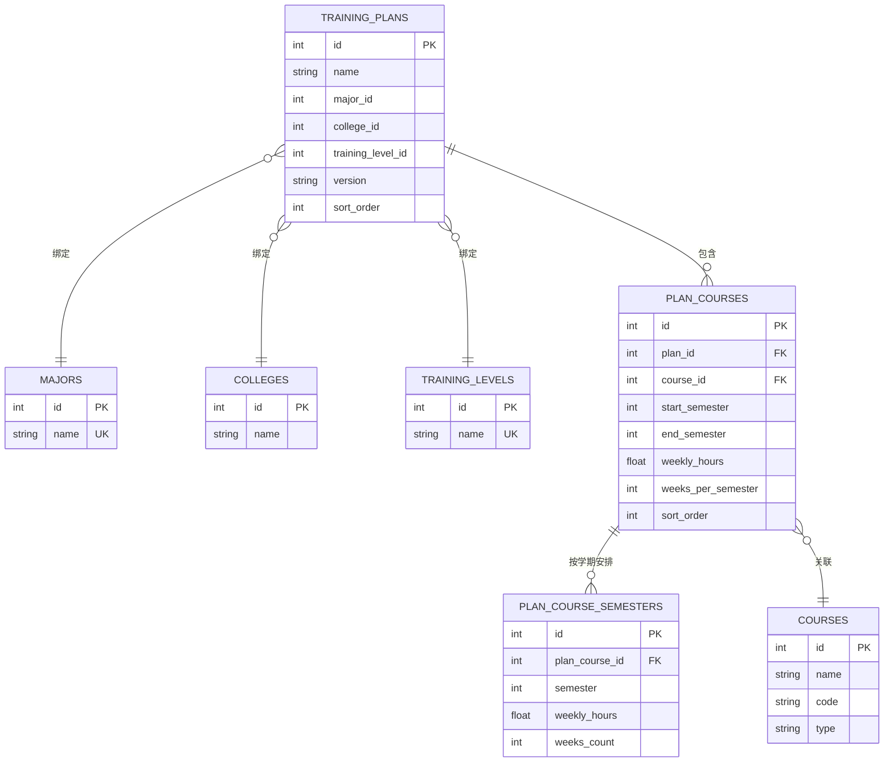
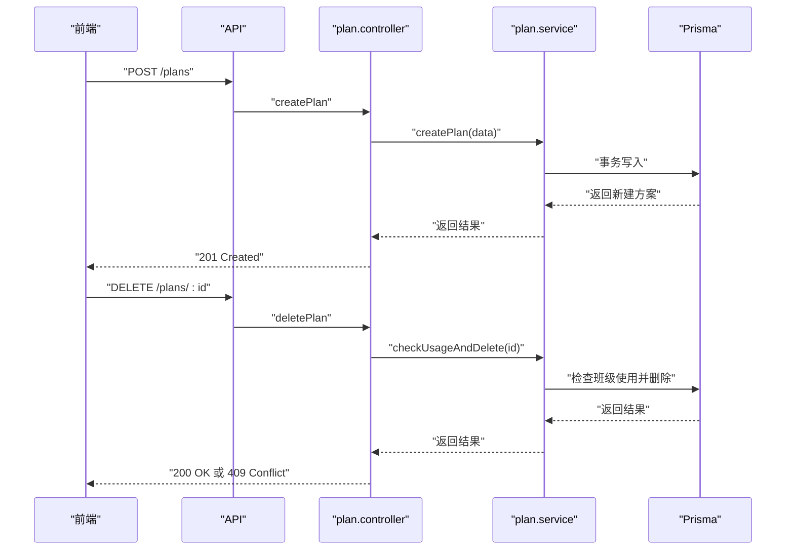
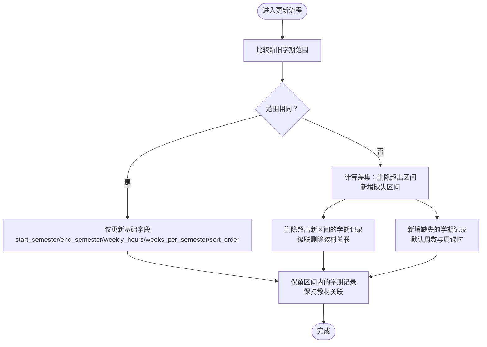
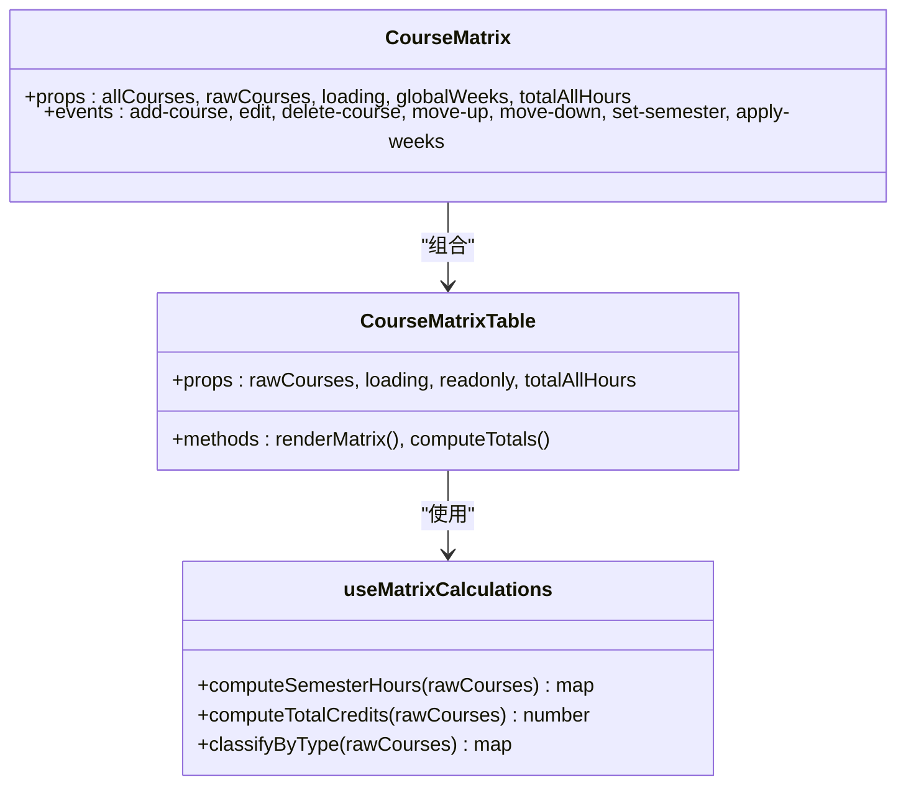
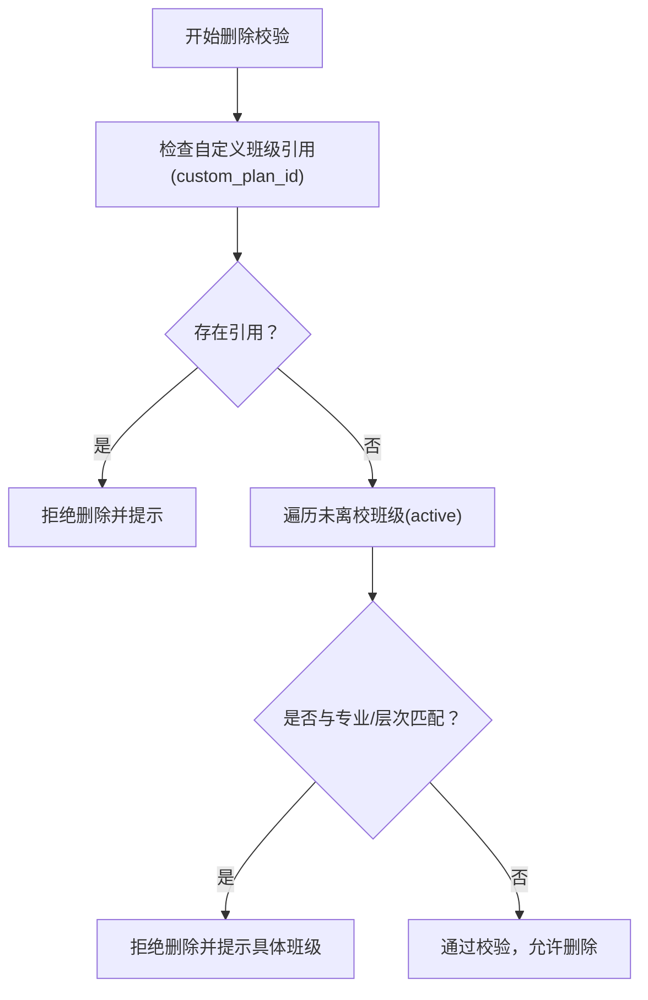
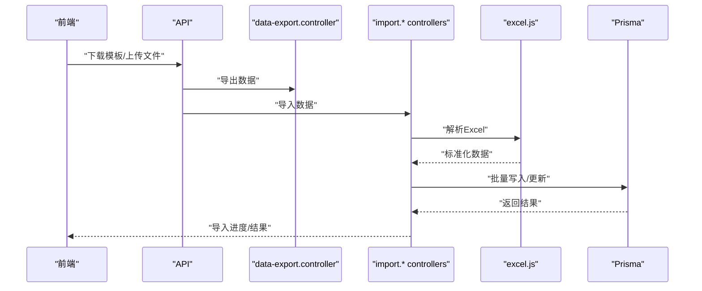
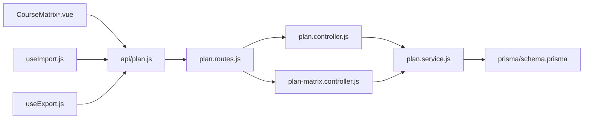

# 培养方案管理

<cite>
**本文引用的文件**
- [server/src/controllers/plan/plan.controller.js](file://server/src/controllers/plan/plan.controller.js)
- [server/src/controllers/plan/plan-matrix.controller.js](file://server/src/controllers/plan/plan-matrix.controller.js)
- [server/src/services/plan.service.js](file://server/src/services/plan.service.js)
- [server/prisma/schema.prisma](file://server/prisma/schema.prisma)
- [server/prisma/migrations/20260611161232_init/migration.sql](file://server/prisma/migrations/20260611161232_init/migration.sql)
- [client/src/views/plan/PlanList.vue](file://client/src/views/plan/PlanList.vue)
- [client/src/views/plan/PlanDetail.vue](file://client/src/views/plan/PlanDetail.vue)
- [client/src/components/CourseMatrix.vue](file://client/src/components/CourseMatrix.vue)
- [client/src/components/CourseMatrixTable.vue](file://client/src/components/CourseMatrixTable.vue)
- [client/src/composables/useMatrixCalculations.js](file://client/src/composables/useMatrixCalculations.js)
- [client/src/api/plan.js](file://client/src/api/plan.js)
- [client/src/composables/useImport.js](file://client/src/composables/useImport.js)
- [client/src/composables/useExport.js](file://client/src/composables/useExport.js)
- [server/src/routes/plan.routes.js](file://server/src/routes/plan.routes.js)
- [server/src/controllers/export/data-export.controller.js](file://server/src/controllers/export/data-export.controller.js)
- [server/src/controllers/import/courses.js](file://server/src/controllers/import/courses.js)
- [server/src/controllers/import/classes.js](file://server/src/controllers/import/classes.js)
- [server/src/controllers/import/teachers.js](file://server/src/controllers/import/teachers.js)
- [server/src/controllers/import/textbooks.js](file://server/src/controllers/import/textbooks.js)
- [server/src/controllers/import/classes.js](file://server/src/controllers/import/classes.js)
- [server/src/utils/excel.js](file://server/src/utils/excel.js)
</cite>

## 目录
1. [简介](#简介)
2. [项目结构](#项目结构)
3. [核心组件](#核心组件)
4. [架构总览](#架构总览)
5. [详细组件分析](#详细组件分析)
6. [依赖分析](#依赖分析)
7. [性能考虑](#性能考虑)
8. [故障排查指南](#故障排查指南)
9. [结论](#结论)
10. [附录](#附录)

## 简介
本文件系统化阐述“培养方案管理”的完整能力与实现细节，覆盖培养方案的创建、编辑、删除与查询；培养方案矩阵的计算逻辑、课程学分统计与必修/选修课程管理；培养方案与专业的关联关系、课程体系完整性检查与学分要求自动验证机制；以及导入导出、批量修改工具与版本管理策略。文档以代码为依据，结合前后端交互流程与数据库模型，帮助技术与非技术读者全面理解系统设计与使用方法。

## 项目结构
围绕培养方案管理的关键目录与文件如下：
- 后端控制器与服务：负责业务处理、数据校验与审计日志
- 数据库模型与迁移：定义培养方案、课程、学期安排等实体关系
- 前端视图与组件：提供培养方案列表、详情、课程矩阵编辑与查询界面
- 导入导出与批量工具：支持 Excel 导入导出与批量修改

**图表来源**
- [client/src/views/plan/PlanList.vue](file://client/src/views/plan/PlanList.vue)
- [client/src/views/plan/PlanDetail.vue](file://client/src/views/plan/PlanDetail.vue)
- [client/src/components/CourseMatrix.vue](file://client/src/components/CourseMatrix.vue)
- [client/src/components/CourseMatrixTable.vue](file://client/src/components/CourseMatrixTable.vue)
- [client/src/composables/useMatrixCalculations.js](file://client/src/composables/useMatrixCalculations.js)
- [client/src/api/plan.js](file://client/src/api/plan.js)
- [client/src/composables/useImport.js](file://client/src/composables/useImport.js)
- [client/src/composables/useExport.js](file://client/src/composables/useExport.js)
- [server/src/routes/plan.routes.js](file://server/src/routes/plan.routes.js)
- [server/src/controllers/plan/plan.controller.js](file://server/src/controllers/plan/plan.controller.js)
- [server/src/controllers/plan/plan-matrix.controller.js](file://server/src/controllers/plan/plan-matrix.controller.js)
- [server/src/services/plan.service.js](file://server/src/services/plan.service.js)
- [server/prisma/schema.prisma](file://server/prisma/schema.prisma)
- [server/prisma/migrations/20260611161232_init/migration.sql](file://server/prisma/migrations/20260611161232_init/migration.sql)

**章节来源**
- [client/src/views/plan/PlanList.vue](file://client/src/views/plan/PlanList.vue)
- [client/src/views/plan/PlanDetail.vue](file://client/src/views/plan/PlanDetail.vue)
- [client/src/components/CourseMatrix.vue](file://client/src/components/CourseMatrix.vue)
- [client/src/components/CourseMatrixTable.vue](file://client/src/components/CourseMatrixTable.vue)
- [client/src/composables/useMatrixCalculations.js](file://client/src/composables/useMatrixCalculations.js)
- [client/src/api/plan.js](file://client/src/api/plan.js)
- [client/src/composables/useImport.js](file://client/src/composables/useImport.js)
- [client/src/composables/useExport.js](file://client/src/composables/useExport.js)
- [server/src/routes/plan.routes.js](file://server/src/routes/plan.routes.js)
- [server/src/controllers/plan/plan.controller.js](file://server/src/controllers/plan/plan.controller.js)
- [server/src/controllers/plan/plan-matrix.controller.js](file://server/src/controllers/plan/plan-matrix.controller.js)
- [server/src/services/plan.service.js](file://server/src/services/plan.service.js)
- [server/prisma/schema.prisma](file://server/prisma/schema.prisma)
- [server/prisma/migrations/20260611161232_init/migration.sql](file://server/prisma/migrations/20260611161232_init/migration.sql)

## 核心组件
- 培养方案控制器：提供创建、更新、删除、查询培养方案的接口，并进行完整性与冲突检查。
- 矩阵控制器：负责培养方案课程的增删改、学期安排的 upsert、课程排序更新与审计日志。
- 服务层：封装业务规则、事务处理、缓存失效与跨表一致性保障。
- 前端矩阵组件：提供课程矩阵的可视化编辑、学期设置、全局周数应用与学分统计。
- 数据模型：通过 Prisma 定义培养方案、课程、学期安排、专业与层次等实体及外键约束。
- 导入导出：基于 Excel 的批量导入与导出，支持课程、班级、教师、教材等多类数据。

**章节来源**
- [server/src/controllers/plan/plan.controller.js](file://server/src/controllers/plan/plan.controller.js)
- [server/src/controllers/plan/plan-matrix.controller.js](file://server/src/controllers/plan/plan-matrix.controller.js)
- [server/src/services/plan.service.js](file://server/src/services/plan.service.js)
- [client/src/components/CourseMatrix.vue](file://client/src/components/CourseMatrix.vue)
- [client/src/components/CourseMatrixTable.vue](file://client/src/components/CourseMatrixTable.vue)
- [server/prisma/schema.prisma](file://server/prisma/schema.prisma)

## 架构总览
系统采用前后端分离架构，前端通过 API 与后端交互，后端通过 Prisma 访问 SQLite 数据库。培养方案管理涉及以下关键流程：
- 培养方案 CRUD：由控制器接收请求，调用服务层执行业务逻辑，写入审计日志。
- 矩阵管理：在课程维度上维护起止学期、周课时、每学期周数等，确保教材关联不被误删。
- 查询与展示：前端通过组合式函数计算矩阵与统计，渲染只读或可编辑的课程矩阵。
- 导入导出：Excel 工具解析模板，后端批量写入数据库，支持错误回滚与幂等处理。

**图表来源**
- [server/src/routes/plan.routes.js](file://server/src/routes/plan.routes.js)
- [server/src/controllers/plan/plan.controller.js](file://server/src/controllers/plan/plan.controller.js)
- [server/src/controllers/plan/plan-matrix.controller.js](file://server/src/controllers/plan/plan-matrix.controller.js)
- [server/src/services/plan.service.js](file://server/src/services/plan.service.js)

## 详细组件分析

### 培养方案实体与关联关系
- 培养方案(training_plans) 关联专业(majors)、学院(colleges)、培养层次(training_levels)，支持空值约束以允许灵活绑定。
- 课程矩阵(plan_courses) 关联课程(courses)与培养方案(training_plans)，维护起止学期、周课时、每学期周数与排序。
- 学期安排(plan_course_semesters) 维护每门课程在各学期的周课时与周数，支持 upsert 与级联删除。
- 教材关联(plan_textbooks) 与学期记录关联，确保更新学期范围时保留区间内教材，避免静默丢失。

**图表来源**
- [server/prisma/schema.prisma](file://server/prisma/schema.prisma)
- [server/prisma/migrations/20260611161232_init/migration.sql](file://server/prisma/migrations/20260611161232_init/migration.sql)

**章节来源**
- [server/prisma/schema.prisma](file://server/prisma/schema.prisma)
- [server/prisma/migrations/20260611161232_init/migration.sql](file://server/prisma/migrations/20260611161232_init/migration.sql)

### 培养方案 CRUD 流程
- 创建：校验必填字段，写入培养方案记录，生成审计日志。
- 更新：支持名称、专业、层次、描述、排序等字段更新。
- 删除：检查是否被班级使用（含自定义与按专业/层次匹配），若被使用则拒绝删除。
- 查询：支持分页、过滤与关联信息加载。

**图表来源**
- [server/src/controllers/plan/plan.controller.js](file://server/src/controllers/plan/plan.controller.js)
- [server/src/services/plan.service.js](file://server/src/services/plan.service.js)
- [server/src/routes/plan.routes.js](file://server/src/routes/plan.routes.js)

**章节来源**
- [server/src/controllers/plan/plan.controller.js](file://server/src/controllers/plan/plan.controller.js)
- [server/src/services/plan.service.js](file://server/src/services/plan.service.js)
- [server/src/routes/plan.routes.js](file://server/src/routes/plan.routes.js)

### 课程矩阵管理与学分统计
- 添加课程：校验课程、起止学期、周课时等必填项，事务内创建课程记录与对应学期记录。
- 更新课程：支持调整起止学期、周课时、每学期周数与排序；仅在学期范围变化时按需增删学期记录，保留区间内教材关联。
- 排序更新：独立更新排序序号，写入审计日志。
- 删除课程：删除课程记录，级联删除学期记录与教材关联。
- upsert 学期：按学期维度设置周课时与周数，确保唯一性与一致性。

**图表来源**
- [server/src/controllers/plan/plan-matrix.controller.js](file://server/src/controllers/plan/plan-matrix.controller.js)

**章节来源**
- [server/src/controllers/plan/plan-matrix.controller.js](file://server/src/controllers/plan/plan-matrix.controller.js)

### 前端矩阵组件与计算逻辑
- CourseMatrix：作为容器承载工具栏与矩阵表格，处理课程增删改、学期设置、全局周数应用与排序移动。
- CourseMatrixTable：渲染只读或可编辑矩阵，显示课程在各学期的周课时与周数，汇总总学时。
- useMatrixCalculations：提供矩阵计算与统计逻辑，包括总学时、学分折算、必修/选修分布等。
- PlanDetail：整合培养方案详情与矩阵展示，支持总计行与合计统计。

**图表来源**
- [client/src/components/CourseMatrix.vue](file://client/src/components/CourseMatrix.vue)
- [client/src/components/CourseMatrixTable.vue](file://client/src/components/CourseMatrixTable.vue)
- [client/src/composables/useMatrixCalculations.js](file://client/src/composables/useMatrixCalculations.js)

**章节来源**
- [client/src/components/CourseMatrix.vue](file://client/src/components/CourseMatrix.vue)
- [client/src/components/CourseMatrixTable.vue](file://client/src/components/CourseMatrixTable.vue)
- [client/src/composables/useMatrixCalculations.js](file://client/src/composables/useMatrixCalculations.js)
- [client/src/views/plan/PlanDetail.vue](file://client/src/views/plan/PlanDetail.vue)

### 课程体系完整性检查与学分要求验证
- 专业/层次匹配：删除前检查是否存在按专业与培养层次匹配且未离校的班级，避免破坏课程体系。
- 自定义班级引用：检查是否存在自定义培养方案引用，防止误删。
- 学期覆盖：通过起止学期与每学期周数计算总学时，用于学分折算与完整性核对。
- 必修/选修分类：根据课程类型字段进行分类统计，辅助完整性与平衡性检查。

**图表来源**
- [server/src/controllers/plan/plan.controller.js](file://server/src/controllers/plan/plan.controller.js)

**章节来源**
- [server/src/controllers/plan/plan.controller.js](file://server/src/controllers/plan/plan.controller.js)

### 导入导出与批量修改
- 导出：提供数据导出控制器，支持按模板格式输出培养方案相关数据。
- 导入：提供课程、班级、教师、教材等导入控制器，基于 Excel 解析与批量写入，支持错误回滚。
- 批量修改：前端通过组合式工具提供导入/导出与批量操作入口，后端提供相应路由与控制器。

**图表来源**
- [server/src/controllers/export/data-export.controller.js](file://server/src/controllers/export/data-export.controller.js)
- [server/src/controllers/import/courses.js](file://server/src/controllers/import/courses.js)
- [server/src/controllers/import/classes.js](file://server/src/controllers/import/classes.js)
- [server/src/controllers/import/teachers.js](file://server/src/controllers/import/teachers.js)
- [server/src/controllers/import/textbooks.js](file://server/src/controllers/import/textbooks.js)
- [server/src/utils/excel.js](file://server/src/utils/excel.js)

**章节来源**
- [server/src/controllers/export/data-export.controller.js](file://server/src/controllers/export/data-export.controller.js)
- [server/src/controllers/import/courses.js](file://server/src/controllers/import/courses.js)
- [server/src/controllers/import/classes.js](file://server/src/controllers/import/classes.js)
- [server/src/controllers/import/teachers.js](file://server/src/controllers/import/teachers.js)
- [server/src/controllers/import/textbooks.js](file://server/src/controllers/import/textbooks.js)
- [server/src/utils/excel.js](file://server/src/utils/excel.js)
- [client/src/composables/useImport.js](file://client/src/composables/useImport.js)
- [client/src/composables/useExport.js](file://client/src/composables/useExport.js)

### 版本管理策略
- 版本字段：培养方案模型包含 version 字段，可用于标识版本号，便于追踪变更历史。
- 审计日志：所有创建、更新、删除操作均写入审计日志模块，记录模块、动作、用户、IP、结果与详情，支持版本回溯与合规审计。
- 建议实践：每次重大修改前增加版本号，配合导出备份与导入恢复，形成闭环。

**章节来源**
- [server/prisma/schema.prisma](file://server/prisma/schema.prisma)
- [server/src/controllers/plan/plan.controller.js](file://server/src/controllers/plan/plan.controller.js)
- [server/src/controllers/plan/plan-matrix.controller.js](file://server/src/controllers/plan/plan-matrix.controller.js)

## 依赖分析
- 控制器依赖服务层：控制器仅负责参数校验与调用服务层，保证业务逻辑集中与可测试性。
- 服务层依赖 Prisma：统一访问数据库，使用事务保证一致性，避免脏读与部分更新。
- 前端依赖组合式工具：通过组合式函数封装矩阵计算与导入导出，提升组件复用性与可维护性。
- 路由到控制器：路由集中定义，控制器按职责拆分，降低耦合度。

**图表来源**
- [server/src/routes/plan.routes.js](file://server/src/routes/plan.routes.js)
- [server/src/controllers/plan/plan.controller.js](file://server/src/controllers/plan/plan.controller.js)
- [server/src/controllers/plan/plan-matrix.controller.js](file://server/src/controllers/plan/plan-matrix.controller.js)
- [server/src/services/plan.service.js](file://server/src/services/plan.service.js)
- [server/prisma/schema.prisma](file://server/prisma/schema.prisma)
- [client/src/api/plan.js](file://client/src/api/plan.js)
- [client/src/components/CourseMatrix.vue](file://client/src/components/CourseMatrix.vue)
- [client/src/composables/useImport.js](file://client/src/composables/useImport.js)
- [client/src/composables/useExport.js](file://client/src/composables/useExport.js)

**章节来源**
- [server/src/routes/plan.routes.js](file://server/src/routes/plan.routes.js)
- [server/src/controllers/plan/plan.controller.js](file://server/src/controllers/plan/plan.controller.js)
- [server/src/controllers/plan/plan-matrix.controller.js](file://server/src/controllers/plan/plan-matrix.controller.js)
- [server/src/services/plan.service.js](file://server/src/services/plan.service.js)
- [server/prisma/schema.prisma](file://server/prisma/schema.prisma)
- [client/src/api/plan.js](file://client/src/api/plan.js)
- [client/src/components/CourseMatrix.vue](file://client/src/components/CourseMatrix.vue)
- [client/src/composables/useImport.js](file://client/src/composables/useImport.js)
- [client/src/composables/useExport.js](file://client/src/composables/useExport.js)

## 性能考虑
- 索引优化：Prisma 模型与迁移中对常用查询字段建立索引，减少查询时间。
- 事务批处理：课程矩阵更新使用事务，避免中间态导致的重复查询与锁竞争。
- 前端懒加载：矩阵表格按需渲染，避免大数据量时的卡顿。
- 批量导入：Excel 解析与数据库写入采用分批处理，结合错误回滚，提高吞吐量与稳定性。

[本节为通用指导，无需列出具体文件来源]

## 故障排查指南
- 删除失败（409 冲突）：检查是否存在自定义班级引用或按专业/层次匹配的未离校班级，解决后再试。
- 更新学期记录异常：确认起止学期范围变化时是否正确增删学期记录，避免教材关联丢失。
- 导入失败：检查 Excel 模板字段与数据类型，确保与后端导入控制器要求一致。
- 审计日志定位：通过审计日志中的模块、动作、用户与详情字段快速定位问题发生点。

**章节来源**
- [server/src/controllers/plan/plan.controller.js](file://server/src/controllers/plan/plan.controller.js)
- [server/src/controllers/plan/plan-matrix.controller.js](file://server/src/controllers/plan/plan-matrix.controller.js)
- [server/src/utils/excel.js](file://server/src/utils/excel.js)

## 结论
培养方案管理模块通过清晰的前后端分工、严谨的数据库模型与事务控制、完善的审计日志与导入导出工具，实现了从创建、编辑、删除到查询的全生命周期管理。课程矩阵的计算逻辑与学分统计为课程体系完整性提供了量化支撑，版本管理与批量工具进一步提升了运维效率与可追溯性。建议在生产环境中结合审计日志与版本号策略，持续完善课程体系的自动化校验与可视化监控。

[本节为总结性内容，无需列出具体文件来源]

## 附录
- 前端视图与组件：PlanList、PlanDetail、CourseMatrix、CourseMatrixTable
- 客户端工具：useMatrixCalculations、useImport、useExport
- 后端控制器与服务：plan.controller、plan-matrix.controller、plan.service
- 数据模型与迁移：schema.prisma、init 迁移
- 导入导出控制器：data-export.controller、import.* controllers

**章节来源**
- [client/src/views/plan/PlanList.vue](file://client/src/views/plan/PlanList.vue)
- [client/src/views/plan/PlanDetail.vue](file://client/src/views/plan/PlanDetail.vue)
- [client/src/components/CourseMatrix.vue](file://client/src/components/CourseMatrix.vue)
- [client/src/components/CourseMatrixTable.vue](file://client/src/components/CourseMatrixTable.vue)
- [client/src/composables/useMatrixCalculations.js](file://client/src/composables/useMatrixCalculations.js)
- [client/src/composables/useImport.js](file://client/src/composables/useImport.js)
- [client/src/composables/useExport.js](file://client/src/composables/useExport.js)
- [server/src/controllers/plan/plan.controller.js](file://server/src/controllers/plan/plan.controller.js)
- [server/src/controllers/plan/plan-matrix.controller.js](file://server/src/controllers/plan/plan-matrix.controller.js)
- [server/src/services/plan.service.js](file://server/src/services/plan.service.js)
- [server/prisma/schema.prisma](file://server/prisma/schema.prisma)
- [server/prisma/migrations/20260611161232_init/migration.sql](file://server/prisma/migrations/20260611161232_init/migration.sql)
- [server/src/controllers/export/data-export.controller.js](file://server/src/controllers/export/data-export.controller.js)
- [server/src/controllers/import/courses.js](file://server/src/controllers/import/courses.js)
- [server/src/controllers/import/classes.js](file://server/src/controllers/import/classes.js)
- [server/src/controllers/import/teachers.js](file://server/src/controllers/import/teachers.js)
- [server/src/controllers/import/textbooks.js](file://server/src/controllers/import/textbooks.js)
- [server/src/utils/excel.js](file://server/src/utils/excel.js)