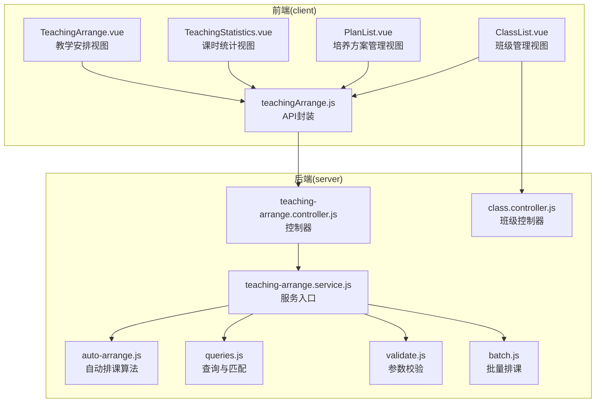
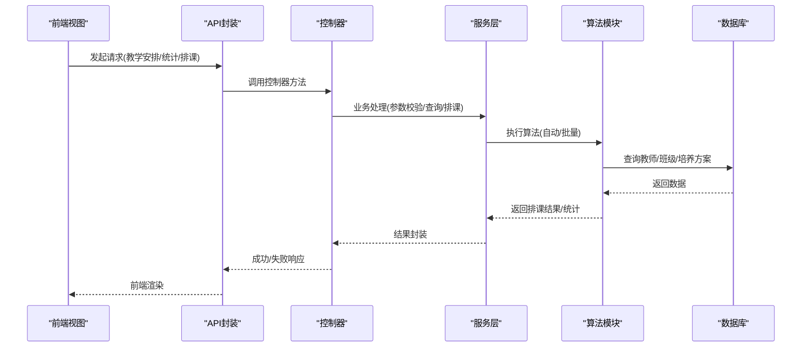
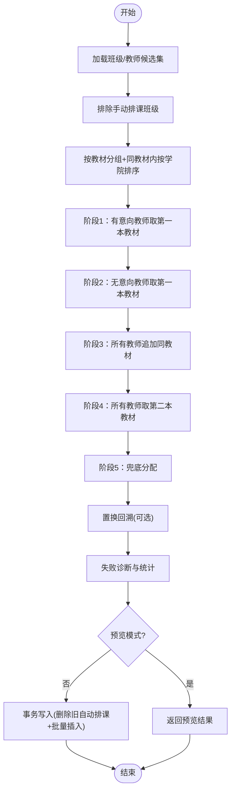
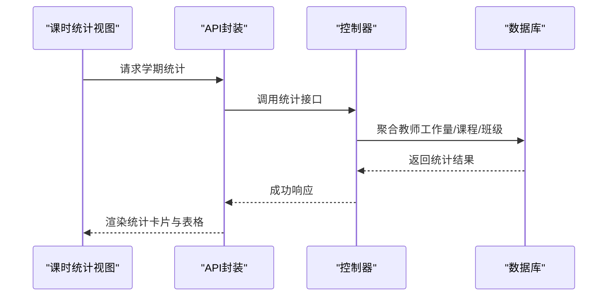
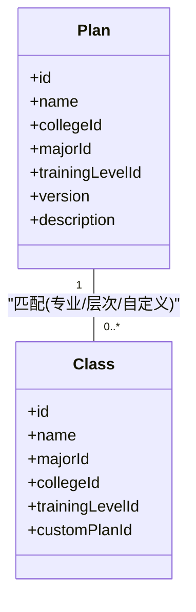
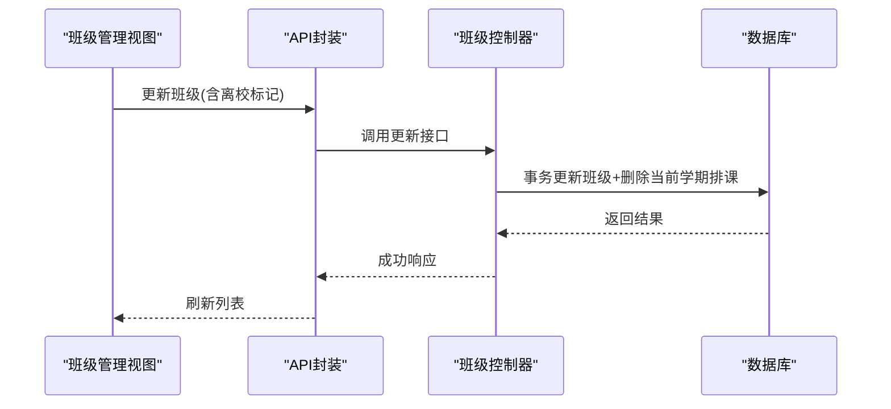
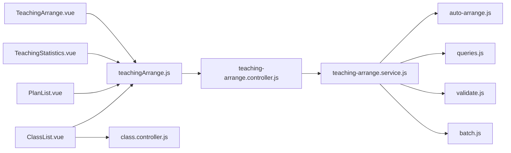

# 教学管理模块

<cite>
**本文档引用的文件**
- [TeachingArrange.vue](file://client/src/views/teaching/TeachingArrange.vue)
- [teachingArrange.js](file://client/src/api/teachingArrange.js)
- [teaching-arrange.controller.js](file://server/src/controllers/teaching-arrange.controller.js)
- [teaching-arrange.service.js](file://server/src/services/teaching-arrange.service.js)
- [auto-arrange.js](file://server/src/services/arrange/auto-arrange.js)
- [queries.js](file://server/src/services/arrange/queries.js)
- [validate.js](file://server/src/services/arrange/validate.js)
- [batch.js](file://server/src/services/arrange/batch.js)
- [TeachingStatistics.vue](file://client/src/views/teaching/TeachingStatistics.vue)
- [TEACHING_ARRANGE_LOGIC.md](file://docs/TEACHING_ARRANGE_LOGIC.md)
- [AUTO_ARRANGE_LOGIC_V2.md](file://docs/AUTO_ARRANGE_LOGIC_V2.md)
- [PlanList.vue](file://client/src/views/plan/PlanList.vue)
- [class.controller.js](file://server/src/controllers/class.controller.js)
- [ClassList.vue](file://client/src/views/class/ClassList.vue)
</cite>

## 目录
1. [简介](#简介)
2. [项目结构](#项目结构)
3. [核心组件](#核心组件)
4. [架构概览](#架构概览)
5. [详细组件分析](#详细组件分析)
6. [依赖分析](#依赖分析)
7. [性能考量](#性能考量)
8. [故障排查指南](#故障排查指南)
9. [结论](#结论)
10. [附录](#附录)

## 简介
本文件面向教学管理模块，围绕培养方案管理、班级管理、教学安排与课时统计等核心业务，系统阐述智能排课算法的实现原理、冲突检测机制与时间安排优化策略，涵盖培养方案矩阵计算、班级与培养方案的匹配逻辑、教师授课能力评估等关键功能，并提供教学安排的可视化展示、实时更新机制与异常处理策略。

## 项目结构
教学管理模块由前端视图与后端服务两大部分组成：
- 前端负责用户界面、交互控制与数据展示，包括教学安排、课时统计、培养方案管理、班级管理等页面。
- 后端提供REST接口、业务逻辑与数据持久化，包括自动排课、批量排课、教师与班级查询、课时统计等服务。

**图表来源**
- [TeachingArrange.vue:1-800](file://client/src/views/teaching/TeachingArrange.vue#L1-L800)
- [teachingArrange.js:1-25](file://client/src/api/teachingArrange.js#L1-L25)
- [teaching-arrange.controller.js:1-679](file://server/src/controllers/teaching-arrange.controller.js#L1-L679)
- [teaching-arrange.service.js:1-5](file://server/src/services/teaching-arrange.service.js#L1-L5)
- [auto-arrange.js:1-800](file://server/src/services/arrange/auto-arrange.js#L1-L800)
- [queries.js:1-475](file://server/src/services/arrange/queries.js#L1-L475)
- [validate.js:1-25](file://server/src/services/arrange/validate.js#L1-L25)
- [batch.js:1-180](file://server/src/services/arrange/batch.js#L1-L180)
- [class.controller.js:1-464](file://server/src/controllers/class.controller.js#L1-L464)

**章节来源**
- [TeachingArrange.vue:1-800](file://client/src/views/teaching/TeachingArrange.vue#L1-L800)
- [teachingArrange.js:1-25](file://client/src/api/teachingArrange.js#L1-L25)
- [teaching-arrange.controller.js:1-679](file://server/src/controllers/teaching-arrange.controller.js#L1-L679)
- [teaching-arrange.service.js:1-5](file://server/src/services/teaching-arrange.service.js#L1-L5)
- [auto-arrange.js:1-800](file://server/src/services/arrange/auto-arrange.js#L1-L800)
- [queries.js:1-475](file://server/src/services/arrange/queries.js#L1-L475)
- [validate.js:1-25](file://server/src/services/arrange/validate.js#L1-L25)
- [batch.js:1-180](file://server/src/services/arrange/batch.js#L1-L180)
- [class.controller.js:1-464](file://server/src/controllers/class.controller.js#L1-L464)

## 核心组件
- 教学安排视图：提供课程选择、课时设置、班级筛选、教师选择、自动/批量排课、预览与执行等功能。
- 课时统计视图：按学期聚合教师工作量、课程分布、任课学院与层次等维度，支持导出。
- 培养方案管理：维护培养方案、关联专业/层次、版本与描述，支持排序与编辑。
- 班级管理：维护班级基础信息、学制、入学年份、培养层次、专业、学院、自定义培养方案等，支持导入导出与批量设置。
- 后端控制器与服务：提供排课、统计、查询、校验、批量处理等接口与业务逻辑。

**章节来源**
- [TeachingArrange.vue:1-800](file://client/src/views/teaching/TeachingArrange.vue#L1-L800)
- [TeachingStatistics.vue:1-392](file://client/src/views/teaching/TeachingStatistics.vue#L1-L392)
- [PlanList.vue:1-356](file://client/src/views/plan/PlanList.vue#L1-L356)
- [ClassList.vue:1-610](file://client/src/views/class/ClassList.vue#L1-L610)
- [teaching-arrange.controller.js:1-679](file://server/src/controllers/teaching-arrange.controller.js#L1-L679)
- [teaching-arrange.service.js:1-5](file://server/src/services/teaching-arrange.service.js#L1-L5)

## 架构概览
教学管理模块采用前后端分离架构，前端通过API封装调用后端控制器，控制器协调服务层执行业务逻辑，服务层调用查询与算法模块完成数据检索与智能排课，最终通过审计日志与响应封装返回结果。

**图表来源**
- [teachingArrange.js:1-25](file://client/src/api/teachingArrange.js#L1-L25)
- [teaching-arrange.controller.js:1-679](file://server/src/controllers/teaching-arrange.controller.js#L1-L679)
- [teaching-arrange.service.js:1-5](file://server/src/services/teaching-arrange.service.js#L1-L5)
- [auto-arrange.js:1-800](file://server/src/services/arrange/auto-arrange.js#L1-L800)
- [queries.js:1-475](file://server/src/services/arrange/queries.js#L1-L475)

## 详细组件分析

### 教学安排与智能排课
- 课程与学期选择：前端提供课程与学期选择，后端据此查询班级与教师候选集。
- 教师筛选与容量约束：按人员类型、默认周课时上限、已排课时与课程已排课时计算剩余容量，严格校验容量与本课程上限。
- 匹配评分与偏好：综合学院/层次/教材匹配与教材内聚度，采用评分+负载均衡排序，优先满足意向约束。
- 五阶段排课策略：有/无意向教师先取第一本教材，随后同教材追加、第二本教材、兜底分配；最后进行置换回溯提升分配率。
- 预览与执行：预览模式不写库，仅返回诊断与统计；正式模式在事务中删除旧自动排课并批量写入新记录。
- 失败诊断：对未分配班级输出原因（无教师、容量满、偏好不匹配等）。

**图表来源**
- [auto-arrange.js:628-800](file://server/src/services/arrange/auto-arrange.js#L628-L800)
- [queries.js:39-58](file://server/src/services/arrange/queries.js#L39-L58)
- [TEACHING_ARRANGE_LOGIC.md:489-545](file://docs/TEACHING_ARRANGE_LOGIC.md#L489-L545)

**章节来源**
- [TeachingArrange.vue:1-800](file://client/src/views/teaching/TeachingArrange.vue#L1-L800)
- [teaching-arrange.controller.js:296-368](file://server/src/controllers/teaching-arrange.controller.js#L296-L368)
- [auto-arrange.js:1-800](file://server/src/services/arrange/auto-arrange.js#L1-L800)
- [queries.js:1-475](file://server/src/services/arrange/queries.js#L1-L475)
- [validate.js:1-25](file://server/src/services/arrange/validate.js#L1-L25)
- [AUTO_ARRANGE_LOGIC_V2.md:1-632](file://docs/AUTO_ARRANGE_LOGIC_V2.md#L1-L632)
- [TEACHING_ARRANGE_LOGIC.md:1-545](file://docs/TEACHING_ARRANGE_LOGIC.md#L1-L545)

### 课时统计与可视化
- 按学期聚合：统计教师总周课时、班级数、任教科目、归属学院、任课层次等。
- 前端展示：支持姓名、类别、科目、归属/任课学院、层次等筛选，展开查看课程与班级明细。
- 导出功能：支持导出Excel报表，便于教学管理部门审核与分析。

**图表来源**
- [TeachingStatistics.vue:1-392](file://client/src/views/teaching/TeachingStatistics.vue#L1-L392)
- [teaching-arrange.controller.js:405-552](file://server/src/controllers/teaching-arrange.controller.js#L405-L552)

**章节来源**
- [TeachingStatistics.vue:1-392](file://client/src/views/teaching/TeachingStatistics.vue#L1-L392)
- [teaching-arrange.controller.js:405-552](file://server/src/controllers/teaching-arrange.controller.js#L405-L552)

### 培养方案管理
- 方案维护：支持按专业或按层次关联，设置版本与描述，支持排序调整。
- 关联与匹配：班级与培养方案的匹配遵循“自定义方案 > 专业 > 层次”的优先级，确保唯一最佳方案。
- 交叉匹配提示：当专业与层次同时匹配时给出警告，提醒管理员检查配置。

**图表来源**
- [PlanList.vue:1-356](file://client/src/views/plan/PlanList.vue#L1-L356)
- [class.controller.js:95-118](file://server/src/controllers/class.controller.js#L95-L118)

**章节来源**
- [PlanList.vue:1-356](file://client/src/views/plan/PlanList.vue#L1-L356)
- [class.controller.js:1-464](file://server/src/controllers/class.controller.js#L1-L464)

### 班级管理
- 基础信息：维护班级名称、入学年份、学制、专业、学院、培养层次、学生人数、自定义培养方案、离校状态等。
- 动态状态：根据当前学期计算在读/毕业/离校状态，支持批量设置与导入导出。
- 级联处理：更新班级时若标记离校，级联删除当前学期排课记录，释放教师容量。

**图表来源**
- [ClassList.vue:1-610](file://client/src/views/class/ClassList.vue#L1-L610)
- [class.controller.js:316-418](file://server/src/controllers/class.controller.js#L316-L418)

**章节来源**
- [ClassList.vue:1-610](file://client/src/views/class/ClassList.vue#L1-L610)
- [class.controller.js:1-464](file://server/src/controllers/class.controller.js#L1-L464)

### 批量排课与并发控制
- 顺序执行：按课程优先级顺序处理，避免并发冲突；支持预览模式跨课程累计教材负载。
- 超时保护：批量排课设置超时上限，防止长时间阻塞。
- 结果汇总：返回每门课程的分配数、未分配数、警告与错误统计。

**章节来源**
- [batch.js:1-180](file://server/src/services/arrange/batch.js#L1-L180)
- [teaching-arrange.controller.js:615-678](file://server/src/controllers/teaching-arrange.controller.js#L615-L678)

## 依赖分析
- 前端依赖后端API封装，控制器负责参数校验与响应封装，服务层协调算法与查询模块。
- 排课算法依赖查询模块提供的教师/班级/培养方案信息，结合容量约束与匹配评分进行分配。
- 班级控制器与排课逻辑耦合：班级状态变化（如离校）会级联删除当前学期排课记录，影响教师容量。

**图表来源**
- [teachingArrange.js:1-25](file://client/src/api/teachingArrange.js#L1-L25)
- [teaching-arrange.controller.js:1-679](file://server/src/controllers/teaching-arrange.controller.js#L1-L679)
- [teaching-arrange.service.js:1-5](file://server/src/services/teaching-arrange.service.js#L1-L5)
- [auto-arrange.js:1-800](file://server/src/services/arrange/auto-arrange.js#L1-L800)
- [queries.js:1-475](file://server/src/services/arrange/queries.js#L1-L475)
- [validate.js:1-25](file://server/src/services/arrange/validate.js#L1-L25)
- [batch.js:1-180](file://server/src/services/arrange/batch.js#L1-L180)
- [class.controller.js:1-464](file://server/src/controllers/class.controller.js#L1-L464)

**章节来源**
- [teachingArrange.js:1-25](file://client/src/api/teachingArrange.js#L1-L25)
- [teaching-arrange.controller.js:1-679](file://server/src/controllers/teaching-arrange.controller.js#L1-L679)
- [teaching-arrange.service.js:1-5](file://server/src/services/teaching-arrange.service.js#L1-L5)
- [auto-arrange.js:1-800](file://server/src/services/arrange/auto-arrange.js#L1-L800)
- [queries.js:1-475](file://server/src/services/arrange/queries.js#L1-L475)
- [validate.js:1-25](file://server/src/services/arrange/validate.js#L1-L25)
- [batch.js:1-180](file://server/src/services/arrange/batch.js#L1-L180)
- [class.controller.js:1-464](file://server/src/controllers/class.controller.js#L1-L464)

## 性能考量
- 查询优化：合并多次查询为单次批量查询，减少N+1问题；对教师教材、学院与层次进行预加载与缓存。
- 排课优化：按教材分组与同教材内按学院排序，减少跨组调度成本；阶段化处理提升命中率。
- 并发控制：课程级与学期级排课锁，防止并发冲突；批量排课超时保护。
- 前端优化：表格懒加载、筛选联动、防抖搜索，降低渲染压力。

[本节为通用指导，无需具体文件引用]

## 故障排查指南
- 未分配班级诊断：检查无教师、容量满、偏好不匹配、教材不匹配等常见原因。
- 教师超负荷：关注工作量预警与统计视图，合理调整标准/最大课时与人工干预。
- 手动排课冲突：手动排课不被覆盖，但其教材与课时计入教师状态，避免重复分配。
- 批量排课异常：单门课程失败不影响整体流程，查看错误统计与课程结果详情。
- 并发与锁：若提示“正在排课中”，等待锁释放或检查部署模式（单进程锁）。

**章节来源**
- [teaching-arrange.controller.js:296-368](file://server/src/controllers/teaching-arrange.controller.js#L296-L368)
- [auto-arrange.js:198-267](file://server/src/services/arrange/auto-arrange.js#L198-L267)
- [batch.js:106-155](file://server/src/services/arrange/batch.js#L106-L155)

## 结论
教学管理模块通过清晰的前后端分工与严谨的服务层设计，实现了培养方案驱动的班级筛选、教师偏好与教材内聚的智能排课、以及全面的课时统计与可视化展示。算法层面采用阶段化与置换回溯策略，兼顾效率与公平；系统层面提供预览、批量与并发控制等保障机制，满足教学管理的复杂需求。

[本节为总结性内容，无需具体文件引用]

## 附录
- 接口与权限：详见教学安排API清单与权限说明。
- 最佳实践：建议先预览后执行、优先处理重要课程、定期重置自动排课、关注教师工作量分布。

**章节来源**
- [TEACHING_ARRANGE_LOGIC.md:472-486](file://docs/TEACHING_ARRANGE_LOGIC.md#L472-L486)