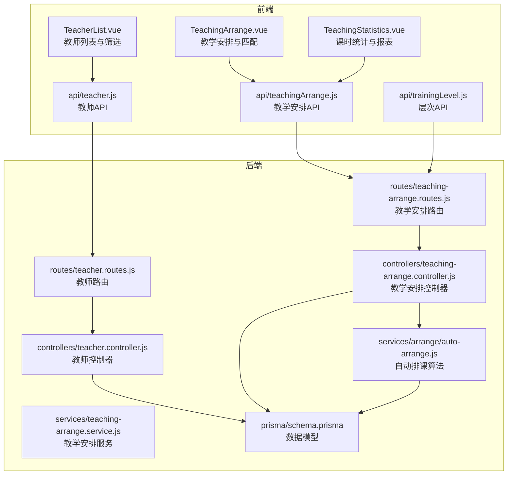
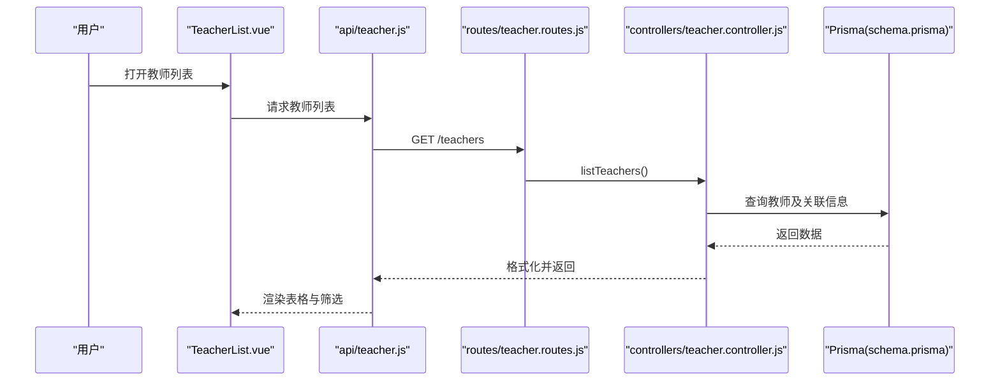
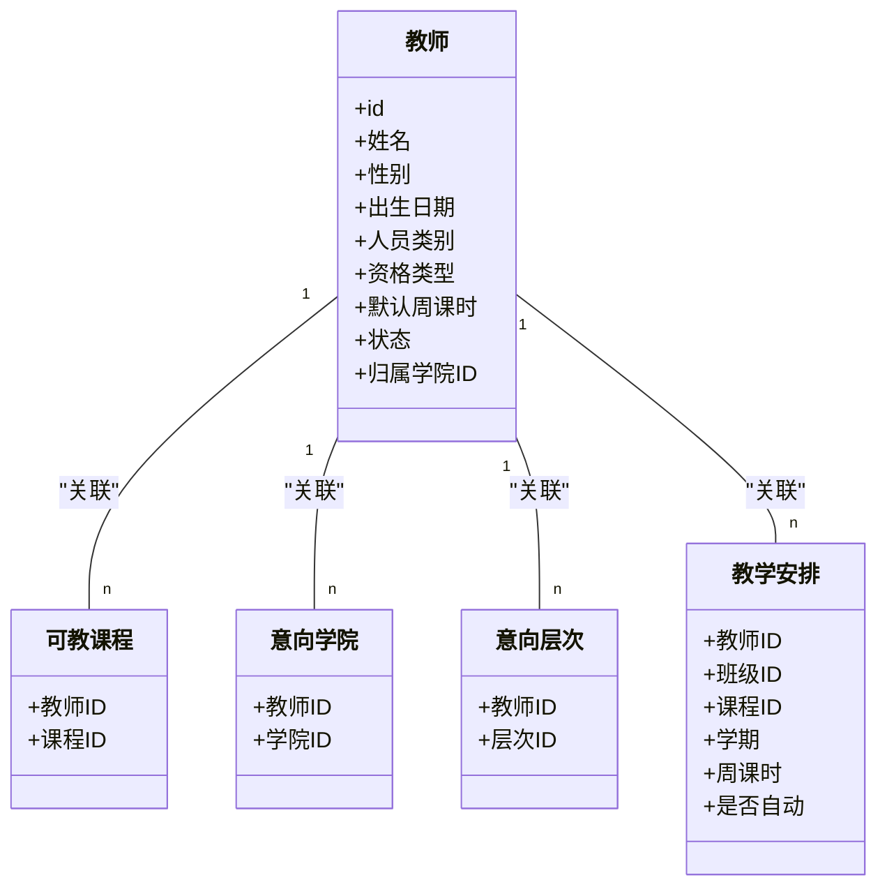
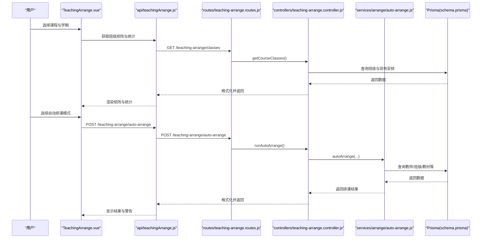
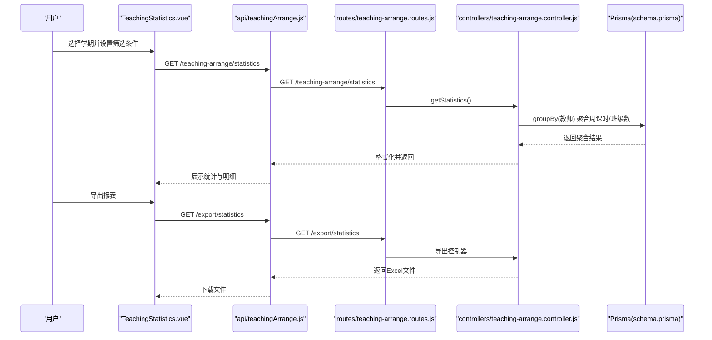
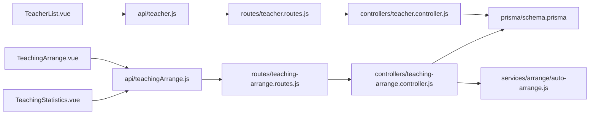

# 教师管理

<cite>
**本文引用的文件**
- [client/src/views/teaching/TeacherList.vue](file://client/src/views/teaching/TeacherList.vue)
- [client/src/api/teacher.js](file://client/src/api/teacher.js)
- [server/src/controllers/teacher.controller.js](file://server/src/controllers/teacher.controller.js)
- [server/src/routes/teacher.routes.js](file://server/src/routes/teacher.routes.js)
- [server/prisma/schema.prisma](file://server/prisma/schema.prisma)
- [client/src/views/teaching/TeachingArrange.vue](file://client/src/views/teaching/TeachingArrange.vue)
- [client/src/views/teaching/TeachingStatistics.vue](file://client/src/views/teaching/TeachingStatistics.vue)
- [client/src/api/teachingArrange.js](file://client/src/api/teachingArrange.js)
- [server/src/controllers/teaching-arrange.controller.js](file://server/src/controllers/teaching-arrange.controller.js)
- [server/src/services/teaching-arrange.service.js](file://server/src/services/teaching-arrange.service.js)
- [server/src/services/arrange/auto-arrange.js](file://server/src/services/arrange/auto-arrange.js)
- [client/src/api/trainingLevel.js](file://client/src/api/trainingLevel.js)
</cite>

## 目录
1. [简介](#简介)
2. [项目结构](#项目结构)
3. [核心组件](#核心组件)
4. [架构总览](#架构总览)
5. [详细组件分析](#详细组件分析)
6. [依赖分析](#依赖分析)
7. [性能考虑](#性能考虑)
8. [故障排查指南](#故障排查指南)
9. [结论](#结论)
10. [附录](#附录)

## 简介
本文件面向“教师管理”主题，系统性梳理教师信息维护、教学能力评估、授课历史记录管理、教师与课程匹配关系、教学工作量统计、教师空闲时间查询、资质与培训记录维护、教学评价体系以及教师资源调度优化等能力。结合前端视图与后端控制器/服务层，给出数据流、处理逻辑与可视化呈现，并提供查询筛选、批量操作与报表导出的实践路径。

## 项目结构
教师管理相关模块主要分布在前后端两部分：
- 前端
  - 教师列表与筛选：client/src/views/teaching/TeacherList.vue
  - 教学安排与统计：client/src/views/teaching/TeachingArrange.vue、client/src/views/teaching/TeachingStatistics.vue
  - API 封装：client/src/api/teacher.js、client/src/api/teachingArrange.js、client/src/api/trainingLevel.js
- 后端
  - 教师路由与控制器：server/src/routes/teacher.routes.js、server/src/controllers/teacher.controller.js
  - 教学安排路由与控制器：server/src/routes/teaching-arrange.routes.js、server/src/controllers/teaching-arrange.controller.js
  - 教学安排服务：server/src/services/teaching-arrange.service.js、server/src/services/arrange/auto-arrange.js
  - 数据模型：server/prisma/schema.prisma

图表来源
- [client/src/views/teaching/TeacherList.vue:1-650](file://client/src/views/teaching/TeacherList.vue#L1-L650)
- [client/src/views/teaching/TeachingArrange.vue:1-800](file://client/src/views/teaching/TeachingArrange.vue#L1-L800)
- [client/src/views/teaching/TeachingStatistics.vue:1-392](file://client/src/views/teaching/TeachingStatistics.vue#L1-L392)
- [client/src/api/teacher.js:1-10](file://client/src/api/teacher.js#L1-L10)
- [client/src/api/teachingArrange.js:1-25](file://client/src/api/teachingArrange.js#L1-L25)
- [client/src/api/trainingLevel.js:1-7](file://client/src/api/trainingLevel.js#L1-L7)
- [server/src/routes/teacher.routes.js:1-62](file://server/src/routes/teacher.routes.js#L1-L62)
- [server/src/controllers/teacher.controller.js:1-395](file://server/src/controllers/teacher.controller.js#L1-L395)
- [server/src/routes/teaching-arrange.routes.js:1-200](file://server/src/routes/teaching-arrange.routes.js#L1-L200)
- [server/src/controllers/teaching-arrange.controller.js:1-679](file://server/src/controllers/teaching-arrange.controller.js#L1-L679)
- [server/src/services/teaching-arrange.service.js:1-5](file://server/src/services/teaching-arrange.service.js#L1-L5)
- [server/src/services/arrange/auto-arrange.js:1-1356](file://server/src/services/arrange/auto-arrange.js#L1-L1356)
- [server/prisma/schema.prisma:229-308](file://server/prisma/schema.prisma#L229-L308)

章节来源
- [client/src/views/teaching/TeacherList.vue:1-650](file://client/src/views/teaching/TeacherList.vue#L1-L650)
- [client/src/views/teaching/TeachingArrange.vue:1-800](file://client/src/views/teaching/TeachingArrange.vue#L1-L800)
- [client/src/views/teaching/TeachingStatistics.vue:1-392](file://client/src/views/teaching/TeachingStatistics.vue#L1-L392)
- [client/src/api/teacher.js:1-10](file://client/src/api/teacher.js#L1-L10)
- [client/src/api/teachingArrange.js:1-25](file://client/src/api/teachingArrange.js#L1-L25)
- [client/src/api/trainingLevel.js:1-7](file://client/src/api/trainingLevel.js#L1-L7)
- [server/src/routes/teacher.routes.js:1-62](file://server/src/routes/teacher.routes.js#L1-L62)
- [server/src/controllers/teacher.controller.js:1-395](file://server/src/controllers/teacher.controller.js#L1-L395)
- [server/src/routes/teaching-arrange.routes.js:1-200](file://server/src/routes/teaching-arrange.routes.js#L1-L200)
- [server/src/controllers/teaching-arrange.controller.js:1-679](file://server/src/controllers/teaching-arrange.controller.js#L1-L679)
- [server/src/services/teaching-arrange.service.js:1-5](file://server/src/services/teaching-arrange.service.js#L1-L5)
- [server/src/services/arrange/auto-arrange.js:1-1356](file://server/src/services/arrange/auto-arrange.js#L1-L1356)
- [server/prisma/schema.prisma:229-308](file://server/prisma/schema.prisma#L229-L308)

## 核心组件
- 教师信息维护
  - 前端：教师列表视图支持新增、编辑、删除、状态切换、导入/导出、筛选（姓名、人员类别、学科、意向学院/层次、归属学院、状态）。
  - 后端：提供教师列表、创建、更新、删除、批量修改特定周课时、切换状态接口，包含关联课程、学院、层次与教学安排次数统计。
- 教学能力评估与匹配
  - 教师具备“可教课程”、“意向学院”、“意向层次”、“特定周课时”等维度，用于教学安排时的能力匹配与容量控制。
  - 自动排课算法综合考虑：学院/层次匹配、教材内聚度、教师容量（系统设置+特定周课时）、已分配教材数量分级惩罚等。
- 授课历史记录管理
  - 教学安排记录包含教师、班级、课程、学期、周课时、是否自动安排等，支持手动安排、删除安排、重置自动安排。
  - 课时统计按教师聚合，展示总周课时、班级数、课程明细等。
- 教学工作量统计与报表
  - 提供按学期的教师工作量统计，支持筛选与导出。
- 教师空闲时间查询
  - 通过“特定周课时”与系统课时设置共同决定教师容量；自动排课在容量范围内进行分配。
- 资质与培训记录
  - 教师模型包含“教师资格类型”，前端表单支持录入；层次信息通过独立模块维护。
- 教学评价体系
  - 当前系统未内置评价打分字段；可在教师模型扩展或通过外部系统对接实现。
- 教师资源调度优化
  - 自动排课采用评分函数与阶段化策略，优先满足匹配度与教材内聚，同时控制教师教材数量上限，避免分散。

章节来源
- [client/src/views/teaching/TeacherList.vue:1-650](file://client/src/views/teaching/TeacherList.vue#L1-L650)
- [server/src/controllers/teacher.controller.js:1-395](file://server/src/controllers/teacher.controller.js#L1-L395)
- [server/src/controllers/teaching-arrange.controller.js:1-679](file://server/src/controllers/teaching-arrange.controller.js#L1-L679)
- [server/src/services/arrange/auto-arrange.js:1-1356](file://server/src/services/arrange/auto-arrange.js#L1-L1356)
- [server/prisma/schema.prisma:229-308](file://server/prisma/schema.prisma#L229-L308)

## 架构总览
教师管理从前端视图到后端控制器与服务层，形成清晰的数据流与职责分离：
- 前端视图负责交互与筛选，调用封装好的 API。
- 路由层进行权限与参数校验，转发到控制器。
- 控制器协调 Prisma 数据访问与审计日志，返回标准化响应。
- 服务层实现复杂业务逻辑（如自动排课、批量排课、统计聚合）。

图表来源
- [client/src/views/teaching/TeacherList.vue:1-650](file://client/src/views/teaching/TeacherList.vue#L1-L650)
- [client/src/api/teacher.js:1-10](file://client/src/api/teacher.js#L1-L10)
- [server/src/routes/teacher.routes.js:1-62](file://server/src/routes/teacher.routes.js#L1-L62)
- [server/src/controllers/teacher.controller.js:1-395](file://server/src/controllers/teacher.controller.js#L1-L395)
- [server/prisma/schema.prisma:229-308](file://server/prisma/schema.prisma#L229-L308)

## 详细组件分析

### 教师信息维护与筛选
- 功能要点
  - 新增/编辑：姓名、性别、出生年月、归属学院、人员类别、状态、教师资格类型、可教课程、意向学院/层次、特定周课时。
  - 状态切换：启用/禁用，后端校验状态值与存在性。
  - 导入/导出：支持 Excel 导入与模板下载；批量更新特定周课时。
  - 筛选联动：意向学院与意向层次双向联动，按层级过滤可选学院，按学院过滤可选层次。
- 数据模型
  - 教师主表包含人员类别、状态、默认周课时、归属学院等；通过关联表维护“可教课程”“意向学院”“意向层次”。

图表来源
- [server/prisma/schema.prisma:229-308](file://server/prisma/schema.prisma#L229-L308)

章节来源
- [client/src/views/teaching/TeacherList.vue:1-650](file://client/src/views/teaching/TeacherList.vue#L1-L650)
- [client/src/api/teacher.js:1-10](file://client/src/api/teacher.js#L1-L10)
- [server/src/controllers/teacher.controller.js:1-395](file://server/src/controllers/teacher.controller.js#L1-L395)
- [server/src/routes/teacher.routes.js:1-62](file://server/src/routes/teacher.routes.js#L1-L62)
- [server/prisma/schema.prisma:229-308](file://server/prisma/schema.prisma#L229-L308)

### 教学安排与教师匹配
- 功能要点
  - 课程选择后展示班级矩阵与统计摘要（总班级、已安排、总课时、剩余课时）。
  - 教师选择弹窗展示教师的人员类别、当前总课时、班级数、学科、意向/实际任课学院与层次、已用教材、特定周课时。
  - 手动安排：校验教师存在、状态、可教课程，支持保留或推导周课时。
  - 自动排课：按模式（标准/全量）与课时设置评分匹配，考虑容量、教材内聚、层次/学院偏好。
  - 批量排课：对所有课程执行相同逻辑，支持预览与执行。
  - 重置自动安排：仅删除自动安排记录。
- 匹配与评分
  - 评分函数综合：学院匹配、层次匹配、已分配教材奖励、固有教材匹配、新增教材惩罚、教材数量分级惩罚。
  - 容量控制：系统设置标准/最大值，叠加教师特定周课时上限；自动排课在容量范围内分配。

图表来源
- [client/src/views/teaching/TeachingArrange.vue:1-800](file://client/src/views/teaching/TeachingArrange.vue#L1-L800)
- [client/src/api/teachingArrange.js:1-25](file://client/src/api/teachingArrange.js#L1-L25)
- [server/src/routes/teaching-arrange.routes.js:1-200](file://server/src/routes/teaching-arrange.routes.js#L1-L200)
- [server/src/controllers/teaching-arrange.controller.js:1-679](file://server/src/controllers/teaching-arrange.controller.js#L1-L679)
- [server/src/services/arrange/auto-arrange.js:1-1356](file://server/src/services/arrange/auto-arrange.js#L1-L1356)
- [server/prisma/schema.prisma:229-308](file://server/prisma/schema.prisma#L229-L308)

章节来源
- [client/src/views/teaching/TeachingArrange.vue:1-800](file://client/src/views/teaching/TeachingArrange.vue#L1-L800)
- [client/src/api/teachingArrange.js:1-25](file://client/src/api/teachingArrange.js#L1-L25)
- [server/src/controllers/teaching-arrange.controller.js:1-679](file://server/src/controllers/teaching-arrange.controller.js#L1-L679)
- [server/src/services/arrange/auto-arrange.js:1-1356](file://server/src/services/arrange/auto-arrange.js#L1-L1356)

### 教学工作量统计与报表
- 功能要点
  - 按学期聚合教师周课时、班级数，支持按姓名、人员类别、科目、归属学院、任课层次、任课学院筛选。
  - 支持导出为 Excel 报表，包含筛选条件。
- 数据来源
  - 教学安排表按教师分组统计，补充教师基础信息与实际任课层次/学院。

图表来源
- [client/src/views/teaching/TeachingStatistics.vue:1-392](file://client/src/views/teaching/TeachingStatistics.vue#L1-L392)
- [client/src/api/teachingArrange.js:1-25](file://client/src/api/teachingArrange.js#L1-L25)
- [server/src/routes/teaching-arrange.routes.js:1-200](file://server/src/routes/teaching-arrange.routes.js#L1-L200)
- [server/src/controllers/teaching-arrange.controller.js:1-679](file://server/src/controllers/teaching-arrange.controller.js#L1-L679)
- [server/prisma/schema.prisma:229-308](file://server/prisma/schema.prisma#L229-L308)

章节来源
- [client/src/views/teaching/TeachingStatistics.vue:1-392](file://client/src/views/teaching/TeachingStatistics.vue#L1-L392)
- [client/src/api/teachingArrange.js:1-25](file://client/src/api/teachingArrange.js#L1-L25)
- [server/src/controllers/teaching-arrange.controller.js:402-552](file://server/src/controllers/teaching-arrange.controller.js#L402-L552)

### 教师空闲时间查询
- 查询思路
  - 教师空闲时间 = 特定周课时上限 - 已分配周课时（自动+手动）。
  - 若未设置特定周课时，则以系统课时设置为准；若超出上限则不再分配。
- 实现位置
  - 教师容量构建与评分函数中体现“教师特定周课时上限”与“系统设置标准/最大值”的叠加。
  - 自动排课在容量范围内进行分配，并在预览/执行时输出工作量警告。

章节来源
- [server/src/services/arrange/auto-arrange.js:153-196](file://server/src/services/arrange/auto-arrange.js#L153-L196)
- [server/src/controllers/teaching-arrange.controller.js:211-226](file://server/src/controllers/teaching-arrange.controller.js#L211-L226)

### 资质管理与培训记录维护
- 资质管理
  - 教师模型包含“教师资格类型”，前端表单支持录入与编辑。
- 培训记录
  - 当前未发现专门的“培训记录”实体；可在教师模型扩展或通过外部系统对接实现。

章节来源
- [server/prisma/schema.prisma:229-251](file://server/prisma/schema.prisma#L229-L251)
- [client/src/views/teaching/TeacherList.vue:261-263](file://client/src/views/teaching/TeacherList.vue#L261-L263)

### 教学评价体系
- 当前系统未内置评价打分字段；可在教师模型扩展或通过外部系统对接实现。

[本节为概念性内容，不直接分析具体文件]

### 教师资源调度优化
- 自动排课评分函数与阶段化策略
  - 评分权重：学院匹配、层次匹配、已分配教材奖励、固有教材匹配、新增教材惩罚、教材数量分级惩罚。
  - 阶段化：优先满足有意向且能教教材的教师，再处理无意向教师，最后处理新增教材场景。
  - 容量控制：教师特定周课时上限优先于系统设置，避免超负荷。

章节来源
- [server/src/services/arrange/auto-arrange.js:29-122](file://server/src/services/arrange/auto-arrange.js#L29-L122)
- [server/src/services/arrange/auto-arrange.js:1032-1184](file://server/src/services/arrange/auto-arrange.js#L1032-L1184)

## 依赖分析
- 前端依赖
  - TeacherList.vue 依赖教师 API、学院/层次/课程选项加载、导入/导出工具与筛选联动 Hook。
  - TeachingArrange.vue 依赖教学安排 API、课时设置、教材内聚度统计与批量排课结果弹窗。
  - TeachingStatistics.vue 依赖教学统计 API、导出工具与筛选联动。
- 后端依赖
  - 教师路由/控制器依赖 Prisma 模型与审计日志；教学安排控制器依赖教学安排服务与自动排课算法。
  - 自动排课算法依赖常量配置（课时设置、教材内聚权重、容量平衡）与查询服务。

图表来源
- [client/src/views/teaching/TeacherList.vue:1-650](file://client/src/views/teaching/TeacherList.vue#L1-L650)
- [client/src/views/teaching/TeachingArrange.vue:1-800](file://client/src/views/teaching/TeachingArrange.vue#L1-L800)
- [client/src/views/teaching/TeachingStatistics.vue:1-392](file://client/src/views/teaching/TeachingStatistics.vue#L1-L392)
- [client/src/api/teacher.js:1-10](file://client/src/api/teacher.js#L1-L10)
- [client/src/api/teachingArrange.js:1-25](file://client/src/api/teachingArrange.js#L1-L25)
- [server/src/routes/teacher.routes.js:1-62](file://server/src/routes/teacher.routes.js#L1-L62)
- [server/src/routes/teaching-arrange.routes.js:1-200](file://server/src/routes/teaching-arrange.routes.js#L1-L200)
- [server/src/controllers/teacher.controller.js:1-395](file://server/src/controllers/teacher.controller.js#L1-L395)
- [server/src/controllers/teaching-arrange.controller.js:1-679](file://server/src/controllers/teaching-arrange.controller.js#L1-L679)
- [server/src/services/arrange/auto-arrange.js:1-1356](file://server/src/services/arrange/auto-arrange.js#L1-L1356)
- [server/prisma/schema.prisma:229-308](file://server/prisma/schema.prisma#L229-L308)

章节来源
- [client/src/views/teaching/TeacherList.vue:1-650](file://client/src/views/teaching/TeacherList.vue#L1-L650)
- [client/src/views/teaching/TeachingArrange.vue:1-800](file://client/src/views/teaching/TeachingArrange.vue#L1-L800)
- [client/src/views/teaching/TeachingStatistics.vue:1-392](file://client/src/views/teaching/TeachingStatistics.vue#L1-L392)
- [server/src/controllers/teacher.controller.js:1-395](file://server/src/controllers/teacher.controller.js#L1-L395)
- [server/src/controllers/teaching-arrange.controller.js:1-679](file://server/src/controllers/teaching-arrange.controller.js#L1-L679)
- [server/src/services/arrange/auto-arrange.js:1-1356](file://server/src/services/arrange/auto-arrange.js#L1-L1356)
- [server/prisma/schema.prisma:229-308](file://server/prisma/schema.prisma#L229-L308)

## 性能考虑
- 查询与排序
  - 教师列表按 sort_order 排序，支持自动修复排序一致性。
  - 教学统计按教师分组聚合，避免 N+1 查询；预加载层次映射减少查询次数。
- 缓存与索引
  - 排课过程中的并发锁为进程内存级别，单实例部署可用；多实例需分布式锁或数据库行级锁。
  - Prisma 模型对常用查询字段建立索引，提升查询效率。
- 大数据量处理
  - 批量排课与统计导出建议异步处理与分页返回，避免阻塞主线程。

[本节提供一般性指导，不直接分析具体文件]

## 故障排查指南
- 教师删除失败
  - 若存在教学安排，后端会拒绝删除；需先删除/重置相关安排。
- 状态切换失败
  - 状态值需为 active 或 disabled；教师不存在时返回 404。
- 手动安排异常
  - 教师状态需为启用；需满足可教课程关联；周课时缺失时按培养方案推导。
- 自动排课未分配
  - 查看预览结果中的原因与细节，关注容量不足、教材上限、层次/学院不匹配等问题。
- 导入/导出问题
  - 导入以姓名匹配覆盖更新；导出需设置当前学期并添加筛选条件。

章节来源
- [server/src/controllers/teacher.controller.js:278-320](file://server/src/controllers/teacher.controller.js#L278-L320)
- [server/src/controllers/teacher.controller.js:360-394](file://server/src/controllers/teacher.controller.js#L360-L394)
- [server/src/controllers/teaching-arrange.controller.js:106-248](file://server/src/controllers/teaching-arrange.controller.js#L106-L248)
- [server/src/controllers/teaching-arrange.controller.js:296-368](file://server/src/controllers/teaching-arrange.controller.js#L296-L368)

## 结论
本系统围绕“教师信息维护—教学能力评估—教学安排—工作量统计—报表导出”的完整闭环展开，通过教师与课程/学院/层次的多维匹配、自动排课评分与容量控制、统计与导出等功能，支撑教师资源的高效调度与可视化管理。建议后续在“教学评价体系”“培训记录”等方面扩展模型与界面，进一步完善教师全生命周期管理。

[本节为总结性内容，不直接分析具体文件]

## 附录
- 教师查询筛选
  - 支持姓名模糊、人员类别、学科、意向学院/层次、归属学院、状态等多维筛选；前端本地过滤与后端参数传递相结合。
- 批量操作
  - 批量修改特定周课时；批量自动排课（全量/标准模式）；重置自动安排。
- 教师工作量报表
  - 按学期统计教师周课时、班级数、课程明细，支持导出 Excel。

章节来源
- [client/src/views/teaching/TeacherList.vue:422-451](file://client/src/views/teaching/TeacherList.vue#L422-L451)
- [server/src/controllers/teacher.controller.js:325-355](file://server/src/controllers/teacher.controller.js#L325-L355)
- [client/src/views/teaching/TeachingArrange.vue:160-181](file://client/src/views/teaching/TeachingArrange.vue#L160-L181)
- [client/src/views/teaching/TeachingStatistics.vue:322-350](file://client/src/views/teaching/TeachingStatistics.vue#L322-L350)