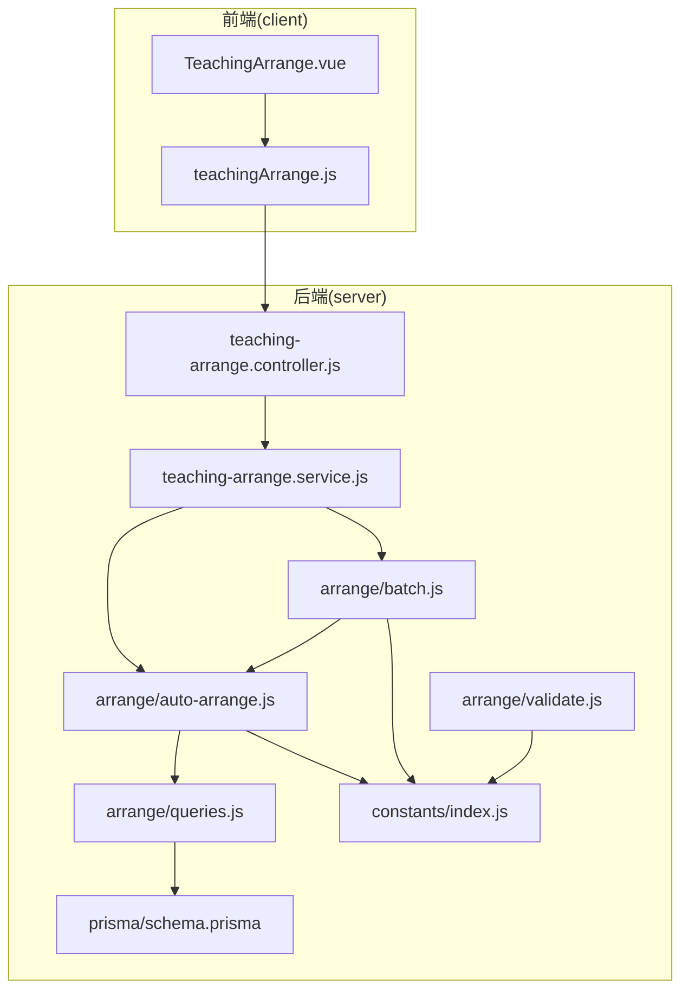
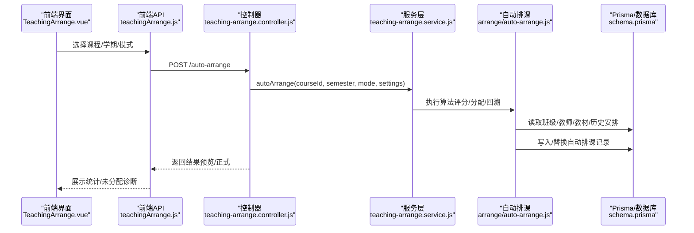
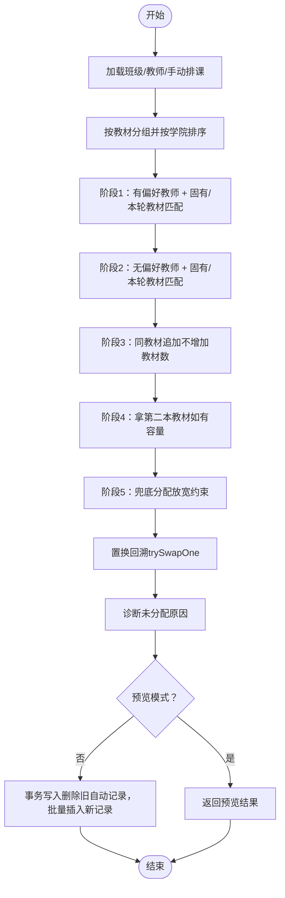
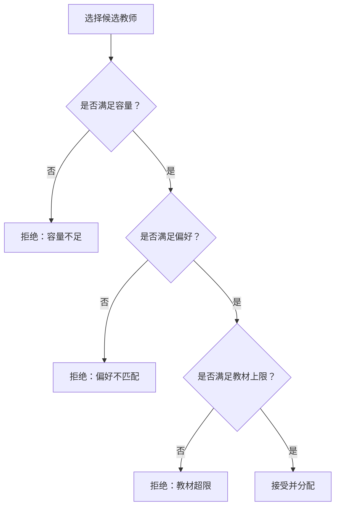
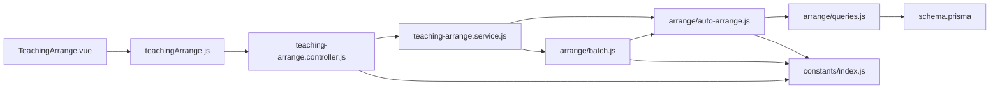
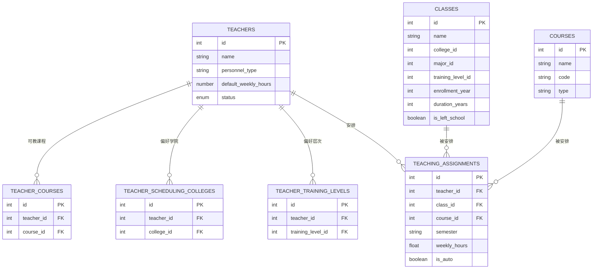

# 智能排课系统

<cite>
**本文引用的文件**
- [TEACHING_ARRANGE_LOGIC.md](file://docs/TEACHING_ARRANGE_LOGIC.md)
- [AUTO_ARRANGE_LOGIC_V2.md](file://docs/AUTO_ARRANGE_LOGIC_V2.md)
- [SCHEDULING_ALGORITHM_OPTIMIZATION.md](file://docs/SCHEDULING_ALGORITHM_OPTIMIZATION.md)
- [auto-arrange.js](file://server/src/services/arrange/auto-arrange.js)
- [batch.js](file://server/src/services/arrange/batch.js)
- [queries.js](file://server/src/services/arrange/queries.js)
- [validate.js](file://server/src/services/arrange/validate.js)
- [teaching-arrange.controller.js](file://server/src/controllers/teaching-arrange.controller.js)
- [teaching-arrange.service.js](file://server/src/services/teaching-arrange.service.js)
- [index.js](file://server/src/constants/index.js)
- [TeachingArrange.vue](file://client/src/views/teaching/TeachingArrange.vue)
- [teachingArrange.js](file://client/src/api/teachingArrange.js)
- [schema.prisma](file://server/prisma/schema.prisma)
</cite>

## 目录
1. [简介](#简介)
2. [项目结构](#项目结构)
3. [核心组件](#核心组件)
4. [架构总览](#架构总览)
5. [详细组件分析](#详细组件分析)
6. [依赖分析](#依赖分析)
7. [性能考量](#性能考量)
8. [故障排查指南](#故障排查指南)
9. [结论](#结论)
10. [附录](#附录)

## 简介
本文件面向“智能排课系统”的使用者与开发者，系统性阐述自动排课算法、冲突检测机制、时间安排优化策略，以及教师可用时间管理、教室资源分配、课程时间冲突避免算法。文档还涵盖排课规则配置、手动调整功能、批量排课操作、排课结果验证与回滚机制，并提供排课进度监控、异常处理、人工干预接口与排课质量评估指标。

## 项目结构
系统前后端分离，后端采用 Node.js + Prisma，前端采用 Vue3 + Element Plus。核心业务位于 server 与 client 两部分，排课逻辑集中在后端服务层，前端负责展示与交互。

**图表来源**
- [teaching-arrange.controller.js](file://server/src/controllers/teaching-arrange.controller.js)
- [teaching-arrange.service.js](file://server/src/services/teaching-arrange.service.js)
- [auto-arrange.js](file://server/src/services/arrange/auto-arrange.js)
- [batch.js](file://server/src/services/arrange/batch.js)
- [queries.js](file://server/src/services/arrange/queries.js)
- [validate.js](file://server/src/services/arrange/validate.js)
- [index.js](file://server/src/constants/index.js)
- [TeachingArrange.vue](file://client/src/views/teaching/TeachingArrange.vue)
- [teachingArrange.js](file://client/src/api/teachingArrange.js)
- [schema.prisma](file://server/prisma/schema.prisma)

**章节来源**
- [teaching-arrange.controller.js](file://server/src/controllers/teaching-arrange.controller.js)
- [teaching-arrange.service.js](file://server/src/services/teaching-arrange.service.js)
- [auto-arrange.js](file://server/src/services/arrange/auto-arrange.js)
- [batch.js](file://server/src/services/arrange/batch.js)
- [queries.js](file://server/src/services/arrange/queries.js)
- [index.js](file://server/src/constants/index.js)
- [TeachingArrange.vue](file://client/src/views/teaching/TeachingArrange.vue)
- [teachingArrange.js](file://client/src/api/teachingArrange.js)
- [schema.prisma](file://server/prisma/schema.prisma)

## 核心组件
- 排课控制器：接收前端请求，校验参数，调用服务层执行排课或批量排课，并生成审计日志。
- 排课服务：封装自动排课与批量排课的入口，协调查询、评分、分配与回滚。
- 自动排课算法：实现教材内聚优先、偏好隔离、容量控制、评分与负载均衡、置换回溯等策略。
- 批量排课：按课程优先级顺序执行自动排课，支持预览模式与跨课程虚拟容量累计。
- 数据查询与匹配：提供班级/教师筛选、学期解析、教材匹配、偏好检查等工具。
- 常量与配置：课时设置、教材内聚权重、阈值、模式等全局配置。
- 前端视图与API：课程选择、预览/执行、批量排课、重置、统计展示与导出。

**章节来源**
- [teaching-arrange.controller.js](file://server/src/controllers/teaching-arrange.controller.js)
- [teaching-arrange.service.js](file://server/src/services/teaching-arrange.service.js)
- [auto-arrange.js](file://server/src/services/arrange/auto-arrange.js)
- [batch.js](file://server/src/services/arrange/batch.js)
- [queries.js](file://server/src/services/arrange/queries.js)
- [index.js](file://server/src/constants/index.js)
- [TeachingArrange.vue](file://client/src/views/teaching/TeachingArrange.vue)
- [teachingArrange.js](file://client/src/api/teachingArrange.js)

## 架构总览
系统采用“控制器-服务-查询-数据层”分层架构。前端通过 API 发起排课请求，控制器解析参数并调用服务层；服务层组织算法与数据访问，最终落库并记录审计日志。

**图表来源**
- [teaching-arrange.controller.js](file://server/src/controllers/teaching-arrange.controller.js)
- [teaching-arrange.service.js](file://server/src/services/teaching-arrange.service.js)
- [auto-arrange.js](file://server/src/services/arrange/auto-arrange.js)
- [schema.prisma](file://server/prisma/schema.prisma)

## 详细组件分析

### 自动排课算法（教材内聚优先）
- 教材内聚优先：通过“本轮已分配教材”与“固有教材”双维度评分，优先分配同教材班级，抑制多教材分散。
- 偏好隔离：有/无偏好教师分阶段处理，严格过滤有偏好教师的匹配集合，避免无偏好教师抢占。
- 容量控制：标准/全量两种模式，结合课程上限与教师特定周课时上限，动态计算剩余容量。
- 置换回溯：对未分配班级尝试置换，提升分配率，同时严格教材上限检查，防止越界。
- 预览模式：不写库，仅计算并返回诊断，支持跨课程虚拟容量累计。

**图表来源**
- [AUTO_ARRANGE_LOGIC_V2.md](file://docs/AUTO_ARRANGE_LOGIC_V2.md)
- [auto-arrange.js](file://server/src/services/arrange/auto-arrange.js)

**章节来源**
- [AUTO_ARRANGE_LOGIC_V2.md](file://docs/AUTO_ARRANGE_LOGIC_V2.md)
- [SCHEDULING_ALGORITHM_OPTIMIZATION.md](file://docs/SCHEDULING_ALGORITHM_OPTIMIZATION.md)
- [auto-arrange.js](file://server/src/services/arrange/auto-arrange.js)

### 冲突检测与避免机制
- 偏好约束：教师若设置“任课学院/培养层次”，算法严格拦截非匹配班级，确保偏好不被绕过。
- 教材上限：教师同时教授的教材数量受硬上限控制，避免“一人多教材”分散。
- 容量检查：全局容量与课程上限双重校验，防止超负荷。
- 置换校验：置换过程再次校验容量与偏好，确保不破坏已分配结果。

**图表来源**
- [auto-arrange.js](file://server/src/services/arrange/auto-arrange.js)
- [SCHEDULING_ALGORITHM_OPTIMIZATION.md](file://docs/SCHEDULING_ALGORITHM_OPTIMIZATION.md)

**章节来源**
- [auto-arrange.js](file://server/src/services/arrange/auto-arrange.js)
- [SCHEDULING_ALGORITHM_OPTIMIZATION.md](file://docs/SCHEDULING_ALGORITHM_OPTIMIZATION.md)

### 教师可用时间管理与容量约束
- 标准/全量模式：分别对应“标准课时上限”和“最大课时上限”，结合教师特定周课时上限形成有效剩余容量。
- 课程上限：针对单课程的硬上限，避免个别课程占用过多教师容量。
- 负载均衡：评分与负载率双因子排序，优先低负载教师，提升整体均衡性。

**章节来源**
- [index.js](file://server/src/constants/index.js)
- [auto-arrange.js](file://server/src/services/arrange/auto-arrange.js)
- [SCHEDULING_ALGORITHM_OPTIMIZATION.md](file://docs/SCHEDULING_ALGORITHM_OPTIMIZATION.md)

### 教室资源分配与时间冲突避免
- 教室资源分配：排课算法聚焦“教师-班级-教材-偏好-容量”，不直接涉及教室资源；教室冲突通常由外部调度系统或前端矩阵表约束避免。
- 时间冲突避免：算法通过“容量+偏好+教材”三重约束减少冲突概率；若存在时间冲突，应在培养方案/矩阵表层面进行约束与校验。

**章节来源**
- [TEACHING_ARRANGE_LOGIC.md](file://docs/TEACHING_ARRANGE_LOGIC.md)
- [queries.js](file://server/src/services/arrange/queries.js)

### 排课规则配置与手动调整
- 课时设置：支持按人员类型设置“标准/最大”课时，亦可按课程覆盖；前端提供保存接口。
- 偏好设置：教师可设置“任课学院/培养层次”，影响匹配与分配优先级。
- 手动排课：通过 upsert 写入，显式标记为非自动，不被自动排课覆盖；手动记录计入容量统计。
- 重置：仅删除自动排课记录，保留手动记录。

**章节来源**
- [teaching-arrange.controller.js](file://server/src/controllers/teaching-arrange.controller.js)
- [index.js](file://server/src/constants/index.js)
- [TEACHING_ARRANGE_LOGIC.md](file://docs/TEACHING_ARRANGE_LOGIC.md)

### 批量排课与进度监控
- 顺序执行：课程按优先级顺序执行，避免先处理课程占用容量导致后续课程不足。
- 预览模式：跨课程累计虚拟容量与教材集合，保证预览一致性。
- 超时保护：批量排课设置超时上限，避免长时间占用。
- 进度与统计：返回每门课程的分配/未分配数量、警告与统计信息。

**章节来源**
- [batch.js](file://server/src/services/arrange/batch.js)
- [teaching-arrange.controller.js](file://server/src/controllers/teaching-arrange.controller.js)

### 排课结果验证与回滚
- 预览模式：不写库，返回诊断与统计，便于人工审核。
- 审计日志：自动/批量排课均记录操作详情与结果，支持回溯。
- 回滚：重置仅删除自动记录，保留手动记录，必要时可重新排课。

**章节来源**
- [teaching-arrange.controller.js](file://server/src/controllers/teaching-arrange.controller.js)
- [TEACHING_ARRANGE_LOGIC.md](file://docs/TEACHING_ARRANGE_LOGIC.md)

### 排课质量评估指标
- 匹配率：学院/层次/教材匹配比例。
- 内聚度：教师所授教材数与班级数的比率，越接近 1 越内聚。
- 负载均衡：教师负载率分布与评分差异阈值。
- 未分配率：未分配班级占比及诊断原因。

**章节来源**
- [auto-arrange.js](file://server/src/services/arrange/auto-arrange.js)
- [SCHEDULING_ALGORITHM_OPTIMIZATION.md](file://docs/SCHEDULING_ALGORITHM_OPTIMIZATION.md)

## 依赖分析
- 控制器依赖服务层；服务层依赖算法与查询模块；算法依赖常量与配置；查询模块依赖 Prisma 数据模型。
- 前端依赖控制器提供的 API，控制器与服务层通过 Prisma 访问数据库。

**图表来源**
- [teaching-arrange.controller.js](file://server/src/controllers/teaching-arrange.controller.js)
- [teaching-arrange.service.js](file://server/src/services/teaching-arrange.service.js)
- [auto-arrange.js](file://server/src/services/arrange/auto-arrange.js)
- [batch.js](file://server/src/services/arrange/batch.js)
- [queries.js](file://server/src/services/arrange/queries.js)
- [index.js](file://server/src/constants/index.js)
- [TeachingArrange.vue](file://client/src/views/teaching/TeachingArrange.vue)
- [teachingArrange.js](file://client/src/api/teachingArrange.js)
- [schema.prisma](file://server/prisma/schema.prisma)

**章节来源**
- [teaching-arrange.controller.js](file://server/src/controllers/teaching-arrange.controller.js)
- [teaching-arrange.service.js](file://server/src/services/teaching-arrange.service.js)
- [auto-arrange.js](file://server/src/services/arrange/auto-arrange.js)
- [batch.js](file://server/src/services/arrange/batch.js)
- [queries.js](file://server/src/services/arrange/queries.js)
- [index.js](file://server/src/constants/index.js)
- [TeachingArrange.vue](file://client/src/views/teaching/TeachingArrange.vue)
- [teachingArrange.js](file://client/src/api/teachingArrange.js)
- [schema.prisma](file://server/prisma/schema.prisma)

## 性能考量
- 大数据量建议：分批排课、预览模式先行、单课程优先。
- 日志级别：生产环境降低日志级别，避免性能开销。
- 查询优化：合并统计查询、批量获取层次名称、避免 N+1。
- 并发控制：课程/学期级并发锁与批量超时保护，避免资源争用。

**章节来源**
- [AUTO_ARRANGE_LOGIC_V2.md](file://docs/AUTO_ARRANGE_LOGIC_V2.md)
- [teaching-arrange.controller.js](file://server/src/controllers/teaching-arrange.controller.js)
- [queries.js](file://server/src/services/arrange/queries.js)
- [batch.js](file://server/src/services/arrange/batch.js)

## 故障排查指南
- 未分配诊断：检查“无教师/容量满/偏好不匹配/教材不匹配”等原因，针对性调整教师偏好、容量或教材。
- 教师超负荷：查看统计页面与工作量警告，适当降低标准上限或拆分课程。
- 并发冲突：若提示“正在排课中”，等待后重试；多实例部署需使用分布式锁。
- 参数校验：课时设置需为有效数字且满足范围，否则抛出错误。

**章节来源**
- [auto-arrange.js](file://server/src/services/arrange/auto-arrange.js)
- [validate.js](file://server/src/services/arrange/validate.js)
- [teaching-arrange.controller.js](file://server/src/controllers/teaching-arrange.controller.js)
- [AUTO_ARRANGE_LOGIC_V2.md](file://docs/AUTO_ARRANGE_LOGIC_V2.md)

## 结论
本系统通过“教材内聚优先、偏好隔离、容量控制、评分与负载均衡、置换回溯”等策略，实现了稳定高效的自动排课能力。配合预览模式、批量排课、审计日志与质量评估指标，既保障了自动化效率，又提供了充分的人工干预与回溯能力。建议在实际使用中遵循最佳实践，持续优化偏好与容量配置，以获得更高质量的排课结果。

## 附录

### 数据模型概览（与排课相关）

**图表来源**
- [schema.prisma](file://server/prisma/schema.prisma)

### API 一览（与排课相关）
- GET /teaching-arrange/classes：获取课程班级列表（含已安排信息）
- GET /teaching-arrange/teachers：获取课程教师列表（含课时统计）
- POST /teaching-arrange/assign：手动安排/更换教师
- POST /teaching-arrange/auto-arrange：单课程自动排课
- POST /teaching-arrange/batch-auto-arrange：批量自动排课
- POST /teaching-arrange/reset：重置自动排课
- GET /teaching-arrange/statistics：学期排课统计
- GET /teaching-arrange/hour-settings：获取课时设置
- PUT /teaching-arrange/hour-settings：保存课时设置

**章节来源**
- [teaching-arrange.controller.js](file://server/src/controllers/teaching-arrange.controller.js)
- [teachingArrange.js](file://client/src/api/teachingArrange.js)