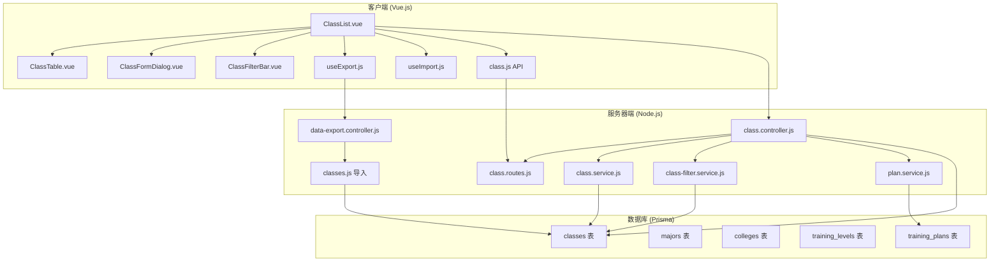
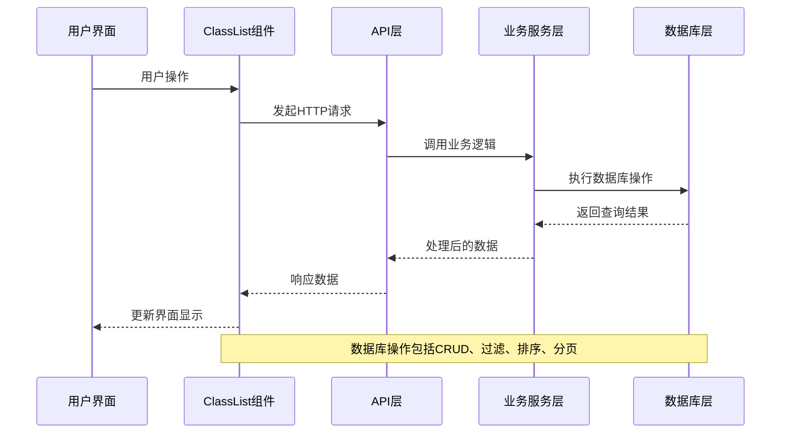
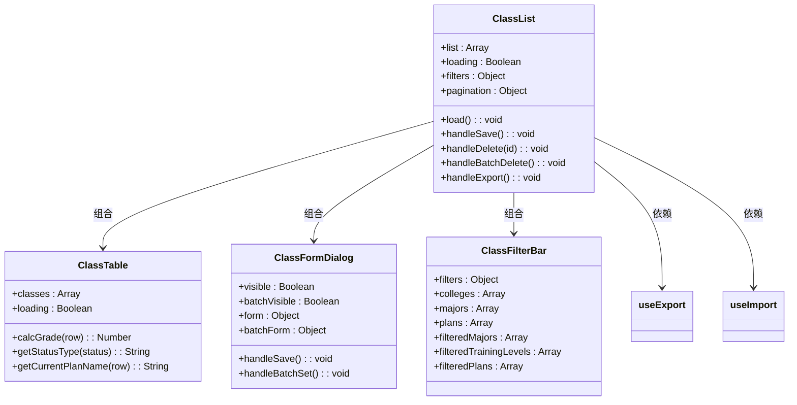
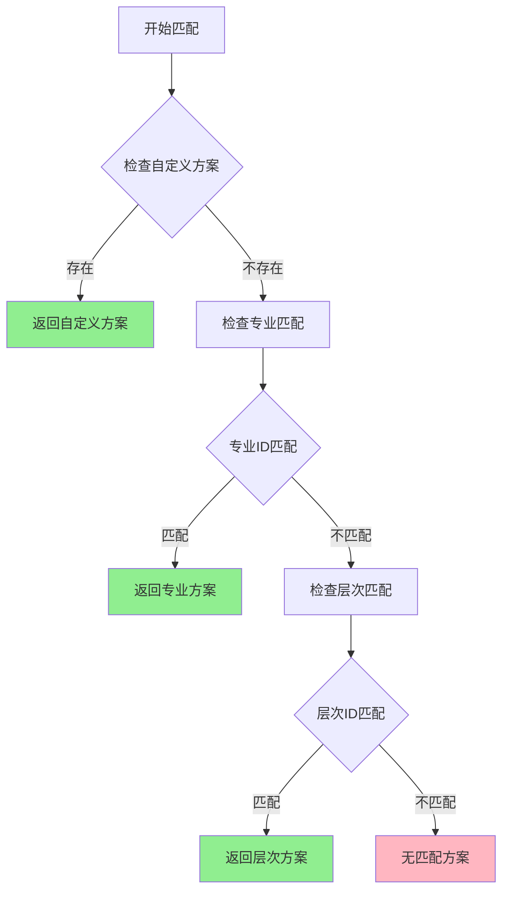
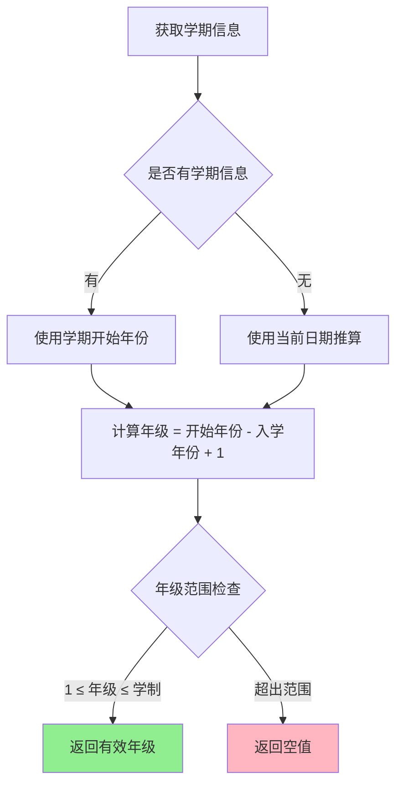
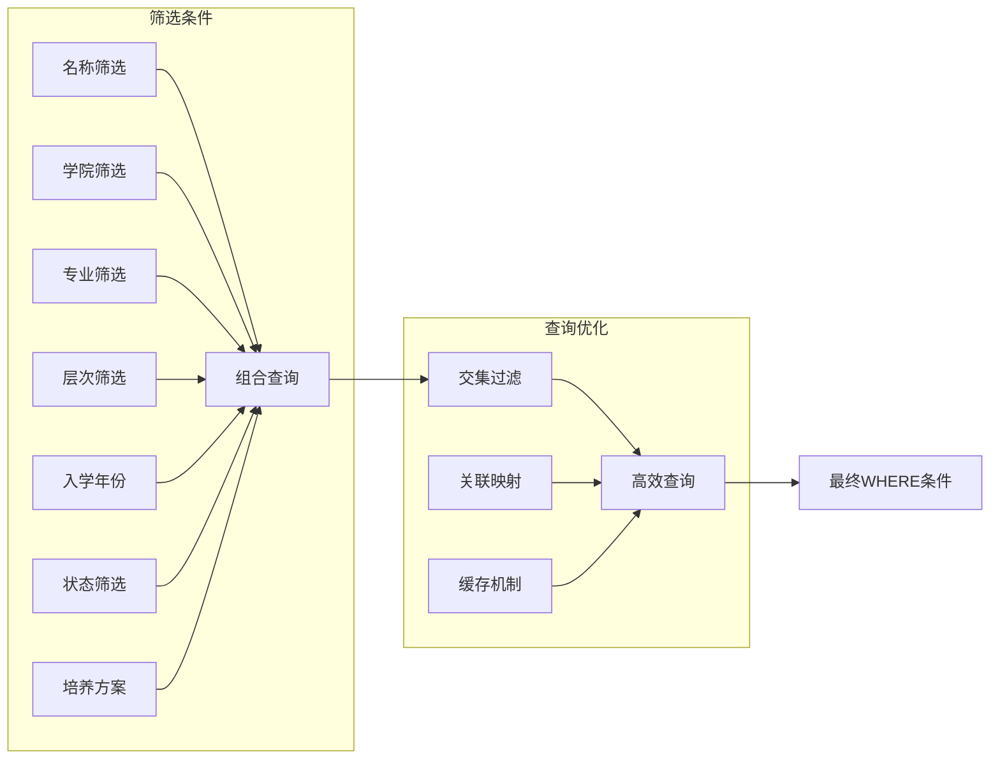
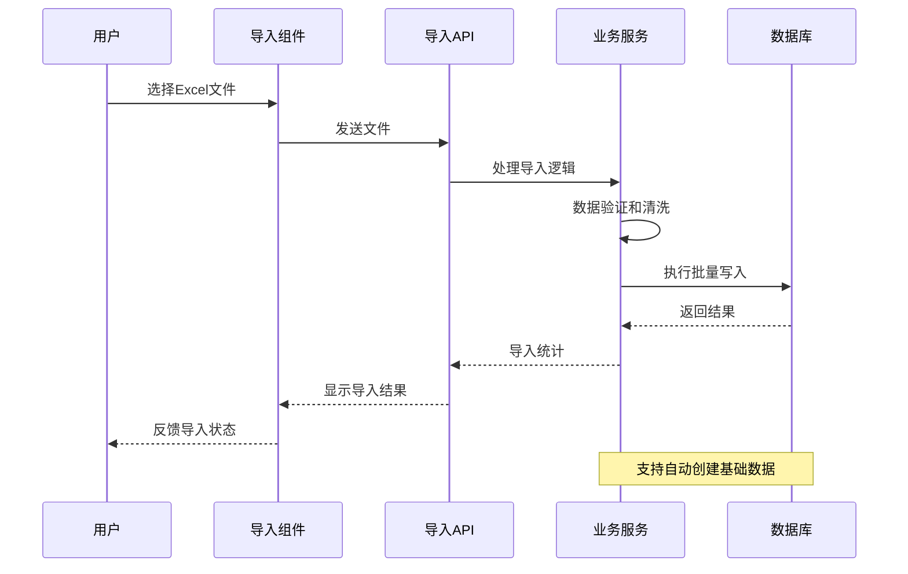
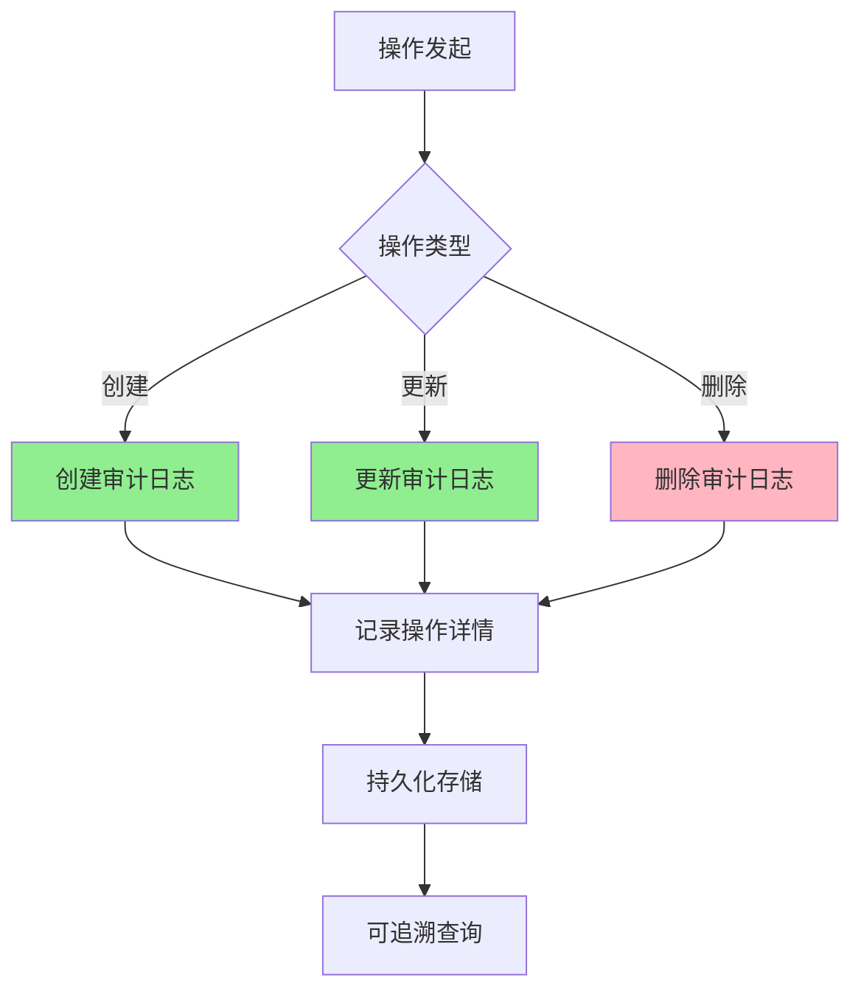
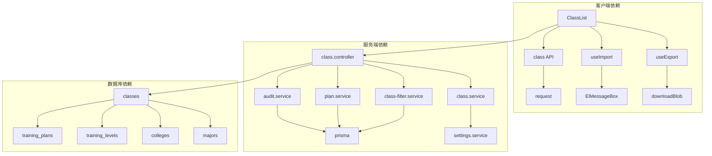
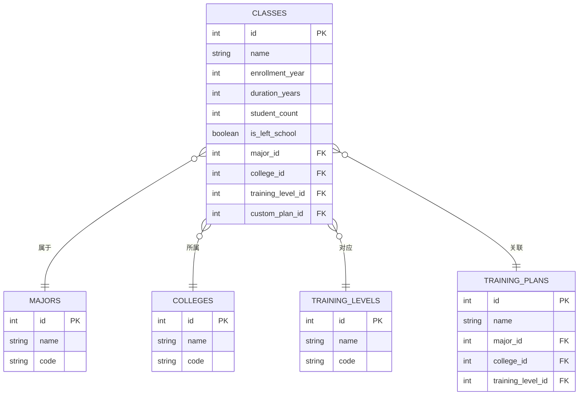

# 班级管理

<cite>
**本文档引用的文件**
- [ClassList.vue](file://client/src/views/class/ClassList.vue)
- [ClassTable.vue](file://client/src/views/class/components/ClassTable.vue)
- [ClassFormDialog.vue](file://client/src/views/class/components/ClassFormDialog.vue)
- [ClassFilterBar.vue](file://client/src/views/class/components/ClassFilterBar.vue)
- [class.js](file://client/src/api/class.js)
- [useExport.js](file://client/src/composables/useExport.js)
- [useImport.js](file://client/src/composables/useImport.js)
- [class.controller.js](file://server/src/controllers/class.controller.js)
- [class.routes.js](file://server/src/routes/class.routes.js)
- [class.service.js](file://server/src/services/class.service.js)
- [class-filter.service.js](file://server/src/services/class-filter.service.js)
- [plan.service.js](file://server/src/services/plan.service.js)
- [data-export.controller.js](file://server/src/controllers/export/data-export.controller.js)
- [classes.js](file://server/src/controllers/import/classes.js)
</cite>

## 目录
1. [简介](#简介)
2. [项目结构](#项目结构)
3. [核心组件](#核心组件)
4. [架构概览](#架构概览)
5. [详细组件分析](#详细组件分析)
6. [依赖分析](#依赖分析)
7. [性能考虑](#性能考虑)
8. [故障排除指南](#故障排除指南)
9. [结论](#结论)
10. [附录](#附录)

## 简介
本系统提供完整的班级信息管理功能，包括班级信息维护、培养方案绑定、学生名单管理、自动匹配算法、容量控制、年级专业筛选、批量导入导出、异动记录管理和毕业状态跟踪等核心能力。系统采用前后端分离架构，前端基于Vue.js构建用户界面，后端使用Node.js和Prisma ORM提供RESTful API服务。

## 项目结构
系统采用模块化设计，主要分为客户端视图层和服务器端业务逻辑层：

**图表来源**
- [ClassList.vue:1-610](file://client/src/views/class/ClassList.vue#L1-L610)
- [class.controller.js:1-464](file://server/src/controllers/class.controller.js#L1-L464)
- [class.routes.js:1-34](file://server/src/routes/class.routes.js#L1-L34)

**章节来源**
- [ClassList.vue:1-610](file://client/src/views/class/ClassList.vue#L1-L610)
- [class.controller.js:1-464](file://server/src/controllers/class.controller.js#L1-L464)

## 核心组件
系统的核心组件包括班级列表展示、筛选过滤、表单编辑、批量操作和导入导出功能。

### 班级信息维护
系统支持完整的班级信息管理，包括基本信息录入、修改和删除操作。核心字段包括班级名称、专业类别、二级学院、培养层次、入学年份、学制、班级人数等。

### 培养方案绑定
系统实现了智能的培养方案自动匹配机制，支持自定义方案、专业方案和层次方案的优先级匹配。

### 学生名单管理
提供班级学生人数统计和管理功能，支持实时更新班级规模信息。

**章节来源**
- [ClassList.vue:162-173](file://client/src/views/class/ClassList.vue#L162-L173)
- [ClassFormDialog.vue:102-112](file://client/src/views/class/components/ClassFormDialog.vue#L102-L112)

## 架构概览
系统采用经典的三层架构模式，前后端职责清晰分离：

**图表来源**
- [class.controller.js:45-242](file://server/src/controllers/class.controller.js#L45-L242)
- [class.routes.js:14-33](file://server/src/routes/class.routes.js#L14-L33)

## 详细组件分析

### 班级列表组件 (ClassList)
负责班级数据的展示和用户交互，包含完整的CRUD操作和批量处理功能。

**图表来源**
- [ClassList.vue:101-574](file://client/src/views/class/ClassList.vue#L101-L574)
- [ClassTable.vue:122-275](file://client/src/views/class/components/ClassTable.vue#L122-L275)
- [ClassFormDialog.vue:186-279](file://client/src/views/class/components/ClassFormDialog.vue#L186-L279)
- [ClassFilterBar.vue:111-374](file://client/src/views/class/components/ClassFilterBar.vue#L111-L374)

#### 班级自动匹配培养方案算法
系统实现了智能的培养方案匹配算法，具有以下特点：

**图表来源**
- [plan.service.js:71-101](file://server/src/services/plan.service.js#L71-L101)

#### 年级计算逻辑
系统根据当前学期信息动态计算班级年级，确保数据准确性：

**图表来源**
- [class.controller.js:10-26](file://server/src/controllers/class.controller.js#L10-L26)
- [ClassTable.vue:158-185](file://client/src/views/class/components/ClassTable.vue#L158-L185)

**章节来源**
- [plan.service.js:43-101](file://server/src/services/plan.service.js#L43-L101)
- [class.controller.js:87-126](file://server/src/controllers/class.controller.js#L87-L126)

### 筛选过滤机制
系统提供了多层次的筛选过滤功能，支持按学院、专业、培养层次、入学年份、状态和培养方案进行精确筛选。

**图表来源**
- [ClassFilterBar.vue:204-304](file://client/src/views/class/components/ClassFilterBar.vue#L204-L304)
- [class-filter.service.js:9-112](file://server/src/services/class-filter.service.js#L9-L112)

### 批量导入导出功能
系统支持Excel格式的批量数据导入和导出，提供完整的数据迁移解决方案。

**图表来源**
- [classes.js:13-345](file://server/src/controllers/import/classes.js#L13-L345)
- [useImport.js:14-92](file://client/src/composables/useImport.js#L14-L92)

**章节来源**
- [classes.js:60-282](file://server/src/controllers/import/classes.js#L60-L282)
- [data-export.controller.js:145-283](file://server/src/controllers/export/data-export.controller.js#L145-L283)

### 异动记录管理
系统实现了完整的审计日志功能，记录所有班级信息变更历史。

**图表来源**
- [class.controller.js:290-462](file://server/src/controllers/class.controller.js#L290-L462)

## 依赖分析
系统各组件间存在明确的依赖关系，遵循单一职责原则：

**图表来源**
- [class.controller.js:1-8](file://server/src/controllers/class.controller.js#L1-L8)
- [class.service.js:1-52](file://server/src/services/class.service.js#L1-L52)
- [plan.service.js:1-102](file://server/src/services/plan.service.js#L1-L102)

**章节来源**
- [class.controller.js:1-464](file://server/src/controllers/class.controller.js#L1-L464)
- [class.service.js:13-51](file://server/src/services/class.service.js#L13-L51)

## 性能考虑
系统在多个层面进行了性能优化：

### 查询优化
- 使用关联映射减少数据库查询次数
- 实现查询条件缓存机制
- 优化复杂查询的索引策略

### 缓存策略
- 学制缓存：5分钟有效期
- 关联关系缓存：按需更新
- 搜索结果缓存：提升用户体验

### 批处理优化
- 批量导入使用事务处理
- 批量导出分页处理大数据集
- 并发请求限制和队列管理

## 故障排除指南

### 常见问题及解决方案

#### 班级导入失败
**问题症状**：导入过程中出现错误提示
**可能原因**：
- Excel文件格式不正确
- 必填字段缺失
- 数据范围超限

**解决步骤**：
1. 检查Excel文件格式（仅支持.xlsx和.xls）
2. 确认必填字段完整（班级名称、入学年份、学制、培养层次）
3. 验证数据范围（入学年份2000-2100，学制1-10年）

#### 培养方案匹配异常
**问题症状**：班级培养方案显示不正确
**可能原因**：
- 班级信息不完整
- 培养方案配置错误
- 匹配算法冲突

**解决步骤**：
1. 检查班级是否设置了自定义培养方案
2. 验证专业和层次信息的正确性
3. 确认培养方案的有效性

#### 数据导出问题
**问题症状**：导出文件为空或格式错误
**可能原因**：
- 筛选条件过于严格
- 数据库连接异常
- 文件权限问题

**解决步骤**：
1. 清除不必要的筛选条件
2. 检查数据库连接状态
3. 验证文件写入权限

**章节来源**
- [classes.js:77-97](file://server/src/controllers/import/classes.js#L77-L97)
- [data-export.controller.js:148-150](file://server/src/controllers/export/data-export.controller.js#L148-L150)

## 结论
本班级管理系统通过合理的架构设计和完善的业务逻辑，提供了全面的班级信息管理解决方案。系统具备良好的扩展性和维护性，能够满足高校教务管理的各种需求。通过智能的培养方案匹配算法、完善的筛选过滤机制和高效的批量处理功能，显著提升了教务工作的效率和准确性。

## 附录

### API接口规范
系统提供RESTful API接口，支持标准的HTTP方法操作：

| 方法 | 路径 | 权限 | 功能 |
|------|------|------|------|
| GET | /api/classes/stats | 任意 | 获取班级统计信息 |
| GET | /api/classes | 任意 | 获取班级列表 |
| POST | /api/classes | 管理员 | 创建新班级 |
| PUT | /api/classes/:id | 管理员 | 更新班级信息 |
| DELETE | /api/classes/:id | 管理员 | 删除班级 |

### 数据模型关系

### 配置选项
系统支持灵活的配置选项，包括：
- 学期信息配置
- 权限角色管理
- 数据导出模板定制
- 批量操作阈值设置