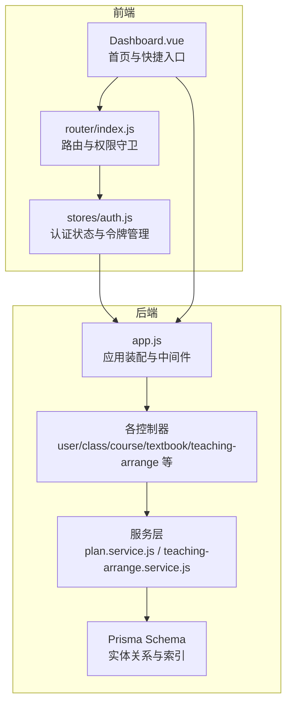
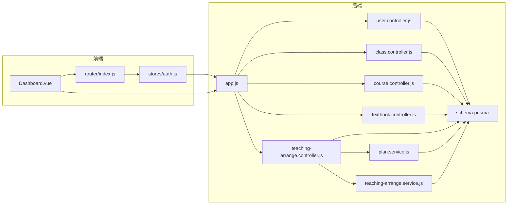
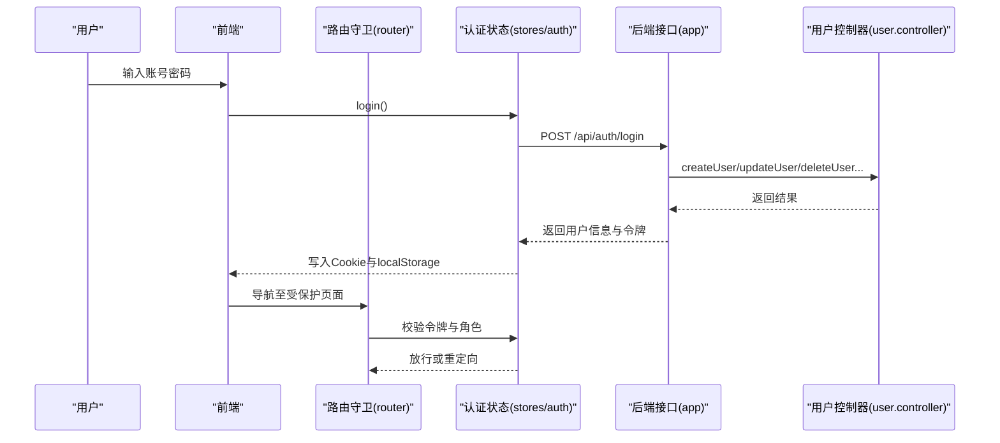
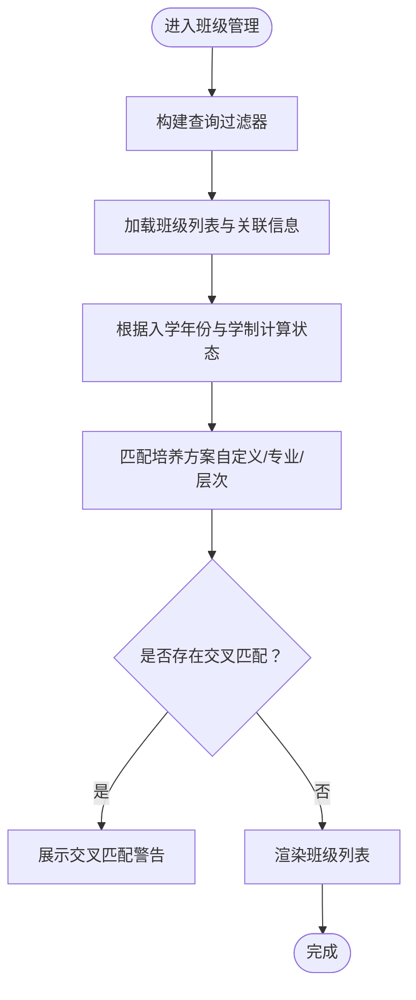
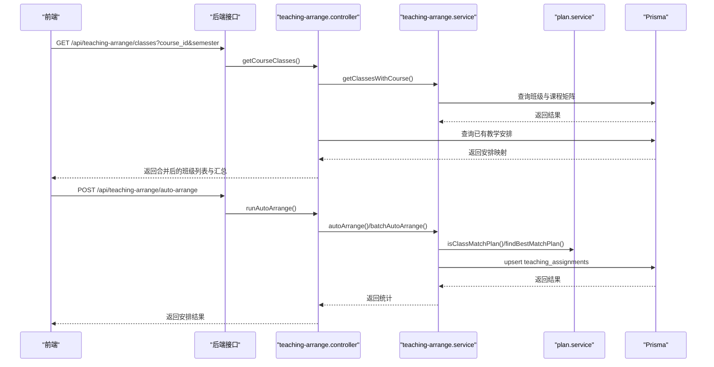
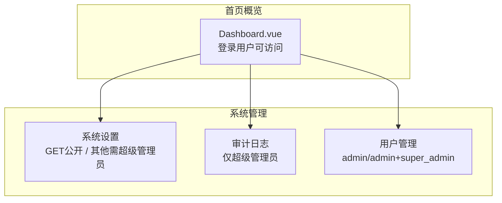
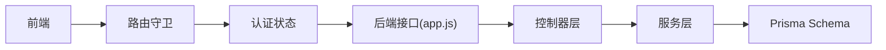

# 核心业务模块

<cite>
**本文档引用的文件**
- [Dashboard.vue](file://client/src/views/Dashboard.vue)
- [router/index.js](file://client/src/router/index.js)
- [auth.js](file://client/src/stores/auth.js)
- [app.js](file://server/src/app.js)
- [schema.prisma](file://server/prisma/schema.prisma)
- [user.controller.js](file://server/src/controllers/user.controller.js)
- [class.controller.js](file://server/src/controllers/class.controller.js)
- [course.controller.js](file://server/src/controllers/course.controller.js)
- [textbook.controller.js](file://server/src/controllers/textbook.controller.js)
- [teaching-arrange.controller.js](file://server/src/controllers/teaching-arrange.controller.js)
- [plan.service.js](file://server/src/services/plan.service.js)
- [teaching-arrange.service.js](file://server/src/services/teaching-arrange.service.js)
</cite>

## 目录
1. [引言](#引言)
2. [项目结构](#项目结构)
3. [核心组件](#核心组件)
4. [架构总览](#架构总览)
5. [详细组件分析](#详细组件分析)
6. [依赖分析](#依赖分析)
7. [性能考虑](#性能考虑)
8. [故障排查指南](#故障排查指南)
9. [结论](#结论)

## 引言
本文件面向 KEA 课程管理平台的核心业务模块，系统梳理“用户管理、基础数据管理、教学管理、系统管理”四大模块的功能边界、业务流程、数据流转与用户交互模式。重点覆盖培养方案管理、班级管理、教师排课、教材管理等关键流程，提供模块间依赖关系图与数据流路径，帮助开发者快速理解整体业务架构。

## 项目结构
平台采用前后端分离架构：
- 前端（Vue 3 + Element Plus）负责视图渲染、路由守卫、用户态管理与交互；
- 后端（Express 5 + Prisma ORM）负责业务编排、数据模型与接口暴露；
- 数据库（SQLite/MySQL）通过 Prisma 管理实体关系与索引。

图表来源
- [app.js:1-158](file://server/src/app.js#L1-L158)
- [router/index.js:1-244](file://client/src/router/index.js#L1-L244)
- [auth.js:1-222](file://client/src/stores/auth.js#L1-L222)
- [schema.prisma:1-308](file://server/prisma/schema.prisma#L1-L308)

章节来源
- [app.js:1-158](file://server/src/app.js#L1-L158)
- [router/index.js:1-244](file://client/src/router/index.js#L1-L244)
- [auth.js:1-222](file://client/src/stores/auth.js#L1-L222)
- [schema.prisma:1-308](file://server/prisma/schema.prisma#L1-L308)

## 核心组件
- 用户管理（系统管理）
  - 功能：用户列表、创建、更新、启用/禁用、删除；审计日志联动。
  - 关键点：管理员仅能管理访客账号；禁止修改/删除超级管理员；角色变更与状态变更即时失效缓存。
- 基础数据管理（基础数据）
  - 功能：专业、学院、培养层次、课程、教材、班级管理。
  - 关键点：排序字段自动修复与缓存；多表关联删除前严格校验。
- 教学管理（教学）
  - 功能：课程矩阵、教师列表、自动/手动排课、批量排课、课时统计、课时设置。
  - 关键点：按课程学期推导周课时；自动排课与预览；按教师聚合统计。
- 系统管理（系统）
  - 功能：系统设置、审计日志、用户管理（仅超级管理员）。
  - 关键点：超级管理员专属路由；系统设置键值对持久化。

章节来源
- [user.controller.js:1-252](file://server/src/controllers/user.controller.js#L1-L252)
- [class.controller.js:1-466](file://server/src/controllers/class.controller.js#L1-L466)
- [course.controller.js:1-142](file://server/src/controllers/course.controller.js#L1-L142)
- [textbook.controller.js:1-224](file://server/src/controllers/textbook.controller.js#L1-L224)
- [teaching-arrange.controller.js:1-663](file://server/src/controllers/teaching-arrange.controller.js#L1-L663)

## 架构总览
系统围绕“数据模型—服务层—控制器—路由—前端视图”的分层展开，前端通过 Pinia 管理认证状态，后端通过中间件统一处理安全、命名转换与 XSS 清洗，并以 Prisma 管理实体关系与索引。

图表来源
- [app.js:1-158](file://server/src/app.js#L1-L158)
- [router/index.js:1-244](file://client/src/router/index.js#L1-L244)
- [auth.js:1-222](file://client/src/stores/auth.js#L1-L222)
- [user.controller.js:1-252](file://server/src/controllers/user.controller.js#L1-L252)
- [class.controller.js:1-466](file://server/src/controllers/class.controller.js#L1-L466)
- [course.controller.js:1-142](file://server/src/controllers/course.controller.js#L1-L142)
- [textbook.controller.js:1-224](file://server/src/controllers/textbook.controller.js#L1-L224)
- [teaching-arrange.controller.js:1-663](file://server/src/controllers/teaching-arrange.controller.js#L1-L663)
- [plan.service.js:1-102](file://server/src/services/plan.service.js#L1-L102)
- [teaching-arrange.service.js:1-5](file://server/src/services/teaching-arrange.service.js#L1-L5)
- [schema.prisma:1-308](file://server/prisma/schema.prisma#L1-L308)

## 详细组件分析

### 用户管理（系统管理）
- 业务目标：集中管理平台用户，支持角色分级与审计追踪。
- 关键流程：
  - 登录/刷新令牌与用户信息拉取；
  - 用户 CRUD 与状态变更；
  - 审计日志记录与缓存失效。
- 权限控制：仅超级管理员可访问审计日志；管理员仅能管理访客账号。

图表来源
- [router/index.js:151-241](file://client/src/router/index.js#L151-L241)
- [auth.js:48-151](file://client/src/stores/auth.js#L48-L151)
- [app.js:91-150](file://server/src/app.js#L91-L150)
- [user.controller.js:12-252](file://server/src/controllers/user.controller.js#L12-L252)

章节来源
- [user.controller.js:1-252](file://server/src/controllers/user.controller.js#L1-L252)
- [router/index.js:151-241](file://client/src/router/index.js#L151-L241)
- [auth.js:1-222](file://client/src/stores/auth.js#L1-L222)

### 基础数据管理（基础数据）
- 课程管理：增删改查、排序字段维护、关联检查（培养方案/排课/教师）。
- 教材管理：增删改查、状态切换、排序字段维护、引用检查。
- 班级管理：动态状态计算（在读/毕业/离校）、培养方案匹配与交叉匹配警告、级联删除排课记录。

图表来源
- [class.controller.js:45-244](file://server/src/controllers/class.controller.js#L45-L244)
- [plan.service.js:34-101](file://server/src/services/plan.service.js#L34-L101)

章节来源
- [course.controller.js:1-142](file://server/src/controllers/course.controller.js#L1-L142)
- [textbook.controller.js:1-224](file://server/src/controllers/textbook.controller.js#L1-L224)
- [class.controller.js:1-466](file://server/src/controllers/class.controller.js#L1-L466)
- [plan.service.js:1-102](file://server/src/services/plan.service.js#L1-L102)

### 教学管理（教学）
- 课程矩阵：按课程与学期返回班级列表，合并已有教学安排，汇总周课时统计。
- 教师排课：手动安排/更换教师、自动排课（全量/标准模式）、批量自动排课、重置自动安排、课时统计。
- 课时设置：按课程维度保存/读取课时要求配置，JSON 校验与回退默认值。

图表来源
- [teaching-arrange.controller.js:29-352](file://server/src/controllers/teaching-arrange.controller.js#L29-L352)
- [teaching-arrange.service.js:1-5](file://server/src/services/teaching-arrange.service.js#L1-L5)
- [plan.service.js:34-101](file://server/src/services/plan.service.js#L34-L101)
- [schema.prisma:286-307](file://server/prisma/schema.prisma#L286-L307)

章节来源
- [teaching-arrange.controller.js:1-663](file://server/src/controllers/teaching-arrange.controller.js#L1-L663)
- [teaching-arrange.service.js:1-5](file://server/src/services/teaching-arrange.service.js#L1-L5)
- [plan.service.js:1-102](file://server/src/services/plan.service.js#L1-L102)

### 系统管理（系统）
- 系统设置：公开读取（登录页需要），其他操作需超级管理员权限。
- 审计日志：仅超级管理员可访问，记录操作者、模块、IP、结果与详情。
- 首页概览：登录用户可访问，聚合统计基础数据与教学指标。

图表来源
- [app.js:140-153](file://server/src/app.js#L140-L153)
- [user.controller.js:12-38](file://server/src/controllers/user.controller.js#L12-L38)
- [Dashboard.vue:1-680](file://client/src/views/Dashboard.vue#L1-L680)

章节来源
- [app.js:1-158](file://server/src/app.js#L1-L158)
- [user.controller.js:1-252](file://server/src/controllers/user.controller.js#L1-L252)
- [Dashboard.vue:1-680](file://client/src/views/Dashboard.vue#L1-L680)

## 依赖分析
- 模块耦合
  - 教学管理依赖培养方案匹配逻辑（plan.service）与教学安排服务（teaching-arrange.service）。
  - 基础数据管理各控制器均依赖 Prisma 模型与审计日志。
  - 前端路由守卫依赖认证状态与角色判定。
- 外部依赖
  - Prisma ORM 管理实体关系与索引；
  - Express 中间件统一处理安全、命名转换与 XSS 清洗；
  - Element Plus 组件库与 Vue Router 路由体系。

图表来源
- [app.js:1-158](file://server/src/app.js#L1-L158)
- [router/index.js:151-241](file://client/src/router/index.js#L151-L241)
- [auth.js:1-222](file://client/src/stores/auth.js#L1-L222)
- [schema.prisma:1-308](file://server/prisma/schema.prisma#L1-L308)

章节来源
- [app.js:1-158](file://server/src/app.js#L1-L158)
- [router/index.js:1-244](file://client/src/router/index.js#L1-L244)
- [auth.js:1-222](file://client/src/stores/auth.js#L1-L222)
- [schema.prisma:1-308](file://server/prisma/schema.prisma#L1-L308)

## 性能考虑
- 前端
  - 首页统计使用带 TTL 的缓存，减少重复请求；
  - 路由守卫与认证状态管理避免重复拉取用户信息。
- 后端
  - Prisma 索引覆盖常用查询字段（如 status、semester、course_id 等）；
  - 服务层合并多次查询为单次批量查询，降低 N+1 风险；
  - 教学统计预加载相关层次与教师信息，提升聚合效率。

## 故障排查指南
- 登录/鉴权
  - 检查令牌是否过期与刷新流程是否成功；
  - 确认路由守卫中角色权限与 requiresAdmin/requiresSuperAdmin 配置。
- 数据一致性
  - 删除课程/教材/班级前检查关联计数（培养方案、排课、教师关联等）；
  - 班级更新涉及级联删除排课记录，需在事务中执行。
- 排课异常
  - 自动排课失败时查看审计日志 details 中的错误信息；
  - 课时设置需满足校验规则，否则拒绝持久化。

章节来源
- [auth.js:106-151](file://client/src/stores/auth.js#L106-L151)
- [router/index.js:214-231](file://client/src/router/index.js#L214-L231)
- [course.controller.js:96-141](file://server/src/controllers/course.controller.js#L96-L141)
- [textbook.controller.js:139-176](file://server/src/controllers/textbook.controller.js#L139-L176)
- [class.controller.js:422-466](file://server/src/controllers/class.controller.js#L422-L466)
- [teaching-arrange.controller.js:280-352](file://server/src/controllers/teaching-arrange.controller.js#L280-L352)

## 结论
本平台通过清晰的模块划分与严格的权限控制，实现了从基础数据到教学安排再到系统运维的完整闭环。前端以路由守卫与认证状态保障安全访问，后端以 Prisma 索引与服务层优化提升性能与稳定性。建议在后续迭代中持续完善导入/导出能力与可视化报表，进一步增强运营效率与用户体验。