# 用户管理模块

<cite>
**本文档引用的文件**
- [server/src/controllers/user.controller.js](file://server/src/controllers/user.controller.js)
- [server/src/services/auth.service.js](file://server/src/services/auth.service.js)
- [server/src/middleware/auth.middleware.js](file://server/src/middleware/auth.middleware.js)
- [server/src/routes/user.routes.js](file://server/src/routes/user.routes.js)
- [server/src/routes/auth.routes.js](file://server/src/routes/auth.routes.js)
- [server/src/config/auth.config.js](file://server/src/config/auth.config.js)
- [server/src/utils/error.js](file://server/src/utils/error.js)
- [server/src/middleware/validation.js](file://server/src/middleware/validation.js)
- [server/src/lib/prisma.js](file://server/src/lib/prisma.js)
- [server/src/utils/response.js](file://server/src/utils/response.js)
- [client/src/stores/auth.js](file://client/src/stores/auth.js)
- [client/src/views/system/UserManagement.vue](file://client/src/views/system/UserManagement.vue)
- [client/src/router/index.js](file://client/src/router/index.js)
</cite>

## 目录
1. [简介](#简介)
2. [项目结构](#项目结构)
3. [核心组件](#核心组件)
4. [架构概览](#架构概览)
5. [详细组件分析](#详细组件分析)
6. [依赖关系分析](#依赖关系分析)
7. [性能考虑](#性能考虑)
8. [故障排除指南](#故障排除指南)
9. [结论](#结论)

## 简介

用户管理模块是KEC课程管理平台的核心安全组件，负责系统的用户认证、授权和生命周期管理。该模块实现了完整的JWT令牌管理系统、多级权限控制、用户状态管理和审计日志功能。系统支持三种用户角色：超级管理员（super_admin）、管理员（admin）和访客（viewer），并通过严格的权限控制确保系统的安全性。

## 项目结构

用户管理模块采用前后端分离的架构设计，主要分为以下层次：

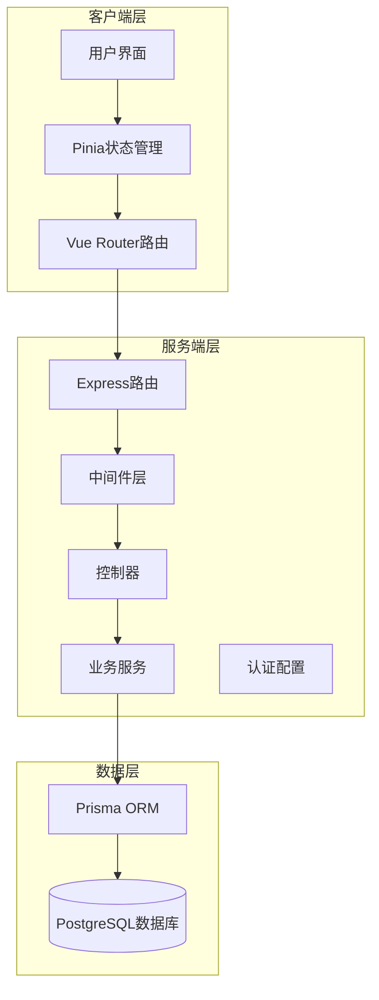

**图表来源**
- [server/src/controllers/user.controller.js:1-252](file://server/src/controllers/user.controller.js#L1-L252)
- [server/src/services/auth.service.js:1-199](file://server/src/services/auth.service.js#L1-L199)
- [server/src/middleware/auth.middleware.js:1-129](file://server/src/middleware/auth.middleware.js#L1-L129)

**章节来源**
- [server/src/controllers/user.controller.js:1-252](file://server/src/controllers/user.controller.js#L1-L252)
- [server/src/services/auth.service.js:1-199](file://server/src/services/auth.service.js#L1-L199)
- [server/src/middleware/auth.middleware.js:1-129](file://server/src/middleware/auth.middleware.js#L1-L129)

## 核心组件

### 用户认证服务

用户认证服务是整个模块的核心，负责处理用户登录、令牌生成和验证等关键功能。

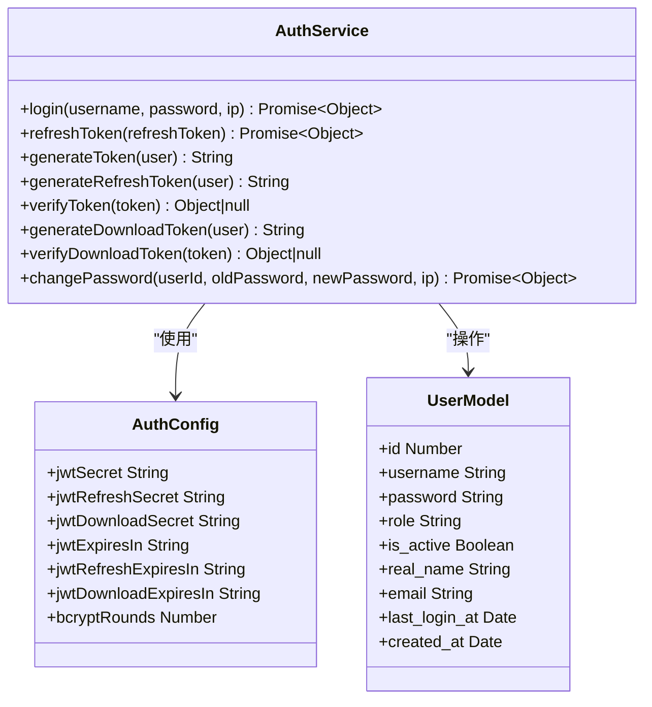

**图表来源**
- [server/src/services/auth.service.js:8-199](file://server/src/services/auth.service.js#L8-L199)
- [server/src/config/auth.config.js:49-58](file://server/src/config/auth.config.js#L49-L58)

### 权限中间件

权限中间件提供了多级权限控制机制，确保只有授权用户才能访问特定资源。

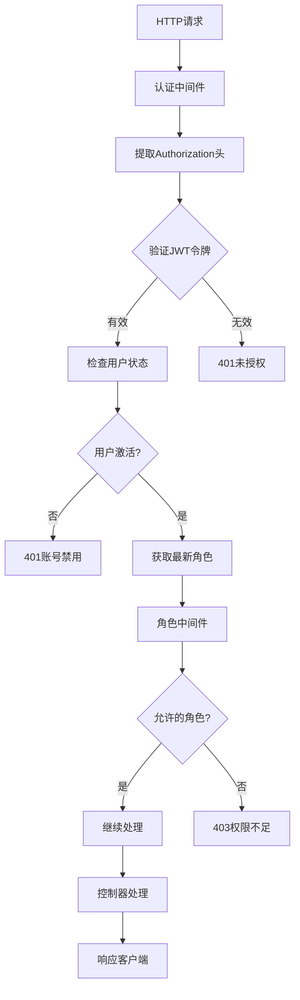

**图表来源**
- [server/src/middleware/auth.middleware.js:40-129](file://server/src/middleware/auth.middleware.js#L40-L129)

**章节来源**
- [server/src/services/auth.service.js:1-199](file://server/src/services/auth.service.js#L1-L199)
- [server/src/middleware/auth.middleware.js:1-129](file://server/src/middleware/auth.middleware.js#L1-L129)
- [server/src/config/auth.config.js:1-58](file://server/src/config/auth.config.js#L1-L58)

## 架构概览

用户管理模块采用分层架构设计，各层职责明确，耦合度低：

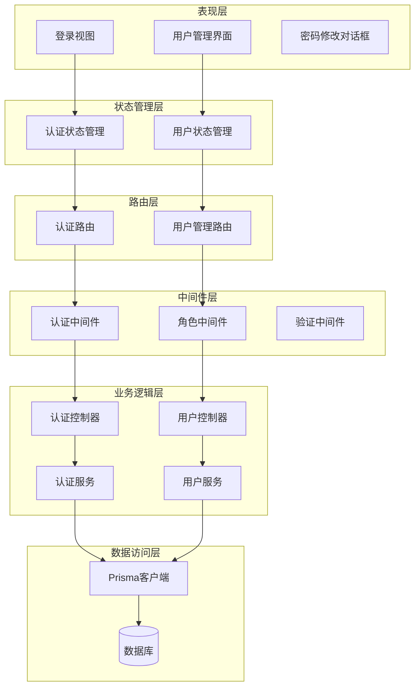

**图表来源**
- [client/src/stores/auth.js:1-222](file://client/src/stores/auth.js#L1-L222)
- [client/src/views/system/UserManagement.vue:1-362](file://client/src/views/system/UserManagement.vue#L1-L362)
- [server/src/routes/auth.routes.js:1-181](file://server/src/routes/auth.routes.js#L1-L181)
- [server/src/routes/user.routes.js:1-64](file://server/src/routes/user.routes.js#L1-L64)

## 详细组件分析

### 用户认证流程

用户认证流程是系统安全的核心，采用了JWT令牌机制和多层安全防护：

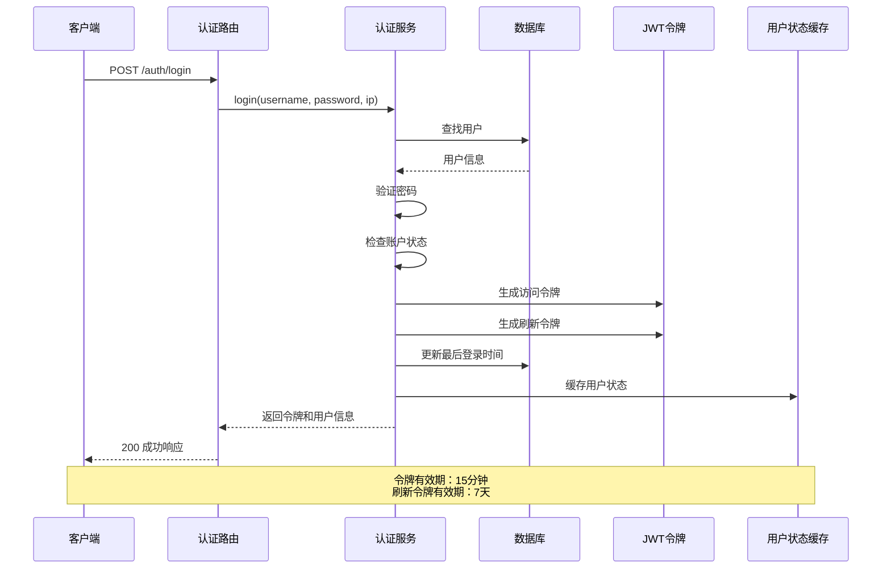

**图表来源**
- [server/src/services/auth.service.js:9-82](file://server/src/services/auth.service.js#L9-L82)
- [server/src/routes/auth.routes.js:59-72](file://server/src/routes/auth.routes.js#L59-L72)

#### 密码加密存储

系统使用bcrypt进行密码加密存储，确保用户密码的安全性：

| 特征 | 配置值 |
|------|--------|
| 加密算法 | bcrypt |
| 迭代轮数 | 12次（可配置） |
| 密钥派生 | HKDF从主密钥派生 |
| 最小密码长度 | 8位 |

**章节来源**
- [server/src/services/auth.service.js:157-197](file://server/src/services/auth.service.js#L157-L197)
- [server/src/config/auth.config.js:18-47](file://server/src/config/auth.config.js#L18-L47)

### 权限控制系统

系统实现了三级权限控制模型，确保最小权限原则：

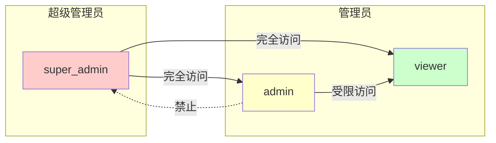

**图表来源**
- [server/src/middleware/auth.middleware.js:108-129](file://server/src/middleware/auth.middleware.js#L108-L129)
- [server/src/controllers/user.controller.js:15-57](file://server/src/controllers/user.controller.js#L15-L57)

#### 角色权限映射

| 角色 | 可访问功能 | 管理范围 |
|------|------------|----------|
| 超级管理员 | 所有功能 | 系统设置、用户管理、审计日志 |
| 管理员 | 基础数据管理 | 专业、学院、课程、培养方案 |
| 访客 | 查询功能 | 仅限数据查询 |

**章节来源**
- [server/src/controllers/user.controller.js:12-38](file://server/src/controllers/user.controller.js#L12-L38)
- [client/src/router/index.js:15-24](file://client/src/router/index.js#L15-L24)

### 用户生命周期管理

用户生命周期管理涵盖了从创建到删除的完整流程：

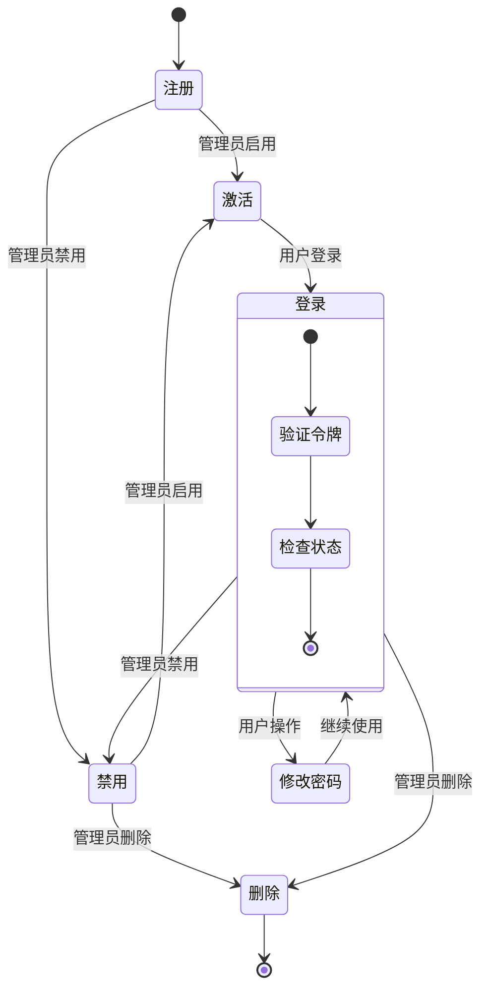

**图表来源**
- [server/src/controllers/user.controller.js:162-206](file://server/src/controllers/user.controller.js#L162-L206)

#### 用户状态管理

系统支持用户状态的实时变更，采用缓存机制确保状态一致性：

| 状态 | 描述 | 影响范围 |
|------|------|----------|
| 激活 | 正常使用系统 | 所有功能 |
| 禁用 | 禁止登录和使用 | 完全禁用 |
| 删除 | 账户移除 | 不可恢复 |

**章节来源**
- [server/src/controllers/user.controller.js:162-206](file://server/src/controllers/user.controller.js#L162-L206)
- [server/src/middleware/auth.middleware.js:17-38](file://server/src/middleware/auth.middleware.js#L17-L38)

### 会话管理策略

系统采用JWT令牌进行会话管理，实现了无状态认证机制：

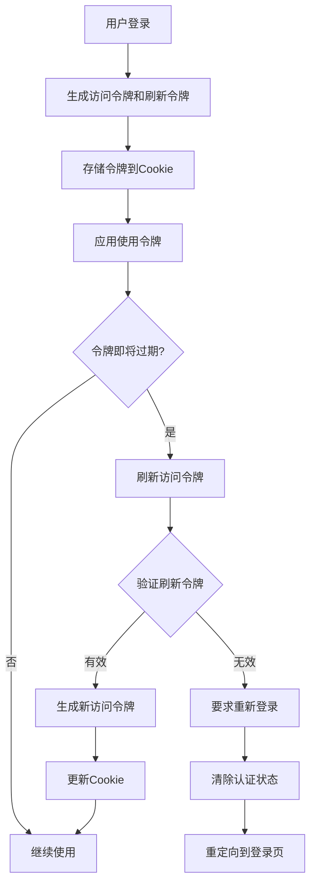

**图表来源**
- [client/src/stores/auth.js:106-128](file://client/src/stores/auth.js#L106-L128)
- [client/src/stores/auth.js:181-200](file://client/src/stores/auth.js#L181-L200)

#### 令牌安全机制

| 令牌类型 | 有效期 | 安全特性 | 使用场景 |
|----------|--------|----------|----------|
| 访问令牌 | 15分钟 | 独立密钥 | API请求认证 |
| 刷新令牌 | 7天 | 独立密钥 | 获取新访问令牌 |
| 下载令牌 | 30秒 | 独立密钥 | 文件下载 |

**章节来源**
- [server/src/config/auth.config.js:49-58](file://server/src/config/auth.config.js#L49-L58)
- [server/src/services/auth.service.js:110-155](file://server/src/services/auth.service.js#L110-L155)

### 多级权限控制实现

系统通过中间件实现多级权限控制，确保资源访问的安全性：

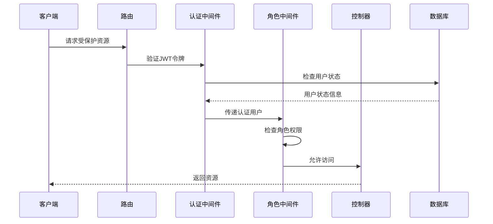

**图表来源**
- [server/src/middleware/auth.middleware.js:40-129](file://server/src/middleware/auth.middleware.js#L40-L129)

#### 权限验证流程

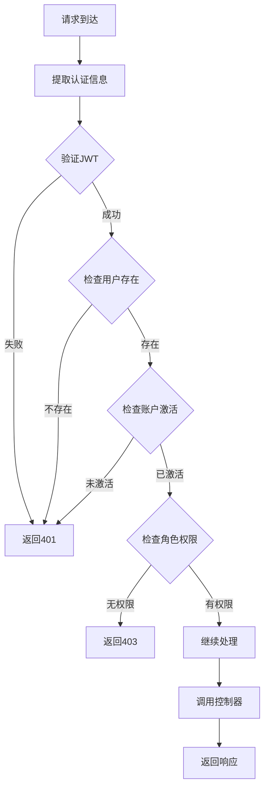

**图表来源**
- [server/src/middleware/auth.middleware.js:40-106](file://server/src/middleware/auth.middleware.js#L40-L106)

**章节来源**
- [server/src/middleware/auth.middleware.js:108-129](file://server/src/middleware/auth.middleware.js#L108-L129)
- [server/src/routes/user.routes.js:24-61](file://server/src/routes/user.routes.js#L24-L61)

### 用户注册、密码修改和账户状态管理

#### 用户注册流程

用户注册功能支持管理员创建用户，包含完整的验证和权限控制：

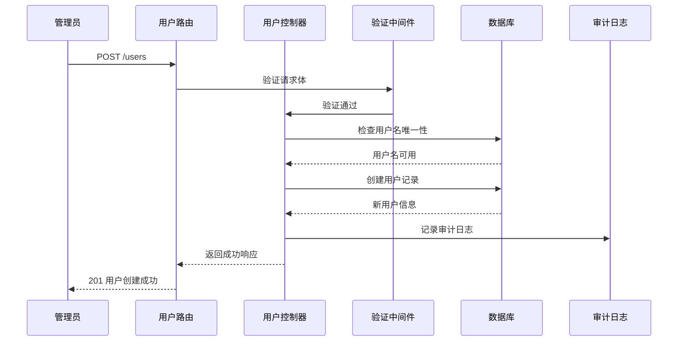

**图表来源**
- [server/src/controllers/user.controller.js:43-92](file://server/src/controllers/user.controller.js#L43-L92)
- [server/src/routes/user.routes.js](file://server/src/routes/user.routes.js#L30)

#### 密码修改流程

密码修改功能确保用户能够安全地更新自己的密码：

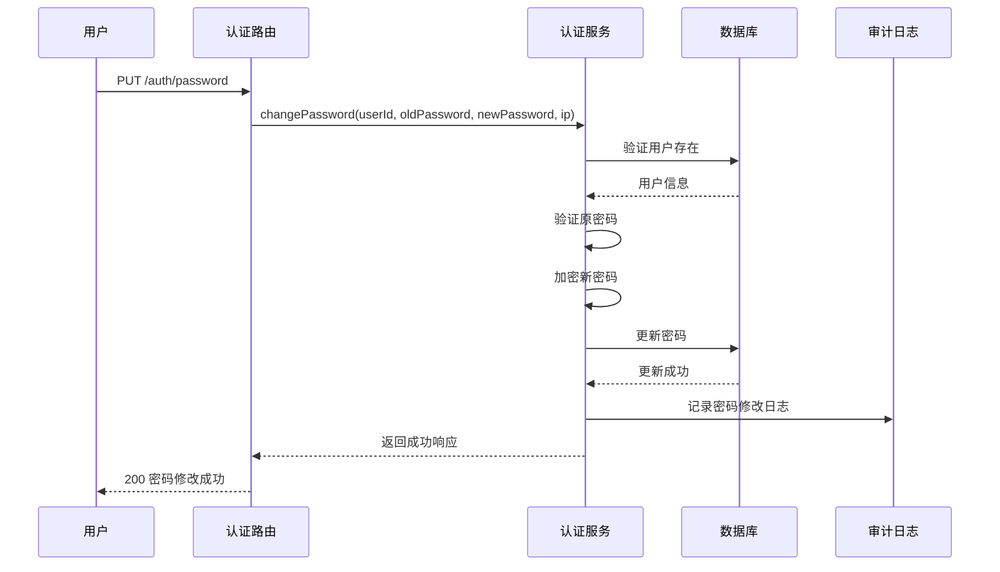

**图表来源**
- [server/src/services/auth.service.js:157-197](file://server/src/services/auth.service.js#L157-L197)
- [server/src/routes/auth.routes.js:154-178](file://server/src/routes/auth.routes.js#L154-L178)

#### 账户状态管理

账户状态管理功能允许管理员控制用户的激活状态：

**章节来源**
- [server/src/controllers/user.controller.js:162-206](file://server/src/controllers/user.controller.js#L162-L206)
- [server/src/services/auth.service.js:157-197](file://server/src/services/auth.service.js#L157-L197)

### 认证中间件工作原理

认证中间件是系统安全的核心组件，负责拦截HTTP请求并验证用户身份：

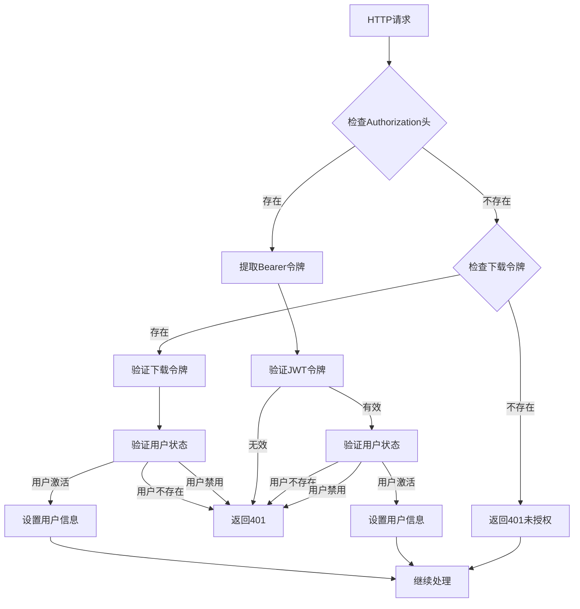

**图表来源**
- [server/src/middleware/auth.middleware.js:40-106](file://server/src/middleware/auth.middleware.js#L40-L106)

#### 安全防护措施

系统实施了多层次的安全防护措施：

| 安全措施 | 实现方式 | 防护效果 |
|----------|----------|----------|
| JWT令牌 | 独立密钥管理 | 防止令牌伪造 |
| 用户状态缓存 | 30秒TTL缓存 | 防止状态绕过 |
| 速率限制 | IP和用户级别限制 | 防止暴力破解 |
| XSS防护 | 输入过滤和转义 | 防止跨站脚本攻击 |
| 审计日志 | 所有关键操作记录 | 可追溯性 |

**章节来源**
- [server/src/middleware/auth.middleware.js:1-129](file://server/src/middleware/auth.middleware.js#L1-L129)
- [server/src/routes/auth.routes.js:14-57](file://server/src/routes/auth.routes.js#L14-L57)

## 依赖关系分析

用户管理模块的依赖关系清晰，遵循单一职责原则：

```mermaid
graph TB
subgraph "外部依赖"
Express[Express框架]
JWT[jsonwebtoken]
Bcrypt[bcryptjs]
Prisma[@prisma/client]
RateLimit[express-rate-limit]
end
subgraph "内部模块"
AuthController[认证控制器]
UserController[用户控制器]
AuthMiddleware[认证中间件]
RoleMiddleware[角色中间件]
AuthService[认证服务]
UserService[用户服务]
AuthConfig[认证配置]
ErrorUtils[错误工具]
ResponseUtils[响应工具]
end
Express --> AuthController
Express --> UserController
AuthController --> AuthMiddleware
UserController --> RoleMiddleware
AuthMiddleware --> AuthService
RoleMiddleware --> AuthService
AuthService --> AuthConfig
AuthController --> ErrorUtils
UserController --> ErrorUtils
AuthController --> ResponseUtils
UserController --> ResponseUtils
AuthService --> Prisma
AuthController --> Prisma
UserController --> Prisma
```

**图表来源**
- [server/src/controllers/user.controller.js:1-8](file://server/src/controllers/user.controller.js#L1-L8)
- [server/src/services/auth.service.js:1-6](file://server/src/services/auth.service.js#L1-L6)

**章节来源**
- [server/src/controllers/user.controller.js:1-252](file://server/src/controllers/user.controller.js#L1-L252)
- [server/src/services/auth.service.js:1-199](file://server/src/services/auth.service.js#L1-L199)

## 性能考虑

系统在设计时充分考虑了性能优化：

### 缓存策略
- 用户状态缓存：30秒TTL，避免频繁数据库查询
- 自动清理机制：5分钟定期清理过期缓存
- 主动失效：用户状态变更时立即清除缓存

### 数据库优化
- 索引优化：关键字段建立复合索引
- 查询优化：按需选择字段，避免N+1查询
- 连接池：Prisma连接池管理

### 安全性能
- 令牌验证：内存中验证，避免数据库查询
- 速率限制：基于IP和用户级别的智能限流
- 缓存穿透防护：空用户状态显式存储

## 故障排除指南

### 常见问题及解决方案

#### 登录失败
**症状**：用户无法登录系统
**可能原因**：
- 用户名或密码错误
- 账户被禁用
- 服务器配置问题

**解决步骤**：
1. 检查用户名和密码是否正确
2. 确认账户状态为激活
3. 验证JWT密钥配置
4. 查看服务器日志

#### 权限不足
**症状**：访问受保护资源时返回403
**可能原因**：
- 用户角色权限不足
- 令牌过期
- 缓存状态不同步

**解决步骤**：
1. 检查用户角色是否正确
2. 刷新访问令牌
3. 清除浏览器缓存
4. 重新登录系统

#### 令牌过期
**症状**：API请求返回401
**可能原因**：
- 访问令牌过期
- 刷新令牌无效
- 时间同步问题

**解决步骤**：
1. 使用刷新令牌获取新访问令牌
2. 检查系统时间同步
3. 验证令牌配置
4. 清除浏览器Cookie

**章节来源**
- [server/src/utils/error.js:1-58](file://server/src/utils/error.js#L1-L58)
- [server/src/middleware/auth.middleware.js:1-129](file://server/src/middleware/auth.middleware.js#L1-L129)

## 结论

用户管理模块通过精心设计的架构和严格的安全措施，为KEC课程管理平台提供了可靠的身份认证和权限控制能力。系统的主要优势包括：

1. **多层次安全防护**：JWT令牌、用户状态缓存、速率限制等多重安全机制
2. **灵活的权限控制**：三级权限模型支持不同的管理需求
3. **完整的生命周期管理**：从创建到删除的全流程管理
4. **高性能设计**：缓存机制和数据库优化确保系统性能
5. **完善的审计日志**：所有关键操作都有详细记录

该模块为系统的稳定运行和安全管理奠定了坚实基础，为后续功能扩展提供了良好的架构支撑。