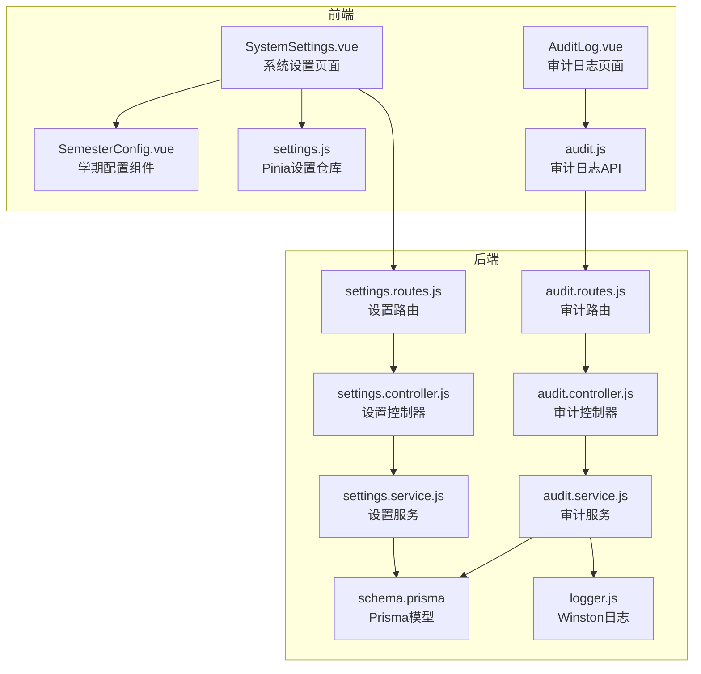
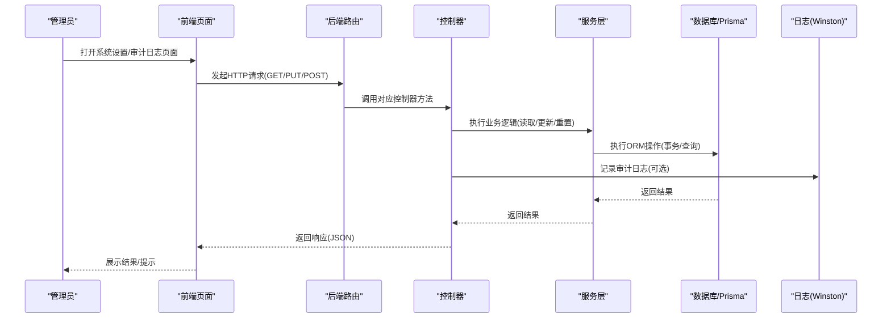
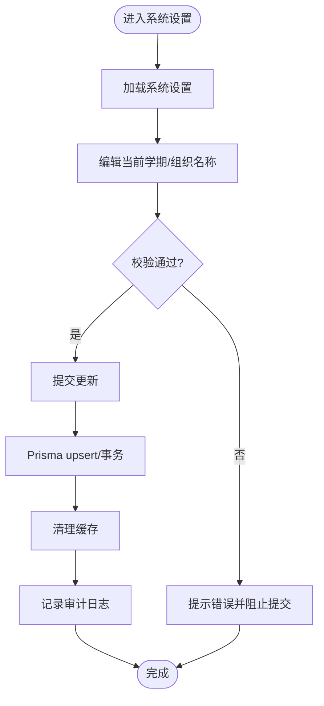
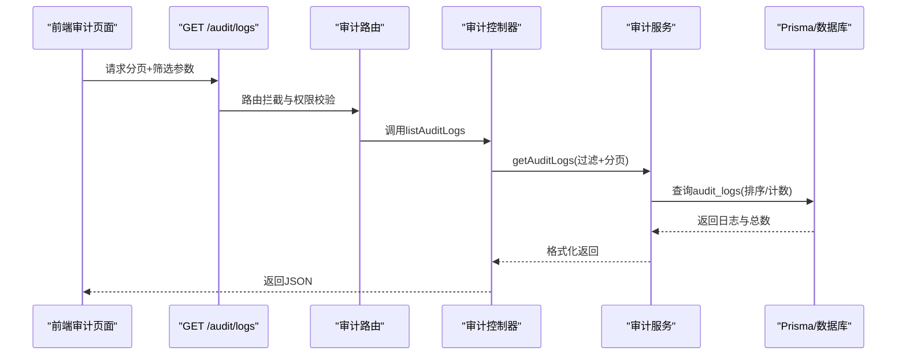
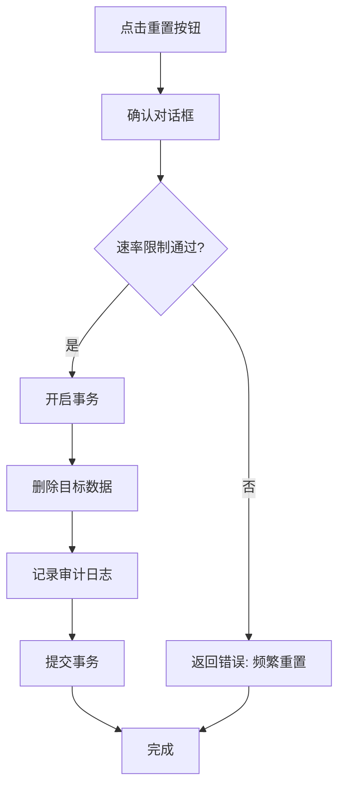
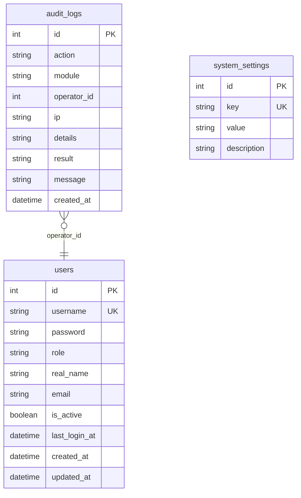
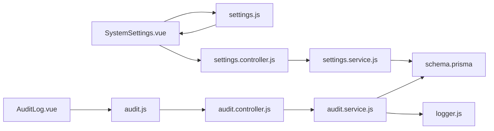

# 系统管理模块

<cite>
**本文引用的文件**
- [SystemSettings.vue](file://client/src/views/settings/SystemSettings.vue)
- [AuditLog.vue](file://client/src/views/system/AuditLog.vue)
- [SemesterConfig.vue](file://client/src/views/settings/components/SemesterConfig.vue)
- [settings.controller.js](file://server/src/controllers/settings.controller.js)
- [settings.service.js](file://server/src/services/settings.service.js)
- [audit.controller.js](file://server/src/controllers/audit.controller.js)
- [audit.service.js](file://server/src/services/audit.service.js)
- [audit.js](file://client/src/api/audit.js)
- [settings.routes.js](file://server/src/routes/settings.routes.js)
- [audit.routes.js](file://server/src/routes/audit.routes.js)
- [logger.js](file://server/src/utils/logger.js)
- [index.js](file://server/src/constants/index.js)
- [schema.prisma](file://server/prisma/schema.prisma)
- [settings.js](file://client/src/stores/settings.js)
</cite>

## 目录
1. [简介](#简介)
2. [项目结构](#项目结构)
3. [核心组件](#核心组件)
4. [架构总览](#架构总览)
5. [详细组件分析](#详细组件分析)
6. [依赖关系分析](#依赖关系分析)
7. [性能考量](#性能考量)
8. [故障排查指南](#故障排查指南)
9. [结论](#结论)
10. [附录](#附录)

## 简介
本文件面向系统管理员与运维工程师，系统性梳理“系统管理模块”的配置管理、审计日志、数据重置与系统监控能力。重点覆盖：
- 系统参数配置与学期设置
- 审计日志的记录机制、查询过滤与数据保留策略
- 数据备份与恢复的建议流程
- 系统性能监控指标、错误日志收集与告警通知

## 项目结构
系统管理模块由前后端协同实现：
- 前端负责用户界面与交互，包括系统设置页面、学期配置组件、审计日志查询页面
- 后端提供REST接口、业务控制器、服务层与数据库模型，保障配置持久化、审计日志落盘与重置操作的原子性

图表来源
- [SystemSettings.vue:1-258](file://client/src/views/settings/SystemSettings.vue#L1-L258)
- [AuditLog.vue:1-449](file://client/src/views/system/AuditLog.vue#L1-L449)
- [SemesterConfig.vue:1-364](file://client/src/views/settings/components/SemesterConfig.vue#L1-L364)
- [settings.controller.js:1-445](file://server/src/controllers/settings.controller.js#L1-L445)
- [audit.controller.js:1-22](file://server/src/controllers/audit.controller.js#L1-L22)
- [settings.routes.js:1-63](file://server/src/routes/settings.routes.js#L1-L63)
- [audit.routes.js:1-14](file://server/src/routes/audit.routes.js#L1-L14)
- [settings.service.js:1-124](file://server/src/services/settings.service.js#L1-L124)
- [audit.service.js:1-94](file://server/src/services/audit.service.js#L1-L94)
- [schema.prisma:1-308](file://server/prisma/schema.prisma#L1-L308)
- [logger.js:1-96](file://server/src/utils/logger.js#L1-L96)

章节来源
- [SystemSettings.vue:1-258](file://client/src/views/settings/SystemSettings.vue#L1-L258)
- [AuditLog.vue:1-449](file://client/src/views/system/AuditLog.vue#L1-L449)
- [SemesterConfig.vue:1-364](file://client/src/views/settings/components/SemesterConfig.vue#L1-L364)
- [settings.controller.js:1-445](file://server/src/controllers/settings.controller.js#L1-L445)
- [audit.controller.js:1-22](file://server/src/controllers/audit.controller.js#L1-L22)
- [settings.routes.js:1-63](file://server/src/routes/settings.routes.js#L1-L63)
- [audit.routes.js:1-14](file://server/src/routes/audit.routes.js#L1-L14)
- [settings.service.js:1-124](file://server/src/services/settings.service.js#L1-L124)
- [audit.service.js:1-94](file://server/src/services/audit.service.js#L1-L94)
- [schema.prisma:1-308](file://server/prisma/schema.prisma#L1-L308)
- [logger.js:1-96](file://server/src/utils/logger.js#L1-L96)

## 核心组件
- 系统设置页面：提供学期配置、组织名称设置、数据重置入口与确认对话框
- 学期配置组件：选择当前学期、组织名称输入、学期预览与保存按钮
- 审计日志页面：支持按操作类型、模块、结果筛选，分页查询与详情查看
- 设置控制器与服务：负责系统参数读取/更新、初始化、重置操作与审计日志记录
- 审计控制器与服务：负责审计日志的创建与查询，带详情截断与上限保护
- 日志工具：基于Winston统一输出错误日志与审计日志文件

章节来源
- [SystemSettings.vue:1-258](file://client/src/views/settings/SystemSettings.vue#L1-L258)
- [SemesterConfig.vue:1-364](file://client/src/views/settings/components/SemesterConfig.vue#L1-L364)
- [AuditLog.vue:1-449](file://client/src/views/system/AuditLog.vue#L1-L449)
- [settings.controller.js:1-445](file://server/src/controllers/settings.controller.js#L1-L445)
- [audit.controller.js:1-22](file://server/src/controllers/audit.controller.js#L1-L22)
- [audit.service.js:1-94](file://server/src/services/audit.service.js#L1-L94)
- [logger.js:1-96](file://server/src/utils/logger.js#L1-L96)

## 架构总览
系统管理模块遵循“前端页面 + 路由中间件 + 控制器 + 服务 + 数据库模型”的分层设计，强调：
- 权限控制：仅超级管理员可进行系统设置与重置操作
- 事务保证：重置类操作在数据库事务中执行，确保一致性
- 审计留痕：所有重要操作均记录审计日志，含详情与结果
- 防御性校验：学期格式解析、分页上限、速率限制等

图表来源
- [settings.routes.js:1-63](file://server/src/routes/settings.routes.js#L1-L63)
- [audit.routes.js:1-14](file://server/src/routes/audit.routes.js#L1-L14)
- [settings.controller.js:1-445](file://server/src/controllers/settings.controller.js#L1-L445)
- [audit.controller.js:1-22](file://server/src/controllers/audit.controller.js#L1-L22)
- [audit.service.js:1-94](file://server/src/services/audit.service.js#L1-L94)
- [logger.js:1-96](file://server/src/utils/logger.js#L1-L96)

## 详细组件分析

### 系统参数配置与学期设置
- 配置项
  - 当前学期：YYYY-YYYY-N格式（学年起止年与学期索引）
  - 组织名称：用于登录页展示
- 前端交互
  - 学期选择器支持预览当前学期标签与生效状态
  - 保存时弹出确认对话框，避免误操作
- 后端校验与持久化
  - 仅允许指定键更新
  - 学期格式统一解析与校验，非法值拒绝入库
  - 更新后清理相关缓存，确保读取最新值
- 审计留痕
  - 成功/失败均记录审计日志，包含操作人、IP、详情与结果

图表来源
- [SystemSettings.vue:75-102](file://client/src/views/settings/SystemSettings.vue#L75-L102)
- [SemesterConfig.vue:145-158](file://client/src/views/settings/components/SemesterConfig.vue#L145-L158)
- [settings.controller.js:71-126](file://server/src/controllers/settings.controller.js#L71-L126)
- [settings.service.js:19-41](file://server/src/services/settings.service.js#L19-L41)

章节来源
- [SystemSettings.vue:55-102](file://client/src/views/settings/SystemSettings.vue#L55-L102)
- [SemesterConfig.vue:145-158](file://client/src/views/settings/components/SemesterConfig.vue#L145-L158)
- [settings.controller.js:71-126](file://server/src/controllers/settings.controller.js#L71-L126)
- [settings.service.js:19-41](file://server/src/services/settings.service.js#L19-L41)

### 审计日志记录与查询
- 记录机制
  - 服务层统一创建审计日志，对详情进行序列化与长度截断，防止表膨胀
  - 失败场景使用Winston记录错误，便于生产环境监控与告警
- 查询过滤
  - 支持按操作类型、模块、结果三类维度筛选
  - 分页参数安全上限保护，避免过大请求
- 数据保留策略
  - 提供清空审计日志接口，清空前写入本次清空记录，确保可追溯
  - 日志文件按大小与数量滚动，生产环境建议结合外部日志平台集中采集

图表来源
- [audit.routes.js:1-14](file://server/src/routes/audit.routes.js#L1-L14)
- [audit.controller.js:7-21](file://server/src/controllers/audit.controller.js#L7-L21)
- [audit.service.js:60-93](file://server/src/services/audit.service.js#L60-L93)
- [AuditLog.vue:362-385](file://client/src/views/system/AuditLog.vue#L362-L385)

章节来源
- [audit.controller.js:7-21](file://server/src/controllers/audit.controller.js#L7-L21)
- [audit.service.js:15-49](file://server/src/services/audit.service.js#L15-L49)
- [audit.service.js:60-93](file://server/src/services/audit.service.js#L60-L93)
- [AuditLog.vue:15-64](file://client/src/views/system/AuditLog.vue#L15-L64)
- [AuditLog.vue:362-385](file://client/src/views/system/AuditLog.vue#L362-L385)

### 数据重置与系统监控
- 数据重置
  - 提供多种粒度的清空操作（基础数据、专业、学院、层次、课程、教材、班级、教师、培养方案、系统）
  - 所有重置在数据库事务中执行，失败时记录审计日志
  - 重置接口具备速率限制，防止滥用
- 系统监控
  - 使用Winston统一输出错误日志与审计日志文件，便于集中采集与告警
  - 建议结合外部日志平台与指标系统，建立告警规则

图表来源
- [settings.routes.js:26-35](file://server/src/routes/settings.routes.js#L26-L35)
- [settings.controller.js:169-194](file://server/src/controllers/settings.controller.js#L169-L194)
- [settings.controller.js:360-412](file://server/src/controllers/settings.controller.js#L360-L412)
- [logger.js:33-85](file://server/src/utils/logger.js#L33-L85)

章节来源
- [settings.routes.js:26-35](file://server/src/routes/settings.routes.js#L26-L35)
- [settings.controller.js:169-194](file://server/src/controllers/settings.controller.js#L169-L194)
- [settings.controller.js:360-412](file://server/src/controllers/settings.controller.js#L360-L412)
- [logger.js:33-85](file://server/src/utils/logger.js#L33-L85)

### 数据模型与索引
审计日志与系统设置等核心实体定义如下：

图表来源
- [schema.prisma:10-26](file://server/prisma/schema.prisma#L10-L26)
- [schema.prisma:149-154](file://server/prisma/schema.prisma#L149-L154)
- [schema.prisma:213-227](file://server/prisma/schema.prisma#L213-L227)

章节来源
- [schema.prisma:10-26](file://server/prisma/schema.prisma#L10-L26)
- [schema.prisma:149-154](file://server/prisma/schema.prisma#L149-L154)
- [schema.prisma:213-227](file://server/prisma/schema.prisma#L213-L227)

## 依赖关系分析
- 前端依赖
  - Pinia状态管理：settings.js提供系统设置的加载与保存
  - Element Plus组件：用于表单、表格、分页与对话框
  - 自定义API封装：audit.js封装审计日志查询
- 后端依赖
  - Prisma ORM：统一数据访问与事务控制
  - Winston日志：统一错误与审计日志输出
  - 中间件：认证、权限、速率限制、XSS清洗、分页校验

图表来源
- [SystemSettings.vue:1-258](file://client/src/views/settings/SystemSettings.vue#L1-L258)
- [AuditLog.vue:1-449](file://client/src/views/system/AuditLog.vue#L1-L449)
- [settings.js:1-57](file://client/src/stores/settings.js#L1-L57)
- [audit.js:1-4](file://client/src/api/audit.js#L1-L4)
- [settings.controller.js:1-445](file://server/src/controllers/settings.controller.js#L1-L445)
- [audit.controller.js:1-22](file://server/src/controllers/audit.controller.js#L1-L22)
- [settings.service.js:1-124](file://server/src/services/settings.service.js#L1-L124)
- [audit.service.js:1-94](file://server/src/services/audit.service.js#L1-L94)
- [schema.prisma:1-308](file://server/prisma/schema.prisma#L1-L308)
- [logger.js:1-96](file://server/src/utils/logger.js#L1-L96)

章节来源
- [settings.js:1-57](file://client/src/stores/settings.js#L1-L57)
- [audit.js:1-4](file://client/src/api/audit.js#L1-L4)
- [settings.controller.js:1-445](file://server/src/controllers/settings.controller.js#L1-L445)
- [audit.controller.js:1-22](file://server/src/controllers/audit.controller.js#L1-L22)
- [settings.service.js:1-124](file://server/src/services/settings.service.js#L1-L124)
- [audit.service.js:1-94](file://server/src/services/audit.service.js#L1-L94)
- [schema.prisma:1-308](file://server/prisma/schema.prisma#L1-L308)
- [logger.js:1-96](file://server/src/utils/logger.js#L1-L96)

## 性能考量
- 学期信息缓存
  - 设置服务对当前学期进行TTL缓存，减少重复查询压力
- 分页与上限
  - 审计日志查询对每页数量做上限保护，避免大页请求导致数据库压力
- 事务与索引
  - 重置操作在事务中执行，确保一致性；数据库对常用字段建立索引，提升查询效率
- 日志滚动
  - Winston按大小与数量滚动日志文件，避免磁盘膨胀

章节来源
- [settings.service.js:4-17](file://server/src/services/settings.service.js#L4-L17)
- [audit.service.js:67-77](file://server/src/services/audit.service.js#L67-L77)
- [schema.prisma:22-26](file://server/prisma/schema.prisma#L22-L26)

## 故障排查指南
- 审计日志无法写入
  - 检查Winston日志文件是否可写，确认日志目录存在
  - 查看审计服务中的错误日志记录，定位序列化或长度截断问题
- 重置操作失败
  - 查看事务回滚原因，确认是否存在外键约束或依赖数据
  - 检查速率限制是否触发，等待冷却时间
- 学期设置无效
  - 确认前端输入格式符合YYYY-YYYY-N，后端解析通过
  - 检查缓存是否已失效，必要时手动刷新页面

章节来源
- [logger.js:8-12](file://server/src/utils/logger.js#L8-L12)
- [audit.service.js:37-48](file://server/src/services/audit.service.js#L37-L48)
- [settings.controller.js:169-194](file://server/src/controllers/settings.controller.js#L169-L194)
- [settings.controller.js:83-88](file://server/src/controllers/settings.controller.js#L83-L88)

## 结论
系统管理模块通过清晰的前后端分工、严格的权限与事务控制、完善的审计留痕与日志体系，为系统配置管理、审计查询与数据重置提供了可靠支撑。建议在生产环境中配合外部日志与监控平台，建立完善的告警与巡检机制，确保系统的稳定性与可追溯性。

## 附录
- 常量定义参考
  - 审计模块与动作、分页常量、默认学期等
- 数据备份与恢复建议
  - 使用Prisma迁移与快照工具定期备份数据库
  - 重置操作属于高风险操作，建议在维护窗口执行，并提前做好数据备份

章节来源
- [index.js:42-129](file://server/src/constants/index.js#L42-L129)