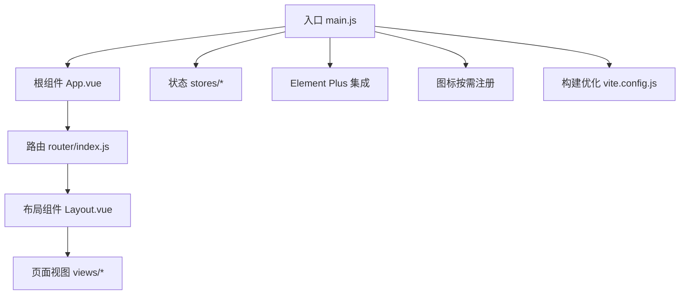
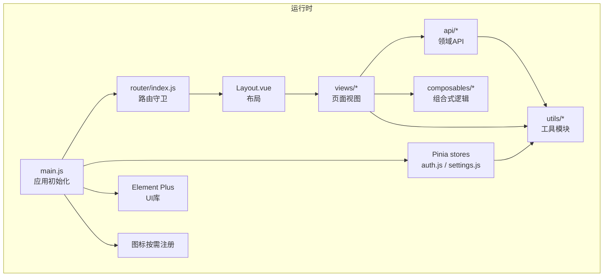
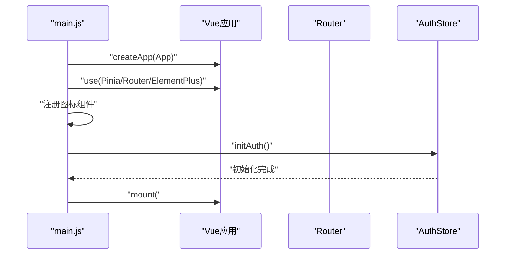
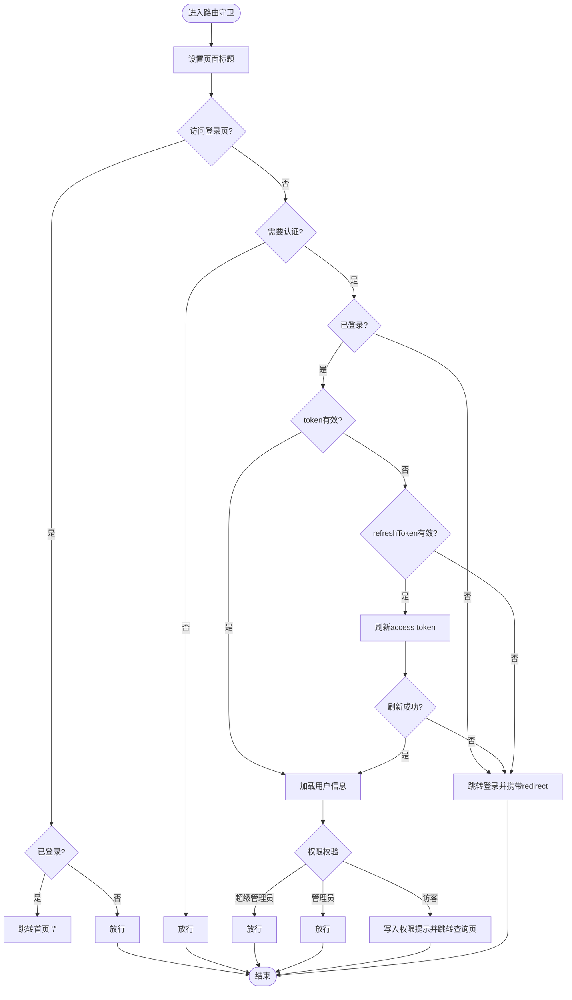
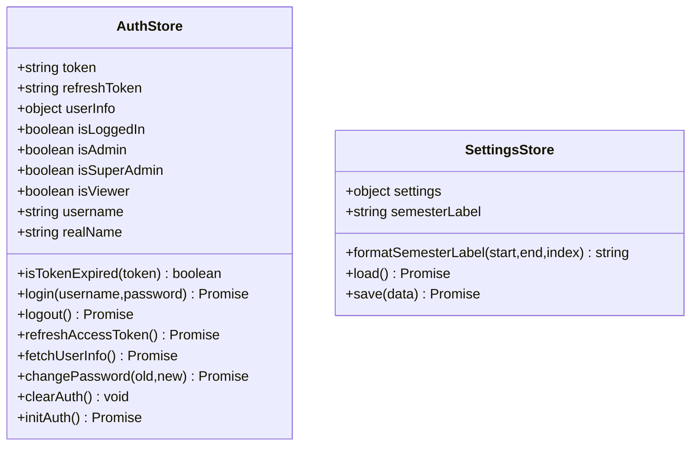
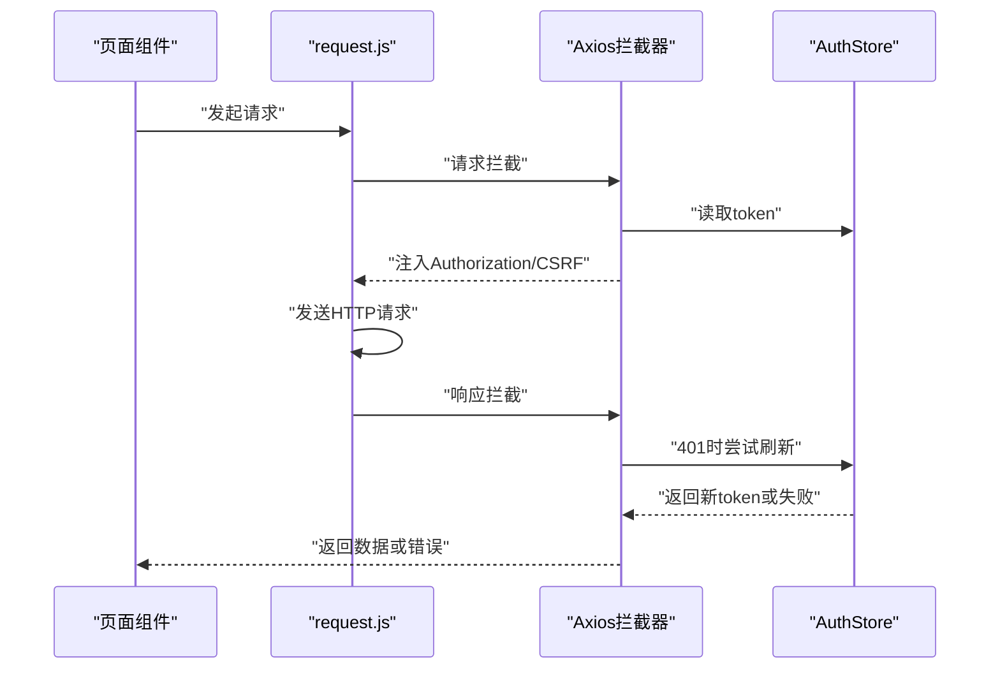
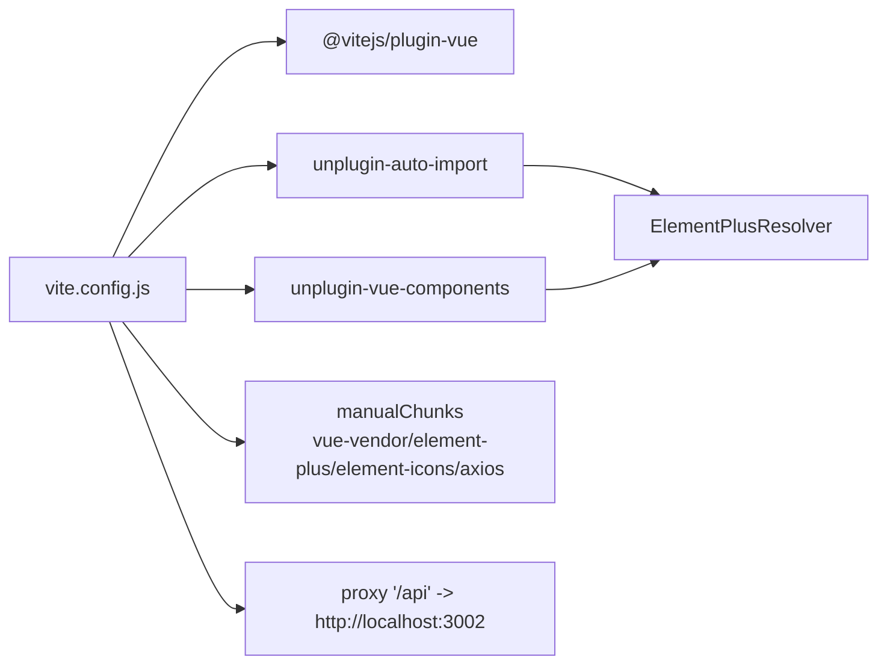

# 前端架构

<cite>
**本文引用的文件**
- [main.js](file://client/src/main.js)
- [App.vue](file://client/src/App.vue)
- [router/index.js](file://client/src/router/index.js)
- [stores/auth.js](file://client/src/stores/auth.js)
- [stores/settings.js](file://client/src/stores/settings.js)
- [utils/request.js](file://client/utils/request.js)
- [components/Layout.vue](file://client/src/components/Layout.vue)
- [views/Login.vue](file://client/src/views/Login.vue)
- [api/course.js](file://client/src/api/course.js)
- [composables/useCrudList.js](file://client/src/composables/useCrudList.js)
- [utils/cache.js](file://client/src/utils/cache.js)
- [utils/personnel.js](file://client/src/utils/personnel.js)
- [styles/global.css](file://client/src/styles/global.css)
- [vite.config.js](file://client/vite.config.js)
- [package.json](file://client/package.json)
</cite>

## 目录
1. [简介](#简介)
2. [项目结构](#项目结构)
3. [核心组件](#核心组件)
4. [架构总览](#架构总览)
5. [组件与模块详解](#组件与模块详解)
6. [依赖关系分析](#依赖关系分析)
7. [性能考量](#性能考量)
8. [故障排查指南](#故障排查指南)
9. [结论](#结论)
10. [附录](#附录)

## 简介
本文件面向KEC课程管理平台前端，系统性阐述基于Vue 3的单页应用架构设计与实现要点，覆盖组件化理念、Pinia状态管理、Vue Router路由体系、Element Plus集成与图标按需加载、API交互模式、构建与开发环境配置等。文档以“从入口到挂载”的主线贯穿，帮助开发者快速理解并高效扩展系统。

## 项目结构
客户端位于client目录，采用“按功能域分层 + 组件化”的组织方式：
- src
  - api：按领域划分的API封装（如课程、班级、教师等）
  - components：可复用布局与通用组件（如Layout、弹窗等）
  - composables：可复用组合式逻辑（如CRUD、排序、矩阵计算等）
  - router：路由定义与全局前置守卫
  - stores：Pinia状态仓库（认证、系统设置等）
  - utils：工具模块（HTTP请求、缓存、Cookie、人员类型映射等）
  - views：页面视图（登录、仪表盘、各类管理与查询页面）
  - styles：全局样式
  - main.js：应用入口
  - App.vue：根组件
- 构建与开发：vite.config.js、package.json、Dockerfile、nginx.conf等

图表来源
- [main.js:1-115](file://client/src/main.js#L1-L115)
- [App.vue:1-4](file://client/src/App.vue#L1-L4)
- [router/index.js:1-244](file://client/src/router/index.js#L1-L244)
- [components/Layout.vue:1-369](file://client/src/components/Layout.vue#L1-L369)

章节来源
- [main.js:1-115](file://client/src/main.js#L1-L115)
- [vite.config.js:1-56](file://client/vite.config.js#L1-L56)
- [package.json:1-33](file://client/package.json#L1-L33)

## 核心组件
- 应用入口与初始化
  - 创建Vue应用实例、安装插件（Pinia、Router、Element Plus）、注册图标组件、初始化认证态并挂载
- 根组件与路由出口
  - 根组件仅包含路由出口，具体页面由路由驱动
- 布局与导航
  - Layout提供侧边菜单、头部信息、底部版权；根据用户角色动态渲染菜单
- 登录页
  - 表单校验、登录流程、重定向与开发环境账号提示
- 状态管理
  - 认证状态（token、refreshToken、用户信息、权限）、系统设置（学期标签等）
- 请求与拦截
  - Axios实例封装、请求/响应拦截、Token刷新、错误统一处理
- 工具与组合式逻辑
  - CRUD通用逻辑、缓存工具、人员类型映射、全局样式

章节来源
- [main.js:1-115](file://client/src/main.js#L1-L115)
- [App.vue:1-4](file://client/src/App.vue#L1-L4)
- [components/Layout.vue:1-369](file://client/src/components/Layout.vue#L1-L369)
- [views/Login.vue:1-411](file://client/src/views/Login.vue#L1-L411)
- [stores/auth.js:1-222](file://client/src/stores/auth.js#L1-L222)
- [stores/settings.js:1-57](file://client/src/stores/settings.js#L1-L57)
- [utils/request.js:1-145](file://client/src/utils/request.js#L1-L145)
- [composables/useCrudList.js:1-121](file://client/src/composables/useCrudList.js#L1-L121)
- [utils/cache.js:1-122](file://client/src/utils/cache.js#L1-L122)
- [utils/personnel.js:1-11](file://client/src/utils/personnel.js#L1-L11)
- [styles/global.css:1-204](file://client/src/styles/global.css#L1-L204)

## 架构总览
前端采用“入口初始化 → 路由守卫 → 布局与页面 → 状态与API”的清晰分层：
- 入口负责插件安装、图标注册、认证初始化与挂载
- 路由负责鉴权、权限校验、页面标题与重定向
- 布局负责菜单、头部信息、侧边栏折叠与响应式
- 页面视图通过组合式逻辑与API模块进行数据交互
- Pinia提供跨组件共享状态（认证、设置）
- Axios统一处理请求/响应、Token刷新与错误提示

图表来源
- [main.js:1-115](file://client/src/main.js#L1-L115)
- [router/index.js:1-244](file://client/src/router/index.js#L1-L244)
- [stores/auth.js:1-222](file://client/src/stores/auth.js#L1-L222)
- [stores/settings.js:1-57](file://client/src/stores/settings.js#L1-L57)
- [components/Layout.vue:1-369](file://client/src/components/Layout.vue#L1-L369)
- [api/course.js:1-7](file://client/src/api/course.js#L1-L7)
- [composables/useCrudList.js:1-121](file://client/src/composables/useCrudList.js#L1-L121)
- [utils/request.js:1-145](file://client/src/utils/request.js#L1-L145)

## 组件与模块详解

### 入口与初始化流程（main.js）
- 创建应用实例与Pinia、Router、Element Plus
- 注册Element Plus中文语言包
- 图标按需注册：仅注册实际使用的36个图标，避免全量引入
- 初始化认证状态（异步），完成后挂载DOM
- 全局错误与警告处理器（开发环境）

图表来源
- [main.js:1-115](file://client/src/main.js#L1-L115)
- [stores/auth.js:181-200](file://client/src/stores/auth.js#L181-L200)

章节来源
- [main.js:1-115](file://client/src/main.js#L1-L115)

### 路由与权限控制（router/index.js）
- 路由结构：登录页、带Layout的主路由、多级子路由、404兜底
- 全局前置守卫：
  - 设置页面标题
  - 登录页特殊处理（已登录跳首页）
  - 鉴权：未登录跳转登录，携带redirect参数
  - Token过期处理：优先使用refreshToken刷新，失败则清空并跳转登录
  - 用户信息加载：确保userInfo可用
  - 权限校验：requiresSuperAdmin、requiresAdmin
  - 异常安全降级：捕获错误跳转登录，避免白屏

图表来源
- [router/index.js:151-241](file://client/src/router/index.js#L151-L241)

章节来源
- [router/index.js:1-244](file://client/src/router/index.js#L1-L244)

### 布局与导航（components/Layout.vue）
- 侧边菜单：根据用户角色动态渲染；支持折叠与响应式
- 头部区域：显示当前学期标签、用户信息与下拉菜单（修改密码、退出登录）
- 页脚：显示版本号
- 异步加载修改密码对话框，减少首屏体积
- 响应式布局：窗口尺寸变化时自动调整侧边栏折叠状态

章节来源
- [components/Layout.vue:1-369](file://client/src/components/Layout.vue#L1-L369)

### 登录页（views/Login.vue）
- 表单校验：用户名必填、密码长度不少于8位
- 登录流程：调用AuthStore.login，成功后根据redirect参数安全跳转
- 开发环境展示测试账号提示
- 加载系统设置中的机构名称作为欢迎语

章节来源
- [views/Login.vue:1-411](file://client/src/views/Login.vue#L1-L411)

### 状态管理（Pinia）
- 认证仓库（auth.js）
  - 状态：token、refreshToken、userInfo、角色计算属性
  - 方法：登录、登出、刷新Token、获取用户信息、修改密码、初始化认证
  - 安全性：Token过期判断、本地存储异常容错、登出清理Cookie与缓存
- 系统设置仓库（settings.js）
  - 加载系统设置，格式化学期标签，提供保存方法

图表来源
- [stores/auth.js:8-222](file://client/src/stores/auth.js#L8-L222)
- [stores/settings.js:5-57](file://client/src/stores/settings.js#L5-L57)

章节来源
- [stores/auth.js:1-222](file://client/src/stores/auth.js#L1-L222)
- [stores/settings.js:1-57](file://client/src/stores/settings.js#L1-L57)

### 请求与拦截（utils/request.js）
- Axios实例：baseURL指向/api，开启withCredentials，统一JSON头
- 请求拦截：自动附加Authorization与CSRF Token
- 响应拦截：
  - 业务失败统一提示并拒绝
  - 401处理：排除认证接口，入队重试，刷新Token后重发
  - 403权限不足提示
  - 其他错误分类提示（400/404/500/502/503/超时/网络异常）

图表来源
- [utils/request.js:17-142](file://client/src/utils/request.js#L17-L142)
- [stores/auth.js:106-128](file://client/src/stores/auth.js#L106-L128)

章节来源
- [utils/request.js:1-145](file://client/src/utils/request.js#L1-L145)

### API封装与通用CRUD（api/* 与 composables/useCrudList.js）
- API模块：按领域封装REST接口（如课程增删改查）
- 通用CRUD组合式逻辑：
  - 列表加载、对话框编辑、保存（新增/更新）、删除确认
  - 与排序组合式逻辑协作，支持上下移动
  - 错误提示与静默刷新

章节来源
- [api/course.js:1-7](file://client/src/api/course.js#L1-L7)
- [composables/useCrudList.js:1-121](file://client/src/composables/useCrudList.js#L1-L121)

### 工具与样式
- 缓存工具：LRU风格缓存，定期清理过期条目，支持清理指定键与全部缓存
- 人员类型映射：专职/兼职/外聘标签与样式映射
- 全局样式：卡片、分页、筛选器、批量操作、响应式适配等通用类

章节来源
- [utils/cache.js:1-122](file://client/src/utils/cache.js#L1-L122)
- [utils/personnel.js:1-11](file://client/src/utils/personnel.js#L1-L11)
- [styles/global.css:1-204](file://client/src/styles/global.css#L1-L204)

## 依赖关系分析
- 构建与打包
  - Vite插件：Vue、AutoImport、Components（Element Plus解析器）
  - 资源分包：vue-vendor、element-plus、element-icons、axios独立chunk
  - 依赖预构建：优化首次启动
  - 代理：/api -> 本地后端服务
- 运行时依赖
  - Vue 3、Vue Router、Pinia、Element Plus、Axios
- 开发依赖
  - ESLint、Prettier、unplugin-auto-import、unplugin-vue-components

图表来源
- [vite.config.js:11-55](file://client/vite.config.js#L11-L55)
- [package.json:13-31](file://client/package.json#L13-L31)

章节来源
- [vite.config.js:1-56](file://client/vite.config.js#L1-L56)
- [package.json:1-33](file://client/package.json#L1-L33)

## 性能考量
- 图标按需加载：仅注册实际使用的图标，显著降低包体
- 代码分割：关键第三方库独立chunk，提升缓存命中率
- 依赖预构建：加速冷启动
- 缓存策略：API响应缓存（LRU），减少重复请求
- 响应式与懒加载：布局组件异步加载修改密码对话框，减少首屏负载
- 本地化与国际化：Element Plus中文语言包按需引入，避免全量

章节来源
- [main.js:67-108](file://client/src/main.js#L67-L108)
- [vite.config.js:26-39](file://client/vite.config.js#L26-L39)
- [utils/cache.js:16-48](file://client/src/utils/cache.js#L16-L48)
- [components/Layout.vue:147](file://client/src/components/Layout.vue#L147)

## 故障排查指南
- 登录失败
  - 检查后端接口状态码与消息，确认用户名/密码正确
  - 查看开发控制台网络请求与响应
- 401/403错误
  - 确认Token是否过期，是否触发刷新流程
  - 检查CSRF Token是否正确注入
- 页面空白或白屏
  - 路由守卫异常会安全降级至登录页，查看控制台错误
  - 全局错误处理器会在开发环境打印错误信息
- 权限不足
  - 确认用户角色与页面meta.requiresAdmin/ requiresSuperAdmin匹配
  - 查看权限提示消息与跳转行为
- 退出登录后仍显示数据
  - 确认登出流程调用了清理缓存与Cookie，并重定向登录页

章节来源
- [router/index.js:151-241](file://client/src/router/index.js#L151-L241)
- [utils/request.js:51-142](file://client/src/utils/request.js#L51-L142)
- [stores/auth.js:91-104](file://client/src/stores/auth.js#L91-L104)

## 结论
该前端架构以Vue 3为核心，结合Pinia与Vue Router实现清晰的职责分离与可维护性；通过Element Plus与图标按需加载提升用户体验与包体效率；借助Axios拦截器与缓存工具保障交互稳定性与性能。整体设计兼顾安全性（鉴权、权限、CSRF）、可扩展性（组合式逻辑、API封装）与可维护性（模块化、统一错误处理）。

## 附录
- 开发与构建
  - 开发：npm run dev（Vite热更新，端口5173）
  - 构建：npm run build（生产构建，生成静态资源）
  - 预览：npm run preview
  - 格式化：npm run format
  - 代码检查：npm run lint
- 代理配置
  - /api 代理至 http://localhost:3002（后端服务地址）
- 版本信息
  - 应用版本通过define注入到全局常量，供组件使用

章节来源
- [vite.config.js:46-54](file://client/vite.config.js#L46-L54)
- [package.json:6-12](file://client/package.json#L6-L12)
- [main.js:44](file://client/src/main.js#L44)