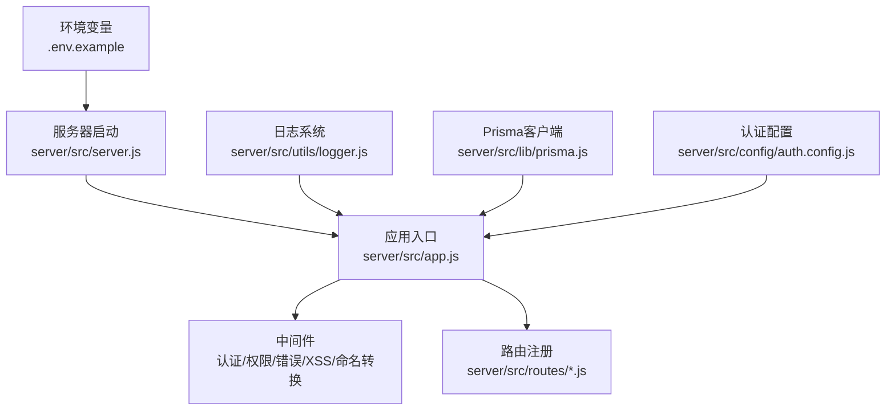
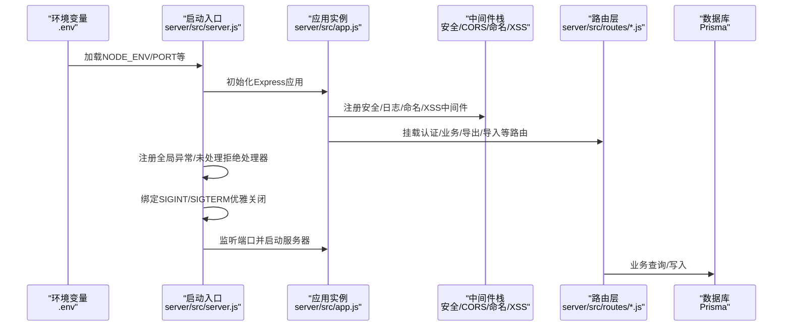
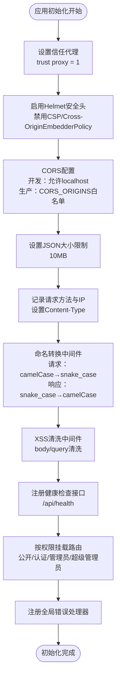
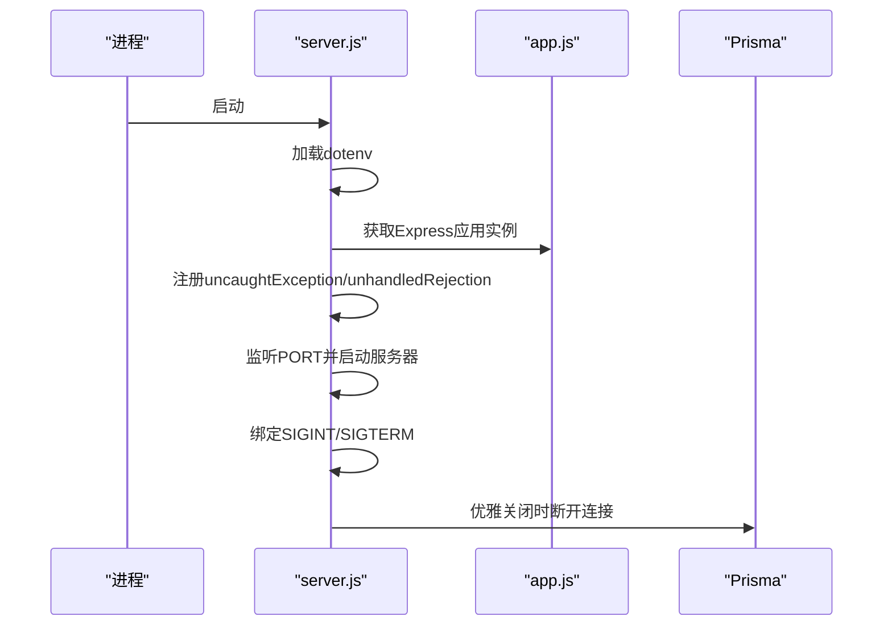
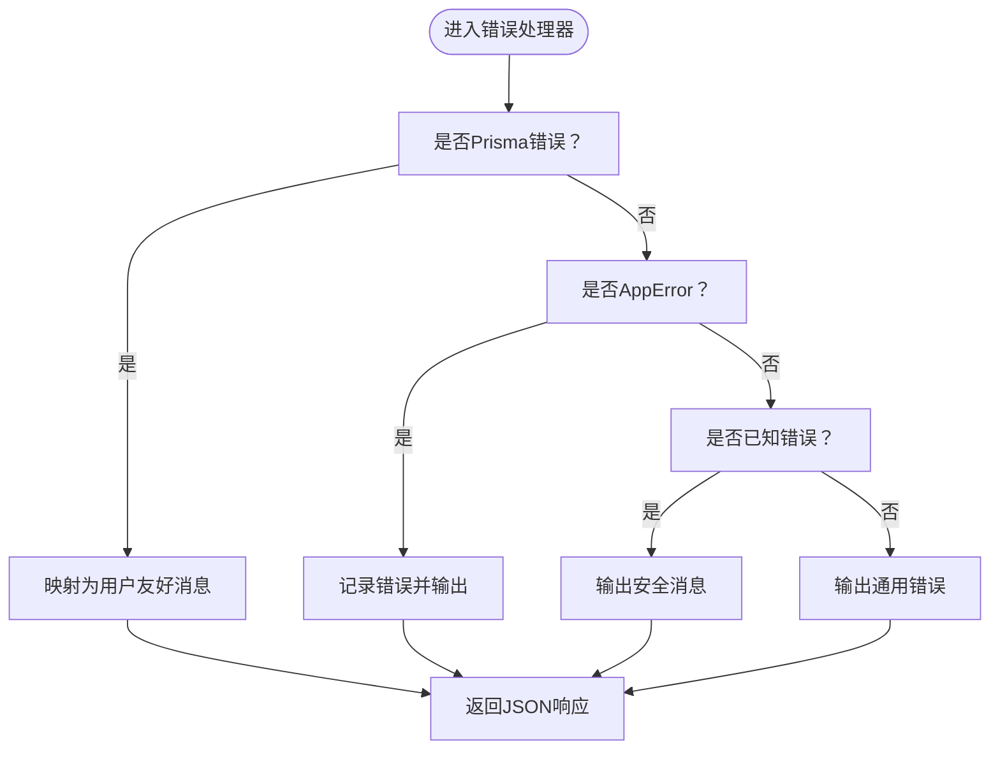
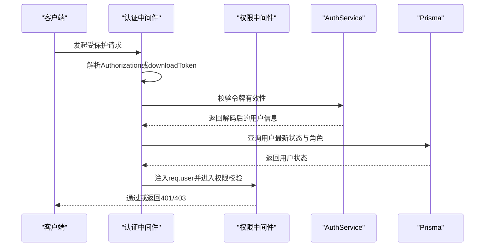
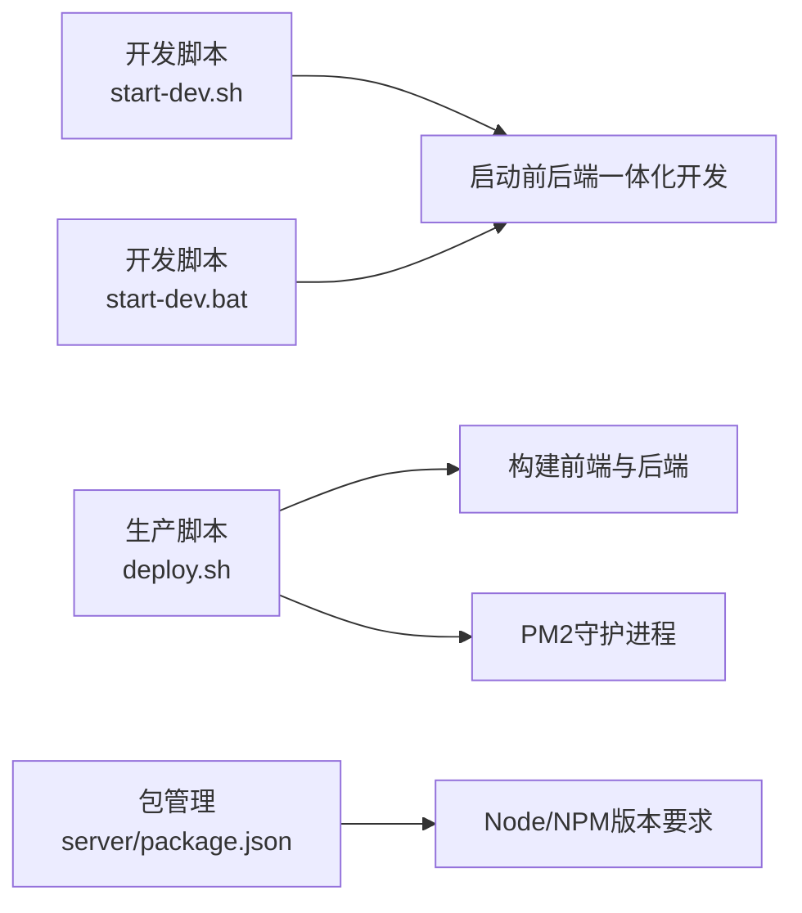

# Express应用配置

<cite>
**本文档引用的文件**
- [server/src/app.js](file://server/src/app.js)
- [server/src/server.js](file://server/src/server.js)
- [server/package.json](file://server/package.json)
- [server/.env.example](file://server/.env.example)
- [server/src/middleware/error.js](file://server/src/middleware/error.js)
- [server/src/middleware/auth.middleware.js](file://server/src/middleware/auth.middleware.js)
- [server/src/utils/logger.js](file://server/src/utils/logger.js)
- [server/src/lib/prisma.js](file://server/src/lib/prisma.js)
- [server/src/config/auth.config.js](file://server/src/config/auth.config.js)
- [server/src/routes/auth.routes.js](file://server/src/routes/auth.routes.js)
- [start-dev.sh](file://start-dev.sh)
- [deploy.sh](file://deploy.sh)
- [start-dev.bat](file://start-dev.bat)
</cite>

## 目录
1. [简介](#简介)
2. [项目结构](#项目结构)
3. [核心组件](#核心组件)
4. [架构总览](#架构总览)
5. [详细组件分析](#详细组件分析)
6. [依赖关系分析](#依赖关系分析)
7. [性能考虑](#性能考虑)
8. [故障排查指南](#故障排查指南)
9. [结论](#结论)
10. [附录](#附录)

## 简介
本文件面向KEC课程管理平台的Express后端应用，系统性阐述应用入口初始化流程、中间件注册策略、静态资源与环境变量处理、服务器启动与端口配置、开发与生产环境差异、错误处理机制初始化以及性能优化要点。文档同时提供最佳实践与实际代码路径示例，帮助开发者正确配置Express应用以满足平台各项功能需求。

## 项目结构
后端采用模块化分层设计：
- 应用入口与路由：server/src/app.js负责中间件与路由挂载；各业务路由位于server/src/routes/下。
- 中间件：认证、权限、错误处理、命名转换、XSS清洗等位于server/src/middleware/。
- 服务层：业务逻辑封装于server/src/services/，数据访问通过Prisma客户端。
- 配置与工具：认证配置、日志、Prisma客户端、响应封装等位于对应目录。
- 启动与部署：server/src/server.js为服务器启动入口；start-dev.*与deploy.sh提供开发与生产部署脚本。

图表来源
- [server/src/app.js:1-158](file://server/src/app.js#L1-L158)
- [server/src/server.js:1-66](file://server/src/server.js#L1-L66)
- [server/src/utils/logger.js:1-96](file://server/src/utils/logger.js#L1-L96)
- [server/src/lib/prisma.js:1-34](file://server/src/lib/prisma.js#L1-L34)
- [server/src/config/auth.config.js:1-58](file://server/src/config/auth.config.js#L1-L58)

章节来源
- [server/src/app.js:1-158](file://server/src/app.js#L1-L158)
- [server/src/server.js:1-66](file://server/src/server.js#L1-L66)
- [server/package.json:1-53](file://server/package.json#L1-L53)
- [server/.env.example:1-33](file://server/.env.example#L1-L33)

## 核心组件
- 应用实例与中间件栈
  - 安全头：启用Helmet，禁用CSP与跨域嵌入策略以兼容前端资源加载。
  - CORS：根据NODE_ENV动态允许开发环境所有localhost端口，生产环境从CORS_ORIGINS读取白名单。
  - 请求体与日志：JSON限制10MB，统一设置Content-Type，记录请求方法与IP。
  - 命名转换：请求参数camelCase→snake_case，响应snake_case→camelCase。
  - XSS防护：全局清洗body与query参数，敏感字段在中间件内自动跳过。
  - 健康检查：/api/health通过Prisma Raw查询验证数据库连通性。
  - 路由挂载：按权限粒度挂载公开、认证、管理员、超级管理员等路由。
  - 错误处理：统一错误处理器，区分生产与非生产环境的安全消息输出。
- 服务器启动
  - 端口：优先使用环境变量PORT，否则默认3000。
  - 全局异常：未捕获异常与未处理Promise拒绝均记录并退出进程。
  - 优雅关闭：SIGINT/SIGTERM触发，断开Prisma连接，10秒强制退出。
  - keep-alive：设置keepAliveTimeout与headersTimeout，避免空闲连接导致内存泄漏。
- 环境变量与配置
  - .env.example提供开发默认值：NODE_ENV、PORT、DATABASE_URL、JWT密钥、CORS_ORIGINS、LOG_LEVEL、MAX_FILE_SIZE、BCRYPT_ROUNDS、DEFAULT_SEMESTER。
  - 认证配置：从环境变量读取JWT密钥与过期时间，若缺少刷新/下载密钥则使用HKDF派生，生产环境要求独立配置。
- 日志系统
  - Winston统一输出：error.log、combined.log、audit.log，开发环境控制台彩色输出，生产环境无色控制台输出。
  - 日志级别：默认info（生产）或debug（开发），可通过LOG_LEVEL调整。
- 数据库客户端
  - PrismaClient按NODE_ENV配置日志级别；测试环境支持自定义DATABASE_URL。
  - 开发环境监听error/warn事件并记录到日志。

章节来源
- [server/src/app.js:1-158](file://server/src/app.js#L1-L158)
- [server/src/server.js:1-66](file://server/src/server.js#L1-L66)
- [server/.env.example:1-33](file://server/.env.example#L1-L33)
- [server/src/config/auth.config.js:1-58](file://server/src/config/auth.config.js#L1-L58)
- [server/src/utils/logger.js:1-96](file://server/src/utils/logger.js#L1-L96)
- [server/src/lib/prisma.js:1-34](file://server/src/lib/prisma.js#L1-L34)

## 架构总览
下图展示了Express应用从启动到运行的关键交互：dotenv加载环境变量，app.js构建中间件与路由，server.js启动HTTP服务器并注册全局异常处理与优雅关闭逻辑。

图表来源
- [server/src/server.js:1-66](file://server/src/server.js#L1-L66)
- [server/src/app.js:1-158](file://server/src/app.js#L1-L158)
- [server/src/lib/prisma.js:1-34](file://server/src/lib/prisma.js#L1-L34)

## 详细组件分析

### 应用入口初始化流程（app.js）
- 中间件注册顺序与职责
  - Helmet安全头：禁用CSP与跨域嵌入策略以避免与前端资源冲突。
  - CORS：开发环境允许所有localhost端口；生产环境从CORS_ORIGINS读取白名单，未命中记录告警并拒绝。
  - 请求体与日志：设置JSON大小限制、统一Content-Type、记录请求方法与IP。
  - 命名转换：请求参数camelCase→snake_case，响应snake_case→camelCase。
  - XSS清洗：全局清洗body与query，敏感字段在中间件内自动跳过。
  - 健康检查：/api/health通过Prisma Raw查询验证数据库连通性，错误时返回503但不泄露内部细节。
  - 路由挂载：按权限粒度挂载公开、认证、管理员、超级管理员等路由。
  - 错误处理：统一错误处理器，区分生产与非生产环境的安全消息输出。
- 关键实现位置
  - 中间件与路由挂载：[server/src/app.js:34-155](file://server/src/app.js#L34-L155)
  - 健康检查接口：[server/src/app.js:95-113](file://server/src/app.js#L95-L113)

图表来源
- [server/src/app.js:30-155](file://server/src/app.js#L30-L155)

章节来源
- [server/src/app.js:1-158](file://server/src/app.js#L1-L158)

### 服务器启动流程（server.js）
- 环境变量加载：通过dotenv加载.env中的配置。
- 端口配置：优先使用环境变量PORT，否则默认3000。
- 全局异常处理：未捕获异常与未处理Promise拒绝记录日志并退出进程，避免状态损坏。
- 服务器错误处理：端口占用时记录错误并退出。
- 优雅关闭：SIGINT/SIGTERM触发，断开Prisma连接，10秒超时强制退出。
- 性能参数：设置keepAliveTimeout与headersTimeout，避免空闲连接导致内存泄漏。

图表来源
- [server/src/server.js:1-66](file://server/src/server.js#L1-L66)

章节来源
- [server/src/server.js:1-66](file://server/src/server.js#L1-L66)

### 错误处理机制（error.js）
- 错误类型区分
  - Prisma特定错误：唯一约束冲突、外键失败、参数无效、记录不存在等映射为用户友好消息。
  - JWT相关错误：Token过期、无效令牌等统一处理。
  - 自定义应用错误：AppError实例，支持业务错误码与可操作性标记。
  - 未知错误：记录堆栈，生产环境输出通用提示。
- 输出策略
  - 生产环境：隐藏内部细节，仅输出安全消息；非生产环境输出详细信息与堆栈。
  - 状态码：优先使用错误对象状态码，否则回退至500。

图表来源
- [server/src/middleware/error.js:1-63](file://server/src/middleware/error.js#L1-L63)

章节来源
- [server/src/middleware/error.js:1-63](file://server/src/middleware/error.js#L1-L63)

### 认证与权限中间件（auth.middleware.js）
- 用户状态缓存：Map缓存用户角色与激活状态，TTL 30秒，定期清理。
- 下载令牌：支持短期下载令牌（downloadToken），校验用户状态防止被禁用用户绕过。
- 令牌校验：JWT令牌与下载令牌双重校验，用户状态实时查询并注入req.user。
- 权限中间件：基于用户角色的权限控制，未授权与权限不足分别返回401/403。

图表来源
- [server/src/middleware/auth.middleware.js:1-129](file://server/src/middleware/auth.middleware.js#L1-L129)

章节来源
- [server/src/middleware/auth.middleware.js:1-129](file://server/src/middleware/auth.middleware.js#L1-L129)

### 日志系统（logger.js）
- 输出通道：error.log（仅错误）、combined.log（综合日志）、audit.log（审计日志，高频）。
- 开发环境：控制台彩色输出，便于调试。
- 生产环境：控制台无色输出，保证日志可解析性。
- 日志级别：默认info（生产）或debug（开发），可通过LOG_LEVEL调整。

章节来源
- [server/src/utils/logger.js:1-96](file://server/src/utils/logger.js#L1-L96)

### 数据库客户端（prisma.js）
- 日志配置：开发环境监听error/warn事件并记录；生产环境仅记录error。
- 测试环境：支持通过DATABASE_URL覆盖数据源，确保测试隔离。
- 错误监听：开发环境对Prisma错误与警告进行统一记录。

章节来源
- [server/src/lib/prisma.js:1-34](file://server/src/lib/prisma.js#L1-L34)

### 认证配置（auth.config.js）
- JWT密钥：从环境变量读取，若缺少刷新/下载密钥则使用HKDF从主密钥派生。
- 过期时间：支持自定义Access/Refresh/Download Token过期时间。
- 安全提醒：生产环境必须设置独立的JWT_REFRESH_SECRET与JWT_DOWNLOAD_SECRET，否则记录安全警告。

章节来源
- [server/src/config/auth.config.js:1-58](file://server/src/config/auth.config.js#L1-L58)

### 登录路由与限流（auth.routes.js）
- 速率限制：登录、刷新、修改密码、登出分别设置独立限流策略，支持按用户ID或IP限流。
- XSS防护：登录、修改密码等接口集成XSS清洗中间件。
- 审计日志：登出与生成下载令牌等关键操作记录审计日志。

章节来源
- [server/src/routes/auth.routes.js:1-181](file://server/src/routes/auth.routes.js#L1-L181)

## 依赖关系分析
- 启动脚本与部署
  - 开发脚本：start-dev.sh与start-dev.bat负责重置数据库、启动前后端一体化开发。
  - 生产脚本：deploy.sh自动化部署，包含环境变量生成、数据库迁移、前端构建、PM2守护进程管理与健康检查验证。
- 包管理与引擎版本
  - server/package.json声明Node >= 20与npm >= 10，脚本涵盖开发、测试、数据库迁移与种子数据初始化。

图表来源
- [start-dev.sh:1-55](file://start-dev.sh#L1-L55)
- [start-dev.bat:1-51](file://start-dev.bat#L1-L51)
- [deploy.sh:1-262](file://deploy.sh#L1-L262)
- [server/package.json:1-53](file://server/package.json#L1-L53)

章节来源
- [start-dev.sh:1-55](file://start-dev.sh#L1-L55)
- [start-dev.bat:1-51](file://start-dev.bat#L1-L51)
- [deploy.sh:1-262](file://deploy.sh#L1-L262)
- [server/package.json:1-53](file://server/package.json#L1-L53)

## 性能考虑
- 连接保持与超时
  - keepAliveTimeout与headersTimeout设置为65000/66000毫秒，降低空闲连接导致的内存压力。
- 请求体大小限制
  - JSON请求体限制为10MB，避免大体积请求造成内存峰值。
- 速率限制
  - 登录、刷新、修改密码、登出接口分别设置独立限流策略，防止暴力破解与滥用。
- 缓存与去抖
  - 认证中间件对用户状态进行短期缓存（TTL 30秒），减少重复查询；定时清理过期缓存。
- 日志级别
  - 生产环境默认info级别，避免过多debug日志影响I/O性能。
- 数据库日志
  - 开发环境开启warn/error事件监听，生产环境仅记录error，降低日志量。

章节来源
- [server/src/server.js:42-44](file://server/src/server.js#L42-L44)
- [server/src/app.js:77-82](file://server/src/app.js#L77-L82)
- [server/src/routes/auth.routes.js:14-57](file://server/src/routes/auth.routes.js#L14-L57)
- [server/src/middleware/auth.middleware.js:5-15](file://server/src/middleware/auth.middleware.js#L5-L15)
- [server/src/utils/logger.js:35-85](file://server/src/utils/logger.js#L35-L85)
- [server/src/lib/prisma.js:24-33](file://server/src/lib/prisma.js#L24-L33)

## 故障排查指南
- CORS被拒
  - 确认CORS_ORIGINS配置是否包含当前前端地址；开发环境仅允许localhost端口。
  - 查看日志中CORS阻断记录，定位具体来源。
- 未授权/权限不足
  - 检查Authorization头或downloadToken是否有效；确认用户状态为激活；核对角色权限。
- 健康检查失败
  - 检查数据库连接字符串与连通性；查看Prisma错误事件日志。
- 服务器启动失败（端口占用）
  - 更换PORT或释放占用端口；查看服务器错误回调日志。
- 未捕获异常/未处理Promise拒绝
  - 查看全局异常处理器日志，定位错误堆栈并修复。
- JWT密钥问题
  - 生产环境必须设置独立的JWT_REFRESH_SECRET与JWT_DOWNLOAD_SECRET；若使用派生密钥，需关注安全警告日志。

章节来源
- [server/src/app.js:56-76](file://server/src/app.js#L56-L76)
- [server/src/middleware/auth.middleware.js:40-106](file://server/src/middleware/auth.middleware.js#L40-L106)
- [server/src/app.js:95-113](file://server/src/app.js#L95-L113)
- [server/src/server.js:32-40](file://server/src/server.js#L32-L40)
- [server/src/server.js:10-26](file://server/src/server.js#L10-L26)
- [server/src/config/auth.config.js:27-37](file://server/src/config/auth.config.js#L27-L37)

## 结论
本文档系统梳理了KEC课程管理平台Express应用的配置与实现要点，涵盖应用入口初始化、中间件与路由挂载、服务器启动与端口配置、开发与生产环境差异、错误处理机制与性能优化。通过遵循本文档的最佳实践与参考相应代码路径，可确保应用稳定、安全、高效地服务于平台各项功能。

## 附录
- 开发环境启动
  - Linux/Mac：执行start-dev.sh，自动重置数据库并启动前后端一体化开发。
  - Windows：执行start-dev.bat，行为同上。
- 生产环境部署
  - 执行deploy.sh，自动完成环境变量生成、数据库迁移、前端构建、PM2守护进程管理与健康检查验证。
- 环境变量模板
  - 参考.server/.env.example，按需修改CORS_ORIGINS、JWT密钥、数据库URL等关键配置。

章节来源
- [start-dev.sh:1-55](file://start-dev.sh#L1-L55)
- [start-dev.bat:1-51](file://start-dev.bat#L1-L51)
- [deploy.sh:1-262](file://deploy.sh#L1-L262)
- [server/.env.example:1-33](file://server/.env.example#L1-L33)