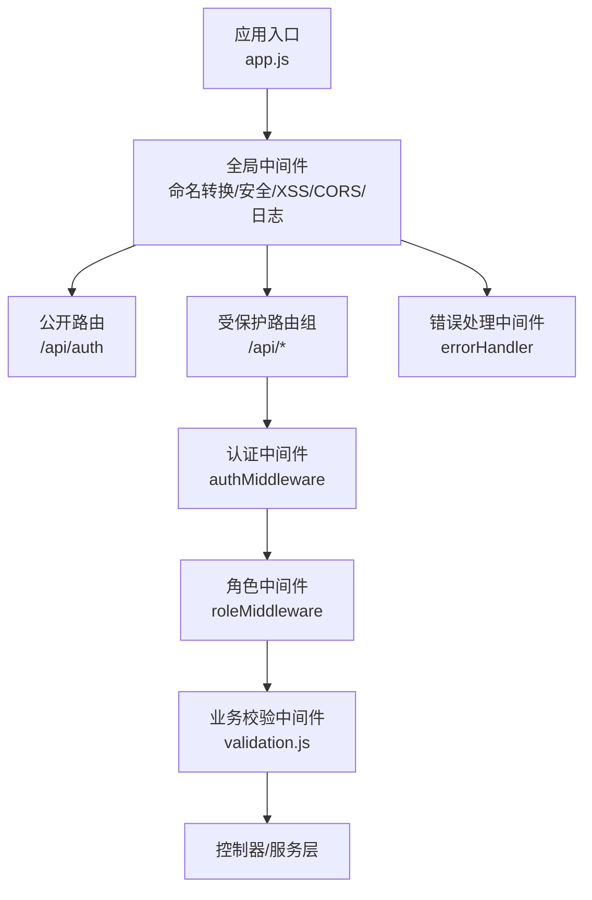
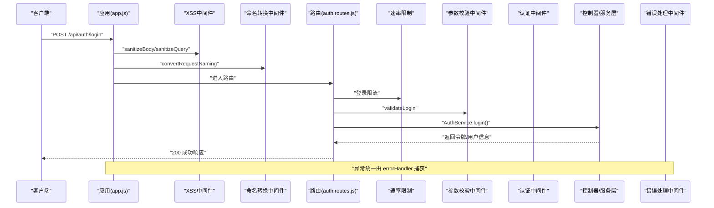
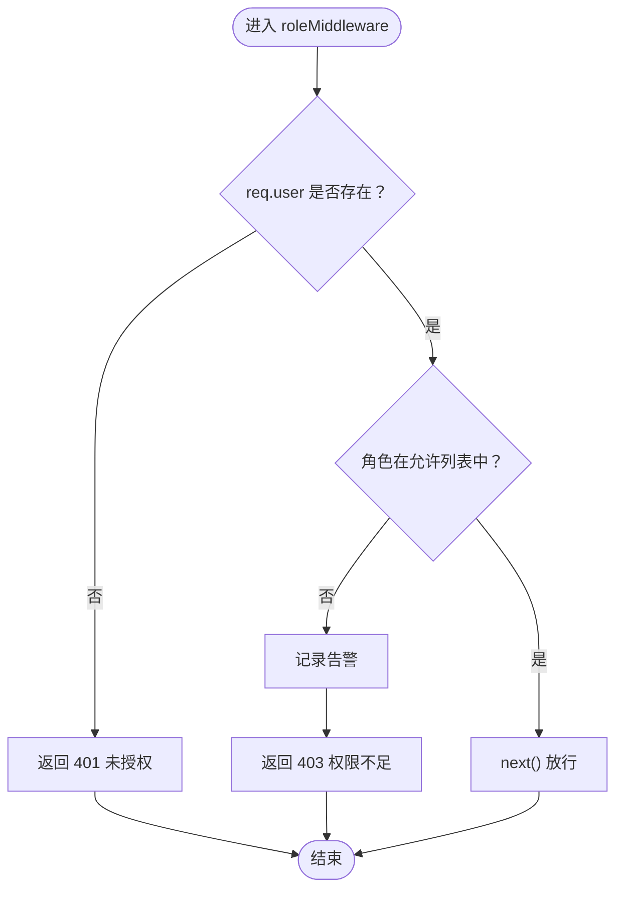
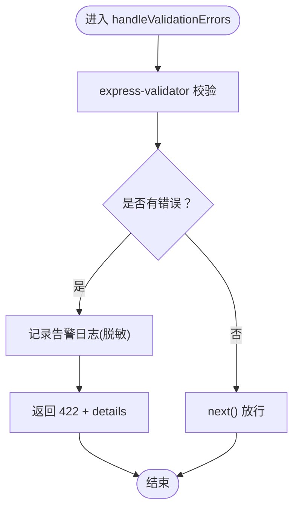
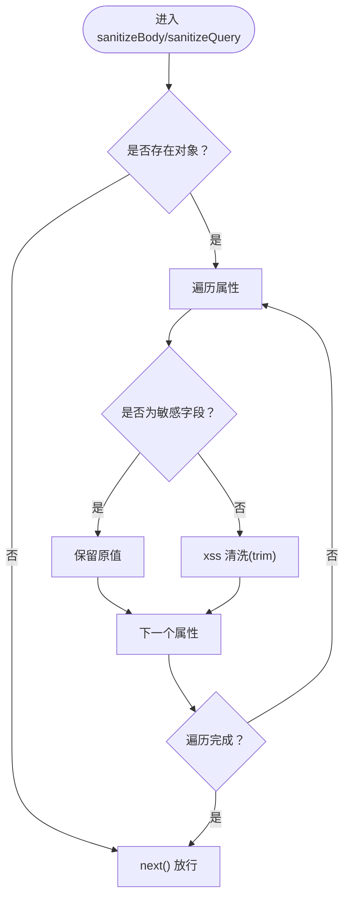
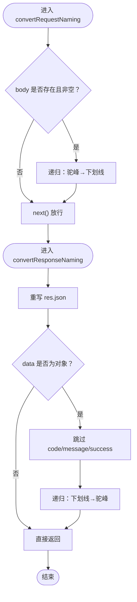
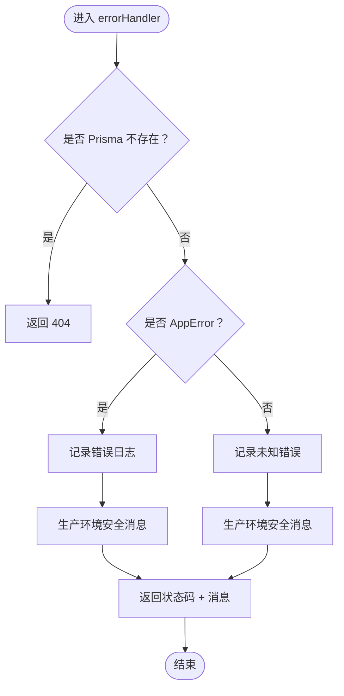
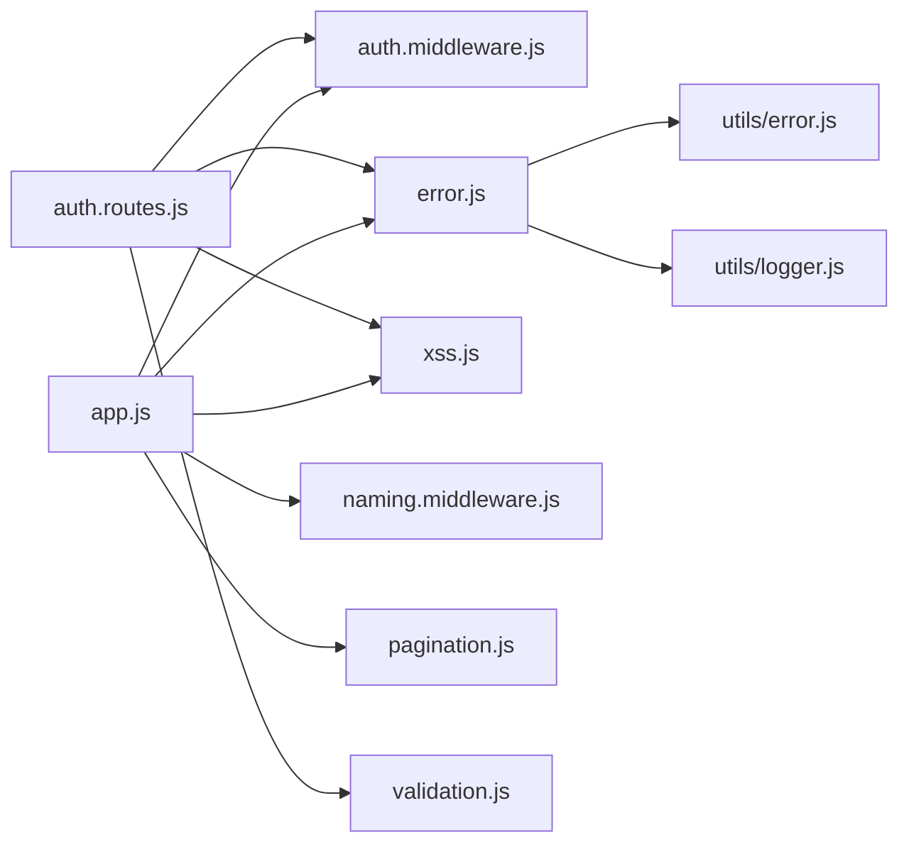

# 中间件体系

<cite>
**本文引用的文件列表**
- [app.js](file://server/src/app.js)
- [auth.middleware.js](file://server/src/middleware/auth.middleware.js)
- [error.js](file://server/src/middleware/error.js)
- [validation.js](file://server/src/middleware/validation.js)
- [xss.js](file://server/src/middleware/xss.js)
- [naming.middleware.js](file://server/src/middleware/naming.middleware.js)
- [pagination.js](file://server/src/middleware/pagination.js)
- [validation-audit.js](file://server/src/middleware/validation-audit.js)
- [auth.routes.js](file://server/src/routes/auth.routes.js)
- [error.js](file://server/src/utils/error.js)
- [logger.js](file://server/src/utils/logger.js)
- [validation.test.js](file://server/src/middleware/__tests__/validation.test.js)
- [naming.middleware.test.js](file://server/src/middleware/__tests__/naming.middleware.test.js)
</cite>

## 目录
1. [引言](#引言)
2. [项目结构](#项目结构)
3. [核心组件](#核心组件)
4. [架构总览](#架构总览)
5. [详细组件分析](#详细组件分析)
6. [依赖关系分析](#依赖关系分析)
7. [性能考量](#性能考量)
8. [故障排查指南](#故障排查指南)
9. [结论](#结论)
10. [附录](#附录)

## 引言
本文件系统化梳理 KECCourse 平台后端中间件体系，明确各中间件的职责、执行顺序、组合方式与设计原则；深入解析认证中间件的 JWT 令牌验证机制、请求验证中间件的数据校验规则、错误处理中间件的异常捕获策略、XSS 防护中间件的安全过滤机制；并给出自定义中间件的开发规范、中间件链的组合使用建议、性能优化要点以及实际示例与最佳实践。

## 项目结构
后端采用 Express 应用，中间件在应用启动阶段集中注册，形成“全局中间件 → 路由中间件”的两级链路：
- 全局中间件：命名转换、XSS 清洗、CORS、Helmet、日志、健康检查等
- 路由中间件：认证鉴权、角色校验、业务参数校验、分页校验等

图表来源
- [app.js:84-155](file://server/src/app.js#L84-L155)

章节来源
- [app.js:1-158](file://server/src/app.js#L1-L158)

## 核心组件
- 认证中间件：负责从请求头或查询参数提取并验证 JWT/下载令牌，校验用户状态与角色，注入 req.user
- 角色中间件：基于 req.user.role 进行权限判定
- 请求验证中间件：基于 express-validator 的规则集合，统一处理 422 参数校验失败
- XSS 防护中间件：对请求体与查询参数进行安全清洗，跳过密码类敏感字段
- 命名转换中间件：请求体驼峰→下划线，响应下划线→驼峰，统一前后端命名风格
- 分页参数验证中间件：统一分页参数校验，支持自定义最大页大小
- 错误处理中间件：统一捕获应用错误、Prisma 错误与未知错误，输出安全消息
- 日志与审计：统一使用 winston 记录，区分错误、审计等通道

章节来源
- [auth.middleware.js:40-128](file://server/src/middleware/auth.middleware.js#L40-L128)
- [validation.js:7-35](file://server/src/middleware/validation.js#L7-L35)
- [xss.js:20-85](file://server/src/middleware/xss.js#L20-L85)
- [naming.middleware.js:15-58](file://server/src/middleware/naming.middleware.js#L15-L58)
- [pagination.js:11-30](file://server/src/middleware/pagination.js#L11-L30)
- [error.js:35-62](file://server/src/middleware/error.js#L35-L62)
- [logger.js:34-95](file://server/src/utils/logger.js#L34-L95)

## 架构总览
中间件链的典型执行顺序（以登录为例）：
1) 全局中间件：CORS/Helmet/日志/XSS/命名转换
2) 路由级：速率限制 → 参数校验 → 业务逻辑
3) 异常：统一错误处理中间件兜底

图表来源
- [app.js:84-155](file://server/src/app.js#L84-L155)
- [auth.routes.js:59-72](file://server/src/routes/auth.routes.js#L59-L72)
- [validation.js:7-35](file://server/src/middleware/validation.js#L7-L35)

章节来源
- [auth.routes.js:14-50](file://server/src/routes/auth.routes.js#L14-L50)
- [app.js:84-155](file://server/src/app.js#L84-L155)

## 详细组件分析

### 认证中间件（JWT 令牌验证）
职责与流程
- 从 Authorization 头提取 Bearer 令牌；若无，则尝试下载令牌（query.downloadToken）
- 使用 AuthService 验证令牌有效性；对下载令牌额外校验用户状态
- 从数据库获取用户最新状态与角色，确保旧 token 不会因角色/禁用状态变化而失效
- 将用户信息注入 req.user，供后续中间件与控制器使用

关键特性
- 用户状态缓存：Map + TTL，定期清理；用户状态变更时主动失效缓存
- 下载令牌：用于 window.open 等无法设置 Authorization 头的场景，带 60 秒有效期
- 用户状态二次校验：防止被禁用用户在令牌有效期内绕过

```mermaid
flowchart TD
Start(["进入 authMiddleware"]) --> CheckAuth["检查 Authorization 头"]
CheckAuth --> HasBearer{"存在 Bearer 令牌？"}
HasBearer --> |是| VerifyBearer["AuthService.verifyToken()"]
HasBearer --> |否| CheckQuery["检查 downloadToken 查询参数"]
CheckQuery --> HasDT{"存在下载令牌？"}
HasDT --> |是| VerifyDT["AuthService.verifyDownloadToken()"]
VerifyDT --> StatusDT["校验用户状态(getActiveUserStatus)"]
StatusDT --> DTOK{"用户有效？"}
DTOK --> |是| InjectUserDT["注入 req.user 并 next()"]
DTOK --> |否| DT401["返回 401"]
HasDT --> |否| NoToken["返回 401 未授权"]
VerifyBearer --> BearerOK{"令牌有效？"}
BearerOK --> |否| Bearer401["返回 401 无效/过期"]
BearerOK --> |是| Status["校验用户状态(getActiveUserStatus)"]
Status --> StatusOK{"用户有效？"}
StatusOK --> |是| InjectUser["注入 req.user 并 next()"]
StatusOK --> |否| Status401["返回 401 账号不存在或禁用"]
InjectUser --> End(["结束"])
InjectUserDT --> End
NoToken --> End
Bearer401 --> End
DT401 --> End
Status401 --> End
```

图表来源
- [auth.middleware.js:40-106](file://server/src/middleware/auth.middleware.js#L40-L106)

章节来源
- [auth.middleware.js:17-38](file://server/src/middleware/auth.middleware.js#L17-L38)
- [auth.middleware.js:40-106](file://server/src/middleware/auth.middleware.js#L40-L106)

### 角色中间件（权限判定）
职责与流程
- 若 req.user 不存在，返回 401 未授权
- 若 req.user.role 不在允许列表中，记录告警并返回 403 权限不足
- 否则放行

图表来源
- [auth.middleware.js:108-128](file://server/src/middleware/auth.middleware.js#L108-L128)

章节来源
- [auth.middleware.js:108-128](file://server/src/middleware/auth.middleware.js#L108-L128)

### 请求验证中间件（参数校验）
职责与流程
- 使用 express-validator 定义规则，统一通过 handleValidationErrors 汇总校验结果
- 校验失败：记录告警日志（脱敏），返回 422，携带 details 数组
- 校验通过：继续下一个中间件

规则覆盖
- 登录、修改密码、分页、ID 参数、班级、专业、课程、教材、用户、学院、培养层次、培养方案、学期、教师、教学安排、系统设置重置、学期查询、排序更新、创建类规则等

图表来源
- [validation.js:7-35](file://server/src/middleware/validation.js#L7-L35)

章节来源
- [validation.js:37-590](file://server/src/middleware/validation.js#L37-L590)
- [validation.test.js:112-165](file://server/src/middleware/__tests__/validation.test.js#L112-L165)

### XSS 防护中间件（安全过滤）
职责与流程
- 对请求体与查询参数进行递归清洗，跳过密码类敏感字段
- 针对 Express 5 的 req.query getter-only 限制，采用原地修改属性的方式清洗

图表来源
- [xss.js:20-85](file://server/src/middleware/xss.js#L20-L85)

章节来源
- [xss.js:7-14](file://server/src/middleware/xss.js#L7-L14)
- [xss.js:20-85](file://server/src/middleware/xss.js#L20-L85)

### 命名转换中间件（前后端命名映射）
职责与流程
- 请求：将 req.body 的驼峰键转换为下划线（适配数据库字段）
- 响应：拦截 res.json，将下划线字段转换为驼峰（适配前端）

注意
- 跳过 code/message/success 等关键字段
- 支持数组与嵌套分页对象 data.data.list 的转换

图表来源
- [naming.middleware.js:15-58](file://server/src/middleware/naming.middleware.js#L15-L58)

章节来源
- [naming.middleware.js:15-58](file://server/src/middleware/naming.middleware.js#L15-L58)
- [naming.middleware.test.js:47-96](file://server/src/middleware/__tests__/naming.middleware.test.js#L47-L96)

### 分页参数验证中间件（统一分页校验）
职责与流程
- 校验 query.page/pageSize，支持自定义最大页大小
- 校验失败：使用统一 fail 工具返回 400

章节来源
- [pagination.js:11-30](file://server/src/middleware/pagination.js#L11-L30)

### 错误处理中间件（异常捕获与统一输出）
职责与流程
- Prisma 记录不存在：返回 404
- 自定义 AppError：按状态码输出，生产环境输出安全消息
- 未知错误：记录错误日志，返回 500 或自定义状态码
- JWT 相关错误：区分过期与无效，输出相应提示

图表来源
- [error.js:35-62](file://server/src/middleware/error.js#L35-L62)
- [error.js:7-33](file://server/src/middleware/error.js#L7-L33)

章节来源
- [error.js:35-62](file://server/src/middleware/error.js#L35-L62)
- [error.js:5-12](file://server/src/utils/error.js#L5-L12)

## 依赖关系分析
- app.js 注册全局中间件与路由，随后挂载 errorHandler
- auth.routes.js 使用 authMiddleware、roleMiddleware、速率限制、参数校验与 XSS 中间件
- validation.js 提供统一的校验规则与 handleValidationErrors
- naming.middleware.js 依赖 utils/naming.js（内部实现）
- error.js 依赖 utils/error.js 与 utils/logger.js

图表来源
- [app.js:22-26](file://server/src/app.js#L22-L26)
- [auth.routes.js:4-10](file://server/src/routes/auth.routes.js#L4-L10)
- [error.js:1-2](file://server/src/middleware/error.js#L1-L2)
- [error.js:5-12](file://server/src/utils/error.js#L5-L12)

章节来源
- [app.js:22-26](file://server/src/app.js#L22-L26)
- [auth.routes.js:4-10](file://server/src/routes/auth.routes.js#L4-L10)

## 性能考量
- 认证中间件用户状态缓存：Map + TTL，减少数据库压力；定时清理与状态变更主动失效，平衡一致性与性能
- 命名转换中间件：仅在必要时递归处理，避免对非对象数据做无谓转换
- XSS 清洗：对请求体与查询参数进行原地清洗，降低内存复制成本
- 速率限制：针对登录、刷新、修改密码、登出等接口分别限流，防止暴力破解与滥用
- 错误处理：生产环境输出安全消息，避免泄露内部细节

章节来源
- [auth.middleware.js:17-38](file://server/src/middleware/auth.middleware.js#L17-L38)
- [auth.routes.js:14-57](file://server/src/routes/auth.routes.js#L14-L57)
- [error.js:35-62](file://server/src/middleware/error.js#L35-L62)

## 故障排查指南
常见问题与定位
- 401 未授权/403 权限不足
  - 检查 Authorization 头是否正确；确认 downloadToken 是否过期
  - 确认用户状态与角色是否满足要求
- 422 参数校验失败
  - 查看返回的 details 数组，定位具体字段与错误信息
  - 关注密码类字段是否被 XSS 清洗影响
- 500 服务器内部错误
  - 查看错误日志，确认是否为 AppError 或未知错误
  - 生产环境安全消息可能掩盖具体错误，开发环境可查看 stack
- CORS 跨域被拒
  - 检查 allowedOrigins 配置与请求来源
- 命名不一致导致数据库字段映射失败
  - 确认命名转换中间件是否生效，请求体是否为驼峰

章节来源
- [auth.middleware.js:40-106](file://server/src/middleware/auth.middleware.js#L40-L106)
- [validation.js:7-35](file://server/src/middleware/validation.js#L7-L35)
- [error.js:35-62](file://server/src/middleware/error.js#L35-L62)
- [app.js:41-76](file://server/src/app.js#L41-L76)
- [naming.middleware.js:15-58](file://server/src/middleware/naming.middleware.js#L15-L58)

## 结论
本中间件体系以“全局安全与命名转换 + 路由级认证与业务校验 + 统一错误处理”为核心设计，既保证了安全性与一致性，又提供了良好的扩展性与可维护性。通过缓存、限流、XSS 清洗与严格的参数校验，有效提升了系统的健壮性与用户体验。

## 附录

### 自定义中间件开发规范
- 命名与职责
  - 明确单一职责，避免在一个中间件中混杂多类逻辑
  - 函数命名语义清晰，如 sanitizeBody、validateLogin、roleMiddleware
- 错误处理
  - 校验失败：返回 4xx 状态码与标准响应结构
  - 业务异常：抛出 AppError 或 next(err)，交由 errorHandler 统一处理
- 性能与兼容
  - 避免重复计算，必要时使用缓存
  - 注意 Express 版本差异（如 req.query 的 getter-only），采用原地修改
- 日志与审计
  - 对关键事件与异常进行日志记录，便于追踪与审计

### 中间件链的组合使用
- 典型链路
  - 全局：CORS/Helmet/日志/XSS/命名转换
  - 路由：速率限制 → 参数校验 → 认证/角色 → 业务逻辑
- 组合建议
  - 将高开销或低频操作置于路由层，减少全局负担
  - 将安全与命名转换置于全局，确保一致性

### 实际示例与最佳实践
- 示例：登录接口
  - 限流 → 参数校验 → 业务处理 → 成功响应
  - 参考：[auth.routes.js:59-72](file://server/src/routes/auth.routes.js#L59-L72)
- 示例：修改密码接口
  - 认证 → 限流 → 参数校验 → XSS 清洗 → 业务处理
  - 参考：[auth.routes.js:154-178](file://server/src/routes/auth.routes.js#L154-L178)
- 最佳实践
  - 优先使用统一的参数校验规则与错误处理
  - 对敏感字段（密码）在 XSS 中间件中跳过清洗
  - 对用户状态与角色进行双重校验，避免旧 token 生效

章节来源
- [auth.routes.js:59-72](file://server/src/routes/auth.routes.js#L59-L72)
- [auth.routes.js:154-178](file://server/src/routes/auth.routes.js#L154-L178)
- [xss.js:20-85](file://server/src/middleware/xss.js#L20-L85)
- [validation.js:7-35](file://server/src/middleware/validation.js#L7-L35)