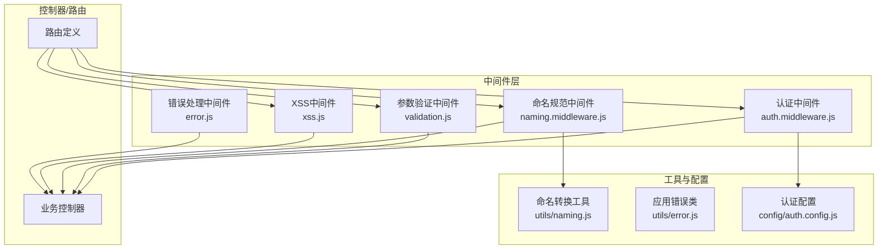
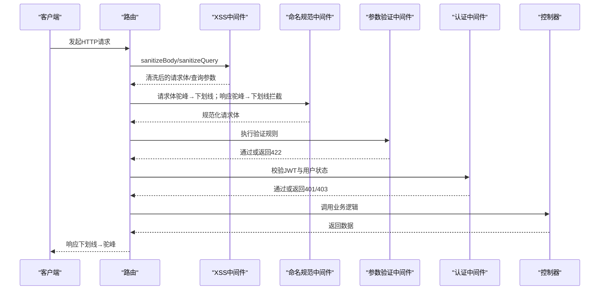
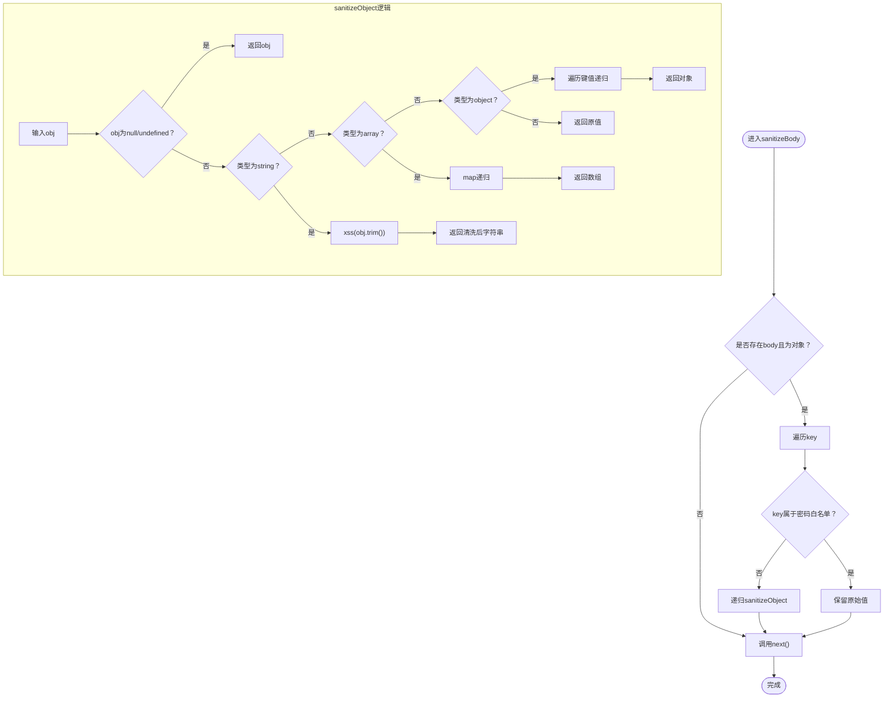
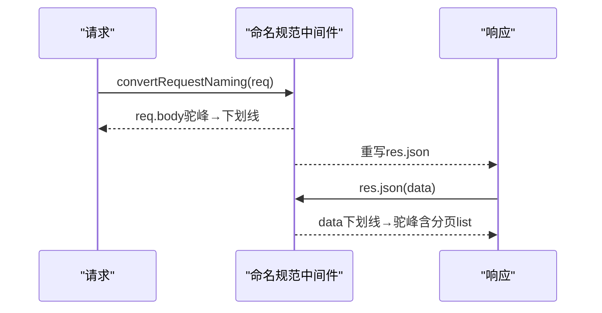
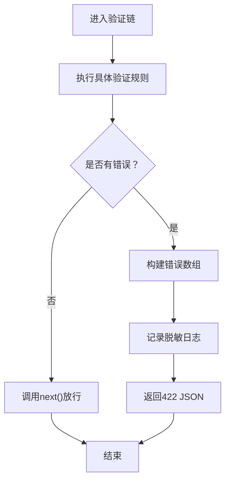
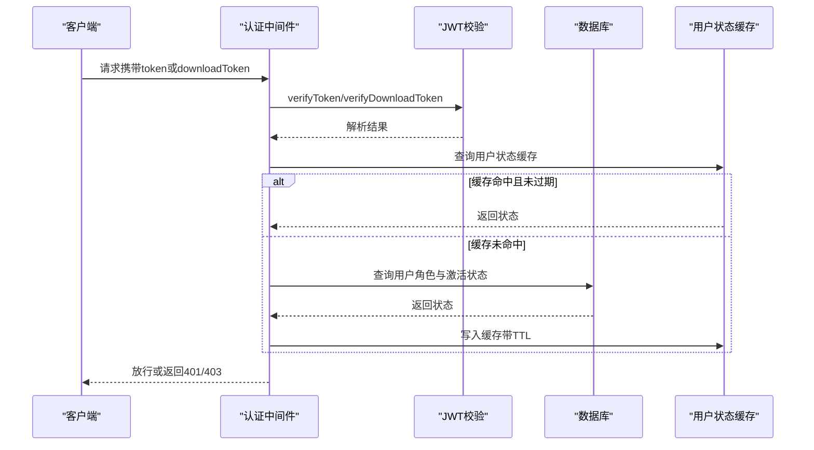
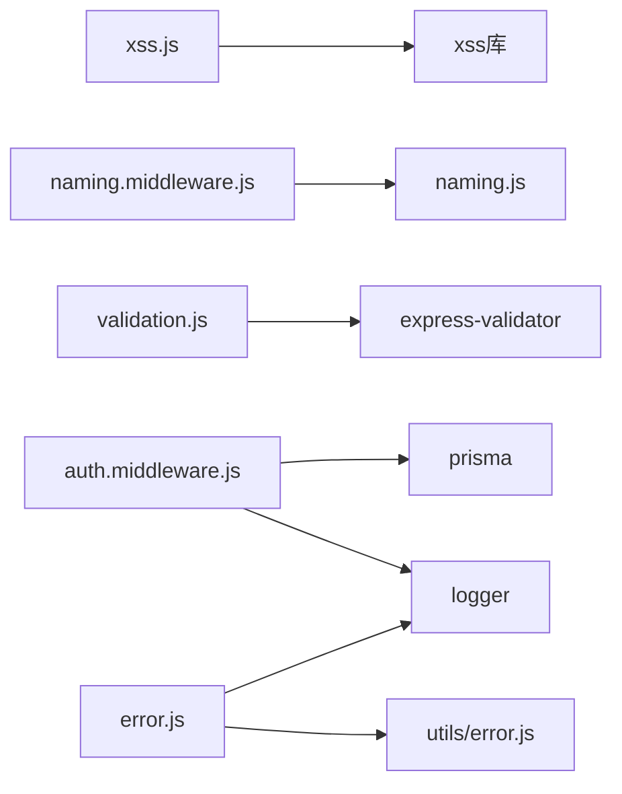

# 安全防护中间件

<cite>
**本文档引用的文件**
- [xss.js](file://server/src/middleware/xss.js)
- [naming.middleware.js](file://server/src/middleware/naming.middleware.js)
- [validation.js](file://server/src/middleware/validation.js)
- [validation-audit.js](file://server/src/middleware/validation-audit.js)
- [auth.middleware.js](file://server/src/middleware/auth.middleware.js)
- [error.js](file://server/src/middleware/error.js)
- [naming.js](file://server/src/utils/naming.js)
- [error.js](file://server/src/utils/error.js)
- [auth.config.js](file://server/src/config/auth.config.js)
- [naming.middleware.test.js](file://server/src/middleware/__tests__/naming.middleware.test.js)
- [validation.test.js](file://server/src/middleware/__tests__/validation.test.js)
</cite>

## 目录
1. [简介](#简介)
2. [项目结构](#项目结构)
3. [核心组件](#核心组件)
4. [架构总览](#架构总览)
5. [详细组件分析](#详细组件分析)
6. [依赖关系分析](#依赖关系分析)
7. [性能考量](#性能考量)
8. [故障排查指南](#故障排查指南)
9. [结论](#结论)
10. [附录](#附录)

## 简介
本文件系统化梳理KEC课程管理平台后端的安全防护中间件体系，围绕以下目标展开：
- 全面说明XSS攻击防护机制：输入过滤、输出编码与内容安全策略建议
- 解释命名规范中间件对数据字段的标准化处理
- 说明SQL注入防护现状与建议
- 说明CSRF保护机制现状与建议
- 汇总安全中间件的配置选项、安全漏洞检测方法与安全事件处理流程
- 提供安全最佳实践与常见问题的预防措施

## 项目结构
安全相关中间件集中于 server/src/middleware 目录，配套工具函数位于 server/src/utils，认证配置位于 server/src/config。

图表来源
- [xss.js:1-86](file://server/src/middleware/xss.js#L1-L86)
- [naming.middleware.js:1-68](file://server/src/middleware/naming.middleware.js#L1-L68)
- [validation.js:1-590](file://server/src/middleware/validation.js#L1-L590)
- [auth.middleware.js:1-129](file://server/src/middleware/auth.middleware.js#L1-L129)
- [error.js:1-63](file://server/src/middleware/error.js#L1-L63)
- [naming.js:1-119](file://server/src/utils/naming.js#L1-L119)
- [error.js:1-58](file://server/src/utils/error.js#L1-L58)
- [auth.config.js:1-58](file://server/src/config/auth.config.js#L1-L58)

章节来源
- [xss.js:1-86](file://server/src/middleware/xss.js#L1-L86)
- [naming.middleware.js:1-68](file://server/src/middleware/naming.middleware.js#L1-L68)
- [validation.js:1-590](file://server/src/middleware/validation.js#L1-L590)
- [auth.middleware.js:1-129](file://server/src/middleware/auth.middleware.js#L1-L129)
- [error.js:1-63](file://server/src/middleware/error.js#L1-L63)
- [naming.js:1-119](file://server/src/utils/naming.js#L1-L119)
- [error.js:1-58](file://server/src/utils/error.js#L1-L58)
- [auth.config.js:1-58](file://server/src/config/auth.config.js#L1-L58)

## 核心组件
- XSS防护中间件：对请求体与查询参数进行递归清洗，跳过密码类字段，避免HTML注入风险
- 命名规范中间件：请求体驼峰→下划线（适配数据库），响应下划线→驼峰（适配前端）
- 参数验证中间件：基于express-validator的统一验证与错误处理，覆盖多类业务参数
- 认证中间件：基于JWT的鉴权与角色控制，带用户状态缓存与主动失效
- 错误处理中间件：统一错误分类与安全消息输出，屏蔽敏感堆栈信息

章节来源
- [xss.js:16-85](file://server/src/middleware/xss.js#L16-L85)
- [naming.middleware.js:11-67](file://server/src/middleware/naming.middleware.js#L11-L67)
- [validation.js:7-35](file://server/src/middleware/validation.js#L7-L35)
- [auth.middleware.js:40-106](file://server/src/middleware/auth.middleware.js#L40-L106)
- [error.js:35-62](file://server/src/middleware/error.js#L35-L62)

## 架构总览
安全中间件在路由层按顺序挂载，形成“输入清洗→命名转换→参数验证→认证鉴权→业务处理→错误处理”的闭环。

图表来源
- [xss.js:20-85](file://server/src/middleware/xss.js#L20-L85)
- [naming.middleware.js:15-58](file://server/src/middleware/naming.middleware.js#L15-L58)
- [validation.js:7-35](file://server/src/middleware/validation.js#L7-L35)
- [auth.middleware.js:40-106](file://server/src/middleware/auth.middleware.js#L40-L106)

## 详细组件分析

### XSS攻击防护机制
- 输入过滤
  - 请求体清洗：对req.body递归遍历，跳过密码类字段集合，使用第三方库进行HTML标签与脚本清理
  - 查询参数清洗：对req.query逐项原地清洗，兼容Express 5 getter-only限制
- 输出编码
  - 响应阶段由命名规范中间件负责将数据库下划线字段转换为前端可用的驼峰字段，避免在渲染层再次进行XSS编码
- 内容安全策略（建议）
  - 建议在Nginx/网关层增加Content-Security-Policy头，限制脚本来源与内联脚本执行
  - 对富文本场景采用白名单渲染库，而非直接innerHTML
- 密码字段保护
  - 白名单跳过清洗，防止篡改原始密码导致认证失败

图表来源
- [xss.js:20-65](file://server/src/middleware/xss.js#L20-L65)

章节来源
- [xss.js:7-14](file://server/src/middleware/xss.js#L7-L14)
- [xss.js:20-32](file://server/src/middleware/xss.js#L20-L32)
- [xss.js:38-65](file://server/src/middleware/xss.js#L38-L65)
- [xss.js:71-85](file://server/src/middleware/xss.js#L71-L85)

### 命名规范中间件
- 请求体转换：将驼峰字段（如trainingLevelId）转换为下划线（如training_level_id），适配数据库命名
- 响应转换：拦截res.json，将下划线字段转换为驼峰（如class_id→classId），提升前端一致性
- 跳过键：对通用响应字段（code、message、success）与分页列表（data.list）进行特殊处理，避免误转换
- 组合中间件：提供autoConvertNaming便于一次性启用请求与响应转换

图表来源
- [naming.middleware.js:15-58](file://server/src/middleware/naming.middleware.js#L15-L58)
- [naming.js:17-84](file://server/src/utils/naming.js#L17-L84)

章节来源
- [naming.middleware.js:15-58](file://server/src/middleware/naming.middleware.js#L15-L58)
- [naming.js:17-84](file://server/src/utils/naming.js#L17-L84)
- [naming.middleware.test.js:47-96](file://server/src/middleware/__tests__/naming.middleware.test.js#L47-L96)
- [naming.middleware.test.js:101-217](file://server/src/middleware/__tests__/naming.middleware.test.js#L101-L217)

### 参数验证中间件
- 统一验证：基于express-validator定义各业务场景的验证规则，最后由handleValidationErrors统一处理
- 错误格式：返回标准JSON结构，包含success=false、message、data.code与details
- 日志脱敏：记录验证失败时的日志，剔除密码等敏感字段
- 覆盖范围：登录、修改密码、分页、ID参数、学期格式、教师创建/更新、教学安排等

图表来源
- [validation.js:7-35](file://server/src/middleware/validation.js#L7-L35)

章节来源
- [validation.js:7-35](file://server/src/middleware/validation.js#L7-L35)
- [validation.js:95-116](file://server/src/middleware/validation.js#L95-L116)
- [validation.test.js:134-165](file://server/src/middleware/__tests__/validation.test.js#L134-L165)
- [validation.test.js:215-251](file://server/src/middleware/__tests__/validation.test.js#L215-L251)

### 认证中间件
- 令牌来源：优先Authorization头Bearer，其次downloadToken查询参数（短期下载令牌）
- 用户状态校验：拉取最新用户状态（角色与激活状态），并使用Map缓存降低数据库压力
- 主动失效：用户状态变更时主动清除缓存，避免TTL等待
- 角色中间件：roleMiddleware按允许角色白名单进行授权控制

图表来源
- [auth.middleware.js:40-106](file://server/src/middleware/auth.middleware.js#L40-L106)
- [auth.config.js:49-57](file://server/src/config/auth.config.js#L49-L57)

章节来源
- [auth.middleware.js:40-106](file://server/src/middleware/auth.middleware.js#L40-L106)
- [auth.middleware.js:108-128](file://server/src/middleware/auth.middleware.js#L108-L128)
- [auth.config.js:18-37](file://server/src/config/auth.config.js#L18-L37)

### 错误处理中间件
- 安全消息映射：将Prisma/JWT错误映射为用户友好的提示，避免泄露内部细节
- 自定义错误：AppError及其子类（NotFoundError、ValidationError、AuthenticationError、AuthorizationError、ConflictError）统一处理
- 生产环境脱敏：仅在开发环境输出堆栈信息

章节来源
- [error.js:7-33](file://server/src/middleware/error.js#L7-L33)
- [error.js:35-62](file://server/src/middleware/error.js#L35-L62)
- [error.js:5-58](file://server/src/utils/error.js#L5-L58)

## 依赖关系分析
- XSS中间件依赖第三方xss库，对字符串进行HTML清理
- 命名规范中间件依赖命名转换工具函数，实现驼峰与下划线互转
- 参数验证中间件依赖express-validator，配合handleValidationErrors统一输出
- 认证中间件依赖AuthService（外部模块）、Prisma（数据库访问）与logger（日志）
- 错误处理中间件依赖AppError与logger

图表来源
- [xss.js:1](file://server/src/middleware/xss.js#L1)
- [naming.middleware.js:9](file://server/src/middleware/naming.middleware.js#L9)
- [naming.js:17-84](file://server/src/utils/naming.js#L17-L84)
- [validation.js:1](file://server/src/middleware/validation.js#L1)
- [auth.middleware.js:1-3](file://server/src/middleware/auth.middleware.js#L1-L3)
- [error.js:1](file://server/src/middleware/error.js#L1)
- [error.js:5-58](file://server/src/utils/error.js#L5-L58)

章节来源
- [xss.js:1](file://server/src/middleware/xss.js#L1)
- [naming.middleware.js:9](file://server/src/middleware/naming.middleware.js#L9)
- [naming.js:17-84](file://server/src/utils/naming.js#L17-L84)
- [validation.js:1](file://server/src/middleware/validation.js#L1)
- [auth.middleware.js:1-3](file://server/src/middleware/auth.middleware.js#L1-L3)
- [error.js:1](file://server/src/middleware/error.js#L1)
- [error.js:5-58](file://server/src/utils/error.js#L5-L58)

## 性能考量
- XSS中间件：递归遍历对象，对深层嵌套结构存在O(n)复杂度；建议对超大请求体进行体积限制
- 命名规范中间件：对响应进行拦截转换，额外占用CPU；建议在高频接口上评估必要性
- 认证中间件：用户状态缓存（Map）+定时清理，降低数据库压力；TTL与清理间隔可按QPS调整
- 错误处理中间件：仅在异常路径执行，对正常路径无影响

## 故障排查指南
- 验证失败422
  - 现象：请求被拒绝，返回包含details的JSON
  - 排查：检查对应验证规则与输入字段，关注日志中脱敏后的body
- 认证失败401/403
  - 现象：未授权或权限不足
  - 排查：确认token有效性、用户状态与角色；检查downloadToken有效期与用户状态
- 数据库错误映射
  - 现象：统一的安全提示
  - 排查：根据错误码定位Prisma约束冲突或参数问题
- XSS清洗异常
  - 现象：字段被清洗或跳过
  - 排查：确认是否命中密码白名单；检查第三方库版本与配置

章节来源
- [validation.js:7-35](file://server/src/middleware/validation.js#L7-L35)
- [auth.middleware.js:40-106](file://server/src/middleware/auth.middleware.js#L40-L106)
- [error.js:7-33](file://server/src/middleware/error.js#L7-L33)
- [xss.js:7-14](file://server/src/middleware/xss.js#L7-L14)

## 结论
本项目通过XSS中间件、命名规范中间件、参数验证中间件、认证中间件与错误处理中间件构建了完整的安全防线。建议进一步完善CSRF防护与内容安全策略配置，并持续优化缓存策略与请求体大小限制以提升性能与安全性。

## 附录

### 安全中间件配置选项
- XSS中间件
  - 密码白名单：password、old_password、new_password、oldPassword、newPassword、confirmPassword
- 认证配置
  - JWT密钥与过期时间：JWT_SECRET、JWT_EXPIRES_IN、JWT_REFRESH_SECRET、JWT_REFRESH_EXPIRES_IN、JWT_DOWNLOAD_SECRET、JWT_DOWNLOAD_EXPIRES_IN
  - bcrypt迭代次数：BCRYPT_ROUNDS
- 命名规范
  - 请求体：驼峰→下划线
  - 响应体：下划线→驼峰（跳过code/message/success与分页list）

章节来源
- [xss.js:7-14](file://server/src/middleware/xss.js#L7-L14)
- [auth.config.js:49-57](file://server/src/config/auth.config.js#L49-L57)
- [naming.middleware.js:35-50](file://server/src/middleware/naming.middleware.js#L35-L50)

### SQL注入防护现状与建议
- 现状：项目使用ORM（Prisma）进行数据库访问，未直接拼接SQL字符串，天然降低SQL注入风险
- 建议：继续坚持ORM使用；对动态查询采用ORM提供的参数化查询能力；对审计日志与导出功能进行输入校验与长度限制

章节来源
- [auth.middleware.js:28-37](file://server/src/middleware/auth.middleware.js#L28-L37)

### CSRF保护现状与建议
- 现状：未发现专门的CSRF中间件或令牌校验逻辑
- 建议：
  - 为关键写操作引入CSRF令牌（同源POST请求校验）
  - 对Cookie与跨域请求进行SameSite与CORS策略配置
  - 对表单提交与AJAX请求统一校验CSRF令牌

[本节为概念性建议，无需代码映射]

### 安全漏洞检测方法
- 单元测试覆盖
  - 命名规范中间件：请求体转换、响应转换、跳过键、嵌套分页
  - 参数验证中间件：边界值、非法格式、缺失字段
- 手工测试要点
  - XSS：构造含script标签的输入，检查响应是否被清洗
  - 认证：伪造token、禁用用户后访问、downloadToken有效期
  - 参数：超长字符串、非法类型、越界数值

章节来源
- [naming.middleware.test.js:47-96](file://server/src/middleware/__tests__/naming.middleware.test.js#L47-L96)
- [naming.middleware.test.js:101-217](file://server/src/middleware/__tests__/naming.middleware.test.js#L101-L217)
- [validation.test.js:134-165](file://server/src/middleware/__tests__/validation.test.js#L134-L165)
- [validation.test.js:215-251](file://server/src/middleware/__tests__/validation.test.js#L215-L251)

### 安全事件处理流程
- 认证失败：记录错误并返回401/403
- 参数验证失败：记录脱敏日志并返回422
- 数据库错误：映射为安全提示
- 未知错误：统一记录并返回5xx（生产环境脱敏）

章节来源
- [auth.middleware.js:118-127](file://server/src/middleware/auth.middleware.js#L118-L127)
- [validation.js:16-23](file://server/src/middleware/validation.js#L16-L23)
- [error.js:35-62](file://server/src/middleware/error.js#L35-L62)