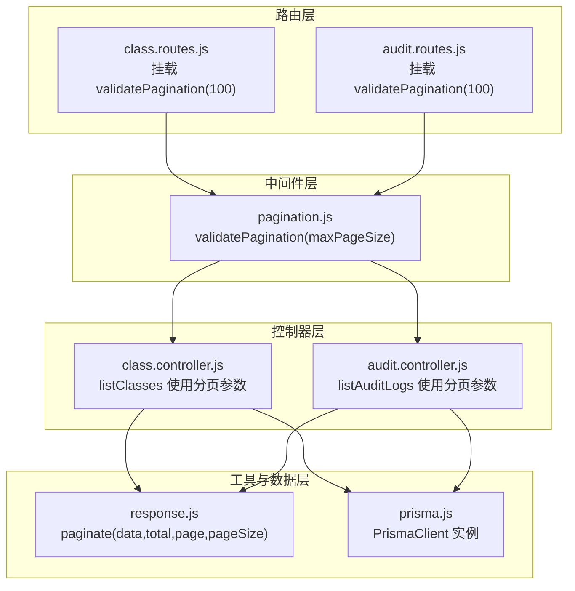
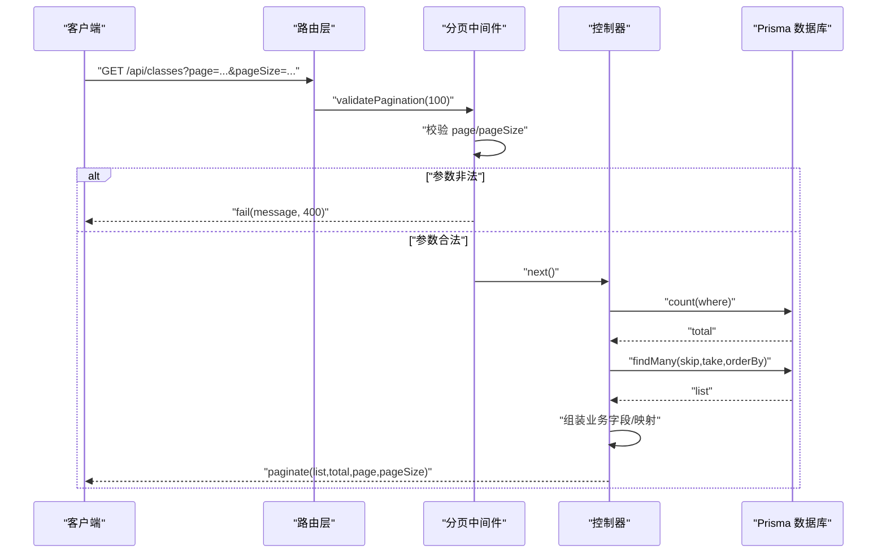
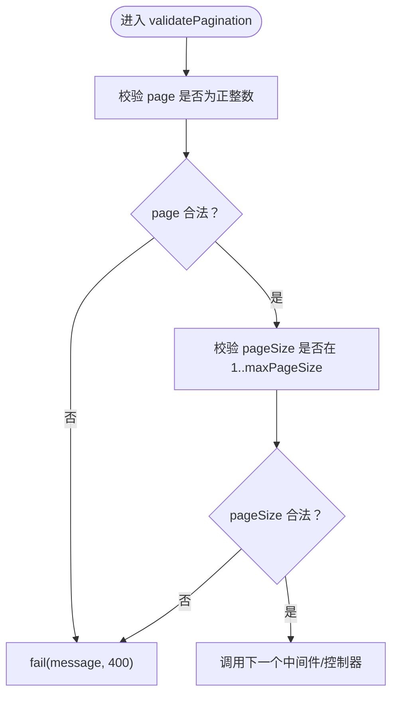
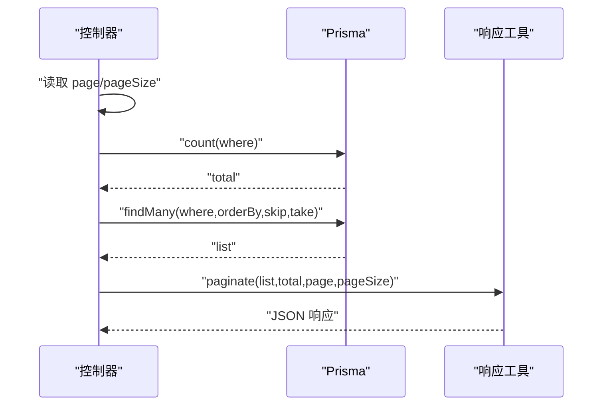
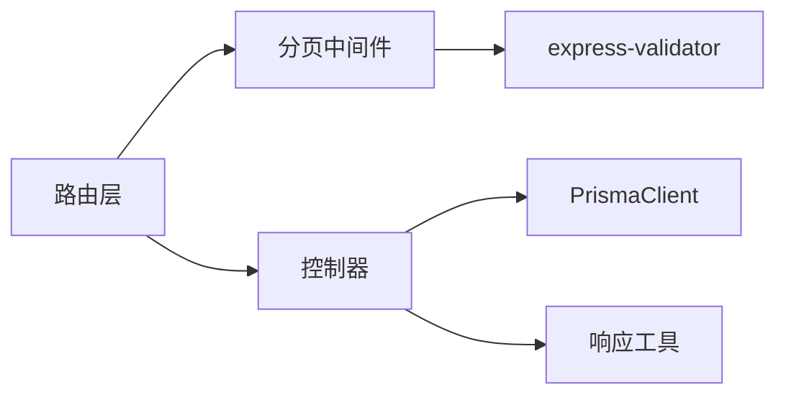

# 工具类中间件

<cite>
**本文引用的文件**
- [pagination.js](file://server/src/middleware/pagination.js)
- [response.js](file://server/src/utils/response.js)
- [prisma.js](file://server/src/lib/prisma.js)
- [class.controller.js](file://server/src/controllers/class.controller.js)
- [audit.controller.js](file://server/src/controllers/audit.controller.js)
- [class.routes.js](file://server/src/routes/class.routes.js)
- [audit.routes.js](file://server/src/routes/audit.routes.js)
- [validation.test.js](file://server/src/middleware/__tests__/validation.test.js)
</cite>

## 目录
1. [简介](#简介)
2. [项目结构](#项目结构)
3. [核心组件](#核心组件)
4. [架构总览](#架构总览)
5. [详细组件分析](#详细组件分析)
6. [依赖关系分析](#依赖关系分析)
7. [性能考量](#性能考量)
8. [故障排查指南](#故障排查指南)
9. [结论](#结论)
10. [附录](#附录)

## 简介
本文件聚焦于 KEC 课程管理平台的“工具类中间件”，尤其是“分页中间件”。文档系统性阐述其设计目标、实现原理、参数解析、查询优化、结果格式化、配置选项、性能优化策略、边界条件处理、缓存策略以及使用示例与调优建议。读者无需深入代码即可理解如何正确使用与扩展该中间件。

## 项目结构
分页中间件位于服务端中间件层，配合响应工具与 Prisma 数据访问层，在路由层被统一引入。典型使用路径如下：
- 路由层：在具体资源的 GET 接口上挂载分页中间件
- 中间件层：对 page/pageSize 参数进行验证
- 控制器层：读取分页参数，执行 count + findMany 查询，使用统一响应工具输出分页结果

图表来源
- [class.routes.js:21](file://server/src/routes/class.routes.js#L21)
- [audit.routes.js:11](file://server/src/routes/audit.routes.js#L11)
- [pagination.js:11-30](file://server/src/middleware/pagination.js#L11-L30)
- [class.controller.js:45-70](file://server/src/controllers/class.controller.js#L45-L70)
- [audit.controller.js:7-17](file://server/src/controllers/audit.controller.js#L7-L17)
- [response.js:5-16](file://server/src/utils/response.js#L5-L16)
- [prisma.js:22](file://server/src/lib/prisma.js#L22)

章节来源
- [class.routes.js:1-34](file://server/src/routes/class.routes.js#L1-L34)
- [audit.routes.js:1-14](file://server/src/routes/audit.routes.js#L1-L14)
- [pagination.js:1-31](file://server/src/middleware/pagination.js#L1-L31)
- [class.controller.js:1-464](file://server/src/controllers/class.controller.js#L1-L464)
- [audit.controller.js:1-22](file://server/src/controllers/audit.controller.js#L1-L22)
- [response.js:1-21](file://server/src/utils/response.js#L1-L21)
- [prisma.js:1-34](file://server/src/lib/prisma.js#L1-L34)

## 核心组件
- 分页参数验证中间件
  - 功能：统一校验 page、pageSize 的合法性；默认每页最大值可配置
  - 行为：参数非法时返回统一错误响应；通过后进入后续处理器
- 统一响应工具
  - 功能：提供 success/fail/paginate 三种响应封装
  - 分页格式：包含 list、total、page、pageSize、totalPages 字段
- Prisma 数据访问层
  - 功能：提供 PrismaClient 实例，支持 count + findMany 查询组合
  - 性能：count 与分页查询分离，避免一次性全量加载

章节来源
- [pagination.js:11-30](file://server/src/middleware/pagination.js#L11-L30)
- [response.js:1-21](file://server/src/utils/response.js#L1-L21)
- [prisma.js:22](file://server/src/lib/prisma.js#L22)

## 架构总览
下图展示一次典型的分页请求在系统中的流转过程：

图表来源
- [class.routes.js:21](file://server/src/routes/class.routes.js#L21)
- [pagination.js:11-30](file://server/src/middleware/pagination.js#L11-L30)
- [class.controller.js:45-70](file://server/src/controllers/class.controller.js#L45-L70)
- [response.js:5-16](file://server/src/utils/response.js#L5-L16)

## 详细组件分析

### 分页中间件实现与配置
- 参数解析
  - page：可选，必须为正整数（>=1）
  - pageSize：可选，必须为正整数，且不超过 maxPageSize
- 配置选项
  - maxPageSize：默认 100；可在路由中按需传入自定义上限
- 错误处理
  - 校验失败时统一返回失败响应（状态码通常为 400），消息来自第一个错误
- 使用位置
  - 在路由层对 GET 列表接口挂载，如班级列表与审计日志列表

图表来源
- [pagination.js:11-30](file://server/src/middleware/pagination.js#L11-L30)

章节来源
- [pagination.js:11-30](file://server/src/middleware/pagination.js#L11-L30)
- [class.routes.js:21](file://server/src/routes/class.routes.js#L21)
- [audit.routes.js:11](file://server/src/routes/audit.routes.js#L11)

### 控制器中的分页使用与查询优化
- 参数读取
  - 从 req.query 读取 page/pageSize，并转换为数字；未提供时采用默认值（page=1，pageSize=20）
- 查询流程
  - 先执行 count 获取 total，再执行 findMany 获取分页数据
  - 使用 skip=(page-1)*pageSize、take=pageSize 实现分页
  - 可选 orderBy 保障结果稳定
- 结果格式化
  - 使用统一的 paginate 工具输出标准分页结构
- 大数据集注意事项
  - 对高频查询建立合适的数据库索引（Prisma 迁移中已包含部分索引）
  - 尽量减少不必要的 include/select，避免 N+1 查询
  - 对复杂过滤条件，优先在数据库侧完成过滤，减少应用侧二次处理

图表来源
- [class.controller.js:45-70](file://server/src/controllers/class.controller.js#L45-L70)
- [response.js:5-16](file://server/src/utils/response.js#L5-L16)

章节来源
- [class.controller.js:45-70](file://server/src/controllers/class.controller.js#L45-L70)
- [audit.controller.js:7-17](file://server/src/controllers/audit.controller.js#L7-L17)
- [prisma.js:22](file://server/src/lib/prisma.js#L22)

### 统一响应工具与分页结果格式
- 成功响应：success(data,message)
- 失败响应：fail(message,status)
- 分页响应：paginate(data,total,page,pageSize)，包含 list、total、page、pageSize、totalPages
- 使用建议
  - 所有列表接口统一使用 paginate 输出，便于前端统一封装
  - totalPages 可用于前端分页控件渲染

章节来源
- [response.js:1-21](file://server/src/utils/response.js#L1-L21)

### 配置选项与边界条件
- 配置项
  - maxPageSize：在路由中传入，如 validatePagination(100)
- 边界条件
  - page=0：非法，返回错误
  - pageSize 超出上限：非法，返回错误
  - 未提供分页参数：视为合法，使用默认值
- 测试覆盖
  - 单元测试验证了上述行为

章节来源
- [pagination.js:11-30](file://server/src/middleware/pagination.js#L11-L30)
- [validation.test.js:283-312](file://server/src/middleware/__tests__/validation.test.js#L283-L312)

### 缓存策略与性能优化
- 查询缓存
  - 对于不频繁变动的静态数据或聚合结果，可在控制器层增加内存缓存（例如基于键的 TTL 缓存）
  - 注意缓存失效策略：当底层数据发生变更时主动清理
- 数据库层面
  - 使用 Prisma 的索引迁移，确保高频过滤字段具备索引
  - 对分页查询使用稳定的排序字段（如主键）以提升 skip/take 的效率
- 前端分页
  - 建议前端仅请求必要字段（select），避免 include 带来的额外开销
  - 对高频列表页启用虚拟滚动等前端优化

章节来源
- [prisma.js:22](file://server/src/lib/prisma.js#L22)
- [class.controller.js:57-70](file://server/src/controllers/class.controller.js#L57-L70)

## 依赖关系分析
- 路由依赖中间件：class.routes.js 与 audit.routes.js 在 GET 列表接口上依赖 validatePagination
- 中间件依赖验证库：validatePagination 基于 express-validator 完成参数校验
- 控制器依赖 Prisma 与响应工具：控制器负责读取分页参数、执行查询、组装响应
- 响应工具被控制器广泛使用：统一输出格式，简化前端对接

图表来源
- [class.routes.js:21](file://server/src/routes/class.routes.js#L21)
- [audit.routes.js:11](file://server/src/routes/audit.routes.js#L11)
- [pagination.js:5-6](file://server/src/middleware/pagination.js#L5-L6)
- [class.controller.js:1-2](file://server/src/controllers/class.controller.js#L1-L2)
- [response.js:1-3](file://server/src/utils/response.js#L1-L3)

章节来源
- [class.routes.js:1-34](file://server/src/routes/class.routes.js#L1-L34)
- [audit.routes.js:1-14](file://server/src/routes/audit.routes.js#L1-L14)
- [pagination.js:1-31](file://server/src/middleware/pagination.js#L1-L31)
- [class.controller.js:1-464](file://server/src/controllers/class.controller.js#L1-L464)
- [response.js:1-21](file://server/src/utils/response.js#L1-L21)

## 性能考量
- 查询拆分
  - 先 count 再分页查询，避免一次性加载全部数据
- 索引与排序
  - 为过滤字段与排序字段建立复合索引，降低 count 与分页查询成本
- 字段选择
  - 仅查询必要字段，减少网络与序列化开销
- 并发与限流
  - 对高并发列表接口增加限流策略，防止数据库压力过大
- 分页上限
  - 通过 maxPageSize 控制单页规模，避免超大页导致内存与网络压力

章节来源
- [pagination.js:11-30](file://server/src/middleware/pagination.js#L11-L30)
- [class.controller.js:57-70](file://server/src/controllers/class.controller.js#L57-L70)
- [prisma.js:22](file://server/src/lib/prisma.js#L22)

## 故障排查指南
- 常见问题
  - 参数非法：page 必须为正整数；pageSize 必须在 1..maxPageSize 之间
  - 默认值生效：未提供分页参数时，page=1，pageSize=20
  - 返回格式：失败时返回统一失败响应；成功时返回 paginate 格式
- 定位方法
  - 查看路由是否正确挂载 validatePagination
  - 检查控制器是否正确读取 req.query 并传入 paginate
  - 关注 Prisma 查询是否命中索引，避免全表扫描
- 单元测试参考
  - 测试用例覆盖了合法参数、缺省参数、越界参数等场景

章节来源
- [validation.test.js:283-312](file://server/src/middleware/__tests__/validation.test.js#L283-L312)
- [pagination.js:11-30](file://server/src/middleware/pagination.js#L11-L30)
- [class.controller.js:45-70](file://server/src/controllers/class.controller.js#L45-L70)

## 结论
分页中间件通过统一的参数校验与响应格式，显著提升了列表接口的一致性与可维护性。结合 Prisma 的 count+分页查询模式与合理的索引设计，能够在大数据集场景下保持良好的性能表现。建议在控制器层进一步引入缓存与字段裁剪策略，并在路由层根据业务需求设置不同的 maxPageSize 上限，以实现更稳健的分页体验。

## 附录

### 使用示例（步骤说明）
- 在路由中挂载分页中间件
  - 示例：在 GET /api/classes 上挂载 validatePagination(100)
- 在控制器中读取分页参数并执行查询
  - 读取 page/pageSize，默认值为 1/20
  - 先 count 再 findMany，最后使用 paginate 输出
- 前端接收
  - 解析 list、total、page、pageSize、totalPages 字段
  - 使用 totalPages 渲染分页控件

章节来源
- [class.routes.js:21](file://server/src/routes/class.routes.js#L21)
- [audit.routes.js:11](file://server/src/routes/audit.routes.js#L11)
- [class.controller.js:45-70](file://server/src/controllers/class.controller.js#L45-L70)
- [audit.controller.js:7-17](file://server/src/controllers/audit.controller.js#L7-L17)
- [response.js:5-16](file://server/src/utils/response.js#L5-L16)