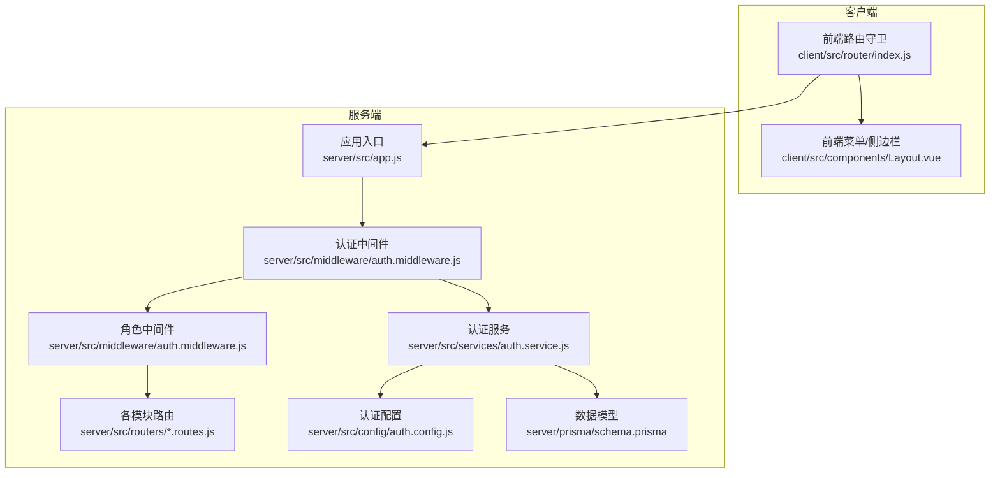
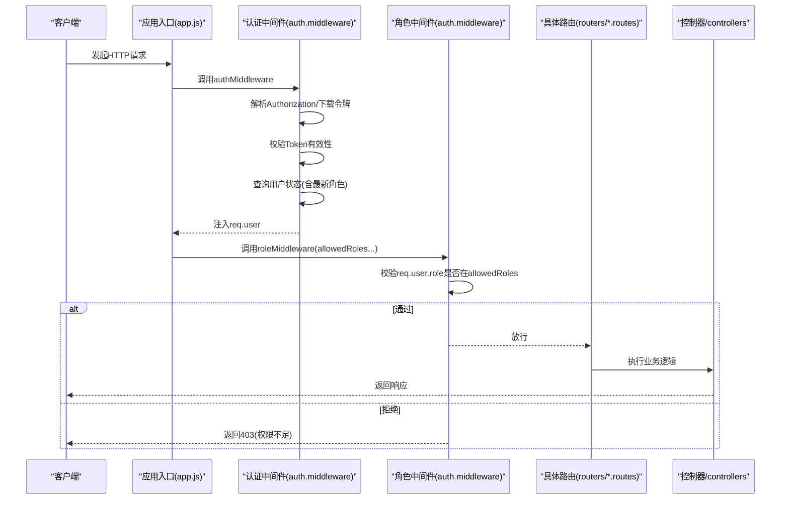
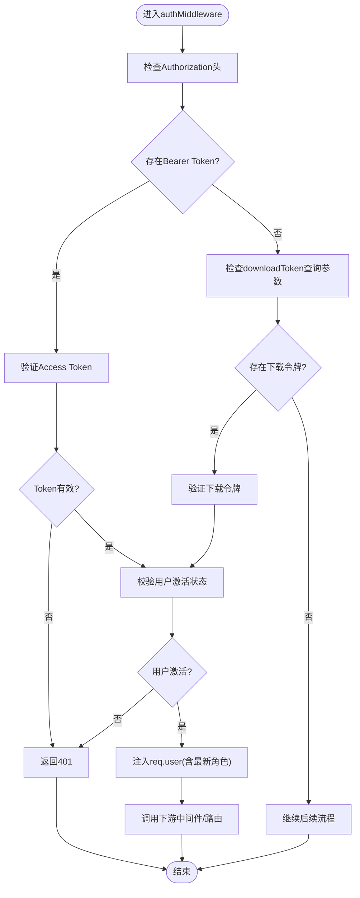
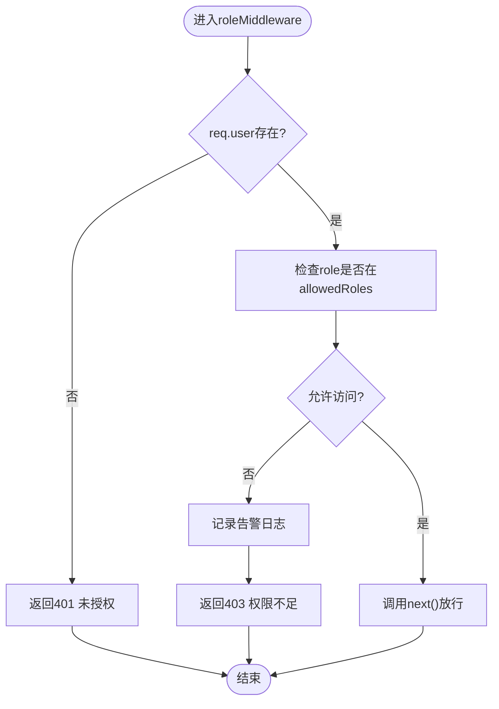
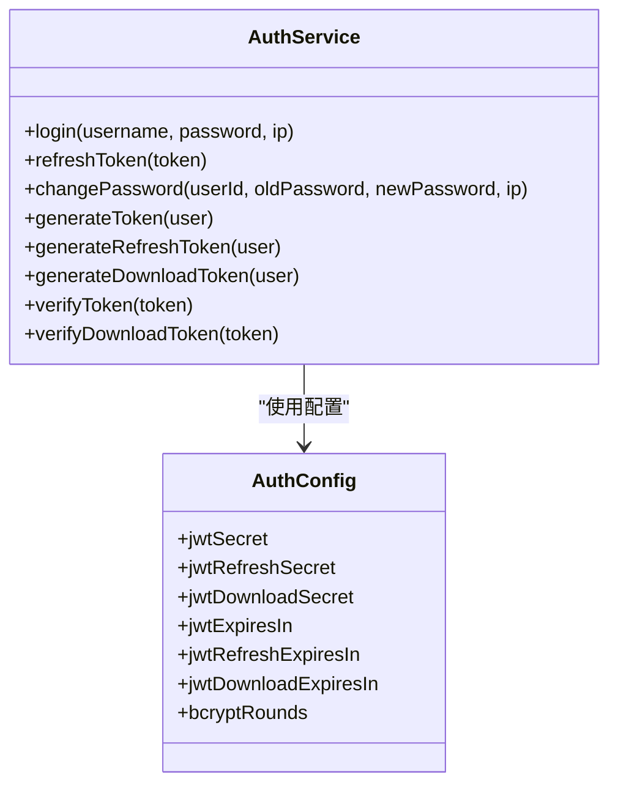
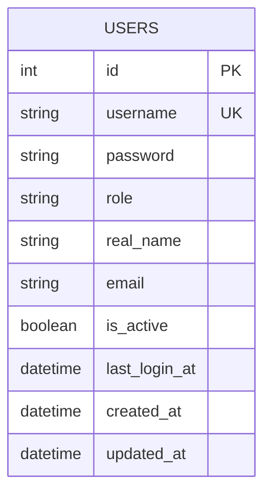
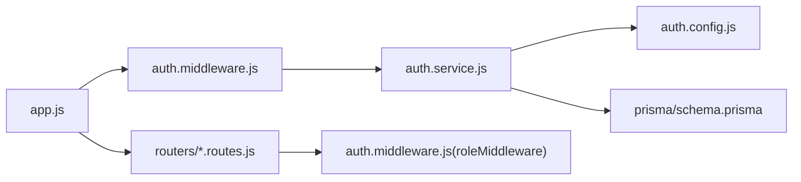

# 授权中间件

<cite>
**本文引用的文件**
- [server/src/middleware/auth.middleware.js](file://server/src/middleware/auth.middleware.js)
- [server/src/services/auth.service.js](file://server/src/services/auth.service.js)
- [server/src/config/auth.config.js](file://server/src/config/auth.config.js)
- [server/src/constants/index.js](file://server/src/constants/index.js)
- [server/src/app.js](file://server/src/app.js)
- [server/src/routers/audit.routes.js](file://server/src/routers/audit.routes.js)
- [server/src/routers/settings.routes.js](file://server/src/routers/settings.routes.js)
- [server/src/routers/plan.routes.js](file://server/src/routers/plan.routes.js)
- [server/src/routers/teaching-arrange.routes.js](file://server/src/routers/teaching-arrange.routes.js)
- [server/src/routers/user.routes.js](file://server/src/routers/user.routes.js)
- [server/src/routers/teacher.routes.js](file://server/src/routers/teacher.routes.js)
- [server/src/routers/class.routes.js](file://server/src/routers/class.routes.js)
- [server/src/routers/course.routes.js](file://server/src/routers/course.routes.js)
- [server/src/routers/major.routes.js](file://server/src/routers/major.routes.js)
- [server/src/routers/college.routes.js](file://server/src/routers/college.routes.js)
- [server/src/routers/export.routes.js](file://server/src/routers/export.routes.js)
- [server/src/controllers/settings.controller.js](file://server/src/controllers/settings.controller.js)
- [server/prisma/schema.prisma](file://server/prisma/schema.prisma)
- [server/scripts/reset-database.js](file://server/scripts/reset-database.js)
- [client/src/router/index.js](file://client/src/router/index.js)
- [client/src/components/Layout.vue](file://client/src/components/Layout.vue)
</cite>

## 目录
1. [简介](#简介)
2. [项目结构](#项目结构)
3. [核心组件](#核心组件)
4. [架构总览](#架构总览)
5. [详细组件分析](#详细组件分析)
6. [依赖关系分析](#依赖关系分析)
7. [性能考量](#性能考量)
8. [故障排查指南](#故障排查指南)
9. [结论](#结论)
10. [附录](#附录)

## 简介
本文件面向KEC课程管理平台的授权中间件，系统性阐述基于角色的访问控制（RBAC）实现与最佳实践。重点围绕以下主题展开：
- roleMiddleware的使用方法与allowedRoles参数传递方式
- 角色权限验证机制与权限继承规则
- 权限检查执行流程与拒绝访问的处理策略
- 各类角色组合的使用示例与权限设计建议
- 常见权限问题的定位与解决方案

## 项目结构
KEC平台采用前后端分离架构，授权中间件位于后端服务层，统一拦截HTTP请求并进行身份认证与角色校验。前端通过路由守卫与菜单展示配合实现“最小权限”体验。

图表来源
- [server/src/app.js:121-157](file://server/src/app.js#L121-L157)
- [server/src/middleware/auth.middleware.js:40-128](file://server/src/middleware/auth.middleware.js#L40-L128)
- [server/src/services/auth.service.js:84-155](file://server/src/services/auth.service.js#L84-L155)
- [server/src/config/auth.config.js:49-57](file://server/src/config/auth.config.js#L49-L57)
- [server/prisma/schema.prisma:213-227](file://server/prisma/schema.prisma#L213-L227)

章节来源
- [server/src/app.js:121-157](file://server/src/app.js#L121-L157)
- [client/src/router/index.js:192-243](file://client/src/router/index.js#L192-L243)

## 核心组件
- 认证中间件（authMiddleware）：负责从请求头或下载令牌中提取并验证JWT，校验用户状态（激活/禁用），并将最新角色注入req.user。
- 角色中间件（roleMiddleware）：基于allowedRoles白名单进行角色校验，支持多角色传参，未满足条件时返回403。
- 认证服务（AuthService）：提供登录、刷新、密码修改、Token签发与校验等能力，使用独立密钥派生策略保障安全性。
- 认证配置（auth.config）：集中管理JWT密钥、过期时间、派生密钥策略等。
- 数据模型（Prisma schema）：定义users表及role字段，支撑RBAC基础。

章节来源
- [server/src/middleware/auth.middleware.js:40-128](file://server/src/middleware/auth.middleware.js#L40-L128)
- [server/src/services/auth.service.js:84-155](file://server/src/services/auth.service.js#L84-L155)
- [server/src/config/auth.config.js:49-57](file://server/src/config/auth.config.js#L49-L57)
- [server/prisma/schema.prisma:213-227](file://server/prisma/schema.prisma#L213-L227)

## 架构总览
RBAC在平台中的落地路径如下：
- 请求进入应用后，先由authMiddleware完成身份认证与用户状态校验，再由roleMiddleware按allowedRoles进行角色放行。
- 不同模块路由根据职责选择不同的allowedRoles组合，形成“最小权限”原则。
- 前端路由守卫与菜单展示进一步约束用户可见范围，提升用户体验与安全边界。

图表来源
- [server/src/app.js:121-157](file://server/src/app.js#L121-L157)
- [server/src/middleware/auth.middleware.js:40-128](file://server/src/middleware/auth.middleware.js#L40-L128)
- [server/src/routers/audit.routes.js:11](file://server/src/routers/audit.routes.js#L11)
- [server/src/routers/settings.routes.js:41](file://server/src/routers/settings.routes.js#L41)

## 详细组件分析

### 认证中间件（authMiddleware）
- 支持两种令牌来源：
  - Authorization头中的Bearer Token（常规登录态）
  - downloadToken查询参数（短期下载令牌，用于窗口打开等场景）
- 校验步骤：
  - 提取并解析Token
  - 校验用户是否存在且处于激活状态
  - 从数据库获取最新角色，写入req.user，避免旧Token角色过期
- 缓存策略：用户状态缓存（TTL 30s），并提供主动失效接口以应对状态变更。

图表来源
- [server/src/middleware/auth.middleware.js:40-106](file://server/src/middleware/auth.middleware.js#L40-L106)

章节来源
- [server/src/middleware/auth.middleware.js:40-106](file://server/src/middleware/auth.middleware.js#L40-L106)

### 角色中间件（roleMiddleware）
- 参数形式：允许以逗号分隔的多个角色传入，如('admin','super_admin')。
- 校验逻辑：若req.user不存在（未登录），返回401；若req.user.role不在allowedRoles中，返回403。
- 日志记录：对越权访问进行告警记录，便于审计追踪。

图表来源
- [server/src/middleware/auth.middleware.js:108-128](file://server/src/middleware/auth.middleware.js#L108-L128)

章节来源
- [server/src/middleware/auth.middleware.js:108-128](file://server/src/middleware/auth.middleware.js#L108-L128)

### 认证服务与配置
- 认证服务提供登录、刷新、密码修改、Token签发与校验等能力。
- 配置模块集中管理JWT密钥、过期时间与密钥派生策略，确保不同用途的Token使用独立密钥，降低风险面。

图表来源
- [server/src/services/auth.service.js:84-155](file://server/src/services/auth.service.js#L84-L155)
- [server/src/config/auth.config.js:49-57](file://server/src/config/auth.config.js#L49-L57)

章节来源
- [server/src/services/auth.service.js:84-155](file://server/src/services/auth.service.js#L84-L155)
- [server/src/config/auth.config.js:49-57](file://server/src/config/auth.config.js#L49-L57)

### 角色常量与数据模型
- 角色常量定义了平台支持的角色集合，便于全局一致地引用。
- 数据模型users包含role字段，作为RBAC的权威依据。

图表来源
- [server/src/constants/index.js:8-13](file://server/src/constants/index.js#L8-L13)
- [server/prisma/schema.prisma:213-227](file://server/prisma/schema.prisma#L213-L227)

章节来源
- [server/src/constants/index.js:8-13](file://server/src/constants/index.js#L8-L13)
- [server/prisma/schema.prisma:213-227](file://server/prisma/schema.prisma#L213-L227)

### 路由与角色组合示例
- 仅超级管理员可访问：/api/audit/logs、/api/settings（部分操作）
- 管理员与超级管理员均可访问：/api/users、/api/teachers、/api/plans、/api/teaching-arrange、/api/import、/api/export等
- 前端路由守卫与菜单展示进一步限制可见性，如“用户管理”对admin/super_admin开放，“操作日志”仅super_admin可见

章节来源
- [server/src/routers/audit.routes.js:11](file://server/src/routers/audit.routes.js#L11)
- [server/src/routers/settings.routes.js:41](file://server/src/routers/settings.routes.js#L41)
- [server/src/routers/user.routes.js:24-61](file://server/src/routers/user.routes.js#L24-L61)
- [server/src/routers/teacher.routes.js:21-59](file://server/src/routers/teacher.routes.js#L21-L59)
- [server/src/routers/plan.routes.js:46-163](file://server/src/routers/plan.routes.js#L46-L163)
- [server/src/routers/teaching-arrange.routes.js:50-74](file://server/src/routers/teaching-arrange.routes.js#L50-L74)
- [server/src/routers/export.routes.js:58-66](file://server/src/routers/export.routes.js#L58-L66)
- [client/src/router/index.js:192-243](file://client/src/router/index.js#L192-L243)
- [client/src/components/Layout.vue:61-96](file://client/src/components/Layout.vue#L61-L96)

## 依赖关系分析
- 应用入口在挂载各模块路由时，统一串联authMiddleware与roleMiddleware，形成“先认证、后授权”的标准流程。
- 认证中间件依赖认证服务与Prisma数据层，确保用户状态与角色的实时一致性。
- 角色中间件依赖req.user，后者由认证中间件注入。

图表来源
- [server/src/app.js:121-157](file://server/src/app.js#L121-L157)
- [server/src/middleware/auth.middleware.js:40-128](file://server/src/middleware/auth.middleware.js#L40-L128)
- [server/src/services/auth.service.js:84-155](file://server/src/services/auth.service.js#L84-L155)
- [server/src/config/auth.config.js:49-57](file://server/src/config/auth.config.js#L49-L57)
- [server/prisma/schema.prisma:213-227](file://server/prisma/schema.prisma#L213-L227)

章节来源
- [server/src/app.js:121-157](file://server/src/app.js#L121-L157)
- [server/src/middleware/auth.middleware.js:40-128](file://server/src/middleware/auth.middleware.js#L40-L128)

## 性能考量
- 用户状态缓存：认证中间件内置Map缓存，TTL 30秒，减少频繁数据库查询；提供主动失效接口，避免状态变更后的脏读。
- 下载令牌快速通道：针对短期下载场景，直接校验下载令牌并进行用户状态校验，避免重复鉴权逻辑。
- 最小权限原则：通过路由粒度控制allowedRoles，减少不必要的授权检查。

章节来源
- [server/src/middleware/auth.middleware.js:10-38](file://server/src/middleware/auth.middleware.js#L10-L38)
- [server/src/middleware/auth.middleware.js:40-106](file://server/src/middleware/auth.middleware.js#L40-L106)

## 故障排查指南
- 401 未授权
  - 可能原因：缺少Authorization头、Token无效或过期、下载令牌无效或过期、用户被禁用。
  - 处理建议：检查Token来源与有效期；确认用户状态；必要时重新登录。
- 403 权限不足
  - 可能原因：当前用户角色不在allowedRoles白名单中。
  - 处理建议：核对路由配置与角色常量；确认用户角色是否被正确更新。
- 前端权限提示
  - 前端路由守卫会在权限不足时跳转至查询页并显示提示，便于用户感知。
- 审计与日志
  - 对越权访问进行告警记录，便于事后审计与定位。

章节来源
- [server/src/middleware/auth.middleware.js:108-128](file://server/src/middleware/auth.middleware.js#L108-L128)
- [client/src/router/index.js:192-243](file://client/src/router/index.js#L192-L243)

## 结论
KEC平台的授权中间件以“认证+角色白名单”为核心，结合用户状态缓存与独立密钥策略，实现了稳定、可维护的RBAC体系。通过在路由层面明确allowedRoles，平台在功能与安全之间取得良好平衡。建议持续遵循最小权限原则，定期审查角色与路由映射，确保权限设计与业务演进保持一致。

## 附录

### allowedRoles参数传递方式与最佳实践
- 传递方式
  - 在路由中直接以逗号分隔的形式传入，如('admin','super_admin')。
  - 常量统一管理：使用USER_ROLES常量，避免硬编码。
- 最佳实践
  - 明确职责：仅授予完成任务所需的最小角色集合。
  - 优先使用超级管理员专用路由，避免在通用路由中混合高危操作。
  - 为敏感操作增加二次确认或额外校验（如重置接口的速率限制与确认验证）。

章节来源
- [server/src/constants/index.js:8-13](file://server/src/constants/index.js#L8-L13)
- [server/src/routers/settings.routes.js:49-60](file://server/src/routers/settings.routes.js#L49-L60)

### 权限检查执行流程与拒绝访问处理策略
- 执行流程
  - 认证：校验Token与用户状态，注入最新角色。
  - 授权：检查角色是否在allowedRoles中。
  - 放行或拒绝：通过则继续，否则返回403并记录告警。
- 拒绝策略
  - 403响应体包含明确提示信息，前端可据此进行友好提示。
  - 告警日志记录越权行为，便于审计与溯源。

章节来源
- [server/src/middleware/auth.middleware.js:40-128](file://server/src/middleware/auth.middleware.js#L40-L128)

### 角色组合使用示例
- 仅超级管理员：/api/audit/logs、/api/settings的部分操作
- 管理员与超级管理员：/api/users、/api/teachers、/api/plans、/api/teaching-arrange、/api/import、/api/export
- 前端可见性：菜单项按角色动态展示，避免非管理员看到敏感入口

章节来源
- [server/src/routers/audit.routes.js:11](file://server/src/routers/audit.routes.js#L11)
- [server/src/routers/settings.routes.js:41](file://server/src/routers/settings.routes.js#L41)
- [server/src/routers/user.routes.js:24-61](file://server/src/routers/user.routes.js#L24-L61)
- [server/src/routers/teacher.routes.js:21-59](file://server/src/routers/teacher.routes.js#L21-L59)
- [server/src/routers/plan.routes.js:46-163](file://server/src/routers/plan.routes.js#L46-L163)
- [server/src/routers/teaching-arrange.routes.js:50-74](file://server/src/routers/teaching-arrange.routes.js#L50-L74)
- [server/src/routers/export.routes.js:58-66](file://server/src/routers/export.routes.js#L58-L66)
- [client/src/components/Layout.vue:61-96](file://client/src/components/Layout.vue#L61-L96)

### 权限设计最佳实践
- 角色命名与职责清晰：避免角色粒度过粗或过细。
- 路由与控制器解耦：授权逻辑集中在中间件，业务逻辑专注领域。
- 审计与监控：对敏感操作与越权行为进行记录与告警。
- 默认关闭与最小暴露：默认拒绝，仅在白名单中显式放行。

### 常见权限问题与解决方案
- 问题：用户角色变更后仍沿用旧Token
  - 解决：认证中间件从数据库获取最新角色并注入req.user，避免旧Token角色过期。
- 问题：下载令牌被禁用用户滥用
  - 解决：下载令牌同样进行用户状态校验，防止被禁用用户在令牌有效期内绕过。
- 问题：生产环境密钥未独立配置
  - 解决：配置模块检测并提示独立密钥需求，确保Access/Refresh/Download Token使用不同密钥。

章节来源
- [server/src/middleware/auth.middleware.js:90-106](file://server/src/middleware/auth.middleware.js#L90-L106)
- [server/src/services/auth.service.js:141-155](file://server/src/services/auth.service.js#L141-L155)
- [server/src/config/auth.config.js:27-37](file://server/src/config/auth.config.js#L27-L37)