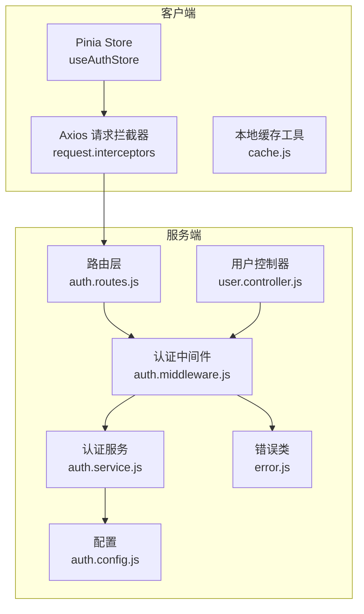
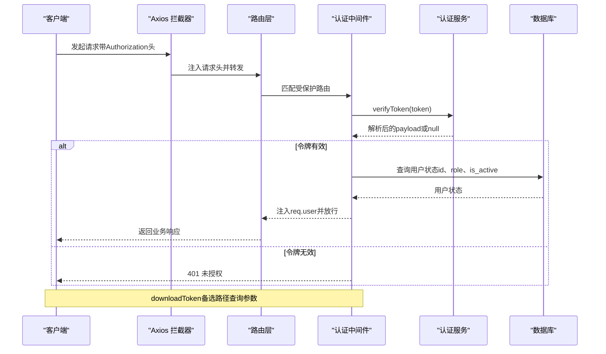
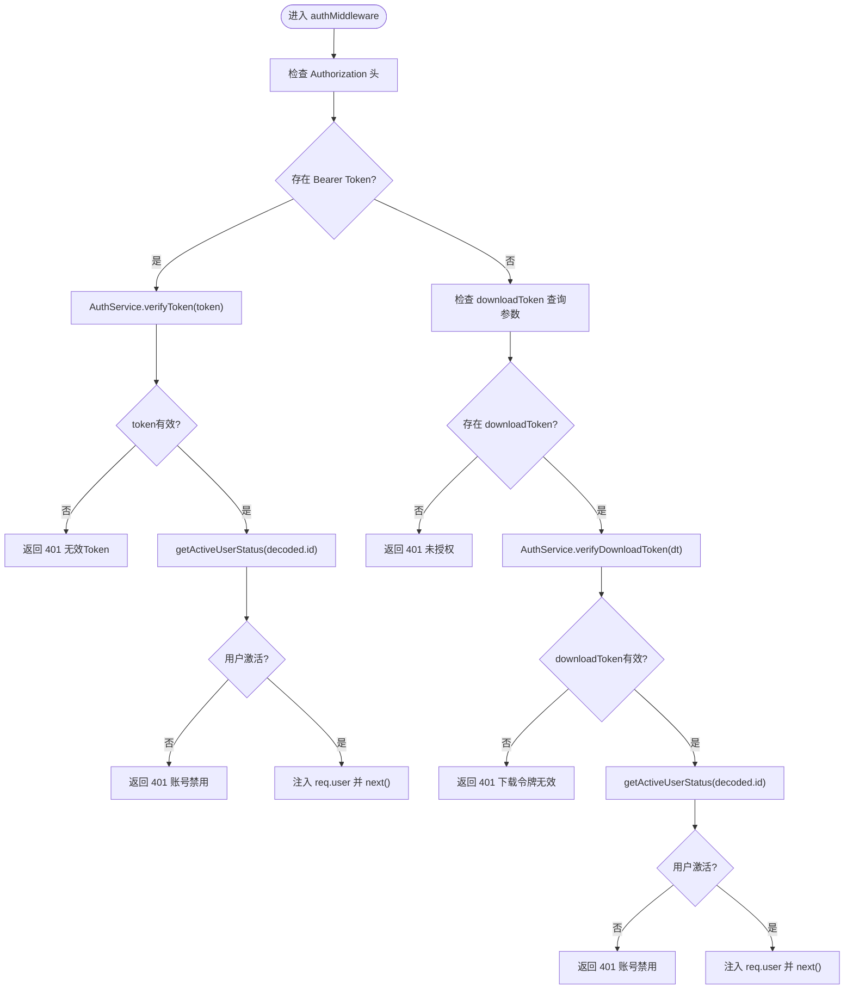
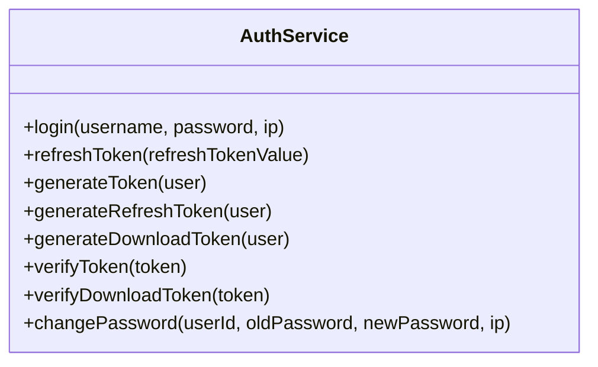
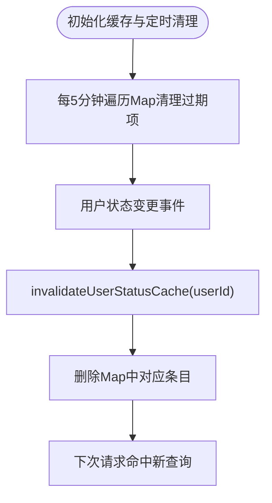
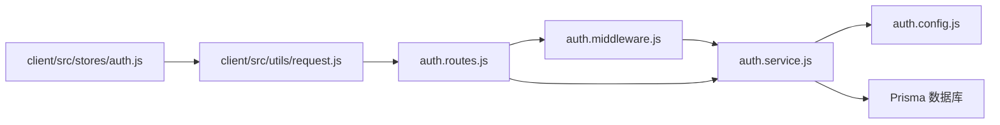

# 认证中间件

<cite>
**本文引用的文件**
- [auth.middleware.js](file://server/src/middleware/auth.middleware.js)
- [auth.service.js](file://server/src/services/auth.service.js)
- [auth.routes.js](file://server/src/routes/auth.routes.js)
- [auth.config.js](file://server/src/config/auth.config.js)
- [error.js](file://server/src/utils/error.js)
- [user.controller.js](file://server/src/controllers/user.controller.js)
- [auth.js](file://client/src/stores/auth.js)
- [request.js](file://client/src/utils/request.js)
- [cache.js](file://client/src/utils/cache.js)
- [auth.routes.test.js](file://server/src/__tests__/integration/auth.routes.test.js)
</cite>

## 目录
1. [简介](#简介)
2. [项目结构](#项目结构)
3. [核心组件](#核心组件)
4. [架构总览](#架构总览)
5. [详细组件分析](#详细组件分析)
6. [依赖关系分析](#依赖关系分析)
7. [性能考量](#性能考量)
8. [故障排查指南](#故障排查指南)
9. [结论](#结论)
10. [附录](#附录)

## 简介
本文件面向KEC课程管理平台的认证中间件，系统化阐述JWT令牌验证机制的完整流程，包括：
- Bearer Token解析与校验
- 下载令牌（downloadToken）的生成与使用场景
- 用户状态校验（激活状态与角色）
- 用户状态缓存（TTL 30秒）的实现原理、清理机制与主动失效策略
- 错误处理、安全考虑与性能优化
- 提供认证流程图与实际使用示例

## 项目结构
认证相关代码主要分布在服务端中间件、服务层、路由层与客户端状态管理与HTTP拦截器中，形成“路由→中间件→服务→数据库”的清晰职责分层。

图表来源
- [auth.routes.js:1-181](file://server/src/routes/auth.routes.js#L1-L181)
- [auth.middleware.js:1-129](file://server/src/middleware/auth.middleware.js#L1-L129)
- [auth.service.js:1-199](file://server/src/services/auth.service.js#L1-L199)
- [auth.config.js:1-58](file://server/src/config/auth.config.js#L1-L58)
- [error.js:1-58](file://server/src/utils/error.js#L1-L58)
- [user.controller.js:1-252](file://server/src/controllers/user.controller.js#L1-L252)
- [auth.js:1-222](file://client/src/stores/auth.js#L1-L222)
- [request.js:1-145](file://client/src/utils/request.js#L1-L145)
- [cache.js:1-122](file://client/src/utils/cache.js#L1-L122)

章节来源
- [auth.routes.js:1-181](file://server/src/routes/auth.routes.js#L1-L181)
- [auth.middleware.js:1-129](file://server/src/middleware/auth.middleware.js#L1-L129)
- [auth.service.js:1-199](file://server/src/services/auth.service.js#L1-L199)
- [auth.config.js:1-58](file://server/src/config/auth.config.js#L1-L58)
- [error.js:1-58](file://server/src/utils/error.js#L1-L58)
- [user.controller.js:1-252](file://server/src/controllers/user.controller.js#L1-L252)
- [auth.js:1-222](file://client/src/stores/auth.js#L1-L222)
- [request.js:1-145](file://client/src/utils/request.js#L1-L145)
- [cache.js:1-122](file://client/src/utils/cache.js#L1-L122)

## 核心组件
- 认证中间件：负责从请求头提取Bearer Token或从查询参数解析downloadToken，校验JWT有效性并进行用户状态二次确认，注入req.user并进入后续路由处理。
- 认证服务：封装JWT签发与验证（含Access/Refresh/Download三种令牌），提供登录、刷新、密码修改等能力。
- 路由层：对认证接口与受保护接口进行路由编排，结合速率限制与输入验证。
- 配置：集中管理JWT密钥、过期时间与BCrypt迭代次数，支持独立密钥与HKDF派生。
- 客户端：Pinia Store管理登录态与令牌，Axios拦截器自动附加Authorization头，统一处理401刷新与错误提示。
- 错误体系：统一的AppError及其子类，便于前后端一致的错误语义与状态码。

章节来源
- [auth.middleware.js:40-106](file://server/src/middleware/auth.middleware.js#L40-L106)
- [auth.service.js:8-199](file://server/src/services/auth.service.js#L8-L199)
- [auth.routes.js:1-181](file://server/src/routes/auth.routes.js#L1-L181)
- [auth.config.js:1-58](file://server/src/config/auth.config.js#L1-L58)
- [auth.js:1-222](file://client/src/stores/auth.js#L1-L222)
- [request.js:1-145](file://client/src/utils/request.js#L1-L145)
- [error.js:1-58](file://server/src/utils/error.js#L1-L58)

## 架构总览
下图展示从客户端发起请求到服务端认证中间件处理的关键交互。

图表来源
- [auth.middleware.js:40-106](file://server/src/middleware/auth.middleware.js#L40-L106)
- [auth.service.js:133-155](file://server/src/services/auth.service.js#L133-L155)
- [auth.routes.js:112-131](file://server/src/routes/auth.routes.js#L112-L131)

## 详细组件分析

### 认证中间件（auth.middleware.js）
- Bearer Token解析：优先从Authorization头解析，若不存在则尝试downloadToken查询参数。
- downloadToken处理：当使用downloadToken时，先验证其有效性，再进行用户状态校验（激活状态与角色），确保禁用用户无法绕过。
- 用户状态校验：通过getActiveUserStatus从数据库查询最新状态，避免旧token角色过期；将role与状态注入req.user。
- 缓存策略：Map实现的内存缓存，TTL 30秒；每5分钟清理过期条目；用户状态变更时主动失效。
- 角色中间件：roleMiddleware根据req.user.role进行权限控制。

图表来源
- [auth.middleware.js:40-106](file://server/src/middleware/auth.middleware.js#L40-L106)
- [auth.service.js:133-155](file://server/src/services/auth.service.js#L133-L155)

章节来源
- [auth.middleware.js:1-129](file://server/src/middleware/auth.middleware.js#L1-L129)

### 认证服务（auth.service.js）
- 登录：校验用户名、密码与激活状态，签发Access与Refresh令牌，记录审计日志。
- 刷新：校验Refresh Token类型与用户有效性，签发新的令牌对。
- 令牌签发与验证：Access/Refresh/Download三类令牌分别使用独立密钥（可从HKDF派生），支持自定义过期时间。
- 密码修改：校验原密码，使用配置的BCrypt迭代次数加密新密码并持久化。

图表来源
- [auth.service.js:8-199](file://server/src/services/auth.service.js#L8-L199)

章节来源
- [auth.service.js:1-199](file://server/src/services/auth.service.js#L1-L199)

### 路由层（auth.routes.js）
- 登录/刷新/登出/个人信息/下载令牌生成等接口均受认证中间件保护。
- 速率限制：针对登录、刷新、修改密码、登出等接口设置不同窗口与上限，支持基于用户ID或IP的限流键生成。
- XSS防护与输入验证：集成XSS清洗与多处验证中间件，统一错误处理。

章节来源
- [auth.routes.js:1-181](file://server/src/routes/auth.routes.js#L1-L181)

### 配置（auth.config.js）
- 密钥管理：JWT_SECRET为根密钥，JWT_REFRESH_SECRET与JWT_DOWNLOAD_SECRET可独立配置；未配置时使用HKDF从根密钥派生，生产环境会记录安全警告。
- 过期时间：Access Token、Refresh Token、Download Token各自独立配置。
- BCrypt迭代：从环境变量读取，增强密码哈希安全性。

章节来源
- [auth.config.js:1-58](file://server/src/config/auth.config.js#L1-L58)

### 客户端（Pinia Store与HTTP拦截器）
- Pinia Store：维护token、refreshToken与用户信息，提供登录、登出、刷新、获取用户信息等方法；支持本地存储与Cookie同步。
- Axios拦截器：自动附加Authorization头；统一处理401刷新、403权限不足与通用错误提示；并发请求排队等待刷新完成。
- 响应缓存：独立的API响应缓存工具，最大容量与LRU淘汰策略，定期清理过期缓存。

章节来源
- [auth.js:1-222](file://client/src/stores/auth.js#L1-L222)
- [request.js:1-145](file://client/src/utils/request.js#L1-L145)
- [cache.js:1-122](file://client/src/utils/cache.js#L1-L122)

### 用户状态缓存与主动失效
- 缓存结构：Map，键为用户ID，值包含role、is_active与expireAt时间戳。
- TTL与清理：30秒TTL，5分钟间隔清理过期条目；用户状态变更（更新角色、更新状态、删除用户）时主动失效。
- 主动失效点：用户控制器中对角色与状态变更调用invalidateUserStatusCache，确保禁用/启用立即生效。

图表来源
- [auth.middleware.js:5-20](file://server/src/middleware/auth.middleware.js#L5-L20)
- [user.controller.js:140-141](file://server/src/controllers/user.controller.js#L140-L141)
- [user.controller.js:189-190](file://server/src/controllers/user.controller.js#L189-L190)
- [user.controller.js:234-235](file://server/src/controllers/user.controller.js#L234-L235)

章节来源
- [auth.middleware.js:5-20](file://server/src/middleware/auth.middleware.js#L5-L20)
- [user.controller.js:140-141](file://server/src/controllers/user.controller.js#L140-L141)
- [user.controller.js:189-190](file://server/src/controllers/user.controller.js#L189-L190)
- [user.controller.js:234-235](file://server/src/controllers/user.controller.js#L234-L235)

### 角色中间件（roleMiddleware）
- 依据req.user.role与允许的角色集合进行权限判定，未授权返回401，权限不足返回403。
- 日志记录：对越权访问进行告警记录，便于审计。

章节来源
- [auth.middleware.js:108-128](file://server/src/middleware/auth.middleware.js#L108-L128)

## 依赖关系分析
- 中间件依赖服务层进行JWT验证与下载令牌处理。
- 服务层依赖配置模块获取密钥与过期时间，依赖Prisma访问数据库。
- 路由层依赖中间件与服务层，结合验证与速率限制中间件。
- 客户端依赖Axios拦截器与Pinia Store，统一处理认证态与错误。

图表来源
- [auth.middleware.js:1-129](file://server/src/middleware/auth.middleware.js#L1-L129)
- [auth.service.js:1-199](file://server/src/services/auth.service.js#L1-L199)
- [auth.config.js:1-58](file://server/src/config/auth.config.js#L1-L58)
- [auth.routes.js:1-181](file://server/src/routes/auth.routes.js#L1-L181)
- [auth.js:1-222](file://client/src/stores/auth.js#L1-L222)
- [request.js:1-145](file://client/src/utils/request.js#L1-L145)

章节来源
- [auth.middleware.js:1-129](file://server/src/middleware/auth.middleware.js#L1-L129)
- [auth.service.js:1-199](file://server/src/services/auth.service.js#L1-L199)
- [auth.config.js:1-58](file://server/src/config/auth.config.js#L1-L58)
- [auth.routes.js:1-181](file://server/src/routes/auth.routes.js#L1-L181)
- [auth.js:1-222](file://client/src/stores/auth.js#L1-L222)
- [request.js:1-145](file://client/src/utils/request.js#L1-L145)

## 性能考量
- 用户状态缓存：30秒TTL显著降低数据库查询压力，Map查找O(1)，适合高并发场景。
- 定时清理：5分钟清理过期条目，避免内存无限增长。
- 下载令牌：60秒有效期，专用于无法设置Authorization头的场景，降低安全风险。
- 客户端缓存：API响应缓存配合LRU与定期清理，减少重复请求。
- 速率限制：针对高频接口设置限流，防止暴力破解与滥用。

## 故障排查指南
- 401 未授权
  - 检查Authorization头是否正确携带Bearer Token。
  - 确认downloadToken查询参数是否存在且未过期。
  - 核对用户是否仍处于激活状态。
- 403 权限不足
  - 检查角色中间件允许的角色集合。
  - 确认用户角色是否已更新，缓存是否已主动失效。
- 服务端错误
  - 查看日志与审计记录，定位具体错误类型（认证/授权/验证）。
  - 确认JWT密钥配置与过期时间设置。
- 客户端问题
  - 检查Axios拦截器是否正确附加Authorization头。
  - 确认刷新流程是否成功，401时是否正确触发刷新队列。

章节来源
- [auth.middleware.js:40-106](file://server/src/middleware/auth.middleware.js#L40-L106)
- [auth.routes.js:1-181](file://server/src/routes/auth.routes.js#L1-L181)
- [error.js:1-58](file://server/src/utils/error.js#L1-L58)
- [request.js:60-112](file://client/src/utils/request.js#L60-L112)

## 结论
该认证中间件通过Bearer Token与downloadToken双通道、用户状态缓存与主动失效策略、严格的配置与错误处理，构建了安全、高效且易维护的认证体系。配合客户端的统一拦截与刷新机制，整体具备良好的用户体验与安全性保障。

## 附录

### 实际使用示例
- 前端登录后自动保存token与用户信息，后续请求自动附加Authorization头。
- 需要下载导出数据时，通过生成downloadToken并在新窗口打开，无需手动设置头。
- 管理员更新用户状态或角色后，立即清除缓存，确保权限变更即时生效。

章节来源
- [auth.js:48-89](file://client/src/stores/auth.js#L48-L89)
- [auth.routes.js:133-152](file://server/src/routes/auth.routes.js#L133-L152)
- [user.controller.js:140-141](file://server/src/controllers/user.controller.js#L140-L141)
- [user.controller.js:189-190](file://server/src/controllers/user.controller.js#L189-L190)
- [user.controller.js:234-235](file://server/src/controllers/user.controller.js#L234-L235)