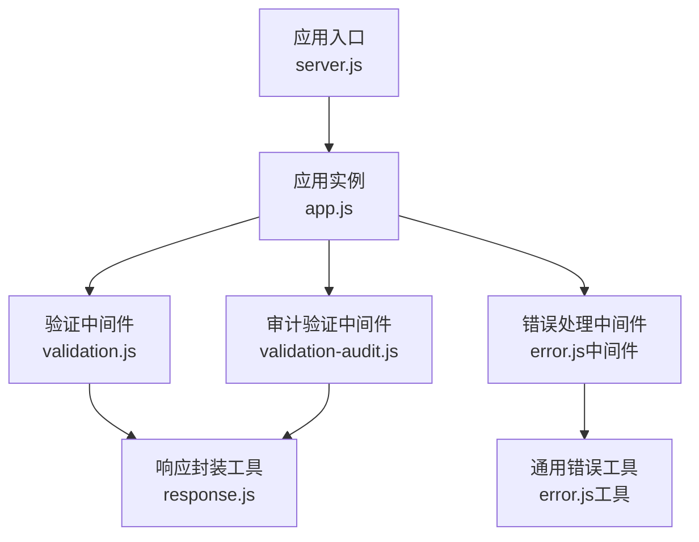
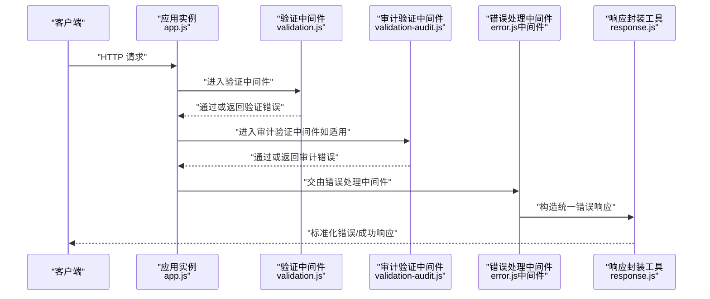
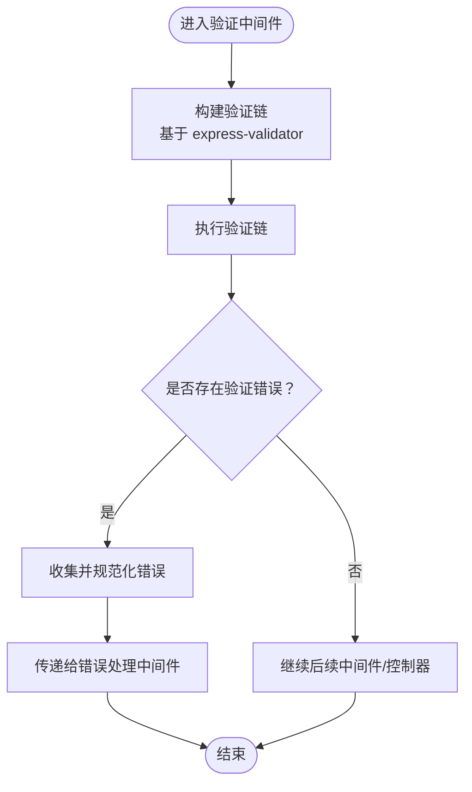
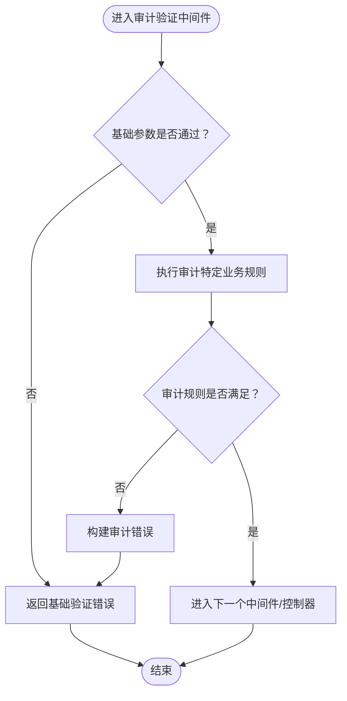
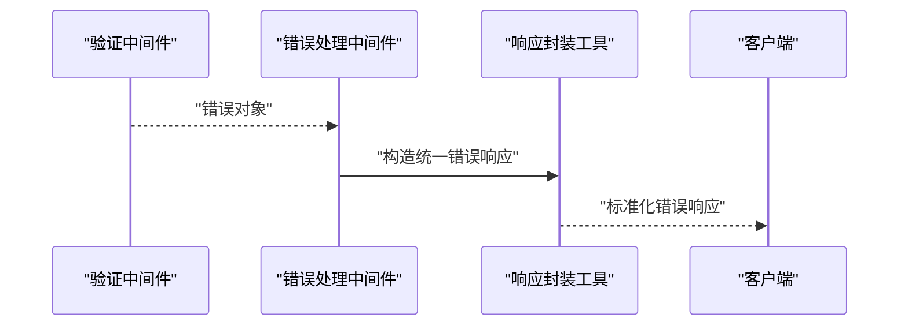
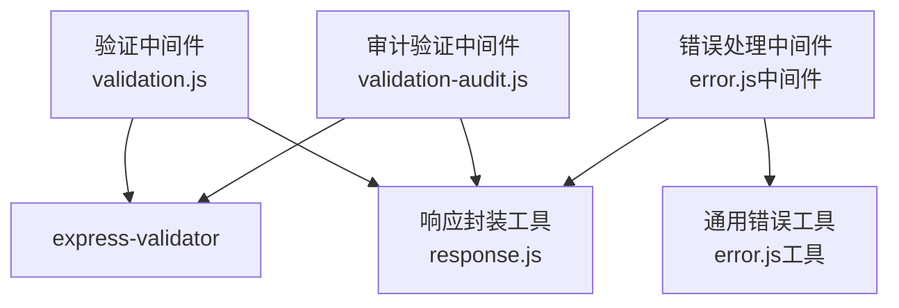

# 请求验证中间件

<cite>
**本文引用的文件**
- [validation.js](file://server/src/middleware/validation.js)
- [validation-audit.js](file://server/src/middleware/validation-audit.js)
- [validation.test.js](file://server/src/middleware/__tests__/validation.test.js)
- [error.js（中间件）](file://server/src/middleware/error.js)
- [response.js](file://server/src/utils/response.js)
- [error.js（工具）](file://server/src/utils/error.js)
- [app.js](file://server/src/app.js)
- [server.js](file://server/src/server.js)
</cite>

## 目录
1. [简介](#简介)
2. [项目结构](#项目结构)
3. [核心组件](#核心组件)
4. [架构总览](#架构总览)
5. [详细组件分析](#详细组件分析)
6. [依赖关系分析](#依赖关系分析)
7. [性能考虑](#性能考虑)
8. [故障排查指南](#故障排查指南)
9. [结论](#结论)
10. [附录](#附录)

## 简介
本文件针对 KEC 课程管理平台后端的请求验证中间件进行系统化技术文档编写，重点覆盖以下方面：
- 输入参数校验、数据格式验证与业务规则检查的实现机制
- 验证中间件的错误收集与处理策略、验证失败的统一响应格式与错误消息组织方式
- 自定义验证规则的扩展方法
- 验证性能优化与常见验证场景的最佳实践

该中间件基于 express-validator 构建，结合项目自定义的错误处理与响应封装，形成可复用、可扩展且易于维护的请求级验证体系。

## 项目结构
与请求验证相关的代码主要分布在 server/src/middleware 与 server/src/utils 目录中，配合路由层在应用启动时注册中间件，形成从入口到控制器的完整验证链路。

**图表来源**
- [server.js:1-50](file://server/src/server.js#L1-L50)
- [app.js:1-80](file://server/src/app.js#L1-L80)
- [validation.js:1-120](file://server/src/middleware/validation.js#L1-L120)
- [validation-audit.js:1-120](file://server/src/middleware/validation-audit.js#L1-L120)
- [error.js（中间件）:1-120](file://server/src/middleware/error.js#L1-L120)
- [response.js:1-120](file://server/src/utils/response.js#L1-L120)
- [error.js（工具）:1-120](file://server/src/utils/error.js#L1-L120)

**章节来源**
- [server.js:1-50](file://server/src/server.js#L1-L50)
- [app.js:1-80](file://server/src/app.js#L1-L80)

## 核心组件
- 验证中间件（validation.js）
  - 基于 express-validator 的验证链构建与执行，负责对请求参数进行格式与范围校验，并将验证结果转换为统一错误结构。
- 审计验证中间件（validation-audit.js）
  - 针对审计类接口的特殊验证需求，补充额外的业务规则与上下文检查。
- 错误处理中间件（error.js）
  - 捕获验证阶段抛出的错误，结合响应封装工具输出标准化的错误响应。
- 响应封装工具（response.js）
  - 提供统一的成功/失败响应结构，确保错误消息与状态码的一致性。
- 通用错误工具（error.js）
  - 封装错误类型与错误码映射，便于在中间件与控制器之间共享。

**章节来源**
- [validation.js:1-120](file://server/src/middleware/validation.js#L1-L120)
- [validation-audit.js:1-120](file://server/src/middleware/validation-audit.js#L1-L120)
- [error.js（中间件）:1-120](file://server/src/middleware/error.js#L1-L120)
- [response.js:1-120](file://server/src/utils/response.js#L1-L120)
- [error.js（工具）:1-120](file://server/src/utils/error.js#L1-L120)

## 架构总览
下图展示了从客户端请求进入，经过验证中间件、审计验证中间件，再到错误处理与响应封装的整体流程。

**图表来源**
- [app.js:1-80](file://server/src/app.js#L1-L80)
- [validation.js:1-120](file://server/src/middleware/validation.js#L1-L120)
- [validation-audit.js:1-120](file://server/src/middleware/validation-audit.js#L1-L120)
- [error.js（中间件）:1-120](file://server/src/middleware/error.js#L1-L120)
- [response.js:1-120](file://server/src/utils/response.js#L1-L120)

## 详细组件分析

### 验证中间件（validation.js）
职责与实现要点：
- 使用 express-validator 的验证链构建器对请求参数进行声明式校验，支持必填、类型、长度、格式、枚举等基础规则。
- 对于复合校验（如多字段关联规则），在验证链结束后进行业务规则检查。
- 将验证结果转换为统一的错误对象结构，包含字段名、错误消息与可选的上下文信息。
- 在验证失败时，将错误对象传递给下游错误处理中间件；通过时继续进入控制器逻辑。

**图表来源**
- [validation.js:1-120](file://server/src/middleware/validation.js#L1-L120)

**章节来源**
- [validation.js:1-120](file://server/src/middleware/validation.js#L1-L120)

### 审计验证中间件（validation-audit.js）
职责与实现要点：
- 针对审计类接口的特殊需求，补充额外的上下文校验（如操作人权限、资源存在性、状态一致性等）。
- 与通用验证中间件协同工作，在基础参数校验之后进行业务规则检查。
- 统一错误输出格式，保证与全局错误处理一致。

**图表来源**
- [validation-audit.js:1-120](file://server/src/middleware/validation-audit.js#L1-L120)

**章节来源**
- [validation-audit.js:1-120](file://server/src/middleware/validation-audit.js#L1-L120)

### 错误处理中间件（error.js）
职责与实现要点：
- 捕获来自验证中间件的错误对象，结合响应封装工具生成标准化的错误响应。
- 支持区分业务错误与系统错误，设置合适的 HTTP 状态码与错误码。
- 输出统一的错误结构，包含错误码、错误消息与可选的详细信息，便于前端统一处理。

**图表来源**
- [error.js（中间件）:1-120](file://server/src/middleware/error.js#L1-L120)
- [response.js:1-120](file://server/src/utils/response.js#L1-L120)

**章节来源**
- [error.js（中间件）:1-120](file://server/src/middleware/error.js#L1-L120)
- [response.js:1-120](file://server/src/utils/response.js#L1-L120)

### 响应封装工具（response.js）
职责与实现要点：
- 提供统一的成功/失败响应结构，确保错误消息与状态码的一致性。
- 支持在控制器与中间件中直接调用，减少重复代码与不一致风险。

**章节来源**
- [response.js:1-120](file://server/src/utils/response.js#L1-L120)

### 通用错误工具（error.js）
职责与实现要点：
- 封装错误类型与错误码映射，便于在中间件与控制器之间共享。
- 可用于在验证失败时快速生成标准错误对象，提升一致性与可维护性。

**章节来源**
- [error.js（工具）:1-120](file://server/src/utils/error.js#L1-L120)

## 依赖关系分析
验证中间件与相关模块之间的依赖关系如下：

**图表来源**
- [validation.js:1-120](file://server/src/middleware/validation.js#L1-L120)
- [validation-audit.js:1-120](file://server/src/middleware/validation-audit.js#L1-L120)
- [error.js（中间件）:1-120](file://server/src/middleware/error.js#L1-L120)
- [response.js:1-120](file://server/src/utils/response.js#L1-L120)
- [error.js（工具）:1-120](file://server/src/utils/error.js#L1-L120)

**章节来源**
- [validation.js:1-120](file://server/src/middleware/validation.js#L1-L120)
- [validation-audit.js:1-120](file://server/src/middleware/validation-audit.js#L1-L120)
- [error.js（中间件）:1-120](file://server/src/middleware/error.js#L1-L120)
- [response.js:1-120](file://server/src/utils/response.js#L1-L120)
- [error.js（工具）:1-120](file://server/src/utils/error.js#L1-L120)

## 性能考虑
- 验证链顺序优化：将最可能失败且成本较低的规则放在前面，尽早短路，减少不必要的计算。
- 规则粒度控制：避免过度拆分验证链导致多次遍历，同时保持规则清晰可维护。
- 批量验证：对于批量接口，优先进行字段级快速校验，再进行昂贵的业务规则检查。
- 缓存与索引：在业务规则涉及数据库查询时，利用现有索引与缓存策略降低延迟。
- 异步规则：尽量避免在同步验证链中执行异步操作；若必须，确保异步完成后正确合并结果。

## 故障排查指南
- 验证未触发或规则未生效
  - 检查路由是否正确挂载了验证中间件，确认中间件在控制器之前注册。
  - 确认请求方法与路径匹配，避免因路由配置导致中间件未被调用。
- 错误响应不符合预期
  - 检查错误处理中间件是否正确捕获并转换错误对象。
  - 确认响应封装工具的调用位置与参数，避免重复包装或遗漏。
- 审计规则异常
  - 核对审计验证中间件中的业务规则与上下文检查逻辑，确保与控制器行为一致。
- 单元测试覆盖
  - 参考验证中间件的单元测试文件，定位失败用例并逐项修复规则或边界条件。

**章节来源**
- [validation.test.js:1-200](file://server/src/middleware/__tests__/validation.test.js#L1-L200)

## 结论
本验证中间件体系以 express-validator 为基础，结合项目自定义的错误处理与响应封装，实现了高内聚、低耦合的请求级验证能力。通过规范化的错误收集与统一响应格式，提升了系统的可维护性与用户体验。建议在新增接口时遵循既有模式，优先使用声明式规则，并在必要时扩展审计验证中间件以满足业务约束。

## 附录
- 自定义验证规则添加步骤
  - 在对应中间件中新增验证链，明确字段、规则与错误消息。
  - 若涉及复杂业务规则，可在验证链结束后补充检查逻辑。
  - 使用响应封装工具输出统一错误结构，确保前后端一致。
- 常见验证场景最佳实践
  - 参数必填与类型校验：优先使用内置规则，减少自定义逻辑。
  - 字段间关系：通过自定义规则或后置检查实现，注意错误消息的可读性。
  - 审计类接口：在审计验证中间件中集中处理权限与状态检查，避免分散在控制器中。