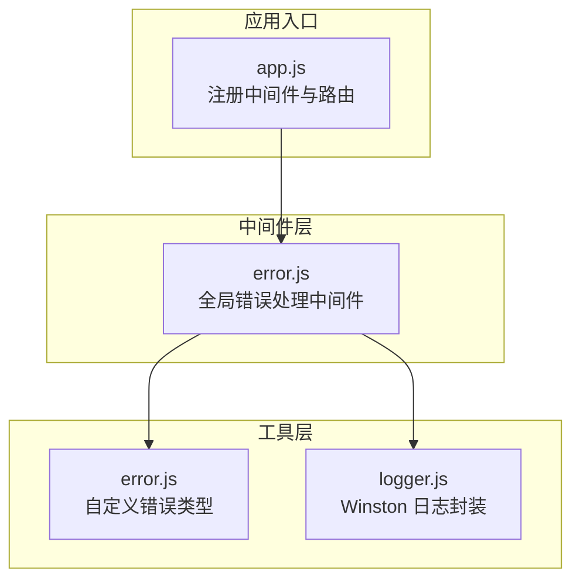
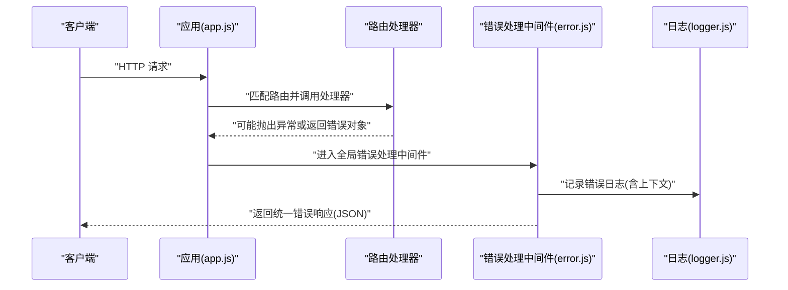
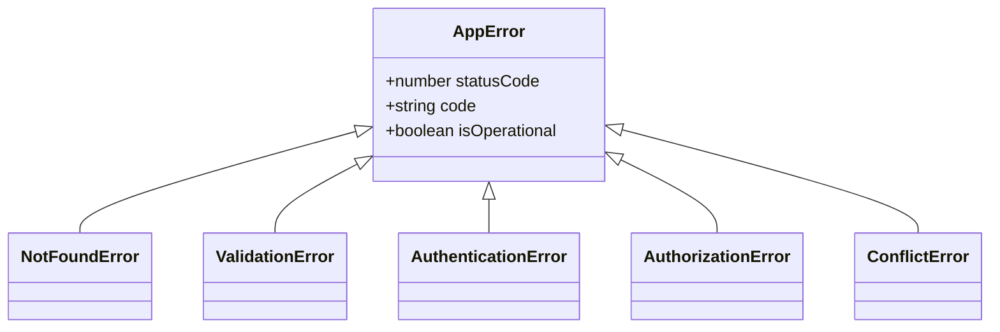
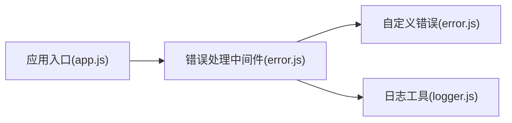

# 错误处理中间件

<cite>
**本文档引用的文件**
- [server/src/middleware/error.js](file://server/src/middleware/error.js)
- [server/src/utils/error.js](file://server/src/utils/error.js)
- [server/src/app.js](file://server/src/app.js)
- [server/src/utils/logger.js](file://server/src/utils/logger.js)
</cite>

## 目录
1. [简介](#简介)
2. [项目结构](#项目结构)
3. [核心组件](#核心组件)
4. [架构总览](#架构总览)
5. [详细组件分析](#详细组件分析)
6. [依赖关系分析](#依赖关系分析)
7. [性能考量](#性能考量)
8. [故障排查指南](#故障排查指南)
9. [结论](#结论)

## 简介
本文件系统化梳理 KEC 课程管理平台的错误处理中间件，覆盖全局错误捕获与统一处理、同步与异步错误的处理策略、错误分类与响应格式标准化、执行时机与日志记录策略、敏感信息脱敏、自定义错误类型创建、错误恢复与调试信息提供等主题。目标是帮助开发者快速理解并正确使用错误处理机制，提升系统的稳定性与可观测性。

## 项目结构
错误处理相关代码主要分布在以下位置：
- 中间件层：统一错误处理逻辑
- 工具层：自定义错误类型与日志工具
- 应用入口：中间件注册与路由组织

图表来源
- [server/src/app.js:155](file://server/src/app.js#L155)
- [server/src/middleware/error.js:1-63](file://server/src/middleware/error.js#L1-L63)
- [server/src/utils/error.js:1-58](file://server/src/utils/error.js#L1-L58)
- [server/src/utils/logger.js:1-96](file://server/src/utils/logger.js#L1-L96)

章节来源
- [server/src/app.js:155](file://server/src/app.js#L155)

## 核心组件
- 全局错误处理中间件：负责捕获同步与异步错误，进行分类与响应格式标准化，记录日志并返回统一的错误响应。
- 自定义错误类型：提供业务语义明确的错误类别，便于前端与监控系统识别与处理。
- 日志工具：基于 Winston 的结构化日志记录，支持多通道输出与审计日志。

章节来源
- [server/src/middleware/error.js:35-62](file://server/src/middleware/error.js#L35-L62)
- [server/src/utils/error.js:5-12](file://server/src/utils/error.js#L5-L12)
- [server/src/utils/logger.js:34-95](file://server/src/utils/logger.js#L34-L95)

## 架构总览
错误处理在应用启动时通过中间件注册接入，位于路由之后，确保所有路由抛出或返回的错误都能被统一拦截与处理。

图表来源
- [server/src/app.js:155](file://server/src/app.js#L155)
- [server/src/middleware/error.js:35-62](file://server/src/middleware/error.js#L35-L62)
- [server/src/utils/logger.js:90-95](file://server/src/utils/logger.js#L90-L95)

## 详细组件分析

### 全局错误处理中间件
- 执行时机：作为最后一个中间件注册，必须放在路由之后，确保所有错误都会被拦截。
- 同步与异步错误统一处理：无论同步抛错还是异步 Promise 拒绝未被捕获，最终都会进入该中间件。
- 错误分类与处理：
  - Prisma 特定错误码：对唯一约束冲突、外键约束失败、无效参数、记录不存在等进行安全提示映射。
  - JWT 相关错误：针对过期与无效令牌给出用户友好的提示。
  - 自定义应用错误(AppError及其子类)：保留业务状态码与错误代码，按是否生产环境决定是否暴露细节。
  - 未知错误：记录完整堆栈与消息，返回通用错误提示。
- 响应格式标准化：
  - 成功字段：统一为布尔值，错误时为 false。
  - 消息字段：生产环境优先使用安全提示；开发环境显示原始消息。
  - 附加字段：生产环境不返回堆栈；开发环境返回堆栈以便调试。
  - 错误代码：开发环境返回自定义错误代码，生产环境省略以避免信息泄露。
- 日志记录策略：
  - 使用结构化日志记录错误上下文（如状态码、错误代码、堆栈）。
  - 区分“未处理错误”与“应用错误”，前者记录更详细。
  - 生产环境默认只记录 error 级别，开发环境可输出到控制台。

章节来源
- [server/src/middleware/error.js:7-33](file://server/src/middleware/error.js#L7-L33)
- [server/src/middleware/error.js:35-62](file://server/src/middleware/error.js#L35-L62)
- [server/src/utils/logger.js:34-95](file://server/src/utils/logger.js#L34-L95)

### 自定义错误类型体系
- AppError：所有业务错误的基类，包含状态码、错误代码与可操作标记。
- NotFoundError：资源不存在，状态码 404。
- ValidationError：参数校验失败，状态码 422。
- AuthenticationError：未认证，状态码 401。
- AuthorizationError：权限不足，状态码 403。
- ConflictError：资源冲突，状态码 409。

图表来源
- [server/src/utils/error.js:5-57](file://server/src/utils/error.js#L5-L57)

章节来源
- [server/src/utils/error.js:5-57](file://server/src/utils/error.js#L5-L57)

### 日志与审计
- 日志级别与输出：
  - 文件通道：错误日志、综合日志、审计日志，支持轮转与大小限制。
  - 控制台通道：开发环境彩色输出，生产环境纯文本输出。
- 结构化元数据：日志记录器统一注入服务名与时间戳，便于检索与聚合。
- 审计通道：独立文件通道，便于合规与审计追踪。

章节来源
- [server/src/utils/logger.js:34-95](file://server/src/utils/logger.js#L34-L95)

### 错误响应格式规范
- 统一字段：
  - success: false
  - message: 字符串，生产环境使用安全提示，开发环境使用原始消息
  - code: 字符串，开发环境返回错误代码，生产环境省略
  - stack: 字符串，开发环境返回堆栈，生产环境省略
- 状态码选择：
  - 自定义错误：使用错误对象的状态码
  - 未知错误：优先使用错误对象上的状态码，否则回退 500

章节来源
- [server/src/middleware/error.js:44-61](file://server/src/middleware/error.js#L44-L61)

### 执行时机与中间件注册
- 注册顺序：命名转换中间件 → XSS 清洗 → 路由 → 全局错误处理中间件。
- 错误处理中间件必须置于路由之后，确保所有错误均可被捕获。

章节来源
- [server/src/app.js:84-89](file://server/src/app.js#L84-L89)
- [server/src/app.js:155](file://server/src/app.js#L155)

## 依赖关系分析
- 错误处理中间件依赖：
  - 自定义错误类型：用于区分业务错误与未知错误。
  - 日志工具：用于记录错误上下文与堆栈。
- 应用入口依赖：
  - 错误处理中间件：保证全局一致性。
  - 路由模块：提供具体业务处理，可能抛出或返回错误。

图表来源
- [server/src/app.js:155](file://server/src/app.js#L155)
- [server/src/middleware/error.js:1-2](file://server/src/middleware/error.js#L1-L2)
- [server/src/utils/error.js:1-2](file://server/src/utils/error.js#L1-L2)
- [server/src/utils/logger.js:1](file://server/src/utils/logger.js#L1)

章节来源
- [server/src/app.js:155](file://server/src/app.js#L155)
- [server/src/middleware/error.js:1-2](file://server/src/middleware/error.js#L1-L2)
- [server/src/utils/error.js:1-2](file://server/src/utils/error.js#L1-L2)
- [server/src/utils/logger.js:1](file://server/src/utils/logger.js#L1)

## 性能考量
- 错误处理中间件本身开销极小，主要成本在于日志写入与 JSON 序列化。
- 生产环境建议使用文件通道与轮转策略，避免频繁 I/O 影响性能。
- 对于高频错误，建议结合指标监控与告警，定位热点问题而非单纯降低日志量。

## 故障排查指南
- 如何触发与验证错误处理：
  - 在路由处理器中主动抛出自定义错误，验证响应字段与日志记录。
  - 触发 Prisma 错误码（如唯一约束冲突），验证安全提示映射。
  - 抛出未捕获异常，验证未知错误路径与堆栈记录。
- 关注点：
  - 生产环境是否正确隐藏堆栈与内部细节。
  - 日志文件是否存在、是否轮转正常。
  - 审计通道是否记录关键错误事件。
- 常见问题定位：
  - 响应字段缺失：检查中间件注册顺序与错误对象属性。
  - 日志未输出：确认日志级别与通道配置。
  - 安全提示不符合预期：核对 Prisma 错误码映射与 JWT 错误分支。

章节来源
- [server/src/middleware/error.js:35-62](file://server/src/middleware/error.js#L35-L62)
- [server/src/utils/logger.js:34-95](file://server/src/utils/logger.js#L34-L95)

## 结论
该错误处理中间件通过统一的错误分类、标准化响应格式与结构化日志记录，实现了对同步与异步错误的一致处理。配合自定义错误类型与日志工具，既保障了用户体验（生产环境的安全提示），又满足了开发调试（开发环境的详细信息）。建议在新增路由时遵循现有模式抛出或返回错误对象，确保错误处理链路完整与一致。