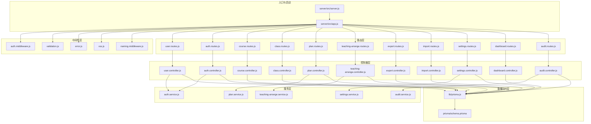
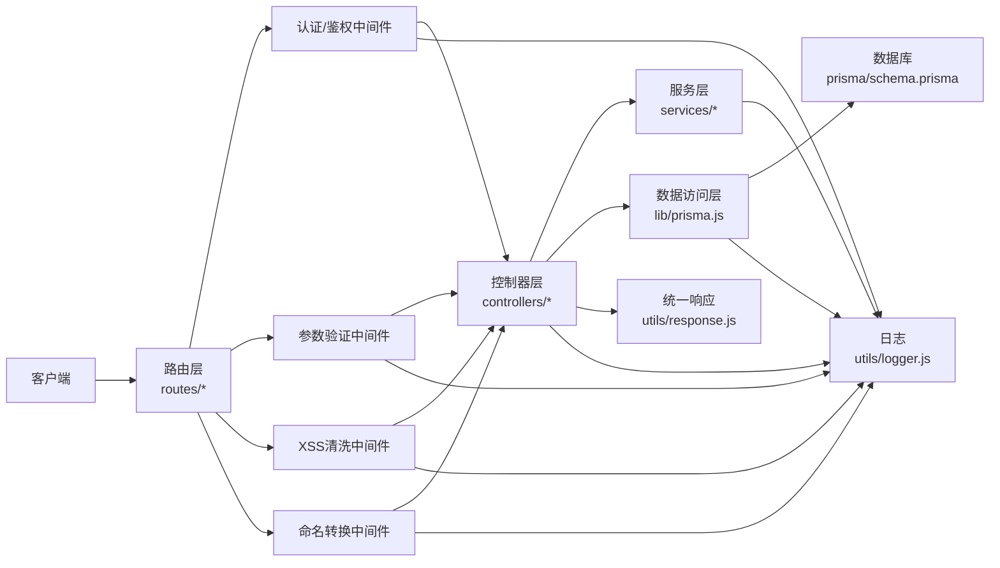
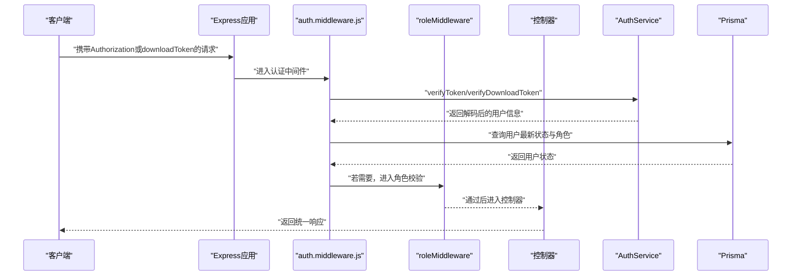
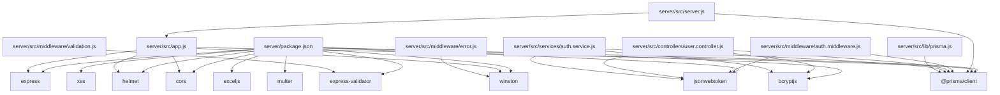
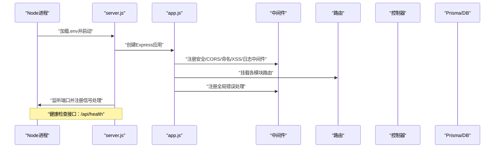

# 后端架构

<cite>
**本文引用的文件**
- [server/src/app.js](file://server/src/app.js)
- [server/src/server.js](file://server/src/server.js)
- [server/package.json](file://server/package.json)
- [server/src/config/auth.config.js](file://server/src/config/auth.config.js)
- [server/src/constants/index.js](file://server/src/constants/index.js)
- [server/src/middleware/auth.middleware.js](file://server/src/middleware/auth.middleware.js)
- [server/src/middleware/validation.js](file://server/src/middleware/validation.js)
- [server/src/middleware/error.js](file://server/src/middleware/error.js)
- [server/src/lib/prisma.js](file://server/src/lib/prisma.js)
- [server/src/utils/logger.js](file://server/src/utils/logger.js)
- [server/src/utils/response.js](file://server/src/utils/response.js)
- [server/src/controllers/user.controller.js](file://server/src/controllers/user.controller.js)
- [server/src/routes/user.routes.js](file://server/src/routes/user.routes.js)
- [server/src/services/auth.service.js](file://server/src/services/auth.service.js)
- [server/prisma/schema.prisma](file://server/prisma/schema.prisma)
</cite>

## 目录
1. [引言](#引言)
2. [项目结构](#项目结构)
3. [核心组件](#核心组件)
4. [架构总览](#架构总览)
5. [详细组件分析](#详细组件分析)
6. [依赖关系分析](#依赖关系分析)
7. [性能考虑](#性能考虑)
8. [故障排查指南](#故障排查指南)
9. [结论](#结论)
10. [附录](#附录)

## 引言
本文件面向KEC课程管理平台后端，系统化阐述基于Express.js的RESTful API服务架构。文档聚焦以下方面：
- MVC设计模式的实现与职责划分
- 路由系统的组织方式与中间件体系
- 安全防护机制（认证、授权、XSS清洗、CORS、Helmet）
- 应用启动流程、错误处理机制、请求验证中间件
- 控制器层、服务层、数据访问层的职责边界与业务封装策略
- 配置管理与开发调试方法

## 项目结构
后端采用“按功能域分层”的组织方式，核心目录如下：
- config：认证与安全相关配置
- constants：常量定义（角色、分页、导入、审计模块等）
- controllers：控制器层，处理HTTP请求与响应
- middleware：中间件层，统一处理认证、鉴权、验证、错误、XSS等
- routes：路由层，按模块划分REST接口
- services：服务层，封装业务逻辑与领域模型
- utils：工具模块（日志、响应封装、Excel、排序等）
- lib：基础设施（Prisma客户端）
- prisma：数据库Schema与迁移脚本
- logs：运行时日志输出目录

图表来源
- [server/src/server.js:1-66](file://server/src/server.js#L1-L66)
- [server/src/app.js:1-158](file://server/src/app.js#L1-L158)
- [server/src/middleware/auth.middleware.js:1-129](file://server/src/middleware/auth.middleware.js#L1-L129)
- [server/src/middleware/validation.js:1-590](file://server/src/middleware/validation.js#L1-L590)
- [server/src/middleware/error.js:1-63](file://server/src/middleware/error.js#L1-L63)
- [server/src/routes/user.routes.js:1-64](file://server/src/routes/user.routes.js#L1-L64)
- [server/src/controllers/user.controller.js:1-252](file://server/src/controllers/user.controller.js#L1-L252)
- [server/src/services/auth.service.js:1-199](file://server/src/services/auth.service.js#L1-L199)
- [server/src/lib/prisma.js:1-34](file://server/src/lib/prisma.js#L1-L34)
- [server/prisma/schema.prisma:1-200](file://server/prisma/schema.prisma#L1-L200)

章节来源
- [server/src/app.js:1-158](file://server/src/app.js#L1-L158)
- [server/src/server.js:1-66](file://server/src/server.js#L1-L66)
- [server/package.json:1-53](file://server/package.json#L1-L53)

## 核心组件
- 应用入口与启动
  - server/src/server.js：加载环境变量、启动HTTP服务、注册全局异常与未处理Promise拒绝处理器、优雅关闭与Prisma断连、信号处理
  - server/src/app.js：构建Express应用、注册安全中间件（Helmet/CORS）、全局中间件（命名转换、XSS清洗、日志）、挂载路由、注册全局错误处理器
- 中间件体系
  - 认证与授权：auth.middleware.js（JWT校验、下载令牌校验、用户状态缓存、角色中间件）
  - 参数验证：validation.js（基于express-validator的规则集与统一错误处理）
  - 错误处理：error.js（Prisma错误映射、自定义错误、生产安全消息）
  - 安全清洗：xss.js（请求体与查询参数XSS过滤）
  - 命名转换：naming.middleware.js（camelCase与snake_case互转）
- 控制器层
  - user.controller.js：用户列表、创建、更新、状态变更等
  - 其他模块控制器遵循相同模式：接收请求、调用服务、返回统一响应
- 服务层
  - auth.service.js：登录、刷新令牌、密码修改、令牌签发与校验
  - 其他模块服务封装业务规则与事务边界
- 数据访问层
  - lib/prisma.js：Prisma客户端初始化、开发环境日志监听、测试数据库隔离
  - prisma/schema.prisma：数据库模型与索引定义
- 工具与配置
  - utils/logger.js：Winston日志配置（文件与控制台输出、审计日志通道）
  - utils/response.js：统一响应封装
  - config/auth.config.js：JWT与BCrypt配置、HKDF派生子密钥
  - constants/index.js：常量集中管理（角色、分页、导入、审计模块、工作量阈值等）

章节来源
- [server/src/server.js:1-66](file://server/src/server.js#L1-L66)
- [server/src/app.js:1-158](file://server/src/app.js#L1-L158)
- [server/src/middleware/auth.middleware.js:1-129](file://server/src/middleware/auth.middleware.js#L1-L129)
- [server/src/middleware/validation.js:1-590](file://server/src/middleware/validation.js#L1-L590)
- [server/src/middleware/error.js:1-63](file://server/src/middleware/error.js#L1-L63)
- [server/src/controllers/user.controller.js:1-252](file://server/src/controllers/user.controller.js#L1-L252)
- [server/src/services/auth.service.js:1-199](file://server/src/services/auth.service.js#L1-L199)
- [server/src/lib/prisma.js:1-34](file://server/src/lib/prisma.js#L1-L34)
- [server/prisma/schema.prisma:1-200](file://server/prisma/schema.prisma#L1-L200)
- [server/src/utils/logger.js:1-96](file://server/src/utils/logger.js#L1-L96)
- [server/src/utils/response.js:1-21](file://server/src/utils/response.js#L1-L21)
- [server/src/config/auth.config.js:1-58](file://server/src/config/auth.config.js#L1-L58)
- [server/src/constants/index.js:1-130](file://server/src/constants/index.js#L1-L130)

## 架构总览
后端采用经典的MVC分层与中间件驱动的架构：
- 路由层（R）接收HTTP请求，进行参数绑定与基础校验
- 中间件层（M）统一处理认证、鉴权、参数验证、XSS清洗、命名转换与错误处理
- 控制器层（C）编排业务流程，调用服务层完成领域操作
- 服务层（SV）封装业务规则、事务与外部集成
- 数据访问层（L）通过Prisma进行数据库交互
- 日志与配置贯穿各层，保障可观测性与可维护性

图表来源
- [server/src/app.js:1-158](file://server/src/app.js#L1-L158)
- [server/src/routes/user.routes.js:1-64](file://server/src/routes/user.routes.js#L1-L64)
- [server/src/middleware/auth.middleware.js:1-129](file://server/src/middleware/auth.middleware.js#L1-L129)
- [server/src/middleware/validation.js:1-590](file://server/src/middleware/validation.js#L1-L590)
- [server/src/middleware/error.js:1-63](file://server/src/middleware/error.js#L1-L63)
- [server/src/controllers/user.controller.js:1-252](file://server/src/controllers/user.controller.js#L1-L252)
- [server/src/services/auth.service.js:1-199](file://server/src/services/auth.service.js#L1-L199)
- [server/src/lib/prisma.js:1-34](file://server/src/lib/prisma.js#L1-L34)
- [server/prisma/schema.prisma:1-200](file://server/prisma/schema.prisma#L1-L200)
- [server/src/utils/response.js:1-21](file://server/src/utils/response.js#L1-L21)
- [server/src/utils/logger.js:1-96](file://server/src/utils/logger.js#L1-L96)

## 详细组件分析

### 认证与授权中间件
- 功能要点
  - 支持Bearer Token与下载令牌两种认证方式
  - 下载令牌用于无Cookie场景（如window.open），具备独立短时效密钥
  - 用户状态缓存（Map + TTL）降低频繁查询数据库的压力
  - 角色中间件按需限制路由访问范围
- 关键流程

图表来源
- [server/src/middleware/auth.middleware.js:40-129](file://server/src/middleware/auth.middleware.js#L40-L129)
- [server/src/services/auth.service.js:84-155](file://server/src/services/auth.service.js#L84-L155)
- [server/src/lib/prisma.js:22-34](file://server/src/lib/prisma.js#L22-L34)

章节来源
- [server/src/middleware/auth.middleware.js:1-129](file://server/src/middleware/auth.middleware.js#L1-L129)
- [server/src/services/auth.service.js:1-199](file://server/src/services/auth.service.js#L1-L199)

### 请求验证中间件
- 设计原则
  - 每个模块定义专用验证规则，覆盖body、param、query
  - 统一错误处理：格式化错误数组，记录安全日志（脱敏）
  - 与控制器解耦，便于复用与扩展
- 典型规则
  - 用户：用户名、密码、邮箱、角色、真实姓名等
  - 班级：名称、入学年份、学制、专业/学院/层次ID、人数等
  - 教学安排：课程/班级/教师ID、学期、周课时、模式等
  - 分页：page/pageSize范围校验
- 错误处理
  - 422响应，包含错误明细，开发环境输出详细堆栈，生产环境输出安全消息

章节来源
- [server/src/middleware/validation.js:1-590](file://server/src/middleware/validation.js#L1-L590)

### 错误处理中间件
- 安全策略
  - 对Prisma常见错误代码映射为用户友好提示
  - JWT相关错误区分过期与无效
  - 生产环境隐藏内部错误细节，仅暴露必要信息
- 自定义错误
  - AppError类型支持业务错误码与状态码，按需透出或隐藏

章节来源
- [server/src/middleware/error.js:1-63](file://server/src/middleware/error.js#L1-L63)

### 控制器层职责
- 职责边界
  - 输入解析：从req中提取参数与主体
  - 调用服务：执行业务逻辑，处理异常
  - 输出响应：使用统一响应封装
- 示例：用户控制器
  - 列表：按角色过滤（admin仅可见viewer）
  - 创建：校验必填、去重、哈希密码、写入审计日志
  - 更新：禁止修改自身角色、禁止越权修改super_admin、变更角色/状态时清理认证缓存
  - 状态变更：禁用/启用用户，写入审计日志

章节来源
- [server/src/controllers/user.controller.js:1-252](file://server/src/controllers/user.controller.js#L1-L252)

### 服务层与业务封装
- 认证服务
  - 登录：校验用户与密码、状态检查、签发access/refresh令牌、记录审计日志
  - 刷新：校验refresh token、签发新令牌
  - 密码修改：校验旧密码、哈希新密码、记录审计日志
- 业务封装策略
  - 事务边界：在服务层聚合数据库操作，保证一致性
  - 审计日志：围绕关键动作记录操作者、IP、详情与结果
  - 配置中心：认证密钥、过期时间、加密轮数等集中配置

章节来源
- [server/src/services/auth.service.js:1-199](file://server/src/services/auth.service.js#L1-L199)
- [server/src/config/auth.config.js:1-58](file://server/src/config/auth.config.js#L1-L58)

### 数据访问层与Prisma
- 初始化
  - 开发环境开启warn与error事件监听，测试环境可注入测试数据库URL
- 模型与索引
  - schema.prisma定义了审计日志、班级、学院、课程、专业、培养方案、教材、层次、系统设置等核心模型
  - 大量复合索引与单列索引提升查询性能
- 最佳实践
  - 在服务层进行复杂查询与联表操作
  - 使用事务包裹关键业务（如导入/导出、批量操作）

章节来源
- [server/src/lib/prisma.js:1-34](file://server/src/lib/prisma.js#L1-L34)
- [server/prisma/schema.prisma:1-200](file://server/prisma/schema.prisma#L1-L200)

### 路由系统组织
- 分层组织
  - routes/*按模块划分，每个模块包含路由定义、验证规则、控制器引用
  - 路由层仅负责路径与中间件组合，不包含业务逻辑
- 权限控制
  - 公开接口：如/auth
  - 登录可见：如/query、/export
  - 管理员：如/users、/majors、/courses、/textbooks、/classes、/plans、/import
  - 超级管理员：如/audit
  - 系统设置：GET公开，其他需super_admin

章节来源
- [server/src/app.js:91-153](file://server/src/app.js#L91-L153)
- [server/src/routes/user.routes.js:1-64](file://server/src/routes/user.routes.js#L1-L64)

### 安全防护机制
- Helmet：默认启用，禁用CSP与COEP以兼容前端资源
- CORS：开发环境允许本地localhost端口，生产环境白名单可控
- XSS：全局应用sanitizeBody/sanitizeQuery，对敏感字段（如密码）自动跳过
- 认证：JWT + BCrypt，独立refresh/download密钥，支持下载令牌
- 命名转换：请求camelCase→snake_case，响应反向转换，减少字段不一致风险

章节来源
- [server/src/app.js:33-89](file://server/src/app.js#L33-L89)
- [server/src/middleware/xss.js](file://server/src/middleware/xss.js)
- [server/src/middleware/naming.middleware.js](file://server/src/middleware/naming.middleware.js)
- [server/src/config/auth.config.js:1-58](file://server/src/config/auth.config.js#L1-L58)

### 统一响应与日志
- 响应：success/paginate/fail三类封装，统一success/message/data结构
- 日志：Winston多通道输出（error/combined/audit），开发环境控制台彩色输出，生产环境JSON结构化

章节来源
- [server/src/utils/response.js:1-21](file://server/src/utils/response.js#L1-L21)
- [server/src/utils/logger.js:1-96](file://server/src/utils/logger.js#L1-L96)

## 依赖关系分析

图表来源
- [server/package.json:28-51](file://server/package.json#L28-L51)
- [server/src/app.js:1-28](file://server/src/app.js#L1-L28)
- [server/src/server.js:4-6](file://server/src/server.js#L4-L6)
- [server/src/middleware/auth.middleware.js:1-3](file://server/src/middleware/auth.middleware.js#L1-L3)
- [server/src/middleware/validation.js:1-2](file://server/src/middleware/validation.js#L1-L2)
- [server/src/middleware/error.js:1-2](file://server/src/middleware/error.js#L1-L2)
- [server/src/controllers/user.controller.js:1-7](file://server/src/controllers/user.controller.js#L1-L7)
- [server/src/services/auth.service.js:1-6](file://server/src/services/auth.service.js#L1-L6)
- [server/src/lib/prisma.js:1-2](file://server/src/lib/prisma.js#L1-L2)

章节来源
- [server/package.json:1-53](file://server/package.json#L1-L53)

## 性能考虑
- 中间件顺序与开销
  - 认证与鉴权应尽早拦截，避免后续中间件与控制器执行
  - 命名转换与XSS清洗对大体积请求有额外CPU开销，建议配合Nginx限流与压缩
- 缓存策略
  - 用户状态缓存（Map + TTL）显著降低数据库压力，注意缓存失效（角色/状态变更时主动清理）
- 数据库优化
  - schema中大量索引覆盖高频查询条件（状态、编号、层次、学院等）
  - 复合索引减少联表查询成本
- 服务端配置
  - keepAliveTimeout与headersTimeout适当延长，避免高并发下连接中断
- 日志级别
  - 生产环境降低日志级别，避免I/O成为瓶颈

## 故障排查指南
- 启动阶段
  - 端口占用：监听error事件输出明确提示并退出
  - 未捕获异常/未处理Promise拒绝：记录堆栈并安全退出
- 认证失败
  - 检查Authorization头格式与令牌有效性
  - 下载令牌仅适用于特定场景，确认过期时间与签名密钥
- 参数校验失败
  - 查看422响应details，定位具体字段与错误信息
  - 开发环境查看日志脱敏详情
- 数据库错误
  - Prisma错误码映射为用户友好提示，结合审计日志定位问题
- 日志定位
  - 使用Winston多通道日志，结合审计日志快速定位操作人与时间线

章节来源
- [server/src/server.js:10-40](file://server/src/server.js#L10-L40)
- [server/src/middleware/error.js:35-62](file://server/src/middleware/error.js#L35-L62)
- [server/src/utils/logger.js:34-96](file://server/src/utils/logger.js#L34-L96)

## 结论
本后端架构以Express为核心，通过清晰的MVC分层与中间件体系实现了高内聚、低耦合的服务设计。认证与授权、参数验证、XSS清洗、命名转换与统一错误处理形成完整的安全与可靠性闭环。Prisma作为ORM提供了良好的开发体验与性能基础。整体架构适合持续演进与团队协作。

## 附录

### 启动流程时序

图表来源
- [server/src/server.js:28-66](file://server/src/server.js#L28-L66)
- [server/src/app.js:33-155](file://server/src/app.js#L33-L155)

### 开发调试方法
- 环境变量
  - NODE_ENV：开发/生产/测试
  - PORT：服务端口
  - DATABASE_URL：数据库连接串（测试环境可注入）
  - CORS_ORIGINS：生产环境CORS白名单
  - JWT_SECRET/REFRESH/DOWNLOAD：JWT密钥（生产环境需独立配置）
  - LOG_LEVEL：日志级别
- 常用命令
  - npm run dev：热重载开发
  - npm run start：生产启动
  - npm run test：单元测试
  - npm run db:migrate/db:generate：数据库迁移与客户端生成
  - npm run lint/format：代码规范与格式化

章节来源
- [server/src/app.js:42-51](file://server/src/app.js#L42-L51)
- [server/src/config/auth.config.js:7-37](file://server/src/config/auth.config.js#L7-L37)
- [server/package.json:11-26](file://server/package.json#L11-L26)