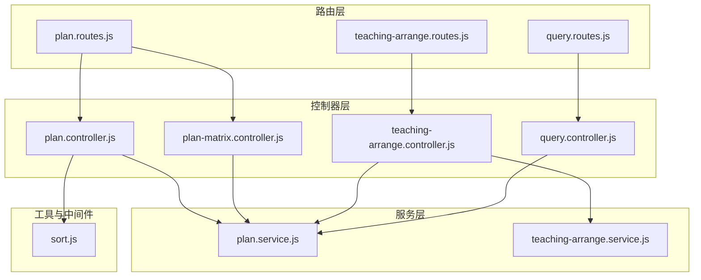
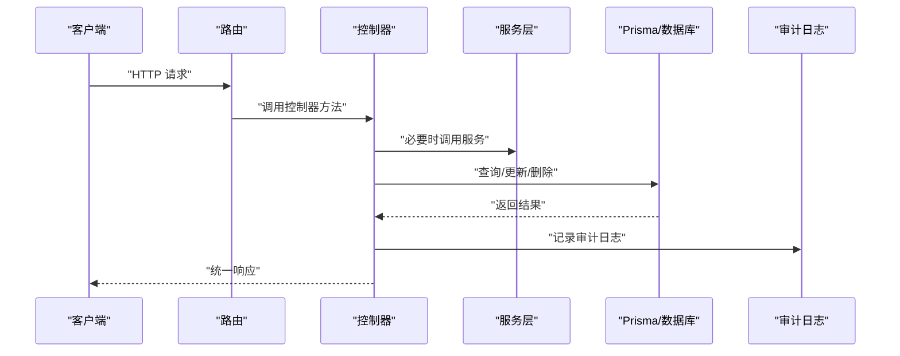
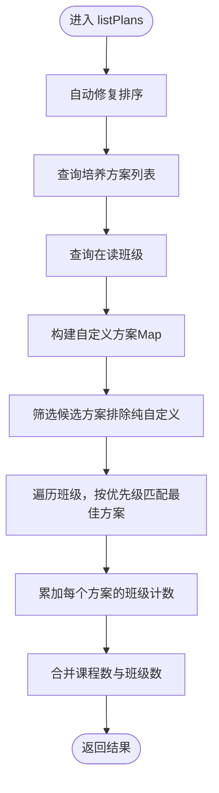
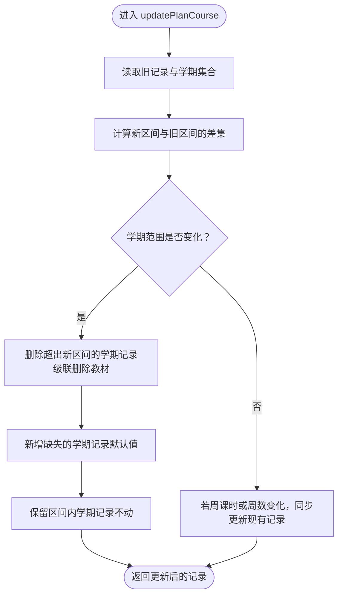
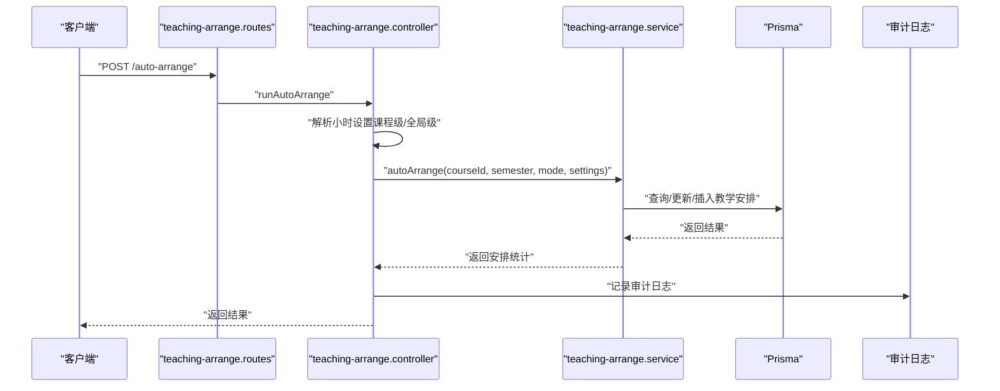
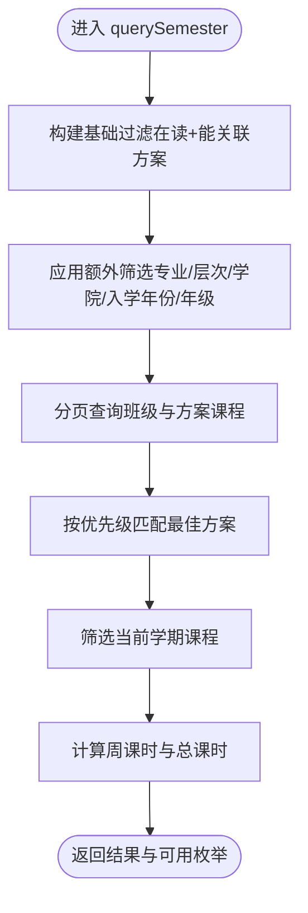
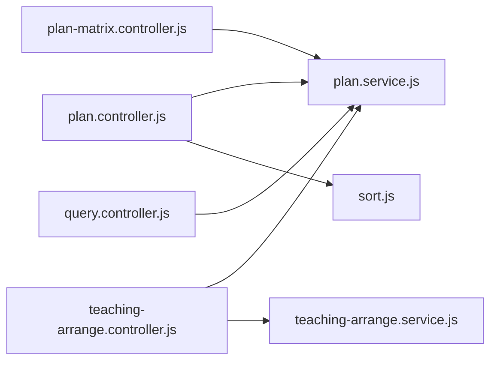

# 培养方案与教学控制器

<cite>
**本文引用的文件**
- [server/src/controllers/plan/plan.controller.js](file://server/src/controllers/plan/plan.controller.js)
- [server/src/controllers/plan/plan-matrix.controller.js](file://server/src/controllers/plan/plan-matrix.controller.js)
- [server/src/controllers/teaching-arrange.controller.js](file://server/src/controllers/teaching-arrange.controller.js)
- [server/src/controllers/query.controller.js](file://server/src/controllers/query.controller.js)
- [server/src/services/plan.service.js](file://server/src/services/plan.service.js)
- [server/src/services/teaching-arrange.service.js](file://server/src/services/teaching-arrange.service.js)
- [server/src/utils/sort.js](file://server/src/utils/sort.js)
- [server/src/routes/plan.routes.js](file://server/src/routes/plan.routes.js)
- [server/src/routes/teaching-arrange.routes.js](file://server/src/routes/teaching-arrange.routes.js)
- [server/src/routes/query.routes.js](file://server/src/routes/query.routes.js)
</cite>

## 目录
1. [简介](#简介)
2. [项目结构](#项目结构)
3. [核心组件](#核心组件)
4. [架构总览](#架构总览)
5. [详细组件分析](#详细组件分析)
6. [依赖分析](#依赖分析)
7. [性能考量](#性能考量)
8. [故障排查指南](#故障排查指南)
9. [结论](#结论)
10. [附录](#附录)

## 简介
本文件面向KEC课程管理平台的“培养方案与教学”相关控制器，系统性梳理培养方案管理、培养方案矩阵（课程与学期、教材）、教学安排与查询统计等高级业务功能的控制器实现。重点阐述复杂业务逻辑的处理方式，包括：
- 培养方案的生成与删除约束（含自定义方案与专业/层次匹配的双重校验）
- 培养方案矩阵的智能维护（学期记录按需增删、教材关联替换语义）
- 教学安排的智能调度（手动安排与自动排课、批量排课、工作量预警）
- 多维度查询统计（当前学期开课查询、教材使用统计）

同时给出控制器间的协作关系、数据流转过程与性能优化策略，并提供复杂场景下的调试要点与建议。

## 项目结构
围绕“培养方案与教学”的控制器位于后端server/src/controllers目录，配套的服务与路由分别位于server/src/services与server/src/routes。控制器通过Prisma访问数据库，结合审计日志与排序工具实现稳健的数据变更与一致性保障。

图表来源
- [server/src/routes/plan.routes.js:1-166](file://server/src/routes/plan.routes.js#L1-L166)
- [server/src/routes/teaching-arrange.routes.js:1-77](file://server/src/routes/teaching-arrange.routes.js#L1-L77)
- [server/src/routes/query.routes.js:1-27](file://server/src/routes/query.routes.js#L1-L27)
- [server/src/controllers/plan/plan.controller.js:1-346](file://server/src/controllers/plan/plan.controller.js#L1-L346)
- [server/src/controllers/plan/plan-matrix.controller.js:1-598](file://server/src/controllers/plan/plan-matrix.controller.js#L1-L598)
- [server/src/controllers/teaching-arrange.controller.js:1-679](file://server/src/controllers/teaching-arrange.controller.js#L1-L679)
- [server/src/controllers/query.controller.js:1-573](file://server/src/controllers/query.controller.js#L1-L573)
- [server/src/services/plan.service.js:1-102](file://server/src/services/plan.service.js#L1-L102)
- [server/src/services/teaching-arrange.service.js:1-5](file://server/src/services/teaching-arrange.service.js#L1-L5)
- [server/src/utils/sort.js:1-104](file://server/src/utils/sort.js#L1-L104)

章节来源
- [server/src/routes/plan.routes.js:1-166](file://server/src/routes/plan.routes.js#L1-L166)
- [server/src/routes/teaching-arrange.routes.js:1-77](file://server/src/routes/teaching-arrange.routes.js#L1-L77)
- [server/src/routes/query.routes.js:1-27](file://server/src/routes/query.routes.js#L1-L27)

## 核心组件
- 培养方案控制器（plan.controller.js）
  - 功能：培养方案的列表、详情、创建、更新、删除；删除前对“自定义方案引用”和“专业/层次匹配的在读班级”进行双重拦截；支持排序交换与排序缓存失效。
  - 关键点：统一的“自定义>专业>层次”匹配优先级；删除时对所有在读班级进行匹配校验，避免静默失效。
- 培养方案矩阵控制器（plan-matrix.controller.js）
  - 功能：方案课程的增删改、学期安排的upsert与更新、教材关联与取消；更新课程时按需增删学期记录，避免教材关联丢失；提供仅更新排序的轻量端点。
  - 关键点：学期范围变化时按差集增删记录，保留区间内教材关联；学期范围不变时同步更新现有记录字段。
- 教学安排控制器（teaching-arrange.controller.js）
  - 功能：按课程获取班级与教师、手动安排/更换教师、删除安排、自动排课、批量自动排课、重置自动安排、课时统计、课时设置读取与保存。
  - 关键点：手动安排时若未传周课时，从培养方案学期推导；工作量预警非阻塞；自动排课支持预览模式；小时设置支持课程级与全局级。
- 查询统计控制器（query.controller.js）
  - 功能：当前学期开课查询、教材使用情况查询（单本与概览）、多维联动筛选（学院-专业-层次）。
  - 关键点：分页上限保护；年级筛选下推至数据库层；教材使用统计严格校验当前学期号，避免跨学期统计误差。

章节来源
- [server/src/controllers/plan/plan.controller.js:1-346](file://server/src/controllers/plan/plan.controller.js#L1-L346)
- [server/src/controllers/plan/plan-matrix.controller.js:1-598](file://server/src/controllers/plan/plan-matrix.controller.js#L1-L598)
- [server/src/controllers/teaching-arrange.controller.js:1-679](file://server/src/controllers/teaching-arrange.controller.js#L1-L679)
- [server/src/controllers/query.controller.js:1-573](file://server/src/controllers/query.controller.js#L1-L573)

## 架构总览
控制器通过路由暴露REST接口，接收请求参数后调用服务层或直接访问数据库，最终通过统一响应工具返回结果。审计日志贯穿关键变更操作，排序工具负责排序值的自动修复与缓存失效。

图表来源
- [server/src/routes/plan.routes.js:1-166](file://server/src/routes/plan.routes.js#L1-L166)
- [server/src/routes/teaching-arrange.routes.js:1-77](file://server/src/routes/teaching-arrange.routes.js#L1-L77)
- [server/src/routes/query.routes.js:1-27](file://server/src/routes/query.routes.js#L1-L27)
- [server/src/controllers/plan/plan.controller.js:1-346](file://server/src/controllers/plan/plan.controller.js#L1-L346)
- [server/src/controllers/plan/plan-matrix.controller.js:1-598](file://server/src/controllers/plan/plan-matrix.controller.js#L1-L598)
- [server/src/controllers/teaching-arrange.controller.js:1-679](file://server/src/controllers/teaching-arrange.controller.js#L1-L679)
- [server/src/controllers/query.controller.js:1-573](file://server/src/controllers/query.controller.js#L1-L573)

## 详细组件分析

### 培养方案管理（plan.controller.js）
- 列表与统计
  - 自动修复排序：在查询前调用排序修复，确保sort_order连续且唯一。
  - 班级使用统计：通过findBestMatchPlan优先级（自定义>专业>层次）统计每个方案被使用的班级数，避免重复计数。
- 创建与更新
  - 参数校验：专业与层次二选一；排序交换仅更新sort_order。
  - 审计日志：记录模块、动作、用户、IP、结果与详情。
  - 排序缓存失效：更新后清理排序缓存，保证后续排序一致性。
- 删除
  - 双重拦截：检查自定义方案引用与专业/层次匹配的在读班级，防止静默失效。

图表来源
- [server/src/controllers/plan/plan.controller.js:11-71](file://server/src/controllers/plan/plan.controller.js#L11-L71)
- [server/src/services/plan.service.js:71-101](file://server/src/services/plan.service.js#L71-L101)

章节来源
- [server/src/controllers/plan/plan.controller.js:11-71](file://server/src/controllers/plan/plan.controller.js#L11-L71)
- [server/src/utils/sort.js:62-103](file://server/src/utils/sort.js#L62-L103)
- [server/src/services/plan.service.js:71-101](file://server/src/services/plan.service.js#L71-L101)

### 培养方案矩阵（plan-matrix.controller.js）
- 方案课程管理
  - 添加课程：事务内创建方案课程并按学期范围批量创建学期记录。
  - 更新课程：仅当学期范围变化时按差集增删；否则仅同步现有记录字段，保留教材关联。
  - 仅更新排序：轻量端点，避免重建学期记录与教材丢失。
  - 删除课程：删除后级联删除学期记录与教材关联。
- 学期管理
  - upsert：按课程+学期唯一键创建或更新学期记录。
  - 更新学期：支持周课时与周数的独立更新。
  - 列表：按学期去重并取最大周数。
- 教材关联
  - 关联替换语义：每次调用先删除该学期所有教材关联再创建新关联。
  - 取消关联：批量删除。

图表来源
- [server/src/controllers/plan/plan-matrix.controller.js:119-243](file://server/src/controllers/plan/plan-matrix.controller.js#L119-L243)

章节来源
- [server/src/controllers/plan/plan-matrix.controller.js:8-327](file://server/src/controllers/plan/plan-matrix.controller.js#L8-L327)

### 教学安排（teaching-arrange.controller.js）
- 班级与教师查询
  - 按课程+学期获取班级列表，合并已有教学安排与周课时统计。
  - 按课程+学期获取教师列表（含课时统计）。
- 手动安排
  - 校验班级、教师状态与可授课程关系；若未传周课时，从培养方案学期推导。
  - upsert教学安排，标记非自动；非阻塞工作量预警。
- 自动排课与批量排课
  - 支持标准与全量模式；小时设置支持课程级与全局级；支持预览模式不写入。
- 统计与设置
  - 课时统计按教师聚合，输出明细与汇总；课时设置读取与保存带校验。

图表来源
- [server/src/routes/teaching-arrange.routes.js:42-54](file://server/src/routes/teaching-arrange.routes.js#L42-L54)
- [server/src/controllers/teaching-arrange.controller.js:296-368](file://server/src/controllers/teaching-arrange.controller.js#L296-L368)
- [server/src/services/teaching-arrange.service.js:1-5](file://server/src/services/teaching-arrange.service.js#L1-L5)

章节来源
- [server/src/controllers/teaching-arrange.controller.js:32-291](file://server/src/controllers/teaching-arrange.controller.js#L32-L291)
- [server/src/controllers/teaching-arrange.controller.js:296-679](file://server/src/controllers/teaching-arrange.controller.js#L296-L679)
- [server/src/services/teaching-arrange.service.js:1-5](file://server/src/services/teaching-arrange.service.js#L1-L5)

### 查询统计（query.controller.js）
- 当前学期开课查询
  - 构建“能关联到培养方案”的基础过滤；支持多维筛选（专业、层次、学院、入学年份、年级）。
  - 分页上限保护；年级筛选下推数据库层；预加载可用枚举与关联关系。
  - 通过findBestMatchPlan确定班级最佳培养方案，筛选当前学期课程并计算总课时。
- 教材使用统计
  - 单本教材使用：严格匹配培养方案与当前学期号，避免跨学期统计。
  - 全部教材概览：构建班级索引，按学期反推入学年份，高效统计使用班级与学生数。

图表来源
- [server/src/controllers/query.controller.js:28-344](file://server/src/controllers/query.controller.js#L28-L344)
- [server/src/services/plan.service.js:71-101](file://server/src/services/plan.service.js#L71-L101)

章节来源
- [server/src/controllers/query.controller.js:28-344](file://server/src/controllers/query.controller.js#L28-L344)
- [server/src/controllers/query.controller.js:346-573](file://server/src/controllers/query.controller.js#L346-L573)

## 依赖分析
- 控制器与服务
  - plan.controller.js与plan-matrix.controller.js依赖plan.service.js中的统一匹配逻辑。
  - teaching-arrange.controller.js依赖teaching-arrange.service.js（查询、验证、自动排课、批量排课）。
  - query.controller.js依赖plan.service.js与系统设置服务。
- 中间件与路由
  - 路由层对控制器方法进行权限控制与参数校验，控制器内部也进行二次校验与审计日志。
- 工具与缓存
  - 排序工具提供排序修复与缓存失效，避免并发创建导致的重复排序值。

图表来源
- [server/src/controllers/plan/plan.controller.js:1-346](file://server/src/controllers/plan/plan.controller.js#L1-L346)
- [server/src/controllers/plan/plan-matrix.controller.js:1-598](file://server/src/controllers/plan/plan-matrix.controller.js#L1-L598)
- [server/src/controllers/teaching-arrange.controller.js:1-679](file://server/src/controllers/teaching-arrange.controller.js#L1-L679)
- [server/src/controllers/query.controller.js:1-573](file://server/src/controllers/query.controller.js#L1-L573)
- [server/src/services/plan.service.js:1-102](file://server/src/services/plan.service.js#L1-L102)
- [server/src/services/teaching-arrange.service.js:1-5](file://server/src/services/teaching-arrange.service.js#L1-L5)
- [server/src/utils/sort.js:1-104](file://server/src/utils/sort.js#L1-L104)

章节来源
- [server/src/routes/plan.routes.js:1-166](file://server/src/routes/plan.routes.js#L1-L166)
- [server/src/routes/teaching-arrange.routes.js:1-77](file://server/src/routes/teaching-arrange.routes.js#L1-L77)
- [server/src/routes/query.routes.js:1-27](file://server/src/routes/query.routes.js#L1-L27)

## 性能考量
- 排序修复与缓存
  - autoFixSortOrder对重复或稀疏排序进行批量修复，配合缓存TTL降低重复修复成本。
- 分页与过滤下推
  - query.controller.js将年级等筛选条件下推至数据库层，减少内存计算与网络传输。
- N+1查询规避
  - 教学统计中预加载授课层次，消除N+1查询；查询统计中使用Map索引提升查找效率。
- 事务与级联
  - 培养方案矩阵更新采用事务，确保学期记录与教材关联的一致性；删除课程时利用级联清理避免脏数据。
- 非阻塞预警
  - 教师工作量预警查询失败不阻塞主流程，保证用户体验。

章节来源
- [server/src/utils/sort.js:62-103](file://server/src/utils/sort.js#L62-L103)
- [server/src/controllers/query.controller.js:74-83](file://server/src/controllers/query.controller.js#L74-L83)
- [server/src/controllers/teaching-arrange.controller.js:458-472](file://server/src/controllers/teaching-arrange.controller.js#L458-L472)
- [server/src/controllers/plan/plan-matrix.controller.js:146-217](file://server/src/controllers/plan/plan-matrix.controller.js#L146-L217)

## 故障排查指南
- 培养方案删除失败
  - 现象：提示“该方案已被班级使用，无法删除”。
  - 排查：确认是否存在自定义方案引用或专业/层次匹配的在读班级；使用“删除前拦截”逻辑逐项核对。
  - 参考路径：[server/src/controllers/plan/plan.controller.js:280-344](file://server/src/controllers/plan/plan.controller.js#L280-L344)
- 教材关联丢失
  - 现象：更新方案课程后教材被清空。
  - 排查：确认是否使用了“仅更新课程排序”的轻量端点；若更新学期范围，确保采用按差集增删逻辑。
  - 参考路径：[server/src/controllers/plan/plan-matrix.controller.js:119-243](file://server/src/controllers/plan/plan-matrix.controller.js#L119-L243)
- 手动安排周课时异常
  - 现象：未传周课时导致安排记录为空或0。
  - 排查：确认是否从培养方案学期推导周课时；检查班级与课程的匹配方案及当前学期号。
  - 参考路径：[server/src/controllers/teaching-arrange.controller.js:136-186](file://server/src/controllers/teaching-arrange.controller.js#L136-L186)
- 自动排课未写入
  - 现象：预览后无实际安排。
  - 排查：确认请求体中preview=false；检查小时设置与排课条件。
  - 参考路径：[server/src/controllers/teaching-arrange.controller.js:329-355](file://server/src/controllers/teaching-arrange.controller.js#L329-L355)
- 教材使用统计人数偏高
  - 现象：统计显示某教材被多个班级使用，实际不符。
  - 排查：确认是否校验了当前学期号；避免跨学期统计。
  - 参考路径：[server/src/controllers/query.controller.js:540-547](file://server/src/controllers/query.controller.js#L540-L547)

章节来源
- [server/src/controllers/plan/plan.controller.js:280-344](file://server/src/controllers/plan/plan.controller.js#L280-L344)
- [server/src/controllers/plan/plan-matrix.controller.js:119-243](file://server/src/controllers/plan/plan-matrix.controller.js#L119-L243)
- [server/src/controllers/teaching-arrange.controller.js:136-186](file://server/src/controllers/teaching-arrange.controller.js#L136-L186)
- [server/src/controllers/teaching-arrange.controller.js:329-355](file://server/src/controllers/teaching-arrange.controller.js#L329-L355)
- [server/src/controllers/query.controller.js:540-547](file://server/src/controllers/query.controller.js#L540-L547)

## 结论
本控制器体系围绕“培养方案—课程与学期—教学安排—查询统计”的完整链路设计，通过统一的匹配优先级、事务化的矩阵维护、非阻塞的工作量预警与严格的审计日志，实现了高可靠与高可维护性的教学管理能力。在性能方面，通过排序修复缓存、过滤下推、索引与预加载等手段，有效降低了复杂查询与批量操作的资源消耗。建议在生产环境中持续关注并发排序修复与批量排课的监控指标，并定期审查审计日志以保障数据一致性。

## 附录
- 调试建议
  - 使用预览模式进行自动排课与批量排课，确认影响范围后再提交。
  - 在更新培养方案矩阵时，优先使用“仅更新排序”端点，避免不必要的学期记录重建。
  - 对于查询统计，优先使用路由提供的筛选参数，减少前端二次处理。
- 最佳实践
  - 保持培养方案与课程的学期边界清晰，避免频繁修改学期范围。
  - 合理设置教师小时上限，结合工作量预警及时调整排课。
  - 定期运行排序修复任务，确保排序值连续且唯一。