# 基础数据控制器

<cite>
**本文档引用的文件**
- [class.controller.js](file://server/src/controllers/class.controller.js)
- [course.controller.js](file://server/src/controllers/course.controller.js)
- [teacher.controller.js](file://server/src/controllers/teacher.controller.js)
- [major.controller.js](file://server/src/controllers/major.controller.js)
- [college.controller.js](file://server/src/controllers/college.controller.js)
- [textbook.controller.js](file://server/src/controllers/textbook.controller.js)
- [trainingLevel.controller.js](file://server/src/controllers/trainingLevel.controller.js)
- [class.routes.js](file://server/src/routes/class.routes.js)
- [course.routes.js](file://server/src/routes/course.routes.js)
- [teacher.routes.js](file://server/src/routes/teacher.routes.js)
- [major.routes.js](file://server/src/routes/major.routes.js)
- [college.routes.js](file://server/src/routes/college.routes.js)
- [textbook.routes.js](file://server/src/routes/textbook.routes.js)
- [trainingLevel.routes.js](file://server/src/routes/trainingLevel.routes.js)
- [validation.js](file://server/src/middleware/validation.js)
- [auth.middleware.js](file://server/src/middleware/auth.middleware.js)
- [pagination.js](file://server/src/middleware/pagination.js)
- [response.js](file://server/src/utils/response.js)
- [prisma.js](file://server/src/lib/prisma.js)
- [class.service.js](file://server/src/services/class.service.js)
- [course.service.js](file://server/src/services/course.service.js)
- [teacher.service.js](file://server/src/services/teacher.service.js)
- [major.service.js](file://server/src/services/major.service.js)
- [college.service.js](file://server/src/services/college.service.js)
- [textbook.service.js](file://server/src/services/textbook.service.js)
- [trainingLevel.service.js](file://server/src/services/trainingLevel.service.js)
</cite>

## 目录
1. [简介](#简介)
2. [项目结构](#项目结构)
3. [核心组件](#核心组件)
4. [架构概览](#架构概览)
5. [详细组件分析](#详细组件分析)
6. [依赖关系分析](#依赖关系分析)
7. [性能考虑](#性能考虑)
8. [故障排除指南](#故障排除指南)
9. [结论](#结论)

## 简介

KEC课程管理平台的基础数据控制器是整个系统的核心组件，负责管理教育机构中的基础数据实体。本文档详细分析了七个核心业务模块的控制器实现：班级管理、课程管理、教师管理、专业管理、学院管理、教材管理和培养层次管理。

这些控制器采用统一的架构模式，实现了标准的CRUD操作，并集成了数据验证、权限控制、分页处理和错误处理等通用功能。每个控制器都遵循RESTful API设计原则，提供一致的接口规范和响应格式。

## 项目结构

基础数据控制器位于服务器端的`server/src/controllers`目录下，采用按功能模块组织的结构：

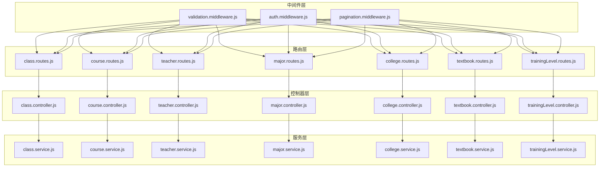

**图表来源**
- [class.controller.js](file://server/src/controllers/class.controller.js)
- [course.controller.js](file://server/src/controllers/course.controller.js)
- [teacher.controller.js](file://server/src/controllers/teacher.controller.js)
- [major.controller.js](file://server/src/controllers/major.controller.js)
- [college.controller.js](file://server/src/controllers/college.controller.js)
- [textbook.controller.js](file://server/src/controllers/textbook.controller.js)
- [trainingLevel.controller.js](file://server/src/controllers/trainingLevel.controller.js)

**章节来源**
- [class.controller.js](file://server/src/controllers/class.controller.js)
- [course.controller.js](file://server/src/controllers/course.controller.js)
- [teacher.controller.js](file://server/src/controllers/teacher.controller.js)
- [major.controller.js](file://server/src/controllers/major.controller.js)
- [college.controller.js](file://server/src/controllers/college.controller.js)
- [textbook.controller.js](file://server/src/controllers/textbook.controller.js)
- [trainingLevel.controller.js](file://server/src/controllers/trainingLevel.controller.js)

## 核心组件

### 控制器架构模式

所有基础数据控制器都遵循相同的架构模式，包含以下核心组件：

1. **请求验证中间件**：确保输入数据符合业务规则
2. **权限验证中间件**：检查用户访问权限
3. **分页处理中间件**：支持大数据量的分页查询
4. **业务服务调用**：执行具体的业务逻辑
5. **响应格式化**：统一的API响应格式

### 统一的CRUD操作

每个控制器都实现了标准的CRUD操作，包括：
- **创建**：POST请求，验证数据后创建新记录
- **读取**：GET请求，支持单个查询和列表查询
- **更新**：PUT/PATCH请求，验证数据后更新记录
- **删除**：DELETE请求，软删除或硬删除策略

### 数据验证规则

控制器集成了多层次的数据验证机制：

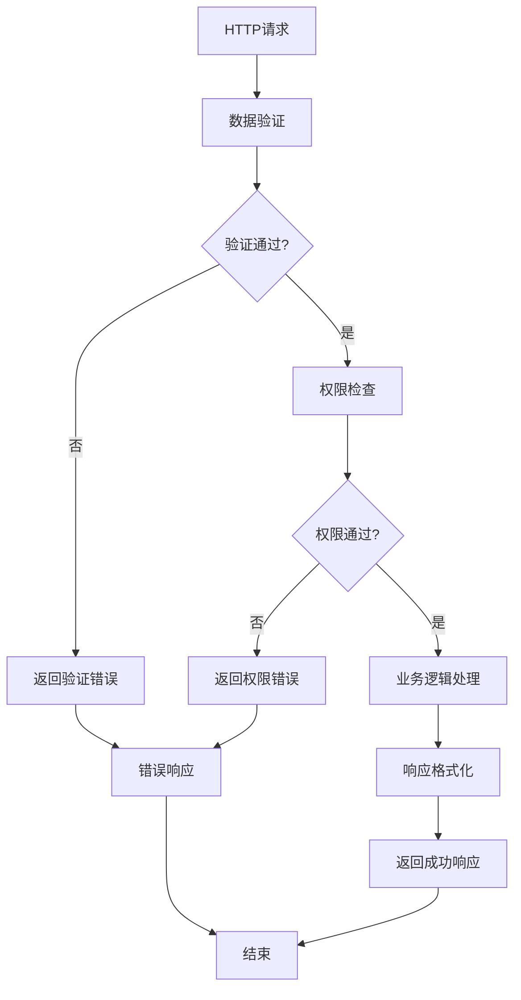

**图表来源**
- [validation.js](file://server/src/middleware/validation.js)
- [auth.middleware.js](file://server/src/middleware/auth.middleware.js)
- [response.js](file://server/src/utils/response.js)

## 架构概览

### 整体架构设计

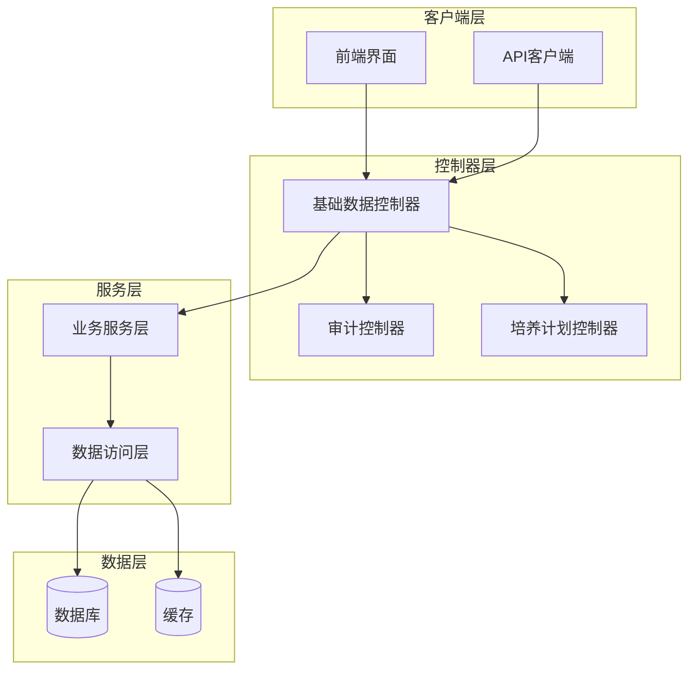

**图表来源**
- [app.js](file://server/src/app.js)
- [prisma.js](file://server/src/lib/prisma.js)

### 控制器间交互

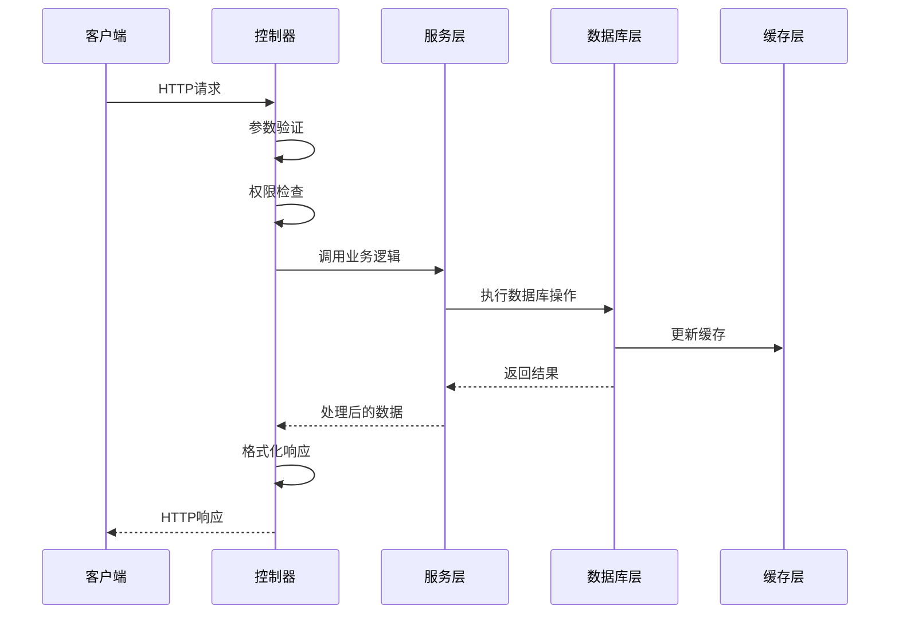

**图表来源**
- [class.controller.js](file://server/src/controllers/class.controller.js)
- [prisma.js](file://server/src/lib/prisma.js)

## 详细组件分析

### 班级管理控制器

班级管理控制器负责处理班级相关的所有操作，包括班级信息的增删改查。

#### 核心功能实现

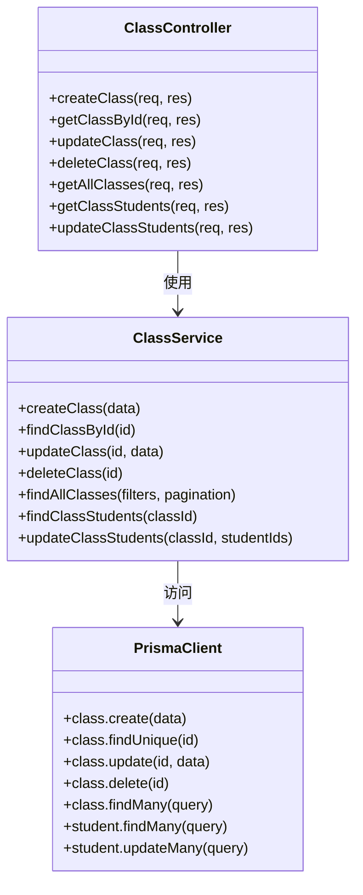

**图表来源**
- [class.controller.js](file://server/src/controllers/class.controller.js)
- [class.service.js](file://server/src/services/class.service.js)
- [prisma.js](file://server/src/lib/prisma.js)

#### CRUD操作流程

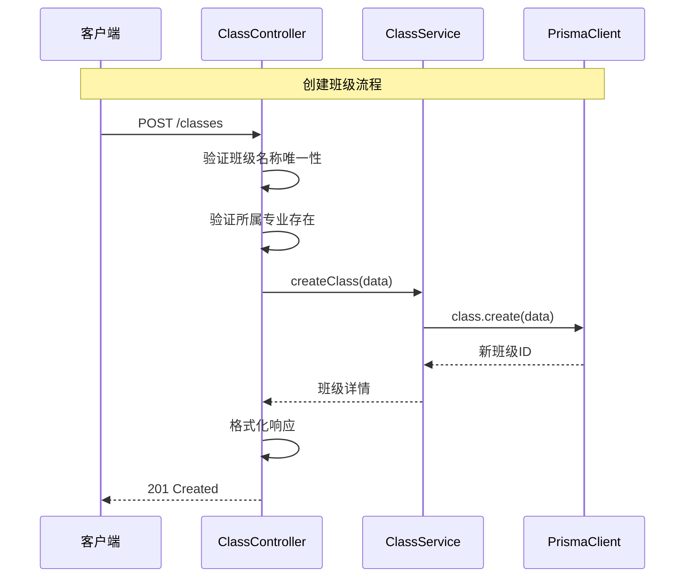

**图表来源**
- [class.controller.js](file://server/src/controllers/class.controller.js)
- [class.service.js](file://server/src/services/class.service.js)

#### 数据验证规则

班级管理的数据验证包括：
- **班级名称**：必填，长度限制，唯一性检查
- **所属专业**：必须存在且有效
- **年级信息**：格式正确，年份合理
- **班级容量**：数值类型，范围检查

**章节来源**
- [class.controller.js](file://server/src/controllers/class.controller.js)
- [class.routes.js](file://server/src/routes/class.routes.js)

### 课程管理控制器

课程管理控制器处理课程信息的完整生命周期管理。

#### 核心业务逻辑

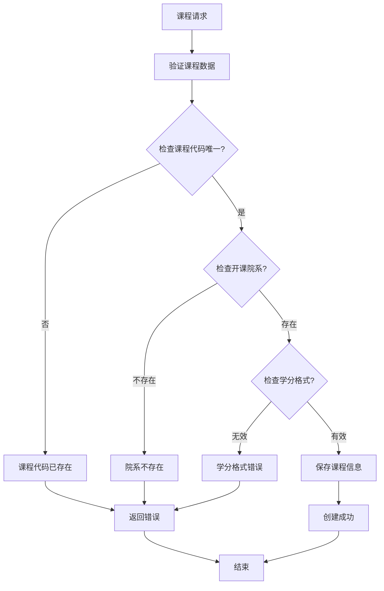

**图表来源**
- [course.controller.js](file://server/src/controllers/course.controller.js)
- [course.service.js](file://server/src/services/course.service.js)

#### 课程关联管理

课程管理还包括复杂的关联关系处理：

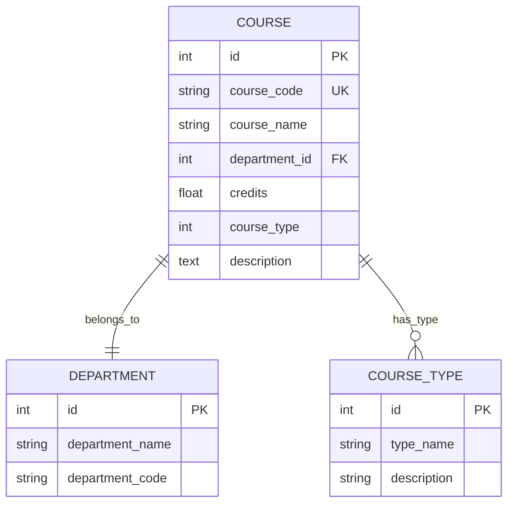

**图表来源**
- [course.controller.js](file://server/src/controllers/course.controller.js)
- [prisma.js](file://server/src/lib/prisma.js)

**章节来源**
- [course.controller.js](file://server/src/controllers/course.controller.js)
- [course.routes.js](file://server/src/routes/course.routes.js)

### 教师管理控制器

教师管理控制器提供完整的教师信息管理功能。

#### 教师信息完整性

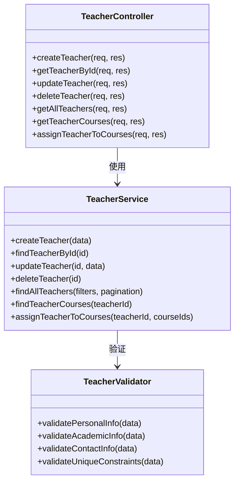

**图表来源**
- [teacher.controller.js](file://server/src/controllers/teacher.controller.js)
- [teacher.service.js](file://server/src/services/teacher.service.js)

#### 教师权限管理

教师管理还包括用户权限的集成：

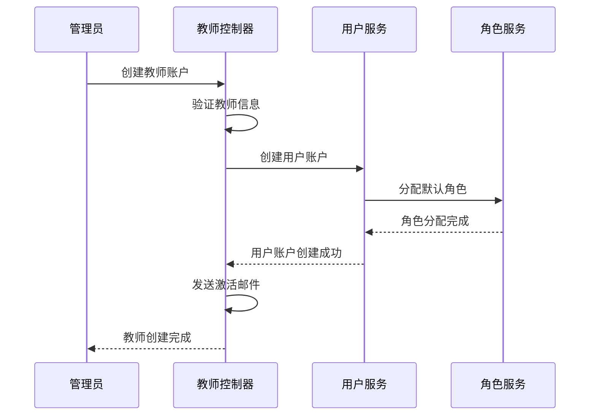

**图表来源**
- [teacher.controller.js](file://server/src/controllers/teacher.controller.js)
- [user.controller.js](file://server/src/controllers/user.controller.js)

**章节来源**
- [teacher.controller.js](file://server/src/controllers/teacher.controller.js)
- [teacher.routes.js](file://server/src/routes/teacher.routes.js)

### 专业管理控制器

专业管理控制器负责处理学科专业的相关信息。

#### 专业层级结构

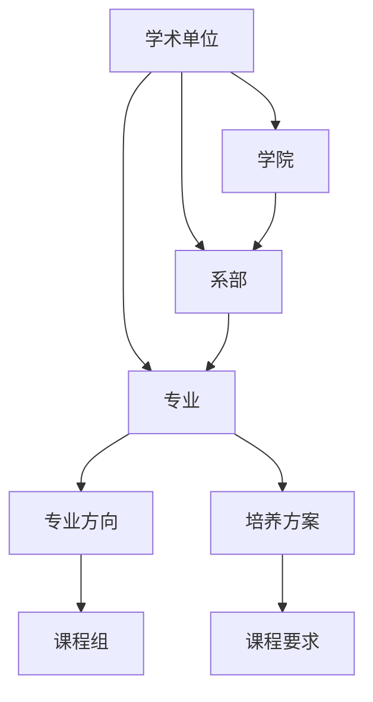

**图表来源**
- [major.controller.js](file://server/src/controllers/major.controller.js)
- [college.controller.js](file://server/src/controllers/college.controller.js)

#### 专业配置管理

专业管理涉及复杂的配置选项：

| 配置项 | 类型 | 描述 | 默认值 |
|--------|------|------|--------|
| 学制年限 | 数值 | 学习年限（年） | 4 |
| 授予学位 | 字符串 | 授予学位类型 | 学士 |
| 培养方式 | 枚举 | 培养方式 | 全日制 |
| 招生批次 | 数值 | 招生批次编号 | 1 |
| 专业代码 | 字符串 | 专业唯一标识码 | 自动生成 |

**章节来源**
- [major.controller.js](file://server/src/controllers/major.controller.js)
- [major.routes.js](file://server/src/routes/major.routes.js)

### 学院管理控制器

学院管理控制器提供学院级别的数据管理功能。

#### 学院组织架构

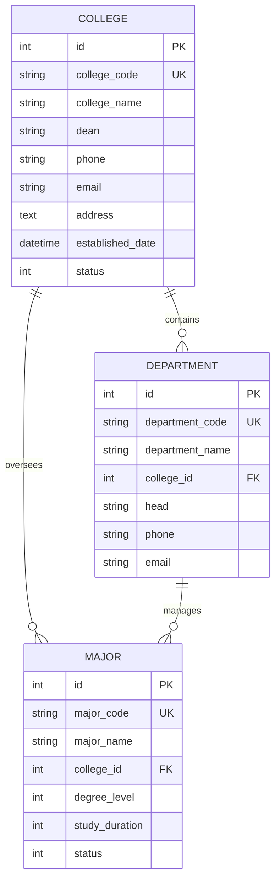

**图表来源**
- [college.controller.js](file://server/src/controllers/college.controller.js)
- [prisma.js](file://server/src/lib/prisma.js)

**章节来源**
- [college.controller.js](file://server/src/controllers/college.controller.js)
- [college.routes.js](file://server/src/routes/college.routes.js)

### 教材管理控制器

教材管理控制器处理教材信息的全生命周期管理。

#### 教材分类体系

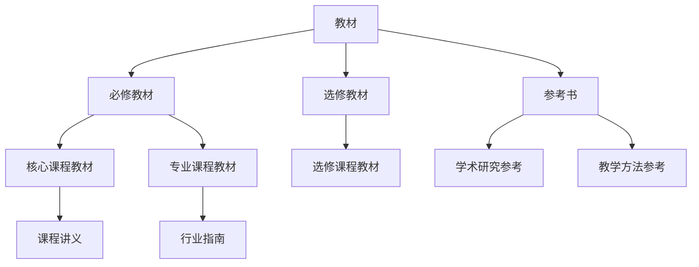

**图表来源**
- [textbook.controller.js](file://server/src/controllers/textbook.controller.js)

#### 教材采购流程

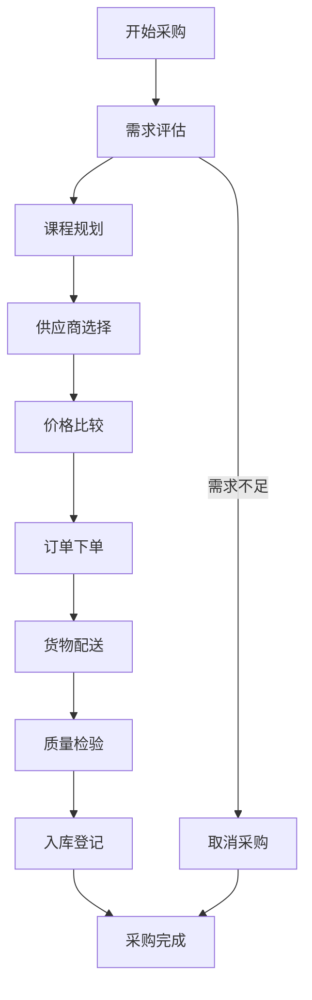

**图表来源**
- [textbook.controller.js](file://server/src/controllers/textbook.controller.js)
- [textbook.service.js](file://server/src/services/textbook.service.js)

**章节来源**
- [textbook.controller.js](file://server/src/controllers/textbook.controller.js)
- [textbook.routes.js](file://server/src/routes/textbook.routes.js)

### 培养层次管理控制器

培养层次管理控制器负责处理不同教育层次的管理。

#### 教育层次定义

| 层次代码 | 层次名称 | 学历要求 | 学习形式 | 适用对象 |
|----------|----------|----------|----------|----------|
| UNDERGRADUATE | 本科 | 高中毕业 | 全日制 | 应届高中毕业生 |
| MASTER | 硕士 | 本科学历 | 全日制/非全日制 | 本科生/在职人员 |
| DOCTOR | 博士 | 硕士学历 | 全日制 | 硕士毕业生 |
| SECOND_DEGREE | 第二学位 | 本科学历 | 全日制 | 在校本科生 |
| ACCREDITATION | 专科 | 高中毕业 | 全日制 | 高中毕业生 |

#### 层次配置管理

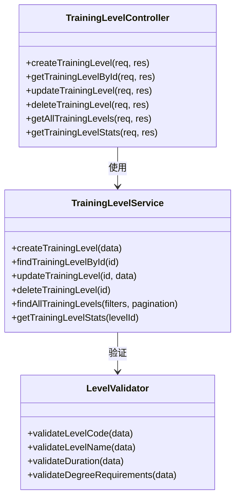

**图表来源**
- [trainingLevel.controller.js](file://server/src/controllers/trainingLevel.controller.js)
- [trainingLevel.service.js](file://server/src/services/trainingLevel.service.js)

**章节来源**
- [trainingLevel.controller.js](file://server/src/controllers/trainingLevel.controller.js)
- [trainingLevel.routes.js](file://server/src/routes/trainingLevel.routes.js)

## 依赖关系分析

### 控制器依赖图

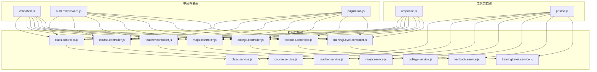

**图表来源**
- [class.controller.js](file://server/src/controllers/class.controller.js)
- [validation.js](file://server/src/middleware/validation.js)
- [auth.middleware.js](file://server/src/middleware/auth.middleware.js)
- [pagination.js](file://server/src/middleware/pagination.js)
- [response.js](file://server/src/utils/response.js)
- [prisma.js](file://server/src/lib/prisma.js)

### 错误处理机制

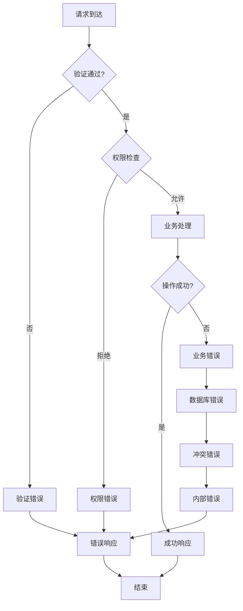

**图表来源**
- [error.js](file://server/src/middleware/error.js)
- [response.js](file://server/src/utils/response.js)

**章节来源**
- [validation.js](file://server/src/middleware/validation.js)
- [auth.middleware.js](file://server/src/middleware/auth.middleware.js)
- [pagination.js](file://server/src/middleware/pagination.js)
- [response.js](file://server/src/utils/response.js)

## 性能考虑

### 查询优化策略

1. **索引优化**：为常用查询字段建立适当索引
2. **分页处理**：大数据量查询使用分页机制
3. **批量操作**：支持批量导入导出功能
4. **缓存策略**：对静态数据使用缓存机制

### 并发控制

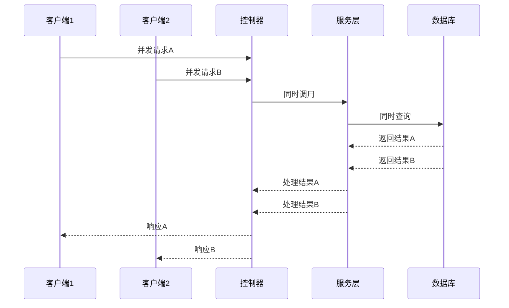

### 内存管理

- **流式处理**：大文件上传使用流式处理
- **连接池**：数据库连接使用连接池管理
- **垃圾回收**：及时释放临时对象

## 故障排除指南

### 常见问题诊断

| 问题类型 | 症状 | 可能原因 | 解决方案 |
|----------|------|----------|----------|
| 验证错误 | 400 Bad Request | 输入数据格式不正确 | 检查数据格式和必填字段 |
| 权限错误 | 403 Forbidden | 用户权限不足 | 检查用户角色和权限配置 |
| 业务错误 | 422 Unprocessable Entity | 业务规则违反 | 检查业务逻辑约束条件 |
| 数据库错误 | 500 Internal Server Error | 数据库连接或查询失败 | 检查数据库状态和查询语句 |
| 超时错误 | 504 Gateway Timeout | 请求处理时间过长 | 优化查询和增加索引 |

### 调试技巧

1. **日志分析**：查看详细的请求和响应日志
2. **数据库监控**：监控慢查询和高负载操作
3. **性能分析**：使用性能分析工具识别瓶颈
4. **单元测试**：编写和运行单元测试验证功能

**章节来源**
- [error.js](file://server/src/middleware/error.js)
- [logger.js](file://server/src/utils/logger.js)

## 结论

KEC课程管理平台的基础数据控制器展现了现代Web应用的最佳实践，具有以下特点：

1. **统一架构**：所有控制器遵循相同的设计模式和开发规范
2. **完整功能**：实现了标准的CRUD操作和复杂业务逻辑
3. **严格验证**：多层数据验证确保数据质量和系统稳定性
4. **安全可靠**：完善的权限控制和错误处理机制
5. **易于扩展**：清晰的代码结构便于功能扩展和维护

这些控制器为整个教育管理系统提供了坚实的基础，支持高效的日常教学管理工作和长期的系统发展需求。