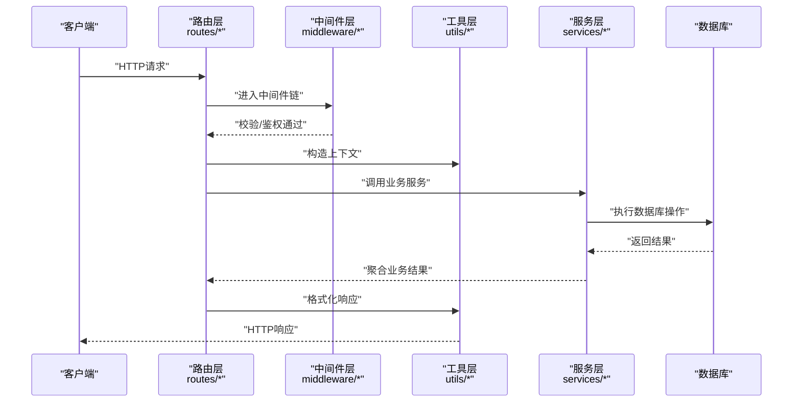
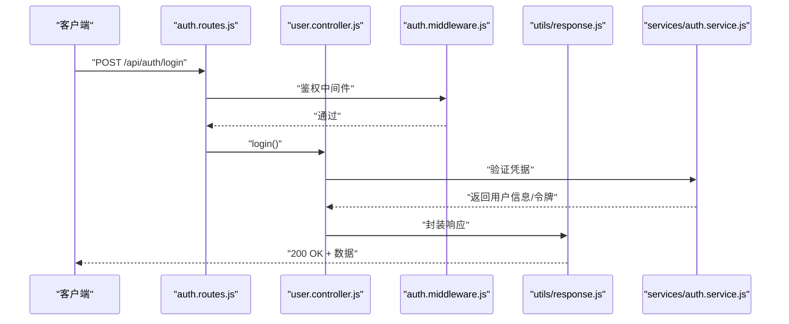
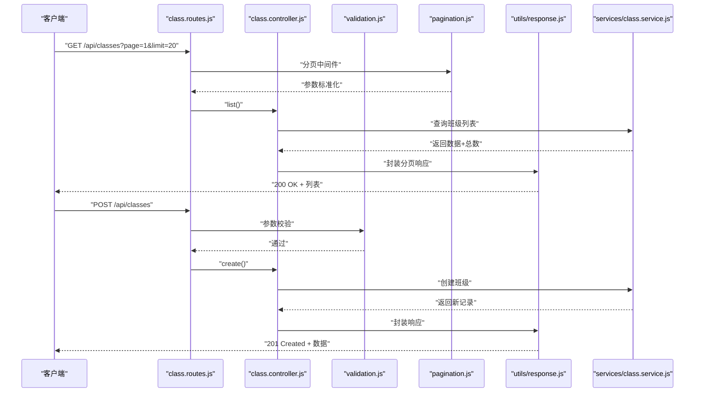
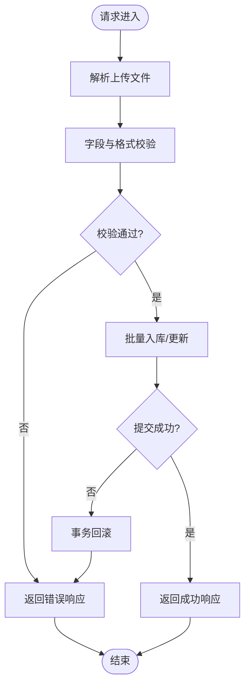
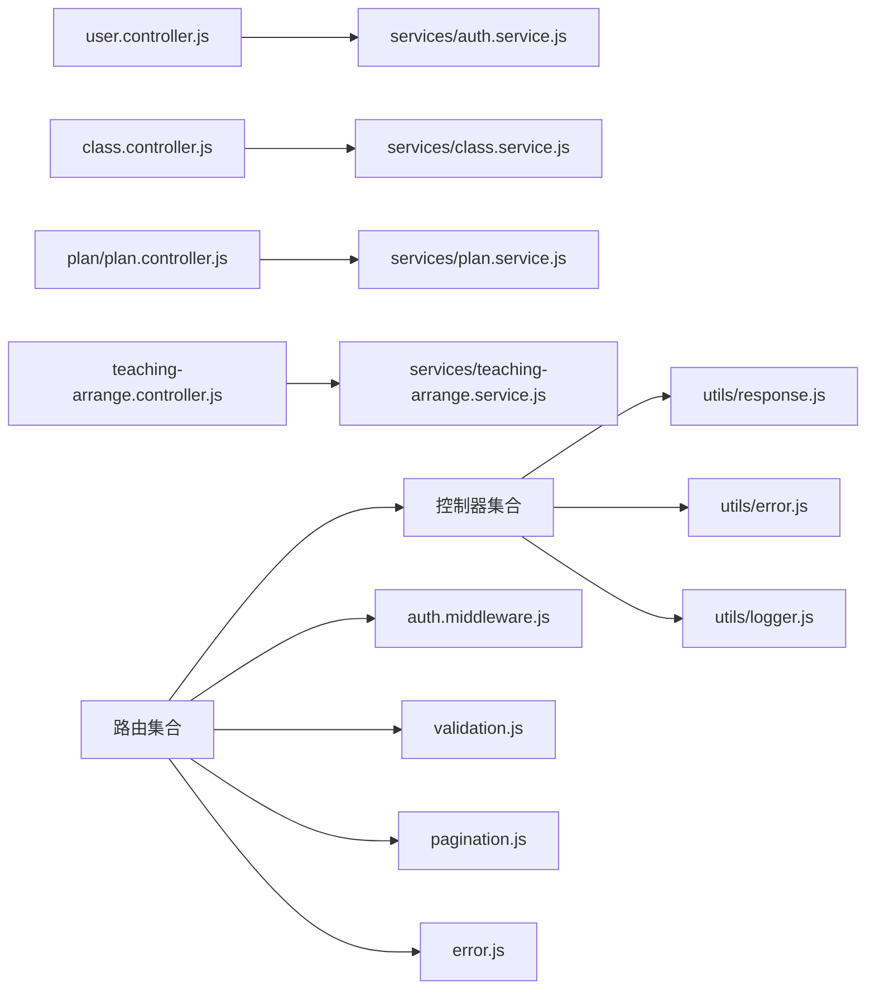

# 控制器层设计

<cite>
**本文档引用的文件**
- [app.js](file://server/src/app.js)
- [server.js](file://server/src/server.js)
- [auth.controller.js](file://server/src/controllers/user.controller.js)
- [class.controller.js](file://server/src/controllers/class.controller.js)
- [course.controller.js](file://server/src/controllers/course.controller.js)
- [teacher.controller.js](file://server/src/controllers/teacher.controller.js)
- [college.controller.js](file://server/src/controllers/college.controller.js)
- [major.controller.js](file://server/src/controllers/major.controller.js)
- [trainingLevel.controller.js](file://server/src/controllers/trainingLevel.controller.js)
- [textbook.controller.js](file://server/src/controllers/textbook.controller.js)
- [plan.controller.js](file://server/src/controllers/plan/plan.controller.js)
- [plan-matrix.controller.js](file://server/src/controllers/plan/plan-matrix.controller.js)
- [teaching-arrange.controller.js](file://server/src/controllers/teaching-arrange.controller.js)
- [query.controller.js](file://server/src/controllers/query.controller.js)
- [dashboard.controller.js](file://server/src/controllers/dashboard.controller.js)
- [audit.controller.js](file://server/src/controllers/audit.controller.js)
- [settings.controller.js](file://server/src/controllers/settings.controller.js)
- [data-export.controller.js](file://server/src/controllers/export/data-export.controller.js)
- [export-template.controller.js](file://server/src/controllers/export/export-template.controller.js)
- [semester-export.controller.js](file://server/src/controllers/export/semester-export.controller.js)
- [import.controller.js](file://server/src/controllers/import.controller.js)
- [classes.import.controller.js](file://server/src/controllers/import/classes.js)
- [courses.import.controller.js](file://server/src/controllers/import/courses.js)
- [teachers.import.controller.js](file://server/src/controllers/import/teachers.js)
- [textbooks.import.controller.js](file://server/src/controllers/import/textbooks.js)
- [auth.routes.js](file://server/src/routes/auth.routes.js)
- [class.routes.js](file://server/src/routes/class.routes.js)
- [course.routes.js](file://server/src/routes/course.routes.js)
- [teacher.routes.js](file://server/src/routes/teacher.routes.js)
- [college.routes.js](file://server/src/routes/college.routes.js)
- [major.routes.js](file://server/src/routes/major.routes.js)
- [trainingLevel.routes.js](file://server/src/routes/trainingLevel.routes.js)
- [textbook.routes.js](file://server/src/routes/textbook.routes.js)
- [plan.routes.js](file://server/src/routes/plan.routes.js)
- [plan-matrix.routes.js](file://server/src/routes/plan-matrix.routes.js)
- [teaching-arrange.routes.js](file://server/src/routes/teaching-arrange.routes.js)
- [query.routes.js](file://server/src/routes/query.routes.js)
- [dashboard.routes.js](file://server/src/routes/dashboard.routes.js)
- [audit.routes.js](file://server/src/routes/audit.routes.js)
- [settings.routes.js](file://server/src/routes/settings.routes.js)
- [export.routes.js](file://server/src/routes/export.routes.js)
- [import.routes.js](file://server/src/routes/import.routes.js)
- [auth.middleware.js](file://server/src/middleware/auth.middleware.js)
- [validation.middleware.js](file://server/src/middleware/validation.js)
- [pagination.middleware.js](file://server/src/middleware/pagination.js)
- [error.middleware.js](file://server/src/middleware/error.js)
- [response.util.js](file://server/src/utils/response.js)
- [error.util.js](file://server/src/utils/error.js)
- [logger.util.js](file://server/src/utils/logger.js)
</cite>

## 目录
1. [引言](#引言)
2. [项目结构](#项目结构)
3. [核心组件](#核心组件)
4. [架构总览](#架构总览)
5. [详细组件分析](#详细组件分析)
6. [依赖关系分析](#依赖关系分析)
7. [性能考虑](#性能考虑)
8. [故障排除指南](#故障排除指南)
9. [结论](#结论)

## 引言
本文件系统性梳理KEC课程管理平台后端控制器层的设计与实现，阐述其在MVC架构中的职责边界：请求处理、参数验证、业务协调、响应格式化，并结合具体业务模块（班级、课程、教师、学院、专业、培养层次、教材、教学计划、排课、查询统计、仪表盘、审计、系统设置、导入导出）的控制器实现，总结设计模式、错误处理策略与HTTP状态码使用规范，最后给出开发最佳实践与参考路径。

## 项目结构
后端采用分层架构：路由定义于routes目录，控制器位于controllers目录，中间件位于middleware目录，工具类位于utils目录，服务层位于services目录，数据库ORM配置位于lib目录，应用入口在app.js与server.js中初始化。

```mermaid
graph TB
subgraph "应用入口"
APP["app.js"]
SRV["server.js"]
end
subgraph "路由层"
ROUTES_AUTH["auth.routes.js"]
ROUTES_CLASS["class.routes.js"]
ROUTES_COURSE["course.routes.js"]
ROUTES_TEACHER["teacher.routes.js"]
ROUTES_COLLEGE["college.routes.js"]
ROUTES_MAJOR["major.routes.js"]
ROUTES_TRAINING["trainingLevel.routes.js"]
ROUTES_TEXTBOOK["textbook.routes.js"]
ROUTES_PLAN["plan.routes.js"]
ROUTES_PLAN_MATRIX["plan-matrix.routes.js"]
ROUTES_ARRANGE["teaching-arrange.routes.js"]
ROUTES_QUERY["query.routes.js"]
ROUTES_DASHBOARD["dashboard.routes.js"]
ROUTES_AUDIT["audit.routes.js"]
ROUTES_SETTINGS["settings.routes.js"]
ROUTES_EXPORT["export.routes.js"]
ROUTES_IMPORT["import.routes.js"]
end
subgraph "控制器层"
CTRL_AUTH["user.controller.js"]
CTRL_CLASS["class.controller.js"]
CTRL_COURSE["course.controller.js"]
CTRL_TEACHER["teacher.controller.js"]
CTRL_COLLEGE["college.controller.js"]
CTRL_MAJOR["major.controller.js"]
CTRL_TRAINING["trainingLevel.controller.js"]
CTRL_TEXTBOOK["textbook.controller.js"]
CTRL_PLAN["plan/plan.controller.js"]
CTRL_PLAN_MATRIX["plan/plan-matrix.controller.js"]
CTRL_ARRANGE["teaching-arrange.controller.js"]
CTRL_QUERY["query.controller.js"]
CTRL_DASHBOARD["dashboard.controller.js"]
CTRL_AUDIT["audit.controller.js"]
CTRL_SETTINGS["settings.controller.js"]
CTRL_EXPORT_DATA["export/data-export.controller.js"]
CTRL_EXPORT_TEMP["export/export-template.controller.js"]
CTRL_EXPORT_SEM["export/semester-export.controller.js"]
CTRL_IMPORT["import.controller.js"]
CTRL_IMPORT_CLASSES["import/classes.js"]
CTRL_IMPORT_COURSES["import/courses.js"]
CTRL_IMPORT_TEACHERS["import/teachers.js"]
CTRL_IMPORT_TEXTBOOKS["import/textbooks.js"]
end
subgraph "中间件层"
MW_AUTH["auth.middleware.js"]
MW_VALID["validation.js"]
MW_PAG["pagination.js"]
MW_ERR["error.js"]
end
subgraph "工具与服务"
UTIL_RESP["utils/response.js"]
UTIL_ERR["utils/error.js"]
UTIL_LOG["utils/logger.js"]
SVC_AUTH["services/auth.service.js"]
SVC_CLASS["services/class.service.js"]
SVC_PLAN["services/plan.service.js"]
SVC_ARRANGE["services/teaching-arrange.service.js"]
end
APP --> ROUTES_AUTH
APP --> ROUTES_CLASS
APP --> ROUTES_COURSE
APP --> ROUTES_TEACHER
APP --> ROUTES_COLLEGE
APP --> ROUTES_MAJOR
APP --> ROUTES_TRAINING
APP --> ROUTES_TEXTBOOK
APP --> ROUTES_PLAN
APP --> ROUTES_PLAN_MATRIX
APP --> ROUTES_ARRANGE
APP --> ROUTES_QUERY
APP --> ROUTES_DASHBOARD
APP --> ROUTES_AUDIT
APP --> ROUTES_SETTINGS
APP --> ROUTES_EXPORT
APP --> ROUTES_IMPORT
ROUTES_AUTH --> CTRL_AUTH
ROUTES_CLASS --> CTRL_CLASS
ROUTES_COURSE --> CTRL_COURSE
ROUTES_TEACHER --> CTRL_TEACHER
ROUTES_COLLEGE --> CTRL_COLLEGE
ROUTES_MAJOR --> CTRL_MAJOR
ROUTES_TRAINING --> CTRL_TRAINING
ROUTES_TEXTBOOK --> CTRL_TEXTBOOK
ROUTES_PLAN --> CTRL_PLAN
ROUTES_PLAN_MATRIX --> CTRL_PLAN_MATRIX
ROUTES_ARRANGE --> CTRL_ARRANGE
ROUTES_QUERY --> CTRL_QUERY
ROUTES_DASHBOARD --> CTRL_DASHBOARD
ROUTES_AUDIT --> CTRL_AUDIT
ROUTES_SETTINGS --> CTRL_SETTINGS
ROUTES_EXPORT --> CTRL_EXPORT_DATA
ROUTES_EXPORT --> CTRL_EXPORT_TEMP
ROUTES_EXPORT --> CTRL_EXPORT_SEM
ROUTES_IMPORT --> CTRL_IMPORT
ROUTES_IMPORT --> CTRL_IMPORT_CLASSES
ROUTES_IMPORT --> CTRL_IMPORT_COURSES
ROUTES_IMPORT --> CTRL_IMPORT_TEACHERS
ROUTES_IMPORT --> CTRL_IMPORT_TEXTBOOKS
ROUTES_AUTH --> MW_AUTH
ROUTES_AUTH --> MW_VALID
ROUTES_CLASS --> MW_VALID
ROUTES_CLASS --> MW_PAG
ROUTES_COURSE --> MW_VALID
ROUTES_TEACHER --> MW_VALID
ROUTES_PLAN --> MW_VALID
ROUTES_PLAN --> MW_PAG
ROUTES_QUERY --> MW_PAG
CTRL_AUTH --> UTIL_RESP
CTRL_CLASS --> UTIL_RESP
CTRL_COURSE --> UTIL_RESP
CTRL_TEACHER --> UTIL_RESP
CTRL_COLLEGE --> UTIL_RESP
CTRL_MAJOR --> UTIL_RESP
CTRL_TRAINING --> UTIL_RESP
CTRL_TEXTBOOK --> UTIL_RESP
CTRL_PLAN --> UTIL_RESP
CTRL_PLAN_MATRIX --> UTIL_RESP
CTRL_ARRANGE --> UTIL_RESP
CTRL_QUERY --> UTIL_RESP
CTRL_DASHBOARD --> UTIL_RESP
CTRL_AUDIT --> UTIL_RESP
CTRL_SETTINGS --> UTIL_RESP
CTRL_EXPORT_DATA --> UTIL_RESP
CTRL_EXPORT_TEMP --> UTIL_RESP
CTRL_EXPORT_SEM --> UTIL_RESP
CTRL_IMPORT --> UTIL_RESP
CTRL_AUTH --> UTIL_ERR
CTRL_CLASS --> UTIL_ERR
CTRL_COURSE --> UTIL_ERR
CTRL_TEACHER --> UTIL_ERR
CTRL_COLLEGE --> UTIL_ERR
CTRL_MAJOR --> UTIL_ERR
CTRL_TRAINING --> UTIL_ERR
CTRL_TEXTBOOK --> UTIL_ERR
CTRL_PLAN --> UTIL_ERR
CTRL_PLAN_MATRIX --> UTIL_ERR
CTRL_ARRANGE --> UTIL_ERR
CTRL_QUERY --> UTIL_ERR
CTRL_DASHBOARD --> UTIL_ERR
CTRL_AUDIT --> UTIL_ERR
CTRL_SETTINGS --> UTIL_ERR
CTRL_EXPORT_DATA --> UTIL_ERR
CTRL_EXPORT_TEMP --> UTIL_ERR
CTRL_EXPORT_SEM --> UTIL_ERR
CTRL_IMPORT --> UTIL_ERR
CTRL_AUTH --> UTIL_LOG
CTRL_CLASS --> UTIL_LOG
CTRL_COURSE --> UTIL_LOG
CTRL_TEACHER --> UTIL_LOG
CTRL_COLLEGE --> UTIL_LOG
CTRL_MAJOR --> UTIL_LOG
CTRL_TRAINING --> UTIL_LOG
CTRL_TEXTBOOK --> UTIL_LOG
CTRL_PLAN --> UTIL_LOG
CTRL_PLAN_MATRIX --> UTIL_LOG
CTRL_ARRANGE --> UTIL_LOG
CTRL_QUERY --> UTIL_LOG
CTRL_DASHBOARD --> UTIL_LOG
CTRL_AUDIT --> UTIL_LOG
CTRL_SETTINGS --> UTIL_LOG
CTRL_EXPORT_DATA --> UTIL_LOG
CTRL_EXPORT_TEMP --> UTIL_LOG
CTRL_EXPORT_SEM --> UTIL_LOG
CTRL_IMPORT --> UTIL_LOG
CTRL_AUTH --> SVC_AUTH
CTRL_CLASS --> SVC_CLASS
CTRL_PLAN --> SVC_PLAN
CTRL_ARRANGE --> SVC_ARRANGE
```

图表来源
- [app.js](file://server/src/app.js)
- [server.js](file://server/src/server.js)
- [auth.routes.js](file://server/src/routes/auth.routes.js)
- [class.routes.js](file://server/src/routes/class.routes.js)
- [course.routes.js](file://server/src/routes/course.routes.js)
- [teacher.routes.js](file://server/src/routes/teacher.routes.js)
- [college.routes.js](file://server/src/routes/college.routes.js)
- [major.routes.js](file://server/src/routes/major.routes.js)
- [trainingLevel.routes.js](file://server/src/routes/trainingLevel.routes.js)
- [textbook.routes.js](file://server/src/routes/textbook.routes.js)
- [plan.routes.js](file://server/src/routes/plan.routes.js)
- [plan-matrix.routes.js](file://server/src/routes/plan-matrix.routes.js)
- [teaching-arrange.routes.js](file://server/src/routes/teaching-arrange.routes.js)
- [query.routes.js](file://server/src/routes/query.routes.js)
- [dashboard.routes.js](file://server/src/routes/dashboard.routes.js)
- [audit.routes.js](file://server/src/routes/audit.routes.js)
- [settings.routes.js](file://server/src/routes/settings.routes.js)
- [export.routes.js](file://server/src/routes/export.routes.js)
- [import.routes.js](file://server/src/routes/import.routes.js)

章节来源
- [app.js](file://server/src/app.js)
- [server.js](file://server/src/server.js)

## 核心组件
控制器层承担以下职责：
- 请求处理：接收HTTP请求，解析参数，调用相应服务执行业务逻辑
- 参数验证：通过中间件进行输入校验与清理
- 业务协调：编排服务层操作，组合数据，处理复杂流程
- 响应格式化：统一返回结构，封装成功/失败消息与数据载体
- 错误处理：捕获异常，映射到标准HTTP状态码与错误信息

关键设计模式与实践：
- 路由-控制器分离：路由仅负责URL到控制器方法的映射，控制器专注业务
- 中间件链：鉴权、参数校验、分页、XSS防护等横切关注点以中间件形式注入
- 统一响应与错误：通过工具模块标准化输出与错误包装
- 模块化组织：按业务域划分控制器与路由，降低耦合度

章节来源
- [auth.middleware.js](file://server/src/middleware/auth.middleware.js)
- [validation.middleware.js](file://server/src/middleware/validation.js)
- [pagination.middleware.js](file://server/src/middleware/pagination.js)
- [error.middleware.js](file://server/src/middleware/error.js)
- [response.util.js](file://server/src/utils/response.js)
- [error.util.js](file://server/src/utils/error.js)

## 架构总览
控制器层在MVC中的定位与交互如下：

图表来源
- [auth.routes.js](file://server/src/routes/auth.routes.js)
- [class.routes.js](file://server/src/routes/class.routes.js)
- [course.routes.js](file://server/src/routes/course.routes.js)
- [teacher.routes.js](file://server/src/routes/teacher.routes.js)
- [validation.middleware.js](file://server/src/middleware/validation.js)
- [auth.middleware.js](file://server/src/middleware/auth.middleware.js)
- [response.util.js](file://server/src/utils/response.js)
- [error.util.js](file://server/src/utils/error.js)

## 详细组件分析

### 用户认证控制器
职责：处理登录、登出、用户信息查询与更新等认证相关请求；通过鉴权中间件保护敏感接口；统一响应与错误处理。

图表来源
- [auth.routes.js](file://server/src/routes/auth.routes.js)
- [auth.controller.js](file://server/src/controllers/user.controller.js)
- [auth.middleware.js](file://server/src/middleware/auth.middleware.js)
- [response.util.js](file://server/src/utils/response.js)
- [error.util.js](file://server/src/utils/error.js)

章节来源
- [auth.controller.js](file://server/src/controllers/user.controller.js)
- [auth.routes.js](file://server/src/routes/auth.routes.js)
- [auth.middleware.js](file://server/src/middleware/auth.middleware.js)

### 班级管理控制器
职责：班级增删改查、批量操作、分页查询；参数校验与分页中间件保证输入安全与性能可控。

图表来源
- [class.routes.js](file://server/src/routes/class.routes.js)
- [class.controller.js](file://server/src/controllers/class.controller.js)
- [pagination.middleware.js](file://server/src/middleware/pagination.js)
- [validation.middleware.js](file://server/src/middleware/validation.js)
- [response.util.js](file://server/src/utils/response.js)
- [error.util.js](file://server/src/utils/error.js)

章节来源
- [class.controller.js](file://server/src/controllers/class.controller.js)
- [class.routes.js](file://server/src/routes/class.routes.js)
- [pagination.middleware.js](file://server/src/middleware/pagination.js)
- [validation.middleware.js](file://server/src/middleware/validation.js)

### 课程管理控制器
职责：课程信息维护、关联查询、与教学计划联动；通过参数校验确保数据一致性。

章节来源
- [course.controller.js](file://server/src/controllers/course.controller.js)
- [course.routes.js](file://server/src/routes/course.routes.js)
- [validation.middleware.js](file://server/src/middleware/validation.js)

### 教师管理控制器
职责：教师档案管理、状态变更、与培养层次关联；支持分页与过滤查询。

章节来源
- [teacher.controller.js](file://server/src/controllers/teacher.controller.js)
- [teacher.routes.js](file://server/src/routes/teacher.routes.js)
- [pagination.middleware.js](file://server/src/middleware/pagination.js)
- [validation.middleware.js](file://server/src/middleware/validation.js)

### 学院与专业控制器
职责：学院与专业的CRUD与关联查询；参数校验保障输入质量。

章节来源
- [college.controller.js](file://server/src/controllers/college.controller.js)
- [college.routes.js](file://server/src/routes/college.routes.js)
- [major.controller.js](file://server/src/controllers/major.controller.js)
- [major.routes.js](file://server/src/routes/major.routes.js)
- [validation.middleware.js](file://server/src/middleware/validation.js)

### 培养层次与教材控制器
职责：培养层次与教材的维护与查询；支持分页与排序。

章节来源
- [trainingLevel.controller.js](file://server/src/controllers/trainingLevel.controller.js)
- [trainingLevel.routes.js](file://server/src/routes/trainingLevel.routes.js)
- [textbook.controller.js](file://server/src/controllers/textbook.controller.js)
- [textbook.routes.js](file://server/src/routes/textbook.routes.js)
- [pagination.middleware.js](file://server/src/middleware/pagination.js)

### 教学计划与矩阵控制器
职责：培养方案的创建、查询与矩阵视图生成；复杂数据结构的组装与返回。

章节来源
- [plan.controller.js](file://server/src/controllers/plan/plan.controller.js)
- [plan.routes.js](file://server/src/routes/plan.routes.js)
- [plan-matrix.controller.js](file://server/src/controllers/plan/plan-matrix.controller.js)
- [plan-matrix.routes.js](file://server/src/routes/plan-matrix.routes.js)
- [pagination.middleware.js](file://server/src/middleware/pagination.js)
- [validation.middleware.js](file://server/src/middleware/validation.js)

### 排课控制器
职责：自动排课、冲突检测、批量操作；与安排服务协作完成复杂算法流程。

章节来源
- [teaching-arrange.controller.js](file://server/src/controllers/teaching-arrange.controller.js)
- [teaching-arrange.routes.js](file://server/src/routes/teaching-arrange.routes.js)
- [validation.middleware.js](file://server/src/middleware/validation.js)

### 查询统计控制器
职责：多维度查询、报表统计；分页中间件控制大数据量输出。

章节来源
- [query.controller.js](file://server/src/controllers/query.controller.js)
- [query.routes.js](file://server/src/routes/query.routes.js)
- [pagination.middleware.js](file://server/src/middleware/pagination.js)

### 仪表盘控制器
职责：聚合关键指标与概览数据；快速响应与缓存友好设计。

章节来源
- [dashboard.controller.js](file://server/src/controllers/dashboard.controller.js)
- [dashboard.routes.js](file://server/src/routes/dashboard.routes.js)

### 审计控制器
职责：审计日志查询、过滤与导出；严格权限控制与日志脱敏。

章节来源
- [audit.controller.js](file://server/src/controllers/audit.controller.js)
- [audit.routes.js](file://server/src/routes/audit.routes.js)
- [pagination.middleware.js](file://server/src/middleware/pagination.js)

### 系统设置控制器
职责：系统参数配置、重置与更新；统一的配置读写流程。

章节来源
- [settings.controller.js](file://server/src/controllers/settings.controller.js)
- [settings.routes.js](file://server/src/routes/settings.routes.js)

### 导入导出控制器
职责：批量导入与模板下载、学期数据导出；文件上传、Excel解析与错误回滚。

图表来源
- [import.controller.js](file://server/src/controllers/import.controller.js)
- [classes.import.controller.js](file://server/src/controllers/import/classes.js)
- [courses.import.controller.js](file://server/src/controllers/import/courses.js)
- [teachers.import.controller.js](file://server/src/controllers/import/teachers.js)
- [textbooks.import.controller.js](file://server/src/controllers/import/textbooks.js)
- [export.routes.js](file://server/src/routes/export.routes.js)
- [import.routes.js](file://server/src/routes/import.routes.js)
- [error.util.js](file://server/src/utils/error.js)

章节来源
- [data-export.controller.js](file://server/src/controllers/export/data-export.controller.js)
- [export-template.controller.js](file://server/src/controllers/export/export-template.controller.js)
- [semester-export.controller.js](file://server/src/controllers/export/semester-export.controller.js)
- [import.controller.js](file://server/src/controllers/import.controller.js)
- [classes.import.controller.js](file://server/src/controllers/import/classes.js)
- [courses.import.controller.js](file://server/src/controllers/import/courses.js)
- [teachers.import.controller.js](file://server/src/controllers/import/teachers.js)
- [textbooks.import.controller.js](file://server/src/controllers/import/textbooks.js)

## 依赖关系分析
控制器层内部依赖关系与外部依赖如下：

图表来源
- [auth.controller.js](file://server/src/controllers/user.controller.js)
- [class.controller.js](file://server/src/controllers/class.controller.js)
- [plan.controller.js](file://server/src/controllers/plan/plan.controller.js)
- [teaching-arrange.controller.js](file://server/src/controllers/teaching-arrange.controller.js)
- [response.util.js](file://server/src/utils/response.js)
- [error.util.js](file://server/src/utils/error.js)
- [logger.util.js](file://server/src/utils/logger.js)
- [auth.routes.js](file://server/src/routes/auth.routes.js)
- [class.routes.js](file://server/src/routes/class.routes.js)
- [plan.routes.js](file://server/src/routes/plan.routes.js)
- [teaching-arrange.routes.js](file://server/src/routes/teaching-arrange.routes.js)
- [auth.middleware.js](file://server/src/middleware/auth.middleware.js)
- [validation.middleware.js](file://server/src/middleware/validation.js)
- [pagination.middleware.js](file://server/src/middleware/pagination.js)
- [error.middleware.js](file://server/src/middleware/error.js)

章节来源
- [auth.controller.js](file://server/src/controllers/user.controller.js)
- [class.controller.js](file://server/src/controllers/class.controller.js)
- [plan.controller.js](file://server/src/controllers/plan/plan.controller.js)
- [teaching-arrange.controller.js](file://server/src/controllers/teaching-arrange.controller.js)
- [response.util.js](file://server/src/utils/response.js)
- [error.util.js](file://server/src/utils/error.js)
- [logger.util.js](file://server/src/utils/logger.js)

## 性能考虑
- 分页与限制：对列表查询强制分页中间件，避免一次性返回大量数据
- 缓存策略：对高频只读数据（如系统设置、字典项）采用缓存中间件或服务层缓存
- 批量操作：导入导出与批量更新走事务与批处理，减少往返次数
- 日志分级：区分DEBUG/INFO/WARN/ERROR，生产环境避免泄露敏感信息
- 超时与熔断：对外部依赖设置超时与降级策略（建议在服务层实现）

## 故障排除指南
- 统一错误响应：所有控制器通过工具模块封装错误，确保错误码与消息一致
- 中间件拦截：全局错误中间件捕获未处理异常，避免500裸错
- 参数校验：路由层前置校验，减少无效调用与数据库压力
- 审计追踪：关键操作记录审计日志，便于问题溯源

章节来源
- [error.middleware.js](file://server/src/middleware/error.js)
- [error.util.js](file://server/src/utils/error.js)
- [logger.util.js](file://server/src/utils/logger.js)

## 结论
控制器层通过清晰的职责划分、严格的中间件约束与统一的响应/错误处理机制，实现了高内聚、低耦合的业务编排能力。建议在后续迭代中持续完善批量操作的幂等性、审计日志的完整性与性能监控埋点，以进一步提升系统的稳定性与可观测性。