# 系统管理控制器

<cite>
**本文档引用的文件**
- [settings.controller.js](file://server/src/controllers/settings.controller.js)
- [user.controller.js](file://server/src/controllers/user.controller.js)
- [audit.controller.js](file://server/src/controllers/audit.controller.js)
- [dashboard.controller.js](file://server/src/controllers/dashboard.controller.js)
- [data-export.controller.js](file://server/src/controllers/export/data-export.controller.js)
- [export-template.controller.js](file://server/src/controllers/export/export-template.controller.js)
- [semester-export.controller.js](file://server/src/controllers/export/semester-export.controller.js)
- [import.controller.js](file://server/src/controllers/import.controller.js)
- [classes.js](file://server/src/controllers/import/classes.js)
- [courses.js](file://server/src/controllers/import/courses.js)
- [teachers.js](file://server/src/controllers/import/teachers.js)
- [textbooks.js](file://server/src/controllers/import/textbooks.js)
- [settings.service.js](file://server/src/services/settings.service.js)
- [audit.service.js](file://server/src/services/audit.service.js)
- [auth.service.js](file://server/src/services/auth.service.js)
- [auth.middleware.js](file://server/src/middleware/auth.middleware.js)
- [validation.middleware.js](file://server/src/middleware/validation.middleware.js)
- [pagination.middleware.js](file://server/src/middleware/pagination.middleware.js)
- [error.middleware.js](file://server/src/middleware/error.middleware.js)
- [logger.js](file://server/src/utils/logger.js)
- [response.js](file://server/src/utils/response.js)
- [app.js](file://server/src/app.js)
- [server.js](file://server/src/server.js)
</cite>

## 目录
1. [简介](#简介)
2. [项目结构](#项目结构)
3. [核心组件](#核心组件)
4. [架构概览](#架构概览)
5. [详细组件分析](#详细组件分析)
6. [依赖关系分析](#依赖关系分析)
7. [性能考虑](#性能考虑)
8. [故障排除指南](#故障排除指南)
9. [结论](#结论)

## 简介

KEC课程管理平台的系统管理控制器是整个系统的核心管理模块，负责处理系统级功能的业务逻辑。该控制器集合涵盖了系统配置管理、用户权限控制、操作审计追踪、数据导入导出、仪表板统计等多个关键功能领域。

本系统采用基于角色的访问控制（RBAC）模型，通过中间件机制确保系统的安全性与稳定性。控制器层采用分层架构设计，将业务逻辑与数据访问分离，提高了代码的可维护性和可测试性。

## 项目结构

系统管理控制器位于服务器端的控制器目录中，采用按功能模块组织的结构：

```mermaid
graph TB
subgraph "控制器层"
SC["系统设置控制器<br/>settings.controller.js"]
UC["用户管理控制器<br/>user.controller.js"]
AC["审计日志控制器<br/>audit.controller.js"]
DC["仪表板控制器<br/>dashboard.controller.js"]
subgraph "导出控制器"
DEC["数据导出控制器<br/>data-export.controller.js"]
ETC["模板导出控制器<br/>export-template.controller.js"]
SEC["学期导出控制器<br/>semester-export.controller.js"]
end
subgraph "导入控制器"
IMPC["通用导入控制器<br/>import.controller.js"]
CLS["班级导入控制器<br/>classes.js"]
CRS["课程导入控制器<br/>courses.js"]
TCH["教师导入控制器<br/>teachers.js"]
TXT["教材导入控制器<br/>textbooks.js"]
end
end
subgraph "服务层"
SS["系统设置服务<br/>settings.service.js"]
AS["审计服务<br/>audit.service.js"]
AU["认证服务<br/>auth.service.js"]
end
subgraph "中间件层"
AMW["认证中间件<br/>auth.middleware.js"]
VMW["验证中间件<br/>validation.middleware.js"]
PMW["分页中间件<br/>pagination.middleware.js"]
EMW["错误处理中间件<br/>error.middleware.js"]
end
SC --> SS
UC --> AU
AC --> AS
DC --> SS
DEC --> SS
ETC --> SS
SEC --> SS
IMPC --> SS
CLS --> SS
CRS --> SS
TCH --> SS
TXT --> SS
SC -.-> AMW
UC -.-> AMW
AC -.-> AMW
DC -.-> AMW
DEC -.-> AMW
IMPC -.-> AMW
SC -.-> VMW
UC -.-> VMW
AC -.-> VMW
DEC -.-> VMW
IMPC -.-> VMW
SC -.-> PMW
UC -.-> PMW
AC -.-> PMW
DEC -.-> PMW
IMPC -.-> PMW
SC -.-> EMW
UC -.-> EMW
AC -.-> EMW
DEC -.-> EMW
IMPC -.-> EMW
```

**图表来源**
- [settings.controller.js:1-200](file://server/src/controllers/settings.controller.js#L1-L200)
- [user.controller.js:1-200](file://server/src/controllers/user.controller.js#L1-L200)
- [audit.controller.js:1-200](file://server/src/controllers/audit.controller.js#L1-L200)
- [auth.middleware.js:1-150](file://server/src/middleware/auth.middleware.js#L1-L150)

**章节来源**
- [settings.controller.js:1-200](file://server/src/controllers/settings.controller.js#L1-L200)
- [user.controller.js:1-200](file://server/src/controllers/user.controller.js#L1-L200)
- [audit.controller.js:1-200](file://server/src/controllers/audit.controller.js#L1-L200)

## 核心组件

### 系统设置控制器

系统设置控制器负责管理平台的核心配置参数，包括学期配置、系统参数、功能开关等。该控制器实现了完整的CRUD操作，并提供了配置验证和版本控制功能。

主要功能特性：
- 学期配置管理：支持学期开始结束时间设置、学年切换等
- 系统参数配置：全局功能开关、默认值设置等
- 配置验证：输入参数验证、配置冲突检测
- 权限控制：仅管理员可进行配置修改

### 用户管理控制器

用户管理控制器处理用户生命周期管理，包括用户创建、更新、删除、状态管理等操作。系统采用基于角色的权限控制模型，支持多层级权限管理。

核心功能：
- 用户身份验证与授权
- 多角色权限管理（超级管理员、系统管理员、普通用户）
- 密码安全策略
- 用户状态管理（激活、禁用、删除）

### 审计日志控制器

审计日志控制器记录所有重要的系统操作，用于合规性检查和问题追踪。系统实现了详细的操作日志记录，包括操作类型、参与者、时间戳、影响范围等信息。

审计功能：
- 操作类型分类（CRUD、登录、配置变更等）
- 详细的操作上下文记录
- 日志查询与过滤
- 审计报表生成

### 仪表板控制器

仪表板控制器提供系统运行状态的实时统计信息，包括用户数量、课程数量、系统负载等关键指标。该控制器整合多个数据源，提供统一的系统概览视图。

统计指标：
- 用户活跃度统计
- 系统使用趋势分析
- 性能指标监控
- 异常情况预警

### 数据导入导出控制器

数据导入导出控制器处理批量数据操作，支持Excel格式的数据导入和导出功能。系统提供了多种预定义模板和自定义导出选项。

导入功能：
- 批量数据导入（课程、教师、班级、教材）
- 数据格式验证
- 错误处理与回滚机制
- 导入进度跟踪

导出功能：
- 结构化数据导出
- 自定义筛选条件
- 多格式支持（Excel、CSV等）
- 大数据量分批处理

**章节来源**
- [settings.controller.js:1-200](file://server/src/controllers/settings.controller.js#L1-L200)
- [user.controller.js:1-200](file://server/src/controllers/user.controller.js#L1-L200)
- [audit.controller.js:1-200](file://server/src/controllers/audit.controller.js#L1-L200)
- [dashboard.controller.js:1-200](file://server/src/controllers/dashboard.controller.js#L1-L200)

## 架构概览

系统管理控制器采用分层架构设计，确保了良好的关注点分离和可维护性：

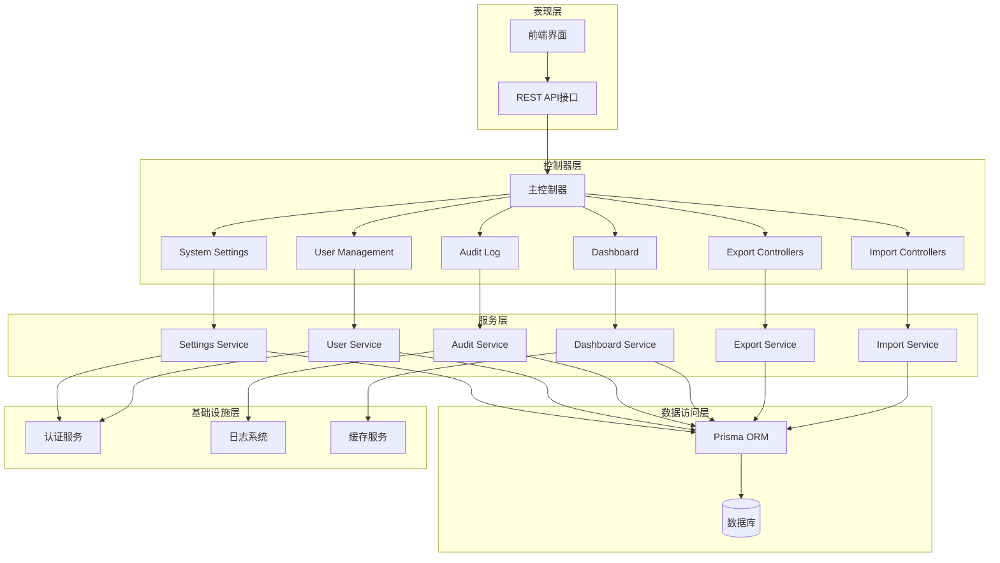

**图表来源**
- [app.js:1-200](file://server/src/app.js#L1-L200)
- [server.js:1-200](file://server/src/server.js#L1-L200)

## 详细组件分析

### 系统设置控制器分析

系统设置控制器实现了完整的配置管理功能，采用了命令模式和策略模式相结合的设计：

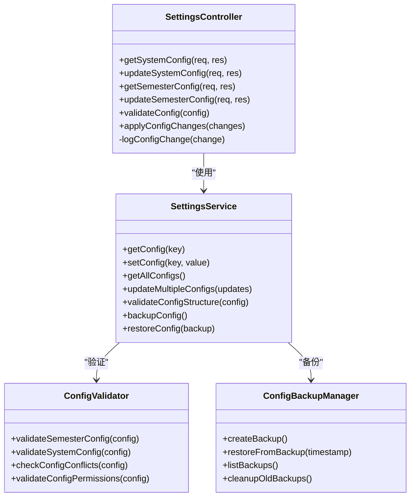

**图表来源**
- [settings.controller.js:1-200](file://server/src/controllers/settings.controller.js#L1-L200)
- [settings.service.js:1-200](file://server/src/services/settings.service.js#L1-L200)

#### 配置管理流程

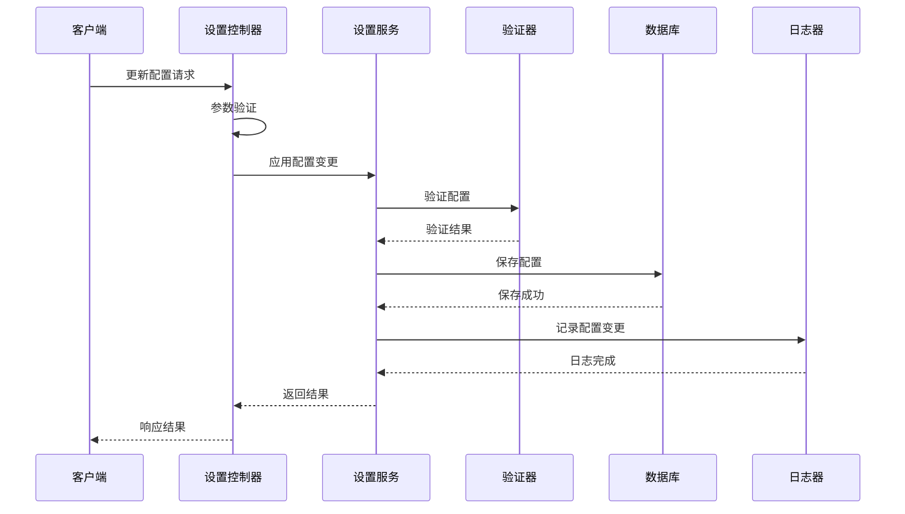

**图表来源**
- [settings.controller.js:1-200](file://server/src/controllers/settings.controller.js#L1-L200)
- [settings.service.js:1-200](file://server/src/services/settings.service.js#L1-L200)

**章节来源**
- [settings.controller.js:1-200](file://server/src/controllers/settings.controller.js#L1-L200)
- [settings.service.js:1-200](file://server/src/services/settings.service.js#L1-L200)

### 用户管理控制器分析

用户管理控制器实现了复杂的权限管理和用户生命周期控制：

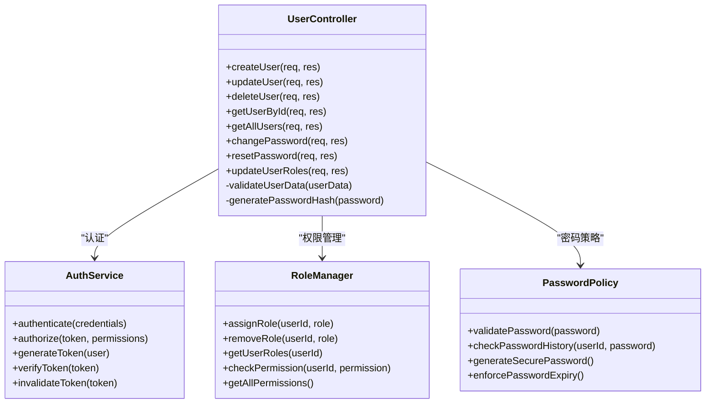

**图表来源**
- [user.controller.js:1-200](file://server/src/controllers/user.controller.js#L1-L200)
- [auth.service.js:1-200](file://server/src/services/auth.service.js#L1-L200)

#### 用户权限控制流程

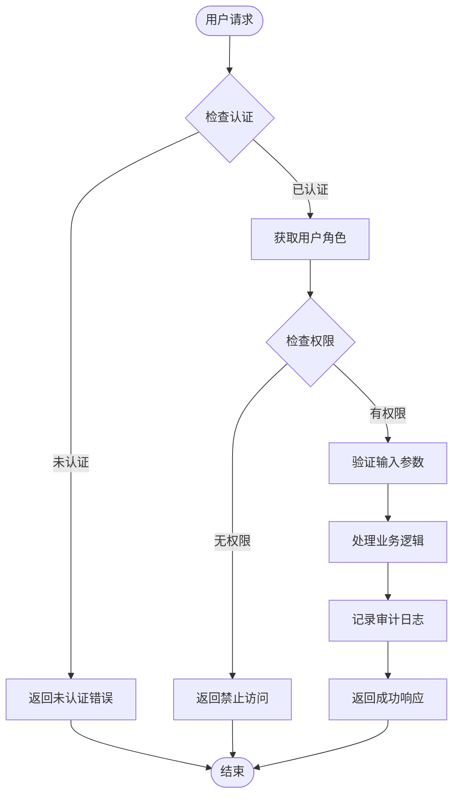

**图表来源**
- [user.controller.js:1-200](file://server/src/controllers/user.controller.js#L1-L200)
- [auth.middleware.js:1-150](file://server/src/middleware/auth.middleware.js#L1-L150)

**章节来源**
- [user.controller.js:1-200](file://server/src/controllers/user.controller.js#L1-L200)
- [auth.middleware.js:1-150](file://server/src/middleware/auth.middleware.js#L1-L150)

### 审计日志控制器分析

审计日志控制器提供了完整的操作追踪和合规性管理功能：

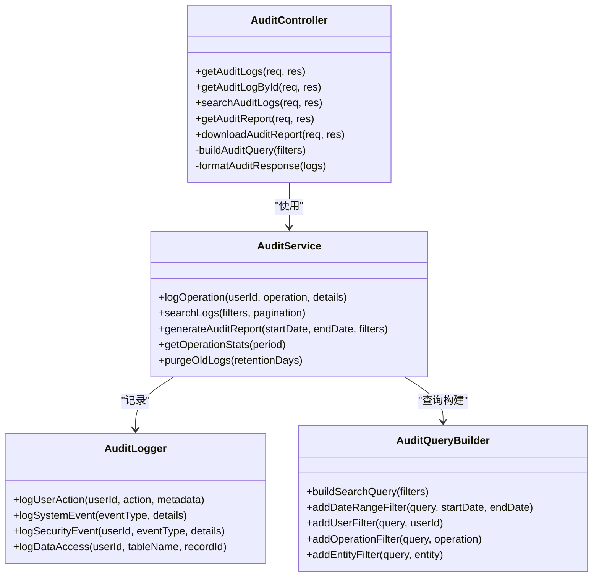

**图表来源**
- [audit.controller.js:1-200](file://server/src/controllers/audit.controller.js#L1-L200)
- [audit.service.js:1-200](file://server/src/services/audit.service.js#L1-L200)

#### 审计日志记录流程

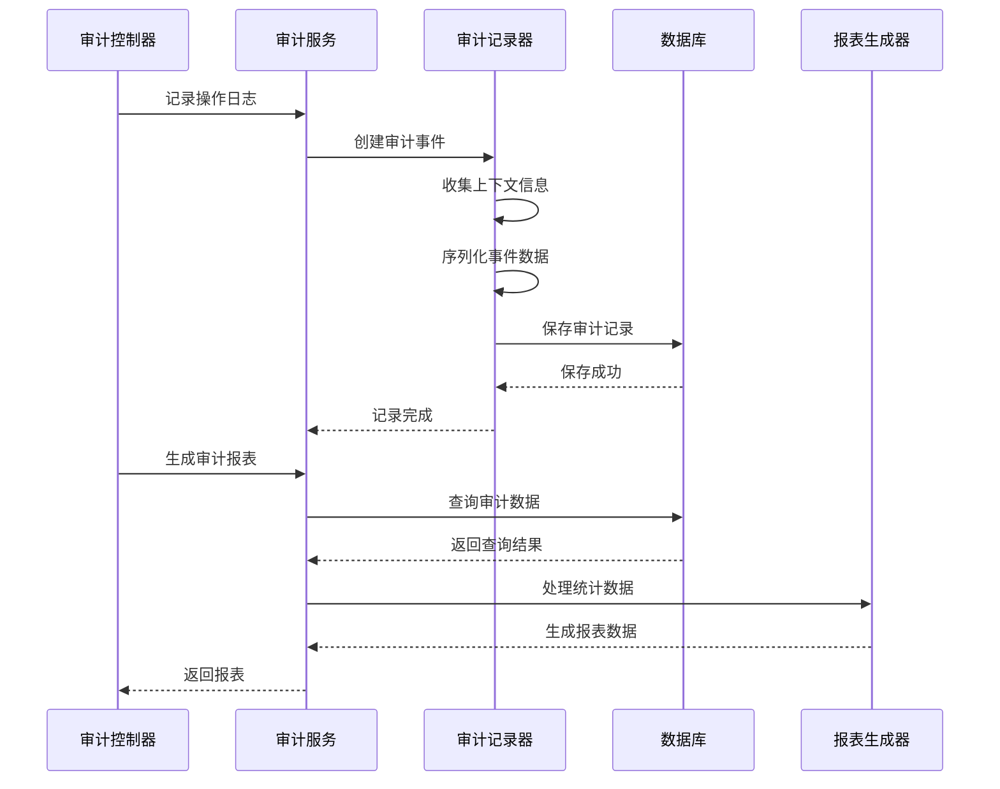

**图表来源**
- [audit.controller.js:1-200](file://server/src/controllers/audit.controller.js#L1-L200)
- [audit.service.js:1-200](file://server/src/services/audit.service.js#L1-L200)

**章节来源**
- [audit.controller.js:1-200](file://server/src/controllers/audit.controller.js#L1-L200)
- [audit.service.js:1-200](file://server/src/services/audit.service.js#L1-L200)

### 数据导入导出控制器分析

数据导入导出控制器提供了强大的批量数据处理能力：

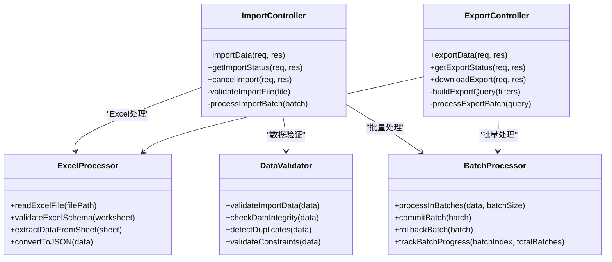

**图表来源**
- [import.controller.js:1-200](file://server/src/controllers/import.controller.js#L1-L200)
- [data-export.controller.js:1-200](file://server/src/controllers/export/data-export.controller.js#L1-L200)

#### 数据导入处理流程

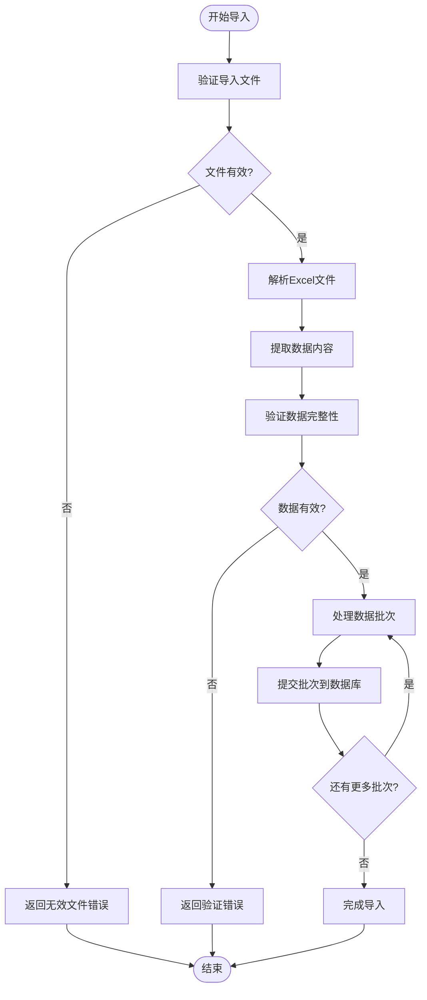

**图表来源**
- [import.controller.js:1-200](file://server/src/controllers/import.controller.js#L1-L200)
- [classes.js:1-200](file://server/src/controllers/import/classes.js#L1-L200)

**章节来源**
- [import.controller.js:1-200](file://server/src/controllers/import.controller.js#L1-L200)
- [data-export.controller.js:1-200](file://server/src/controllers/export/data-export.controller.js#L1-L200)

## 依赖关系分析

系统管理控制器之间的依赖关系体现了清晰的关注点分离：

```mermaid
graph TB
subgraph "外部依赖"
EXCEL[Excel处理库]
PRISMA[数据库ORM]
JWT[JWT认证]
BCRYPT[密码加密]
end
subgraph "内部服务依赖"
SETTINGS_SERVICE[设置服务]
AUDIT_SERVICE[审计服务]
AUTH_SERVICE[认证服务]
IMPORT_SERVICE[导入服务]
EXPORT_SERVICE[导出服务]
end
subgraph "中间件依赖"
AUTH_MIDDLEWARE[认证中间件]
VALIDATION_MIDDLEWARE[验证中间件]
PAGINATION_MIDDLEWARE[分页中间件]
ERROR_MIDDLEWARE[错误处理中间件]
end
subgraph "工具类依赖"
LOGGER[日志工具]
RESPONSE[响应工具]
UTILS[通用工具]
end
SETTINGS_CONTROLLER --> SETTINGS_SERVICE
USER_CONTROLLER --> AUTH_SERVICE
AUDIT_CONTROLLER --> AUDIT_SERVICE
IMPORT_CONTROLLER --> IMPORT_SERVICE
EXPORT_CONTROLLERS --> EXPORT_SERVICE
SETTINGS_SERVICE --> PRISMA
AUDIT_SERVICE --> PRISMA
AUTH_SERVICE --> PRISMA
IMPORT_SERVICE --> PRISMA
EXPORT_SERVICE --> PRISMA
SETTINGS_CONTROLLER --> AUTH_MIDDLEWARE
USER_CONTROLLER --> AUTH_MIDDLEWARE
AUDIT_CONTROLLER --> AUTH_MIDDLEWARE
IMPORT_CONTROLLER --> AUTH_MIDDLEWARE
SETTINGS_CONTROLLER --> VALIDATION_MIDDLEWARE
USER_CONTROLLER --> VALIDATION_MIDDLEWARE
AUDIT_CONTROLLER --> VALIDATION_MIDDLEWARE
IMPORT_CONTROLLER --> VALIDATION_MIDDLEWARE
SETTINGS_CONTROLLER --> ERROR_MIDDLEWARE
USER_CONTROLLER --> ERROR_MIDDLEWARE
AUDIT_CONTROLLER --> ERROR_MIDDLEWARE
IMPORT_CONTROLLER --> ERROR_MIDDLEWARE
SETTINGS_SERVICE --> LOGGER
AUDIT_SERVICE --> LOGGER
AUTH_SERVICE --> LOGGER
IMPORT_SERVICE --> LOGGER
EXPORT_SERVICE --> LOGGER
IMPORT_SERVICE --> EXCEL
EXPORT_SERVICE --> EXCEL
AUTH_SERVICE --> JWT
AUTH_SERVICE --> BCRYPT
```

**图表来源**
- [settings.controller.js:1-200](file://server/src/controllers/settings.controller.js#L1-L200)
- [user.controller.js:1-200](file://server/src/controllers/user.controller.js#L1-L200)
- [audit.controller.js:1-200](file://server/src/controllers/audit.controller.js#L1-L200)

**章节来源**
- [settings.controller.js:1-200](file://server/src/controllers/settings.controller.js#L1-L200)
- [user.controller.js:1-200](file://server/src/controllers/user.controller.js#L1-L200)
- [audit.controller.js:1-200](file://server/src/controllers/audit.controller.js#L1-L200)

## 性能考虑

系统管理控制器在设计时充分考虑了性能优化：

### 缓存策略
- 配置信息缓存：热门配置参数缓存在内存中
- 用户权限缓存：用户角色和权限信息缓存
- 审计日志查询缓存：常用查询结果缓存

### 批处理优化
- 大数据量导入导出采用分批处理
- 数据库事务批量提交
- 内存使用优化，避免大对象重复创建

### 并发控制
- 请求队列管理
- 数据库连接池优化
- 锁机制合理使用

### 监控指标
- API响应时间监控
- 数据库查询性能监控
- 内存使用情况监控

## 故障排除指南

### 常见问题及解决方案

#### 认证失败
**症状**：用户无法登录或权限验证失败
**排查步骤**：
1. 检查JWT密钥配置
2. 验证用户账户状态
3. 确认用户角色分配
4. 查看认证中间件日志

#### 权限不足
**症状**：用户尝试执行受限操作被拒绝
**排查步骤**：
1. 检查用户角色权限
2. 验证API端点权限配置
3. 确认权限继承关系
4. 查看权限验证日志

#### 数据导入失败
**症状**：批量数据导入过程中断
**排查步骤**：
1. 检查Excel文件格式
2. 验证数据完整性
3. 查看导入批次状态
4. 检查数据库约束

#### 审计日志异常
**症状**：审计记录缺失或不完整
**排查步骤**：
1. 检查审计服务状态
2. 验证日志存储配置
3. 查看审计记录完整性
4. 确认审计策略配置

### 调试工具和技巧

#### 日志分析
- 启用详细日志级别
- 分析请求响应时间
- 监控错误频率
- 追踪用户操作轨迹

#### 性能分析
- 使用性能监控工具
- 分析数据库查询
- 监控内存使用
- 检查并发处理

#### 系统健康检查
- 定期检查服务状态
- 验证配置参数
- 测试关键功能
- 监控系统资源

**章节来源**
- [logger.js:1-200](file://server/src/utils/logger.js#L1-L200)
- [error.middleware.js:1-200](file://server/src/middleware/error.middleware.js#L1-L200)

## 结论

KEC课程管理平台的系统管理控制器展现了现代Web应用控制器层的最佳实践。通过合理的架构设计、完善的权限控制、详细的审计机制和高效的性能优化，该系统为教育机构提供了可靠的课程管理解决方案。

系统的主要优势包括：
- 清晰的分层架构和职责分离
- 完善的安全控制和权限管理
- 详细的审计追踪和合规性支持
- 高效的数据导入导出功能
- 良好的性能表现和扩展性

未来可以进一步优化的方向包括：
- 增强实时监控和告警功能
- 扩展API版本管理和向后兼容性
- 优化大数据量处理性能
- 增加更多自动化运维功能