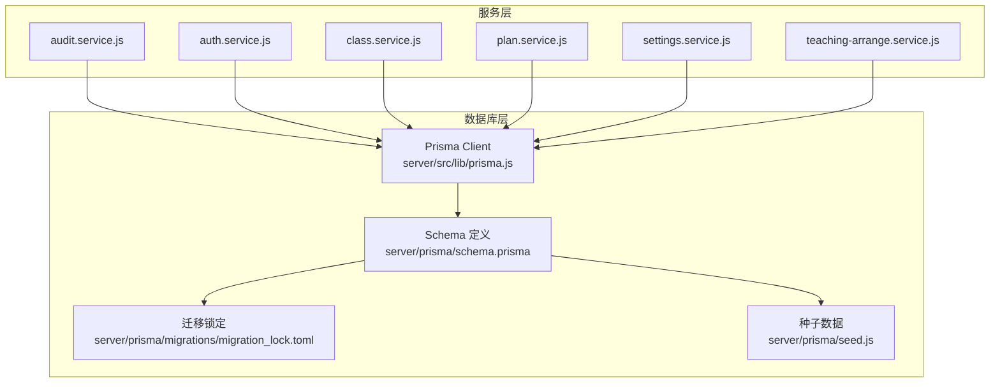
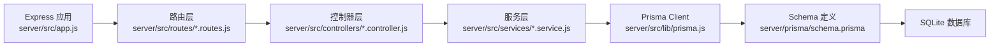
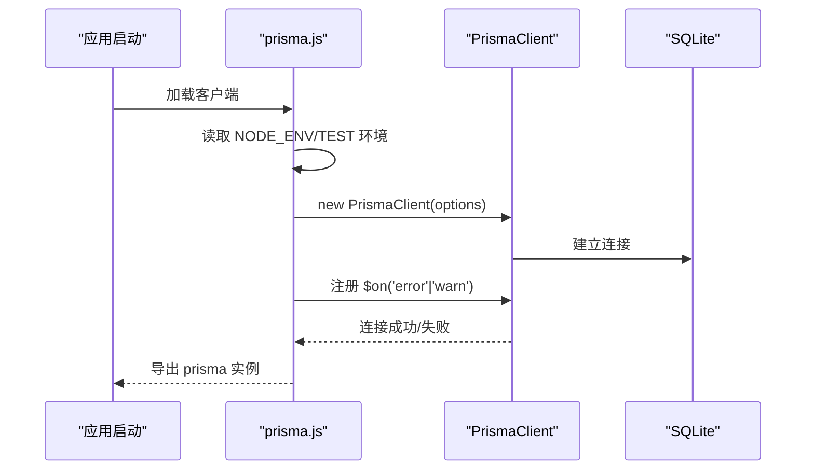
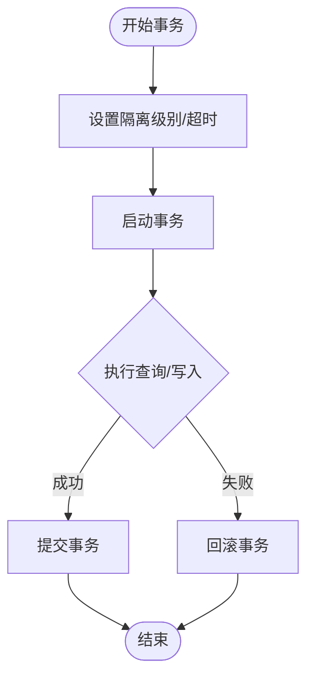
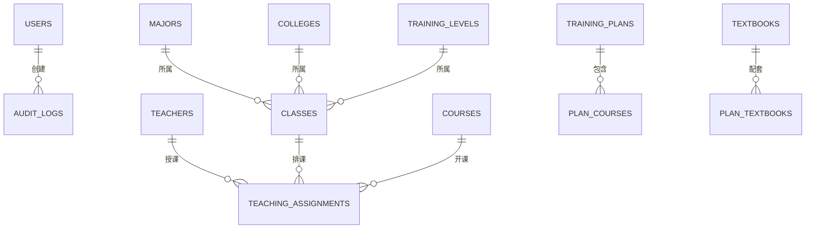
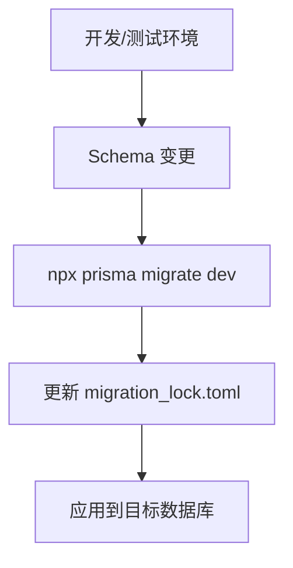
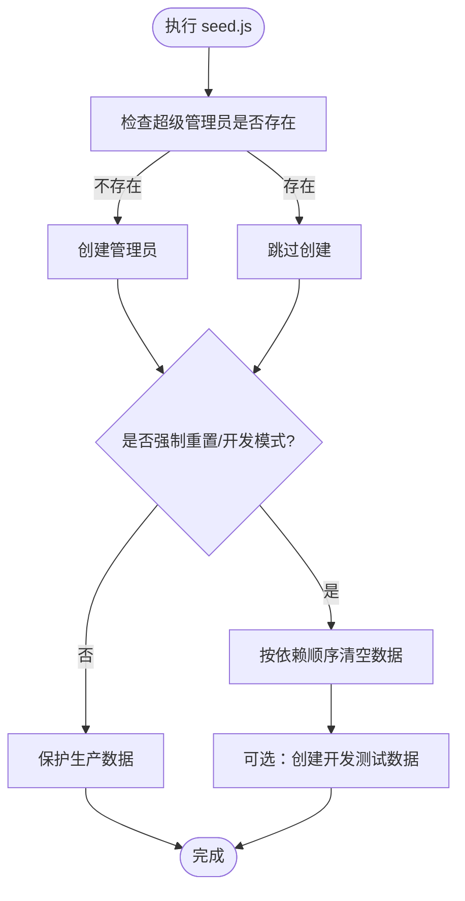
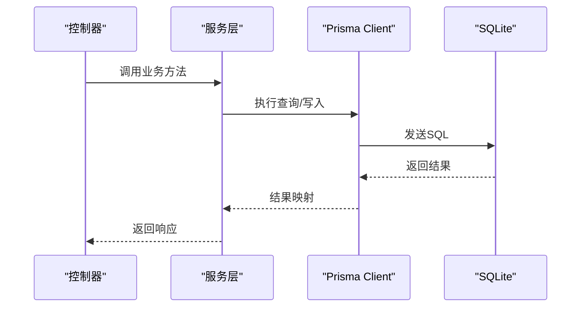
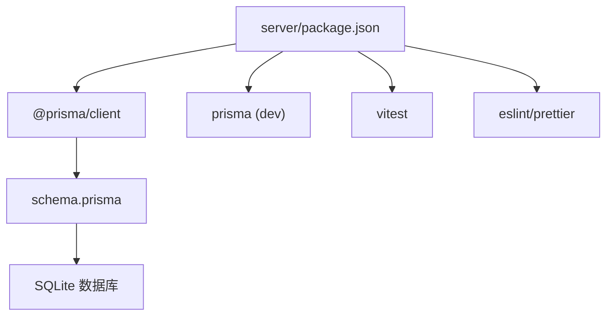

# 数据库集成

<cite>
**本文引用的文件**
- [schema.prisma](file://server/prisma/schema.prisma)
- [prisma.js](file://server/src/lib/prisma.js)
- [package.json](file://server/package.json)
- [migration_lock.toml](file://server/prisma/migrations/migration_lock.toml)
- [seed.js](file://server/prisma/seed.js)
- [audit.service.js](file://server/src/services/audit.service.js)
- [auth.service.js](file://server/src/services/auth.service.js)
- [class.service.js](file://server/src/services/class.service.js)
- [plan.service.js](file://server/src/services/plan.service.js)
- [settings.service.js](file://server/src/services/settings.service.js)
- [teaching-arrange.service.js](file://server/src/services/teaching-arrange.service.js)
</cite>

## 目录
1. [简介](#简介)
2. [项目结构](#项目结构)
3. [核心组件](#核心组件)
4. [架构总览](#架构总览)
5. [详细组件分析](#详细组件分析)
6. [依赖分析](#依赖分析)
7. [性能考虑](#性能考虑)
8. [故障排查指南](#故障排查指南)
9. [结论](#结论)
10. [附录](#附录)

## 简介
本文件面向KEC课程管理平台的数据库集成，聚焦于Prisma ORM的配置与使用，涵盖数据库连接管理、模型定义、查询优化策略、事务处理机制、迁移与版本控制、数据模型关系设计、最佳实践与性能优化建议以及常见问题解决方案。文档以仓库中的实际代码为依据，避免臆测，确保技术细节准确可追溯。

## 项目结构
后端采用模块化分层架构，数据库访问通过Prisma Client统一管理。关键位置如下：
- 配置与模型：server/prisma/schema.prisma
- 客户端初始化：server/src/lib/prisma.js
- 迁移锁定：server/prisma/migrations/migration_lock.toml
- 种子数据：server/prisma/seed.js
- 服务层调用：server/src/services/*.service.js
- 包管理与脚本：server/package.json

图表来源
- [prisma.js:1-34](file://server/src/lib/prisma.js#L1-L34)
- [schema.prisma:1-308](file://server/prisma/schema.prisma#L1-L308)
- [migration_lock.toml:1-4](file://server/prisma/migrations/migration_lock.toml#L1-L4)
- [seed.js:1-132](file://server/prisma/seed.js#L1-L132)

章节来源
- [prisma.js:1-34](file://server/src/lib/prisma.js#L1-L34)
- [schema.prisma:1-308](file://server/prisma/schema.prisma#L1-L308)
- [package.json:11-27](file://server/package.json#L11-L27)
- [migration_lock.toml:1-4](file://server/prisma/migrations/migration_lock.toml#L1-L4)
- [seed.js:1-132](file://server/prisma/seed.js#L1-L132)

## 核心组件
- Prisma Client 初始化与日志配置：在开发环境启用错误与警告事件监听，并支持测试环境覆盖数据源。
- Schema 模型与索引：定义了审计日志、用户、教师、课程、班级、培养计划、教材等核心实体及关系；大量使用索引提升查询效率。
- 迁移与版本控制：通过迁移锁定文件与脚本管理数据库演进。
- 种子数据：提供超级管理员账户创建与可选的数据清理/填充逻辑。

章节来源
- [prisma.js:4-33](file://server/src/lib/prisma.js#L4-L33)
- [schema.prisma:10-308](file://server/prisma/schema.prisma#L10-L308)
- [package.json:16-21](file://server/package.json#L16-L21)
- [seed.js:14-131](file://server/prisma/seed.js#L14-L131)

## 架构总览
Prisma 在本项目中承担ORM职责，服务层通过统一的 Prisma Client 实例进行数据访问。开发/测试/生产环境通过环境变量与选项区分，保证日志与数据源可控。

图表来源
- [prisma.js:1-34](file://server/src/lib/prisma.js#L1-L34)
- [schema.prisma:5-8](file://server/prisma/schema.prisma#L5-L8)

## 详细组件分析

### Prisma 客户端初始化与连接管理
- 环境区分：开发环境开启错误与警告事件监听；测试环境可通过 DATABASE_URL 覆盖数据源。
- 日志级别：开发环境输出 error/warn，生产环境仅输出 error。
- 错误处理：通过事件监听记录 Prisma 错误与警告，便于定位问题。

图表来源
- [prisma.js:4-33](file://server/src/lib/prisma.js#L4-L33)

章节来源
- [prisma.js:4-33](file://server/src/lib/prisma.js#L4-L33)

### 数据库连接池与事务处理机制
- 事务管理：Prisma 提供交互式事务与批量事务两种模式，支持隔离级别配置与超时控制。
- 事务生命周期：启动、提交、回滚与超时处理，内部通过事务管理器协调驱动适配器。
- 批量查询：通过批处理优化多请求场景，减少往返次数。

图表来源
- [prisma.js:22-33](file://server/src/lib/prisma.js#L22-L33)

章节来源
- [prisma.js:22-33](file://server/src/lib/prisma.js#L22-L33)

### 数据模型定义与关系设计
- 关键实体：用户、审计日志、教师、课程、班级、培养计划、教材、教学安排等。
- 外键约束：使用 onDelete 行为（如 SetNull、Cascade、Restrict）明确关系变更策略。
- 索引策略：对常用过滤字段（如状态、年份、角色、唯一键）建立索引，提升查询性能。
- 复合索引：针对联合查询条件建立复合索引，降低排序与过滤成本。

图表来源
- [schema.prisma:10-308](file://server/prisma/schema.prisma#L10-L308)

章节来源
- [schema.prisma:10-308](file://server/prisma/schema.prisma#L10-L308)

### 查询优化策略
- 精准选择字段：使用 select/include 控制返回字段，避免不必要的数据传输。
- 索引利用：为高频过滤字段建立索引；复合查询优先使用复合索引。
- 分页与游标：结合 skip/take 或基于游标的分页，避免大结果集全量扫描。
- 预加载关联：通过 include 预加载必要关联，减少 N+1 查询。
- 原生 SQL：复杂统计/聚合场景可使用原生 SQL，但需注意参数绑定与注入风险。

章节来源
- [schema.prisma:83-84](file://server/prisma/schema.prisma#L83-L84)
- [schema.prisma:111-112](file://server/prisma/schema.prisma#L111-L112)
- [schema.prisma:173-175](file://server/prisma/schema.prisma#L173-L175)
- [schema.prisma:226-227](file://server/prisma/schema.prisma#L226-L227)

### 迁移管理与版本控制
- 迁移脚本：通过 npm 脚本触发 prisma migrate dev，自动检测变更并生成迁移。
- 迁移锁定：migration_lock.toml 用于锁定当前迁移状态，防止并发冲突。
- 版本策略：每次数据库结构变更均对应一次迁移提交，保持历史可追溯。

图表来源
- [package.json:16-17](file://server/package.json#L16-L17)
- [migration_lock.toml:1-4](file://server/prisma/migrations/migration_lock.toml#L1-L4)

章节来源
- [package.json:16-17](file://server/package.json#L16-L17)
- [migration_lock.toml:1-4](file://server/prisma/migrations/migration_lock.toml#L1-L4)

### 种子数据与初始化流程
- 超级管理员：若不存在则创建默认管理员账号，避免生产环境覆盖。
- 数据清理：支持强制重置或开发模式下的全量清空，按依赖顺序删除。
- 开发数据：开发模式下可创建示例数据，便于本地调试。

图表来源
- [seed.js:14-131](file://server/prisma/seed.js#L14-L131)

章节来源
- [seed.js:14-131](file://server/prisma/seed.js#L14-L131)

### 服务层与数据库交互示例
服务层通过统一的 Prisma 实例进行数据访问，典型流程如下：

图表来源
- [prisma.js:1-34](file://server/src/lib/prisma.js#L1-L34)

章节来源
- [prisma.js:1-34](file://server/src/lib/prisma.js#L1-L34)

## 依赖分析
- 外部依赖：@prisma/client、sqlite 数据库（由 schema.prisma 指定 provider）。
- 开发工具：prisma、vitest、eslint、prettier 等。
- 脚本命令：db:migrate、db:generate、db:seed、db:reset 等。

图表来源
- [package.json:28-51](file://server/package.json#L28-L51)
- [schema.prisma:5-8](file://server/prisma/schema.prisma#L5-L8)

章节来源
- [package.json:28-51](file://server/package.json#L28-L51)
- [schema.prisma:5-8](file://server/prisma/schema.prisma#L5-L8)

## 性能考虑
- 索引优化：为高频过滤字段与外键建立索引；复合查询优先使用复合索引。
- 查询裁剪：尽量使用 select/include 精准返回所需字段。
- 批量操作：对批量写入使用 createMany/updateMany/deleteMany，减少网络往返。
- 分页策略：大列表使用游标或偏移分页，避免深翻页导致的性能问题。
- 事务边界：合理划分事务范围，避免长时间持有锁；必要时调整隔离级别。
- 监控与日志：开发环境开启 warn/error 日志，生产环境仅保留 error，便于问题定位。

## 故障排查指南
- 连接失败：检查 DATABASE_URL 环境变量与权限；确认 SQLite 文件路径可写。
- 迁移异常：查看 migration_lock.toml 是否被意外修改；使用 db:migrate 重新应用。
- 权限/外键约束：关注 Prisma 抛出的约束错误，核对 onDelete 行为与数据一致性。
- 事务超时：适当增大超时时间或减少事务内工作量；检查隔离级别是否合适。
- 日志定位：开发环境可看到 Prisma 的 error/warn 事件，结合服务层日志快速定位问题。

章节来源
- [prisma.js:24-32](file://server/src/lib/prisma.js#L24-L32)
- [package.json:16-17](file://server/package.json#L16-L17)

## 结论
本项目的数据库集成以 Prisma 为核心，通过清晰的模型定义、完善的索引策略、规范的迁移流程与统一的客户端初始化，实现了稳定高效的持久层。配合服务层的职责分离与事务管理，整体具备良好的可维护性与扩展性。建议持续关注查询性能与索引命中率，定期评估迁移策略与种子数据的适用性。

## 附录
- 常用脚本
  - 数据库迁移：npm run db:migrate
  - 生成客户端：npm run db:generate
  - 初始化系统设置：npm run init:settings
  - 重置数据库：npm run db:reset
  - 种子数据：npm run db:seed / db:seed:dev / db:seed:reset
- 环境变量
  - DATABASE_URL：数据库连接字符串（可被测试环境覆盖）
  - NODE_ENV：开发/生产环境标识
  - FORCE_RESET / DEV_SEEDS：种子数据重置与开发模式开关

章节来源
- [package.json:11-27](file://server/package.json#L11-L27)
- [prisma.js:16-20](file://server/src/lib/prisma.js#L16-L20)
- [seed.js:7-8](file://server/prisma/seed.js#L7-L8)