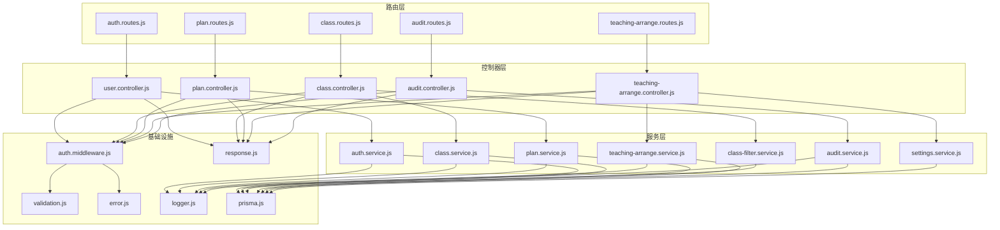
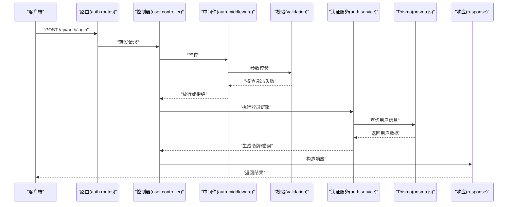
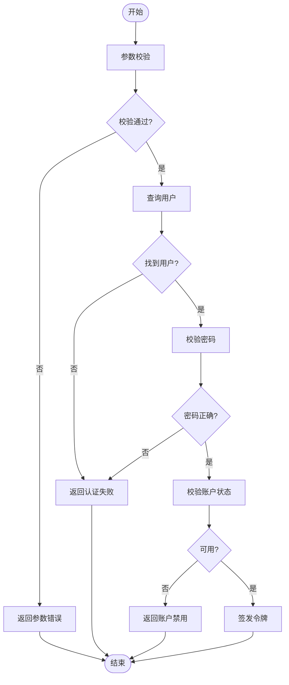
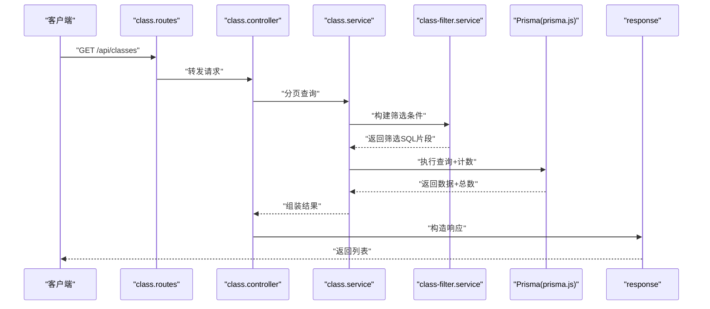
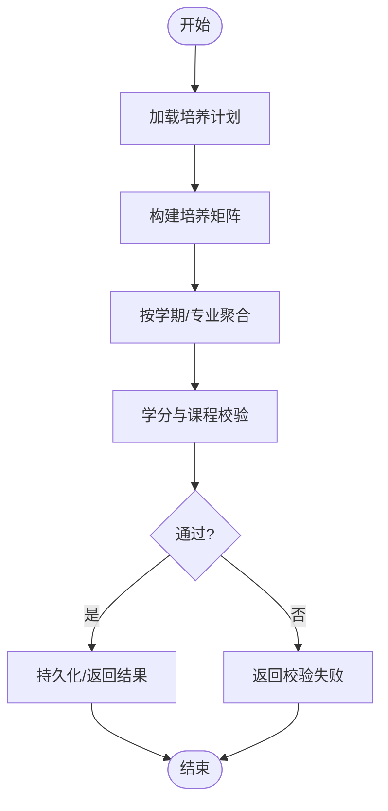
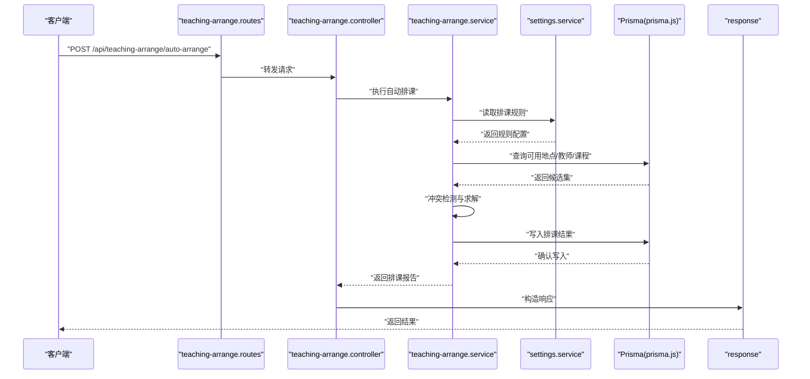
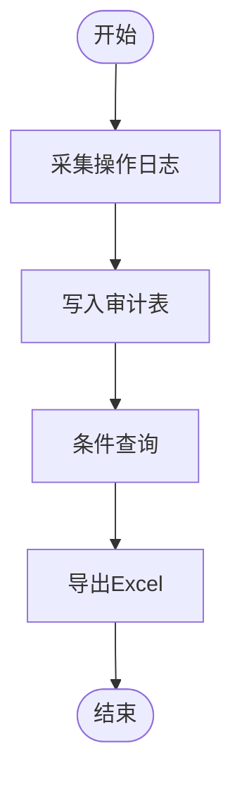
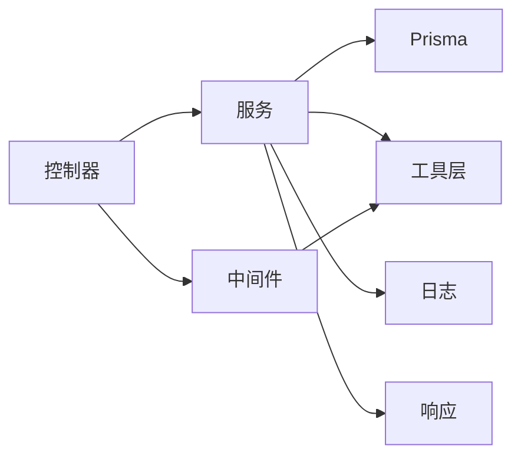

# 业务服务模块

<cite>
**本文引用的文件**
- [audit.service.js](file://server/src/services/audit.service.js)
- [auth.service.js](file://server/src/services/auth.service.js)
- [class.service.js](file://server/src/services/class.service.js)
- [class-filter.service.js](file://server/src/services/class-filter.service.js)
- [plan.service.js](file://server/src/services/plan.service.js)
- [teaching-arrange.service.js](file://server/src/services/teaching-arrange.service.js)
- [settings.service.js](file://server/src/services/settings.service.js)
- [prisma.js](file://server/src/lib/prisma.js)
- [auth.middleware.js](file://server/src/middleware/auth.middleware.js)
- [validation.js](file://server/src/middleware/validation.js)
- [error.js](file://server/src/middleware/error.js)
- [logger.js](file://server/src/utils/logger.js)
- [response.js](file://server/src/utils/response.js)
- [class.controller.js](file://server/src/controllers/class.controller.js)
- [plan.controller.js](file://server/src/controllers/plan.controller.js)
- [teaching-arrange.controller.js](file://server/src/controllers/teaching-arrange.controller.js)
- [audit.controller.js](file://server/src/controllers/audit.controller.js)
- [user.controller.js](file://server/src/controllers/user.controller.js)
- [auth.routes.js](file://server/src/routes/auth.routes.js)
- [class.routes.js](file://server/src/routes/class.routes.js)
- [plan.routes.js](file://server/src/routes/plan.routes.js)
- [teaching-arrange.routes.js](file://server/src/routes/teaching-arrange.routes.js)
- [audit.routes.js](file://server/src/routes/audit.routes.js)
- [schema.prisma](file://server/prisma/schema.prisma)
</cite>

## 目录
1. [引言](#引言)
2. [项目结构](#项目结构)
3. [核心组件](#核心组件)
4. [架构总览](#架构总览)
5. [详细组件分析](#详细组件分析)
6. [依赖分析](#依赖分析)
7. [性能考虑](#性能考虑)
8. [故障排查指南](#故障排查指南)
9. [结论](#结论)

## 引言
本文件聚焦KEC课程管理平台后端“业务服务模块”，系统性梳理并解读以下核心服务：班级管理服务、培养方案服务、教学安排服务、审计服务与认证服务。文档从架构设计、数据流、事务策略、错误处理、服务间协作、依赖注入模式到性能优化策略进行逐层展开，并辅以图示与路径指引，帮助开发者快速掌握各模块实现细节与最佳实践。

## 项目结构
后端采用分层架构：路由层（routes）接收请求，控制器层（controllers）编排业务，服务层（services）封装领域逻辑，工具层（utils）提供通用能力，持久化通过Prisma连接数据库。认证中间件贯穿控制器入口，统一校验与异常处理由中间件与工具层协同完成。

图表来源
- [auth.routes.js](file://server/src/routes/auth.routes.js)
- [class.routes.js](file://server/src/routes/class.routes.js)
- [plan.routes.js](file://server/src/routes/plan.routes.js)
- [teaching-arrange.routes.js](file://server/src/routes/teaching-arrange.routes.js)
- [audit.routes.js](file://server/src/routes/audit.routes.js)
- [user.controller.js](file://server/src/controllers/user.controller.js)
- [class.controller.js](file://server/src/controllers/class.controller.js)
- [plan.controller.js](file://server/src/controllers/plan.controller.js)
- [teaching-arrange.controller.js](file://server/src/controllers/teaching-arrange.controller.js)
- [audit.controller.js](file://server/src/controllers/audit.controller.js)
- [auth.service.js](file://server/src/services/auth.service.js)
- [class.service.js](file://server/src/services/class.service.js)
- [class-filter.service.js](file://server/src/services/class-filter.service.js)
- [plan.service.js](file://server/src/services/plan.service.js)
- [teaching-arrange.service.js](file://server/src/services/teaching-arrange.service.js)
- [audit.service.js](file://server/src/services/audit.service.js)
- [settings.service.js](file://server/src/services/settings.service.js)
- [auth.middleware.js](file://server/src/middleware/auth.middleware.js)
- [validation.js](file://server/src/middleware/validation.js)
- [error.js](file://server/src/middleware/error.js)
- [response.js](file://server/src/utils/response.js)
- [logger.js](file://server/src/utils/logger.js)
- [prisma.js](file://server/src/lib/prisma.js)

章节来源
- [auth.routes.js](file://server/src/routes/auth.routes.js)
- [class.routes.js](file://server/src/routes/class.routes.js)
- [plan.routes.js](file://server/src/routes/plan.routes.js)
- [teaching-arrange.routes.js](file://server/src/routes/teaching-arrange.routes.js)
- [audit.routes.js](file://server/src/routes/audit.routes.js)
- [user.controller.js](file://server/src/controllers/user.controller.js)
- [class.controller.js](file://server/src/controllers/class.controller.js)
- [plan.controller.js](file://server/src/controllers/plan.controller.js)
- [teaching-arrange.controller.js](file://server/src/controllers/teaching-arrange.controller.js)
- [audit.controller.js](file://server/src/controllers/audit.controller.js)
- [auth.service.js](file://server/src/services/auth.service.js)
- [class.service.js](file://server/src/services/class.service.js)
- [class-filter.service.js](file://server/src/services/class-filter.service.js)
- [plan.service.js](file://server/src/services/plan.service.js)
- [teaching-arrange.service.js](file://server/src/services/teaching-arrange.service.js)
- [audit.service.js](file://server/src/services/audit.service.js)
- [settings.service.js](file://server/src/services/settings.service.js)
- [auth.middleware.js](file://server/src/middleware/auth.middleware.js)
- [validation.js](file://server/src/middleware/validation.js)
- [error.js](file://server/src/middleware/error.js)
- [response.js](file://server/src/utils/response.js)
- [logger.js](file://server/src/utils/logger.js)
- [prisma.js](file://server/src/lib/prisma.js)

## 核心组件
- 认证服务：负责用户登录、令牌签发与校验、权限判定等。
- 班级管理服务：负责班级的CRUD、筛选、批量导入导出等。
- 培养方案服务：负责培养计划的构建、矩阵计算、查询与统计。
- 教学安排服务：负责自动排课、冲突检测、批量操作与状态流转。
- 审计服务：负责操作日志记录、查询与导出。
- 设置服务：负责系统配置项的读写与校验。

章节来源
- [auth.service.js](file://server/src/services/auth.service.js)
- [class.service.js](file://server/src/services/class.service.js)
- [class-filter.service.js](file://server/src/services/class-filter.service.js)
- [plan.service.js](file://server/src/services/plan.service.js)
- [teaching-arrange.service.js](file://server/src/services/teaching-arrange.service.js)
- [audit.service.js](file://server/src/services/audit.service.js)
- [settings.service.js](file://server/src/services/settings.service.js)

## 架构总览
服务层通过Prisma访问数据库，控制器层在进入业务逻辑前统一经过认证中间件与参数校验中间件，异常由统一错误中间件捕获并转换为标准响应格式。日志与响应工具提供横切关注点支持。

图表来源
- [auth.routes.js](file://server/src/routes/auth.routes.js)
- [user.controller.js](file://server/src/controllers/user.controller.js)
- [auth.middleware.js](file://server/src/middleware/auth.middleware.js)
- [validation.js](file://server/src/middleware/validation.js)
- [auth.service.js](file://server/src/services/auth.service.js)
- [prisma.js](file://server/src/lib/prisma.js)
- [response.js](file://server/src/utils/response.js)

## 详细组件分析

### 认证服务
- 业务逻辑
  - 登录：接收账号密码，校验凭据，查询用户角色与状态，签发令牌。
  - 令牌校验：解析请求头中的令牌，验证有效性与过期时间，注入当前用户上下文。
  - 权限判定：基于用户角色与资源访问规则进行授权判断。
- 数据处理流程
  - 输入参数校验 → 查询用户 → 密码验证 → 角色与状态校验 → 令牌签发。
- 事务管理策略
  - 单次查询与写入（签发令牌）均在单事务中完成，保证原子性。
- 错误处理机制
  - 参数缺失/格式错误、用户不存在、密码错误、账户禁用、令牌无效等均有明确错误码与消息。
- 依赖注入模式
  - 控制器通过依赖注入方式获取认证服务实例；服务内部依赖Prisma与加密/令牌库。
- 性能优化策略
  - 对用户查询建立索引；缓存热点用户信息；避免重复哈希计算。

图表来源
- [auth.service.js](file://server/src/services/auth.service.js)
- [prisma.js](file://server/src/lib/prisma.js)
- [auth.middleware.js](file://server/src/middleware/auth.middleware.js)

章节来源
- [auth.service.js](file://server/src/services/auth.service.js)
- [auth.middleware.js](file://server/src/middleware/auth.middleware.js)
- [validation.js](file://server/src/middleware/validation.js)
- [error.js](file://server/src/middleware/error.js)
- [response.js](file://server/src/utils/response.js)
- [prisma.js](file://server/src/lib/prisma.js)

### 班级管理服务
- 业务逻辑
  - 班级增删改查、列表分页与排序、按条件筛选（年级、专业、学院等）。
  - 批量导入：Excel解析、字段映射、唯一性校验、冲突处理。
  - 批量导出：动态列配置、数据过滤与格式化。
- 数据处理流程
  - 控制器接收请求 → 参数校验 → 调用服务 → Prisma执行查询/更新 → 组装响应。
- 事务管理策略
  - 导入采用事务包裹多条插入，失败回滚；导出为只读流程，不涉及事务。
- 错误处理机制
  - 导入：格式错误、必填缺失、重复键、类型不匹配、数据库约束冲突等。
  - 查询：分页参数非法、排序字段不存在等。
- 依赖注入模式
  - 控制器注入班级服务与筛选服务；服务内部依赖Prisma与Excel工具。
- 性能优化策略
  - 复合索引用于筛选字段；批量写入减少往返；导出时按需投影字段。

图表来源
- [class.routes.js](file://server/src/routes/class.routes.js)
- [class.controller.js](file://server/src/controllers/class.controller.js)
- [class.service.js](file://server/src/services/class.service.js)
- [class-filter.service.js](file://server/src/services/class-filter.service.js)
- [prisma.js](file://server/src/lib/prisma.js)
- [response.js](file://server/src/utils/response.js)

章节来源
- [class.service.js](file://server/src/services/class.service.js)
- [class-filter.service.js](file://server/src/services/class-filter.service.js)
- [class.controller.js](file://server/src/controllers/class.controller.js)
- [class.routes.js](file://server/src/routes/class.routes.js)
- [prisma.js](file://server/src/lib/prisma.js)
- [response.js](file://server/src/utils/response.js)

### 培养方案服务
- 业务逻辑
  - 培养计划的创建、修改、删除、查询详情与列表。
  - 矩阵计算：根据课程与学分要求生成培养矩阵，支持跨学期聚合。
  - 查询与统计：按专业/层次/学期维度汇总课程分布与学分统计。
- 数据处理流程
  - 控制器接收请求 → 参数校验 → 调用服务 → Prisma执行读写 → 计算/聚合 → 组装响应。
- 事务管理策略
  - 创建/更新采用事务，确保计划与关联数据一致性；查询为只读。
- 错误处理机制
  - 计划不存在、学期配置缺失、课程不在培养范围内、学分超限等。
- 依赖注入模式
  - 控制器注入培养方案服务；服务内部依赖Prisma与计算工具。
- 性能优化策略
  - 预聚合关键指标；对高基数字段建立索引；缓存常用矩阵视图。

图表来源
- [plan.service.js](file://server/src/services/plan.service.js)
- [plan.controller.js](file://server/src/controllers/plan.controller.js)
- [prisma.js](file://server/src/lib/prisma.js)

章节来源
- [plan.service.js](file://server/src/services/plan.service.js)
- [plan.controller.js](file://server/src/controllers/plan.controller.js)
- [plan.routes.js](file://server/src/routes/plan.routes.js)
- [prisma.js](file://server/src/lib/prisma.js)

### 教学安排服务
- 业务逻辑
  - 自动排课：基于规则引擎与启发式算法，分配教室与时间槽，避免冲突。
  - 冲突检测：教师/教室/时间重叠检测，给出冲突报告。
  - 批量操作：导入/导出排课表，批量调整与发布。
  - 状态管理：草稿/已发布/已归档等状态流转与可见性控制。
- 数据处理流程
  - 控制器接收请求 → 参数校验 → 调用服务 → 规则校验/算法求解 → 写入数据库 → 组装响应。
- 事务管理策略
  - 排课与发布采用事务，确保原子性；导入导出为只读或批量写入事务。
- 错误处理机制
  - 时间槽不可用、教师冲突、教室占用、规则不满足、并发冲突等。
- 依赖注入模式
  - 控制器注入教学安排服务与设置服务；服务内部依赖Prisma与算法模块。
- 性能优化策略
  - 使用复合索引加速冲突检测；分批提交降低锁竞争；缓存规则与约束集。

图表来源
- [teaching-arrange.routes.js](file://server/src/routes/teaching-arrange.routes.js)
- [teaching-arrange.controller.js](file://server/src/controllers/teaching-arrange.controller.js)
- [teaching-arrange.service.js](file://server/src/services/teaching-arrange.service.js)
- [settings.service.js](file://server/src/services/settings.service.js)
- [prisma.js](file://server/src/lib/prisma.js)
- [response.js](file://server/src/utils/response.js)

章节来源
- [teaching-arrange.service.js](file://server/src/services/teaching-arrange.service.js)
- [settings.service.js](file://server/src/services/settings.service.js)
- [teaching-arrange.controller.js](file://server/src/controllers/teaching-arrange.controller.js)
- [teaching-arrange.routes.js](file://server/src/routes/teaching-arrange.routes.js)
- [prisma.js](file://server/src/lib/prisma.js)

### 审计服务
- 业务逻辑
  - 操作日志采集：记录用户、时间、IP、资源、动作、结果等。
  - 日志查询：支持按时间范围、用户、资源类型、关键字等条件检索。
  - 日志导出：按模板导出到Excel，支持分页与筛选。
- 数据处理流程
  - 控制器接收请求 → 参数校验 → 调用服务 → Prisma执行读写 → 组装响应。
- 事务管理策略
  - 写入日志为单条事务；查询与导出为只读。
- 错误处理机制
  - 查询参数非法、导出模板缺失、文件写入失败等。
- 依赖注入模式
  - 控制器注入审计服务；服务内部依赖Prisma与Excel工具。
- 性能优化策略
  - 对审计表建立合适索引；分页查询限制最大页大小；导出异步化。

图表来源
- [audit.service.js](file://server/src/services/audit.service.js)
- [audit.controller.js](file://server/src/controllers/audit.controller.js)
- [audit.routes.js](file://server/src/routes/audit.routes.js)
- [prisma.js](file://server/src/lib/prisma.js)

章节来源
- [audit.service.js](file://server/src/services/audit.service.js)
- [audit.controller.js](file://server/src/controllers/audit.controller.js)
- [audit.routes.js](file://server/src/routes/audit.routes.js)
- [prisma.js](file://server/src/lib/prisma.js)

## 依赖分析
- 组件耦合
  - 控制器仅依赖服务接口，服务仅依赖Prisma与工具层，低耦合高内聚。
  - 中间件与工具层提供横切能力，避免重复代码。
- 直接与间接依赖
  - 服务层直接依赖Prisma；间接依赖日志与响应工具。
  - 教学安排服务依赖设置服务获取规则。
- 外部依赖与集成点
  - 数据库：Prisma ORM；Excel：导入导出工具。
- 接口契约
  - 控制器与服务之间通过明确的输入输出契约交互；错误通过统一中间件处理。

图表来源
- [user.controller.js](file://server/src/controllers/user.controller.js)
- [class.controller.js](file://server/src/controllers/class.controller.js)
- [plan.controller.js](file://server/src/controllers/plan.controller.js)
- [teaching-arrange.controller.js](file://server/src/controllers/teaching-arrange.controller.js)
- [audit.controller.js](file://server/src/controllers/audit.controller.js)
- [auth.service.js](file://server/src/services/auth.service.js)
- [class.service.js](file://server/src/services/class.service.js)
- [plan.service.js](file://server/src/services/plan.service.js)
- [teaching-arrange.service.js](file://server/src/services/teaching-arrange.service.js)
- [audit.service.js](file://server/src/services/audit.service.js)
- [prisma.js](file://server/src/lib/prisma.js)
- [logger.js](file://server/src/utils/logger.js)
- [response.js](file://server/src/utils/response.js)

章节来源
- [user.controller.js](file://server/src/controllers/user.controller.js)
- [class.controller.js](file://server/src/controllers/class.controller.js)
- [plan.controller.js](file://server/src/controllers/plan.controller.js)
- [teaching-arrange.controller.js](file://server/src/controllers/teaching-arrange.controller.js)
- [audit.controller.js](file://server/src/controllers/audit.controller.js)
- [auth.service.js](file://server/src/services/auth.service.js)
- [class.service.js](file://server/src/services/class.service.js)
- [plan.service.js](file://server/src/services/plan.service.js)
- [teaching-arrange.service.js](file://server/src/services/teaching-arrange.service.js)
- [audit.service.js](file://server/src/services/audit.service.js)
- [prisma.js](file://server/src/lib/prisma.js)
- [logger.js](file://server/src/utils/logger.js)
- [response.js](file://server/src/utils/response.js)

## 性能考虑
- 数据库层面
  - 合理建立索引：复合索引用于筛选与排序，唯一索引用于去重。
  - 分页与投影：限制每页数量，仅投影必要字段，避免N+1查询。
  - 事务边界：将多步写入放入单事务，减少锁持有时间。
- 应用层面
  - 缓存热点数据：如用户信息、规则配置、矩阵视图。
  - 批量操作：导入/导出采用批量写入，降低网络往返。
  - 并发控制：排课时使用乐观锁或队列化处理，避免竞态。
- 日志与监控
  - 结构化日志：记录关键耗时步骤，便于定位瓶颈。
  - 统一响应：标准化错误码与消息，提升可观测性。

## 故障排查指南
- 认证失败
  - 检查参数是否完整且格式正确；确认用户是否存在且状态正常；核对密码哈希与令牌有效期。
- 班级导入失败
  - 核对Excel模板字段与顺序；检查必填项与唯一性约束；查看重复键与类型不匹配提示。
- 培养方案校验失败
  - 检查课程是否在培养范围内；核对学分上限与学期分布；确认专业/层次配置。
- 教学安排冲突
  - 查看冲突报告，调整时间槽/教室/教师；检查规则配置是否合理。
- 审计导出异常
  - 检查导出模板是否存在；确认文件写入权限；查看分页与筛选参数。

章节来源
- [error.js](file://server/src/middleware/error.js)
- [logger.js](file://server/src/utils/logger.js)
- [auth.service.js](file://server/src/services/auth.service.js)
- [class.service.js](file://server/src/services/class.service.js)
- [plan.service.js](file://server/src/services/plan.service.js)
- [teaching-arrange.service.js](file://server/src/services/teaching-arrange.service.js)
- [audit.service.js](file://server/src/services/audit.service.js)

## 结论
本业务服务模块以清晰的分层与职责划分实现了认证、班级、培养方案、教学安排与审计五大核心能力。通过中间件统一鉴权与校验、Prisma提供一致的数据访问、工具层保障日志与响应质量，整体具备良好的扩展性与可维护性。建议在生产环境中进一步完善缓存策略、异步导出与更细粒度的监控埋点，持续提升用户体验与系统稳定性。