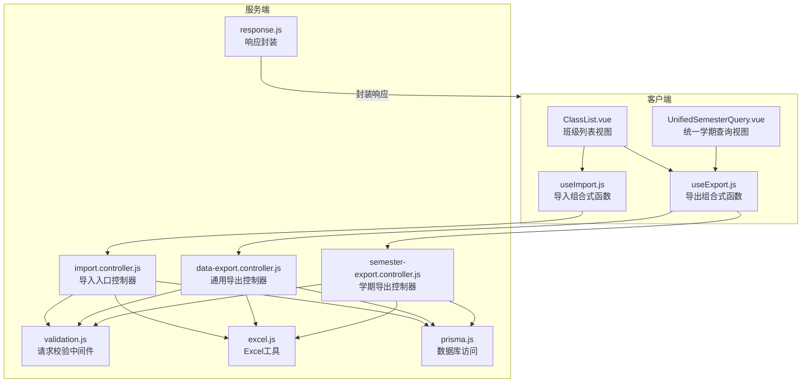
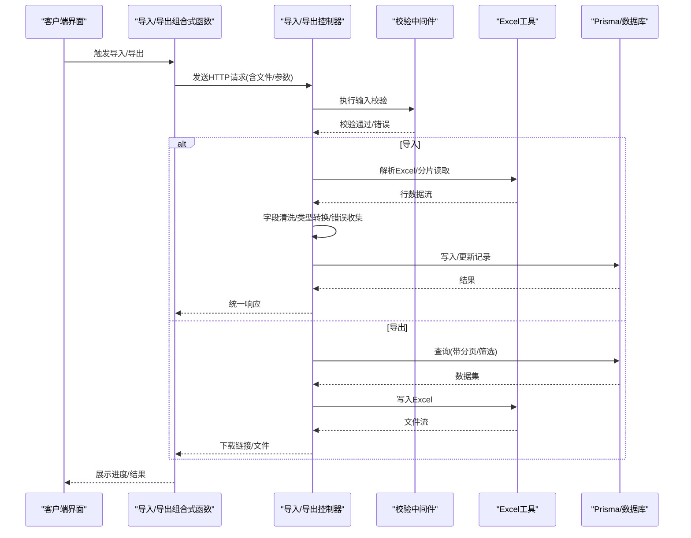
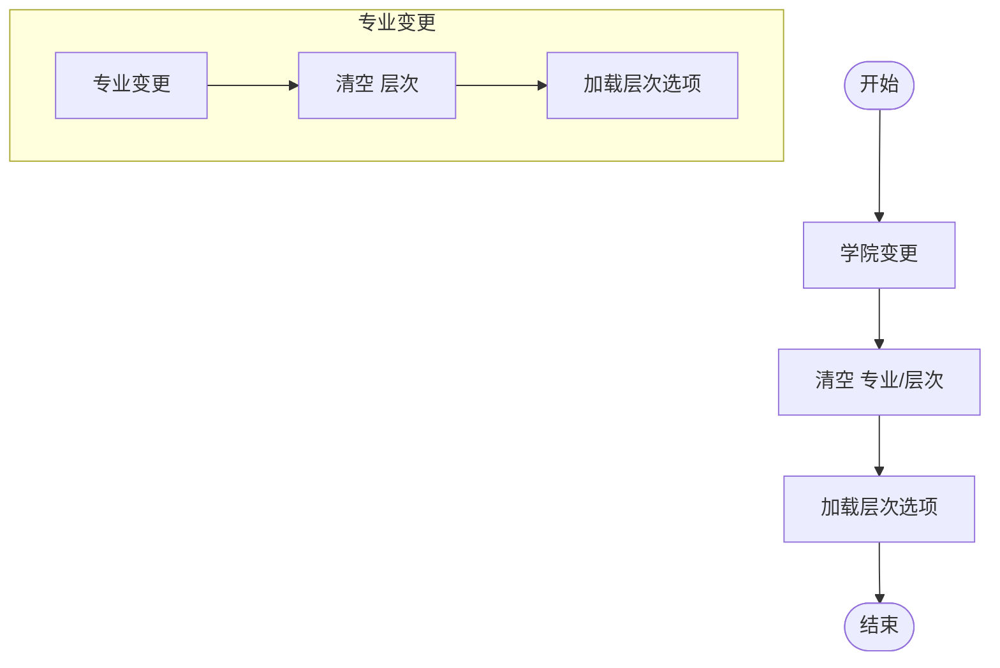
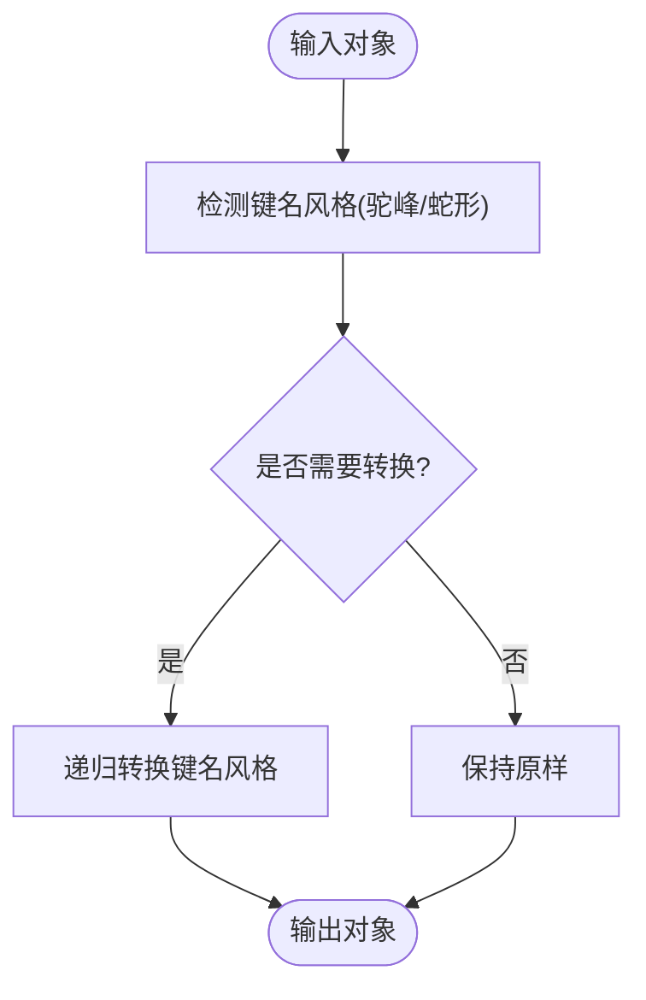
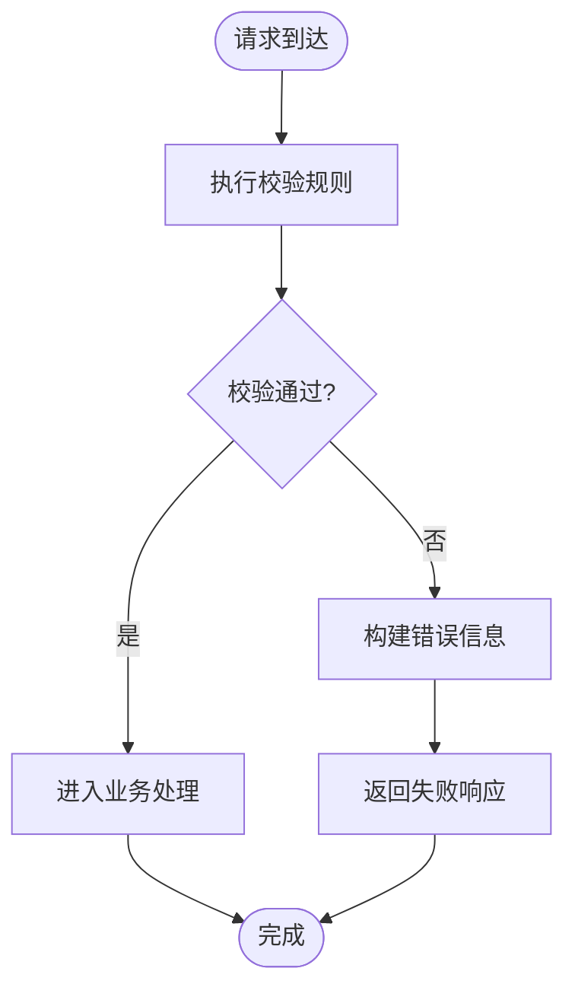
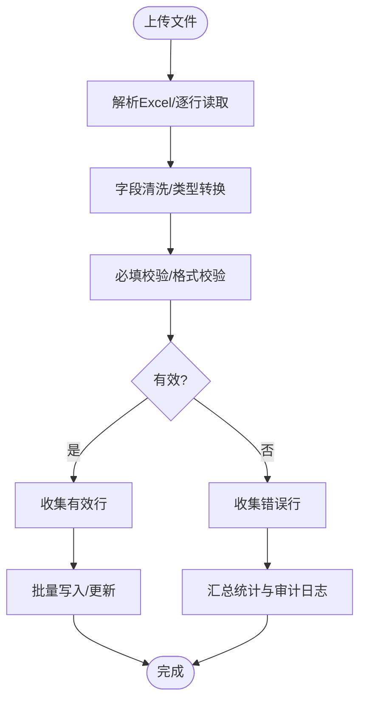
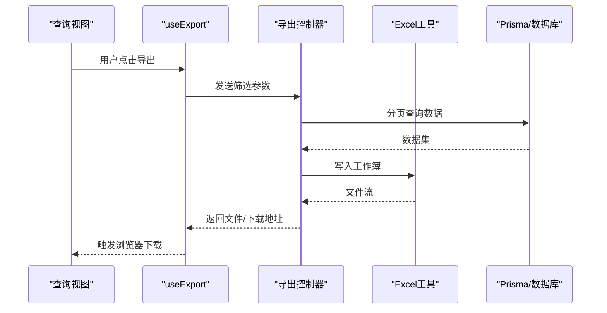
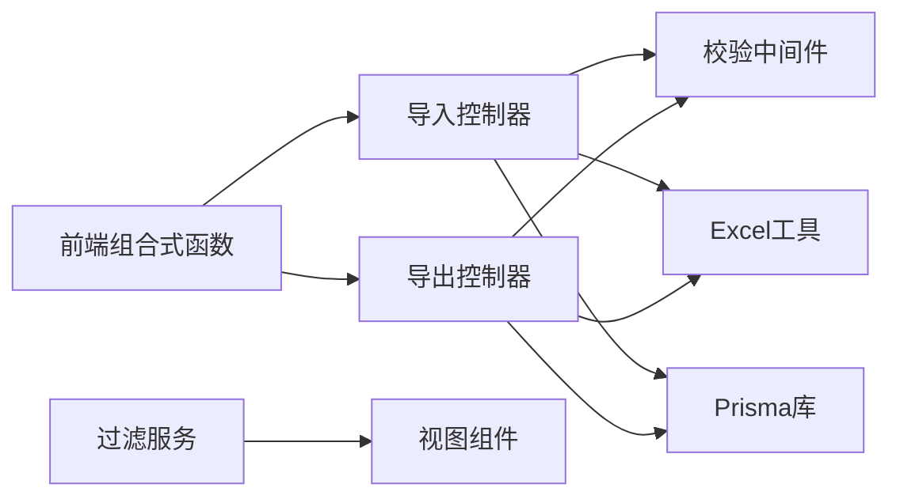

# 数据处理服务

<cite>
**本文引用的文件**
- [server/src/controllers/import.controller.js](file://server/src/controllers/import.controller.js)
- [server/src/controllers/import/classes.js](file://server/src/controllers/import/classes.js)
- [server/src/controllers/import/courses.js](file://server/src/controllers/import/courses.js)
- [server/src/controllers/import/teachers.js](file://server/src/controllers/import/teachers.js)
- [server/src/controllers/import/textbooks.js](file://server/src/controllers/import/textbooks.js)
- [server/src/controllers/export/data-export.controller.js](file://server/src/controllers/export/data-export.controller.js)
- [server/src/controllers/export/semester-export.controller.js](file://server/src/controllers/export/semester-export.controller.js)
- [server/src/services/class-filter.service.js](file://server/src/services/class-filter.service.js)
- [server/src/middleware/validation.js](file://server/src/middleware/validation.js)
- [server/src/utils/excel.js](file://server/src/utils/excel.js)
- [server/src/utils/response.js](file://server/src/utils/response.js)
- [server/src/lib/prisma.js](file://server/src/lib/prisma.js)
- [client/src/views/class/ClassList.vue](file://client/src/views/class/ClassList.vue)
- [client/src/views/query/UnifiedSemesterQuery.vue](file://client/src/views/query/UnifiedSemesterQuery.vue)
- [client/src/composables/useImport.js](file://client/src/composables/useImport.js)
- [client/src/composables/useExport.js](file://client/src/composables/useExport.js)
</cite>

## 目录
1. [简介](#简介)
2. [项目结构](#项目结构)
3. [核心组件](#核心组件)
4. [架构总览](#架构总览)
5. [详细组件分析](#详细组件分析)
6. [依赖关系分析](#依赖关系分析)
7. [性能考虑](#性能考虑)
8. [故障排查指南](#故障排查指南)
9. [结论](#结论)
10. [附录](#附录)

## 简介
本文件面向KEC课程管理平台的数据处理服务，聚焦于数据导入导出、数据过滤、数据转换与数据验证等核心能力，系统阐述数据预处理流程、清洗策略、格式转换与质量保障机制，并提供性能优化、内存管理与大数据量处理策略，以及使用示例与最佳实践。

## 项目结构
后端采用控制器-服务-中间件-工具分层；前端通过组合式函数封装导入导出逻辑并与后端交互。数据处理涉及Excel解析、字段清洗与类型转换、校验规则、审计日志与分页响应等模块。

图表来源
- [server/src/controllers/import.controller.js:1-200](file://server/src/controllers/import.controller.js#L1-L200)
- [server/src/controllers/export/data-export.controller.js:1-200](file://server/src/controllers/export/data-export.controller.js#L1-L200)
- [server/src/controllers/export/semester-export.controller.js:1-200](file://server/src/controllers/export/semester-export.controller.js#L1-L200)
- [server/src/middleware/validation.js:1-200](file://server/src/middleware/validation.js#L1-L200)
- [server/src/utils/excel.js:1-200](file://server/src/utils/excel.js#L1-L200)
- [server/src/utils/response.js:1-40](file://server/src/utils/response.js#L1-L40)
- [server/src/lib/prisma.js:1-200](file://server/src/lib/prisma.js#L1-L200)
- [client/src/views/class/ClassList.vue:550-571](file://client/src/views/class/ClassList.vue#L550-L571)
- [client/src/views/query/UnifiedSemesterQuery.vue:428-435](file://client/src/views/query/UnifiedSemesterQuery.vue#L428-L435)
- [client/src/composables/useImport.js:1-200](file://client/src/composables/useImport.js#L1-L200)
- [client/src/composables/useExport.js:1-200](file://client/src/composables/useExport.js#L1-L200)

章节来源
- [server/src/controllers/import.controller.js:1-200](file://server/src/controllers/import.controller.js#L1-L200)
- [server/src/controllers/export/data-export.controller.js:1-200](file://server/src/controllers/export/data-export.controller.js#L1-L200)
- [server/src/controllers/export/semester-export.controller.js:1-200](file://server/src/controllers/export/semester-export.controller.js#L1-L200)
- [server/src/middleware/validation.js:1-200](file://server/src/middleware/validation.js#L1-L200)
- [server/src/utils/excel.js:1-200](file://server/src/utils/excel.js#L1-L200)
- [server/src/utils/response.js:1-40](file://server/src/utils/response.js#L1-L40)
- [server/src/lib/prisma.js:1-200](file://server/src/lib/prisma.js#L1-L200)
- [client/src/views/class/ClassList.vue:550-571](file://client/src/views/class/ClassList.vue#L550-L571)
- [client/src/views/query/UnifiedSemesterQuery.vue:428-435](file://client/src/views/query/UnifiedSemesterQuery.vue#L428-L435)
- [client/src/composables/useImport.js:1-200](file://client/src/composables/useImport.js#L1-L200)
- [client/src/composables/useExport.js:1-200](file://client/src/composables/useExport.js#L1-L200)

## 核心组件
- 数据导入控制器：统一接收上传文件，调用具体业务导入处理器，执行校验与审计日志。
- 数据导出控制器：按模块生成Excel报表，支持分页与筛选参数。
- 导入处理器（班级/课程/教师/教材）：负责字段清洗、类型转换、缺失值处理与错误收集。
- Excel工具：封装读取、写入、样式与分片处理。
- 校验中间件：集中定义各接口的输入校验规则与错误处理。
- 响应封装：统一分页、成功/失败响应格式。
- 过滤服务：提供层级联动与筛选逻辑（如学院-专业-层次）。
- Prisma库：数据库连接与事务控制。

章节来源
- [server/src/controllers/import.controller.js:1-200](file://server/src/controllers/import.controller.js#L1-L200)
- [server/src/controllers/import/classes.js:1-200](file://server/src/controllers/import/classes.js#L1-L200)
- [server/src/controllers/import/courses.js:1-200](file://server/src/controllers/import/courses.js#L1-L200)
- [server/src/controllers/import/teachers.js:1-200](file://server/src/controllers/import/teachers.js#L1-L200)
- [server/src/controllers/import/textbooks.js:1-200](file://server/src/controllers/import/textbooks.js#L1-L200)
- [server/src/controllers/export/data-export.controller.js:1-200](file://server/src/controllers/export/data-export.controller.js#L1-L200)
- [server/src/controllers/export/semester-export.controller.js:1-200](file://server/src/controllers/export/semester-export.controller.js#L1-L200)
- [server/src/utils/excel.js:1-200](file://server/src/utils/excel.js#L1-L200)
- [server/src/middleware/validation.js:1-200](file://server/src/middleware/validation.js#L1-L200)
- [server/src/utils/response.js:1-40](file://server/src/utils/response.js#L1-L40)
- [server/src/services/class-filter.service.js:1-200](file://server/src/services/class-filter.service.js#L1-L200)
- [server/src/lib/prisma.js:1-200](file://server/src/lib/prisma.js#L1-L200)

## 架构总览
下图展示从客户端到服务端的数据处理链路，包括导入、校验、清洗、入库与导出流程。

图表来源
- [client/src/composables/useImport.js:1-200](file://client/src/composables/useImport.js#L1-L200)
- [client/src/composables/useExport.js:1-200](file://client/src/composables/useExport.js#L1-L200)
- [server/src/controllers/import.controller.js:1-200](file://server/src/controllers/import.controller.js#L1-L200)
- [server/src/controllers/export/data-export.controller.js:1-200](file://server/src/controllers/export/data-export.controller.js#L1-L200)
- [server/src/middleware/validation.js:1-200](file://server/src/middleware/validation.js#L1-L200)
- [server/src/utils/excel.js:1-200](file://server/src/utils/excel.js#L1-L200)
- [server/src/lib/prisma.js:1-200](file://server/src/lib/prisma.js#L1-L200)

## 详细组件分析

### 数据过滤服务
- 功能职责：根据上级维度（如学院、专业、层次）动态联动筛选，避免无效组合，提升查询效率。
- 实现要点：
  - 级联变更时清空下游筛选项，防止脏数据。
  - 学院变化触发“专业”和“层次”的重置与刷新。
  - 专业变化触发“层次”的重置与刷新。
  - 提供“回到当前学期”与“重置筛选”快捷操作。
- 性能建议：前端缓存已计算的关系映射，减少重复请求；后端对常用组合建立索引以加速筛选。

图表来源
- [client/src/views/query/UnifiedSemesterQuery.vue:396-416](file://client/src/views/query/UnifiedSemesterQuery.vue#L396-L416)

章节来源
- [client/src/views/query/UnifiedSemesterQuery.vue:385-435](file://client/src/views/query/UnifiedSemesterQuery.vue#L385-L435)
- [server/src/services/class-filter.service.js:1-200](file://server/src/services/class-filter.service.js#L1-L200)

### 数据转换服务
- 字段命名转换：提供驼峰与蛇形命名互转，确保API与数据库字段风格一致。
- 类型转换：数字、日期、布尔等类型的安全转换与默认值处理。
- 响应封装：统一分页与消息体结构，便于前端消费。

图表来源
- [server/src/utils/__tests__/naming.test.js:148-279](file://server/src/utils/__tests__/naming.test.js#L148-L279)
- [server/src/utils/response.js:1-40](file://server/src/utils/response.js#L1-L40)

章节来源
- [server/src/utils/__tests__/naming.test.js:148-279](file://server/src/utils/__tests__/naming.test.js#L148-L279)
- [server/src/utils/response.js:1-40](file://server/src/utils/response.js#L1-L40)

### 数据验证服务
- 集中校验规则：针对不同接口定义明确的输入约束（类型、范围、长度、可选性）。
- 错误处理：统一错误响应格式，便于前端提示与日志追踪。
- 示例规则：
  - 教学安排课时设置：对象结构校验、课程ID正整数校验。
  - 教师批量修改周课时：教师ID数组长度限制、周课时数值范围校验。

图表来源
- [server/src/middleware/validation.js:566-589](file://server/src/middleware/validation.js#L566-L589)

章节来源
- [server/src/middleware/validation.js:1-200](file://server/src/middleware/validation.js#L1-L200)

### 数据预处理与清洗策略
- 导入入口：接收文件，按业务模块路由至对应处理器。
- 清洗步骤：
  - 必填字段校验与错误累积。
  - 字符串去空白、空字符串转null、价格等数值字段安全转换。
  - 默认值填充（如教材类别）。
  - 记录所有行级错误，支持部分失败继续处理。
- 审计日志：记录导入动作、用户、统计信息与结果状态。

图表来源
- [server/src/controllers/import.controller.js:1-200](file://server/src/controllers/import.controller.js#L1-L200)
- [server/src/controllers/import/textbooks.js:39-77](file://server/src/controllers/import/textbooks.js#L39-L77)

章节来源
- [server/src/controllers/import.controller.js:1-200](file://server/src/controllers/import.controller.js#L1-L200)
- [server/src/controllers/import/classes.js:1-200](file://server/src/controllers/import/classes.js#L1-L200)
- [server/src/controllers/import/courses.js:1-200](file://server/src/controllers/import/courses.js#L1-L200)
- [server/src/controllers/import/teachers.js:1-200](file://server/src/controllers/import/teachers.js#L1-L200)
- [server/src/controllers/import/textbooks.js:39-77](file://server/src/controllers/import/textbooks.js#L39-L77)

### 数据格式转换与导出
- 通用导出：支持分页查询与筛选参数，统一Excel写入。
- 学期导出：按学期维度聚合数据，生成专项报表。
- 前端导出：将当前筛选条件转换为导出参数，触发下载。

图表来源
- [client/src/views/query/UnifiedSemesterQuery.vue:428-435](file://client/src/views/query/UnifiedSemesterQuery.vue#L428-L435)
- [client/src/composables/useExport.js:1-200](file://client/src/composables/useExport.js#L1-L200)
- [server/src/controllers/export/data-export.controller.js:1-200](file://server/src/controllers/export/data-export.controller.js#L1-L200)
- [server/src/controllers/export/semester-export.controller.js:1-200](file://server/src/controllers/export/semester-export.controller.js#L1-L200)
- [server/src/utils/excel.js:1-200](file://server/src/utils/excel.js#L1-L200)
- [server/src/lib/prisma.js:1-200](file://server/src/lib/prisma.js#L1-L200)

章节来源
- [client/src/views/query/UnifiedSemesterQuery.vue:428-435](file://client/src/views/query/UnifiedSemesterQuery.vue#L428-L435)
- [client/src/composables/useExport.js:1-200](file://client/src/composables/useExport.js#L1-L200)
- [server/src/controllers/export/data-export.controller.js:1-200](file://server/src/controllers/export/data-export.controller.js#L1-L200)
- [server/src/controllers/export/semester-export.controller.js:1-200](file://server/src/controllers/export/semester-export.controller.js#L1-L200)
- [server/src/utils/excel.js:1-200](file://server/src/utils/excel.js#L1-L200)
- [server/src/lib/prisma.js:1-200](file://server/src/lib/prisma.js#L1-L200)

### 数据质量保证机制
- 输入校验：严格的字段类型、范围与必填约束。
- 输出封装：统一分页与消息体，便于前端统一处理。
- 审计日志：记录导入/导出动作、用户、统计与结果，支持回溯。
- 错误聚合：单文件多行错误不中断整体流程，提升可用性。

章节来源
- [server/src/middleware/validation.js:1-200](file://server/src/middleware/validation.js#L1-L200)
- [server/src/utils/response.js:1-40](file://server/src/utils/response.js#L1-L40)
- [server/src/controllers/import/textbooks.js:62-77](file://server/src/controllers/import/textbooks.js#L62-L77)

## 依赖关系分析
- 控制器依赖中间件进行输入校验，依赖Excel工具进行文件处理，依赖Prisma进行数据持久化。
- 前端组合式函数封装导入导出流程，调用控制器接口。
- 过滤服务与视图组件配合，形成清晰的前后端职责边界。

图表来源
- [server/src/controllers/import.controller.js:1-200](file://server/src/controllers/import.controller.js#L1-L200)
- [server/src/controllers/export/data-export.controller.js:1-200](file://server/src/controllers/export/data-export.controller.js#L1-L200)
- [server/src/middleware/validation.js:1-200](file://server/src/middleware/validation.js#L1-L200)
- [server/src/utils/excel.js:1-200](file://server/src/utils/excel.js#L1-L200)
- [server/src/lib/prisma.js:1-200](file://server/src/lib/prisma.js#L1-L200)
- [server/src/services/class-filter.service.js:1-200](file://server/src/services/class-filter.service.js#L1-L200)
- [client/src/composables/useImport.js:1-200](file://client/src/composables/useImport.js#L1-L200)
- [client/src/composables/useExport.js:1-200](file://client/src/composables/useExport.js#L1-L200)

章节来源
- [server/src/controllers/import.controller.js:1-200](file://server/src/controllers/import.controller.js#L1-L200)
- [server/src/controllers/export/data-export.controller.js:1-200](file://server/src/controllers/export/data-export.controller.js#L1-L200)
- [server/src/middleware/validation.js:1-200](file://server/src/middleware/validation.js#L1-L200)
- [server/src/utils/excel.js:1-200](file://server/src/utils/excel.js#L1-L200)
- [server/src/lib/prisma.js:1-200](file://server/src/lib/prisma.js#L1-L200)
- [server/src/services/class-filter.service.js:1-200](file://server/src/services/class-filter.service.js#L1-L200)
- [client/src/composables/useImport.js:1-200](file://client/src/composables/useImport.js#L1-L200)
- [client/src/composables/useExport.js:1-200](file://client/src/composables/useExport.js#L1-L200)

## 性能考虑
- 导入性能
  - 分片读取：大文件按行或块读取，避免一次性占用内存。
  - 批量写入：使用事务与批量插入/更新，降低IO次数。
  - 并行处理：清洗与校验尽量无锁化、纯函数化，必要时拆分为多个worker。
- 导出性能
  - 分页查询：结合数据库索引与LIMIT/OFFSET，避免全表扫描。
  - 流式写入：边查询边写入Excel，减少内存峰值。
- 内存管理
  - 及时释放中间变量与临时对象，避免闭包持有大对象。
  - 对象池与复用：对重复创建的对象进行缓存与复用。
- 大数据量策略
  - 增加数据库复合索引与唯一索引，加速筛选与去重。
  - 使用游标分页或基于时间戳的增量导出。
  - 导出任务异步化：提交任务后通知用户下载链接。

## 故障排查指南
- 导入失败
  - 检查必填字段与格式，查看错误列表定位问题行。
  - 确认文件编码与列标题是否符合预期。
  - 查看审计日志中的失败详情与统计。
- 导出异常
  - 确认筛选条件是否正确，是否存在权限限制。
  - 检查导出控制器的分页参数与查询逻辑。
- 校验错误
  - 根据中间件返回的错误信息修正请求参数。
  - 关注字段范围与类型约束，如周课时应在允许范围内。
- 前端交互
  - 导入/导出时显示进度与错误提示，确保用户知情。
  - 导出前将筛选条件转换为导出参数，避免遗漏。

章节来源
- [server/src/controllers/import/textbooks.js:62-77](file://server/src/controllers/import/textbooks.js#L62-L77)
- [server/src/middleware/validation.js:566-589](file://server/src/middleware/validation.js#L566-L589)
- [client/src/views/class/ClassList.vue:544-554](file://client/src/views/class/ClassList.vue#L544-L554)
- [client/src/views/class/ClassList.vue:556-568](file://client/src/views/class/ClassList.vue#L556-L568)

## 结论
本数据处理服务通过清晰的分层设计与严格的校验、清洗、转换与导出流程，实现了高可靠与高性能的数据处理能力。结合索引优化、分片与批量处理、流式写入与异步任务等策略，可在保证数据质量的同时满足大规模场景需求。建议在生产环境中持续完善审计与监控体系，确保可追溯与可观测性。

## 附录
- 使用示例
  - 导入：在班级列表页面选择文件，触发导入流程，查看进度与错误提示。
  - 导出：在统一学期查询页面选择学期与筛选条件，点击导出按钮获取Excel。
- 最佳实践
  - 始终在导入前校验模板与字段映射。
  - 对大文件采用分片与批量写入，避免内存溢出。
  - 对导出任务进行限频与并发控制，避免数据库压力过大。
  - 为常见错误提供友好的前端提示与重试机制。

章节来源
- [client/src/views/class/ClassList.vue:556-571](file://client/src/views/class/ClassList.vue#L556-L571)
- [client/src/views/query/UnifiedSemesterQuery.vue:428-435](file://client/src/views/query/UnifiedSemesterQuery.vue#L428-L435)
- [client/src/composables/useImport.js:1-200](file://client/src/composables/useImport.js#L1-L200)
- [client/src/composables/useExport.js:1-200](file://client/src/composables/useExport.js#L1-L200)