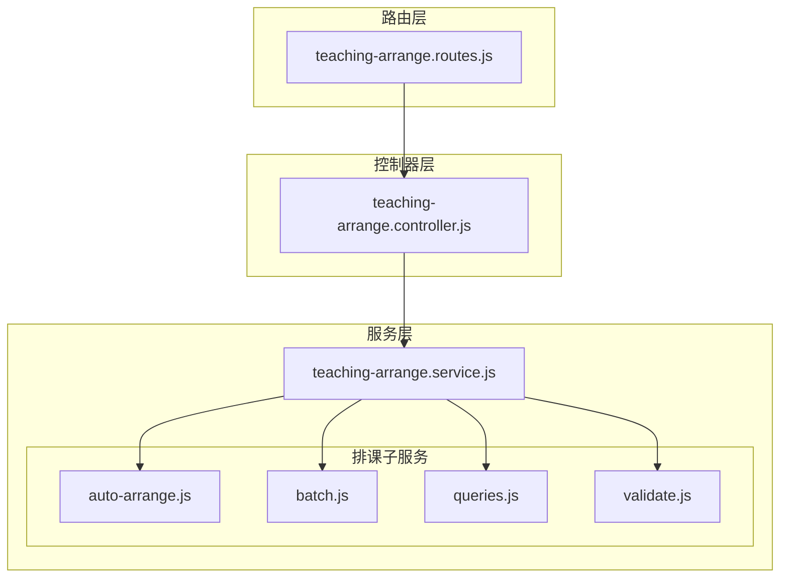
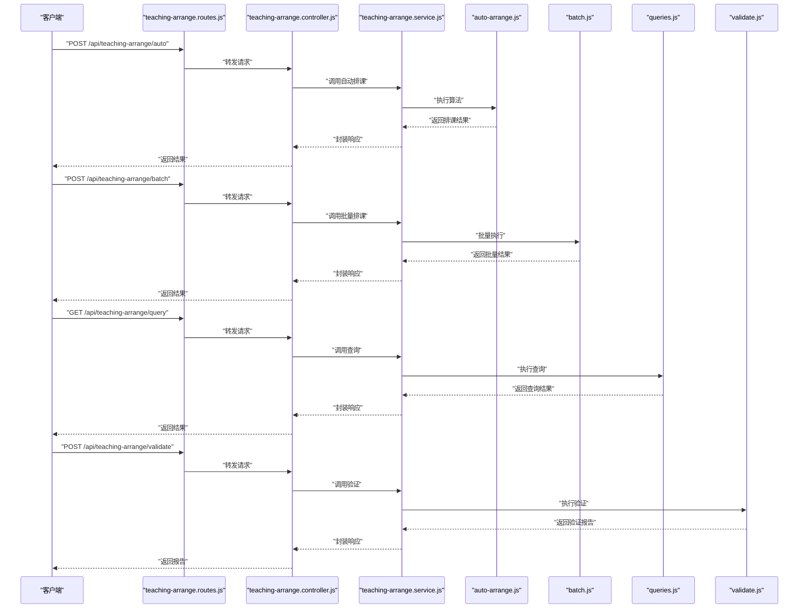
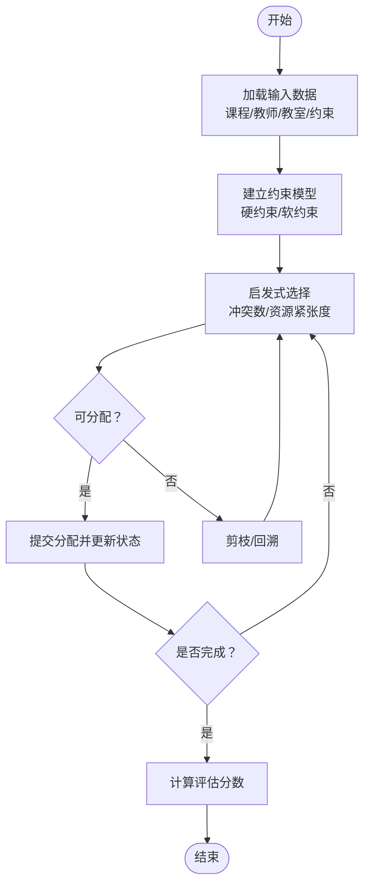
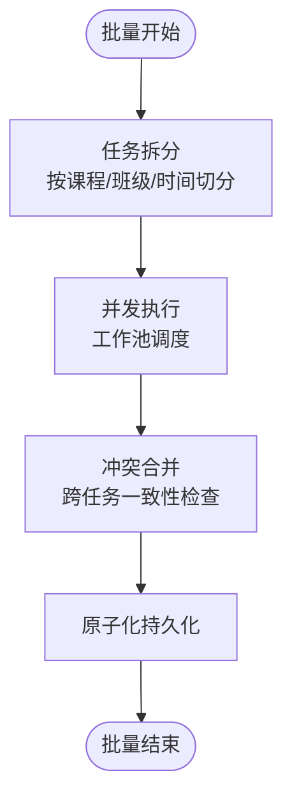
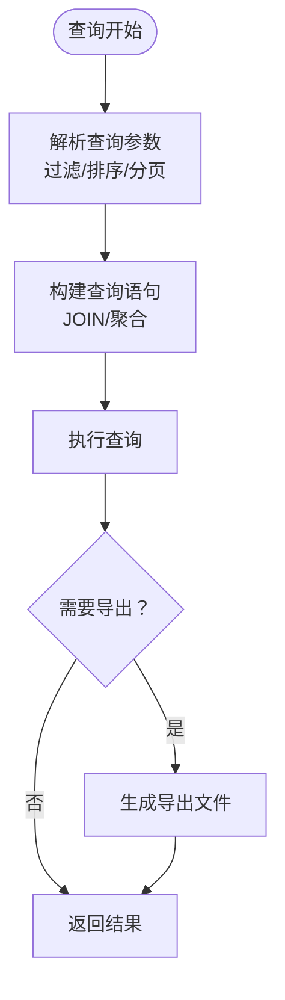
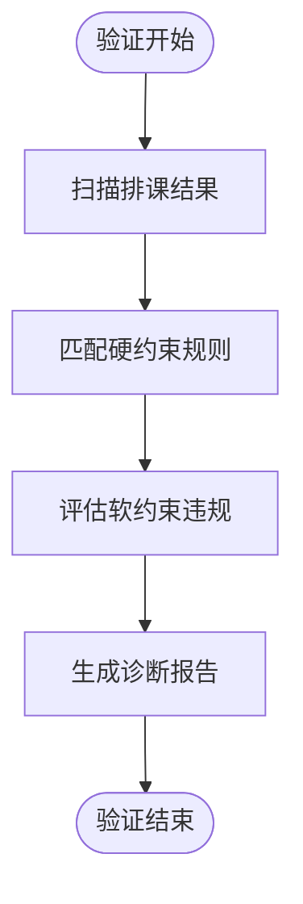
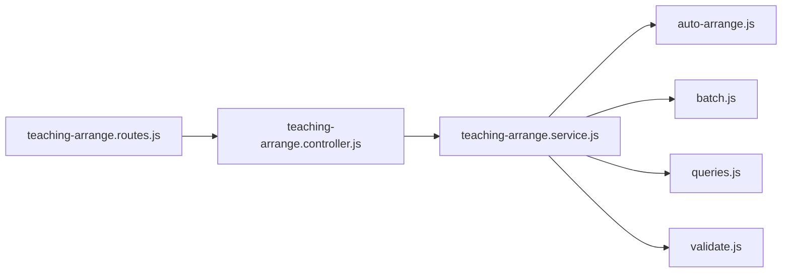

# 智能排课服务

<cite>
**本文引用的文件**
- [teaching-arrange.controller.js](file://server/src/controllers/teaching-arrange.controller.js)
- [teaching-arrange.routes.js](file://server/src/routes/teaching-arrange.routes.js)
- [auto-arrange.js](file://server/src/services/arrange/auto-arrange.js)
- [batch.js](file://server/src/services/arrange/batch.js)
- [queries.js](file://server/src/services/arrange/queries.js)
- [validate.js](file://server/src/services/arrange/validate.js)
- [teaching-arrange.service.js](file://server/src/services/teaching-arrange.service.js)
- [AUTO_ARRANGE_LOGIC_V2.md](file://docs/AUTO_ARRANGE_LOGIC_V2.md)
- [SCHEDULING_ALGORITHM_OPTIMIZATION.md](file://docs/SCHEDULING_ALGORITHM_OPTIMIZATION.md)
- [TEACHING_ARRANGE_LOGIC.md](file://docs/TEACHING_ARRANGE_LOGIC.md)
- [queries.test.js](file://server/src/services/arrange/__tests__/queries.test.js)
- [queries-eligibility.test.js](file://server/src/services/arrange/__tests__/queries-eligibility.test.js)
- [auto-arrange.test.js](file://server/src/services/arrange/__tests__/auto-arrange.test.js)
- [diagnose-and-validate.test.js](file://server/src/services/arrange/__tests__/diagnose-and-validate.test.js)
</cite>

## 目录
1. [简介](#简介)
2. [项目结构](#项目结构)
3. [核心组件](#核心组件)
4. [架构总览](#架构总览)
5. [详细组件分析](#详细组件分析)
6. [依赖关系分析](#依赖关系分析)
7. [性能考虑](#性能考虑)
8. [故障排除指南](#故障排除指南)
9. [结论](#结论)
10. [附录](#附录)

## 简介
本文件面向KEC课程管理平台的“智能排课服务”，系统性阐述自动排课算法、批量排课处理、排课查询与验证服务的实现原理与工程实践。内容覆盖排课约束条件、冲突检测机制、资源分配策略与优化算法，并提供配置参数、性能调优方法与故障排除指南，以及集成示例与自定义扩展建议。

## 项目结构
智能排课服务位于后端服务层，采用控制器-服务-工具分层组织，路由统一暴露REST接口，测试用例覆盖核心逻辑与边界场景。

**图表来源**
- [teaching-arrange.routes.js](file://server/src/routes/teaching-arrange.routes.js)
- [teaching-arrange.controller.js](file://server/src/controllers/teaching-arrange.controller.js)
- [teaching-arrange.service.js](file://server/src/services/teaching-arrange.service.js)
- [auto-arrange.js](file://server/src/services/arrange/auto-arrange.js)
- [batch.js](file://server/src/services/arrange/batch.js)
- [queries.js](file://server/src/services/arrange/queries.js)
- [validate.js](file://server/src/services/arrange/validate.js)

**章节来源**
- [teaching-arrange.routes.js](file://server/src/routes/teaching-arrange.routes.js)
- [teaching-arrange.controller.js](file://server/src/controllers/teaching-arrange.controller.js)
- [teaching-arrange.service.js](file://server/src/services/teaching-arrange.service.js)

## 核心组件
- 自动排课算法模块：负责基于约束条件与启发式策略生成可行课表，支持回溯与局部优化。
- 批量排课处理模块：对多课程、多班级或跨学期批量执行排课，保证一致性与并发安全。
- 排课查询服务：提供按条件检索、统计与导出能力，支撑排课结果可视化与审计。
- 排课验证服务：校验排课结果是否满足规则，输出诊断报告与修复建议。
- 教学安排服务：聚合上述能力，作为对外统一入口，协调事务与错误处理。

**章节来源**
- [auto-arrange.js](file://server/src/services/arrange/auto-arrange.js)
- [batch.js](file://server/src/services/arrange/batch.js)
- [queries.js](file://server/src/services/arrange/queries.js)
- [validate.js](file://server/src/services/arrange/validate.js)
- [teaching-arrange.service.js](file://server/src/services/teaching-arrange.service.js)

## 架构总览
下图展示从HTTP请求到排课执行与返回的整体流程，包括控制器接入、服务编排与各子模块协作。

**图表来源**
- [teaching-arrange.routes.js](file://server/src/routes/teaching-arrange.routes.js)
- [teaching-arrange.controller.js](file://server/src/controllers/teaching-arrange.controller.js)
- [teaching-arrange.service.js](file://server/src/services/teaching-arrange.service.js)
- [auto-arrange.js](file://server/src/services/arrange/auto-arrange.js)
- [batch.js](file://server/src/services/arrange/batch.js)
- [queries.js](file://server/src/services/arrange/queries.js)
- [validate.js](file://server/src/services/arrange/validate.js)

## 详细组件分析

### 自动排课算法模块（auto-arrange.js）
职责
- 基于课程属性、教师可用时间、教室容量与占用情况等约束，构建可行解空间。
- 使用启发式策略优先分配高冲突风险时段/教室，降低后续回溯概率。
- 支持增量重排与局部优化，提升大规模数据下的收敛速度。

关键流程
- 输入准备：收集课程、教师、教室、班级等实体及其约束。
- 约束建模：将硬约束（如时间冲突、教师冲突）与软约束（如偏好）转化为可判定的谓词。
- 启发式选择：按冲突数、资源紧张度等指标选择下一个待分配单元。
- 回溯与剪枝：在不可行分支及时回退，利用上界估计减少搜索。
- 输出：返回排课结果集与评估分数。

**图表来源**
- [auto-arrange.js](file://server/src/services/arrange/auto-arrange.js)

**章节来源**
- [auto-arrange.js](file://server/src/services/arrange/auto-arrange.js)
- [AUTO_ARRANGE_LOGIC_V2.md](file://docs/AUTO_ARRANGE_LOGIC_V2.md)
- [SCHEDULING_ALGORITHM_OPTIMIZATION.md](file://docs/SCHEDULING_ALGORITHM_OPTIMIZATION.md)

### 批量排课处理模块（batch.js）
职责
- 对多个教学任务或跨学期计划进行批量化排课，确保全局一致性。
- 并发控制与幂等设计，避免重复分配与竞态条件。
- 结果汇总与异常隔离，保障整体成功率。

关键流程
- 任务拆分：将大任务分解为可并行的小任务集合。
- 并行执行：使用队列与工作池调度各子任务，限制并发度。
- 冲突合并：在批量维度上再次校验跨任务冲突。
- 结果写入：原子化持久化排课结果，失败时回滚。

**图表来源**
- [batch.js](file://server/src/services/arrange/batch.js)

**章节来源**
- [batch.js](file://server/src/services/arrange/batch.js)

### 排课查询服务模块（queries.js）
职责
- 提供灵活的查询接口：按学期、教师、班级、教室、课程等维度过滤。
- 统计与报表：计算教室利用率、教师工作量、班级满载率等指标。
- 导出能力：支持Excel等格式导出查询结果。

关键流程
- 查询解析：将前端查询参数映射为数据库查询条件。
- 聚合计算：在SQL层面进行分组与聚合，减少应用侧开销。
- 分页与排序：支持大数据量下的高效分页与排序。

**图表来源**
- [queries.js](file://server/src/services/arrange/queries.js)

**章节来源**
- [queries.js](file://server/src/services/arrange/queries.js)
- [queries.test.js](file://server/src/services/arrange/__tests__/queries.test.js)
- [queries-eligibility.test.js](file://server/src/services/arrange/__tests__/queries-eligibility.test.js)

### 排课验证服务模块（validate.js）
职责
- 验证排课结果是否满足预设规则：时间冲突、教师超负荷、教室容量不足等。
- 生成诊断报告：定位问题单元、给出修复建议与影响范围。
- 可视化提示：将验证结果以结构化方式呈现，便于人工复核。

关键流程
- 规则扫描：遍历排课结果，逐条匹配硬约束。
- 评分与分级：对软约束违规进行打分，区分严重/一般级别。
- 报告生成：汇总问题清单、统计分布与修复成本估算。

**图表来源**
- [validate.js](file://server/src/services/arrange/validate.js)

**章节来源**
- [validate.js](file://server/src/services/arrange/validate.js)
- [diagnose-and-validate.test.js](file://server/src/services/arrange/__tests__/diagnose-and-validate.test.js)

### 教学安排服务（teaching-arrange.service.js）
职责
- 作为统一入口，编排自动排课、批量处理、查询与验证。
- 处理事务边界与错误传播，向上层控制器提供一致的响应格式。
- 协调外部依赖（如缓存、日志、审计），保证可观测性与可追溯性。

**章节来源**
- [teaching-arrange.service.js](file://server/src/services/teaching-arrange.service.js)

### 控制器与路由（teaching-arrange.controller.js、teaching-arrange.routes.js）
职责
- 路由定义：声明自动排课、批量排课、查询、验证等接口。
- 控制器：接收请求参数，调用服务层，封装响应与错误。

**章节来源**
- [teaching-arrange.routes.js](file://server/src/routes/teaching-arrange.routes.js)
- [teaching-arrange.controller.js](file://server/src/controllers/teaching-arrange.controller.js)

## 依赖关系分析
- 路由层仅做参数转发，不承载业务逻辑，降低耦合。
- 控制器依赖服务层，服务层聚合各子模块，形成清晰的职责边界。
- 子模块之间低耦合，通过服务层统一编排，便于替换与扩展。

**图表来源**
- [teaching-arrange.routes.js](file://server/src/routes/teaching-arrange.routes.js)
- [teaching-arrange.controller.js](file://server/src/controllers/teaching-arrange.controller.js)
- [teaching-arrange.service.js](file://server/src/services/teaching-arrange.service.js)
- [auto-arrange.js](file://server/src/services/arrange/auto-arrange.js)
- [batch.js](file://server/src/services/arrange/batch.js)
- [queries.js](file://server/src/services/arrange/queries.js)
- [validate.js](file://server/src/services/arrange/validate.js)

## 性能考虑
- 算法层面
  - 启发式优先级：优先处理高冲突风险单元，缩短搜索深度。
  - 剪枝策略：基于上界估计与冲突传播快速剪枝。
  - 局部优化：在可行解基础上进行邻域搜索，提升质量。
- 数据访问
  - 合理索引：对常用过滤字段（如学期、教师、教室）建立复合索引。
  - 聚合下推：尽量在数据库层完成分组与聚合，减少网络与序列化开销。
- 并发与批处理
  - 批量执行：将小任务合并，降低事务开销与上下文切换。
  - 并发限流：根据CPU/IO瓶颈动态调整并发度。
- 缓存与日志
  - 结果缓存：对稳定查询与统计结果进行缓存，定期失效刷新。
  - 结构化日志：记录关键路径耗时与失败原因，便于定位热点。

**章节来源**
- [SCHEDULING_ALGORITHM_OPTIMIZATION.md](file://docs/SCHEDULING_ALGORITHM_OPTIMIZATION.md)
- [AUTO_ARRANGE_LOGIC_V2.md](file://docs/AUTO_ARRANGE_LOGIC_V2.md)

## 故障排除指南
常见问题与排查步骤
- 排课无解或解质量差
  - 检查硬约束是否过于严格；适当放宽软约束权重。
  - 查看验证报告中的高频冲突点，调整资源分配策略。
- 批量排课失败
  - 关注并发冲突与死锁迹象，降低并发度或引入重试。
  - 校验输入数据一致性，避免脏数据导致部分失败。
- 查询性能劣化
  - 审核索引使用情况，补充缺失索引。
  - 将复杂聚合迁移到数据库层，减少应用侧计算。
- 接口超时
  - 优化算法参数（如最大迭代步数、剪枝阈值）。
  - 引入异步批处理与进度上报，避免长阻塞请求。

**章节来源**
- [diagnose-and-validate.test.js](file://server/src/services/arrange/__tests__/diagnose-and-validate.test.js)
- [queries.test.js](file://server/src/services/arrange/__tests__/queries.test.js)

## 结论
智能排课服务通过清晰的分层设计与模块化实现，实现了从算法到服务的全链路闭环。结合完善的验证与查询能力，能够满足高校复杂排课场景的需求。建议在生产环境中持续优化算法参数、完善监控与缓存策略，并通过测试用例保障功能稳定性。

## 附录

### 排课约束条件与规则
- 硬约束
  - 时间冲突：同一教师/教室在同一时间段不可同时被占用。
  - 教室容量：课程人数不得超出教室容量。
  - 教师状态：教师需处于有效聘用状态且未被锁定。
- 软约束
  - 教师偏好：尽量满足教师期望的上课时段。
  - 教室偏好：优先分配教师熟悉的教室。
  - 连堂与间隔：合理安排连堂与课间休息，避免过度集中。

**章节来源**
- [validate.js](file://server/src/services/arrange/validate.js)
- [TEACHING_ARRANGE_LOGIC.md](file://docs/TEACHING_ARRANGE_LOGIC.md)

### 排课服务配置参数（示例）
- 算法参数
  - 最大迭代步数：控制回溯深度上限。
  - 剪枝阈值：用于快速剪枝的冲突门限。
  - 启发式权重：软约束的相对重要性系数。
- 并发参数
  - 并发度：批量任务的最大并发线程数。
  - 重试次数：失败任务的自动重试次数。
- 缓存参数
  - 缓存有效期：查询结果与统计缓存的过期时间。
  - 缓存键前缀：区分不同学期或校区的数据缓存。

**章节来源**
- [SCHEDULING_ALGORITHM_OPTIMIZATION.md](file://docs/SCHEDULING_ALGORITHM_OPTIMIZATION.md)

### 集成示例与扩展方案
- 集成示例
  - 自动排课：调用“自动排课”接口，传入学期与课程列表，接收排课结果。
  - 批量排课：调用“批量排课”接口，传入批量任务描述，接收执行进度与最终结果。
  - 查询与导出：调用“查询”接口，传入过滤条件，支持导出Excel。
  - 验证与修复：调用“验证”接口，获取诊断报告，按建议进行修复后重新验证。
- 扩展方案
  - 新增约束：在验证模块中扩展规则引擎，支持自定义硬/软约束。
  - 算法插件化：将不同启发式策略封装为插件，按场景动态切换。
  - 多目标优化：引入多目标优化框架，平衡教师满意度、教室利用率等指标。

**章节来源**
- [teaching-arrange.controller.js](file://server/src/controllers/teaching-arrange.controller.js)
- [teaching-arrange.routes.js](file://server/src/routes/teaching-arrange.routes.js)
- [auto-arrange.js](file://server/src/services/arrange/auto-arrange.js)
- [batch.js](file://server/src/services/arrange/batch.js)
- [queries.js](file://server/src/services/arrange/queries.js)
- [validate.js](file://server/src/services/arrange/validate.js)