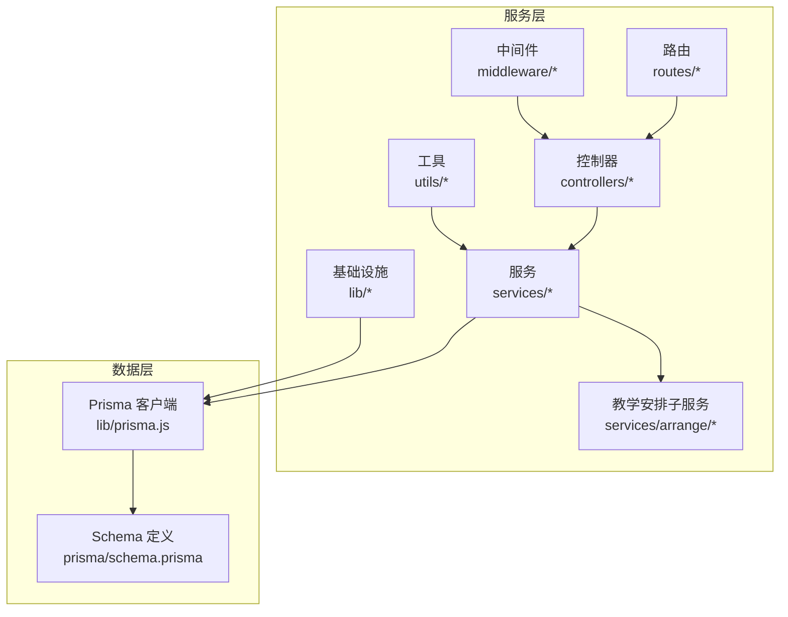
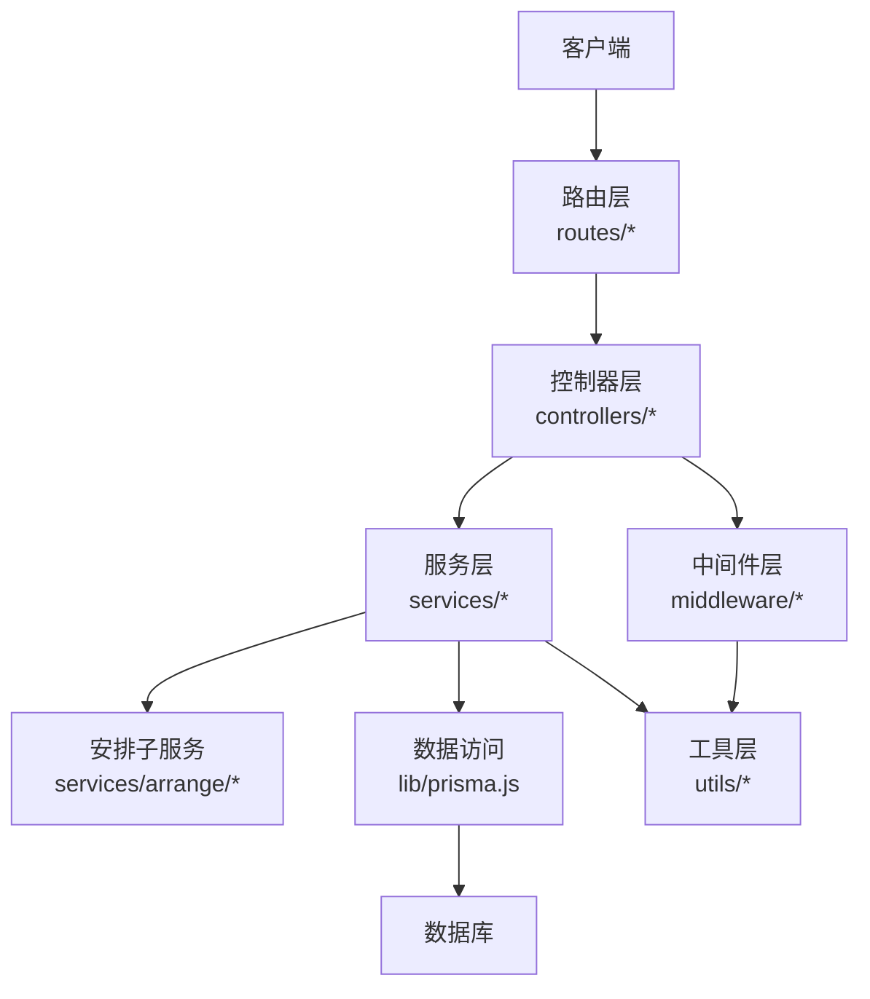
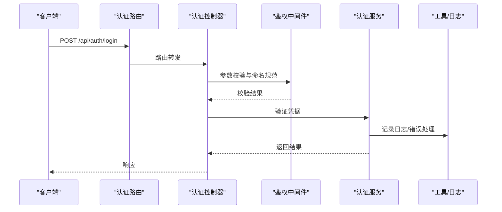
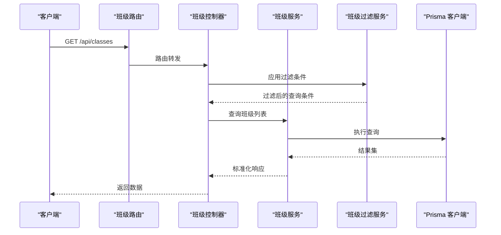
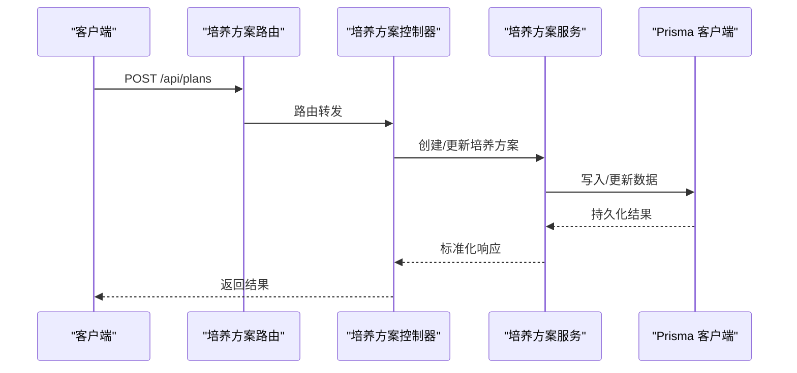
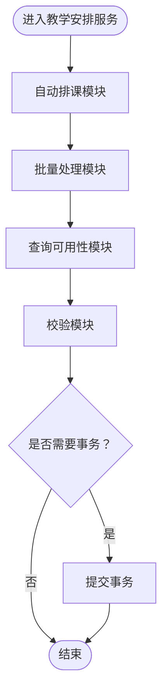
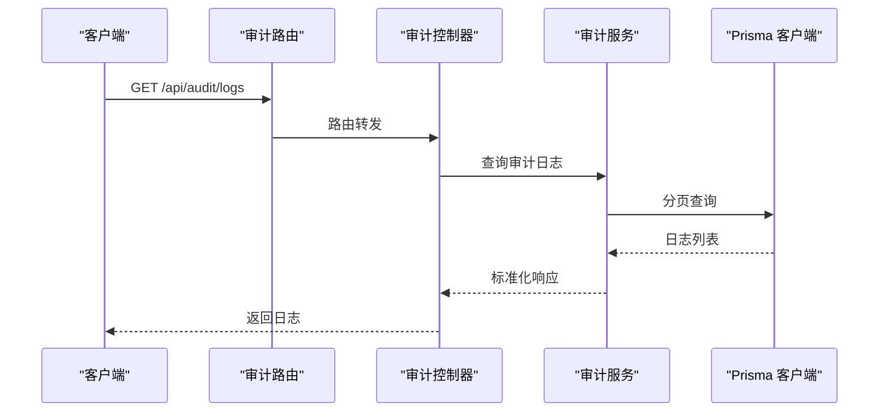
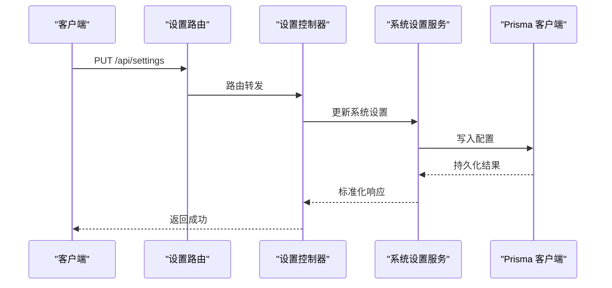
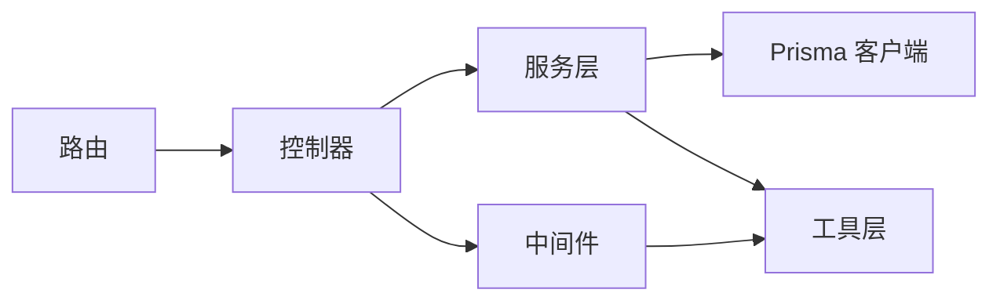

# 服务层架构

<cite>
**本文档引用的文件**
- [app.js](file://server/src/app.js)
- [server.js](file://server/src/server.js)
- [prisma.js](file://server/src/lib/prisma.js)
- [auth.service.js](file://server/src/services/auth.service.js)
- [audit.service.js](file://server/src/services/audit.service.js)
- [class.service.js](file://server/src/services/class.service.js)
- [plan.service.js](file://server/src/services/plan.service.js)
- [settings.service.js](file://server/src/services/settings.service.js)
- [teaching-arrange.service.js](file://server/src/services/teaching-arrange.service.js)
- [class-filter.service.js](file://server/src/services/class-filter.service.js)
- [auto-arrange.js](file://server/src/services/arrange/auto-arrange.js)
- [batch.js](file://server/src/services/arrange/batch.js)
- [queries.js](file://server/src/services/arrange/queries.js)
- [validate.js](file://server/src/services/arrange/validate.js)
- [auth.controller.js](file://server/src/controllers/auth.controller.js)
- [class.controller.js](file://server/src/controllers/class.controller.js)
- [plan.controller.js](file://server/src/controllers/plan.controller.js)
- [teaching-arrange.controller.js](file://server/src/controllers/teaching-arrange.controller.js)
- [audit.controller.js](file://server/src/controllers/audit.controller.js)
- [settings.controller.js](file://server/src/controllers/settings.controller.js)
- [auth.routes.js](file://server/src/routes/auth.routes.js)
- [class.routes.js](file://server/src/routes/class.routes.js)
- [plan.routes.js](file://server/src/routes/plan.routes.js)
- [teaching-arrange.routes.js](file://server/src/routes/teaching-arrange.routes.js)
- [audit.routes.js](file://server/src/routes/audit.routes.js)
- [settings.routes.js](file://server/src/routes/settings.routes.js)
- [auth.middleware.js](file://server/src/middleware/auth.middleware.js)
- [validation.js](file://server/src/middleware/validation.js)
- [error.middleware.js](file://server/src/middleware/error.js)
- [logger.js](file://server/src/utils/logger.js)
- [response.js](file://server/src/utils/response.js)
- [error.util.js](file://server/src/utils/error.js)
- [naming.middleware.js](file://server/src/middleware/naming.middleware.js)
- [pagination.js](file://server/src/middleware/pagination.js)
- [excel.util.js](file://server/src/utils/excel.js)
- [schema.prisma](file://server/prisma/schema.prisma)
- [vitest.config.js](file://server/vitest.config.js)
- [vitest.setup.js](file://server/vitest.setup.js)
</cite>

## 目录
1. [引言](#引言)
2. [项目结构](#项目结构)
3. [核心组件](#核心组件)
4. [架构总览](#架构总览)
5. [详细组件分析](#详细组件分析)
6. [依赖关系分析](#依赖关系分析)
7. [性能考虑](#性能考虑)
8. [故障排除指南](#故障排除指南)
9. [结论](#结论)
10. [附录](#附录)

## 引言
本文件系统性阐述 KECAPI 服务层的架构设计与实现要点，聚焦于业务逻辑封装、数据处理、事务管理、外部服务集成、依赖注入与错误传播策略，并覆盖班级、培养方案、教学安排等核心业务模块的服务实现。同时提供开发最佳实践、单元测试策略与性能优化建议，帮助开发者高效理解与维护服务层。

## 项目结构
服务层位于后端工程 server/src 下，采用按功能域分层组织：controllers（控制器）、routes（路由）、services（服务）、lib（基础设施）、utils（工具）与 middleware（中间件）。服务层通过控制器暴露接口，经由中间件进行鉴权、参数校验与错误处理，最终调用 Prisma 数据访问层完成数据库操作。

图表来源
- [app.js](file://server/src/app.js)
- [prisma.js](file://server/src/lib/prisma.js)
- [schema.prisma](file://server/prisma/schema.prisma)

章节来源
- [app.js](file://server/src/app.js)
- [server.js](file://server/src/server.js)

## 核心组件
服务层围绕以下核心职责展开：
- 业务逻辑封装：将领域规则与流程抽象为可复用的服务方法，避免控制器膨胀。
- 数据处理与转换：统一输入输出格式、字段命名规范、分页排序与Excel导入导出。
- 事务管理：对涉及多表或跨模块的复杂写入操作进行事务包裹，确保一致性。
- 外部服务集成：对接第三方系统或本地脚本，如审计日志、报表生成等。
- 错误传播与标准化：通过中间件与工具函数统一异常处理与响应格式。

章节来源
- [auth.service.js](file://server/src/services/auth.service.js)
- [audit.service.js](file://server/src/services/audit.service.js)
- [class.service.js](file://server/src/services/class.service.js)
- [plan.service.js](file://server/src/services/plan.service.js)
- [settings.service.js](file://server/src/services/settings.service.js)
- [teaching-arrange.service.js](file://server/src/services/teaching-arrange.service.js)
- [class-filter.service.js](file://server/src/services/class-filter.service.js)
- [auto-arrange.js](file://server/src/services/arrange/auto-arrange.js)
- [batch.js](file://server/src/services/arrange/batch.js)
- [queries.js](file://server/src/services/arrange/queries.js)
- [validate.js](file://server/src/services/arrange/validate.js)

## 架构总览
服务层采用“控制器-服务-数据访问”的清晰分层，配合中间件实现横切关注点（鉴权、校验、日志、错误处理），并通过路由模块化暴露 REST 接口。

图表来源
- [auth.routes.js](file://server/src/routes/auth.routes.js)
- [class.routes.js](file://server/src/routes/class.routes.js)
- [plan.routes.js](file://server/src/routes/plan.routes.js)
- [teaching-arrange.routes.js](file://server/src/routes/teaching-arrange.routes.js)
- [audit.routes.js](file://server/src/routes/audit.routes.js)
- [settings.routes.js](file://server/src/routes/settings.routes.js)
- [auth.controller.js](file://server/src/controllers/auth.controller.js)
- [class.controller.js](file://server/src/controllers/class.controller.js)
- [plan.controller.js](file://server/src/controllers/plan.controller.js)
- [teaching-arrange.controller.js](file://server/src/controllers/teaching-arrange.controller.js)
- [audit.controller.js](file://server/src/controllers/audit.controller.js)
- [settings.controller.js](file://server/src/controllers/settings.controller.js)
- [auth.middleware.js](file://server/src/middleware/auth.middleware.js)
- [validation.js](file://server/src/middleware/validation.js)
- [error.middleware.js](file://server/src/middleware/error.js)
- [prisma.js](file://server/src/lib/prisma.js)

## 详细组件分析

### 认证服务（AuthService）
职责：用户登录、令牌签发与校验、密码处理、会话管理。
设计要点：
- 使用中间件进行请求参数校验与XSS防护。
- 通过服务层封装鉴权逻辑，控制器仅负责参数传递与响应包装。
- 统一错误处理与日志记录。

图表来源
- [auth.routes.js](file://server/src/routes/auth.routes.js)
- [auth.controller.js](file://server/src/controllers/auth.controller.js)
- [auth.middleware.js](file://server/src/middleware/auth.middleware.js)
- [auth.service.js](file://server/src/services/auth.service.js)
- [logger.js](file://server/src/utils/logger.js)
- [error.util.js](file://server/src/utils/error.js)

章节来源
- [auth.service.js](file://server/src/services/auth.service.js)
- [auth.controller.js](file://server/src/controllers/auth.controller.js)
- [auth.middleware.js](file://server/src/middleware/auth.middleware.js)
- [validation.js](file://server/src/middleware/validation.js)

### 班级服务（ClassService）
职责：班级增删改查、批量导入、过滤查询、与培养方案关联。
设计要点：
- 提供过滤服务以支持复杂查询条件组合。
- 导入流程通过中间件与服务层协作，保证数据一致性。
- 对外提供标准化响应与错误码。

图表来源
- [class.routes.js](file://server/src/routes/class.routes.js)
- [class.controller.js](file://server/src/controllers/class.controller.js)
- [class.service.js](file://server/src/services/class.service.js)
- [class-filter.service.js](file://server/src/services/class-filter.service.js)
- [prisma.js](file://server/src/lib/prisma.js)

章节来源
- [class.service.js](file://server/src/services/class.service.js)
- [class-filter.service.js](file://server/src/services/class-filter.service.js)
- [class.controller.js](file://server/src/controllers/class.controller.js)

### 培养方案服务（PlanService）
职责：培养方案的创建、更新、删除、矩阵计算与查询。
设计要点：
- 与教学安排服务协同，确保培养方案变更影响到后续排课。
- 支持矩阵维度的查询与统计。

图表来源
- [plan.routes.js](file://server/src/routes/plan.routes.js)
- [plan.controller.js](file://server/src/controllers/plan.controller.js)
- [plan.service.js](file://server/src/services/plan.service.js)
- [prisma.js](file://server/src/lib/prisma.js)

章节来源
- [plan.service.js](file://server/src/services/plan.service.js)
- [plan.controller.js](file://server/src/controllers/plan.controller.js)

### 教学安排服务（TeachingArrangeService）
职责：自动排课、批量安排、诊断与验证、查询可用性。
设计要点：
- 子模块划分清晰：自动排课、批量处理、查询与校验。
- 事务管理用于保证多步操作的一致性。
- 与培养方案服务紧密耦合，确保排课基于最新培养方案。

图表来源
- [teaching-arrange.service.js](file://server/src/services/teaching-arrange.service.js)
- [auto-arrange.js](file://server/src/services/arrange/auto-arrange.js)
- [batch.js](file://server/src/services/arrange/batch.js)
- [queries.js](file://server/src/services/arrange/queries.js)
- [validate.js](file://server/src/services/arrange/validate.js)

章节来源
- [teaching-arrange.service.js](file://server/src/services/teaching-arrange.service.js)
- [auto-arrange.js](file://server/src/services/arrange/auto-arrange.js)
- [batch.js](file://server/src/services/arrange/batch.js)
- [queries.js](file://server/src/services/arrange/queries.js)
- [validate.js](file://server/src/services/arrange/validate.js)

### 审计服务（AuditService）
职责：记录系统关键操作、查询审计日志、导出审计报表。
设计要点：
- 与控制器解耦，通过服务层统一记录与查询。
- 支持分页与筛选，便于大规模审计数据检索。

图表来源
- [audit.routes.js](file://server/src/routes/audit.routes.js)
- [audit.controller.js](file://server/src/controllers/audit.controller.js)
- [audit.service.js](file://server/src/services/audit.service.js)
- [prisma.js](file://server/src/lib/prisma.js)

章节来源
- [audit.service.js](file://server/src/services/audit.service.js)
- [audit.controller.js](file://server/src/controllers/audit.controller.js)

### 系统设置服务（SettingsService）
职责：系统参数配置、学期配置、重置与初始化。
设计要点：
- 通过控制器暴露配置接口，服务层负责持久化与一致性保障。
- 支持配置项的原子性更新与回滚。

图表来源
- [settings.routes.js](file://server/src/routes/settings.routes.js)
- [settings.controller.js](file://server/src/controllers/settings.controller.js)
- [settings.service.js](file://server/src/services/settings.service.js)
- [prisma.js](file://server/src/lib/prisma.js)

章节来源
- [settings.service.js](file://server/src/services/settings.service.js)
- [settings.controller.js](file://server/src/controllers/settings.controller.js)

## 依赖关系分析
服务层内部依赖关系与外部依赖如下：
- 服务层依赖 Prisma 客户端进行数据访问。
- 控制器依赖服务层执行业务逻辑。
- 中间件在控制器与服务层之间提供横切能力（鉴权、校验、分页、命名规范、错误处理）。
- 工具层提供日志、响应封装、错误处理与Excel处理等通用能力。

图表来源
- [app.js](file://server/src/app.js)
- [prisma.js](file://server/src/lib/prisma.js)
- [logger.js](file://server/src/utils/logger.js)
- [response.js](file://server/src/utils/response.js)
- [error.util.js](file://server/src/utils/error.js)
- [auth.middleware.js](file://server/src/middleware/auth.middleware.js)
- [validation.js](file://server/src/middleware/validation.js)
- [pagination.js](file://server/src/middleware/pagination.js)
- [naming.middleware.js](file://server/src/middleware/naming.middleware.js)
- [error.middleware.js](file://server/src/middleware/error.js)

章节来源
- [app.js](file://server/src/app.js)
- [prisma.js](file://server/src/lib/prisma.js)
- [logger.js](file://server/src/utils/logger.js)
- [response.js](file://server/src/utils/response.js)
- [error.util.js](file://server/src/utils/error.js)
- [auth.middleware.js](file://server/src/middleware/auth.middleware.js)
- [validation.js](file://server/src/middleware/validation.js)
- [pagination.js](file://server/src/middleware/pagination.js)
- [naming.middleware.js](file://server/src/middleware/naming.middleware.js)
- [error.middleware.js](file://server/src/middleware/error.js)

## 性能考虑
- 数据库索引与查询优化：根据 Prisma Schema 的索引定义，合理使用复合索引与唯一约束，减少全表扫描。
- 分页与排序：在控制器中统一使用分页中间件，避免一次性返回大量数据。
- 缓存策略：对高频只读配置与静态数据引入缓存，降低数据库压力。
- 批量操作：教学安排的批量处理模块应合并多次写入为单次事务，减少往返开销。
- 日志与监控：通过日志工具记录慢查询与异常，结合中间件统一错误处理，避免性能瓶颈放大。

## 故障排除指南
- 错误处理：中间件统一捕获异常并返回标准化响应；工具层提供错误码与消息映射。
- 日志定位：使用日志工具记录关键路径与异常堆栈，便于快速定位问题。
- 参数校验：在控制器前通过校验中间件拦截非法输入，减少无效调用。
- 事务回滚：对涉及多步骤的写入操作使用事务，失败时回滚以保持一致性。

章节来源
- [error.middleware.js](file://server/src/middleware/error.js)
- [error.util.js](file://server/src/utils/error.js)
- [logger.js](file://server/src/utils/logger.js)
- [validation.js](file://server/src/middleware/validation.js)

## 结论
服务层通过清晰的职责划分与模块化设计，有效封装了业务逻辑并提供了稳定的对外接口。借助中间件与工具层的横切能力，实现了鉴权、校验、日志与错误处理的统一；通过 Prisma 客户端与事务管理，保障了数据一致性与性能。建议在后续迭代中持续完善单元测试覆盖与性能监控，确保服务层的稳定性与可维护性。

## 附录
- 单元测试策略：使用 Vitest 配置与全局设置，针对服务层关键方法编写单元测试，覆盖正常路径与边界条件；对涉及数据库的操作使用隔离测试环境。
- 开发最佳实践：遵循单一职责原则，尽量无状态服务；对敏感操作增加审计日志；对批量操作使用事务；对外接口保持幂等性与版本化。

章节来源
- [vitest.config.js](file://server/vitest.config.js)
- [vitest.setup.js](file://server/vitest.setup.js)