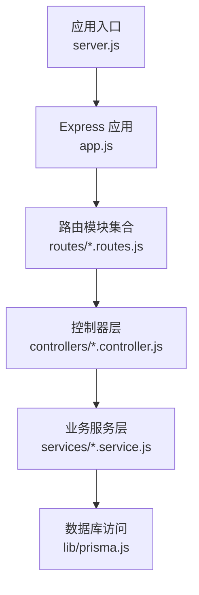
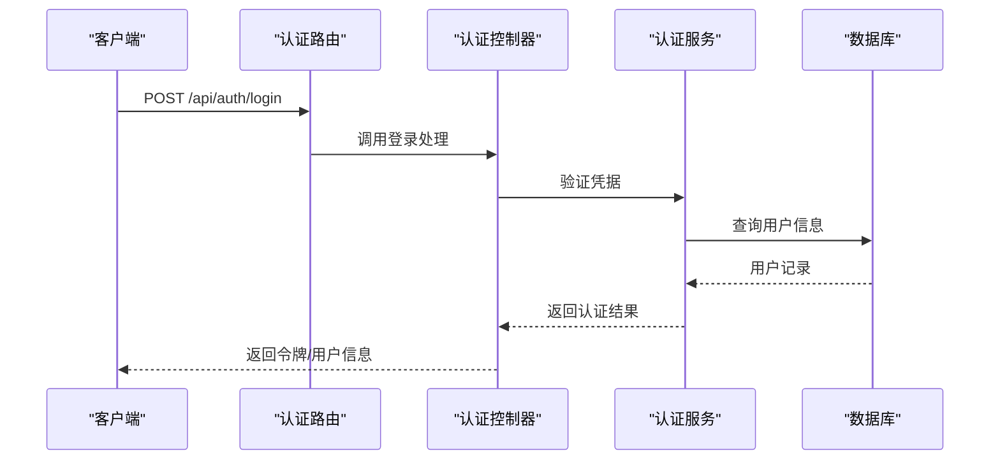

# 路由系统设计

<cite>
**本文档引用的文件**
- [app.js](file://server/src/app.js)
- [server.js](file://server/src/server.js)
- [auth.routes.js](file://server/src/routes/auth.routes.js)
- [user.routes.js](file://server/src/routes/user.routes.js)
- [course.routes.js](file://server/src/routes/course.routes.js)
- [teacher.routes.js](file://server/src/routes/teacher.routes.js)
- [class.routes.js](file://server/src/routes/class.routes.js)
- [college.routes.js](file://server/src/routes/college.routes.js)
- [major.routes.js](file://server/src/routes/major.routes.js)
- [plan.routes.js](file://server/src/routes/plan.routes.js)
- [textbook.routes.js](file://server/src/routes/textbook.routes.js)
- [teaching-arrange.routes.js](file://server/src/routes/teaching-arrange.routes.js)
- [audit.routes.js](file://server/src/routes/audit.routes.js)
- [dashboard.routes.js](file://server/src/routes/dashboard.routes.js)
- [settings.routes.js](file://server/src/routes/settings.routes.js)
- [export.routes.js](file://server/src/routes/export.routes.js)
- [import.routes.js](file://server/src/routes/import.routes.js)
- [query.routes.js](file://server/src/routes/query.routes.js)
- [trainingLevel.routes.js](file://server/src/routes/trainingLevel.routes.js)
- [auth.middleware.js](file://server/src/middleware/auth.middleware.js)
- [validation.middleware.js](file://server/src/middleware/validation.js)
- [pagination.middleware.js](file://server/src/middleware/pagination.js)
- [naming.middleware.js](file://server/src/middleware/naming.middleware.js)
- [error.middleware.js](file://server/src/middleware/error.js)
- [xss.middleware.js](file://server/src/middleware/xss.js)
- [auth.controller.js](file://server/src/controllers/auth.controller.js)
- [user.controller.js](file://server/src/controllers/user.controller.js)
- [course.controller.js](file://server/src/controllers/course.controller.js)
- [teacher.controller.js](file://server/src/controllers/teacher.controller.js)
- [class.controller.js](file://server/src/controllers/class.controller.js)
- [college.controller.js](file://server/src/controllers/college.controller.js)
- [major.controller.js](file://server/src/controllers/major.controller.js)
- [plan.controller.js](file://server/src/controllers/plan.controller.js)
- [textbook.controller.js](file://server/src/controllers/textbook.controller.js)
- [teaching-arrange.controller.js](file://server/src/controllers/teaching-arrange.controller.js)
- [audit.controller.js](file://server/src/controllers/audit.controller.js)
- [dashboard.controller.js](file://server/src/controllers/dashboard.controller.js)
- [settings.controller.js](file://server/src/controllers/settings.controller.js)
- [export.controller.js](file://server/src/controllers/export.controller.js)
- [import.controller.js](file://server/src/controllers/import.controller.js)
- [query.controller.js](file://server/src/controllers/query.controller.js)
- [trainingLevel.controller.js](file://server/src/controllers/trainingLevel.controller.js)
</cite>

## 目录
1. [引言](#引言)
2. [项目结构](#项目结构)
3. [核心组件](#核心组件)
4. [架构总览](#架构总览)
5. [详细组件分析](#详细组件分析)
6. [依赖关系分析](#依赖关系分析)
7. [性能考虑](#性能考虑)
8. [故障排除指南](#故障排除指南)
9. [结论](#结论)

## 引言
本文件面向KEC课程管理平台的后端路由系统，基于Express框架实现，采用模块化路由组织方式，覆盖用户管理、课程管理、教师管理、班级管理、学院与专业管理、培养方案、教材管理、教学安排、审计日志、仪表盘、系统设置、导入导出、查询统计等业务模块。文档重点阐述RESTful API设计原则、URL路径规范、HTTP方法映射、路由参数与查询字符串处理、路由中间件体系，以及最佳实践与可维护性建议。

## 项目结构
后端采用分层架构：routes（路由定义）→ controllers（控制器）→ services（业务服务）→ 数据库访问。路由文件按功能域划分，每个模块拥有独立的路由文件与控制器，便于扩展与维护。

图表来源
- [server.js](file://server/src/server.js)
- [app.js](file://server/src/app.js)
- [auth.routes.js](file://server/src/routes/auth.routes.js)
- [user.routes.js](file://server/src/routes/user.routes.js)

章节来源
- [server.js](file://server/src/server.js)
- [app.js](file://server/src/app.js)

## 核心组件
- 路由模块：每个业务域一个路由文件，统一在应用入口注册，形成清晰的模块边界。
- 控制器：负责请求参数解析、调用服务层并返回响应。
- 中间件：认证、参数校验、分页、命名规范、XSS防护、错误处理等。
- 服务层：封装具体业务逻辑，保证控制器薄化与可测试性。

章节来源
- [auth.routes.js](file://server/src/routes/auth.routes.js)
- [user.routes.js](file://server/src/routes/user.routes.js)
- [auth.controller.js](file://server/src/controllers/auth.controller.js)
- [auth.middleware.js](file://server/src/middleware/auth.middleware.js)

## 架构总览
路由系统通过Express Router组织，每个模块路由文件定义该模块的HTTP端点、参数与校验规则，并绑定到对应的控制器方法。中间件贯穿请求生命周期，确保安全、数据规范化与错误统一处理。

```mermaid
graph TB
subgraph "路由层"
R1["auth.routes.js"]
R2["user.routes.js"]
R3["course.routes.js"]
R4["teacher.routes.js"]
R5["class.routes.js"]
R6["college.routes.js"]
R7["major.routes.js"]
R8["plan.routes.js"]
R9["textbook.routes.js"]
R10["teaching-arrange.routes.js"]
R11["audit.routes.js"]
R12["dashboard.routes.js"]
R13["settings.routes.js"]
R14["export.routes.js"]
R15["import.routes.js"]
R16["query.routes.js"]
R17["trainingLevel.routes.js"]
end
subgraph "控制器层"
C1["auth.controller.js"]
C2["user.controller.js"]
C3["course.controller.js"]
C4["teacher.controller.js"]
C5["class.controller.js"]
C6["college.controller.js"]
C7["major.controller.js"]
C8["plan.controller.js"]
C9["textbook.controller.js"]
C10["teaching-arrange.controller.js"]
C11["audit.controller.js"]
C12["dashboard.controller.js"]
C13["settings.controller.js"]
C14["export.controller.js"]
C15["import.controller.js"]
C16["query.controller.js"]
C17["trainingLevel.controller.js"]
end
subgraph "中间件层"
M1["auth.middleware.js"]
M2["validation.js"]
M3["pagination.js"]
M4["naming.middleware.js"]
M5["xss.js"]
M6["error.js"]
end
R1 --> C1
R2 --> C2
R3 --> C3
R4 --> C4
R5 --> C5
R6 --> C6
R7 --> C7
R8 --> C8
R9 --> C9
R10 --> C10
R11 --> C11
R12 --> C12
R13 --> C13
R14 --> C14
R15 --> C15
R16 --> C16
R17 --> C17
R1 -. 使用 .-> M1
R2 -. 使用 .-> M2
R3 -. 使用 .-> M3
R4 -. 使用 .-> M4
R5 -. 使用 .-> M5
R6 -. 使用 .-> M6
```

图表来源
- [auth.routes.js](file://server/src/routes/auth.routes.js)
- [user.routes.js](file://server/src/routes/user.routes.js)
- [course.routes.js](file://server/src/routes/course.routes.js)
- [teacher.routes.js](file://server/src/routes/teacher.routes.js)
- [class.routes.js](file://server/src/routes/class.routes.js)
- [college.routes.js](file://server/src/routes/college.routes.js)
- [major.routes.js](file://server/src/routes/major.routes.js)
- [plan.routes.js](file://server/src/routes/plan.routes.js)
- [textbook.routes.js](file://server/src/routes/textbook.routes.js)
- [teaching-arrange.routes.js](file://server/src/routes/teaching-arrange.routes.js)
- [audit.routes.js](file://server/src/routes/audit.routes.js)
- [dashboard.routes.js](file://server/src/routes/dashboard.routes.js)
- [settings.routes.js](file://server/src/routes/settings.routes.js)
- [export.routes.js](file://server/src/routes/export.routes.js)
- [import.routes.js](file://server/src/routes/import.routes.js)
- [query.routes.js](file://server/src/routes/query.routes.js)
- [trainingLevel.routes.js](file://server/src/routes/trainingLevel.routes.js)
- [auth.controller.js](file://server/src/controllers/auth.controller.js)
- [user.controller.js](file://server/src/controllers/user.controller.js)
- [course.controller.js](file://server/src/controllers/course.controller.js)
- [teacher.controller.js](file://server/src/controllers/teacher.controller.js)
- [class.controller.js](file://server/src/controllers/class.controller.js)
- [college.controller.js](file://server/src/controllers/college.controller.js)
- [major.controller.js](file://server/src/controllers/major.controller.js)
- [plan.controller.js](file://server/src/controllers/plan.controller.js)
- [textbook.controller.js](file://server/src/controllers/textbook.controller.js)
- [teaching-arrange.controller.js](file://server/src/controllers/teaching-arrange.controller.js)
- [audit.controller.js](file://server/src/controllers/audit.controller.js)
- [dashboard.controller.js](file://server/src/controllers/dashboard.controller.js)
- [settings.controller.js](file://server/src/controllers/settings.controller.js)
- [export.controller.js](file://server/src/controllers/export.controller.js)
- [import.controller.js](file://server/src/controllers/import.controller.js)
- [query.controller.js](file://server/src/controllers/query.controller.js)
- [trainingLevel.controller.js](file://server/src/controllers/trainingLevel.controller.js)
- [auth.middleware.js](file://server/src/middleware/auth.middleware.js)
- [validation.middleware.js](file://server/src/middleware/validation.js)
- [pagination.middleware.js](file://server/src/middleware/pagination.js)
- [naming.middleware.js](file://server/src/middleware/naming.middleware.js)
- [xss.middleware.js](file://server/src/middleware/xss.js)
- [error.middleware.js](file://server/src/middleware/error.js)

## 详细组件分析

### 认证与授权路由（auth.routes.js）
- 设计原则：遵循REST语义，使用名词复数形式；登录、登出、令牌刷新等端点使用动词短语。
- URL规范：统一前缀/接口名/资源标识符，避免过深嵌套。
- HTTP方法映射：POST用于登录，DELETE用于登出，GET用于令牌验证或信息获取。
- 参数处理：请求体参数进行严格校验，查询参数用于筛选与排序。
- 中间件：鉴权中间件保护受保护端点，校验中间件确保输入合法。

图表来源
- [auth.routes.js](file://server/src/routes/auth.routes.js)
- [auth.controller.js](file://server/src/controllers/auth.controller.js)
- [auth.middleware.js](file://server/src/middleware/auth.middleware.js)

章节来源
- [auth.routes.js](file://server/src/routes/auth.routes.js)
- [auth.controller.js](file://server/src/controllers/auth.controller.js)
- [auth.middleware.js](file://server/src/middleware/auth.middleware.js)

### 用户管理路由（user.routes.js）
- 模块职责：用户增删改查、角色分配、状态管理、密码修改等。
- URL设计：/api/users 下的资源化路径，支持条件查询与分页。
- 方法映射：GET（列表/详情）、POST（创建）、PUT/PATCH（更新）、DELETE（删除）。
- 参数与查询：支持多字段过滤、排序、分页参数；对敏感字段进行XSS过滤与命名规范校验。

章节来源
- [user.routes.js](file://server/src/routes/user.routes.js)
- [user.controller.js](file://server/src/controllers/user.controller.js)
- [pagination.middleware.js](file://server/src/middleware/pagination.js)
- [naming.middleware.js](file://server/src/middleware/naming.middleware.js)
- [xss.middleware.js](file://server/src/middleware/xss.js)

### 课程管理路由（course.routes.js）
- 功能范围：课程信息维护、开课计划、课程属性配置。
- 端点设计：资源化路径，支持批量操作与模板导入导出。
- 安全与校验：参数校验中间件确保数据完整性；错误中间件统一异常处理。

章节来源
- [course.routes.js](file://server/src/routes/course.routes.js)
- [course.controller.js](file://server/src/controllers/course.controller.js)
- [validation.middleware.js](file://server/src/middleware/validation.js)
- [error.middleware.js](file://server/src/middleware/error.js)

### 教师管理路由（teacher.routes.js）
- 路由策略：教师基本信息、教学任务、培训层级关联。
- 查询能力：支持按学院、专业、状态等维度筛选；分页与排序。
- 中间件链：命名规范与XSS防护前置，保障数据安全。

章节来源
- [teacher.routes.js](file://server/src/routes/teacher.routes.js)
- [teacher.controller.js](file://server/src/controllers/teacher.controller.js)
- [naming.middleware.js](file://server/src/middleware/naming.middleware.js)
- [xss.middleware.js](file://server/src/middleware/xss.js)

### 班级管理路由（class.routes.js）
- 端点组织：班级列表、详情、关联学生与教学任务。
- 查询与过滤：支持多条件组合查询；分页参数标准化。

章节来源
- [class.routes.js](file://server/src/routes/class.routes.js)
- [class.controller.js](file://server/src/controllers/class.controller.js)
- [pagination.middleware.js](file://server/src/middleware/pagination.js)

### 学院与专业管理路由（college.routes.js、major.routes.js）
- 设计要点：资源化URL，唯一约束与冲突处理；批量导入导出。
- 校验策略：名称等关键字段命名规范校验；防止注入攻击。

章节来源
- [college.routes.js](file://server/src/routes/college.routes.js)
- [major.routes.js](file://server/src/routes/major.routes.js)
- [college.controller.js](file://server/src/controllers/college.controller.js)
- [major.controller.js](file://server/src/controllers/major.controller.js)
- [naming.middleware.js](file://server/src/middleware/naming.middleware.js)

### 培养方案与矩阵路由（plan.routes.js）
- 功能特性：培养方案制定、课程矩阵生成与调整。
- 接口设计：支持方案版本管理、矩阵计算触发与结果查询。

章节来源
- [plan.routes.js](file://server/src/routes/plan.routes.js)
- [plan.controller.js](file://server/src/controllers/plan.controller.js)

### 教材管理路由（textbook.routes.js）
- 端点职责：教材信息维护、库存与需求关联。
- 安全措施：XSS与命名规范中间件；参数校验。

章节来源
- [textbook.routes.js](file://server/src/routes/textbook.routes.js)
- [textbook.controller.js](file://server/src/controllers/textbook.controller.js)
- [xss.middleware.js](file://server/src/middleware/xss.js)

### 教学安排路由（teaching-arrange.routes.js）
- 复杂流程：排课算法、冲突检测、批量操作。
- 接口设计：支持手动与自动排课、诊断与回滚。

章节来源
- [teaching-arrange.routes.js](file://server/src/routes/teaching-arrange.routes.js)
- [teaching-arrange.controller.js](file://server/src/controllers/teaching-arrange.controller.js)

### 审计日志路由（audit.routes.js）
- 日志查询：时间范围、操作类型、用户、资源等多维过滤。
- 分页与排序：统一分页参数，支持倒序排列。

章节来源
- [audit.routes.js](file://server/src/routes/audit.routes.js)
- [audit.controller.js](file://server/src/controllers/audit.controller.js)
- [pagination.middleware.js](file://server/src/middleware/pagination.js)

### 仪表盘路由（dashboard.routes.js）
- 统计接口：按学期、课程、教师等维度聚合数据。
- 性能优化：缓存与索引配合，减少复杂查询压力。

章节来源
- [dashboard.routes.js](file://server/src/routes/dashboard.routes.js)
- [dashboard.controller.js](file://server/src/controllers/dashboard.controller.js)

### 系统设置路由（settings.routes.js）
- 配置项管理：系统参数、默认值、开关控制。
- 权限控制：仅管理员可写，读取无限制。

章节来源
- [settings.routes.js](file://server/src/routes/settings.routes.js)
- [settings.controller.js](file://server/src/controllers/settings.controller.js)
- [auth.middleware.js](file://server/src/middleware/auth.middleware.js)

### 导入导出路由（export.routes.js、import.routes.js）
- 导出：模板下载、数据导出、格式转换。
- 导入：Excel解析、数据校验、事务回滚与错误上报。
- 中间件：分页、校验、命名规范、XSS、错误处理。

章节来源
- [export.routes.js](file://server/src/routes/export.routes.js)
- [import.routes.js](file://server/src/routes/import.routes.js)
- [export.controller.js](file://server/src/controllers/export.controller.js)
- [import.controller.js](file://server/src/controllers/import.controller.js)
- [pagination.middleware.js](file://server/src/middleware/pagination.js)
- [validation.middleware.js](file://server/src/middleware/validation.js)
- [naming.middleware.js](file://server/src/middleware/naming.middleware.js)
- [xss.middleware.js](file://server/src/middleware/xss.js)
- [error.middleware.js](file://server/src/middleware/error.js)

### 查询统计路由（query.routes.js）
- 统一查询：跨模块联合查询、报表式输出。
- 参数设计：查询条件标准化，支持动态拼接。

章节来源
- [query.routes.js](file://server/src/routes/query.routes.js)
- [query.controller.js](file://server/src/controllers/query.controller.js)

### 培训层级路由（trainingLevel.routes.js）
- 层级管理：培训层级定义、关联教师与课程。
- 规范化：命名与XSS中间件保障数据质量。

章节来源
- [trainingLevel.routes.js](file://server/src/routes/trainingLevel.routes.js)
- [trainingLevel.controller.js](file://server/src/controllers/trainingLevel.controller.js)
- [naming.middleware.js](file://server/src/middleware/naming.middleware.js)
- [xss.middleware.js](file://server/src/middleware/xss.js)

## 依赖关系分析
- 路由到控制器：每个路由文件通过控制器方法解耦业务逻辑。
- 控制器到服务：控制器薄化，业务逻辑下沉至服务层，提升可测试性。
- 中间件依赖：认证、校验、分页、命名规范、XSS、错误处理按需串联。
- 外部依赖：Prisma作为ORM，提供数据库访问与事务支持。

图表来源
- [auth.routes.js](file://server/src/routes/auth.routes.js)
- [user.routes.js](file://server/src/routes/user.routes.js)
- [auth.controller.js](file://server/src/controllers/auth.controller.js)
- [user.controller.js](file://server/src/controllers/user.controller.js)
- [auth.middleware.js](file://server/src/middleware/auth.middleware.js)
- [validation.middleware.js](file://server/src/middleware/validation.js)
- [pagination.middleware.js](file://server/src/middleware/pagination.js)
- [naming.middleware.js](file://server/src/middleware/naming.middleware.js)
- [xss.middleware.js](file://server/src/middleware/xss.js)
- [error.middleware.js](file://server/src/middleware/error.js)

章节来源
- [auth.routes.js](file://server/src/routes/auth.routes.js)
- [user.routes.js](file://server/src/routes/user.routes.js)
- [auth.controller.js](file://server/src/controllers/auth.controller.js)
- [user.controller.js](file://server/src/controllers/user.controller.js)
- [auth.middleware.js](file://server/src/middleware/auth.middleware.js)
- [validation.middleware.js](file://server/src/middleware/validation.js)
- [pagination.middleware.js](file://server/src/middleware/pagination.js)
- [naming.middleware.js](file://server/src/middleware/naming.middleware.js)
- [xss.middleware.js](file://server/src/middleware/xss.js)
- [error.middleware.js](file://server/src/middleware/error.js)

## 性能考虑
- 分页与索引：列表查询必须使用分页中间件，数据库建立复合索引以加速过滤与排序。
- 缓存策略：高频统计接口结合缓存与定期刷新，降低数据库压力。
- 批量操作：导入导出与批量更新使用事务，失败快速回滚，避免脏数据。
- 中间件顺序：将校验与命名规范前置，尽早拒绝非法请求，减少后续处理成本。

## 故障排除指南
- 通用错误处理：统一错误中间件捕获异常，返回结构化错误响应，保留请求追踪ID。
- 参数校验失败：检查对应校验中间件规则，确认请求体/查询参数命名与类型。
- 认证失败：核对鉴权中间件是否正确设置，令牌有效期与签名。
- XSS与命名问题：启用命名规范与XSS中间件，避免特殊字符与脚本注入。
- 导入失败：检查Excel格式、列映射、数据类型与唯一约束冲突。

章节来源
- [error.middleware.js](file://server/src/middleware/error.js)
- [validation.middleware.js](file://server/src/middleware/validation.js)
- [auth.middleware.js](file://server/src/middleware/auth.middleware.js)
- [xss.middleware.js](file://server/src/middleware/xss.js)
- [naming.middleware.js](file://server/src/middleware/naming.middleware.js)

## 结论
KEC课程管理平台的路由系统采用模块化、资源化的REST设计，结合完善的中间件体系，实现了高内聚、低耦合的API结构。通过严格的参数校验、命名规范与XSS防护，提升了系统的安全性与可维护性。建议持续完善分页索引、缓存策略与批量操作事务，进一步提升性能与稳定性。