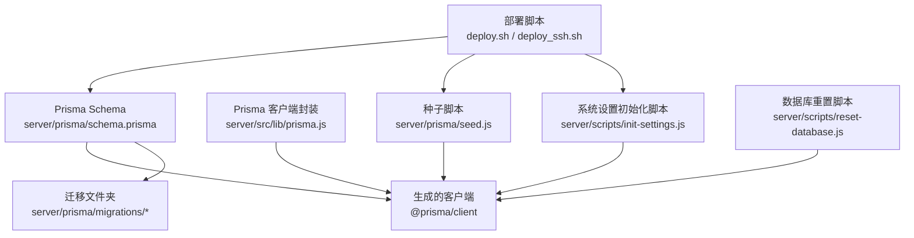
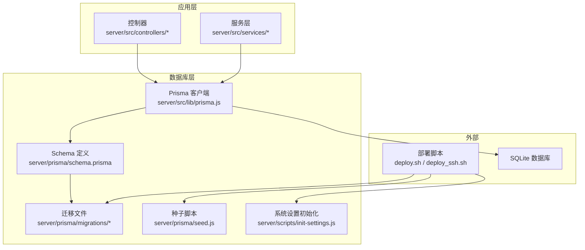
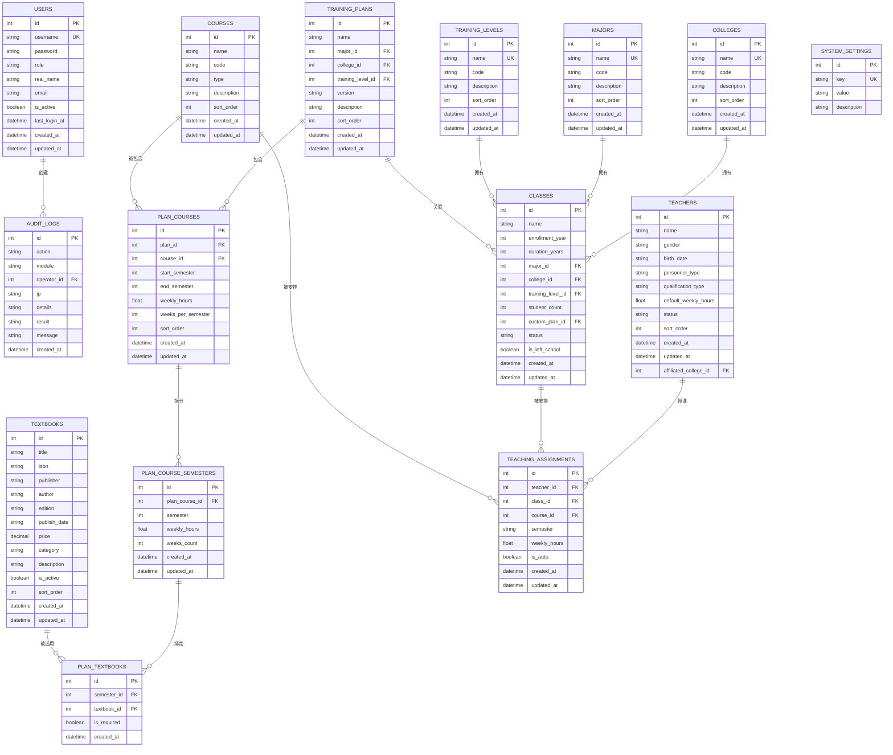
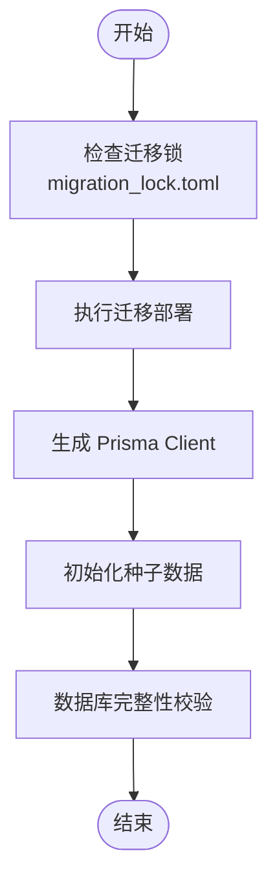
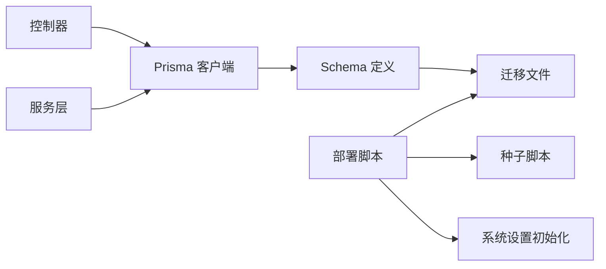

# 数据库设计

<cite>
**本文引用的文件**
- [schema.prisma](file://server/prisma/schema.prisma)
- [migration_lock.toml](file://server/prisma/migrations/migration_lock.toml)
- [20260611161232_init/migration.sql](file://server/prisma/migrations/20260611161232_init/migration.sql)
- [20260614071843_add_performance_indexes/migration.sql](file://server/prisma/migrations/20260614071843_add_performance_indexes/migration.sql)
- [20260616131500_add_unique_to_majors_name/migration.sql](file://server/prisma/migrations/20260616131500_add_unique_to_majors_name/migration.sql)
- [prisma.js](file://server/src/lib/prisma.js)
- [seed.js](file://server/prisma/seed.js)
- [init-settings.js](file://server/scripts/init-settings.js)
- [reset-database.js](file://server/scripts/reset-database.js)
- [update-admin-password.js](file://server/scripts/update-admin-password.js)
- [deploy.sh](file://deploy.sh)
- [deploy_ssh.sh](file://deploy_ssh.sh)
- [settings.controller.js](file://server/src/controllers/settings.controller.js)
</cite>

## 目录
1. [简介](#简介)
2. [项目结构](#项目结构)
3. [核心组件](#核心组件)
4. [架构总览](#架构总览)
5. [详细组件分析](#详细组件分析)
6. [依赖分析](#依赖分析)
7. [性能考虑](#性能考虑)
8. [故障排查指南](#故障排查指南)
9. [结论](#结论)
10. [附录](#附录)

## 简介
本文件面向KEC课程管理平台的数据库设计与实现，围绕基于Prisma ORM的Schema建模、实体关系、索引策略、迁移与版本控制、生产环境数据同步、连接配置、查询优化与事务处理进行系统化说明。文档同时提供可视化图示与实践建议，帮助开发者与运维人员高效理解并维护数据库层。

## 项目结构
数据库相关的核心位置集中在server/prisma目录，包含：
- Prisma Schema定义：用于声明模型、字段、关系与索引
- 迁移文件：记录数据库结构演进的历史SQL
- 种子脚本：初始化系统设置与默认管理员账户
- 连接配置：运行期的Prisma客户端实例化与日志监控
- 部署脚本：自动化生成客户端、部署迁移、初始化数据与校验

图表来源
- [schema.prisma:1-308](file://server/prisma/schema.prisma#L1-L308)
- [prisma.js:1-34](file://server/src/lib/prisma.js#L1-L34)
- [seed.js:1-132](file://server/prisma/seed.js#L1-L132)
- [init-settings.js:1-98](file://server/scripts/init-settings.js#L1-L98)
- [reset-database.js:1-130](file://server/scripts/reset-database.js#L1-L130)
- [deploy.sh:155-175](file://deploy.sh#L155-L175)
- [deploy_ssh.sh:251-275](file://deploy_ssh.sh#L251-L275)

章节来源
- [schema.prisma:1-308](file://server/prisma/schema.prisma#L1-L308)
- [prisma.js:1-34](file://server/src/lib/prisma.js#L1-L34)
- [seed.js:1-132](file://server/prisma/seed.js#L1-L132)
- [init-settings.js:1-98](file://server/scripts/init-settings.js#L1-L98)
- [reset-database.js:1-130](file://server/scripts/reset-database.js#L1-L130)
- [deploy.sh:155-175](file://deploy.sh#L155-L175)
- [deploy_ssh.sh:251-275](file://deploy_ssh.sh#L251-L275)

## 核心组件
- Prisma Schema：定义数据模型、字段类型、关系与索引，统一于单文件中便于版本管理与审查
- 迁移管理：通过迁移文件记录结构变更，支持回滚与部署到不同环境
- 种子数据：初始化系统设置与默认管理员，保护生产环境数据安全
- 连接与日志：集中封装Prisma客户端，按环境输出日志事件
- 部署流程：自动化生成客户端、部署迁移、初始化数据与完整性校验

章节来源
- [schema.prisma:1-308](file://server/prisma/schema.prisma#L1-L308)
- [migration_lock.toml:1-4](file://server/prisma/migrations/migration_lock.toml#L1-L4)
- [seed.js:1-132](file://server/prisma/seed.js#L1-L132)
- [prisma.js:1-34](file://server/src/lib/prisma.js#L1-L34)

## 架构总览
下图展示了数据库层在系统中的位置与交互：

图表来源
- [prisma.js:1-34](file://server/src/lib/prisma.js#L1-L34)
- [schema.prisma:1-308](file://server/prisma/schema.prisma#L1-L308)
- [migration_lock.toml:1-4](file://server/prisma/migrations/migration_lock.toml#L1-L4)
- [seed.js:1-132](file://server/prisma/seed.js#L1-L132)
- [init-settings.js:1-98](file://server/scripts/init-settings.js#L1-L98)
- [deploy.sh:155-175](file://deploy.sh#L155-L175)
- [deploy_ssh.sh:251-275](file://deploy_ssh.sh#L251-L275)

## 详细组件分析

### 数据模型与实体关系
- 数据模型采用Prisma Schema声明，包含审计日志、用户、班级、学院、专业、培养计划、课程、教材、教学安排等核心实体
- 关系设计遵循外键约束与级联策略，体现业务规则（如删除计划时级联删除其子项；删除教师/班级/课程时限制删除以保证数据完整性）
- 复合索引与唯一索引用于提升查询性能与数据一致性（如计划课程的复合唯一索引、用户用户名唯一索引）

图表来源
- [schema.prisma:10-308](file://server/prisma/schema.prisma#L10-L308)

章节来源
- [schema.prisma:10-308](file://server/prisma/schema.prisma#L10-L308)

### Prisma Schema 结构与数据类型映射
- 生成器与数据源：生成器为JavaScript客户端，数据源为SQLite，数据库URL来自环境变量
- 字段类型映射：整型、字符串、布尔、浮点、十进制、时间戳等类型与SQLite语义一致
- 关系与外键：通过relation声明与onDelete策略（Cascade/SetNull/Restrict）明确级联行为
- 索引与唯一性：@@index与@@unique声明索引，部分字段@unique保证唯一性

章节来源
- [schema.prisma:1-308](file://server/prisma/schema.prisma#L1-L308)

### 外键约束与关系策略
- 删除策略选择：
  - Cascade：计划课程与学期条目删除时级联清理
  - SetNull：主表删除时从表字段置空（如班级、计划、教师所属学院/专业/层次）
  - Restrict：教师、班级、课程删除时限制删除，防止破坏教学安排
- 复合唯一：计划课程对(plan_id, course_id)、学期条目对(plan_course_id, semester)、教学安排对(class_id, course_id, semester)等

章节来源
- [schema.prisma:10-308](file://server/prisma/schema.prisma#L10-L308)

### 迁移管理与版本控制
- 迁移锁：migration_lock.toml标记当前迁移提供者为sqlite，避免多人协作冲突
- 迁移文件：每个迁移包含DDL与索引变更，记录结构演进
- 部署流程：部署脚本先执行迁移部署，再生成客户端与初始化数据，并进行完整性校验

图表来源
- [migration_lock.toml:1-4](file://server/prisma/migrations/migration_lock.toml#L1-L4)
- [deploy.sh:155-175](file://deploy.sh#L155-L175)
- [deploy_ssh.sh:251-275](file://deploy_ssh.sh#L251-L275)

章节来源
- [migration_lock.toml:1-4](file://server/prisma/migrations/migration_lock.toml#L1-L4)
- [20260611161232_init/migration.sql:1-248](file://server/prisma/migrations/20260611161232_init/migration.sql#L1-L248)
- [20260614071843_add_performance_indexes/migration.sql:1-24](file://server/prisma/migrations/20260614071843_add_performance_indexes/migration.sql#L1-L24)
- [20260616131500_add_unique_to_majors_name/migration.sql:1-3](file://server/prisma/migrations/20260616131500_add_unique_to_majors_name/migration.sql#L1-L3)
- [deploy.sh:155-175](file://deploy.sh#L155-L175)
- [deploy_ssh.sh:251-275](file://deploy_ssh.sh#L251-L275)

### 生产环境数据同步方案
- 迁移部署：通过部署脚本调用迁移部署命令，确保结构变更在生产环境生效
- 客户端生成：每次迁移后生成最新客户端，保持类型安全
- 完整性校验：部署完成后查询关键表与用户数量，验证初始化成功
- 系统设置：通过初始化脚本写入默认系统设置，避免遗漏

章节来源
- [deploy.sh:155-175](file://deploy.sh#L155-L175)
- [deploy_ssh.sh:251-275](file://deploy_ssh.sh#L251-L275)
- [init-settings.js:1-98](file://server/scripts/init-settings.js#L1-L98)

### 数据库连接配置与日志监控
- 客户端封装：集中创建PrismaClient实例，按环境调整日志级别
- 测试数据库：测试环境下可通过环境变量覆盖数据源URL
- 日志事件：开发环境下监听error与warn事件并输出到统一logger

章节来源
- [prisma.js:1-34](file://server/src/lib/prisma.js#L1-L34)

### 查询优化与索引策略
- 索引覆盖常见查询路径：审计日志按时间倒序、模块、动作、操作人；班级按状态、入学年份、专业+状态、层次、学院、自定义计划；课程按类型、编号；教材按启用状态、分类、ISBN；用户按角色、用户名；计划按专业、学院、层次；学期条目与计划课程按学期、课程等
- 复合索引：如班级(专业,状态)、计划课程(plan_id, course_id)、学期条目(plan_course_id, semester)
- 唯一索引：用户用户名唯一、学院名称唯一、专业名称唯一、系统设置key唯一

章节来源
- [schema.prisma:10-308](file://server/prisma/schema.prisma#L10-L308)
- [20260611161232_init/migration.sql:177-248](file://server/prisma/migrations/20260611161232_init/migration.sql#L177-L248)
- [20260614071843_add_performance_indexes/migration.sql:4-23](file://server/prisma/migrations/20260614071843_add_performance_indexes/migration.sql#L4-L23)
- [20260616131500_add_unique_to_majors_name/migration.sql:1-3](file://server/prisma/migrations/20260616131500_add_unique_to_majors_name/migration.sql#L1-L3)

### 事务处理机制
- 批量清理：重置数据库脚本使用事务批量删除，保证原子性
- 事务边界：在需要强一致性的批量操作中优先使用事务包裹

章节来源
- [reset-database.js:14-33](file://server/scripts/reset-database.js#L14-L33)

### 种子数据与系统初始化
- 默认管理员：若不存在则创建，避免生产环境覆盖已有账号
- 强制重置：受环境变量控制，开发模式下可清空并重建
- 系统设置：初始化默认设置项，供前端与业务使用

章节来源
- [seed.js:14-51](file://server/prisma/seed.js#L14-L51)
- [seed.js:55-81](file://server/prisma/seed.js#L55-L81)
- [seed.js:95-122](file://server/prisma/seed.js#L95-L122)
- [init-settings.js:23-52](file://server/scripts/init-settings.js#L23-L52)

## 依赖分析
- 控制器与服务层通过统一的Prisma客户端访问数据库，降低耦合
- 部署脚本串联迁移、客户端生成与数据初始化，形成闭环
- 迁移文件与Schema共同决定数据库结构，确保版本一致

图表来源
- [prisma.js:1-34](file://server/src/lib/prisma.js#L1-L34)
- [schema.prisma:1-308](file://server/prisma/schema.prisma#L1-L308)
- [deploy.sh:155-175](file://deploy.sh#L155-L175)
- [deploy_ssh.sh:251-275](file://deploy_ssh.sh#L251-L275)
- [seed.js:1-132](file://server/prisma/seed.js#L1-L132)
- [init-settings.js:1-98](file://server/scripts/init-settings.js#L1-L98)

章节来源
- [settings.controller.js:1-29](file://server/src/controllers/settings.controller.js#L1-L29)
- [prisma.js:1-34](file://server/src/lib/prisma.js#L1-L34)

## 性能考虑
- 索引策略：针对高频过滤与排序字段建立索引，减少全表扫描
- 复合索引：结合多列过滤条件，提高查询效率
- 类型选择：浮点用于课程学时等半数课时场景，十进制用于金额类字段
- 查询路径：尽量使用索引覆盖的查询路径，避免不必要的JOIN
- 事务批处理：批量删除与写入使用事务，减少锁竞争与回滚成本

## 故障排查指南
- 迁移失败：部署脚本在迁移失败时尝试重置并重新部署，随后生成客户端与初始化数据
- 客户端未生成：确认执行生成步骤，确保Schema与客户端一致
- 数据库验证失败：检查关键表是否存在与初始用户数量，必要时手动执行SQL初始化
- 密码重置：提供专用脚本更新管理员密码，避免硬编码风险

章节来源
- [deploy_ssh.sh:251-275](file://deploy_ssh.sh#L251-L275)
- [update-admin-password.js:1-50](file://server/scripts/update-admin-password.js#L1-L50)

## 结论
本数据库设计方案以Prisma Schema为核心，配合结构化的迁移与种子脚本，实现了从开发到生产的完整生命周期管理。通过合理的索引与外键策略、事务化操作与统一的日志监控，保障了系统的稳定性与可维护性。建议在生产环境中持续完善迁移策略与备份方案，并根据业务增长逐步评估索引与查询路径的优化空间。

## 附录
- 环境变量与部署要点：确保DATABASE_URL正确指向SQLite文件，部署脚本按顺序执行迁移、生成客户端与初始化数据
- 版本控制：迁移文件与migration_lock.toml纳入版本控制，避免多人协作冲突