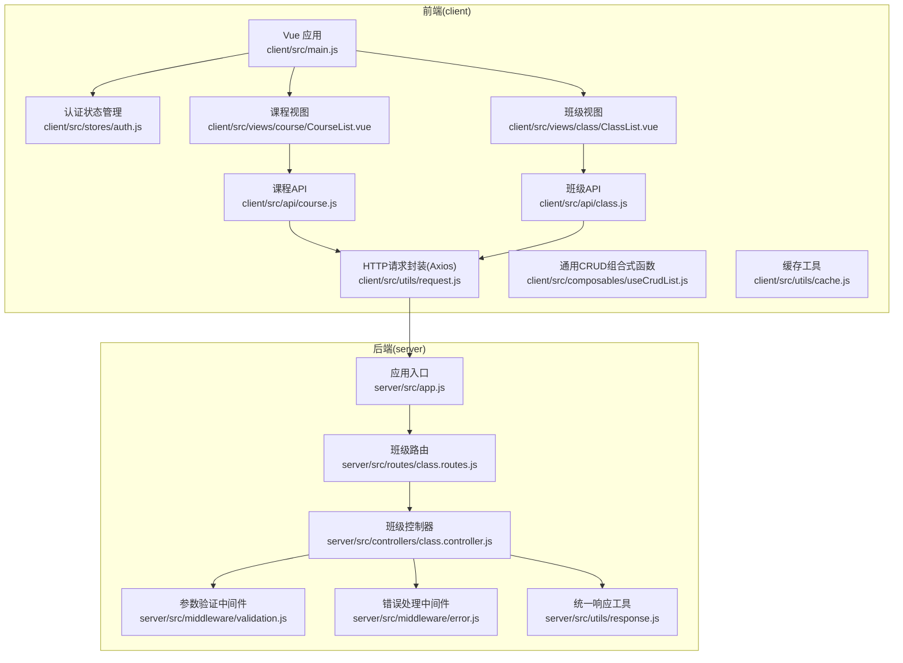
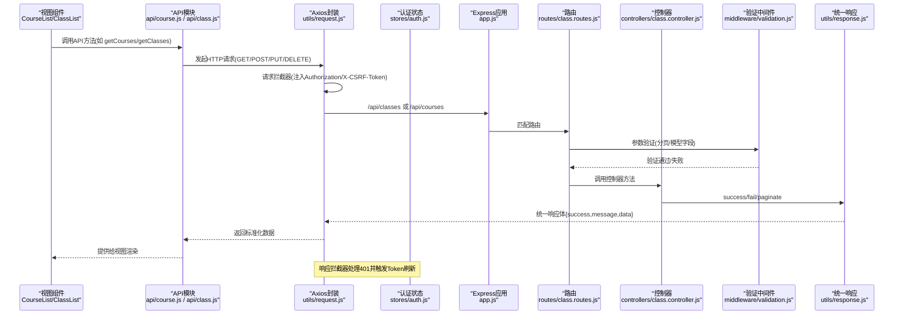
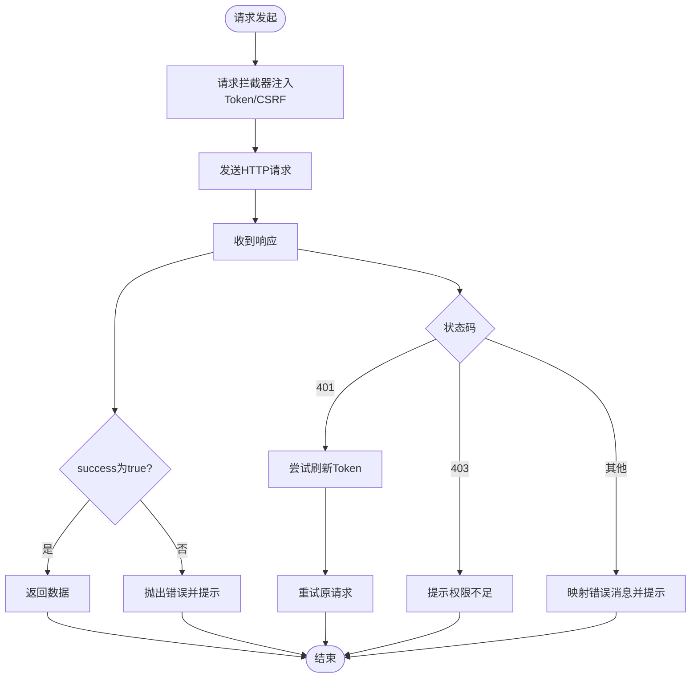
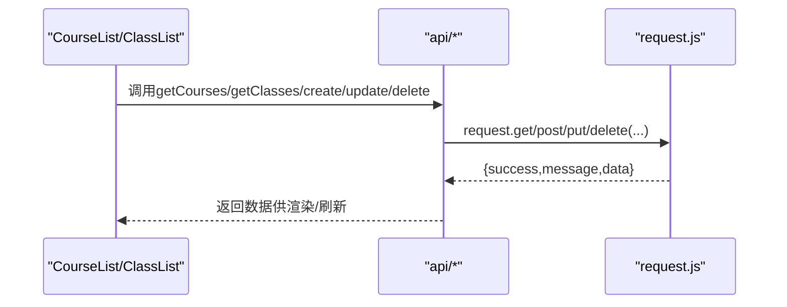
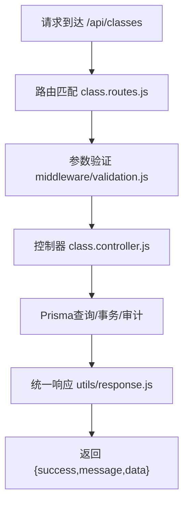
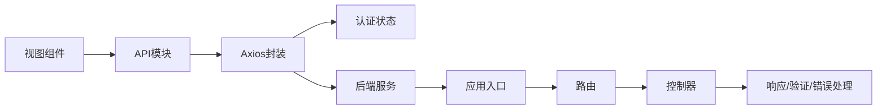

# 数据流设计

<cite>
**本文引用的文件**
- [client/src/utils/request.js](file://client/src/utils/request.js)
- [client/src/stores/auth.js](file://client/src/stores/auth.js)
- [client/src/composables/useCrudList.js](file://client/src/composables/useCrudList.js)
- [client/src/api/course.js](file://client/src/api/course.js)
- [client/src/api/class.js](file://client/src/api/class.js)
- [client/src/views/course/CourseList.vue](file://client/src/views/course/CourseList.vue)
- [client/src/views/class/ClassList.vue](file://client/src/views/class/ClassList.vue)
- [client/src/utils/cache.js](file://client/src/utils/cache.js)
- [client/src/main.js](file://client/src/main.js)
- [server/src/utils/response.js](file://server/src/utils/response.js)
- [server/src/middleware/validation.js](file://server/src/middleware/validation.js)
- [server/src/controllers/class.controller.js](file://server/src/controllers/class.controller.js)
- [server/src/routes/class.routes.js](file://server/src/routes/class.routes.js)
- [server/src/middleware/error.js](file://server/src/middleware/error.js)
- [server/src/app.js](file://server/src/app.js)
</cite>

## 目录
1. [引言](#引言)
2. [项目结构](#项目结构)
3. [核心组件](#核心组件)
4. [架构总览](#架构总览)
5. [详细组件分析](#详细组件分析)
6. [依赖分析](#依赖分析)
7. [性能考虑](#性能考虑)
8. [故障排查指南](#故障排查指南)
9. [结论](#结论)
10. [附录](#附录)

## 引言
本文件面向KEC课程管理平台，系统化梳理从前端组件到后端服务的完整数据流设计，重点覆盖以下方面：
- HTTP请求的发起与封装、Axios拦截器的使用、请求/响应统一格式与错误处理机制
- 前后端数据契约（命名规范、参数验证、序列化/反序列化）
- 异步数据处理、缓存策略、实时数据更新等高级主题

## 项目结构
项目采用前后端分离架构，前端基于Vue 3 + Pinia + Element Plus，后端基于Express + Prisma，通过REST API交互。

图表来源
- [client/src/main.js:110-115](file://client/src/main.js#L110-L115)
- [client/src/stores/auth.js:181-200](file://client/src/stores/auth.js#L181-L200)
- [client/src/api/course.js:1-7](file://client/src/api/course.js#L1-L7)
- [client/src/api/class.js:1-8](file://client/src/api/class.js#L1-L8)
- [client/src/utils/request.js:7-15](file://client/src/utils/request.js#L7-L15)
- [server/src/app.js:1-158](file://server/src/app.js#L1-L158)
- [server/src/routes/class.routes.js:1-34](file://server/src/routes/class.routes.js#L1-L34)
- [server/src/controllers/class.controller.js:45-242](file://server/src/controllers/class.controller.js#L45-L242)
- [server/src/middleware/validation.js:1-590](file://server/src/middleware/validation.js#L1-L590)
- [server/src/middleware/error.js:1-63](file://server/src/middleware/error.js#L1-L63)
- [server/src/utils/response.js:1-21](file://server/src/utils/response.js#L1-L21)

章节来源
- [client/src/main.js:1-115](file://client/src/main.js#L1-L115)
- [server/src/app.js:1-158](file://server/src/app.js#L1-L158)

## 核心组件
- Axios请求封装与拦截器：负责统一请求头注入、CSRF、Token刷新、错误处理与统一响应格式
- 认证状态管理：负责登录、登出、Token刷新、用户信息拉取与本地持久化
- 视图层与API层：视图通过API模块发起请求，API模块通过Axios封装调用
- 控制器与中间件：控制器处理业务逻辑，中间件负责参数验证、命名转换、XSS清洗、错误处理
- 统一响应工具：保证后端响应体结构一致

章节来源
- [client/src/utils/request.js:17-142](file://client/src/utils/request.js#L17-L142)
- [client/src/stores/auth.js:48-220](file://client/src/stores/auth.js#L48-L220)
- [server/src/utils/response.js:1-21](file://server/src/utils/response.js#L1-L21)
- [server/src/middleware/validation.js:1-35](file://server/src/middleware/validation.js#L1-L35)

## 架构总览
从前端到后端的关键数据流如下：

图表来源
- [client/src/views/course/CourseList.vue:169-225](file://client/src/views/course/CourseList.vue#L169-L225)
- [client/src/views/class/ClassList.vue:205-257](file://client/src/views/class/ClassList.vue#L205-L257)
- [client/src/api/course.js:1-7](file://client/src/api/course.js#L1-L7)
- [client/src/api/class.js:1-8](file://client/src/api/class.js#L1-L8)
- [client/src/utils/request.js:17-142](file://client/src/utils/request.js#L17-L142)
- [client/src/stores/auth.js:106-128](file://client/src/stores/auth.js#L106-L128)
- [server/src/app.js:84-155](file://server/src/app.js#L84-L155)
- [server/src/routes/class.routes.js:16-31](file://server/src/routes/class.routes.js#L16-L31)
- [server/src/controllers/class.controller.js:45-242](file://server/src/controllers/class.controller.js#L45-L242)
- [server/src/middleware/validation.js:1-35](file://server/src/middleware/validation.js#L1-L35)
- [server/src/utils/response.js:1-21](file://server/src/utils/response.js#L1-L21)

## 详细组件分析

### 前端数据流与拦截器
- 请求拦截器
  - 自动注入Authorization头（Bearer Token）
  - 对POST/PUT/PATCH/DELETE自动注入X-CSRF-Token（从Cookie读取）
  - 统一超时与Content-Type设置
- 响应拦截器
  - 统一解析响应体，当success=false时抛出错误并提示
  - 处理401未授权：防死循环、并发刷新队列、刷新失败引导登出
  - 处理403权限不足与常见HTTP错误映射
  - 网络超时与连接失败提示
- 认证状态管理
  - 登录成功写入Cookie与localStorage，拉取用户信息
  - Token过期判断与刷新，刷新失败引导登出
  - 初始化流程：根据Cookie与Token状态决定是否拉取用户信息

图表来源
- [client/src/utils/request.js:17-142](file://client/src/utils/request.js#L17-L142)
- [client/src/stores/auth.js:106-128](file://client/src/stores/auth.js#L106-L128)

章节来源
- [client/src/utils/request.js:7-142](file://client/src/utils/request.js#L7-L142)
- [client/src/stores/auth.js:48-220](file://client/src/stores/auth.js#L48-L220)

### 视图与API层
- 课程管理视图
  - 使用API模块发起请求，支持搜索、导入导出、排序与CRUD
  - 通过useCrudList组合式函数实现通用CRUD逻辑
- 班级管理视图
  - 支持复杂筛选、分页、批量操作、导入进度反馈
  - 字段名从camelCase转换为snake_case以匹配后端期望

图表来源
- [client/src/views/course/CourseList.vue:125-225](file://client/src/views/course/CourseList.vue#L125-L225)
- [client/src/views/class/ClassList.vue:106-257](file://client/src/views/class/ClassList.vue#L106-L257)
- [client/src/api/course.js:1-7](file://client/src/api/course.js#L1-L7)
- [client/src/api/class.js:1-8](file://client/src/api/class.js#L1-L8)
- [client/src/composables/useCrudList.js:18-121](file://client/src/composables/useCrudList.js#L18-L121)

章节来源
- [client/src/views/course/CourseList.vue:121-225](file://client/src/views/course/CourseList.vue#L121-L225)
- [client/src/views/class/ClassList.vue:101-257](file://client/src/views/class/ClassList.vue#L101-L257)
- [client/src/composables/useCrudList.js:18-121](file://client/src/composables/useCrudList.js#L18-L121)

### 后端数据流与中间件
- 应用入口
  - 注册安全头、CORS、JSON解析、日志、命名转换中间件、XSS清洗
  - 按模块划分路由，区分公开/需认证/角色权限接口
- 路由与控制器
  - 班级路由：GET统计、GET列表、POST/PUT/DELETE受权限控制
  - 控制器：构建过滤条件、计算动态状态、聚合关联映射、事务更新与审计日志
- 中间件
  - 参数验证：针对各模型的字段长度、范围、枚举、格式进行校验
  - 错误处理：Prisma错误映射、自定义错误、未知错误统一输出
- 统一响应
  - success/paginate/fail三类响应，保证前端解析一致性

图表来源
- [server/src/app.js:84-155](file://server/src/app.js#L84-L155)
- [server/src/routes/class.routes.js:16-31](file://server/src/routes/class.routes.js#L16-L31)
- [server/src/middleware/validation.js:37-90](file://server/src/middleware/validation.js#L37-L90)
- [server/src/controllers/class.controller.js:45-242](file://server/src/controllers/class.controller.js#L45-L242)
- [server/src/utils/response.js:1-21](file://server/src/utils/response.js#L1-L21)

章节来源
- [server/src/app.js:1-158](file://server/src/app.js#L1-L158)
- [server/src/routes/class.routes.js:1-34](file://server/src/routes/class.routes.js#L1-L34)
- [server/src/middleware/validation.js:1-590](file://server/src/middleware/validation.js#L1-L590)
- [server/src/controllers/class.controller.js:1-464](file://server/src/controllers/class.controller.js#L1-L464)
- [server/src/utils/response.js:1-21](file://server/src/utils/response.js#L1-L21)

### 数据契约与序列化/反序列化
- 命名约定
  - 前端使用camelCase；后端通过命名转换中间件将请求体从camelCase转为snake_case，响应从snake_case转为camelCase
- 参数验证
  - Express-Validator在路由层对查询参数与请求体进行严格校验，失败返回统一结构并包含字段与位置信息
- 错误处理
  - 后端错误映射为用户友好提示，生产环境隐藏技术细节
- 前端解析
  - Axios拦截器统一解析success字段，错误时弹窗提示；控制器返回的分页数据包含list/total/page/pageSize/totalPages

章节来源
- [server/src/app.js:84-89](file://server/src/app.js#L84-L89)
- [server/src/middleware/validation.js:7-35](file://server/src/middleware/validation.js#L7-L35)
- [server/src/middleware/error.js:35-62](file://server/src/middleware/error.js#L35-L62)
- [server/src/utils/response.js:5-20](file://server/src/utils/response.js#L5-L20)
- [client/src/utils/request.js:51-58](file://client/src/utils/request.js#L51-L58)

### 缓存策略与异步处理
- 前端缓存
  - Map实现LRU缓存，支持TTL、最大容量、定期清理与手动清理
  - 适用于高频读取的基础数据或静态列表，减少重复请求
- 异步处理
  - 视图组件通过组合式函数与API模块解耦，统一加载/保存/删除流程
  - 导入/导出采用进度对话框与批量操作，提升用户体验

章节来源
- [client/src/utils/cache.js:16-122](file://client/src/utils/cache.js#L16-L122)
- [client/src/composables/useCrudList.js:33-100](file://client/src/composables/useCrudList.js#L33-L100)
- [client/src/views/class/ClassList.vue:488-554](file://client/src/views/class/ClassList.vue#L488-L554)

## 依赖分析
- 前端
  - 视图依赖API模块，API模块依赖Axios封装
  - 认证状态管理贯穿请求拦截器与视图生命周期
- 后端
  - 应用入口集中注册中间件与路由
  - 控制器依赖Prisma、命名转换、验证与响应工具

图表来源
- [client/src/views/course/CourseList.vue:125-225](file://client/src/views/course/CourseList.vue#L125-L225)
- [client/src/views/class/ClassList.vue:106-257](file://client/src/views/class/ClassList.vue#L106-L257)
- [client/src/api/course.js:1-7](file://client/src/api/course.js#L1-L7)
- [client/src/api/class.js:1-8](file://client/src/api/class.js#L1-L8)
- [client/src/utils/request.js:17-142](file://client/src/utils/request.js#L17-L142)
- [client/src/stores/auth.js:106-128](file://client/src/stores/auth.js#L106-L128)
- [server/src/app.js:84-155](file://server/src/app.js#L84-L155)
- [server/src/routes/class.routes.js:16-31](file://server/src/routes/class.routes.js#L16-L31)
- [server/src/controllers/class.controller.js:45-242](file://server/src/controllers/class.controller.js#L45-L242)

章节来源
- [client/src/main.js:110-115](file://client/src/main.js#L110-L115)
- [server/src/app.js:1-158](file://server/src/app.js#L1-L158)

## 性能考虑
- 前端
  - 使用缓存工具降低重复请求，合理设置TTL与容量上限
  - 视图层采用防抖与批量操作，减少不必要的重渲染与请求
- 后端
  - 控制器合并多次查询为单次聚合，减少数据库往返
  - 分页参数严格校验，避免过大pageSize导致性能问题
  - 命名转换与XSS清洗在中间件阶段集中处理，减少控制器负担

## 故障排查指南
- 常见错误定位
  - 401未授权：检查Token是否过期，确认刷新流程是否生效
  - 403权限不足：确认用户角色与路由权限配置
  - 参数验证失败：查看响应data.details中的字段与位置信息
  - Prisma错误：根据错误码映射到用户友好提示
- 前端调试
  - 开启开发环境日志，观察请求/响应与拦截器行为
  - 使用缓存统计与清理定时器辅助定位缓存问题
- 后端调试
  - 查看日志中间件输出，关注请求路径与IP
  - 错误中间件在生产环境会屏蔽堆栈，开发环境可显示详细信息

章节来源
- [client/src/utils/request.js:60-142](file://client/src/utils/request.js#L60-L142)
- [client/src/utils/cache.js:83-122](file://client/src/utils/cache.js#L83-L122)
- [server/src/middleware/validation.js:7-35](file://server/src/middleware/validation.js#L7-L35)
- [server/src/middleware/error.js:35-62](file://server/src/middleware/error.js#L35-L62)
- [server/src/app.js:77-82](file://server/src/app.js#L77-L82)

## 结论
本设计通过Axios拦截器与认证状态管理实现了统一的请求/响应处理与错误恢复；后端通过严格的参数验证、命名转换与统一响应保障了数据契约一致性；前后端协同在分页、批量操作、导入导出与缓存策略等方面提供了良好的性能与可用性。建议持续优化缓存命中率与错误提示粒度，进一步增强实时数据更新能力。

## 附录
- 关键流程回顾
  - 登录与初始化：前端初始化认证状态，后端返回用户信息并写入Cookie
  - 列表加载：前端通过API模块发起请求，后端返回分页数据与关联映射
  - 写操作：前端将camelCase字段转换为snake_case，后端事务更新并记录审计日志
- 最佳实践
  - 前端：统一使用API模块与组合式函数，避免分散的请求逻辑
  - 后端：在路由层集中验证，在控制器层专注业务与事务，保持中间件职责单一