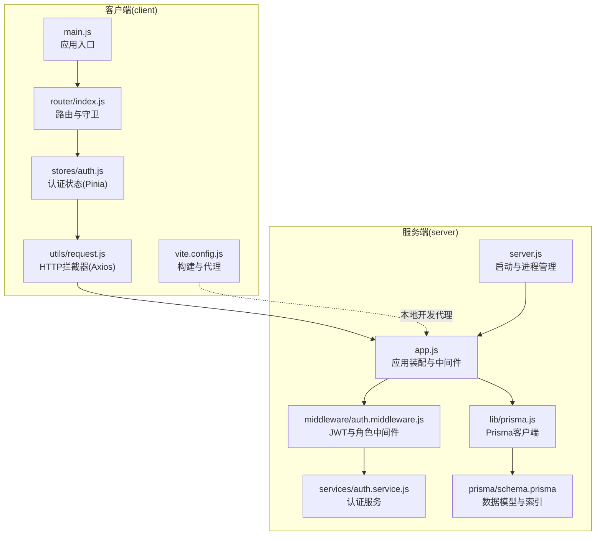
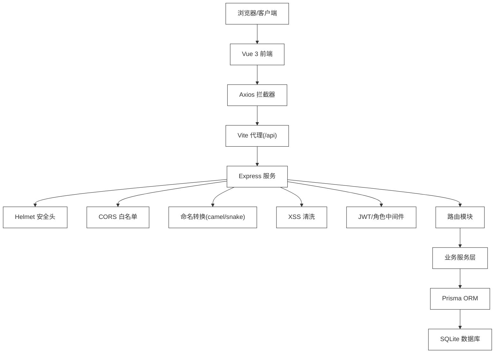
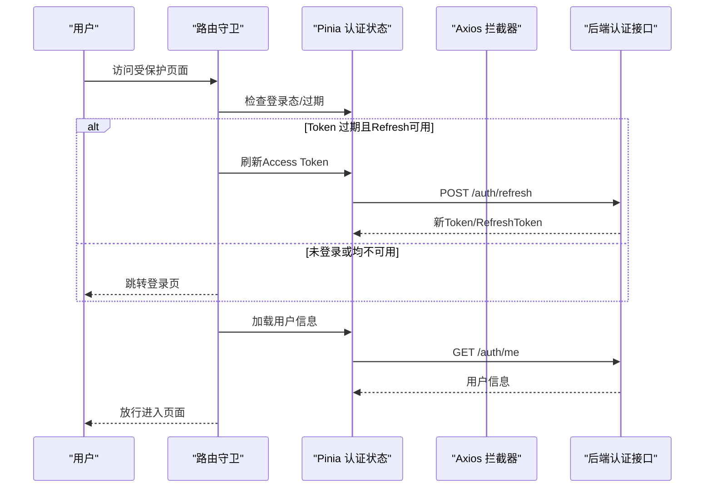
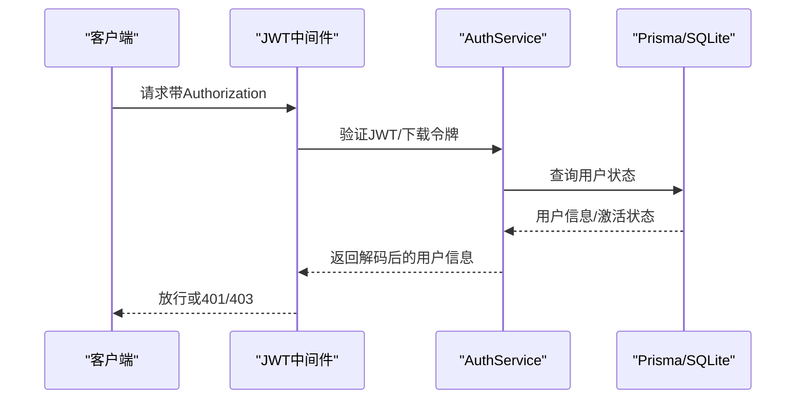
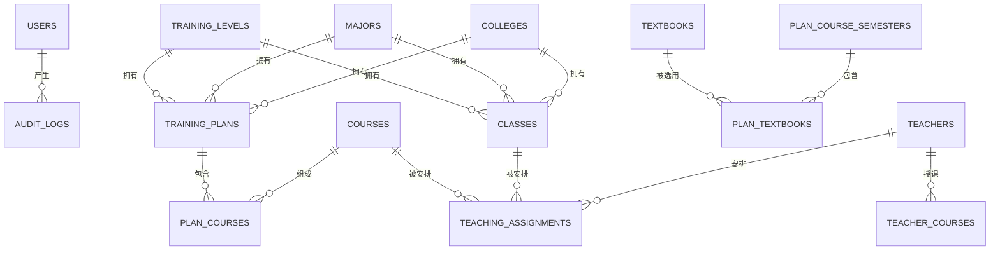
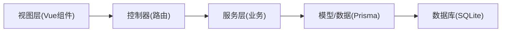
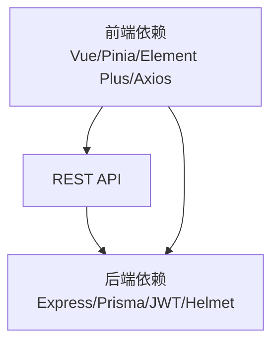

# 系统架构

<cite>
**本文引用的文件**
- [client/package.json](file://client/package.json)
- [server/package.json](file://server/package.json)
- [client/src/main.js](file://client/src/main.js)
- [client/src/router/index.js](file://client/src/router/index.js)
- [client/src/stores/auth.js](file://client/src/stores/auth.js)
- [client/src/utils/request.js](file://client/src/utils/request.js)
- [client/vite.config.js](file://client/vite.config.js)
- [server/src/app.js](file://server/src/app.js)
- [server/src/server.js](file://server/src/server.js)
- [server/src/lib/prisma.js](file://server/src/lib/prisma.js)
- [server/prisma/schema.prisma](file://server/prisma/schema.prisma)
- [server/src/middleware/auth.middleware.js](file://server/src/middleware/auth.middleware.js)
- [server/src/services/auth.service.js](file://server/src/services/auth.service.js)
</cite>

## 目录
1. [引言](#引言)
2. [项目结构](#项目结构)
3. [核心组件](#核心组件)
4. [架构总览](#架构总览)
5. [详细组件分析](#详细组件分析)
6. [依赖分析](#依赖分析)
7. [性能考虑](#性能考虑)
8. [故障排查指南](#故障排查指南)
9. [结论](#结论)
10. [附录](#附录)

## 引言
本文件面向 KEA 课程管理平台的系统架构文档，聚焦前后端分离的整体设计：前端采用 Vue 3 + Pinia + Element Plus，后端采用 Express.js + Prisma ORM，配合 JWT 认证与中间件体系实现安全防护。文档从系统边界、组件交互、分层职责、MVC 模式落地、安全中间件、数据库建模与索引策略等方面进行深入解析，并提供可视化图示帮助开发者快速理解。

## 项目结构
KEC 平台采用双仓库结构：
- 前端 client：基于 Vite 构建，使用 Vue 3 单页应用，路由守卫与 Pinia 状态管理负责鉴权与页面导航。
- 后端 server：基于 Express.js，采用模块化路由与中间件，Prisma 作为 ORM 访问 SQLite 数据库。

图表来源
- [client/src/main.js:1-115](file://client/src/main.js#L1-L115)
- [client/src/router/index.js:1-244](file://client/src/router/index.js#L1-L244)
- [client/src/stores/auth.js:1-222](file://client/src/stores/auth.js#L1-L222)
- [client/src/utils/request.js:1-145](file://client/src/utils/request.js#L1-L145)
- [client/vite.config.js:1-56](file://client/vite.config.js#L1-L56)
- [server/src/app.js:1-158](file://server/src/app.js#L1-L158)
- [server/src/server.js:1-66](file://server/src/server.js#L1-L66)
- [server/src/middleware/auth.middleware.js:1-129](file://server/src/middleware/auth.middleware.js#L1-L129)
- [server/src/services/auth.service.js:1-199](file://server/src/services/auth.service.js#L1-L199)
- [server/src/lib/prisma.js:1-34](file://server/src/lib/prisma.js#L1-L34)
- [server/prisma/schema.prisma:1-308](file://server/prisma/schema.prisma#L1-L308)

章节来源
- [client/package.json:1-33](file://client/package.json#L1-L33)
- [server/package.json:1-53](file://server/package.json#L1-L53)
- [client/src/main.js:1-115](file://client/src/main.js#L1-L115)
- [client/src/router/index.js:1-244](file://client/src/router/index.js#L1-L244)
- [client/src/stores/auth.js:1-222](file://client/src/stores/auth.js#L1-L222)
- [client/src/utils/request.js:1-145](file://client/src/utils/request.js#L1-L145)
- [client/vite.config.js:1-56](file://client/vite.config.js#L1-L56)
- [server/src/app.js:1-158](file://server/src/app.js#L1-L158)
- [server/src/server.js:1-66](file://server/src/server.js#L1-L66)
- [server/src/lib/prisma.js:1-34](file://server/src/lib/prisma.js#L1-L34)
- [server/prisma/schema.prisma:1-308](file://server/prisma/schema.prisma#L1-L308)

## 核心组件
- 前端应用
  - 应用入口与插件注册：Element Plus、Vue Router、Pinia、国际化。
  - 路由守卫：统一认证、权限校验、页面标题与重定向。
  - 状态管理：认证状态、用户信息、登录/登出/刷新流程。
  - HTTP 封装：Axios 拦截器、统一错误提示、并发刷新队列。
  - 构建与代理：Vite 代理到后端、代码分割与依赖优化。
- 后端服务
  - 应用装配：Helmet 安全头、CORS 白名单、命名转换、XSS 清洗、健康检查、路由挂载。
  - 中间件：JWT 校验与角色中间件、用户状态缓存、错误处理。
  - 认证服务：JWT 生成/验证、刷新令牌、密码哈希、审计日志。
  - 数据库：Prisma ORM、SQLite、索引优化、模型关系。
- 数据模型
  - 用户、教师、课程、班级、培养方案、教材、教学安排、审计日志等核心实体及索引。

章节来源
- [client/src/main.js:1-115](file://client/src/main.js#L1-L115)
- [client/src/router/index.js:1-244](file://client/src/router/index.js#L1-L244)
- [client/src/stores/auth.js:1-222](file://client/src/stores/auth.js#L1-L222)
- [client/src/utils/request.js:1-145](file://client/src/utils/request.js#L1-L145)
- [client/vite.config.js:1-56](file://client/vite.config.js#L1-L56)
- [server/src/app.js:1-158](file://server/src/app.js#L1-L158)
- [server/src/middleware/auth.middleware.js:1-129](file://server/src/middleware/auth.middleware.js#L1-L129)
- [server/src/services/auth.service.js:1-199](file://server/src/services/auth.service.js#L1-L199)
- [server/src/lib/prisma.js:1-34](file://server/src/lib/prisma.js#L1-L34)
- [server/prisma/schema.prisma:1-308](file://server/prisma/schema.prisma#L1-L308)

## 架构总览
系统采用前后端分离，前端通过 Axios 发起 REST 请求，后端通过 Express 提供 API，JWT 作为会话凭证，Prisma 进行数据库访问。中间件体系覆盖安全、命名规范、XSS 清洗与错误处理。

图表来源
- [client/src/utils/request.js:1-145](file://client/src/utils/request.js#L1-L145)
- [client/vite.config.js:1-56](file://client/vite.config.js#L1-L56)
- [server/src/app.js:1-158](file://server/src/app.js#L1-L158)
- [server/src/middleware/auth.middleware.js:1-129](file://server/src/middleware/auth.middleware.js#L1-L129)
- [server/src/lib/prisma.js:1-34](file://server/src/lib/prisma.js#L1-L34)
- [server/prisma/schema.prisma:1-308](file://server/prisma/schema.prisma#L1-L308)

## 详细组件分析

### 前端：Vue 3 应用与状态管理
- 应用入口与插件
  - 注册 Element Plus、Vue Router、Pinia；全局错误与警告处理器；按需注册图标组件。
- 路由与守卫
  - 全局前置守卫：页面标题、登录态判定、Token 刷新、权限校验（admin/super_admin/viewer）。
- 状态管理（Pinia）
  - 认证状态：token/refreshToken、userInfo、登录/登出/刷新/修改密码、初始化。
  - 安全兜底：Token 过期检测、用户信息解析异常处理、缓存清理。
- HTTP 封装（Axios）
  - 自动注入 Authorization 与 CSRF Token；401 自动刷新并重试；403 权限提示；统一错误提示。
- 构建与代理
  - 本地开发代理至后端端口；手动分包策略提升首屏性能。

图表来源
- [client/src/router/index.js:151-241](file://client/src/router/index.js#L151-L241)
- [client/src/stores/auth.js:106-151](file://client/src/stores/auth.js#L106-L151)
- [client/src/utils/request.js:51-142](file://client/src/utils/request.js#L51-L142)

章节来源
- [client/src/main.js:1-115](file://client/src/main.js#L1-L115)
- [client/src/router/index.js:1-244](file://client/src/router/index.js#L1-L244)
- [client/src/stores/auth.js:1-222](file://client/src/stores/auth.js#L1-L222)
- [client/src/utils/request.js:1-145](file://client/src/utils/request.js#L1-L145)
- [client/vite.config.js:1-56](file://client/vite.config.js#L1-L56)

### 后端：Express 应用与中间件体系
- 应用装配
  - 安全头（Helmet）、CORS 白名单、JSON 限制、命名转换（camel/snake）、XSS 清洗、健康检查、路由挂载。
- 中间件
  - JWT 校验：Authorization 头或下载短令牌；用户状态缓存（TTL 30s）；角色中间件。
- 错误处理
  - 统一错误响应、进程级未捕获异常/拒绝处理、优雅关闭与数据库断连。
- 认证服务
  - 登录/刷新/改密/下载令牌；bcrypt 哈希；审计日志；独立密钥与过期策略。
- 数据库
  - Prisma 客户端、SQLite、多处复合索引与单列索引，保障查询性能。

图表来源
- [server/src/app.js:22-155](file://server/src/app.js#L22-L155)
- [server/src/middleware/auth.middleware.js:40-106](file://server/src/middleware/auth.middleware.js#L40-L106)
- [server/src/services/auth.service.js:8-199](file://server/src/services/auth.service.js#L8-L199)
- [server/src/lib/prisma.js:1-34](file://server/src/lib/prisma.js#L1-L34)

章节来源
- [server/src/app.js:1-158](file://server/src/app.js#L1-L158)
- [server/src/server.js:1-66](file://server/src/server.js#L1-L66)
- [server/src/middleware/auth.middleware.js:1-129](file://server/src/middleware/auth.middleware.js#L1-L129)
- [server/src/services/auth.service.js:1-199](file://server/src/services/auth.service.js#L1-L199)
- [server/src/lib/prisma.js:1-34](file://server/src/lib/prisma.js#L1-L34)

### 数据模型与索引策略
- 核心模型
  - 用户、教师、课程、班级、培养方案、教材、教学安排、审计日志等。
- 关系与约束
  - 多对多/一对多关系明确，外键约束与删除策略（Restrict/SetNull/Cascade）合理。
- 索引设计
  - 针对常用过滤字段（状态、年份、角色、唯一组合）建立索引，提升查询效率。
- 数据类型与精度
  - 课时等浮点业务值使用 SQLite REAL，满足 0.5 倍数场景的精度需求。

图表来源
- [server/prisma/schema.prisma:10-308](file://server/prisma/schema.prisma#L10-L308)

章节来源
- [server/prisma/schema.prisma:1-308](file://server/prisma/schema.prisma#L1-L308)

### MVC 分层与职责划分
- 视图层（View）
  - Vue 组件与页面视图，负责渲染与用户交互。
- 控制器（Controller）
  - 路由对应控制器处理请求参数、调用服务、返回响应。
- 服务层（Service）
  - 业务逻辑封装，如认证服务、导入导出、教学安排算法等。
- 模型/数据层（Model/Data）
  - Prisma 模型与数据库 Schema，负责数据持久化与查询。

[该图为概念性示意，不直接映射具体源文件，故无图表来源]

## 依赖分析
- 技术栈选择与优势
  - Vue 3 + Element Plus：组件生态成熟、国际化与主题完善，适合管理后台。
  - Pinia：轻量、TypeScript 友好、API 直观，适合复杂状态管理。
  - Express + Prisma：Node 生态成熟、ORM 易用、迁移与种子脚本完善。
  - JWT：无状态认证，便于横向扩展与微服务演进。
  - Helmet + CORS + XSS：多层安全防护，降低常见攻击面。
- 前后端依赖关系
  - 前端通过 /api 前缀代理访问后端；Axios 统一处理鉴权与错误。
  - 后端按模块拆分路由与中间件，职责清晰、耦合度低。

图表来源
- [client/package.json:13-31](file://client/package.json#L13-L31)
- [server/package.json:28-51](file://server/package.json#L28-L51)

章节来源
- [client/package.json:1-33](file://client/package.json#L1-L33)
- [server/package.json:1-53](file://server/package.json#L1-L53)

## 性能考虑
- 前端
  - 代码分割：将 vue、element-plus、axios 等拆分为独立 chunk，减少首屏体积。
  - 依赖预优化：optimizeDeps 包含核心依赖，缩短冷启动时间。
  - 图标按需注册：仅注册实际使用图标，避免全量引入。
- 后端
  - 用户状态缓存：Map + TTL，降低重复查询成本。
  - 索引优化：针对高频查询字段建立索引，减少全表扫描。
  - 命名转换与 XSS 清洗：在中间件阶段集中处理，避免业务重复逻辑。
- 数据库
  - 复合索引与单列索引结合，平衡写入与查询性能。
  - SQLite 适配中小规模数据与开发/演示场景，具备良好一致性与易部署特性。

[本节为通用性能建议，不直接分析具体文件，故无章节来源]

## 故障排查指南
- 常见问题定位
  - 401 未授权：检查 Authorization 头、Token 是否过期、是否被禁用；确认刷新流程是否成功。
  - 403 权限不足：核对用户角色与页面所需权限；检查路由 meta 标记。
  - CORS 跨域：确认前端代理与后端 CORS 白名单配置；开发环境允许 localhost。
  - 健康检查：/api/health 可快速判断数据库连接状态。
- 日志与监控
  - Winston 日志记录：后端错误、警告、审计日志；前端错误处理器与消息提示。
- 进程与优雅关闭
  - 未捕获异常/拒绝：进程退出保护；服务器错误：端口占用等处理；优雅关闭：断开 Prisma 连接。

章节来源
- [server/src/app.js:94-113](file://server/src/app.js#L94-L113)
- [server/src/middleware/auth.middleware.js:40-106](file://server/src/middleware/auth.middleware.js#L40-L106)
- [client/src/utils/request.js:64-142](file://client/src/utils/request.js#L64-L142)
- [server/src/server.js:10-40](file://server/src/server.js#L10-L40)

## 结论
KEC 课程管理平台采用成熟的前后端分离架构：前端以 Vue 3 为核心，结合 Pinia 与 Element Plus 构建高可用管理界面；后端以 Express + Prisma 为基础，配合 JWT 与中间件体系实现安全、可维护的 API 层。通过合理的分层设计、中间件安全防护、数据库索引与缓存策略，系统在易用性、安全性与性能之间取得良好平衡，适合持续迭代与扩展。

## 附录
- 系统边界
  - 前端：浏览器/移动端访问，通过 /api 代理与后端通信。
  - 后端：对外暴露 REST API，内部通过 Prisma 访问 SQLite。
- 关键流程参考路径
  - 登录流程：[client/src/stores/auth.js:48-89](file://client/src/stores/auth.js#L48-L89)、[server/src/services/auth.service.js:9-82](file://server/src/services/auth.service.js#L9-L82)
  - Token 刷新：[client/src/stores/auth.js:106-128](file://client/src/stores/auth.js#L106-L128)、[client/src/utils/request.js:64-112](file://client/src/utils/request.js#L64-L112)
  - 权限校验：[client/src/router/index.js:169-231](file://client/src/router/index.js#L169-L231)、[server/src/middleware/auth.middleware.js:108-129](file://server/src/middleware/auth.middleware.js#L108-L129)