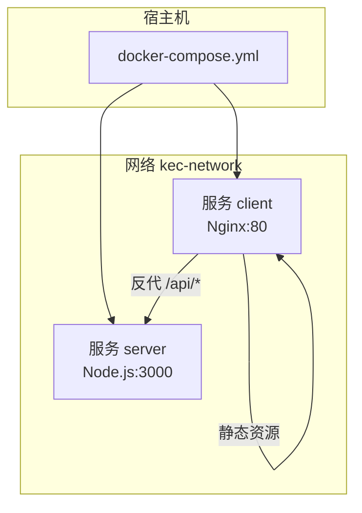
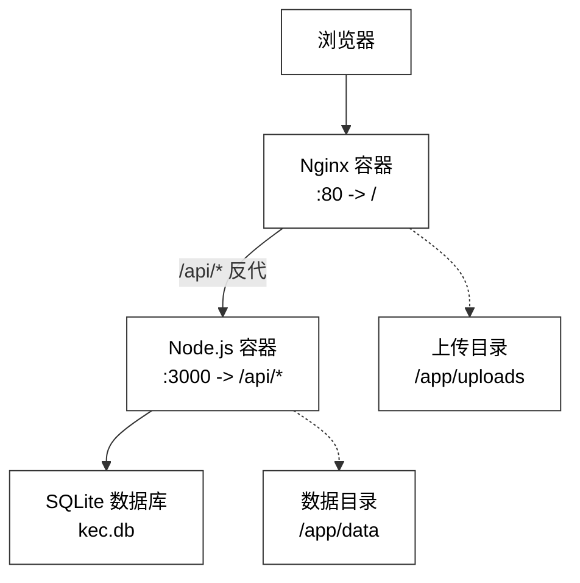
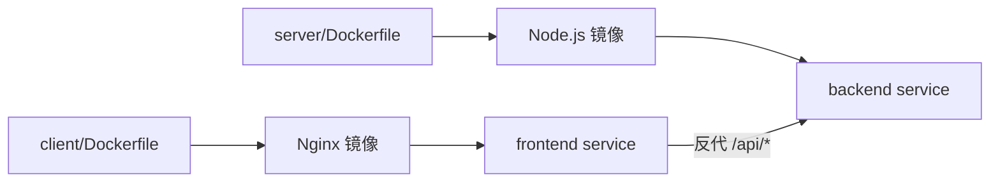
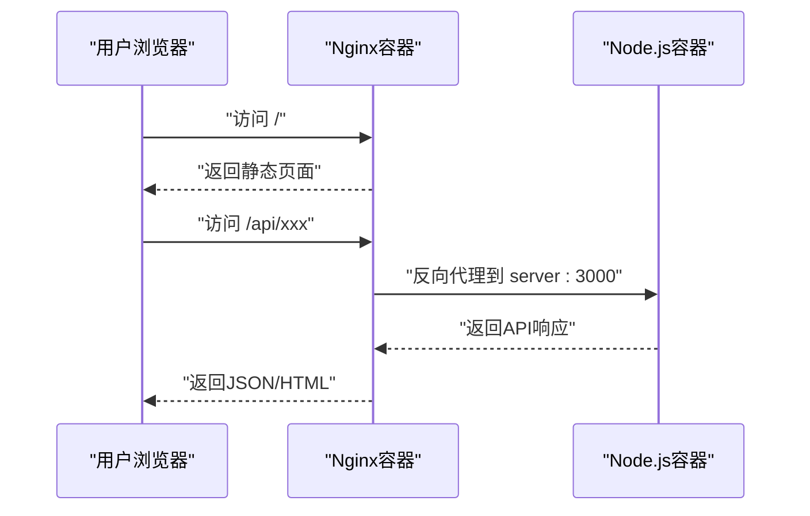

# Docker容器化部署

<cite>
**本文引用的文件**
- [docker-compose.yml](file://docker-compose.yml)
- [client/Dockerfile](file://client/Dockerfile)
- [server/Dockerfile](file://server/Dockerfile)
- [client/nginx.conf](file://client/nginx.conf)
- [client/package.json](file://client/package.json)
- [server/package.json](file://server/package.json)
- [client/.dockerignore](file://client/.dockerignore)
- [server/.dockerignore](file://server/.dockerignore)
- [deploy.sh](file://deploy.sh)
- [deploy_ssh.sh](file://deploy_ssh.sh)
- [docs/PRODUCTION_DEPLOYMENT.md](file://docs/PRODUCTION_DEPLOYMENT.md)
</cite>

## 目录
1. [简介](#简介)
2. [项目结构](#项目结构)
3. [核心组件](#核心组件)
4. [架构总览](#架构总览)
5. [详细组件分析](#详细组件分析)
6. [依赖关系分析](#依赖关系分析)
7. [性能考量](#性能考量)
8. [故障排查指南](#故障排查指南)
9. [结论](#结论)
10. [附录](#附录)

## 简介
本指南面向KEC课程管理平台的Docker容器化部署，基于仓库中的Compose与Dockerfile配置，提供从环境准备、镜像构建、容器编排、网络与数据卷、环境变量与健康检查，到容器间通信、端口映射、常见问题排查与调试技巧的完整说明。文档同时给出部署命令与启动流程，并强调生产环境的安全与稳定性要点。

## 项目结构
KEC项目采用前后端分离的多模块结构，Docker化围绕两个独立服务展开：
- 前端服务（Nginx静态站点）：负责构建产物托管与API反向代理
- 后端服务（Node.js + SQLite）：提供REST API、认证鉴权、业务逻辑与数据库访问
- 网络：通过自定义桥接网络实现服务间互通
- 数据卷：持久化SQLite数据库与上传文件目录

图表来源
- [docker-compose.yml:4-73](file://docker-compose.yml#L4-L73)
- [client/nginx.conf:48-56](file://client/nginx.conf#L48-L56)

章节来源
- [docker-compose.yml:1-73](file://docker-compose.yml#L1-L73)
- [client/nginx.conf:1-72](file://client/nginx.conf#L1-L72)

## 核心组件
- 前端服务（client）
  - 基于Nginx提供静态文件服务，内置gzip压缩与安全响应头
  - 通过反向代理将/api/前缀转发至后端服务
  - 暴露80端口，容器名称与端口可通过环境变量定制
- 后端服务（server）
  - 基于Node.js 20，使用Prisma进行数据库访问
  - 内置SQLite数据库（file协议），支持生产环境迁移与种子数据初始化
  - 暴露3000端口，支持健康检查与资源限制
- 网络与数据卷
  - 自定义bridge网络“kec-network”，便于服务发现与隔离
  - 数据卷挂载用于持久化SQLite数据库与上传文件目录

章节来源
- [client/Dockerfile:1-30](file://client/Dockerfile#L1-L30)
- [server/Dockerfile:1-46](file://server/Dockerfile#L1-L46)
- [docker-compose.yml:4-73](file://docker-compose.yml#L4-L73)

## 架构总览
下图展示容器化部署的整体交互：浏览器访问前端Nginx，Nginx将API请求反向代理到后端Node.js；后端通过Prisma访问SQLite数据库；数据通过数据卷持久化。

图表来源
- [client/nginx.conf:48-56](file://client/nginx.conf#L48-L56)
- [server/Dockerfile:34-38](file://server/Dockerfile#L34-L38)
- [docker-compose.yml:22-26](file://docker-compose.yml#L22-L26)

## 详细组件分析

### 前端服务（Nginx）
- 构建与运行
  - 使用两阶段构建：第一阶段使用Node.js Alpine安装依赖并构建，第二阶段使用Nginx Alpine提供静态服务
  - 复制自定义Nginx配置与构建产物至Nginx目录
  - 暴露80端口，容器内默认监听80
- Nginx配置要点
  - gzip压缩与安全响应头
  - 静态资源长期缓存策略
  - API反向代理至server:3000
  - Vue Router历史模式支持
  - 健康检查端点
- 环境变量与端口
  - 端口映射由Compose配置决定，默认映射宿主80->容器80
  - 通过环境变量CONTAINER_PREFIX可定制容器名称
- 数据卷
  - 未显式挂载静态资源目录，构建产物在容器内Nginx根目录

章节来源
- [client/Dockerfile:1-30](file://client/Dockerfile#L1-L30)
- [client/nginx.conf:1-72](file://client/nginx.conf#L1-L72)
- [docker-compose.yml:44-67](file://docker-compose.yml#L44-L67)

### 后端服务（Node.js + SQLite）
- 构建与运行
  - 多阶段构建：安装依赖、生成Prisma客户端、复制源码
  - 运行时安装SQLite运行库，暴露3000端口
  - 健康检查通过HTTP探针访问/api/health
- 数据库与文件
  - 默认使用SQLite file协议，数据库文件位于/app/data/kec.db
  - 上传目录/app/uploads，均通过数据卷持久化
- 环境变量
  - NODE_ENV=production
  - DATABASE_URL=file:/app/data/kec.db
  - PORT=3000
  - JWT_SECRET/JWT_REFRESH_SECRET/JWT_DOWNLOAD_SECRET
  - CORS_ORIGINS
- 健康检查
  - 使用wget探测/api/health，间隔30秒，超时10秒，启动期40秒后生效

章节来源
- [server/Dockerfile:1-46](file://server/Dockerfile#L1-L46)
- [docker-compose.yml:14-33](file://docker-compose.yml#L14-L33)

### 网络与数据卷
- 网络
  - 自定义bridge网络“kec-network”，容器间通过服务名互访
  - 可通过NETWORK_NAME环境变量自定义网络名称
- 数据卷
  - server服务挂载两个目录：
    - ./data -> /app/data（数据库文件）
    - ./uploads -> /app/uploads（上传文件）
  - 建议在宿主机上确保目录存在且具备合适权限

章节来源
- [docker-compose.yml:22-26](file://docker-compose.yml#L22-L26)
- [docker-compose.yml:68-73](file://docker-compose.yml#L68-L73)

### 容器间通信与端口映射
- 通信机制
  - Nginx通过反向代理访问server服务（server:3000）
  - 服务间通过同一自定义网络内的服务名进行DNS解析
- 端口映射
  - 前端：宿主端口由CLIENT_PORT控制，默认80
  - 后端：宿主端口由SERVER_PORT控制，默认3000

章节来源
- [client/nginx.conf:48-56](file://client/nginx.conf#L48-L56)
- [docker-compose.yml:12-13](file://docker-compose.yml#L12-L13)
- [docker-compose.yml:51-52](file://docker-compose.yml#L51-L52)

### 部署命令与启动流程
- 本地Docker Compose部署
  - 设置环境变量（可选）：CONTAINER_PREFIX、SERVER_PORT、CLIENT_PORT、NETWORK_NAME、JWT_SECRET、JWT_REFRESH_SECRET、JWT_DOWNLOAD_SECRET、CORS_ORIGINS
  - 启动：docker compose up -d
  - 停止：docker compose down
  - 查看日志：docker compose logs -f
- 健康检查
  - 前端：Compose内置健康检查，依赖Nginx健康端点
  - 后端：Compose内置健康检查，探测/api/health
- 依赖与资源限制
  - 服务可配置CPU与内存上限与预留
  - 前端依赖后端健康后再启动（depends_on）

章节来源
- [docker-compose.yml:14-33](file://docker-compose.yml#L14-L33)
- [docker-compose.yml:53-55](file://docker-compose.yml#L53-L55)

### 环境变量与配置要点
- 关键变量
  - CONTAINER_PREFIX：容器名称前缀
  - SERVER_PORT/CLIENT_PORT：宿主端口映射
  - NETWORK_NAME：自定义网络名称
  - JWT_SECRET/JWT_REFRESH_SECRET/JWT_DOWNLOAD_SECRET：JWT密钥
  - CORS_ORIGINS：允许的前端域名列表
- .env文件（后端）
  - 建议在后端容器内使用.env文件承载敏感配置
  - 注意：Compose中未直接挂载.env文件，需自行处理

章节来源
- [docker-compose.yml:10-21](file://docker-compose.yml#L10-L21)
- [server/Dockerfile:25-27](file://server/Dockerfile#L25-L27)

## 依赖关系分析
- 组件耦合
  - 前端对后端的强依赖：通过反向代理访问/api/*
  - 后端对数据库的强依赖：SQLite文件位于/app/data
- 外部依赖
  - 前端：Nginx、Node.js（构建阶段）、Vite（构建阶段）
  - 后端：Node.js、Prisma、SQLite运行库
- 可能的循环依赖
  - 当前未发现循环依赖；服务间通过反向代理单向通信

图表来源
- [client/Dockerfile:1-30](file://client/Dockerfile#L1-L30)
- [server/Dockerfile:1-46](file://server/Dockerfile#L1-L46)

章节来源
- [client/package.json:1-33](file://client/package.json#L1-L33)
- [server/package.json:1-53](file://server/package.json#L1-L53)

## 性能考量
- 前端Nginx
  - 启用gzip压缩与静态资源长期缓存，降低带宽与提升首屏速度
  - 建议在生产环境启用HTTPS与CDN
- 后端Node.js
  - 健康检查与资源限制有助于稳定运行
  - SQLite适合小规模部署；大规模场景建议迁移到MySQL/PostgreSQL
- 网络与I/O
  - 数据卷挂载建议使用高性能存储
  - 上传目录与数据库目录分离，便于备份与监控

## 故障排查指南
- 健康检查失败
  - 前端：检查Nginx健康端点与反代配置
  - 后端：检查/api/health接口与数据库连通性
- CORS错误
  - 确认CORS_ORIGINS包含实际域名
- 数据库问题（SQLite）
  - 检查/app/data/kec.db文件权限与存在性
  - 确认Prisma迁移与客户端生成已完成
- 端口冲突
  - 检查宿主端口占用，调整SERVER_PORT/CLIENT_PORT
- 日志定位
  - 使用docker compose logs -f查看实时日志
  - 对照后端日志与Nginx访问/错误日志

章节来源
- [docker-compose.yml:28-33](file://docker-compose.yml#L28-L33)
- [client/nginx.conf:65-70](file://client/nginx.conf#L65-L70)
- [docs/PRODUCTION_DEPLOYMENT.md:204-250](file://docs/PRODUCTION_DEPLOYMENT.md#L204-L250)

## 结论
本指南基于仓库现有配置，提供了KEC课程管理平台的Docker容器化部署蓝图：前后端分离、Nginx反向代理、SQLite数据库、自定义网络与数据卷持久化。建议在生产环境中进一步完善HTTPS、备份策略、日志轮转与监控告警，并根据业务规模评估数据库迁移方案。

## 附录

### Dockerfile构建流程与优化
- 前端（client/Dockerfile）
  - 多阶段构建：构建阶段安装依赖并打包，运行阶段仅保留Nginx与产物
  - 通过.dockerignore排除无关文件，减小镜像体积
- 后端（server/Dockerfile）
  - 多阶段构建：构建阶段生成Prisma客户端，运行阶段仅安装运行时依赖
  - 使用apk安装SQLite运行库，精简镜像
  - 健康检查集成至Dockerfile，便于容器编排

章节来源
- [client/Dockerfile:1-30](file://client/Dockerfile#L1-L30)
- [server/Dockerfile:1-46](file://server/Dockerfile#L1-L46)
- [client/.dockerignore:1-29](file://client/.dockerignore#L1-L29)
- [server/.dockerignore:1-38](file://server/.dockerignore#L1-L38)

### 环境变量与配置清单
- 前端
  - CLIENT_PORT：宿主端口映射
  - CONTAINER_PREFIX：容器名称前缀
- 后端
  - SERVER_PORT：宿主端口映射
  - NETWORK_NAME：网络名称
  - JWT_*：JWT密钥
  - CORS_ORIGINS：CORS域名
  - DATABASE_URL：SQLite文件路径
  - PORT：服务端口

章节来源
- [docker-compose.yml:10-21](file://docker-compose.yml#L10-L21)
- [docker-compose.yml:68-73](file://docker-compose.yml#L68-L73)

### 容器间通信序列图

图表来源
- [client/nginx.conf:48-56](file://client/nginx.conf#L48-L56)
- [docker-compose.yml:53-55](file://docker-compose.yml#L53-L55)